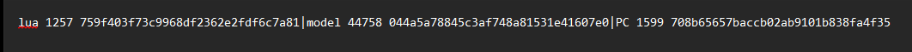
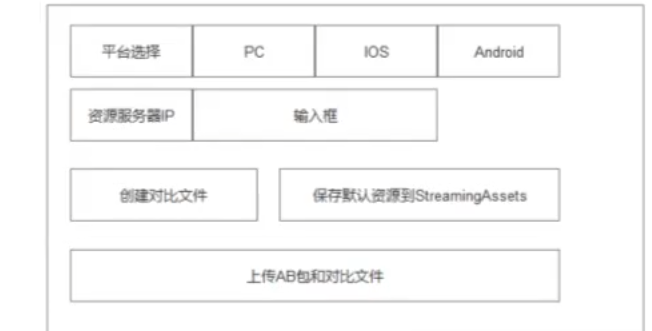
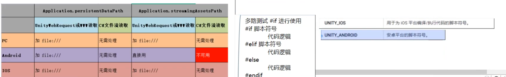

# AB包导入

自己去搜吧 或者唐老师课程那里直接扒 因为Unity已经把AB包移除了


# AB包唯一标识符MD5码的使用

1. 用于对不同AB包资源进行比对 看看有没有更新内容 更新了就下载
2. 一共128位 16个字节

```c#
private string GetMD5(string filePath)
{
    using (FileStream file = new FileStream(filePath, FileMode.Open))
    {
        //声明一个MD5对象 用于生成MD5码
        MD5 md5 = new MD5CryptoServiceProvider();
        //利用API 得到数据的MD5码 16个字节 数组
        byte[] md5Info = md5.ComputeHash(file);

        //关闭文件
        file.Close();

        //16个字节 转换为16进制的字符串 一个byte八位 转化成两位十六进制 最终出来的字符串长度是32
        StringBuilder sb = new StringBuilder();
        for (int i = 0; i < md5Info.Length; i++)
        {
            //转成小写的16进制
            sb.Append(md5Info[i].ToString("x2"));
        }

        return sb.ToString();
    }
}
```


# 编辑器一键生成AB包比对文件

```c#
using System.IO;
using System.Security.Cryptography;
using System.Text;
using UnityEditor;
using UnityEngine;

public class CreateABCompare
{
    [MenuItem("AB包工具/创建对比文件")]
    public static void CreateABCompareFile()
    {
        //得到文件夹信息
        DirectoryInfo directory = Directory.CreateDirectory(Application.dataPath + "/ArtRes/AB/PC");
        //获取所有文件信息
        FileInfo[] fileInfos = directory.GetFiles();

        //用于存储信息的字符串
        string abCompareInfo = "";


        //遍历文件信息
        foreach (FileInfo info in fileInfos)
        {
            //AB 包打包过后是没有后缀的 有后缀的一般都是.meta文件 他不是我们需要的
            //判断有没有后缀
            if (info.Extension == "")
            {
                Debug.Log("文件名: " + info.Name);
                abCompareInfo += info.Name + " " + info.Length + " " + GetMD5(info.FullName);
                //用一个分隔符分开不同文件之间的信息
                abCompareInfo += "|";
            }
        }

        //去掉最后一个分隔符
        abCompareInfo = abCompareInfo.Substring(0, abCompareInfo.Length - 1);

        Debug.Log(abCompareInfo);
        //写入文件
        File.WriteAllText(Application.dataPath + "/ArtRes/AB/PC/ABCompareInfo.txt", abCompareInfo);
        //刷新编辑器
        AssetDatabase.Refresh();

        Debug.Log("AB包对比文件生成完毕");
    }

    private static string GetMD5(string filePath)
    {
        using (FileStream file = new FileStream(filePath, FileMode.Open))
        {
            //声明一个MD5对象 用于生成MD5码
            MD5 md5 = new MD5CryptoServiceProvider();
            //利用API 得到数据的MD5码 16个字节 数组
            byte[] md5Info = md5.ComputeHash(file);

            //关闭文件
            file.Close();

            //16个字节 转换为16进制的字符串
            StringBuilder sb = new StringBuilder();
            for (int i = 0; i < md5Info.Length; i++)
            {
                //转成小写的16进制
                sb.Append(md5Info[i].ToString("x2"));
            }

            return sb.ToString();
        }
    }
    
}
```


# FTP服务器搭建

直接去看视频 但是注意几点

1. ip地址在cmd命令行里面输入ipconfig /all然后找到IPv4 后面那个就是地址
2. 访问ftp服务器的时候别输入ftp://192.168.79.170 而是 直接192.168.79.170 或者 直接127.0.0.1 我也不知道为什么 反正按前者写有ftp://就是没反应 反而后者直接写ip地址就进去了
3. `FtpWebRequest req = FtpWebRequest.Create(new Uri("ftp://127.0.0.1/AB/PC/" + fileName)) as FtpWebRequest; ` 但是 你用代码访问的时候这样写又没问题 太变态了


# 上传AB包资源对比文件与AB包

1. 注意如果上传路径不存在会报错 所以记得提前创建好文件夹
2. 怎么判断有没有上传路径 没有就创建的代码 唐老师没给 可以直接问ai

```c#
using System;
using System.IO;
using System.Net;
using System.Threading.Tasks;
using UnityEditor;
using UnityEngine;

public class UploadAB : MonoBehaviour
{
    [MenuItem("AB包工具/上传所有AB包和对比文件")]
    private static void UploadAllABFile()
    {
        Debug.Log("开始上传");
        //得到文件夹信息
        DirectoryInfo directory = Directory.CreateDirectory(Application.dataPath + "/ArtRes/AB/PC");
        //获取所有文件信息
        FileInfo[] fileInfos = directory.GetFiles();
        Debug.Log("文件数量: " + fileInfos.Length);

        //遍历文件信息
        foreach (FileInfo info in fileInfos)
        {
            //AB 包打包过后是没有后缀的 有后缀的一般都是.meta文件 他不是我们需要的
            //判断有没有后缀 和 是不是对比文件 (文件夹中只有对比文件是.txt 或者你用名字判断也可以)
            if (info.Extension == "" ||
                info.Extension == ".txt")
            {
                //将文件上传到Ftp服务器中 FullName是文件的全路径 Name是文件名
                FtpUploadFile(info.FullName, info.Name);
            }
        }
    }

    private async static void FtpUploadFile(string filePath, string fileName)
    {
        await Task.Run(() => 
        {
            try
            {
                //1.创建一个ftp链接用于上传
                FtpWebRequest req = FtpWebRequest.Create(new Uri("ftp://127.0.0.1/AB/PC/" + fileName)) as FtpWebRequest;
                //2.设置通信凭证才能上传
                NetworkCredential n = new NetworkCredential("Wh1t3zZ", "Lubenweiniu13");
                req.Credentials = n;
                //3.其他设置
                // 设置代理为null
                req.Proxy = null;
                // 请求完毕后 是否关闭控制连接
                req.KeepAlive = false;
                // 操作命令-上传
                req.Method = WebRequestMethods.Ftp.UploadFile;
                // 指定传输的类型 2进制
                req.UseBinary = true;
                //4.上传文件
                // frp的流对象
                Stream upLoadStream = req.GetRequestStream();

                // 读取文件信息 写入该流对象中
                using (FileStream file = File.OpenRead(filePath))
                {
                    //一点一点的上传内容
                    byte[] bytes = new byte[2048];
                    int contentLength = file.Read(bytes, 0, bytes.Length);

                    //循环上传文件中的数据
                    while (contentLength != 0)
                    {
                        //将数据写入到流对象中
                        upLoadStream.Write(bytes, 0, contentLength);
                        //继续读取文件中的数据
                        contentLength = file.Read(bytes, 0, bytes.Length);
                    }

                    //关闭流对象
                    file.Close();
                    upLoadStream.Close();
                }

                Debug.Log(fileName + "  文件上传成功 ");
            }
            catch (Exception ex)
            {
                Debug.Log(fileName + " 上传失败 " + ex.Message);
                return;
            }

        });//异步等待
    }

}

```


# ————————————————

# 以下均是ABUpdateMgr脚本中的 只是拆开好理解 最后会有汇总


# 下载对比文件并且把数据存起来

## 下载对比文件

```c#
 private bool DownLoadFile(string fileName, string localPath)
    {
        try
        {
            //1.创建一个ftp链接用于下载
            FtpWebRequest req = FtpWebRequest.Create(new Uri("ftp://127.0.0.1/AB/PC/" + fileName)) as FtpWebRequest;
            //2.设置通信凭证才能下载 (如果有匿名账号可以不用凭证 但是实际开发还是建议不要设置匿名账号)
            NetworkCredential n = new NetworkCredential("Wh1t3zZ", "Lubenweiniu13");
            req.Credentials = n;
            //3.其他设置
            // 设置代理为null
            req.Proxy = null;
            // 请求完毕后 是否关闭控制连接
            req.KeepAlive = false;
            // 操作命令-下载
            req.Method = WebRequestMethods.Ftp.DownloadFile;
            // 指定传输的类型 2进制
            req.UseBinary = true;
            //4.下载文件
            // frp的流对象
            FtpWebResponse res = req.GetResponse() as FtpWebResponse;
            Stream downLoadStream = res.GetResponseStream();

            // 创建文件信息 写入该流对象中
            using (FileStream file = File.Create(localPath))
            {
                //一点一点的下载内容
                byte[] bytes = new byte[2048];
                int contentLength = downLoadStream.Read(bytes, 0, bytes.Length);

                //循环上传文件中的数据
                while (contentLength != 0)
                {
                    //将数据写入到流对象中
                    file.Write(bytes, 0, contentLength);
                    //继续读取文件中的数据
                    contentLength = downLoadStream.Read(bytes, 0, bytes.Length);
                }

                //关闭流对象
                file.Close();
                downLoadStream.Close();
                return true;
            }
        }
        catch (Exception e)
        {
            print(fileName + " 下载失败 " + e);
            return false;
        }
    }

```


## 拆分与存储

```c#
//用于存储远端AB包信息的字典 之后 和本地进行对比即可完成 更新 下载相关逻辑
private Dictionary<string, ABInfo> remoteABInfo = new Dictionary<string, ABInfo>();

public void DownLoadABCompareFile()
{
    //从资源服务器下载资源对比文件
    //ftp相关api 操作 因为ftp比http难 所以用ftp
    DownLoadFile("ABCompareInfo.txt", Application.persistentDataPath + "/ABCompareInfo.txt");

    //获取资源对比文件中的 字符串信息 进行拆分
    string info = File.ReadAllText(Application.persistentDataPath + "/ABCompareInfo.txt");
    string[] strs = info.Split('|');    //拆分每一个AB
    string[] infos = null;
    for (int i = 0; i < strs.Length; i++)
    {
        infos = strs[i].Split(' ');     //把一个AB包的名字长度md5码拆分出来
        remoteABInfo.Add(infos[0], new ABInfo(infos[0], long.Parse(infos[1]), infos[2]));
    }
	Debug.Log("名字: " + infos[0] + " 大小: " + infos[1] + " md5码: " + infos[2]);
}
```



如何拆分参考这个图片 先拆 `|` 再拆 空格


## 下载所有AB包

```c#
public async void DownLoadABFile(UnityAction<bool> overCallBack, UnityAction<int, int> updataPro)
{
    //1.遍历字典的键 根据文件名 去下载AB包到本地
    foreach (string name in remoteABInfo.Keys)
    {
        //直接放入 待下载列表中
        downLoadList.Add(name);
    }

    //因为多线程不能访问所以卸载外面
    string localPath = Application.persistentDataPath + "/";
    bool isOver = false;
    List<string> tempList = new List<string>();
    //下载失败的重试次数
    int redownLoadMaxNum = 5;
    //下载成功的数量
    int downLoadOverNum = 0;
    //下载的最大数量
    int downLoadMaxNum = downLoadList.Count;
    while (downLoadList.Count > 0 && redownLoadMaxNum > 0)
    {
        for (int i = 0; i < downLoadList.Count; i++)
        {
            isOver = false;
            await Task.Run(() =>
            {
                isOver = DownLoadFile(downLoadList[i], localPath + downLoadList[i]);
            });

            if (isOver)
            {
                //打印进度
                updataPro(++downLoadOverNum, downLoadMaxNum);
                tempList.Add(downLoadList[i]);  //下载成功的记录下来
            }
        }

        //删除下载成功的AB包
        for (int i = 0; i < tempList.Count; i++)
            downLoadList.Remove(tempList[i]);

        redownLoadMaxNum--;
    }

    //下载完毕 回调
    overCallBack(downLoadList.Count == 0);
}
```


```c#
public class Main : MonoBehaviour
{
    void Start()
    {
        ABUpdateMgr.Instance.DownLoadABCompareFile();
        ABUpdateMgr.Instance.DownLoadABFile((isOver) =>
        {
            if (isOver)
            {
                print("下载完毕");
            }
            else
            {
                print("下载失败");
            }
        }, (nowNum, maxNum) =>
        {
            print("下载进度: " + nowNum + "/" + maxNum);
        });
    }
}
```


## 下载对比文件的优化

```c#
public async void DownLoadABCompareFile(UnityAction<bool> overCallBack)
{
    //从资源服务器下载资源对比文件
    //ftp相关api 操作 因为ftp比http难 所以用ftp
    bool isOver = false;
    int redownLoadMaxNum = 5;
    string localPath = Application.persistentDataPath;
    while (!isOver && redownLoadMaxNum > 0)
    {
        await Task.Run(() =>
        {
            isOver = DownLoadFile("ABCompareInfo.txt",localPath + "/ABCompareInfo.txt");
        });

        redownLoadMaxNum--;
    }

    overCallBack?.Invoke(isOver);
}

//获取下载下来的AB包中的信息
public void GetRemoteABCompareFileInfo()
{
    //获取资源对比文件中的 字符串信息 进行拆分
    string info = File.ReadAllText(Application.persistentDataPath + "/ABCompareInfo.txt");
    string[] strs = info.Split('|');    //拆分每一个AB
    string[] infos = null;
    for (int i = 0; i < strs.Length; i++)
    {
        infos = strs[i].Split(' ');     //把一个AB包的名字长度md5码拆分出来
        remoteABInfo.Add(infos[0], new ABInfo(infos[0], long.Parse(infos[1]), infos[2]));
        Debug.Log("名字: " + infos[0] + " 大小: " + infos[1] + " md5码: " + infos[2]);
    }
}
```


```c#
using UnityEngine;

public class Main : MonoBehaviour
{
    void Start()
    {
        ABUpdateMgr.Instance.DownLoadABCompareFile((isOver) =>
        {
            if (isOver)
            {
                ABUpdateMgr.Instance.GetRemoteABCompareFileInfo();

                //因为解析AB包改成了异步模式 所以给他塞到里面 之前是同步所以没塞进去
                ABUpdateMgr.Instance.DownLoadABFile((isOver) =>
                {
                    if (isOver)
                    {
                        print("下载完毕");
                    }
                    else
                    {
                        print("下载失败");
                    }
                }, (nowNum, maxNum) =>
                {
                    print("下载进度: " + nowNum + "/" + maxNum);
                });
            }
            else
            {
                print("下载失败");
            }
        });
    }
}
```


# 资源更新

## 编辑器功能 – 设置默认资源

```c#
using System.IO;
using UnityEditor;
using UnityEngine;

public class MoveABToSA : MonoBehaviour
{
    [MenuItem("AB包工具/移动选中资源到StreamingAssets")]
    private static void MoveABToStreamingAssets()
    {
        //获取你在Project窗口中选中的资源
        Object[] selectedAsset = Selection.GetFiltered(typeof(Object), SelectionMode.DeepAssets);
        //如果一个资源都没有选择 就没有必要处理后面的逻辑了
        if (selectedAsset.Length == 0) return;

        //用于凭借本地默认AB包资源信息的字符串
        string abCompareInfo = "";


        foreach (Object asset in selectedAsset)
        {
            //通过AssetDatabase 得到资源的路径 然后通过路径得到资源的类型
            string assetPath = AssetDatabase.GetAssetPath(asset);
            //如果文件有后缀就不是AB包 是不小心选错的
            string fileName = assetPath.Substring(assetPath.LastIndexOf("/") + 1);
            if (fileName.Contains(".")) continue;
            AssetDatabase.CopyAsset(assetPath, Application.streamingAssetsPath + "/" + fileName);

            //获取拷贝到StreamingAssets的资源的信息 用于生成对比文件
            FileInfo fileInfo = new FileInfo(Application.streamingAssetsPath + "/" + fileName);

            //拼接AB包信息到字符串中
            abCompareInfo += fileInfo.Name + " " + CreateABCompare.GetMD5(fileInfo.FullName);
            //用一个符号隔开多个AB包信息
            abCompareInfo += "|";
        }
        //去掉最后一个"|" 符号
        abCompareInfo = abCompareInfo.Substring(0, abCompareInfo.Length - 1);
        //将本地默认资源的对比信息 存入文件
        File.WriteAllText(Application.streamingAssetsPath + "/ABCompareInfo.txt", abCompareInfo);
        //刷新编辑器 
        AssetDatabase.Refresh();
    }
}

```


# 上传指定资源服务器与ABMgr汇总

窗口设计



```c#
using System;
using System.IO;
using System.Net;
using System.Security.Cryptography;
using System.Text;
using System.Threading.Tasks;
using UnityEditor;
using UnityEngine;

public class ABTools : EditorWindow
{
    private int nowSelIndex = 0;
    private string[] targetStrings = new string[] { "PC", "Android", "IOS" };

    private string serverIP = "ftp://127.0.0.1";

    [MenuItem("AB包工具/打开工具窗口")]
    public static void OpenWindow()
    {
        ABTools window = EditorWindow.GetWindowWithRect(typeof(ABTools), new Rect(0, 0, 350, 220)) as ABTools;
        window.Show();
    }

    private void OnGUI()
    {
        GUI.Label(new Rect(10, 10, 150, 15), "平台选择");
        //页签显示 是从数组中取出字符串内容来显示 所以 需要改变当前选中的索引
        nowSelIndex = GUI.Toolbar(new Rect(10, 30, 250, 20), nowSelIndex, targetStrings);
        //资源服务器IP地址设置
        GUI.Label(new Rect(10, 60, 150, 15), "资源服务器IP地址");
        serverIP = GUI.TextField(new Rect(10, 80, 250, 20), serverIP);
        //创建对比文件按钮
        if (GUI.Button(new Rect(10, 110, 100, 40), "创建对比文件"))
        {
            CreateABCompareFile();
        }
        //保存默认资源到 StreamingAssets 目录下
        if (GUI.Button(new Rect(120, 110, 220, 40), "保存默认资源到StreamingAssets"))
        {
            MoveABToStreamingAssets();
        }

        //上传AB包和对比文件 按钮
        if (GUI.Button(new Rect(10, 160, 330, 40), "上传AB包和对比文件"))
        {
            UploadAllABFile();
        }

    }

    //生成AB包对比文件
    private void CreateABCompareFile()
    {
        //得到文件夹信息 根据选择平台读取对应文件夹下的内容
        DirectoryInfo directory = Directory.CreateDirectory(Application.dataPath + "/ArtRes/AB/" + targetStrings[nowSelIndex]);
        //获取所有文件信息
        FileInfo[] fileInfos = directory.GetFiles();

        //用于存储信息的字符串
        string abCompareInfo = "";

        //遍历文件信息
        foreach (FileInfo info in fileInfos)
        {
            //AB 包打包过后是没有后缀的 有后缀的一般都是.meta文件 他不是我们需要的
            //判断有没有后缀
            if (info.Extension == "")
            {
                Debug.Log("文件名: " + info.Name);
                abCompareInfo += info.Name + " " + info.Length + " " + GetMD5(info.FullName);
                //用一个分隔符分开不同文件之间的信息
                abCompareInfo += "|";
            }
        }

        //去掉最后一个分隔符
        abCompareInfo = abCompareInfo.Substring(0, abCompareInfo.Length - 1);

        Debug.Log(abCompareInfo);
        //写入文件
        File.WriteAllText(Application.dataPath + "/ArtRes/AB/" + targetStrings[nowSelIndex] + "/ABCompareInfo.txt", abCompareInfo);
        //刷新编辑器
        AssetDatabase.Refresh();

        Debug.Log("AB包对比文件生成完毕");
    }
    //获取资源的MD5码
    private string GetMD5(string filePath)
    {
        using (FileStream file = new FileStream(filePath, FileMode.Open))
        {
            //声明一个MD5对象 用于生成MD5码
            MD5 md5 = new MD5CryptoServiceProvider();
            //利用API 得到数据的MD5码 16个字节 数组
            byte[] md5Info = md5.ComputeHash(file);

            //关闭文件
            file.Close();

            //16个字节 转换为16进制的字符串
            StringBuilder sb = new StringBuilder();
            for (int i = 0; i < md5Info.Length; i++)
            {
                //转成小写的16进制
                sb.Append(md5Info[i].ToString("x2"));
            }

            return sb.ToString();
        }
    }
    //移动AB包资源到StreamingAssets
    private void MoveABToStreamingAssets()
    {
        //获取你在Project窗口中选中的资源
        UnityEngine.Object[] selectedAsset = Selection.GetFiltered(typeof(UnityEngine.Object), SelectionMode.DeepAssets);
        //如果一个资源都没有选择 就没有必要处理后面的逻辑了
        if (selectedAsset.Length == 0) return;

        //用于凭借本地默认AB包资源信息的字符串
        string abCompareInfo = "";


        foreach (UnityEngine.Object asset in selectedAsset)
        {
            //通过AssetDatabase 得到资源的路径 然后通过路径得到资源的类型
            string assetPath = AssetDatabase.GetAssetPath(asset);
            //如果文件有后缀就不是AB包 是不小心选错的
            string fileName = assetPath.Substring(assetPath.LastIndexOf("/") + 1);
            if (fileName.Contains(".")) continue;
            AssetDatabase.CopyAsset(assetPath, Application.streamingAssetsPath + "/" + fileName);

            //获取拷贝到StreamingAssets的资源的信息 用于生成对比文件
            FileInfo fileInfo = new FileInfo(Application.streamingAssetsPath + "/" + fileName);

            //拼接AB包信息到字符串中
            abCompareInfo += fileInfo.Name + " " + CreateABCompare.GetMD5(fileInfo.FullName);
            //用一个符号隔开多个AB包信息
            abCompareInfo += "|";
        }
        //去掉最后一个"|" 符号
        abCompareInfo = abCompareInfo.Substring(0, abCompareInfo.Length - 1);
        //将本地默认资源的对比信息 存入文件
        File.WriteAllText(Application.streamingAssetsPath + "/ABCompareInfo.txt", abCompareInfo);
        //刷新编辑器 
        AssetDatabase.Refresh();
    }
    //上传所有AB包
    private void UploadAllABFile()
    {
        Debug.Log("开始上传");
        //得到文件夹信息
        DirectoryInfo directory = Directory.CreateDirectory(Application.dataPath + "/ArtRes/AB/" + targetStrings[nowSelIndex]);
        //获取所有文件信息
        FileInfo[] fileInfos = directory.GetFiles();
        Debug.Log("文件数量: " + fileInfos.Length);

        //遍历文件信息
        foreach (FileInfo info in fileInfos)
        {
            //AB 包打包过后是没有后缀的 有后缀的一般都是.meta文件 他不是我们需要的
            //判断有没有后缀 和 是不是对比文件 (文件夹中只有对比文件是.txt 或者你用名字判断也可以)
            if (info.Extension == "" ||
                info.Extension == ".txt")
            {
                //将文件上传到Ftp服务器中 FullName是文件的全路径 Name是文件名
                FtpUploadFile(info.FullName, info.Name);
            }
        }
    }
    //上传AB包到FTP服务器
    private async void FtpUploadFile(string filePath, string fileName)
    {
        await Task.Run(() => 
        {
            try
            {
                //1.创建一个ftp链接用于上传
                FtpWebRequest req = FtpWebRequest.Create(new Uri(serverIP + "/AB/" + targetStrings[nowSelIndex] + "/" + fileName)) as FtpWebRequest;
                //2.设置通信凭证才能上传
                NetworkCredential n = new NetworkCredential("Wh1t3zZ", "Lubenweiniu13");
                req.Credentials = n;
                //3.其他设置
                // 设置代理为null
                req.Proxy = null;
                // 请求完毕后 是否关闭控制连接
                req.KeepAlive = false;
                // 操作命令-上传
                req.Method = WebRequestMethods.Ftp.UploadFile;
                // 指定传输的类型 2进制
                req.UseBinary = true;
                //4.上传文件
                // frp的流对象
                Stream upLoadStream = req.GetRequestStream();

                // 读取文件信息 写入该流对象中
                using (FileStream file = File.OpenRead(filePath))
                {
                    //一点一点的上传内容
                    byte[] bytes = new byte[2048];
                    int contentLength = file.Read(bytes, 0, bytes.Length);

                    //循环上传文件中的数据
                    while (contentLength != 0)
                    {
                        //将数据写入到流对象中
                        upLoadStream.Write(bytes, 0, contentLength);
                        //继续读取文件中的数据
                        contentLength = file.Read(bytes, 0, bytes.Length);
                    }

                    //关闭流对象
                    file.Close();
                    upLoadStream.Close();
                }

                Debug.Log(fileName + "  文件上传成功 ");
            }
            catch (Exception ex)
            {
                Debug.Log(fileName + " 上传失败 " + ex.Message);
                return;
            }

        });//异步等待
    }
}

```


根据客户端进行的路径优化



```c#
using System;
using System.Collections;
using System.Collections.Generic;
using System.IO;
using System.Net;
using System.Threading.Tasks;
using UnityEngine;
using UnityEngine.Events;
using UnityEngine.Networking;

public class ABUpdateMgr : MonoBehaviour
{
    private static ABUpdateMgr instance;

    public static ABUpdateMgr Instance
    {
        get
        {
            if (instance == null)
            {
                GameObject obj = new GameObject("ABUpdateMgr");
                instance = obj.AddComponent<ABUpdateMgr>();
            }
            return instance;
        }
    }

    //用于存储远端AB包信息的字典 之后 和本地进行对比即可完成 更新 下载相关逻辑
    private Dictionary<string, ABInfo> remoteABInfo = new Dictionary<string, ABInfo>();
    //用于存储本地AB包信息的字典 之后 和远端进行对比即可完成 更新 下载相关逻辑
    private Dictionary<string, ABInfo> localABInfo = new Dictionary<string, ABInfo>();

    //这个是待下载的AB包列表文件 存储AB包的名字
    private List<string> downLoadList = new List<string>();

    private string serverIP = "ftp://127.0.0.1";
    private string userName = "Wh1t3zZ";
    private string password = "Lubenweiniu13";

    public void CheckUpdate(UnityAction<bool> overCallBack, UnityAction<string> updateInfoCallBack)
    {
        localABInfo.Clear();
        remoteABInfo.Clear();
        //Debug.Log(Application.persistentDataPath);
        //1.加载远端资源对比文件
        DownLoadABCompareFile((isOver) =>
        {
            updateInfoCallBack("开始资源更新");
            if (isOver)
            {
                updateInfoCallBack("远端对比文件下载成功");
                string remoteInfo = File.ReadAllText(Application.persistentDataPath + "/ABCompareInfo_TMP.txt");
                updateInfoCallBack("开始解析对比文件");
                GetABCompareFileInfo(remoteInfo, remoteABInfo);
                updateInfoCallBack("解析远端对比文件成功");
            }
            else
            {
                overCallBack?.Invoke(false);
            }

            //2.加载本地资源对比文件
            GetLocalABCompareFileInfo((isOver) =>
            {
                if (isOver)
                {
                    updateInfoCallBack("开始解析本地对比文件成功");
                    //3.对比AB包信息 得到需要更新的AB包列表 得到需要删除的AB包列表 得到需要下载的AB包列表
                    updateInfoCallBack("开始对比AB包信息");

                    foreach (string abName in remoteABInfo.Keys)
                    {
                        if (!localABInfo.ContainsKey(abName))
                        {
                            //本地没有这个AB包 说明需要下载
                            downLoadList.Add(abName);
                        }
                        else
                        {
                            //本地有这个AB包 但是md5码不同 说明需要更新
                            if (localABInfo[abName].md5 != remoteABInfo[abName].md5) downLoadList.Add(abName);

                            //更新完就把这个AB包从本地AB包信息字典中移除 用于后面判断本地资源是否多余要删除
                            localABInfo.Remove(abName);
                        }
                    }
                    updateInfoCallBack("对比AB包信息成功");

                    updateInfoCallBack("开始删除多余的AB包");
                    //删除没用的内容 再下载新的AB包
                    foreach (string abName in localABInfo.Keys)
                    {
                        //本地有这个AB包才能删
                        if (File.Exists(Application.persistentDataPath + "/" + abName))
                            File.Delete(Application.persistentDataPath + "/" + abName);
                    }
                    updateInfoCallBack("删除多余的AB包成功");

                    updateInfoCallBack("开始下载AB包");
                    DownLoadABFile((isOver) =>
                    {
                        if (isOver)
                        {
                            updateInfoCallBack("下载AB包成功");
                            //更新完对比文件 覆盖
                            File.Copy(Application.persistentDataPath + "/ABCompareInfo_TMP.txt", Application.persistentDataPath + "/ABCompareInfo.txt", true);
                        }
                        overCallBack?.Invoke(isOver);
                    }, updateInfoCallBack);
                }
                else
                    overCallBack(false);
            });
        });
    }

    public async void DownLoadABCompareFile(UnityAction<bool> overCallBack)
    {
        //从资源服务器下载资源对比文件
        //ftp相关api 操作 因为ftp比http难 所以用ftp
        bool isOver = false;
        int redownLoadMaxNum = 5;
        string localPath = Application.persistentDataPath;
        while (!isOver && redownLoadMaxNum > 0)
        {
            await Task.Run(() =>
            {
                //下载为临时文件 成功后再覆盖 不然下载失败还把对比文件改了就完了
                isOver = DownLoadFile("ABCompareInfo.txt", localPath + "/ABCompareInfo_TMP.txt");
            });

            redownLoadMaxNum--;
        }

        overCallBack?.Invoke(isOver);
    }

    //获取下载下来的AB包中的信息
    public void GetABCompareFileInfo(string info, Dictionary<string, ABInfo> ABInfo)
    {
        //外部传进来用 存入哪个字典也外部传进来
        string[] strs = info.Split('|');    //拆分每一个AB
        string[] infos;
        for (int i = 0; i < strs.Length; i++)
        {
            infos = strs[i].Split(' ');     //把一个AB包的名字长度md5码拆分出来
            
            ABInfo.Add(infos[0], new ABInfo(infos[0], long.Parse(infos[1]), infos[2]));
        }
    }

    public void GetLocalABCompareFileInfo(UnityAction<bool> overCallBack)
    {
        //如果有对比文件 说明不是第一次了 直接用这个对比文件
        if (File.Exists(Application.persistentDataPath + "/ABCompareInfo.txt"))
        {
            StartCoroutine(GetLocalABCompareFileInfoIEnumerator("file:///" + Application.persistentDataPath + "/ABCompareInfo.txt", overCallBack));
        }
        else if (File.Exists(Application.streamingAssetsPath + "/ABCompareInfo.txt"))
        {
            string path =
            #if UNITY_ANDROID
            Application.streamingAssetsPath;
            #else
            "file:///" + Application.streamingAssetsPath;
            #endif
            //如果没有对比文件 说明是第一次 直接用StreamingAssets中的对比文件
            StartCoroutine(GetLocalABCompareFileInfoIEnumerator(path + "/ABCompareInfo.txt", overCallBack));
        }
        //如果两个都不进 就说明没有默认资源 直接下载
        else overCallBack(true);
    }

    private IEnumerator GetLocalABCompareFileInfoIEnumerator(string filePath, UnityAction<bool> overCallBack)
    {
        //通过 UnityWebRequest 去加载本地文件
        UnityWebRequest req = UnityWebRequest.Get(filePath);
        yield return req.SendWebRequest();
        //获取文件成功 继续往下执行
        if (req.result == UnityWebRequest.Result.Success)
        {
            GetABCompareFileInfo(req.downloadHandler.text, localABInfo);
            overCallBack?.Invoke(true);
        }
        else overCallBack?.Invoke(false);
    }

    public async void DownLoadABFile(UnityAction<bool> overCallBack, UnityAction<string> updataPro)
    {
        //因为多线程不能访问所以写在外面
        string localPath = Application.persistentDataPath + "/";
        bool isOver = false;
        List<string> tempList = new List<string>();
        //下载失败的重试次数
        int redownLoadMaxNum = 5;
        //下载成功的数量
        int downLoadOverNum = 0;
        //下载的最大数量
        int downLoadMaxNum = downLoadList.Count;
        while (downLoadList.Count > 0 && redownLoadMaxNum > 0)
        {
            for (int i = 0; i < downLoadList.Count; i++)
            {
                isOver = false;
                await Task.Run(() =>
                {
                    isOver = DownLoadFile(downLoadList[i], localPath + downLoadList[i]);
                });

                if (isOver)
                {
                    //打印进度
                    updataPro(++downLoadOverNum + "/" + downLoadMaxNum);
                    tempList.Add(downLoadList[i]);  //下载成功的记录下来
                }
            }

            //删除下载成功的AB包
            for (int i = 0; i < tempList.Count; i++)
                downLoadList.Remove(tempList[i]);

            redownLoadMaxNum--;
        }

        //下载完毕 回调
        overCallBack(downLoadList.Count == 0);
    }

    private bool DownLoadFile(string fileName, string localPath)
    {
        try
        {
            string pInfo =
            #if UNITY_IOS
            "IOS"
            #elif UNITY_ANDROID
            "ANDROID"
            #else
            "PC";
            #endif
            //1.创建一个ftp链接用于下载
            FtpWebRequest req = FtpWebRequest.Create(new Uri( serverIP + "/AB/" + pInfo + "/" + fileName)) as FtpWebRequest;
            //2.设置通信凭证才能下载 (如果有匿名账号可以不用凭证 但是实际开发还是建议不要设置匿名账号)
            NetworkCredential n = new NetworkCredential(userName, password);
            req.Credentials = n;
            //3.其他设置
            // 设置代理为null
            req.Proxy = null;
            // 请求完毕后 是否关闭控制连接
            req.KeepAlive = false;
            // 操作命令-下载
            req.Method = WebRequestMethods.Ftp.DownloadFile;
            // 指定传输的类型 2进制
            req.UseBinary = true;
            //4.下载文件
            // frp的流对象
            FtpWebResponse res = req.GetResponse() as FtpWebResponse;
            Stream downLoadStream = res.GetResponseStream();

            // 创建文件信息 写入该流对象中
            using (FileStream file = File.Create(localPath))
            {
                //一点一点的下载内容
                byte[] bytes = new byte[2048];
                int contentLength = downLoadStream.Read(bytes, 0, bytes.Length);

                //循环上传文件中的数据
                while (contentLength != 0)
                {
                    //将数据写入到流对象中
                    file.Write(bytes, 0, contentLength);
                    //继续读取文件中的数据
                    contentLength = downLoadStream.Read(bytes, 0, bytes.Length);
                }

                //关闭流对象
                file.Close();
                downLoadStream.Close();
                return true;
            }
        }
        catch (Exception e)
        {
            print(fileName + " 下载失败 " + e);
            return false;
        }
    }

    private void OnDestroy()
    {
        instance = null;
    }

    public class ABInfo
    {
        public string name; //名字
        public long size;   //大小
        public string md5;  //md5码

        public ABInfo(string name, long size, string md5)
        {
            this.name = name;
            this.size = size;
            this.md5 = md5;
        }
    }
}

```

