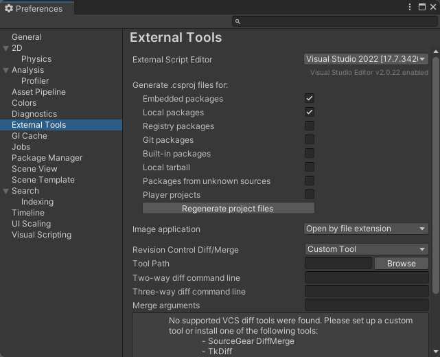
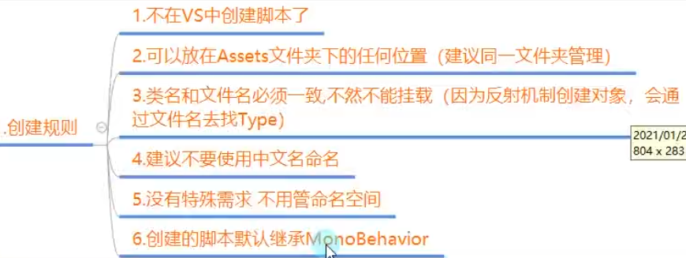
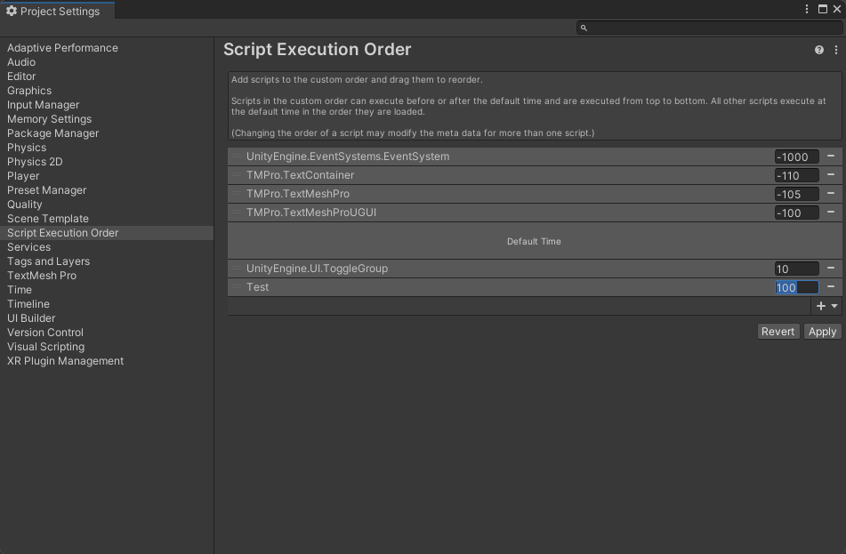
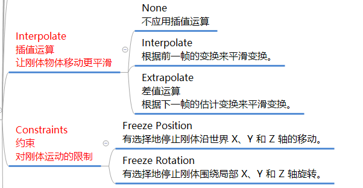

#    Unity 引擎相关


## ————————————

## 以下是Unity入门

## 工程文件夹

| 1.Assert(最重要)  |      工程资源文件夹(美术资源,脚本等)       |
| :---------------: | :----------------------------------------: |
|     2.Library     |        库文件夹(Unity自动生成管理)         |
|      3.Logs       | 日志文件夹,记录特殊信息(Unity自动生成管理) |
|       4.obj       |    编译产生中间文件(Unity自动生成管理)     |
|    5.Packages     |       包配置信息(Unity自动生成管理)        |
| 6.ProjectSettings |      工程设置信息(Unity自动生成管理)       |


## Unity界面基础

### Scene场景和Hierarchy层级窗口

### **Hierarchy 层级窗口**

```markdown
点击右上角Layers旁边的Layout选择布局方式 通常使用 2by3

层级窗口显示的就是场景中所有的对象 Hierarchy窗口左上角的加号(+)创建对象 或者直接在窗口内右键
```

 **Hierarchy层级窗口快捷键**

| F2       | 改对象名 |
| -------- | -------- |
| Ctrl + D | 克隆一个 |
| Delete   | 删除     |

### **Scene场景**


### 引擎窗口


### Game游戏窗口


### Inspector检查窗口

 ```
显示与对象内容相关的脚本信息
 ```


Console控制台窗口

```
显示编译或者游戏运行过程中的报错警告等信息
```


 


### 工具栏和父子关系


#### 工具栏


#### 对象间的父子关系


## Unity工作原理


#### 反射机制和游戏场景

```text
一个运行的程序查看本身或者其他程序的元数据的行为叫做反射
为GameObject添加脚本就是利用反射new一个逻辑或对象和GameObject关联
```


### 预设体和资源包的导入导出


#### 预设体

```
将场景中的GameObject放到Assets文件夹里,下次想在别的场景里用这个对象就可以直接从Assets中拿出来用
如图 把金字塔存了起来,打开别的文件直接拖进去就会有一个金字塔
```


#### 资源包的导入导出

```
导出 Export Package
```


```
导入
```


## Unity脚本基本规则


###　设置编程用工具



### 基本规则




```text
禁止多个脚本挂载
```


```text
4.设置先后执行顺序 
打开Execution Order
添加脚本 时间数值越小越先执行
```




```text
5.修改默认脚本内容
默认脚本内容即创建的C#文件中默认写好的内容
```


### 生命周期函数

```c#
//挂载在GameObject上的c#文件里的函数
//即如开始 每帧更新数据 结束这类函数

//当对象被创建时 才会调用该生命周期函数 跟构造函数一样
void Awake()
{
    //Unity中打印信息的梁总方式
    //1.没有继承MonoBehavior类的时候(继不继承都能用)
    Debug.Log("12");
    //2.继承了MonoBehavior 有一个现成的方法可以使用 
    print("1234");
}

//依附的GameObject对象每次激活时调用
void OnEnable()
{
	...    
}

//从自己被创建出来后第一次帧更新之前调用,比Awake要慢 区别就是Start比Awake慢 仅此而已
void Start()
{
    ...
}

//用于进行物理更新 每一帧都执行 但是和游戏帧不同 可以在Project Settings 的Time里面改变他的执行时间间隔
void FixedUpdate()
{
    ...
}

//主要用于处理游戏核心逻辑更新的函数
void Update()
{
    ...
}

//Update和LateUpdate之间 Unity进行了一些处理 处理我们动画相关的更新
//两者执行的时间间隔是一样的 只是LateUpdate比Update晚执行 但是执行速度是一样的 专门用在摄像机上 应该是怕画面出问题
void LateUpdate()
{
    ...
}

//每次对象失活的时候调用
void OnDisable()
{
    ...
}

//当对象被销毁的时候小勇
//依附的GameObject被删除时
void  OnDestroy()
{
    ...
}

//生命周期函数支持继承多态
```


### Inspector窗口可编辑变量

如图Age就是可编辑变量


#### 基础概念

- **私有和保护成员**：默认不显示在 Inspector 中。
- **公共成员**：默认显示在 Inspector 中，可直接编辑。

#### 控制显示
1. **私有和保护成员显示**：
   - 使用 `[SerializeField]` 特性，可以使私有和保护成员在 Inspector 中显示。
     ```csharp
     [SerializeField]
     private int privateInt;
     ```

2. **公共成员不显示**：
   - 使用 `[HideInInspector]` 特性，可以使公共成员在 Inspector 中不显示。
     ```csharp
     [HideInInspector]
     public int publicInt;
     ```

3. **自定义类型显示**：
   - 对于结构体和类，需要使用 `[System.Serializable]` 特性来允许在 Inspector 中显示。
     
   - 大部分类型都能显示编辑 如枚举 List Array 但字典 结构体 类不行(结构体与类是自定义类型)
     
   - 以下是让自定义类型可以被访问 如结构体和类 但是字典怎么都不行
     
     ```csharp
     [System.Serializable]	//要引用命名空间System 
     public class CustomType {
         // 成员变量
     }
     ```

#### 辅助特性
1. **分组说明特性 Header**：
   - 使用 `[Header("组名")]` 为变量添加分组标题。
     ```csharp
     [Header("基础属性")]
     public int age;
     ```

2. **悬停说明 Tooltip**：
   - 使用 `[Tooltip("描述")]` 为变量添加悬停提示。
     ```csharp
     [Tooltip("闪避")]
     public int x;
     ```

3. **间隔特性 Space**：
   - 使用 `[Space()]` 在变量之间添加空行。
     ```csharp
     [Space()]
     public int x;
     ```

4. **修饰数值的滑条范围 Range**：
   - 使用 `[Range(最小值, 最大值)]` 为数值变量添加滑条。
     ```csharp
     [Range(0, 10)]
     public int x;
     ```

5. **多行显示字符串 Multiline**：
   - 使用 `[Multiline(行数)]` 为字符串变量添加多行显示。
     ```csharp
     [Multiline(5)]
     public string tips;
     ```

6. **滚动条显示字符串 TextArea**：
   - 使用 `TextArea(最小行数, 最大行数)` 为字符串变量添加滚动条。
     ```csharp
     // 最少显示3行，最多4行，超过4行显示滚动条
     [TextArea(3, 4)]
     public string text;
     ```

7. **为变量添加快捷方法 ContextMenuItem**：
   - 使用 `[ContextMenuItem("按钮名", "方法名")]` 为变量添加快捷按钮。
     ```csharp
     [ContextMenuItem("重置钱", "Test")]
     public int money;

     private void Test() {
         money = 99;
     }
     ```

8. **为方法添加特性 ContextMenu**：
   - 使用 `[ContextMenu("按钮名")]` 为方法添加可执行按钮。
     ```csharp
     [ContextMenu("测试函数")]
     private void TestFun() {
         print("测试方法");
     }
     //就是在Inspector中添加一个可以执行这个函数的功能
     //对应c#文件右上角三个点点开找到这个函数就能用了
     ```

#### 注意事项
- ContextMenu 特性的方法必须是无参数且无返回值的。
- 使用特性可以显著提高 Unity 开发的效率和可读性。

```
!!!
1.已经被挂载的脚本即使源文件被修改里面的值也不会变
2.脚本在运行中变化的值在运行结束的时候会被重置,如果想要记录,就要把运行时的数据,脚本复制,然后结束运行,再粘贴上去
```


###  Mono中的重要内容

####  知识点一：重要成员

##### 获取依附的GameObject信息(以下代码this可省略)

- **获取GameObject名称**：
  
  ```csharp
  print(this.gameObject.name);
  ```
- **获取GameObject的位置信息**：
  - 位置：`print(this.transform.position);`
  - 角度：`print(this.transform.eulerAngles);`
  - 缩放大小：`print(this.transform.lossyScale);`

##### 脚本激活状态

- **设置脚本是否激活**：
  
  ```csharp
  this.enabled = false;
  ```

##### 获取其他脚本对象信息

- **获取其他GameObject和Transform位置信息**：(!!注意 要在Inspector窗口将两个GameObject关联才能使用)
  
  ```csharp
  public A a;
  print(a.gameObject.name);
  print(a.transform.position);
  ```
  
  
  
  如图名为A的GameObject含有脚本A,然后B脚本中的a(实际变量名是a但是Unity显示会大写)一栏中(即代码public A a;创建的对象)关联了一个名为A的GameObject中的A脚本

#### 知识点二：重要方法

##### 获取依附对象上挂载的其他脚本

- **以下对自己的描述 均是指GameObject而非挂载的脚本**

- **以下对象的意思均是指GameObject而非C#脚本中的类对象**
- **以下的this均是指脚本本身 而非GameObject**

1. **获取自己挂载的单个脚本**
   
   - 根据脚本名获取：
     
   - 如果获取失败会默认返回空
     
   - 只要能得到场景中别的对象或者对象依附的脚本 就能得到他的所有信息, 因为每个脚本都能获取他所在对象里面所有关联的脚本
     
     ```csharp
     Lesson3_Test t = this.GetComponent("Lesson3_Test") as Lesson3_Test;
     print(t);
     ```
     
   - 根据Type获取：
     ```csharp
     t = this.GetComponent(typeof(Lesson3_Test)) as Lesson3_Test;
     print(t);
     ```
     
- 根据泛型获取（推荐）：
     ```csharp
     t = this.GetComponent<Lesson3_Test>();
     if (t != null)
     {
         print(t);
     }
     ```

2. **获取自己挂载的多个脚本**
   - 获取数组形式：
     ```csharp
     Lesson3[] array = this.GetComponents<Lesson3>();
     print(array.Length);
     ```
   - 获取List形式：
     ```csharp
     List<Lesson3> list = new List<Lesson3>();
     this.GetComponents<Lesson3>(list);
     print(list.Count);
     ```

3. **获取子对象挂载的脚本**
   
   - 不止找子对象上的 自己身上的也会找
   - 孙子也可以找到 只要是自己的后代都能找到
   
   - 单个脚本（包括失活对象）：
     ```csharp
     t = this.GetComponentInChildren<Lesson3_Test>(true);
     print(t);
     ```
   - 多个脚本（包括失活对象）：
     ```csharp
     Lesson3_Test[] lts = this.GetComponentsInChildren<Lesson3_Test>(true);
     print(lts.Length);
     ```
   - List形式（包括失活对象）：
     ```csharp
    List<Lesson3_Test> list2 = new List<Lesson3_Test>();
     this.GetComponentsInChildren<Lesson3_Test>(true, list2);
     print(list2.Count);
     ```
   
4. **获取父对象挂载的脚本**

   - 因为父对象失活子对象甚至不会执行 所以这里获取父对象的脚本就不用填true或false 因为根本不可能获取失活的父对象中的脚本
   - 不止找父对象上的 自己身上的也会找
   - 爷爷也能找到 只要是祖先能能找到

   - 单个脚本：
     ```csharp
     t = this.GetComponentInParent<Lesson3_Test>();	
     print(t);
     ```
   - 多个脚本：
     ```csharp
     lts = this.GetComponentsInParent<Lesson3_Test>();
     print(lts.Length);
     ```

5. **尝试获取脚本**
   
   - 安全获取单个脚本：
   
   - 因为要是没找到会获得一个空脚本 用这个方法可以更安全的获取脚本
   
   	```csharp
   	Lesson3_Test l3t;
   	if (this.TryGetComponent<Lesson3_Test>(out l3t))
   	{
   	    // 逻辑处理
   	}
   	```
   
6. **获取指定名称对象的脚本**

   - 是用到了下面的内容 但是唐老狮笔记没有我自己加的
     
     ```csharp
     GameObject B = GameObject.Find("B");		//先获取指定对象
     Lesson4_B lb = B.GetComponent<Lesson4_B>();	//在获取指定对象的脚本 脚本名即为后面的泛型和前面的类型名称
     if (lb != null) 							//注意判断是否存在这个脚本
     {
         
     }
     ```

​	

​	


## Unity重要组件和Api

### 最小单位GameObject

#### 知识点一：GameObject中的成员变量

- **名字**：可以通过 `gameObject.name` 获取和设置GameObject的名称。
  ```csharp
  print(this.gameObject.name);
  this.gameObject.name = "Lesson4唐老狮改名";
  print(this.gameObject.name);
  ```
- **是否激活**：通过 `gameObject.activeSelf` 判断GameObject是否被激活。
  ```csharp
  print(this.gameObject.activeSelf);
  ```
- **是否是静态**：通过 `gameObject.isStatic` 判断GameObject是否是静态的。
  ```csharp
  print(this.gameObject.isStatic);
  ```
- **层级**：通过 `gameObject.layer` 获取GameObject的层级。
  ```csharp
  print(this.gameObject.layer);
  ```
- **标签**：通过 `gameObject.tag` 获取GameObject的标签。
  ```csharp
  print(this.gameObject.tag);
  ```
- **transform**：通过 `gameObject.transform.position` 获取GameObject的位置信息，与 `this.transform` 获取的信息相同。

#### 知识点二：GameObject中的静态方法

- **创建自带几何体**
  ```csharp
  GameObject obj = GameObject.CreatePrimitive(PrimitiveType.Cube); // 创建一个立方体几何体
  obj.name = "唐老狮创建的立方体"; // 设置立方体的名称
  ```
  创建的几何体默认是激活状态。

- **查找单个对象**
  
  - 通过对象名查找：
    ```csharp
    GameObject obj2 = GameObject.Find("唐老狮"); // 通过名称查找GameObject 
    if (obj2 != null) {
        print(obj2.name); // 如果找到，打印名称
    } else {
        print("没有找到对应对象"); // 如果未找到，打印提示信息
    }
    ```
  
  - 通过标签查找：
  
  ```csharp
  GameObject obj3 = GameObject.FindGameObjectWithTag("Player"); // 通过标签查找GameObject
  GameObject obj3 = GameObject.FindWithTag("Player"); // 与上面那个效果一模一样只是名字不同
  if (obj3 != null) {
      print("根据tag找的对象" + obj3.name); // 如果找到，打印名称
  } else {
      print("根据tag没有找到对应对象"); // 如果未找到，打印提示信息
  }
  ```
  - 两种方法效率较低，因为它会遍历场景中的所有对象。只能找到激活的对象。
  - 而且如果有重名的对象 是无法确定找到的是哪一个的
  
- **查找多个对象**
  ```csharp
  GameObject[] objs = GameObject.FindGameObjectsWithTag("Player"); // 查找所有标签为"Player"的GameObject
  print("找到tag为Player对象的个数" + objs.Length); // 打印找到的对象数量
  ```
  - 此方法只能通过标签查找多个对象，且只能找到激活的对象。

- **查找场景中挂载的某一个脚本对象**
  
  ```csharp
  Lesson4 o = GameObject.FindObjectOfType<Lesson4>(); // 查找场景中挂载Lesson4脚本的第一个GameObject
  print(o.gameObject.name); // 打印找到的GameObject的名称
  ```
此方法效率更低，因为它不仅要遍历对象，还要遍历对象上挂载的脚本。只能找到激活的对象。
  
- **实例化对象（克隆对象）**
  
  ```csharp
  GameObject obj5 = GameObject.Instantiate(myObj); // 实例化（克隆）一个GameObject
  Instantiate(myObj);	//如果是继承自MonoBehavior类的话可以直接这样写,因为MonoBehavior继承自GameObject类 里面有这个方法可以直接用
  ```
- 克隆出来的对象会保留原对象的所有属性和组件，但不会保留原对象的父对象关系。
  - 一般都是克隆预设体 把预设体和脚本的myObj关联 然后就能复制出关联的GameObject对象了
  
  
  
- **删除对象**

  - 立即删除：
    ```csharp
    GameObject.Destroy(myObj2); // 删除一个Game Object
    ```
    
  - 延迟删除：
    ```csharp
    GameObject.Destroy(obj5, 5); // 延迟5秒删除一个GameObject
    ```

  - 删除脚本:

  	```c#
  	GameObject.Destroy(this); // 就直接把这个脚本给删除了
  	```

  	`Destroy`方法不会马上移除对象，只是给这个对象加了一个移除标识，一般情况下它会在下一帧时把这个对象移除并从内存中移除。`DestroyImmediate`方法可以马上移除一个对象,但是不推荐使用。如果没有特殊需求，建议使用`Destroy`方法，因为它是异步的，可以降低卡顿的几率。

- **过场景不移除**
  ```csharp
  GameObject.DontDestroyOnLoad(this.gameObject); // 使自己脚本依附的对象在切换场景的时候不被删除
  ```
  通常用于不希望在场景切换时被销毁的游戏对象，如玩家数据或游戏设置等。

#### 知识点三：GameObject中的成员方法

- **创建空物体**：使用 `new GameObject()` 创建一个新的空GameObject。
  ```csharp
  GameObject obj6 = new GameObject();
  GameObject obj7 = new GameObject("唐老狮创建的空物体");
  GameObject obj8 = new GameObject("顺便加脚本的空物体", typeof(Lesson2),typeof(Lesson1)); //创建出空物体而且给他挂上两个脚本
  ```
- **为对象添加脚本**：使用 `AddComponent` 方法为GameObject添加脚本。
  
  ```csharp
  Lesson1 les1 = obj6.AddComponent(typeof(Lesson1)) as Lesson1; 
  Lesson2 les2 = obj6.AddComponent<Lesson2>();				//等于号及前面的东西是可以不写的 也能添加上脚本 写了就表示前面获得了脚本
  ```
- **标签比较**：使用 `gameObject.CompareTag("Player")` 或 `gameObject.tag == "Player"` 比较标签。
- **设置激活失活**：使用 `SetActive` 方法设置GameObject的激活状态。
  
  ```csharp
  obj6.SetActive(false);
  ```
- **通知自己执行行为**：使用 `gameObject.SendMessage("TestFun")` 命令自己执行特定函数。
- **广播行为**：使用 `gameObject.BroadcastMessage("函数名")` 广播消息，让自己和子对象执行特定函数。
- **向父对象和自己发送消息**：使用 `gameObject.SendMessageUpwards("函数名")` 向父对象和自己发送消息并执行特定函数。

#### 总结：Unity GameObject 核心概念

##### 1. GameObject 成员变量

- **名字**：`gameObject.name` 用于获取或设置GameObject的名称。
- **激活状态**：`gameObject.activeSelf` 检查GameObject是否激活。
- **静态状态**：`gameObject.isStatic` 检查GameObject是否设置为静态。
- **层级**：`gameObject.layer` 获取GameObject的层级。
- **标签**：`gameObject.tag` 获取GameObject的标签。
- **位置信息**：`gameObject.transform.position` 获取GameObject的位置。

##### 2. GameObject 静态方法

- **创建几何体**：`GameObject.CreatePrimitive(PrimitiveType.Cube)` 创建基本几何体。
- **查找对象**：
  - 通过名称：`GameObject.Find("名称")`。
  - 通过标签：`GameObject.FindWithTag("标签")`。
  - 查找多个对象：`GameObject.FindGameObjectsWithTag("标签")`。
- **实例化对象**：`GameObject.Instantiate(myObj)` 克隆一个GameObject。
- **删除对象**：`GameObject.Destroy(myObj)` 删除一个GameObject，支持延迟删除。
- **跨场景持久化**：`GameObject.DontDestroyOnLoad(myObj)` 使GameObject在场景切换时不被销毁。

##### 3. GameObject 成员方法

- **创建空物体**：`new GameObject()` 创建一个新的空GameObject。
- **添加脚本**：`AddComponent<类型>()` 为GameObject添加脚本组件。
- **标签比较**：`gameObject.CompareTag("标签")` 比较GameObject的标签。
- **激活/失活**：`SetActive(true/false)` 设置GameObject的激活状态。
- **消息发送**：
  - `SendMessage("函数名")` 向当前GameObject发送消息。
  - `BroadcastMessage("函数名")` 向当前GameO   bject及其所有子对象广播消息。
  - `SendMessageUpwards("函数名")` 向当前GameObject及其所有父对象发送消息。


### Unity 时间相关TIme

---

#### 1. 时间缩放比例 (Time.timeScale)
用于控制游戏的时间流速。可以暂停游戏、恢复正常时间流速或调整游戏速度。

```csharp
// 时间停止
Time.timeScale = 0;
// 回复正常
Time.timeScale = 1;
// 2倍速
Time.timeScale = 2;
```

#### 2. 帧间隔时间 (Time.deltaTime)
表示最近一帧所花费的时间（秒）。用于计算位移等与帧率无关的操作。

```csharp
// 帧间隔时间：最近的一帧用了多长时间（秒）主要用来计算位移
// 受scale影响 如果scale为0则帧间隔一直为0即不计时 但是下面那个还会计时   
print("帧间隔时间: " + Time.deltaTime);	
// 不受scale影响的帧间隔时间
print("不受scale影响的帧间隔时间: " + Time.unscaledDeltaTime);
```

#### 3. 游戏开始到现在的时间 (Time.time)
表示从游戏开始到现在经过的时间。用于计时等。

```csharp
// 游戏开始到现在的时间
// 受scale影响
print("游戏开始到现在的时间: " + Time.time);
// 不受scale影响
print("不受scale影响的游戏开始到现在的时间: " + Time.unscaledTime);
```

#### 4. 物理帧间隔时间 (Time.fixedDeltaTime)
用于物理计算的固定帧间隔时间。通常在`FixedUpdate`方法中使用。

```csharp
private void FixedUpdate()
{
    // 物理帧间隔时间 FixedUpdate 时间是固定死的 在Unity的设置里面可以改 上面的笔记也有提到
    // 受scale影响
    print(Time.fixedDeltaTime);
    // 不受scale影响
    print(Time.fixedUnscaledDeltaTime);
}
```

#### 5. 帧数 (Time.frameCount)
表示从游戏开始到现在经过的帧数。

```csharp
// 从开始到现在游戏跑了多少帧(次循环)
print("总帧数: " + Time.frameCount);
```

---

#### 总结

- **帧间隔时间**：主要用于计算位移等需要帧率无关的操作。
- **时间缩放比例**：用于暂停游戏或调整游戏速度。
- **帧数**：用于帧同步等操作。


### Unity Transform—位置和位移

---

#### Transform主要用来干嘛？

Transform组件用于处理游戏对象（GameObject）的位移、旋转、缩放、父子关系、坐标转换等相关操作。它是Unity中极其重要的类。

#### 知识点一：Vector3基础

Vector3用于表示三维坐标系中的一个点或一个向量。

```csharp
// 声明Vector3
Vector3 v = new Vector3();
v.x = 10;
v.y = 10;
v.z = 10;

// 简写
Vector3 v2 = new Vector3(10, 10);		//只传x y则z默认是0
Vector3 v3 = new Vector3(10, 10, 10);

Vector3 v4;
v4.x = 10;
v4.y = 10;
v4.z = 10;

// Vector3的基本计算
Vector3 v1 = new Vector3(1, 1, 1);
Vector3 v12 = new Vector3(2, 2, 2);
print(v1 + v12);
print(v1 - v12);
print(v1 * 10);
print(v12 / 2);

// 常用静态属性
print(Vector3.zero);    // (0, 0, 0)
print(Vector3.right);   // (1, 0, 0)
print(Vector3.left);    // (-1, 0, 0)
print(Vector3.forward); // (0, 0, 1)
print(Vector3.back);    // (0, 0, -1)
print(Vector3.up);      // (0, 1, 0)
print(Vector3.down);    // (0, -1, 0)

// 计算两个点之间的距离
print(Vector3.Distance(v1, v12));
```

#### 知识点二：位置
位置可以通过`transform.position`和`transform.localPosition`获取，分别表示相对于世界坐标系和父对象的位置。

```csharp
// 相对世界坐标系的位置 可能和面板上显示的不一样 因为如果有父子关系面板则会显示相对父亲的坐标
print(this.transform.position);

// 相对父对象的位置
print(this.transform.localPosition);

// 位置的赋值不能直接改变x，y，z，只能整体改变
this.transform.position.x = 10;		//报错 不能直接改变 只能像下面一个赋一个新的
this.transform.position = new Vector3(10, 10, 10);
this.transform.localPosition = Vector3.up * 10;

// 如果只想改一个值x，y和z要保持原有坐标一致
this.transform.position = new Vector3(19, this.transform.position.y, this.transform.position.z);
Vector3 vPos = this.transform.localPosition;
vPos.x = 10;			//虽然不能直接改transform的但是可以改Vector3的
this.transform.localPosition = vPos;

// 获取对象当前的朝向 就是对象可以旋转 朝向不再是与坐标轴平行的了 比如转了45度则朝向从(1, 0, 0)改为(0.7, 0, 0.7) 0.7就是二分之根号二
print(this.transform.forward);
print(this.transform.up);
print(this.transform.right);
```


#### 知识点三：位移

位移可以通过计算或使用API来实现。

```csharp
// 方式一：自己计算
this.transform.position += this.transform.up * 1 * Time.deltaTime; 		//按自己的朝向动
this.transform.position += this.transform.forward * 1 * Time.deltaTime;
this.transform.position += Vector3.forward * 1 * Time.deltaTime;//按照世界坐标轴的方向动

// 方式二：API 第三个参数是相对坐标系 
this.transform.Translate(Vector3.forward * 1 * Time.deltaTime, Space.World);
this.transform.Translate(this.transform.forward * 1 * Time.deltaTime, Space.World);
this.transform.Translate(Vector3.forward * 1 * Time.deltaTime, Space.Self); //朝自己朝向动
this.transform.Translate(this.transform.forward * 1 * Time.deltaTime, Space.Self);//不会这么使用 相当于现在的Vector3forward就是之前世界坐标系下自己的朝向 然后在这个的基础上再加上自己在世界坐标系上朝向的偏移量 也就是世界坐标系下两倍自己朝向的偏移量的方向去动
```

#### 总结

- **Vector3**：如何声明，提供的常用静态属性和一个计算距离的方法。
- **位置**：相对于世界坐标系和相对于父对象这两个坐标的区别，不能单独修改xyz，只能一起统一改。
- **位移**：自己如何计算来进行位移，API是哪个方法来进行位移，使用时要注意

---


---

### Unity Transform—角度和旋转

---


#### 知识点一：角度相关

角度可以通过`transform.eulerAngles`和`transform.localEulerAngles`获取，分别表示相对于世界坐标系和父对象的角度。

```csharp
// 相对世界坐标角度
print(this.transform.eulerAngles);

// 相对父对象角度
print(this.transform.localEulerAngles);

// 注意：设置角度和设置位置一样，不能单独设置x、y、z，要一起设置
// 如果希望改变的角度是面板上显示的内容，那么一定是改变相对父对象的角度
this.transform.localEulerAngles = new Vector3(10, 10, 10);
// 或者
this.transform.eulerAngles = new Vector3(10, 10, 10);
print(this.transform.localEulerAngles);
```

#### 知识点二：旋转相关

旋转可以通过自己计算或使用API来实现。

```csharp
//角度的计算方面和位置是一样的 (省略)

// 自转
// 每个轴具体转多少度
// 第一个参数相当于是每一帧旋转的角度 前面的new Vector3是相对于这个轴坐标转
// 第二个参数默认不填就是相对于自己坐标系进行的旋转
this.transform.Rotate(new Vector3(0, 10, 0) * Time.deltaTime);//deltaTime写在10 * deltaTime也可以
// 或者相对于世界坐标系进行旋转
this.transform.Rotate(new Vector3(0, 10, 0) * Time.deltaTime, Space.World);

// 相对于某个轴转多少度
// 参数一：是相对哪个轴进行转动
// 参数二：是转动的角度是多少 其实就是角速度
// 参数三：默认不填就是相对于自己的坐标系进行旋转，如果填可以填写相对于世界坐标系进行旋转
this.transform.Rotate(Vector3.right, 10 * Time.deltaTime);
// 或者相对于世界坐标系进行旋转
this.transform.Rotate(Vector3.right, 10 * Time.deltaTime, Space.World);

// 相对于某一个点转
// 参数一：相当于哪一个点转圈圈
// 参数二：相对于那一个点的哪一个轴转圈圈
// 参数三：转的度数（旋转速度 * 时间）
this.transform.RotateAround(Vector3.zero, Vector3.right, 10 * Time.deltaTime);
```

#### 总结

- **角度**：如何获取和设置相对世界坐标系和相对父对象的角度。
- **旋转**：如何通过自己计算或使用API来实现旋转，包括自转、相对于某个轴旋转和相对于某一个点旋转。
- **注意!**: 欧拉角得到的度数只能是0-360度的正数 虽然面板显示的是负数但是代码只能得到正数

---


------

### Unity Transform—缩放和看向功能

---

#### 知识点一：缩放

缩放涉及到两个属性：`lossyScale`和`localScale`，分别表示相对于世界坐标系和本地坐标系（父对象）的缩放。

```csharp
// 相对世界坐标系的缩放
print(this.transform.lossyScale);
// 相对本地坐标系（父对象）的缩放
print(this.transform.localScale);

// 注意：
// 1. 缩放不能只改x、y、z，只能一起改
//    相对于世界坐标系的缩放只能获取，不能修改
//    通常我们修改的是相对于父对象的缩放，即localScale
this.transform.localScale = new Vector3(3, 3, 3);

// 2. Unity没有提供关于缩放的API
//    如果需要让缩放发生变化，只能自己计算
this.transform.localScale += Vector3.one * Time.deltaTime;
```

#### 知识点二：看向

使用`LookAt`方法可以让对象的面朝向某个点或对象。

```csharp
// 让一个对象的面朝向可以一直看向某一个点（相对于世界坐标系）
this.transform.LookAt(Vector3.zero);
// 看向一个对象，传入对象的Transform信息
Transform lookAtObj = ...; // 目标对象的Transform组件
this.transform.LookAt(lookAtObj);
```

#### 总结

- **缩放相关**：
	- 相对于世界坐标系的缩放只能获取，不能修改。
	- 只能修改相对于本地坐标系的缩放（相对于父对象）。
	- 没有提供对应的API来实现缩放变化，需要自己计算。
- **看向**：
	- `LookAt`方法用于让对象的面朝向某个点或对象。
	- 需要在`Update`方法中调用，以实现动态变化

---


------

### Unity Transform—父子对象关系管理

---

#### 知识点一：获取和设置父对象

获取或设置对象的父对象，可以使用`transform.parent`属性或`SetParent`方法。

```csharp
// 获取父对象
print(this.transform.parent.name);

// 设置父对象，断绝父子关系
this.transform.parent = null;

// 设置父对象，认爸爸
this.transform.parent = GameObject.Find("Father2").transform;

// 通过API设置父子关系
this.transform.SetParent(null); // 断绝父子关系
this.transform.SetParent(GameObject.Find("Father2").transform); // 认爸爸

// 参数一：我的父亲 
// 参数二：是否保留世界坐标的位置、角度、缩放信息
this.transform.SetParent(GameObject.Find("Father3").transform, false);
//设置为false之后 如果之前子对象的世界坐标是10 那么改了之后他相对父对象的坐标还是10 但是世界坐标就改变了 但是如果是true的那么世界坐标不改变 会通过计算的得到相对父对象的相对坐标
```

#### 知识点二：抛妻弃子

断绝与所有子对象的父子关系。

```csharp
// 断绝与所有子对象的父子关系 只能断绝所有儿子 断绝之后孙子会变成自己的儿子
this.transform.DetachChildren();
```

#### 知识点三：获取子对象

获取子对象的信息，可以使用`Find`方法或通过索引访问。

```csharp
// 按名字查找子对象 只能找到儿子找不到孙子!! 这个可以找到失活对象 但是GameObject里的Find不行 
print(this.transform.Find("Cube (1)").name);

// 遍历子对象
print(this.transform.childCount);	//得到儿子的数量
this.transform.GetChild(0);	//获得第i个儿子

for (int i = 0; i < this.transform.childCount; i++)
{
    print("儿子的名字：" + this.transform.GetChild(i).name);
}

//寻找子对象的子对象 (该示例是获取子对象的子对象的整个对象)
this.transform.Find("子对象\子对象的子对象的名字").GetComponent<类型>());
```

#### 知识点四：子对象的操作

对子对象进行操作，如判断父子关系、设置子对象的顺序等。

```csharp
// 判断自己的爸爸是谁 下面的son是自己传进来的
public Transform son;
if(son.IsChildOf(this.transform))
{
    print("是我的儿子");
}

// 得到自己作为儿子的编号
print(son.GetSiblingIndex());

// 把自己设置为第一个儿子
son.SetAsFirstSibling();

// 把自己设置为最后一个儿子
son.SetAsLastSibling();

// 把自己设置为指定个儿子 如果编号超出范围不会报错 会直接设置成最后一个儿子
son.SetSiblingIndex(1);
```

#### 总结

- **设置父对象**：可以通过`transform.parent`属性或`SetParent`方法来设置。
- **获取子对象**：可以使用`Find`方法或通过索引访问子对象。
- **抛弃妻子**：使用`DetachChildren`方法断绝与所有子对象的父子关系。
- **儿子的操作**：可以判断父子关系、设置子对象的顺序等。

------


------

### Unity Transform—坐标转换

---

#### 知识点一：世界坐标转本地坐标

将世界坐标系中的点或方向转换为本地坐标系（相对于当前对象的坐标系）中的点或方向。

```csharp
// 世界坐标系转本地坐标系的点（受到缩放影响 除以对应缩放倍数）
// 就是一个点相对于this物体自己坐标系下的向量位置
print("转换后的点 " + this.transform.InverseTransformPoint(Vector3.forward));

// 世界坐标系的方向转换为本地坐标系的方向（不受缩放影响）
print("转换后的方向 " + this.transform.InverseTransformDirection(Vector3.forward));
// 受缩放影响
print("转换后的方向(受缩放影响) " + this.transform.InverseTransformVector(Vector3.forward));
```


#### 知识点二：本地坐标转世界坐标

将本地坐标系中的点或方向转换为世界坐标系中的点或方向。

```csharp
// 本地坐标系的点转换为世界坐标系的点（受到缩放影响）\
// 一个点本来是用相对坐标显示的 这样是print出来就是世界坐标显示
print("本地转世界点" + this.transform.TransformPoint(Vector3.forward));

// 本地坐标系的方向转换为世界坐标系的方向（不受缩放影响）
print("本地转世界方向" + this.transform.TransformDirection(Vector3.forward));
// 受缩放影响
print("本地转世界方向(受缩放影响) " + this.transform.TransformVector(Vector3.forward));
```


#### 总结

- **坐标转换**：在Unity中，经常需要在本地坐标系和世界坐标系之间进行转换。
	- **本地坐标系的点转世界坐标系的点**：例如，玩家要在自己面前的n个单位前放一团火，可以通过本地坐标系的位置转换为世界坐标系的点来进行特效创建或攻击范围判断。
	- **本地坐标系的方向转世界坐标系的方向**：用于确定对象的朝向等。

------


------

### Unity输入管理笔记

---

#### 注意：输入相关内容肯定是写在`Update`中的

#### 知识点一：鼠标在屏幕位置

屏幕坐标的原点是在屏幕的左下角，往右是X轴正方向，往上是Y轴正方向。返回值是`Vector3`，但只有x和y有值，z一直是0。

```csharp
// 打印鼠标在屏幕的位置
print(Input.mousePosition);
```

#### 知识点二：检测鼠标输入

检测鼠标按下、抬起和滚动事件，可以用于发射子弹或控制摄像机转动等。

```csharp
// 鼠标左键按下
if (Input.GetMouseButtonDown(0))
{
    print("鼠标左键按下了");
}

// 鼠标左键抬起
if (Input.GetMouseButtonUp(0))
{
    print("鼠标左键抬起了");
}

// 鼠标右键按下
if (Input.GetMouseButton(1))
{
    print("右键按下");
}

// 鼠标中键滚动
// 返回值 是Vector的值 鼠标中间滚动会改变y值 y -1往下滚 0没有滚 1往上滚
print(Input.mouseScrollDelt);
```

#### 知识点三：检测键盘输入

检测键盘按键的按下、抬起和长按事件，可以用于释放技能或切换武器等操作。

```csharp
// 键盘W键按下 推荐用这种 因为下面如果不小心大写报错半天找不到
if (Input.GetKeyDown(KeyCode.W))
{
    print("W键按下");
}

// 键盘q键按下 只能传入小写 但是输入大小写都会有反应
if (Input.GetKeyDown("q"))
{
    print("q按下");
}

// 键盘W键抬起
if (Input.GetKeyUp(KeyCode.W))
{
    print("W键抬起");
}

// 键盘W键长按
if (Input.GetKey(KeyCode.W))
{
    print("W键长按");
}
```

#### 知识点四：检测默认轴输入

Unity提供了更方便的方法来帮助我们控制对象的位移和旋转。

```csharp
// 键盘AD按下时返回-1到1之间的值，用于控制对象左右移动或旋转
float h = Input.GetAxis("Horizontal");
print(h);

// 键盘SW按下时返回-1到1之间的值，用于控制对象上下移动或旋转
print(Input.GetAxis("Vertical"));

// 鼠标横向移动时返回-1到1之间的值
print(Input.GetAxis("Mouse X"));

// 鼠标竖向移动时返回-1到1之间的值
print(Input.GetAxis("Mouse Y"));

//GetAxisRaw方法 和 GetAxis使用方式相同
//只不过 它的返回值 只会是 -1 0 1 不会有中间值
```

在Edit的Project Settings 中可以改名称及其对应的按键


#### 其它

检测任意键或鼠标长按、手柄输入、移动设备触摸和陀螺仪（重力感应）等。

```csharp
// 检测任意键或鼠标长按
if (Input.anyKey)
{
    print("有一个键长按");
}

// 检测任意键或鼠标按下
if (Input.anyKeyDown)
{
    print("有一个键按下");
    print(Input.inputString);//这一帧的键盘输入
}

// 手柄输入相关
string[] strs = Input.GetJoystickNames();
if (Input.GetButtonDown("Jump"))
{
    // 处理按下事件
}

// 移动设备触摸相关
if (Input.touchCount > 0)
{
    Touch t1 = Input.touches[0];
    print(t1.position);			//手指当前位置
    print(t1.deltaPosition);	//相对上次手指点击的位置
}

// 是否启用多点触控 就是触摸屏能否多个手点
Input.multiTouchEnabled = false;

// 陀螺仪（重力感应）
Input.gyro.enabled = true;	//开启陀螺仪
print(Input.gyro.gravity);	//重力加速度向量
print(Input.gyro.rotationRate);	//四元数
print(Input.gyro.attitude);	
```

#### 总结

`Input`类提供了大部分和输入相关的内容，包括鼠标、键盘、触屏、手柄和重力感应。对于我们目前来说，鼠标和键盘是必须掌握的核心知识。今天必须记住鼠标键盘输入相关的API，如`GetAxis`。

------


---

### Unity屏幕管理

---

#### 知识点一：静态属性

##### 常用属性

获取当前屏幕的分辨率和窗口的宽高等信息。

```csharp
// 当前屏幕分辨率
Resolution r = Screen.currentResolution;
print("当前屏幕分辨率的宽 " + r.width + " 高 " + r.height);

// 屏幕窗口当前宽高
// 这得到的是当前窗口的宽高，不是设备分辨率的宽高
print(Screen.width);
print(Screen.height);

// 屏幕休眠模式
Screen.sleepTimeout = SleepTimeout.NeverSleep;
```

##### 不常用属性

设置屏幕的全屏模式、自动旋转等。

```csharp
// 运行时是否全屏模式
Screen.fullScreen = true;

//窗口模式
//独占全屏FullScreenMode.ExclusiveFullScreen
//全屏窗口FullScreenMode.FullScreenWindow
//最大化窗口FullScreenMode.MaximizedWindow
//窗口模式FullScreenMode.Windowed
Screen.fullScreenMode = FullScreenMode.Windowed;

//移动设备屏幕转向相关
//允许自动旋转为左横向 Home键在左
Screen.autorotateToLandscapeLeft = true;
//允许自动旋转为右横向 Home键在右
Screen.autorotateToLandscapeRight = true;
//允许自动旋转到纵向 Home键在下
Screen.autorotateToPortrait = true;
//允许自动旋转到纵向倒着看 Home键在上
Screen.autorotateToPortraitUpsideDown = true;

// 指定屏幕显示方向
Screen.orientation = ScreenOrientation.Landscape;
```


#### 知识点二：静态方法

设置屏幕分辨率等。

```csharp
// 设置分辨率 移动设备不使用 因为默认全屏
// 第三个参数是是否全屏
Screen.SetResolution(1920, 1080, false);
```

#### 总结

- **静态属性**：提供了获取和设置屏幕相关信息的属性，如分辨率、窗口宽高、全屏模式、自动旋转等。
- **静态方法**：提供了设置屏幕分辨率的方法。

这些笔记涵盖了Unity中屏幕管理的常用操作和概念，帮助你更好地理解和使用Unity的屏幕管理功能。

------


---

### Camera 可编辑参数与代码

---

#### 摄像机参数说明图


#### 一、知识点一：重要静态成员

##### （一）获取摄像机

###### 1. 主摄像机的获取

如果想通过这种方式快速获取摄像机，那么场景上必须有一个tag为“MainCamera”的摄像机。

要是有两个tag为MainCamera就不知道得到的是哪一个摄像机

```csharp
print(Camera.main.name);
```

###### 2. 获取摄像机的数量

```csharp
print(Camera.allCamerasCount);
```

###### 3. 得到所有摄像机

```csharp
Camera[] allCamera = Camera.allCameras;
print(allCamera.Length);
```

##### （二）渲染相关委托

###### 1. 摄像机剔除前处理的委托函数

```csharp
Camera.onPreCull += (c) => {};
```

###### 2. 摄像机渲染前处理的委托

```csharp
Camera.onPreRender += (c) => {};
```

###### 3. 摄像机渲染后处理的委托

```csharp
Camera.onPostRender += (c) => {};
```

#### 二、知识点二：重要成员

##### （一）界面上的参数获取与设置

界面上的参数都可以在`Camera`中获取到。例如，以下代码可以得到主摄像机对象上的深度并进行设置。

```csharp
Camera.main.depth = 10;
```

##### （二）世界坐标与屏幕坐标的转换

###### 1. 世界坐标转屏幕坐标

转换过后，`x`和`y`对应的就是屏幕坐标，`z`对应的是这个3D物体离我们的摄像机有多远。我们会用这个来做的功能最多的，就是头顶血条相关的功能。

```csharp
Vector3 v = Camera.main.WorldToScreenPoint(this.transform.position);
print(v);	//就是摄像机屏幕上显示的二维坐标 x和y是平面上的二维坐标 z就是3d物体离摄像机的距离当然是垂直距离而不是两点之间的距离
```

###### 2. 屏幕坐标转世界坐标

之所以改变`Z`轴，是因为如果不改，`Z`默认为0，转换过去的世界坐标系的点永远都是一个点，可以理解为视口相交的焦点。如果改变了`Z`，那么转换过去的 世界坐标的点就是相对于摄像机前方多少单位的横截面上的世界坐标点。

你相机看到的画面就是一个平行于x与y轴的平面 与视口(一个四棱锥)底面相加所组成的平面 所以当z为0的时候相当于交于四棱锥的顶点 只有一个点 无论怎么移动转换过来的世界坐标都是0 所以z轴要有距离


```csharp
Vector3 v = Input.mousePosition;
v.z = 5; 
obj.position = Camera.main.ScreenToWorldPoint(v);
//print(Camera.main.ScreenToWorldPoint(v));
```


## 核心系统


### 光源系统基础

---


#### 光源参数说明图


```c#
//light的属性可以直接用代码访问
public Light light;
light.intensity = 1;
```


#### 光面板说明图


- **更改lighting设置**

	

	


### 物理系统之碰撞检测

---


####　刚体参数说明图





#### 碰撞参数说明


#### 物理材质参数说明


#### 碰撞检测函数

##### 知识点回顾

###### 物理碰撞的基本条件

- 至少需要一个物体有 **刚体（Rigidbody）**。
- 两个物体都需要有 **碰撞器（Collider）**。

###### 碰撞效果的调整

- 使用 **物理材质（Physics Material）** 可以调整碰撞时的效果，例如摩擦力、弹性等。

###### 触发器的作用

- 触发器用于检测物体之间的接触，但不会产生物理效果（如碰撞、反弹等）。
- 主要用于逻辑判断，例如检测进入区域、计数等。

###### 碰撞和触发器的响应机制

- 碰撞和触发器相关的函数属于特殊的生命周期函数，Unity 通过 **反射机制** 自动调用这些函数，无需手动调用。

##### 知识点一：物理碰撞检测响应函数

###### OnCollisionEnter(Collision collision)

- 当两个物体开始接触时调用。
- **关键参数**：
	- `collision.collider`：碰撞器信息。
	- `collision.gameObject`：碰撞对象的 GameObject。
	- `collision.transform`：碰撞对象的位置信息。
	- `collision.contactCount` 和 `collision.contacts`：接触点数量和具体坐标。
- **示例代码**：

```csharp
private void OnCollisionEnter(Collision collision)  //传进来的参数就是来撞你的那个对象的碰撞器
{  
    print(this.name + "被" + collision.gameObject.name + "撞到了");  
}
```

###### OnCollisionExit(Collision collision)

- 当两个物体结束接触时调用。
- **示例代码**：

```csharp
private void OnCollisionExit(Collision collision)  
{  
    print(this.name + "被" + collision.gameObject.name + "结束碰撞了");  
}
```

###### OnCollisionStay(Collision collision)

- 当两个物体持续接触时，会不断调用。
- **示例代码**：

```csharp
private void OnCollisionStay(Collision collision)  
{  
    print(this.name + "一直在和" + collision.gameObject.name + "接触");  
}
```

##### 知识点二：触发器检测响应函数

###### OnTriggerEnter(Collider other)

- 当一个物体进入触发器区域时调用。
- **示例代码**：

```csharp
protected virtual void OnTriggerEnter(Collider other)  
{  
    print(this.name + "被" + other.gameObject.name + "触发了");  
}
```

###### OnTriggerExit(Collider other)

- 注意要将onTrigger选项勾选上

- 当一个物体离开触发器区域时调用。
- **示例代码**：

```csharp
private void OnTriggerExit(Collider other)  
{  
    print(this.name + "被" + other.gameObject.name + "结束水乳相融的状态了");  
}
```

###### OnTriggerStay(Collider other)

- 当一个物体持续处于触发器区域时，会不断调用。
	- **示例代码**：

```csharp
private void OnTriggerStay(Collider other)  
{  
    print(this.name + "和" + other.gameObject.name + "正在水乳相融");  
}
```

##### 知识点三：响应函数的使用注意事项

###### 响应条件

- 只要挂载了脚本的对象能够与其它物体产生碰撞或触发，对应的函数就会被响应。

###### 按需选择函数

- 不需要同时使用所有函数，根据实际需求选择合适的函数。

###### 异形物体的碰撞检测

- 如果刚体在父对象上，子对象无法检测碰撞，必须将脚本挂载到父对象上。

###### 物理碰撞与触发器的区别

- **物理碰撞**：会产生物理效果（如反弹、摩擦等）。
- **触发器**：仅用于逻辑检测，不会产生物理效果。

##### 知识点四：函数的可扩展性

###### 碰撞和触发器函数可以写成 **虚函数（virtual）**，在子类中重写逻辑。

- 通常将这些函数设置为 **protected** 类型，因为它们不需要手动调用，而是由 Unity 自动调用。

###### 总结

- 物理碰撞和触发器是 Unity 中常用的交互机制。
- 碰撞函数用于处理物理效果，触发器函数用于逻辑检测。
- 根据需求选择合适的函数，并注意脚本挂载的位置和对象结构。


#### 刚体加力

------

##### **知识点一：刚体自带添加力的方法**

1. **获取刚体组件**

	```csharp
	rigidBody = this.GetComponent<Rigidbody>();
	```

2. **添加力**

	- **相对世界坐标系**：

		```csharp
		rigidBody.AddForce(Vector3.forward * 10); // 在世界坐标系的Z轴正方向添加力
		rigidBody.AddForce(this.transform.forward * 10); // 沿着物体的朝向添加力
		```

		- **注意**：物体是否会停止移动取决于阻力。如果阻力为0，物体将一直运动。

	- **相对本地坐标系**：

		```csharp
		rigidBody.AddRelativeForce(Vector3.forward * 10); // 在本地坐标系的Z轴正方向添加力
		```

3. **添加扭矩力（使物体旋转）**

	- **相对世界坐标系**：

		```csharp
		rigidBody.AddTorque(Vector3.up * 10); // 在世界坐标系的Y轴方向添加扭矩
		```

	- **相对本地坐标系**：

		```csharp
		rigidBody.AddRelativeTorque(Vector3.up * 10); // 在本地坐标系的Y轴方向添加扭矩
		```

4. **直接改变速度**

	```csharp
	rigidBody.velocity = Vector3.forward * 5; // 直接设置速度，方向为世界坐标系的Z轴正方向
	```

	- **注意**：速度方向是相对于世界坐标系的。

5. **模拟爆炸效果**

	```csharp
	rigidBody.AddExplosionForce(100, Vector3.zero, 10); // 在指定位置（Vector3.zero）产生爆炸力，影响范围为10
	```

	- **注意**：需要为所有受影响的对象获取刚体组件，并调用此方法。

------

##### **知识点二：力的几种模式**

`AddForce` 方法的第二个参数是力的模式（`ForceMode`），不同的模式会影响物体的运动方式。

1. **Acceleration（加速度模式）**

	- 给物体增加一个持续的加速度，忽略物体的质量。

	- 公式：`v = Ft/m`

	- 示例：

		```csharp
		rigidBody.AddForce(Vector3.forward * 10, ForceMode.Acceleration);
		```

		- 力：`F = (0, 0, 10)`
		- 时间：`t = 0.02s`（物理帧时间）
		- 质量：`m = 1`
		- 速度：`v = 10 * 0.02 / 1 = 0.2 m/s`
		- 每帧移动距离：`0.2 * 0.02 = 0.004 m`

2. **Force（力模式）**

	- 给物体添加一个持续的力，与物体的质量有关。

	- 公式：`v = Ft/m`

	- 示例：

		```csharp
		rigidBody.AddForce(Vector3.forward * 10, ForceMode.Force);
		```

		- 力：`F = (0, 0, 10)`
		- 时间：`t = 0.02s`
		- 质量：`m = 2`
		- 速度：`v = 10 * 0.02 / 2 = 0.1 m/s`
		- 每帧移动距离：`0.1 * 0.02 = 0.002 m`

3. **Impulse（冲量模式）**

	- 给物体添加一个瞬间的力，与物体的质量有关，忽略时间。

	- 公式：`v = Ft/m`（默认时间 `t = 1`）

	- 示例：

		```csharp
		rigidBody.AddForce(Vector3.forward * 10, ForceMode.Impulse);
		```

		- 力：`F = (0, 0, 10)`
		- 时间：`t = 1`（默认）
		- 质量：`m = 2`
		- 速度：`v = 10 * 1 / 2 = 5 m/s`
		- 每帧移动距离：`5 * 0.02 = 0.1 m`

4. **VelocityChange（速度变化模式）**

	- 给物体添加一个瞬时速度，忽略质量和时间。

	- 公式：`v = Ft/m`（默认时间 `t = 1`，质量 `m = 1`）

	- 示例：

		```csharp
		rigidBody.AddForce(Vector3.forward * 10, ForceMode.VelocityChange);
		```

		- 力：`F = (0, 0, 10)`
		- 时间：`t = 1`（默认）
		- 质量：`m = 1`（忽略）
		- 速度：`v = 10 * 1 / 1 = 10 m/s`
		- 每帧移动距离：`10 * 0.02 = 0.2 m`

------

##### **知识点三：力场脚本**


- 一直给物体施加一个力 在组件里面添加 如果没有刚体他会自动给你补充上
- 都可以不用写代码了 直接改这个面板上的力就可以了

------

##### **补充：刚体的休眠**

- 刚体在没有外力作用且速度为零时可能会进入休眠状态，可以通过以下代码检查和唤醒休眠的刚体：


- 比如这样 因为里面那个方块休眠的所以不会下坠 但是如果把平面往下面移动一点点距离刚体就会结束休眠开始下坠

```csharp
if (rigidBody.IsSleeping())	//判断是否处于休眠状态
{
    rigidBody.WakeUp(); // 唤醒休眠的刚体
}
```


### 音效系统

---


#### 音频导入参数


#### 音效源参数

---


- 选择添加音效脚本


- 摄像机上的音频监听脚本 如果没有的话是听不到声音的
- 相机创建时默认会有 但是场景上有且只能有一个摄像机拥有音频监听器才能正常工作 不然会弹警告


#### 代码控制音频源

---

以下是整理后的笔记内容，分为三个知识点，每个知识点都进行了清晰的总结和代码示例整理：

------

##### **知识点一：代码控制音频播放与停止**

通过键盘输入控制音频的播放、停止、暂停和继续播放。

​	**首先要先获得音频组件**

```csharp
Audio audioSource;
audioSource = this.GetComponent<AudioSource>();	//或者拖到面板上也可以那就不用这句话了
```

1. **播放音效**
	按下 `P` 键播放音效，可选择立即播放或延迟播放。

	```csharp
	if (Input.GetKeyDown(KeyCode.P))
	{
	    audioSource.Play(); // 立即播放音效
	    // audioSource.PlayDelayed(5); // 延迟5秒后播放音效
	}
	```

2. **停止音效**
	按下 `S` 键停止音效。

	```csharp
	if (Input.GetKeyDown(KeyCode.S))
	{
	    audioSource.Stop(); // 停止音效
	}
	```

3. **暂停音效**
	按下 `Space` 键暂停音效。

	```csharp
	if (Input.GetKeyDown(KeyCode.Space))
	{
	    audioSource.Pause(); // 暂停音效
	}
	```

4. **继续播放音效**
	按下 `X` 键继续播放音效。

	```csharp
	if (Input.GetKeyDown(KeyCode.X))
	{
	    audioSource.UnPause(); // 继续播放音效
	}
	```

------

##### **知识点二：检测音效播放完毕**

通过检测 `AudioSource.isPlaying` 属性来判断音效是否播放完毕。

```csharp
if (audioSource.isPlaying)
{
    print("播放中");
}
else
{
    print("播放结束");
}
```

- **说明**：`isPlaying` 属性为 `true` 表示音效正在播放，为 `false` 表示音效已停止或播放完毕。

------

##### **知识点三：动态控制音效播放**

有多种方法可以动态控制音效的播放，以下是几种常见方式：

1. **直接在对象上挂载脚本控制播放**

	- 在需要播放音效的对象上挂载 `AudioSource` 组件，并通过脚本控制其播放。

2. **实例化带有音效源的对象**

	- 通过实例化一个挂载了 `AudioSource` 的预制体来播放音效。

	```csharp
	Instantiate(obj); // 实例化一个带有音效源的对象
	```

	- **说明**：这种方法较少使用，通常用于动态生成的音效对象。

3. **使用 `AudioSource` 动态播放不同音效**

	- 动态添加 `AudioSource` 组件并设置音效。

	```csharp
	public AudioClip clip;		//把一个mp3文件拖到这里来 然后后面就能控制这个的播放了 这样一个音效脚本可以控制多个音效
	AudioSource aus = this.gameObject.AddComponent<AudioSource>();	//再添加一个音效脚本 把上面的mp3文件设置到新脚本的音效里面去
	aus.clip = clip; // 设置音效剪辑
	aus.Play(); // 播放音效
	```

4. **潜在知识点**

	- 一个 `GameObject` 可以挂载多个 `AudioSource` 组件。
	- 如果需要挂载多个 `AudioSource`，必须手动管理它们，否则无法准确控制每个音效的播放和停止。

------

##### **总结**

- **知识点一**：通过键盘输入控制音频的播放、停止、暂停和继续播放。
- **知识点二**：通过 `isPlaying` 属性检测音效是否播放完毕。
- **知识点三**：介绍了动态控制音效播放的几种方法，包括直接挂载脚本、实例化对象和动态添加 `AudioSource` 组件。


####　麦克风

------

##### **知识点一：获取设备麦克风信息**

通过 `Microphone.devices` 获取设备上所有可用的麦克风名称。

```csharp
string[] strs = Microphone.devices;
for (int i = 0; i < strs.Length; i++)
{
    print(strs[i]); // 打印所有可用麦克风的名称
}
```

- **说明**：`Microphone.devices` 返回一个字符串数组，包含设备上所有可用的麦克风名称。

------

##### **知识点二：开始录制**

通过 `Microphone.Start` 方法开始录制音频。

```csharp
if (Input.GetKeyDown(KeyCode.Space))
{
    clip = Microphone.Start(null, false, 10, 44100);	//用clip把刚刚的声音存下来
}
```

- **参数说明**：
	1. **设备名**：传入麦克风名称（`null` 表示使用默认设备）。
	2. **是否循环录制**：`true` 表示录制完成后从头开始录制，`false` 表示录制一次后停止。
	3. **录制时长**：单位为秒（此处为 10 秒）。
	4. **采样率**：单位为 Hz（此处为 44100 Hz，即 CD 音质）。

------

##### **知识点三：结束录制**

通过 `Microphone.End` 方法结束录制，并将录制的音频数据赋给 `AudioSource` 播放。

```csharp
if (Input.GetKeyUp(KeyCode.Space))
{
    Microphone.End(null); // 结束录制
    AudioSource s = this.GetComponent<AudioSource>();
    if (s == null)
        s = this.gameObject.AddComponent<AudioSource>(); // 如果没有 AudioSource 组件，则添加
    s.clip = clip; // 将录制的音频剪辑赋给 AudioSource
    s.Play(); // 播放录制的音频
}
```

- **说明**：
	- `Microphone.End` 方法用于停止录制。
	- 录制的音频数据被存储在 `AudioClip` 对象中，可以通过 `AudioSource.clip` 播放。

------

##### **知识点四：获取音频数据用于存储或传输**

通过 `AudioClip.GetData` 方法获取音频数据，并将其存储到数组中。

```csharp
float[] f = new float[clip.channels * clip.samples];
clip.GetData(f, 0); // 将音频数据存储到数组中
print(f.Length); // 打印数组长度
```

- **数组长度计算规则**：`声道数 * 剪辑长度`。
- **说明**：
	- `clip.channels` 表示音频的声道数（单声道为 1，立体声为 2）。
	- `clip.samples` 表示音频的采样点数。
	- `GetData` 方法将音频数据存储到数组中，可用于后续处理或传输。

------

##### **总结**

1. **获取麦克风信息**：通过 `Microphone.devices` 获取设备上所有可用的麦克风名称。
2. **开始录制**：通过 `Microphone.Start` 方法开始录制音频，指定设备名、是否循环录制、录制时长和采样率。
3. **结束录制**：通过 `Microphone.End` 方法结束录制，并将录制的音频数据赋给 `AudioSource` 播放。
4. **获取音频数据**：通过 `AudioClip.GetData` 方法将音频数据存储到数组中，可用于存储或传输。


## 实践小项目

### 必备知识点

---

#### 场景切换和退出游戏

##### **知识点一：场景切换**

###### **1. 使用 `SceneManager.LoadScene` 切换场景**

- **方法**：`SceneManager.LoadScene` 是 Unity 提供的用于切换场景的方法。

- **参数**：场景名称（必须在 Build Settings 中添加的场景）。

- **示例**：

	```csharp
	using UnityEngine.SceneManagement;	//要引用命名空间
	if (Input.GetKeyDown(KeyCode.Space))
	{
	    SceneManager.LoadScene("Test2"); // 切换到场景 "Test2" 
	}
	```

- **注意**：

	- 如果场景名称在 Build Settings 中未添加，则会报错。 File -> BuildingSettings -> Add open Scenes(直接将场景文件拖到窗口即可)
	- 确保场景名称正确无误。

###### **2. 使用 `Application.LoadLevel` 切换场景**

- **方法**：`Application.LoadLevel` 是旧版本 Unity 中用于切换场景的方法。

- **参数**：场景名称。

- **示例**：

	```csharp
	if (Input.GetKeyDown(KeyCode.Space))
	{
	    Application.LoadLevel("Test2"); // 切换到场景 "Test2"
	}
	```

- **注意**：

	- `Application.LoadLevel` 在新版本中已被 `SceneManager.LoadScene` 替代。
	- 使用 `Application.LoadLevel` 时，可能会有警告，但仍然可以切换场景。

------

##### **知识点二：退出游戏**

###### **1. 使用 `Application.Quit` 退出游戏**

- **方法**：`Application.Quit` 是 Unity 提供的用于退出游戏的方法。

- **示例**：

	```csharp
	if (Input.GetKeyDown(KeyCode.Escape))
	{
	    Application.Quit(); // 退出游戏
	}
	```

- **注意**：

	- 在编辑模式下，`Application.Quit` 不会生效。
	- 只有在发布游戏后（运行时），`Application.Quit` 才会退出游戏。

------

##### **总结**

- **场景切换**：
	- 使用 `SceneManager.LoadScene` 切换场景，确保场景名称已在 Build Settings 中添加。
	- 旧版本中可以使用 `Application.LoadLevel`，但建议使用 `SceneManager.LoadScene`。
- **退出游戏**：
	- 使用 `Application.Quit` 退出游戏，但在编辑模式下无效，仅在发布游戏后生效。


####　鼠标隐藏锁定相关

---

##### **知识点一：隐藏鼠标**

###### **功能**

- 使用 `Cursor.visible` 属性来控制鼠标光标的可见性。
- 设置为 `true` 时，鼠标光标可见；设置为 `false` 时，鼠标光标隐藏。

**代码示例**

```csharp
Cursor.visible = false; // 隐藏鼠标光标
Cursor.visible = true;  // 显示鼠标光标
```

------

##### **知识点二：锁定鼠标**

###### **功能**

- 使用 `Cursor.lockState` 属性来控制鼠标光标的锁定状态。
- 提供三种锁定模式：
	- **`CursorLockMode.None`**：鼠标光标不被锁定。
	- **`CursorLockMode.Locked`**：鼠标光标被锁定在屏幕中心，并且会被隐藏。可以通过按下 `ESC` 键在编辑模式下摆脱锁定。
	- **`CursorLockMode.Confined`**：鼠标光标被限制在窗口范围内。

###### **代码示例**

```csharp
Cursor.lockState = CursorLockMode.None;       // 不锁定鼠标
Cursor.lockState = CursorLockMode.Locked;    // 锁定鼠标到屏幕中心并隐藏
Cursor.lockState = CursorLockMode.Confined;  // 限制鼠标在窗口范围内
```

------

##### **知识点三：设置鼠标图片**

###### **功能**

- 使用 `Cursor.SetCursor` 方法来设置自定义鼠标光标。
- 参数：
	- **`Texture2D`**：鼠标光标的图片。
	- **`Vector2`**：光标的偏移位置，相对于图片的左上角。
	- **`CursorMode`**：光标模式，可以是硬件光标（`CursorMode.Hardware`）或软件光标（`CursorMode.Software`），通常使用 `CursorMode.Auto` 让系统自动选择。

###### **代码示例**

```csharp
Texture2D tex = Resources.Load<Texture2D>("cursor_image"); // 加载自定义光标图片
Cursor.SetCursor(tex, Vector2.zero, CursorMode.Auto);      // 设置自定义光标
```


设置为光标模式更好一点(Texture Type 那里)

------

##### **总结**

- **隐藏鼠标**：
	- 使用 `Cursor.visible` 控制鼠标光标的可见性。
- **锁定鼠标**：
	- 使用 `Cursor.lockState` 控制鼠标光标的锁定状态。
	- 提供三种模式：`None`、`Locked` 和 `Confined`。
- **设置鼠标图片**：
	- 使用 `Cursor.SetCursor` 设置自定义鼠标光标。
	- 参数包括光标图片、偏移位置和光标模式。


#### 随机数和Unity自带委托

------

##### **知识点一：随机数**

###### **1. Unity 中的随机数**

- **`Random.Range` 方法**：

	- Unity 提供的 `Random` 类用于生成随机数。

	- `Random.Range` 方法有两种重载：

		- **整数范围**：左包含右不包含。

			```csharp
			int randomNum = Random.Range(0, 100); // 生成 0 到 99 之间的随机整数
			print(randomNum);
			```

		- **浮点数范围**：左右都包含。

			```csharp
			float randomNumF = Random.Range(1.1f, 99.9f); // 生成 1.1 到 99.9 之间的随机浮点数
			print(randomNumF);		 
			```

###### **2. C# 中的随机数**

- **`System.Random` 类**：

	- C# 提供的 `System.Random` 类用于生成随机数。

	- 示例：

		```csharp
		System.Random r = new System.Random();
		int randomNum = r.Next(0, 100); // 生成 0 到 99 之间的随机整数
		print(randomNum);
		```

------

##### **知识点二：委托**

###### **1. C# 的自带委托**

- **`System.Action`**：

	- 无返回值的委托。

	- 示例：

		```csharp
		System.Action ac = () =>
		{
		    print("123");
		};
		ac(); // 调用委托
		```

- **`System.Action<T1, T2, ...>`**：

	- 带参数的无返回值委托。

	- 示例：

		```csharp
		System.Action<int, float> ac2 = (i, f) =>
		{
		    print($"i: {i}, f: {f}");
		};
		ac2(10, 20.5f); // 调用委托
		```

- **`System.Func<T>`**：

	- 无参数有返回值的委托。

	- 示例：

		```csharp
		System.Func<int> fun1 = () =>
		{
		    return 1;
		};
		print(fun1()); // 调用委托
		```

- **`System.Func<T1, T2, ..., TResult>`**：

	- 带参数有返回值的委托。

	- 示例：

		```csharp
		System.Func<int, string> fun2 = (i) =>
		{
		    return "123";
		};
		print(fun2(10)); // 调用委托
		```

###### **2. Unity 的自带委托**

- **`UnityAction`**：

	- Unity 提供的无返回值委托。

	- 示例：

		```csharp
		UnityAction uac = () =>
		{
		    print("UnityAction");
		};
		uac(); // 调用委托
		```

- **`UnityAction<T1, T2, ...>`**：

	- 带参数的无返回值委托。

	- 示例：

		```csharp
		UnityAction<string> uac1 = (s) =>
		{
		    print(s);
		};
		uac1("Hello, UnityAction"); // 调用委托
		```

------

##### **总结**

- **随机数**：
	- Unity 中使用 `Random.Range` 方法生成随机数，支持整数和浮点数。
	- C# 中使用 `System.Random` 类生成随机数。
- **委托**：
	- C# 提供了 `System.Action` 和 `System.Func` 委托，用于无返回值和有返回值的委托。
	- Unity 提供了 `UnityAction` 委托，用于无返回值的委托。
	- 委托可以用于事件处理、回调函数等场景。


### 打包信息

---


## ————————————


## 以下是Unity基础


## 基础知识点


### 3D数学—基础

#### Mathf 知识点

---

##### **知识点一：Mathf 和 Math**

- **Math**：C# 中的数学计算工具类，位于 `System` 命名空间。
- **Mathf**：Unity 中的数学计算工具类，位于 `UnityEngine` 命名空间。
- 两者都提供数学相关计算方法，但在 Unity 游戏开发中，推荐使用 `Mathf`。

##### **知识点二：Mathf 和 Math 的区别**

- **Mathf** 和 **Math** 的方法几乎相同，但 `Mathf` 是 Unity 专门封装的，不仅包含 `Math` 中的方法，还增加了一些适用于游戏开发的方法。
- 在 Unity 游戏开发中，使用 `Mathf` 进行数学计算。

##### **知识点三：Mathf 中的常用方法**

以下是一些 `Mathf` 中常用方法的示例和解释：

1. **PI**：获取 π 的值。

	```csharp
	print(Mathf.PI);
	```

2. **Abs**：取绝对值。

	```csharp
	print(Mathf.Abs(-10));
	```

3. **CeilToInt**：向上取整。

	```csharp
	print(Mathf.CeilToInt(1.3f));
	```

4. **FloorToInt**：向下取整。

	```csharp
	print(Mathf.FloorToInt(9.6f));
	```

5. **Clamp**：钳制函数，将值限制在指定范围内。

	```csharp
	print(Mathf.Clamp(15, 11, 20));	//x在11 20范围内就输出x 小于则输出11大于则输出20
	```

6. **Max**：获取最大值。

	```csharp
	print(Mathf.Max(1, 2, 3, 4, 5, 6, 7, 8));
	```

7. **Min**：获取最小值。

	```csharp
	print(Mathf.Min(1, 2, 3, 4, 545, 6, 1123, 123));
	```

8. **Pow**：计算一个数的 n 次幂。

	```csharp
	print(Mathf.Pow(4, 2));
	```

9. **RoundToInt**：四舍五入。

	```csharp
	print(Mathf.RoundToInt(1.5f));
	```

10. **Sqrt**：计算平方根。

	```csharp
	print(Mathf.Sqrt(64));
	```

11. **IsPowerOfTwo**：判断一个数是否是 2 的 n 次方。

	```csharp
	print(Mathf.IsPowerOfTwo(8));
	```

12. **Sign**：判断正负数。

	```csharp
	print(Mathf.Sign(-10));	//大于等于0都返回1 小于0返回-1
	```

##### **知识点四：Mathf 中的常用方法（持续计算）实现Npc跟随**

以下是一些 `Mathf` 中常用方法的示例和解释，这些方法通常在 `Update` 方法中持续计算：

1. **Lerp**：插值运算，用于在两个值之间平滑过渡    可以用来做Npc跟随 不会和角色重合 离得远的时候还会迅速靠近角色

	- **用法一**：每帧改变 `start` 的值，变化速度先快后慢，位置无限接近，但不会达到 `end` 位置。

		```csharp
		start = Mathf.Lerp(start, 10, Time.deltaTime);
		```

	- **用法二**：每帧改变 `t` 的值，变化速度匀速，位置每帧接近，当 `t >= 1` 时，得到结果。

		```c#
		time += Time.deltaTime;
		result = Mathf.Lerp(start, 10, time);
		```

2. **跟随移动代码**

	- **先快后慢**

		```c#
		//第一种 就是 先快后慢的形式
		pos = this.transform.position;
		
		pos.x = Mathf.Lerp(pos.x, B.position.x, Time.deltaTime * moveSpeed);
		pos.y = Mathf.Lerp(pos.y, B.position.y, Time.deltaTime * moveSpeed);
		pos.z = Mathf.Lerp(pos.z, B.position.z, Time.deltaTime * moveSpeed);
		
		this.transform.position = pos;
		```

	- **匀速跟随**

		```csharp
		//第二种 就是 匀速运动
		if( bNowPos != B.transform.position)
		{
		    time = 0;
		    bNowPos = B.transform.position;
		    startPos = this.transform.position;
		}	//startPos的值是固定的目标不动的时候startPos不会改变 所以都是在目标动的时候给startPos赋值
		
		time += Time.deltaTime;
		pos.x = Mathf.Lerp(startPos.x, bNowPos.x, time);
		pos.y = Mathf.Lerp(startPos.y, bNowPos.y, time);
		pos.z = Mathf.Lerp(startPos.z, bNowPos.z, time);
		this.transform.position = pos;
		```

		

	

------

##### **总结**

- `Mathf` 是 Unity 中专门用于数学计算的工具类，推荐在游戏开发中使用。
- `Mathf` 提供了许多常用的数学计算方法，如 `Abs`、`CeilToInt`、`Clamp`、`Max`、`Min`、`Pow`、`RoundToInt`、`Sqrt`、`IsPowerOfTwo` 和 `Sign`。
- `Mathf.Lerp` 是一个常用的插值方法，用于在两个值之间平滑过渡。


#### 三角函数 知识点

------

##### **知识点一：弧度与角度的相互转换**

- **弧度转角度**：

	- 使用 `Mathf.Rad2Deg` 将弧度转换为角度。

	- 示例：

		```csharp
		float rad = 1;
		float angle = rad * Mathf.Rad2Deg;
		print(angle); // 输出转换后的角度值
		```

- **角度转弧度**：

	- 使用 `Mathf.Deg2Rad` 将角度转换为弧度。

	- 示例：

		```csharp
		float angle = 1;
		float rad = angle * Mathf.Deg2Rad;
		print(rad); // 输出转换后的弧度值
		```

##### **知识点二：三角函数**

- **注意**：`Mathf` 中的三角函数（如 `Mathf.Sin` 和 `Mathf.Cos`）需要传入弧度值作为参数。

- 示例：

	- 计算 30 度的正弦值：

		```csharp
		print(Mathf.Sin(30 * Mathf.Deg2Rad)); // 输出 0.5
		```

	- 计算 60 度的余弦值：

		```csharp
		print(Mathf.Cos(60 * Mathf.Deg2Rad)); // 输出 0.5
		```

##### **知识点三：反三角函数**

- **注意**：反三角函数（如 `Mathf.Asin` 和 `Mathf.Acos`）得到的结果是正弦或余弦值对应的弧度。

- 示例：

	- 计算 0.5 的反正弦值，并转换为角度：

		```csharp
		float rad = Mathf.Asin(0.5f);
		print(rad * Mathf.Rad2Deg); // 输出转换后的角度值 也就是说sinx是0.5的时候 输出x得到度数 这里就是输出30度
		```

	- 计算 0.5 的反余弦值，并转换为角度：

		```csharp
		rad = Mathf.Acos(0.5f);
		print(rad * Mathf.Rad2Deg); // 输出转换后的角度值
		```

##### 实现物体的曲线运动(正线或余弦)

- **代码**

	```c#
	//面朝向移动速度
	public float moveSpeed = 5;
	//左右曲线移动变化的速度
	public float changeSpeed = 2;
	//左右曲线移动距离控制
	public float changeSize = 0.5f;
	
	private float time = 0;
	
	// Update is called once per frame
	void Update()
	{
	    //面朝向移动
	    this.transform.Translate(Vector3.forward * moveSpeed * Time.deltaTime);
	    //左右曲线移动
	    time += Time.deltaTime * changeSpeed;
	    this.transform.Translate(Vector3.right * changeSize * Time.deltaTime * Mathf.Sin(time));
	}
	```

	

------

##### **总结**

- 在 Unity 中，`Mathf` 提供了方便的函数来进行弧度和角度的转换，以及三角函数和反三角函数的计算。
- 弧度和角度之间的转换是通过 `Mathf.Rad2Deg` 和 `Mathf.Deg2Rad` 实现的。
- 三角函数和反三角函数在计算时需要注意参数和返回值的单位，确保使用弧度作为参数。
- 这些数学函数在游戏开发中经常用于处理旋转、方向等需要精确角度或弧度的场景。


#### 坐标系知识点

------

##### **知识点一：世界坐标系**

- **描述**：世界坐标系是 Unity 中的全局坐标系统，它与任何父对象无关。
- **相关属性和方法**：
	- `this.transform.position`：获取或设置 GameObject 在世界坐标系中的位置。
	- `this.transform.rotation`：获取或设置 GameObject 在世界坐标系中的旋转（四元数）。
	- `this.transform.eulerAngles`：获取或设置 GameObject 在世界坐标系中的旋转（欧拉角）。
	- `this.transform.lossyScale`：获取或设置 GameObject 在世界坐标系中的缩放。
- **修改影响**：修改这些属性会导致 GameObject 相对于世界坐标系发生变化。

##### **知识点二：物体坐标系（本地坐标系）**

- **描述**：物体坐标系或本地坐标系是相对于父对象的坐标系统。
- **相关属性和方法**：
	- `this.transform.localPosition`：获取或设置 GameObject 相对于父对象的位置。
	- `this.transform.localEulerAngles`：获取或设置 GameObject 相对于父对象的旋转（欧拉角）。
	- `this.transform.localRotation`：获取或设置 GameObject 相对于父对象的旋转（四元数）。
	- `this.transform.localScale`：获取或设置 GameObject 相对于父对象的缩放。
- **修改影响**：修改这些属性会导致 GameObject 相对于其父对象发生变化。

##### **知识点三：屏幕坐标系**

- **描述**：屏幕坐标系是相对于显示器屏幕的坐标系统。
- **相关属性和方法**：
	- `Input.mousePosition`：获取当前鼠标在屏幕上的位置。
	- `Screen.width`：获取屏幕的宽度。
	- `Screen.height`：获取屏幕的高度。

##### **知识点四：视口坐标系**

- **描述**：视口坐标系是相对于摄像机视口的坐标系统，通常用于 UI 元素的定位。
- **相关属性和方法**：
	- 摄像机上的视口范围相关属性和方法未在代码中明确列出，但通常涉及到摄像机的视口设置。

##### **坐标转换相关**

- **世界转本地**：
	- `this.transform.InverseTransformDirection`：将世界方向向量转换为本地方向向量。
	- `this.transform.InverseTransformPoint`：将世界坐标点转换为本地坐标点。
	- `this.transform.InverseTransformVector`：将世界向量转换为本地向量。
- **本地转世界**：
	- `this.transform.TransformDirection`：将本地方向向量转换为世界方向向量。
	- `this.transform.TransformPoint`：将本地坐标点转换为世界坐标点。
	- `this.transform.TransformVector`：将本地向量转换为世界向量。
- **世界转屏幕**：
	- `Camera.main.WorldToScreenPoint`：将世界坐标点转换为屏幕坐标点。
- **屏幕转世界**：
	- `Camera.main.ScreenToWorldPoint`：将屏幕坐标点转换为世界坐标点。
- **世界转视口**：
	- `Camera.main.WorldToViewportPoint`：将世界坐标点转换为视口坐标点。
- **视口转世界**：
	- `Camera.main.ViewportToWorldPoint`：将视口坐标点转换为世界坐标点。
- **视口转屏幕**：
	- `Camera.main.ViewportToScreenPoint`：将视口坐标点转换为屏幕坐标点。
- **屏幕转视口**：
	- `Camera.main.ScreenToViewportPoint`：将屏幕坐标点转换为视口坐标点。

------

#### **总结**

- Unity 中有多种坐标系，包括世界坐标系、物体坐标系、屏幕坐标系和视口坐标系。
- 理解这些坐标系及其转换对于进行精确的物体定位、摄像机视角控制和 UI 设计至关重要。
- 通过使用 `Transform` 类和 `Camera` 类提供的方法，可以在不同的坐标系之间进行转换。

---


### 3D数学—向量

---


#### 向量模长和单位向量

---

##### **知识点一：向量**

- **三维向量 (`Vector3`)**：在 Unity 中用于表示三维空间中的点或方向。

- **位置**：向量可以表示一个点的位置。

	```csharp
	print(this.transform.position);
	```

- **方向**：向量也可以表示一个方向。

	```csharp
	print(this.transform.forward);
	print(this.transform.up);
	```

- **创建向量**：可以通过 `Vector3` 和 `Vector2` 构造函数创建向量。

	```csharp
	Vector3 v = new Vector3(1, 2, 3);
	Vector2 v2 = new Vector2(1, 2);
	```

##### **知识点二：两点决定一向量**

- **向量的定义**：向量可以通过两个点的坐标相减来定义。

	```csharp
	Vector3 A = new Vector3(1, 2, 3);
	Vector3 B = new Vector3(5, 1, 5);
	Vector3 AB = B - A;
	Vector3 BA = A - B;
	```

- **向量的几何意义**：`AB` 和 `BA` 分别表示从点 A 到点 B 和从点 B 到点 A 的向量。

##### **知识点三：零向量和负向量**

- **零向量**：所有分量都为零的向量。

	```csharp
	print(Vector3.zero);
	```

- **单位向量**：方向向量，长度为 1。

	```csharp
	print(Vector3.forward);
	```

- **负向量**：与原向量方向相反的向量。

	```csharp
	print(-Vector3.forward);
	```

##### **知识点四：向量的模长**

- **模长**：向量的长度或大小。

	```csharp
	print(AB.magnitude);
	print(C.magnitude);
	```

- **两点间距离**：可以使用 `Vector3.Distance` 方法计算两点间的距离。

	```csharp
	print(Vector3.Distance(A, B));
	```

##### **知识点五：单位向量**

- **单位向量**：长度为 1 的向量，方向与原向量相同。

	```csharp
	print(AB.normalized);
	print(AB / AB.magnitude);
	```

- **计算方法**：可以通过 `.normalized` 属性或手动除以模长来获取单位向量。\

##### 计算两点间距离

- **代码**

	```c#
	public Transform A;
	public Transform B;
	// Start is called before the first frame update
	void Start()
	{
	    print(Vector3.Distance(A.position, B.position));
	    //BA向量
	    print((A.position - B.position).magnitude);
	    //AB向量
	    print((B.position - A.position).magnitude);
	}
	```

	

------

##### **总结**

1. **向量表示**：`Vector3` 变量可以表示一个点或一个向量，具体取决于需求和逻辑。
2. **向量获取**：在 Unity 中，通过减去起点坐标可以得到向量。点 C 也可以代表向量，代表从原点 O 到点 C 的向量。
3. **向量属性**：利用 `Vector3` 提供的成员属性可以得到向量的模长和单位向量。
4. **模长和单位向量**：模长相当于两点间的距离，单位向量主要用于移动计算，不会影响移动效果。

---


#### 向量加减乘除

------

##### **知识点一：向量加法**

- **描述**：向量加法用于将一个向量添加到另一个向量上，通常用于移动或定位。

- **代码示例**：

	```csharp
	// 将位置向量增加 (1, 2, 3)
	this.transform.position += new Vector3(1, 2, 3);
	
	// 或者使用 Translate 方法沿当前 forward 方向移动 5 个单位
	this.transform.Translate(Vector3.forward * 5);
	```

- **应用场景**：在游戏开发中，向量加法常用于更新物体的位置。

##### **知识点二：向量减法**

- **描述**：向量减法用于从一个向量中减去另一个向量，通常用于反向移动或定位。

- **代码示例**：

	```csharp
	// 将位置向量减少 (1, 2, 3)
	this.transform.position -= new Vector3(1, 2, 3);
	
	// 或者使用 Translate 方法沿当前 forward 方向的反方向移动 5 个单位
	this.transform.Translate(-Vector3.forward * 5);
	this.transform.position += -Vector3.forward * 5;
	```

- **应用场景**：在游戏开发中，向量减法常用于反向移动物体或调整物体的位置。

##### **知识点三：向量乘除标量**

- **描述**：向量与标量的乘法用于缩放向量，而除法则用于逆向缩放。

- **代码示例**：

	```csharp
	// 将局部缩放向量乘以 2（放大两倍）
	this.transform.localScale *= 2;
	
	// 将局部缩放向量除以 2（缩小到原来的一半）
	this.transform.localScale /= 2;
	```

- **应用场景**：在游戏开发中，向量乘除标量常用于改变物体的大小。

------

##### **总结**

- **向量加法**：用于将一个向量添加到另一个向量上，常用于移动或定位物体。
- **向量减法**：用于从一个向量中减去另一个向量，常用于反向移动或调整物体的位置。
- **向量乘除标量**：用于缩放或逆向缩放向量，常用于改变物体的大小。

---


#### 向量点乘

------

##### **补充知识：调试画线**

- **画线段** (`Debug.DrawLine`)：在场景视图中绘制一条线段，用于可视化两个点之间的连接。

	- **参数**：

		- 起点 (`startPoint`)：线段的起始位置。
		- 终点 (`endPoint`)：线段的结束位置。
		- 颜色 (`color`)：线段的颜色。

	- **示例**：

		```csharp
		Debug.DrawLine(this.transform.position, this.transform.position + this.transform.forward, Color.red); 
		```

- **画射线** (`Debug.DrawRay`)：在场景视图中绘制一条射线，用于表示方向和长度。

	- **参数**：

		- 起点 (`startPoint`)：射线的起始位置。
		- 方向 (`direction`)：射线的方向。
		- 颜色 (`color`)：射线的颜色。

	- **示例**：

		```csharp
		Debug.DrawRay(this.transform.position, this.transform.forward, Color.white);
		```

##### **知识点一：通过点乘判断对象方位**

- **点乘**：用于计算两个向量的点积，结果可以用于判断向量之间的夹角关系。

- **示例**：

	```csharp
	Debug.DrawRay(this.transform.position, this.transform.forward, Color.red);
	Debug.DrawRay(this.transform.position, target.position - this.transform.position, Color.red);
	```

- **判断方位**：

	- **点乘结果**：`Vector3.Dot(this.transform.forward, target.position - this.transform.position)`
	- **判断逻辑**：
		- 如果点乘结果大于等于0，目标在前方。
		- 如果点乘结果小于0，目标在后方。

	```csharp
	float dotResult = Vector3.Dot(this.transform.forward, target.position - this.transform.position);
	if (dotResult >= 0)
	{
	    print("它在我前方");
	}
	else
	{
	    print("它在我后方");
	}
	```

##### **知识点二：通过点乘推导公式算出夹角**

- **步骤**：

	1. **计算单位向量的点乘结果**：

		```csharp
		dotResult = Vector3.Dot(this.transform.forward, (target.position - this.transform.position).normalized);//得到两个单位向量夹角的余弦值
		```

	2. **使用反余弦函数计算角度**：

		```csharp
		print("角度-" + Mathf.Acos(dotResult) * Mathf.Rad2Deg);	//将夹角余弦值转换成弧度再转换成度数
		```

- **Vector3 提供的方法**：直接计算两个向量之间的夹角。

	```csharp
	print("角度2-" + Vector3.Angle(this.transform.forward, target.position - this.transform.position));
	```

------

##### **总结**

- **调试画线**：使用 `Debug.DrawLine` 和 `Debug.DrawRay` 可以在场景视图中可视化向量和方向，帮助调试和理解空间关系。
- **通过点乘判断对象方位**：点乘结果可以用于判断两个向量之间的夹角关系，从而确定目标对象的方位。
- **通过点乘推导公式算出夹角**：通过计算单位向量的点乘结果和使用反余弦函数，可以计算出两个向量之间的夹角。`Vector3.Angle` 方法提供了一种更直接的方式来计算夹角。

---


#### 向量叉乘

------

##### **知识点一：叉乘计算**

- **叉乘** (`Vector3.Cross`)：计算两个向量的叉积，返回一个新的向量，该向量垂直于原来的两个向量所在的平面。

- **代码示例**：

	```csharp
	print(Vector3.Cross(A.position, B.position));
	```

- **结果解释**：返回的向量可以用来确定两个位置向量（A 和 B）所在的平面法线方向。

##### **知识点二：叉乘的几何意义**

- **叉乘结果的几何意义**：叉乘结果的正负号可以表示两个向量的相对方位。

- **假设条件**：向量 A 和 B 都在 XZ 平面上（即 Y 分量为 0）。

- **方位判断**：

	- 如果叉乘结果的 Y 分量大于 0，则 B 在 A 的右侧。
	- 如果叉乘结果的 Y 分量小于 0，则 B 在 A 的左侧。

- **代码示例**：

	```csharp
	Vector3 C = Vector3.Cross(A.position, B.position);
	if (C.y > 0)
	{
	    print("B在A的右侧");
	}
	else
	{
	    print("B在A的左侧");
	}
	```

##### **Update 方法中的逻辑**

- **代码示例**：

	```csharp
	Vector3 C = Vector3.Cross(B.position, A.position);
	if (C.y > 0)
	{
	    print("A在B的右侧");
	}
	else
	{
	    print("A在B的左侧");
	}
	```

- **逻辑解释**：这段代码在每一帧更新时计算 A 和 B 的位置向量的叉乘，根据结果判断 A 相对于 B 的方位。

------

##### **总结**

- **叉乘计算**：`Vector3.Cross` 方法用于计算两个向量的叉积，返回一个垂直于这两个向量所在平面的向量。
- **叉乘的几何意义**：叉乘结果的正负号可以用来判断两个向量在特定平面上的相对方位。
- **应用场景**：在 Unity 游戏开发中，叉乘常用于判断物体的相对方位、计算平面法线等。

---


#### 向量插值运算

------

##### **知识点一：线性插值（Linear Interpolation）**

- **公式**：`result = start + (end - start) * t`

	- `start`：起始向量。
	- `end`：结束向量。
	- `t`：插值系数，范围从 0 到 1。

- **应用场景**：

	1. **先快后慢**：每帧改变 `start` 位置，位置无限接近但不会达到 `end` 位置。

		```csharp
		A.position = Vector3.Lerp(A.position, target.position, Time.deltaTime);
		```

		- 使用 `Time.deltaTime` 作为插值系数，实现随时间变化的非匀速移动。

	2. **匀速移动**：每帧改变时间 `t`，当 `t >= 1` 时达到 `end` 位置。

		```csharp
		if (nowTarget != target.position)
		{
		    nowTarget = target.position;
		    time = 0;
		    startPos = B.position;
		}
		time += Time.deltaTime;
		B.position = Vector3.Lerp(startPos, nowTarget, time);
		```

		- 当目标位置改变时，重置起始位置和时间。
		- 使用 `time` 作为插值系数，实现匀速移动。

##### **知识点二：球形插值（Spherical Linear Interpolation）**

- **公式**：`C.position = Vector3.Slerp(start, end, t)`

	- `start`：起始向量。
	- `end`：结束向量。
	- `t`：插值系数，范围从 0 到 1。

- **应用场景**：用于在两个方向向量之间进行平滑过渡。

	```csharp
	time += Time.deltaTime;
	C.position = Vector3.Slerp(Vector3.right * 10, Vector3.left * 10 + Vector3.up * 0.1f, time * 0.01f);//瞬移到(10, 0, 0)的位置然后画弧形一直到(0, 0, 10) + Vector3.up * 0.1f会让他竖着转 不加就会横着转
	```

	- `Vector3.right * 10` 和 `Vector3.left * 10 + Vector3.up * 0.1f` 分别表示起始和结束的方向向量。
	- `time * 0.01f` 作为插值系数，实现随时间变化的平滑过渡。

------

##### **总结**

- **线性插值**：用于在两个向量之间进行线性过渡，可以用于位置、颜色等属性的平滑变化。
	- 通过调整插值系数 `t`，可以实现匀速或非匀速的过渡效果。
- **球形插值**：专门用于在两个方向向量之间进行平滑过渡，常用于旋转和方向变化。
	- 通过调整插值系数 `t`，可以实现方向的平滑过渡。

---


### 3D数学—四元数

------


#### 什么是四元数

##### **知识点一：四元数（Quaternion）**

- **四元数定义**：四元数是一种用于表示和计算三维空间旋转的数学工具。四元数由一个实部和三个虚部组成，通常表示为 `Q = [cos(β/2), sin(β/2)x, sin(β/2)y, sin(β/2)z]`。

- **创建四元数**：

	- 通过轴角对创建四元数：`Quaternion.AngleAxis(60, Vector3.right)` 创建一个绕 X 轴旋转 60 度的四元数。

	- 示例代码：

		```csharp
		//计算原理
		//Quaternion q = new Quaternion(Mathf.Sin(30 * Mathf.Deg2Rad), 0, 0, Mathf.Cos(30 * Mathf.Deg2Rad));
		//提供的轴角对 初始化 四元数的方法 
		Quaternion q = Quaternion.AngleAxis(60, Vector3.right);
		GameObject obj = GameObject.CreatePrimitive(PrimitiveType.Cube);
		obj.transform.rotation = q;
		```

##### **知识点二：四元数和欧拉角转换**

- **欧拉角转四元数**：

	- 使用 `Quaternion.Euler` 方法将欧拉角转换为四元数。

	- 示例代码：

		```csharp
		Quaternion q2 = Quaternion.Euler(60, 0, 0);	//代表绕x轴转60度 其他轴转0度
		GameObject obj2 = GameObject.CreatePrimitive(PrimitiveType.Cube);
		obj2.transform.rotation = q2;
		```

- **四元数转欧拉角**：

	- 通过 `eulerAngles` 属性将四元数转换为欧拉角。

	- 示例代码：

		```csharp
		print(q2.eulerAngles);
		```

##### **知识点三：四元数弥补的欧拉角缺点**

- **同一旋转的表示不唯一**：

	- 四元数可以避免欧拉角在 -180 到 180 度范围内的不唯一性问题。

- **避免万向节死锁**：

	- 使用四元数进行旋转可以避免万向节死锁（Gimbal Lock）问题，这是欧拉角常见的问题。

	- 示例代码：

		```csharp
		this.transform.rotation *= Quaternion.AngleAxis(1, Vector3.up);
		```

- **逻辑解释**：在每一帧更新时，使用 `Quaternion.AngleAxis` 创建一个绕 Y 轴旋转 1 度的四元数，并将其与当前对象的旋转相乘，实现平滑的旋转效果。

------

##### **总结**

- **四元数**：四元数是一种用于表示和计算三维空间旋转的数学工具，可以避免欧拉角的一些缺点。
- **四元数和欧拉角转换**：可以通过 `Quaternion.Euler` 和 `eulerAngles` 属性在四元数和欧拉角之间进行转换。
- **四元数的优势**：
	- 避免欧拉角的不唯一性问题。
	- 避免万向节死锁问题。
- **应用场景**：在 Unity 游戏开发中，四元数常用于实现平滑的旋转效果和避免旋转相关的问题。

---


#### 四元数常用方法

------

##### **知识点一：单位四元数**

- **单位四元数**：表示没有旋转的四元数，等同于四元数的 identity 元素，类似于矩阵中的单位矩阵。

- **代码示例**：

	```csharp
	print(Quaternion.identity);
	```

- **应用场景**：

	- 可以用来重置对象的旋转。
	- 可以用来作为旋转的初始状态。

- **实例化对象**：使用单位四元数实例化对象，确保对象在初始状态下没有任何旋转。

	```csharp
	Instantiate(testObj, Vector3.zero, Quaternion.identity);
	```

##### **知识点二：插值运算**

- **插值运算**：在两个旋转之间进行平滑过渡。

- **代码示例**：

	```csharp
	start = B.transform.rotation;
	```

- **应用场景**：

	- **球形线性插值（Slerp）**：用于在两个四元数之间进行平滑过渡，常用于旋转动画。

	- **先快后慢**：通过 `Quaternion.Slerp` 实现从当前旋转到目标旋转的平滑过渡，插值系数为 `Time.deltaTime`，实现先快后慢的效果。

		```csharp
		A.transform.rotation = Quaternion.Slerp(A.transform.rotation, target.rotation, Time.deltaTime);
		```

	- **匀速变化**：通过 `Quaternion.Slerp` 实现从初始旋转到目标旋转的匀速过渡，插值系数为累积的时间 `time`。

		```csharp
		time += Time.deltaTime;
		B.transform.rotation = Quaternion.Slerp(start, target.rotation, time);
		```

##### **知识点三：LookRotation**

- **LookRotation**：用于计算从给定位置指向另一个位置的旋转。

- **代码示例**：

	```csharp
	// Quaternion q = Quaternion.LookRotation(lookB.position - lookA.position);
	// lookA.rotation = q;
	lookA.MyLookAt(lookB);	//前两行的代码和这一行代码实现的效果一样 MyLookAt是自定义的函数 在下面有
	```

- **应用场景**：

	- **自动对准**：使一个对象自动对准另一个对象。
	- **自定义方法**：通过自定义的 `MyLookAt` 方法实现更灵活的对准逻辑。

##### **自定义方法：MyLookAt**

- **方法定义**：假设 `MyLookAt` 是 `Transform` 扩展方法，用于使调用者对准目标对象。

- **代码示例**：

	```csharp
	public static void MyLookAt(this Transform lookAtTransform, Transform targetTransform)
	{
	    Vector3 direction = (targetTransform.position - lookAtTransform.position).normalized;
	    lookAtTransform.rotation = Quaternion.LookRotation(direction);
	}
	```

- **逻辑解释**：

	1. 计算从调用者到目标的方向向量。
	2. 使用 `Quaternion.LookRotation` 计算出使调用者对准目标的旋转。

##### 匀速与变速改变朝向

- 代码

	```c#
	//匀速移动
	if (targetPos != target.position + -target.forward * zOffect + target.up * yOffect)
	{
	    targetPos = target.position + -target.forward * zOffect + target.up * yOffect;
	    startPos = this.transform.position;
	    time = 0;
	}
	time += Time.deltaTime;
	this.transform.position = Vector3.Lerp(startPos, targetPos, time* moveSpeed);
	
	//用目标的位置 减去 摄像机的位置 得到新的面朝向向量
	//targetQ = Quaternion.LookRotation(target.position - this.transform.position);
	//先快后慢
	//this.transform.rotation = Quaternion.Slerp(this.transform.rotation, targetQ, Time.deltaTime* roundSpeed);
	//匀速旋转
	if( targetQ != Quaternion.LookRotation(target.position - this.transform.position))
	{
	    targetQ = Quaternion.LookRotation(target.position - this.transform.position);
	    roundTime = 0;
	    startQ = this.transform.rotation;
	}
	roundTime += Time.deltaTime;
	this.transform.rotation = Quaternion.Slerp(startQ, targetQ, roundTime * roundSpeed);
	//this.transform.LookAt(target);
	```

	

------

##### **总结**

- **单位四元数**：表示没有旋转的四元数，可以用来重置对象的旋转或作为旋转的初始状态。
- **插值运算**：通过 `Quaternion.Slerp` 在两个旋转之间进行平滑过渡，可以实现先快后慢或匀速变化的效果。
- **LookRotation**：用于计算从给定位置指向另一个位置的旋转，常用于自动对准对象。
- **自定义方法**：通过自定义的 `MyLookAt` 方法实现更灵活的对准逻辑。

---


#### 四元数计算

------

##### **知识点一：四元数相乘**

- **四元数相乘**：用于组合多个旋转。当两个四元数相乘时，结果是一个新的四元数，表示这两个旋转的组合。

- **代码示例**：

	```csharp
	Quaternion q = Quaternion.AngleAxis(20, Vector3.up);
	this.transform.rotation *= q;
	```

	- 创建一个绕 Y 轴旋转 20 度的四元数 `q`。
	- 将这个旋转应用到当前对象的旋转上，实现连续旋转的效果。

- **重复旋转**：

	```csharp
	this.transform.rotation *= q;
	```

	- 再次应用相同的旋转，进一步改变对象的旋转状态。

##### **知识点二：四元数乘向量**

- **四元数乘向量**：用于将旋转应用到向量上。这种操作不会改变向量的长度，只会改变其方向。

- **代码示例**：

	```csharp
	Vector3 v = Vector3.forward;
	print(v);
	v = Quaternion.AngleAxis(45, Vector3.up) * v;
	print(v);
	v = Quaternion.AngleAxis(45, Vector3.up) * v;
	print(v);
	```

	- 初始化一个指向前方的向量 `v`。
	- 创建一个绕 Y 轴旋转 45 度的四元数，并将这个旋转应用到向量 `v` 上，改变向量的方向。
	- 再次应用相同的旋转，进一步改变向量的方向。

##### **总结**

- **四元数相乘**：用于组合多个旋转，实现连续旋转的效果。在游戏开发中，常用于实现平滑的旋转动画和复杂的旋转变换。
- **四元数乘向量**：用于将旋转应用到向量上，改变向量的方向而不改变其长度。在游戏开发中，常用于调整物体的方向或实现物体的朝向。

---


#### 四元数实现摄像机跟随

------

##### **类定义：`CameraMove2`**

- **目标对象**：通过公共变量 `target` 指定摄像机跟随的目标对象。
- **偏移和角度**：
	- `headOffsetH`：相对目标头顶的偏移位置。
	- `angle`：摄像机倾斜角度。
	- `dis`：摄像机离观测点的默认距离。
- **距离限制**：
	- `minDis` 和 `maxDis`：摄像机与目标之间距离的最小值和最大值。
- **速度**：
	- `roundSpeed`：鼠标滚动控制摄像机远近的速度。
	- `lookAtSpeed`：摄像机看向目标对象时的四元数旋转速度。
	- `moveSpeed`：摄像机跟随目标移动的速度。
- **当前位置和方向**：
	- `nowPos`：当前摄像机应该在的位置。
	- `nowDir`：当前摄像机的方向。

##### **Update 方法**

- **鼠标滚动控制摄像机远近**：

	- 使用 `Input.GetAxis("Mouse ScrollWheel")` 获取鼠标滚动值，并乘以 `roundSpeed` 调整摄像机与目标的距离 `dis`。
	- 使用 `Mathf.Clamp` 确保 `dis` 在 `minDis` 和 `maxDis` 之间。

	```csharp
	dis += Input.GetAxis("Mouse ScrollWheel") * roundSpeed;
	dis = Mathf.Clamp(dis, minDis, maxDis);
	```

- **计算摄像机位置**：

	- 首先计算目标头顶的偏移位置 `nowPos`。
	- 然后计算摄像机的方向 `nowDir`，即从目标位置向后偏移 `dis` 距离。
	- 最后更新摄像机的位置 `nowPos`。

	```csharp
	nowPos = target.position + target.up * headOffsetH;
	nowDir = Quaternion.AngleAxis(angle, target.right) * -target.forward;
	nowPos = nowPos + nowDir * dis;
	```

- **摄像机位置插值**：

	- 使用 `Vector3.Lerp` 在当前位置和目标位置之间进行插值，实现平滑的摄像机移动。

	```csharp
	this.transform.position = Vector3.Lerp(this.transform.position, nowPos, Time.deltaTime * moveSpeed);
	```

- **摄像机方向插值**：

	- 使用 `Quaternion.Slerp` 在当前旋转和目标旋转之间进行插值，实现平滑的摄像机旋转。
	- `Quaternion.LookRotation(-nowDir)` 计算使摄像机看向目标的旋转。

	```csharp
	this.transform.rotation = Quaternion.Slerp(this.transform.rotation, Quaternion.LookRotation(-nowDir), Time.deltaTime * lookAtSpeed);
	```

- **调试画线**：

	- 使用 `Debug.DrawLine` 可视化摄像机的位置和目标头顶的偏移位置。

	```csharp
	Debug.DrawLine(this.transform.position, target.position + target.up * headOffsetH);
	```

- **总代码**

	```c#
	public class CameraMove2 : MonoBehaviour
	{
	    //目标对象
	    public Transform target;
	    //相对头顶的偏移位置
	    public float headOffsetH = 1;
	    //倾斜角度
	    public float angle = 45;
	    //默认的 摄像机离观测点的距离
	    public float dis = 5;
	
	    //距离必须是3和10之间
	    public float minDis = 3;
	    public float maxDis = 10;
	    //鼠标中间滚动控制的移动速度
	    public float roundSpeed = 1;
	    //看向对象时 四元数 旋转的速度
	    public float lookAtSpeed = 2;
	    //跟随对象移动的 速度
	    public float moveSpeed = 2;
	    //当前摄像机应该在的位置
	    Vector3 nowPos;
	
	    private Vector3 nowDir;
	    // Update is called once per frame
	    void Update()
	    {
	        //实现了鼠标中键 滚动 来改变摄像机远近
	        dis += Input.GetAxis("Mouse ScrollWheel")*roundSpeed;
	        dis = Mathf.Clamp(dis, minDis, maxDis);
	
	        //向头顶偏移位置
	        nowPos = target.position + target.up * headOffsetH;
	        //往后方偏移位置
	        nowDir = Quaternion.AngleAxis(angle, target.right) * -target.forward;
	        nowPos = nowPos + nowDir * dis;
	
	        //直接把算出来的位置 进行赋值
	        //this.transform.position = nowPos;
	        this.transform.position = Vector3.Lerp(this.transform.position, nowPos, Time.deltaTime* moveSpeed);
	
	        Debug.DrawLine(this.transform.position, target.position + target.up * headOffsetH);
	        //这里是 通过插值运算 来缓动 看向 物体
	        this.transform.rotation = Quaternion.Slerp(this.transform.rotation, Quaternion.LookRotation(-nowDir), Time.deltaTime* lookAtSpeed);
	    }
	}
	
	```

	

------

##### **总结**

- **摄像机跟随**：通过计算目标头顶的偏移位置和摄像机的方向，实现摄像机跟随目标对象。
- **鼠标滚动控制**：使用鼠标滚动调整摄像机与目标的距离，并限制距离在最小值和最大值之间。
- **插值运算**：使用线性插值和球形插值实现摄像机位置和方向的平滑过渡。
- **调试画线**：使用 `Debug.DrawLine` 可视化摄像机的位置和目标头顶的偏移位置，方便调试。

---


### MonoBehavior中的重要内容

---


#### 延迟函数

---

以下是对您提供的 Unity C# 脚本代码中关于延迟函数部分的整理笔记：

------

##### **知识点一：什么是延迟函数**

- **延迟函数**：顾名思义，延迟函数是会延时执行的函数，可以设定延时要执行的函数和具体延时的时间。
- **来源**：Unity 中 `MonoBehaviour` 基类中实现好的方法。

##### **知识点二：延迟函数的使用**

- **1. 延迟函数 (`Invoke`)**：

	- **参数**：函数名（字符串），延迟时间（秒为单位）。

	- **示例**：

		```csharp
		Invoke("DelayDoSomething", 1);
		```

	- **注意**：

		- 延时函数第一个参数传入的是函数名字符串。
		- 延时函数无法直接传入参数，需要通过其他方式实现。
		- 函数名必须是该脚本上声明的函数。

- **2. 延迟重复执行函数 (`InvokeRepeating`)**：

	- **参数**：函数名（字符串），第一次执行的延迟时间，之后每次执行的间隔时间。

	- **示例**：

		```csharp
		InvokeRepeating("DelayRe", 5, 1);
		```

	- **注意**：它的注意事项和延时函数一致。

- **3. 取消延迟函数 (`CancelInvoke`)**：

	- **取消所有延迟函数**：

		```csharp
		CancelInvoke();
		```

	- **指定函数名取消**：

		```csharp
		CancelInvoke("DelayDoSomething");
		```

	- **注意**：只要取消了指定延迟，不管之前该函数开启了多少次延迟执行，都会统一取消。

- **4. 判断是否有延迟函数 (`IsInvoking`)**：

	- **示例**：

		```csharp
		if (IsInvoking())
		{
		    print("存在延迟函数");
		}
		if (IsInvoking("DelayDoSomething"))
		{
		    print("存在延迟函数DelayDoSomething");
		}
		```

##### **知识点三：延迟函数受对象失活销毁影响**

- **对象失活或脚本失活**：延迟函数可以继续执行，不会受到影响。
- **对象销毁或脚本移除**：延迟函数无法继续执行。

##### **生命周期函数**

- **`OnEnable`**：对象激活时调用，可以在此开启延迟（重复执行的延迟）。
- **`OnDisable`**：对象失活时调用，可以在此停止延迟。

##### **总结**

- **继承 `MonoBehaviour` 的脚本可以使用延时相关函数**：
	- `Invoke`：延时函数。
	- `InvokeRepeating`：延时重复函数。
	- `CancelInvoke`：停止所有或指定延时函数。
	- `IsInvoking`：判断是否有延时函数待执行。
- **使用相关**：
	1. 参数都是函数名，无法直接传参数。
	2. 只能执行该脚本中声明的函数。
	3. 对象或脚本失活无法停止延时函数执行，只有销毁组件或对象才会停止或代码停止。

##### **示例函数**

- **`DelayDoSomething`**：延时执行的函数，调用其他函数并打印信息。

	```csharp
	private void DelayDoSomething()
	{
	    print("延时执行的函数");
	    TestFun(2);	//通过这种方法来调用有参数的函数
	    t.TestFun();//可以通过这种方式调用其他脚本里面的函数 但是你不能直接用延迟函数来调用其他脚本里面的函数
	}
	```

- **`DelayRe`**：重复执行的函数，打印信息。

	```csharp
	private void DelayRe()
	{
	    print("重复执行");
	}
	```

- **`TestFun`**：无参重载函数，打印信息。

	```csharp
	private void TestFun()
	{
	    print("无参重载");
	}
	```

- **`TestFun`**：带参数重载函数，打印信息。

	```csharp
	private void TestFun(int i)
	{
	    print("传入参数" + i);
	}
	```

------


#### 协同程序

------

##### **知识点一：Unity是否支持多线程？**

- **Unity多线程支持**：Unity 支持多线程，但新开的线程无法访问 Unity 相关对象的内容。
- **线程关闭**：在 Unity 中使用多线程时，需要记住在适当的时候关闭线程。

##### **知识点二：协同程序（协程）是什么？**

- **协程定义**：协程是“假”的多线程，它不是真正的多线程。
- **协程作用**：协程的主要作用是将代码分时执行，不卡主线程，简单理解，是把可能会让主线程卡顿的耗时逻辑分时分步执行。
- **使用场景**：
	- 异步加载文件
	- 异步下载文件
	- 场景异步加载
	- 批量创建时防止卡顿

##### **知识点三：协程和线程的区别**

- **线程**：新开一个线程是独立的一个管道，和主线程并行执行。
- **协程**：新开一个协程是在原线程之上开启，进行逻辑分时分步执行。

##### **知识点四：协程的使用**

- **协程函数声明**：

	- 返回值为 `IEnumerator` 类型及其子类。
	- 函数中通过 `yield return` 返回值进行返回。

- **开启协程函数**：

	- 常用开启方式：

		```csharp
		IEnumerator ie = MyCoroutine(1, "123");	//Mycoroutine是带参函数 里面的参数只是传参而已 别多想
		StartCoroutine(ie);
		```

	- 或者：

		```csharp
		Coroutine c1 = StartCoroutine(MyCoroutine(1, "123"));
		```

- **关闭协程**：

	- 关闭所有协程：

		```csharp
		StopAllCoroutines();
		```

	- 关闭指定协程：

		```csharp
		StopCoroutine(c1);
		```

##### **知识点五：`yield return` 不同内容的含义**

- **下一帧执行**：

	```csharp
	yield return null;
	```

- **等待指定秒后执行**：

	```csharp
	yield return new WaitForSeconds(秒);
	```

- **等待下一个固定物理帧更新时执行**：

	```csharp
	yield return new WaitForFixedUpdate();
	```

- **等待摄像机和GUI渲染完成后执行**：

	```csharp
	yield return new WaitForEndOfFrame();
	```

- **跳出协程**：

	```csharp
	yield break;
	```

##### **知识点六：协程受对象和组件失活销毁的影响**

- **协程开启后**：
	- 组件和物体销毁，协程不执行。
	- 物体失活协程不执行，组件失活协程执行。

##### **协程函数示例**

```csharp
IEnumerator MyCoroutine(int i, string str)
{
    print(i);
    yield return null;
    print(str);
    yield return new WaitForSeconds(1f);	//代表满足一定条件之后才会执行下一行
    print("2");
    yield return new WaitForFixedUpdate();
    print("3");
    yield return new WaitForEndOfFrame();
    
    while(true)
    {
        print("5");
        yield return new WaitForSeconds(5f);
    }
}
```

##### **多线程函数示例**

```csharp
//注! 多线程很多一般只能用C#里的内容 大部分Unity中的变量与函数无法使用
Thread t;

//申明一个变量作为一个公共内存容器
Queue<Vector3> queue = new Queue<Vector3>();

Queue<Vector3> queue2 = new Queue<Vector3>();

void Start()
{
	t = new Thread(Test);
}

void Update()
{
    if( queue.Count > 0 )
    {
        this.transform.position = queue.Dequeue();
    }
}
private void Test()
{
    while(true)
    {
        Thread.Sleep(1000);
        System.Random r = new System.Random();
        queue.Enqueue(new Vector3(r.Next(-10,10), r.Next(-10, 10), r.Next(-10, 10)));
        print("123");
    }
}
private void OnDestroy()	//如果不退出 即使关闭了还会执行
{
    t.Abort();
    t = null;
}
```


##### 通过协程程解决卡顿问题

- 生成十万个立方体

	```c#
	StartCoroutine(CreateCube(100000));
	IEnumerator CreateCube(int num)
	{
	    for (int i = 0; i < num; i++)
	    {
	        GameObject obj = GameObject.CreatePrimitive(PrimitiveType.Cube);
	        obj.transform.position = new Vector3(Random.Range(-100, 100), Random.Range(-100, 100), Random.Range(-100, 100));
	        if (i % 1000 == 0)
	            yield return null;	//相当于等待下一帧执行
	    }
	}
	//如果在主线程在你只能一次性创建十万个 要不就用全局变量统计创建了多少个然后再一帧帧创建 
	//协程通过一帧创建一千个优化卡顿
	```

	

##### **总结**

1. **Unity 支持多线程**，只是新开线程无法访问主线程中 Unity 相关内容，一般主要用于进行复杂逻辑运算或者网络消息接收等，注意关闭线程。
2. **协程不是多线程**，它是将线程中逻辑进行分时执行，避免卡顿。
3. **继承 `MonoBehaviour` 的类都可以使用协程**。
4. **开启协程方法**、**关闭协程方法**。
5. **`yield return` 返回的内容对于我们的意义**。
6. **协程只有当组件单独失活时不受影响**，其它情况协程会停止。

---


####　协同程序原理

------

##### **知识点一：协程的本质**

- **协程组成**：协程由协程函数本体和协程调度器两部分组成。
	- **协程函数本体**：一个能够中间暂停并返回的函数。
	- **协程调度器**：Unity 内部实现的调度器，负责在对应的时机继续执行协程函数。
- **Unity 实现**：Unity 只实现了协程调度部分，而协程本体本质上是 C# 的迭代器方法。

##### **知识点二：协程本体是迭代器方法的体现**

- **迭代器方法**：

	- 协程函数本体可以看作是一个迭代器方法，通过 `yield return` 实现函数的暂停和恢复。

	- 如果不通过 Unity 的 `StartCoroutine` 方法执行协程，Unity 的协程调度器不会管理协程函数。

	- 示例代码：

		```csharp
		IEnumerator ie = Test();	//配合下面看
		while(ie.MoveNext())	//ie.MoveNext()返回值代表是否到达结尾
		{
		    print(ie.Current);
		}
		// 注意执行到第四次时
		TestClass tc = ie.Current as TestClass;
		print(tc.time);		//可以读取返回的TestClass(10);
		```

	- 通过调用 `MoveNext()` 方法，可以逐步执行迭代器中的代码，直到遇到 `yield return` 为止。

- **协程调度器**：

	- 继承自 `MonoBehaviour` 的类可以通过 `StartCoroutine` 方法开启协程，将迭代器放入 Unity 的协程调度器中进行管理。
	- Unity 的协程调度器根据 `yield return` 返回的内容决定下一次执行迭代器函数中的“下一部分”的时机。

##### **知识点三：协程的使用**

- **协程函数**：

	- 示例协程函数 `Test`：

		```csharp
		IEnumerator Test()
		{
		   print("第一次执行");
		   yield return 1;
		   print("第二次执行");
		   yield return 2;
		   print("第三次执行");
		   yield return "123";
		   print("第四次执行");
		   yield return new TestClass(10);
		}
		```

	- 协程函数通过 `yield return` 实现逻辑的分时执行。

- **启动协程**：

	- 使用 `StartCoroutine` 方法启动协程：

		```csharp
		StartCoroutine(Test());
		```

##### **知识点四：`yield return` 不同内容的含义**

- **数字**：
	- `yield return 1;` 和 `yield return null;` 都表示在 `Update` 和 `LateUpdate` 之间执行。
- **等待指定秒后执行**：
	- `yield return new WaitForSeconds(秒);` 在 `Update` 和 `LateUpdate` 之间执行。
- **等待下一个固定物理帧更新时执行**：
	- `yield return new WaitForFixedUpdate();` 在 `FixedUpdate` 和碰撞检测相关函数之后执行。
- **等待摄像机和 GUI 渲染完成后执行**：
	- `yield return new WaitForEndOfFrame();` 在 `LateUpdate` 之后的渲染相关处理完毕后执行。

##### **知识点五：协程受对象和组件失活销毁的影响**

- **协程开启后**：
	- 组件和物体销毁，协程不执行。
	- 物体失活协程不执行，组件失活协程执行。

##### **总结**

- **协程的本质**：利用 C# 的迭代器函数“分步执行”的特点，加上协程调度逻辑，实现分时执行函数的规则。
- **协程的使用**：
	- 协程函数本体是一个迭代器方法，通过 `yield return` 实现函数的暂停和恢复。
	- 协程调度器负责在合适的时机继续执行协程函数。
	- 可以通过 `StartCoroutine` 方法启动协程，并通过 `yield return` 控制执行流程。

---


### Resource资源动态加载

------


#### 特殊文件夹

---

##### **知识点一：工程路径获取**

- **路径**：`Application.dataPath`
- **用途**：获取当前项目的数据路径，通常用于编辑模式下访问资源。
- **注意**：游戏发布后，该路径不存在。

##### **知识点二：Resources 资源文件夹**

- **路径**：`Application.dataPath + "/Resources"`  都不能这样写 因为打包之后路径都会改变被加密
- **用途**：
	- 存放需要通过 Resources API 动态加载的资源。
	- 所有文件都会被打包。
	- Unity 会对其进行压缩加密。
	- 打包后只读，只能通过 Resources API 加载。
- **注意**：需要手动创建该文件夹。

##### **知识点三：StreamingAssets 流动资源文件夹**

- **路径**：`Application.streamingAssetsPath`
- **用途**：
	- 打包后不会被压缩加密，可以自定义动态加载的初始资源。
	- 移动平台只读，PC平台可读可写。
- **注意**：需要手动创建该文件夹。

##### **知识点四：persistentDataPath 持久数据文件夹**

- **路径**：`Application.persistentDataPath`
- **用途**：
	- 所有平台都可读可写。
	- 用于放置动态下载或创建的文件。
- **注意**：不需要手动创建，Unity 自动创建。

##### **知识点五：Plugins 插件文件夹**

- **路径**：通常不直接获取。
- **用途**：
	- 存放不同平台的插件相关文件，如 iOS 和 Android 平台。
- **注意**：需要手动创建该文件夹。

##### **知识点六：Editor 编辑器文件夹**

- **路径**：`Application.dataPath + "/Editor"`
- **用途**：
	- 存放开发 Unity 编辑器时，编辑器相关的脚本。
	- 文件夹中的内容不会被打包出去。
- **注意**：需要手动创建该文件夹。

##### **知识点七：默认资源文件夹 Standard Assets**

- **路径**：通常不直接获取。
- **用途**：
	- 存放 Unity 自带资源。
	- 代码和资源优先被编译。
- **注意**：需要手动创建该文件夹。

------

##### **总结**

- **工程路径**：`Application.dataPath` 获取当前项目的数据路径，主要用于编辑模式。
- **Resources 文件夹**：用于存放需要动态加载的资源，打包后只读。
- **StreamingAssets 文件夹**：用于存放不会被压缩加密的资源，移动平台只读，PC 平台可读可写。
- **persistentDataPath 文件夹**：用于存放动态下载或创建的文件，所有平台都可读可写。
- **Plugins 文件夹**：用于存放不同平台的插件文件。
- **Editor 文件夹**：用于存放编辑器相关的脚本，不会被打包出去。
- **Standard Assets 文件夹**：存放 Unity 自带资源，代码和资源优先被编译。

---


#### Resource资源同步加载

------

##### **知识点一：Resources 资源动态加载的作用**

- **动态加载**：通过代码动态加载 Resources 文件夹下的指定路径资源。
- **简化操作**：避免繁琐的拖拽操作，增加项目的灵活性和拓展性。

##### **知识点二：常用资源类型**

- **预设体对象**：`GameObject`，需要实例化。
- **音效文件**：`AudioClip`，直接使用。
- **文本文件**：`TextAsset`，支持多种格式。
- **图片文件**：`Texture`，直接使用。
- **其他类型**：根据需要使用特定类型。

##### **知识点三：资源同步加载 普通方法**

- **加载预设体**：

	```csharp
	Object obj = Resources.Load("Cube");	//注意这个东西一定要在Resources文件夹下
	Instantiate(obj);
	```

- **加载音效**：

	```csharp
	Object obj3 = Resources.Load("Music/BKMusic");	//这样就不用一个个拖了
	audioS.clip = obj3 as AudioClip;
	audioS.Play();
	```

- **加载文本资源**：

	```csharp
	TextAsset ta = Resources.Load("Txt/Test") as TextAsset;
	print(ta.text);
	```

- **加载图片**：

	```csharp
	tex = Resources.Load("Tex/TestJPG") as Texture;
	```

- **处理同名资源问题**：

	- 使用指定类型加载：

		```csharp
		tex = Resources.Load("Tex/TestJPG", typeof(Texture)) as Texture;
		```

	- 加载所有同名资源：

		```csharp
		Object[] objs = Resources.LoadAll("Tex/TestJPG");
		foreach (Object item in objs)
		{
		    if (item is Texture)
		    {
		        // 使用 Texture 资源
		    }
		    else if(item is TextAsset)
		    {
		        // 使用 TextAsset 资源
		    }
		}
		```

##### **知识点四：资源同步加载 泛型方法**

- **加载文本资源**：

	```csharp
	TextAsset ta2 = Resources.Load<TextAsset>("Tex/TestJPG");
	print(ta2.text);
	```

- **加载图片资源**：

	```csharp
	tex = Resources.Load<Texture>("Tex/TestJPG");
	```

##### **总结**

- **Resources 动态加载资源**：让项目的拓展性更强，相对拖拽操作更加方便。
- **重要知识点**：
	- 记住 API 使用方法。
	- 记住特定格式的处理方式。
	- 预设体加载后需要实例化。

---


#### Resources异步加载

------

##### **知识点一：Resources 异步加载是什么？**

- **同步加载问题**：同步加载大型资源可能会导致程序卡顿，因为从硬盘读取数据到内存需要时间，这会阻塞主线程。
- **异步加载**：异步加载通过在内部新开一个线程进行资源加载，避免了主线程卡顿。

##### **知识点二：Resources 异步加载方法**

- **异步加载方法**：
	- 异步加载不能立即得到加载的资源，至少要等待一帧。
	- **完成事件监听**：通过异步加载的完成事件监听来使用加载的资源。
	- **协程**：通过协程使用加载的资源，可以在协程中处理复杂逻辑，如同时加载多个资源或更新进度条。

##### **协程异步加载示例**

```csharp
IEnumerator Load()
{
    ResourceRequest rq = Resources.LoadAsync<Texture>("Tex/TestJPG");	//刚开始加载下面不能立马跟上使用的代码 因为你不知道加载好了没有
    print(Time.frameCount);

    //第一部分
	//Unity 自己知道 该返回值 意味着你在异步加载资源 
	//yield return rq;
	//Unity 会自己判断 该资源是否加载完毕了 加载完毕过后 才会继续执行后面的代码
    
    print(Time.frameCount);
	//判断资源是否加载结束
    while(!rq.isDone)	//其实直接用上面那一段很方便 不过这样子写可以看进度而已 但是进度显示并不是很准确
    {
        // 打印当前的加载进度
        print(rq.progress);
        yield return null; 
    }
    tex = rq.asset as Texture;
}

StartCoroutine(Load());
```

- **协程中的异步加载**：使用 `yield return null` 暂停协程，直到下一帧继续执行。

##### **完成事件监听示例**

```csharp
ResourceRequest rq = Resources.LoadAsync<Texture>("Tex/TestJPG");
rq.completed += LoadOver;	//rq里面有个completed函数 当资源加载完的时候会自动调用 这里是你自定义一个函数加到里面去 当加载完的时候执行你自定义的函数
```

- **事件监听**：在资源加载完成后触发 `LoadOver` 方法。

##### **LoadOver 方法**

```csharp
private void LoadOver(AsyncOperation rq)	//一定要有这个参数
{
    print("加载结束");
    tex = (rq as ResourceRequest).asset as Texture;
    print(Time.frameCount);
}
```

- **加载完成处理**：在资源加载完成后，将资源赋值给 `tex` 并打印加载结束信息。


##### 异步加载资源管理器

- **代码**

	```c#
	public class ResourcesMgr
	{
	    private static ResourcesMgr instance  = new ResourcesMgr();
	    public static ResourcesMgr Instance => instance;
	
	    private ResourcesMgr()
	    {
	    }
	
	    public void LoadRes<T>(string name, UnityAction<T> callBack) where T:Object
	    {
	        ResourceRequest rq = Resources.LoadAsync<T>(name);
	        rq.completed += (a) =>
	        {
	            //直接得到 传入的 对象 通过它得到资源内容 然后转换成对应类型 传出去 外面不需要转换 直接使用
	            callBack((a as ResourceRequest).asset as T);
	        };
	    }
	}
	
	//使用
	Texture t;
	
	ResourcesMgr.Instance.LoadRes<Texture>("Tex/资源名", (obj) => 
	                                       {
	                                           t = obj;
	                                       })
	```

##### **总结**

- **完成事件监听异步加载**：
	- **好处**：写法简单。
	- **坏处**：只能在资源加载结束后进行处理，线性加载。
- **协程异步加载**：
	- **好处**：可以在协程中处理复杂逻辑，如同时加载多个资源或更新进度条，支持并行加载。
	- **坏处**：写法稍麻烦。

##### **注意**

- 理解为什么异步加载不能马上加载结束，为什么至少要等一帧。
- 理解协程异步加载的原理。

---


#### Resource资源卸载

------

##### **知识点一：Resources 重复加载资源会浪费内存吗？**

- **资源缓存**：Resources 加载资源后，该资源会一直存放在内存中作为缓存。
- **重复加载**：第二次加载时，如果缓存中存在该资源，会直接取出使用，因此多次重复加载不会浪费内存。
- **性能消耗**：虽然不浪费内存，但每次加载都会进行查找和取出操作，这会伴随一定的性能消耗。

##### **知识点二：如何手动释放掉缓存中的资源**

- **卸载指定资源**：

	- 使用 `Resources.UnloadAsset` 方法卸载指定资源。
	- 注意：该方法不能释放 `GameObject` 对象，因为它用于实例化对象。它只能用于图片、音效、文本等不需要实例化的内容。
	- 一般很少单独使用这个方法。

	```csharp
	Resources.UnloadAsset(obj); //如果释放的是GameObject对象则会报错
	```

- **卸载未使用的资源**：

	- 使用 `Resources.UnloadUnusedAssets` 方法卸载未使用的资源。
	- 注意：一般在过场景时和垃圾回收（GC）一起使用。

	```csharp
	Resources.UnloadUnusedAssets();
	GC.Collect();
	```

##### **Start 方法**

```csharp
void Start()
{
    // 知识点一：Resources 重复加载资源不会浪费内存，但会消耗性能
    // 知识点二：如何手动释放缓存中的资源
    // 总结：Resources.UnloadAsset 卸载指定资源，Resources.UnloadUnusedAssets 卸载未使用资源
}
```

- **Start 方法**：初始化时，可以在此方法中进行资源的加载或卸载操作。

##### **Update 方法**

```csharp
void Update()
{
    if(Input.GetKeyDown(KeyCode.Alpha1))
    {
        print("加载资源");
        tex = Resources.Load<Texture>("Tex/TestJPG");
    }
    if(Input.GetKeyDown(KeyCode.Alpha2))
    {
        print("卸载资源");
        Resources.UnloadAsset(tex);
        tex = null;
    }
}
```

- **Update 方法**：在每一帧更新时，根据按键输入加载或卸载资源。
	- 按 `Alpha1` 键加载纹理资源。
	- 按 `Alpha2` 键卸载纹理资源并将其设置为 `null`。

##### **总结**

- **Resources 加载**：加载的资源会缓存在内存中，重复加载不会浪费内存，但会消耗性能。
- **手动释放资源**：
	- `Resources.UnloadAsset`：卸载指定资源，但不能卸载 `GameObject` 对象。
	- `Resources.UnloadUnusedAssets`：卸载未使用的资源，一般过场景时配合垃圾回收使用。

##### **注意**

- 在实际开发中，合理管理资源的加载和卸载对于优化游戏性能非常重要。
- 避免不必要的资源加载和及时卸载不再使用的资源可以显著提高游戏的运行效率。

---


### 场景异步切换

------

#### **知识点一：回顾场景同步切换**

- **同步切换**：使用 `SceneManager.LoadScene("Lesson20Test")` 进行场景切换。
- **缺点**：在切换场景时，Unity 会删除当前场景上所有对象，并加载下一个场景的相关信息。如果场景对象过多，这个过程会非常耗时，导致玩家感受到卡顿。

#### **知识点二：场景异步切换**

- **异步切换**：用于解决场景同步切换时的卡顿问题。

- **两种方式**：

	1. **通过事件回调函数异步加载**：

		```csharp
		AsyncOperation ao = SceneManager.LoadSceneAsync("Lesson20Test");
		ao.completed += (a) => { print("加载结束"); };	//里面的参数你就算不用也不能少 那个参数代表的就是你加载的资源
		```

	2. **通过协程异步加载**：

		```csharp
		DontDestroyOnLoad(this.gameObject);	//不能少 因为异步加载场景的时候会先把当前场景的对象都删掉 就连自己的脚本都会删掉 然后把自己干失效了 所以要加上这一句
		StartCoroutine(LoadScene("Lesson20Test"));
		```

#### **协程异步加载示例**

```csharp
IEnumerator LoadScene(string name)
{
    // 异步加载场景
    AsyncOperation ao = SceneManager.LoadSceneAsync(name);
    print("异步加载过程中 打印的信息");
   // yield return ao;	//也可以只写这一个判断场景是否加载完成 只是不能显示进度而已
    //print("异步加载结束后 打印的信息");

    // 可以在加载过程中更新进度条
    while(!ao.isDone)	
    {
       print(ao.progress);
       yield return null;
   }
    
    //第二种 就是根据你游戏的规则 自己定义 进度条变化的条件
	yield return ao;
	//场景加载结束 更新20%进度
	//接着去加载场景中 的其它信息
	//比如
	//动态加载怪物
	//这时 进度条 再更新20%
	//动态加载 场景模型
	//这时 就认为 加载结束了 进度条顶满 
	//隐藏进度条
}
```

- **协程中处理逻辑**：可以在协程中处理复杂逻辑，如同时加载多个资源或更新进度条。


#### 场景异步加载管理器

- **代码**

	```c#
	public class SceneMgr
	{
	    private static SceneMgr instance = new SceneMgr();
	
	    public static SceneMgr Instance => instance;
	
	    private SceneMgr() { }
	
	    public void LoadScene(string name, UnityAction action)
	    {
	        AsyncOperation ao = SceneManager.LoadSceneAsync(name);
	        ao.completed += (a) =>
	        {
	            //通过那么大表达式 包裹一层
	            //在内部 直接调用外部传入的委托即可
	            action();
	        };
	    }
	}
	
	//使用
	SceneMgr.Instance.LoadScene("场景名称",  ()=> 
	                            {
	                                print("...");
	                            });
	```

	


#### **总结**

- **场景异步加载**：和资源异步加载类似，有两种方式。
	1. **通过事件回调函数**：
		- **优点**：写法简单，逻辑清晰。
		- **缺点**：只能在加载结束后处理逻辑，不能在加载过程中处理逻辑。
	2. **协程异步加载**：
		- **优点**：可以在加载过程中处理逻辑，如进度条更新等。
		- **缺点**：写法较为麻烦，需要通过协程。

#### **注意**

- **协程中处理逻辑**：协程中可以处理加载过程中的逻辑，如进度条更新等。
- **进度条更新**：可以使用场景异步加载的进度更新进度条，但进度可能不太准确。

---


### LineRenderer

---


#### 相关参数

---

- 


- 

- 


- 


#### **知识点一：LineRenderer 是什么**

- **定义**：`LineRenderer` 是 Unity 提供的一个组件，用于在场景中绘制线段。
- **用途**：
	1. 绘制攻击范围。
	2. 武器红外线。
	3. 辅助功能。
	4. 其他需要画线的功能。

#### **知识点二：LineRenderer 参数相关**

- **参数**：`LineRenderer` 组件包含多个参数，用于控制线条的外观和行为。
	- **loop**：是否首尾相连。
	- **startWidth 和 endWidth**：线条开始和结束的宽度。
	- **startColor 和 endColor**：线条开始和结束的颜色。
	- **material**：设置材质。
	- **positionCount**：设置线段上点的数量。
	- **SetPositions**：设置每个点的位置。
	- **useWorldSpace**：是否使用世界坐标系。
	- **generateLightingData**：是否让线段受光影响。

#### **知识点三：LineRenderer 代码相关**

- **动态添加线段**：

	```csharp
	GameObject line = new GameObject(); 
	line.name = "Line";
	LineRenderer lineRenderer = line.AddComponent<LineRenderer>();
	```

- **设置线段参数**：

	- 设置首尾相连：

		```csharp
		lineRenderer.loop = true;
		```

	- 设置开始和结束宽度：

		```csharp
		lineRenderer.startWidth = 0.02f;
		lineRenderer.endWidth = 0.02f;
		```

	- 设置开始和结束颜色：

		```csharp
		lineRenderer.startColor = Color.white;
		lineRenderer.endColor = Color.red;
		```

	- 设置材质：

		```csharp
		Material m = Resources.Load<Material>("M");
		lineRenderer.material = m;
		```

	- 设置点的位置：

		```csharp
		lineRenderer.positionCount = 4;
		lineRenderer.SetPositions(new Vector3[] { new Vector3(0,0,0),
		                                            new Vector3(0,0,5),
		                                            new Vector3(5,0,5),
		                                            new Vector3(5, 0, 0)});
		lineRenderer.SetPositions(3, new Vector3(5, 0, 0)});	//指定第四个点(索引为3)的坐标
		```

	- 设置是否使用世界坐标系：

		```csharp
		lineRenderer.useWorldSpace = false;
		```

	- 设置线段是否受光影响：

		```csharp
		lineRenderer.generateLightingData = true;
		```

#### 练习题

- **写一个函数 传入中心点和半径 画一个圆出来**

	```c#
	public void DrawLineRenderer(Vector3 centerPos, float r, int pointNum)
	{
	    //动态创建 画线对象
	    GameObject obj = new GameObject();
	    obj.name = "R";
	    LineRenderer line = obj.AddComponent<LineRenderer>();
	    line.loop = false;
	    //设置有多少个点
	    line.positionCount = pointNum;
	    //让其首尾相连
	    line.loop = true;
	
	    //得到每个点之间 间隔的度数
	    float angle = 360f / pointNum;
	
	    //准备得到每一个点
	    for (int i = 0; i < pointNum; i++)
	    {
	        //知识点
	        //1.点加向量 相当于平移点
	        //2.四元数 * 向量 相当于在 旋转向量
	        line.SetPosition(i, centerPos + Quaternion.AngleAxis(angle * i, Vector3.up) * Vector3.forward * r);
	    }
	} 
	```

- **长按鼠标画面**

	```c#
	private Vector3 nowPos;
	private void Update()
	{
	    if( Input.GetMouseButtonDown(0) )
	    {
	        GameObject obj = new GameObject();
	        line2 = obj.AddComponent<LineRenderer>();
	        line2.loop = false;
	        line2.startWidth = 0.5f;
	        line2.endWidth = 0.5f;
	
	        line2.positionCount = 0;
	    }
	
	    if( Input.GetMouseButton(0) )
	    {
	        line2.positionCount += 1;
	        //如何得到鼠标转世界坐标的 对应点 
	        //知识点
	        //1.如何得到鼠标位置
	        //Input.mousePosition
	        //2.怎么把鼠标 转世界坐标
	        //Camera.main.ScreenToWorldPoint(Input.mousePosition);
	
	        nowPos = Input.mousePosition;
	        nowPos.z = 10;
	        line2.SetPosition(line2.positionCount - 1, Camera.main.ScreenToWorldPoint(nowPos));
	    }
	}
	```

#### **总结**

- **LineRenderer**：用于在场景中绘制线段，可以用于多种用途，如攻击范围、红外线等。
- **参数设置**：通过设置 `LineRenderer` 的参数，可以控制线条的外观和行为。
- **代码实现**：通过代码动态创建 `LineRenderer` 并设置其参数，可以实现复杂的线条绘制效果。

---


### 物理系统之范围检测

---

#### **知识点一：物理系统之碰撞检测**

- **碰撞条件**：
  1. 至少一个物体需要有 `Rigidbody` 组件（刚体）。
  2. 两个物体都必须有 `Collider` 组件（碰撞器）。
- **碰撞与触发**：
  - 碰撞会产生实际的物理效果。
  - 触发器（Trigger）看起来不会产生碰撞，但可以通过函数监听触发事件。

#### **知识点二：什么是范围检测**

- **用途**：游戏中的瞬时攻击范围判断，如地刺魔法、攻击范围等。
- **原理**：在指定位置进行范围判断，获取处于指定范围内的对象，并对对象进行处理（如受伤、减血等）。

#### **知识点三：如何进行范围检测**

- **必备条件**：被检测的对象必须具备碰撞器。

- **注意点**：
  1. 范围检测 API 执行时进行一次瞬时检测，不会真正产生碰撞器，只是碰撞判断。
  2. 范围检测不会影响性能，因为它不涉及物理计算。

- **范围检测 API**：
  - **盒状范围检测** (`Physics.OverlapBox`)：检测盒状范围内的对象。
  - **球形范围检测** (`Physics.OverlapSphere`)：检测球形范围内的对象。
  - **胶囊范围检测** (`Physics.OverlapCapsule`)：检测胶囊形范围内的对象。

- **层级（Layer）**：
  - 使用 `LayerMask.NameToLayer` 通过名字得到层级编号。
  - 通过编号左移构建二进制数，选择想要检测的层级。
  - 层级编号是 0~31，刚好32位，是一个 `int` 数。

- **示例代码**：
  ```csharp
  // 盒状范围检测
  //参数一：立方体中心点
  //参数二：立方体三边大小
  //参数三：立方体角度
  //参数四：检测指定层级（不填检测所有层）
//参数五：是否忽略触发器 UseGlobal-使用全局设置 Collide-检测触发器 Ignore-忽略触发器 不填使用UseGlobal
  //返回值：在该范围内的触发器（得到了对象触发器就可以得到对象的所有信息）
  Collider[] colliders = Physics.OverlapBox(Vector3.zero, Vector3.one, Quaternion.AngleAxis(45, Vector3.up), 
                    1 << LayerMask.NameToLayer("UI") |
                    1 << LayerMask.NameToLayer("Default"), QueryTriggerInteraction.UseGlobal);
//另一个API 
  //返回值：碰撞到的碰撞器数量
  //参数：传入一个数组进行存储
  //Physics.OverlapBoxNonAlloc()
  
  ```

if(Physics.OverlapBoxNonAlloc(Vector3.zero, Vector3.one, colliders) != 0)
  {

  }
  ```
  
  ``` csharp
  // 球形范围检测
  //参数一：中心点
  //参数二：球半径
  //参数三：检测指定层级（不填检测所有层）
  //参数四：是否忽略触发器 UseGlobal-使用全局设置 Collide-检测触发器 Ignore-忽略触发器 不填使用UseGlobal
  //返回值：在该范围内的触发器（得到了对象触发器就可以得到对象的所有信息）
  colliders = Physics.OverlapSphere(Vector3.zero, 5, 1 << LayerMask.NameToLayer("Default"));
  //另一个API 
  //返回值：碰撞到的碰撞器数量
  //参数：传入一个数组进行存储
  //Physics.OverlapSphereNonAlloc
  if( Physics.OverlapSphereNonAlloc(Vector3.zero, 5, colliders) != 0 )
  {
  
  }
  ```

  ```csharp
  // 胶囊范围检测
  //参数一：半圆一中心点
  //参数二：半圆二中心点
  //参数三：半圆半径
  //参数四：检测指定层级（不填检测所有层）
  //参数五：是否忽略触发器 UseGlobal-使用全局设置 Collide-检测触发器 Ignore-忽略触发器 不填使用UseGlobal
  //返回值：在该范围内的触发器（得到了对象触发器就可以得到对象的所有信息）
  colliders = Physics.OverlapCapsule(Vector3.zero, Vector3.up, 1, 1 << LayerMask.NameToLayer("UI"), QueryTriggerInteraction.UseGlobal);
  //另一个API 
  //返回值：碰撞到的碰撞器数量
  //参数：传入一个数组进行存储 
  //Physics.OverlapCapsuleNonAlloc
  if ( Physics.OverlapCapsuleNonAlloc(Vector3.zero, Vector3.up, 1, colliders ) != 0 )
  {
  
  }
  ```

- **非分配版本 API** (`NonAlloc`)：减少内存分配，提高性能。

- **全局设置 Edit -> Project Setting** 

	

#### **总结**

- **范围检测**：主要用于瞬时的碰撞范围检测，如攻击范围、魔法效果等。
- **主要掌握**：`Physics` 类中的静态方法，包括球形、盒状、胶囊三种 API 的使用。

---


### 物理系统之射线检测

---

#### **知识点一：什么是射线检测**
- **射线检测定义**：射线检测用于判断一条射线与物体的相交情况，常用于鼠标选择物体、射击游戏等场景。
- **用途**：
  1. 鼠标选择场景中的物体。
  2. 第一人称射击游戏（FPS）中判断射击方向是否有击中目标。

#### **知识点二：射线对象**

- **3D世界中的射线**：
  - 射线由起点和方向定义，不涉及两点决定方向。
  - 示例代码：
    ```csharp
    Ray r = new Ray(Vector3.right, Vector3.forward); 
    ```
  - **参数解释**：
    - `origin`：射线的起点。
    - `direction`：射线的方向。

- **摄像机发射的射线**：
  - 从屏幕位置发射，方向为摄像机视口方向。
  - 示例代码：
    ```csharp
    Ray r2 = Camera.main.ScreenPointToRay(Input.mousePosition);
    ```
  - **注意**：单独的射线对象没有实际意义，需要结合物理系统进行射线碰撞判断。

#### **知识点三：碰撞检测函数**

- **Physics 类中的射线检测函数**：
  - **最原始的射线检测**：
    - 参数：射线、最大检测距离、层级、是否忽略触发器。
    - 返回值：布尔值，表示是否碰撞到对象。
    - 示例代码：
      ```csharp
    Ray r3 = new Ray(Vector3.zero, Vector3.foward);
    if (Physics.Raycast(r3, 1000, 1 << LayerMask.NameToLayer("Monster"), QueryTriggerInteraction.UseGlobal))
      {
      	print("碰撞到了对象"); 
      }
      ```
  - **重载版本**：直接传入起点和方向。
    - 示例代码：
     ```csharp
    if (Physics.Raycast(Vector3.zero, Vector3.forward, 1000, 1 << LayerMask.NameToLayer("Monster"), QueryTriggerInteraction.UseGlobal))
    {
        print("碰撞到了对象2");
    }
     ```
  
- **获取相交的单个物体信息**：
  - 参数：射线、输出 RaycastHit 结构体、最大距离、层级、是否忽略触发器。
  - 返回值：布尔值，表示是否碰撞到对象。
  - 示例代码：
    ```csharp
    RaycastHit hitInfo;
    if( Physics.Raycast(r3, out hitInfo, 1000, 1 << LayerMask.NameToLayer("Monster"), QueryTriggerInteraction.UseGlobal) )
    {
        print("碰撞到了物体 得到了信息");
        print("碰撞到物体的名字" + hitInfo.collider.gameObject.name);
        print(hitInfo.point);	//碰撞到的点
        print(hitInfo.normal);	//法线信息
        print(hitInfo.transform.position);	//得到碰撞的对象的位置
        print(hitInfo.distance);//得到碰撞对象离自己的距离
    }
    ```

- **获取相交的多个物体**：
  
  - 参数：射线、最大距离、层级、是否忽略触发器。
  - 返回值：碰撞到的多个对象数组。
  - 示例代码：
    ```csharp
    RaycastHit[] hits = Physics.RaycastAll(r3, 1000, 1 << LayerMask.NameToLayer("Monster"), QueryTriggerInteraction.UseGlobal);
    for (int i = 0; i < hits.Length; i++)
    {
        print("碰到的所有物体 名字分别是" + hits[i].collider.gameObject.name);
    }
    ```
  
- **非分配版本 API**：减少内存分配，提高性能。
  - 示例代码：
    ```csharp
    if(Physics.RaycastNonAlloc(r3, hits, 1000, 1 << LayerMask.NameToLayer("Monster"), QueryTriggerInteraction.UseGlobal) > 0 ) 
    {
        // 处理碰撞结果
    }
    ```

#### **知识点四：使用时注意的问题**

- **注意**：
  
  - 距离、层级两个参数都是 `int` 类型。
  - 传入参数时一定要明确传入的参数代表的是距离还是层级。
  - 示例错误：
    ```csharp
    if(Physics.Raycast(r3, 1 << LayerMask.NameToLayer("Monster")))
    {
        // 错误：第二个参数代表的是距离，不是层级
    }
    ```

---

#### 练习题

```c#
#region 练习题一
//Ray r = Camera.main.ScreenPointToRay(Input.mousePosition);
//Debug.DrawRay(r.origin, r.direction);
////请用资料区给的资源，实现鼠标点击场景上一面墙，在点击的位置创建子弹特效和弹孔
//if ( Input.GetMouseButtonDown(0) )
//{
//    //按下鼠标就进行 射线检测 从屏幕发射一条射线
//    //如果碰撞到东西 就会进入 if语句
//    if( Physics.Raycast(Camera.main.ScreenPointToRay(Input.mousePosition), 
//                                                     out info, 
//                                                     1000, 
//                                                     1 << LayerMask.NameToLayer("Monster")))
//    {
//        //碰撞到的点 和 法线向量 
//        //创建 打击特效
//        GameObject obj = Instantiate(Resources.Load<GameObject>("Effect/HitEff"));
//        //设置点位置
//        obj.transform.position = info.point + info.normal*0.2f;
//        //设置角度 朝向 我们
//        obj.transform.rotation = Quaternion.LookRotation(info.normal);
//        //延迟删除特效
//        Destroy(obj, 0.8f);

//        obj = Instantiate(Resources.Load<GameObject>("Effect/DDD"));
//        //设置点位置
//        obj.transform.position = info.point + info.normal * 0.2f;
//        //设置角度 朝向 我们
//        obj.transform.rotation = Quaternion.LookRotation(info.normal);
//    }
//}
#endregion

#region 练习题二
//场景上有一个平面，有一个立方体，当鼠标点击选中立方体时，长按鼠标左键 可以拖动立方体 在平面上移动，点击鼠标右键取消选中

//选中
if(Input.GetMouseButtonDown(0))
{
    if( Physics.Raycast(Camera.main.ScreenPointToRay(Input.mousePosition), out info, 1000, 1<<LayerMask.NameToLayer("Player")))
    {
        //记录选中的 对象  位置信息
        nowSelObj = info.transform;
    }
}

//当前有选中的对象 并且 是长按
if( Input.GetMouseButton(0) && nowSelObj != null )
{
    if(Physics.Raycast(Camera.main.ScreenPointToRay(Input.mousePosition), out info, 1000, 1<< LayerMask.NameToLayer("Floor")))
    {
        nowSelObj.position = info.point + Vector3.up*offsetY;
    }
}

//取消选中
if(Input.GetMouseButtonDown(1))
{
    //取消记录
    nowSelObj = null;
}
#endregion
```


#### **总结**

- **射线检测**：用于判断射线与物体的相交情况，常用于鼠标选择物体、射击游戏等场景。
- **主要掌握**：
  - `Physics` 类中的静态方法。
  - 球形、盒状、胶囊三种 API 的使用。

---


## ————————————

## 以下是Unity核心


## 2D相关


### 图片导入设置

---

##### 图片导入概述

##### 1. **BMP**

- **点**：Windows标准图像格式，几乎不进行压缩，占磁盘空间大。
- **适用场景**：适合对图像质量要求极高且不考虑存储空间的场景。

##### 2. **TIF（TIFF）**

- **特点**：基本不损失图片信息，缺点是体积大。
- **适用场景**：适合需要高质量图像且对存储空间不敏感的场景。

##### 3. **JPG（JPEG）**

- **特点**：有损压缩格式，压缩比高，存储空间小，但会损失部分图片数据，无透明通道。
- **适用场景**：适合对图像质量要求不高、需要减小文件体积的场景，如背景图。

##### 4. **PNG**

- **特点**：无损压缩，压缩比高，文件体积小，支持透明通道。
- **适用场景**：适合需要透明通道的UI元素、图标等。

##### 5. **TGA**

- **特点**：支持压缩，使用无损压缩算法，体积小，效果清晰，兼备BMP的图像质量和JPG的体积优势，支持透明通道。
- **适用场景**：适合需要高质量图像且支持透明通道的场景。

##### 6. **PSD**

- **特点**：Photoshop专用格式，可通过第三方工具或自制工具直接转为UI界面。
- **适用场景**：适合从Photoshop设计稿直接导入Unity的场景。

##### 7. **其他支持格式**

- **EXR**：高动态范围图像格式。
- **GIF**：支持动画的图像格式。
- **HDR**：高动态范围图像格式。
- **IFF**：一种图像文件格式。
- **PICT**：一种图像文件格式。

##### 8. **最常用的图片格式**

- **JPG**：适合背景图等对透明通道无需求的场景。
- **PNG**：适合UI元素、图标等需要透明通道的场景。
- **TGA**：适合高质量图像需求且支持透明通道的场景。


#### 纹理类型设置

[思维导图](https://www.mubu.com/doc/1nFNSFM26dM)


#### 纹理形状设置

[思维导图](https://www.mubu.com/doc/4PNK-yS0iNM)


#### 纹理高级设置

[思维导图](https://www.mubu.com/doc/75kgCQ2wUxM)


##### MipMap是什么？

###### 1. **MipMap的定义**

- MipMap是一种在三维计算机图形贴图渲染中常用的技术。
- 它通过将贴图处理成一系列预先计算和优化过的图片文件来加快渲染速度并减少图像锯齿。

###### 2. **MipMap的工作原理**

- MipMap由多个层级组成，每个层级是主图的特定比例缩小的复制品。
- 当贴图被缩小或从远距离观看时，MipMap会自动切换到合适的层级。
- 在某些必要视角下，主图仍会被使用以渲染完整细节。

###### 3. **MipMap的优势**

- **提升渲染速度**：MipMap需要读取的像素远少于普通贴图，因此渲染速度更快。
- **减少锯齿**：MipMap的图片已经经过抗锯齿处理，减少了实时渲染的负担。
- **提高缩放效率**：MipMap使得贴图的放大和缩小更加高效。

###### 4. **MipMap的层级结构**

- 如果贴图的基本尺寸是256x256像素，其MipMap会有8个层级。
- 每个层级的大小是上一层级的四分之一：
  - 128x128
  - 64x64
  - 32x32
  - 16x16
  - 8x8
  - 4x4
  - 2x2
  - 1x1（一个像素）

###### 5. **Unity中的MipMap**

- 开启MipMap功能后，Unity会根据图片信息生成多张不同分辨率的图片。
- 在场景中，Unity会根据模型与观察者的距离选择合适尺寸的图片用于渲染，从而提升渲染效率。

###### 6. **总结**

- MipMap是一种优化贴图渲染的技术，通过生成多级分辨率的图片，减少渲染时的像素读取量，同时提高抗锯齿效果。
- 它特别适用于需要从远距离观看或频繁缩放的场景，能够显著提升性能和视觉效果。


#### 纹理平铺拉伸设置

[思维导图](https://www.mubu.com/doc/2ts14GEb2PM)


#### 纹理平台打包相关设置

[思维导图](https://www.mubu.com/doc/VKbbPQeI3M)


### Sprite

#### Single 图片编辑

##### **知识点一：SpriteEditor是什么？**

- **定义**：SpriteEditor是精灵图片编辑器。
- **功能**：
  - 主要用于编辑2D游戏开发中的精灵图片。
  - 功能包括：
    1. 从图集中提取元素。
    2. 设置精灵边框。
    3. 设置九宫格（用于UI拉伸）。
    4. 设置轴心（中心点）。

##### **知识点二：安装2D Sprite包 **

- **背景**：新版本的Unity需要安装2D Sprite包才能使用SpriteEditor。
- **操作**：
  - 在Unity中安装2D Sprite包后，才能正常使用SpriteEditor的功能。
  - 如果一开始创建的不是2D项目二是3D项目 就要在Window - PackageManager 搜索栏搜索2D - 下载 2Dsprite

##### **知识点三：Single图片编辑功能讲解**

- **场景**：当将精灵图片模式（Sprite Mode）设置为 **Single** 时，如何在SpriteEditor中进行编辑。

###### **1. SpriteEditor（精灵编辑器）**

- **基础图片设置**：
  - 位于SpriteEditor窗口的右下角。
  - 用于设置单张图片的基础属性，如裁剪、旋转、缩放等。

###### **2. Custom Outline（自定义边缘线）**

- **功能**：
  - 自定义精灵网格的轮廓形状，决定渲染区域。
- **优化**：
  - 默认情况下，精灵的渲染区域是一个矩形网格，边缘外部的透明区域也会被渲染，浪费性能。
  - 使用自定义轮廓可以缩小透明区域，减少渲染范围，从而提高性能。

###### **3. Custom Physics Shape（自定义物理形状）**

- **功能**：
  - 自定义精灵图片的物理形状，用于设置需要物理碰撞判断的2D图形。
- **作用**：
  - 决定了精灵在游戏中的碰撞检测区域，可以更精确地控制碰撞逻辑。

###### **4. Secondary Textures（次要纹理）**

- **功能**：
  - 为精灵图片添加特殊效果。
- **设置方法**：
  - 可以将其他纹理与精灵图片关联。
  - 着色器可以获取这些辅助纹理，并用于效果处理。
- **应用场景**：
  - 通过次要纹理，精灵可以应用额外的视觉效果，如光照、阴影或其他特殊效果。


#### Multiple图片编辑

- 当我们的图片资源是图集时
- 我们需要在设置时将模式设置为Multiple


#### Sprite Render精灵渲染器

[思维导图](https://www.mubu.com/doc/5aOQikpgwQM)

##### **知识点一：知识回顾**

1. **图片设置**：
   - 导入图片时，若用于2D游戏开发，需将图片类型设置为 **Sprite（精灵类型）**。
2. **Sprite Editor**：
   - 使用 **Sprite Editor** 对精灵图片进行编辑，如裁剪、设置边框、九宫格等。
3. **图片使用**：
   - 目前尚未真正使用这些图片，本节课将讲解如何使用精灵图片。

##### **知识点二：Sprite Renderer是什么**

1. **定义**：
   - Sprite Renderer 是精灵渲染器。
2. **作用**：
   - 所有2D游戏中的游戏资源（除UI外）都是通过 Sprite Renderer 显示的。
   - 它是2D游戏开发中极为重要的组件。

##### **知识点三：2D对象创建**

1. **直接拖入Sprite图片**：
   - 将精灵图片直接拖入场景或层级视图中。
2. **右键创建**：
   - 在层级视图中右键选择 **Create Empty**，然后添加 Sprite Renderer 组件。
3. **空物体添加脚本**：
   - 创建一个空物体，然后通过脚本动态添加 Sprite Renderer 组件并设置精灵。

##### **知识点四：参数讲解**

（未详细展开，需补充具体参数说明）

##### **知识点五：代码设置**

1. **创建对象并添加组件**：
   ```csharp
   GameObject obj = new GameObject();
   SpriteRenderer sr = obj.AddComponent<SpriteRenderer>();
   ```
2. **动态改变图片**：
   - 加载单张图片：
     ```csharp
     sr.sprite = Resources.Load<Sprite>("dead1");
     ```
   - 加载图集中的图片：
     ```csharp
     Sprite[] sprs = Resources.LoadAll<Sprite>("RobotBoyIdleSprite");
     sr.sprite = sprs[10];
     ```
3. **打印图片名称**：
   ```csharp
   print(sprs[10].name);
   ```

##### **总结**

1. **重点掌握**：
   - Sprite Renderer 参数的含义。
   - 如何通过代码控制精灵图片。
2. **重要参数**：
   - **绘制模式**：控制精灵的缩放规则。
   - **遮罩相关**：设置精灵的遮罩属性。
   - **层级相关**：设置精灵的渲染层级。

---

 


#### SpriteCreator 精灵创造者

##### 知识点一：Sprite Creator 是什么？

- **定义**：Sprite Creator 是 Unity 中的一个工具，用于创建各种形状的精灵（Sprite）。
- **功能**：
  - 利用 Sprite Editor 的多边形工具，可以创造出各种多边形。
  - Unity 提供了一些现成的多边形，方便用户直接使用。
- **主要作用**：
  - 作为 2D 游戏的替代资源。
  - 在等待美术资源时，可以使用这些替代品进行开发。
  - 类似于 Unity 提供的自带几何体，用于快速原型开发和学习。

##### 知识点二：使用 Sprite Creator

- **创建 Sprite**：
  - 在 Unity 的 Project 窗口中，右键点击并选择创建各种形状的 Sprite 精灵图片。
  - 这些 Sprite 可以用于 2D 游戏开发中的角色、道具、背景等元素。

##### 示例

在 Unity 中创建 Sprite
1. 在 Project 窗口中右键点击
2. 选择 Create > Sprites > [选择形状]
3. 生成的 Sprite 可以直接拖拽到场景中使用


#### SpriteMask 精灵遮罩

- **定义**：SpriteMask 是 Unity 中的一个组件，用于对精灵（Sprite）产生遮罩效果。
- **主要作用**：
  - 对精灵图片进行遮罩，控制其显示范围。
  - 可以制作特殊功能，例如只显示图片的一部分，让玩家看到特定区域。

##### 参数图


##### 示例：在 Unity 中使用 SpriteMask

1. **创建 SpriteMask 对象**：
   1. 在 Unity 的 Hierarchy 窗口中，右键点击并选择 **Create Empty**，创建一个空对象。
   2. 选中该对象，在 Inspector 窗口中点击 **Add Component**，搜索并添加 **SpriteMask** 组件。

2. **设置 SpriteMask 的 Sprite**：
   1. 在 SpriteMask 组件的 **Sprite** 属性中，点击右侧的圆形图标，选择一个 Sprite 作为遮罩的形状（例如，圆形或矩形）。
   2. 调整 SpriteMask 的大小和位置，确保它覆盖需要遮罩的区域。

3. **设置被遮罩的 SpriteRenderer**： 
   1. 在场景中创建一个 Sprite 对象（例如，一个角色或背景图片）。
   2. 选中该 Sprite 对象，在 Inspector 窗口中找到 **SpriteRenderer** 组件。
   3. 在 **Mask Interaction** 属性中，选择以下选项之一：
      - **Visible Inside Mask**：只显示 SpriteMask 遮罩区域内的部分。
      - **Visible Outside Mask**：只显示 SpriteMask 遮罩区域外的部分。

4. **调整层级关系**：
   1. 确保 SpriteMask 和被遮罩的 SpriteRenderer 在同一个层级或子层级中。
   2. 如果需要，可以在 Inspector 窗口中调整它们的 **Sorting Layer** 和 **Order in Layer**，以确保遮罩效果正确显示。

##### 注意事项

- **遮罩形状**：SpriteMask 的遮罩形状由 Sprite 决定，可以是任意形状。
- **性能优化**：过多使用 SpriteMask 可能会影响性能，需合理使用。
- **动态遮罩**：可以通过脚本动态修改 SpriteMask 的属性，实现更复杂的效果。

---


#### SortingGroup 排序分组

- **定义**：SortingGroup 是 Unity 中的一个组件，用于对多个精灵（Sprite）进行分组排序。
- **主要作用**：
  - 对多个精灵图片进行分组排序。
  - Unity 会将同一个排序组中的精灵图片一起排序，就好像它们是单个游戏对象一样。
  - 主要用于需要分层的 2D 游戏，用于整体排序。

##### SortingGroup 的使用

1. **创建 SortingGroup**：
   1. 在 Unity 的 Hierarchy 窗口中，选中需要分组的对象。
   2. 在 Inspector 窗口中，点击 **Add Component**，搜索并添加 **SortingGroup** 组件。

2. **设置 SortingGroup 属性**：
   1. 在 SortingGroup 组件中，设置 **Sorting Layer** 和 **Order in Layer**。
      - **Sorting Layer**：选择或创建一个排序层，决定该组与其他层的显示顺序。
      - **Order in Layer**：设置该组在当前排序层中的顺序（数值越大，显示越靠前）。

3. **分组排序效果**：
   - 同一个 SortingGroup 中的所有 SpriteRenderer 会作为一个整体进行排序。
   - 例如，可以将一个角色的多个部分（身体、武器、特效）放在同一个 SortingGroup 中，确保它们作为一个整体显示。

##### 注意事项

1. **子排序组**：
   - 如果父对象和子对象都挂载了 SortingGroup 组件，Unity 会先对子对象进行排序，再按父对象与其他对象一起排序。
   - 同层级的对象之间通过 **Order in Layer** 进行比较。

2. **多个 SortingGroup 预设体**：
   - 多个挂载 SortingGroup 组件的预设体之间，通过修改 **Order in Layer** 来决定前后顺序。
   - 数值越大，显示越靠前。


#### SpriteAtlas 精灵图集

---

##### 知识点一：为什么要打图集

- **目的**：减少 DrawCall，提高性能。
- **DrawCall**：在 NGUI 课程中有详细讲解，是 2D 游戏开发和 UI 开发中频繁使用的功能。
- **建议**：先了解 DrawCall 相关知识，再深入学习图集。

##### 知识点二：在 Unity 中打开自带的打图集功能

- **操作路径**：Edit → Project Settings → Editor。
- **Sprite Packer 设置**：
  - **Disabled**：默认设置，不打包图集。
  - **Enabled For Builds（Legacy Sprite Packer）**：仅在构建时打包图集，编辑模式下不打包。
  - **Always Enabled（Legacy Sprite Packer）一般都用这个**：构建时和编辑模式下运行前都会打包图集。 
- **Legacy Sprite Packer**：传统打包模式，可设置图片间隔距离。
  - **Padding Power**：设置打包算法计算的间隔距离，数字代表 2 的 n 次方。

##### 知识点三：打图集面板参数相关


##### 知识点四：代码控制

- **创建 GameObject 和 SpriteRenderer**：
  ```csharp
  GameObject obj = new GameObject();
  SpriteRenderer sr = obj.AddComponent<SpriteRenderer>();
  ```
- **加载图集资源**：
  ```csharp
  SpriteAtlas spriteAtlas = Resources.Load<SpriteAtlas>("MyAtlas");
  ```
- **加载图集中的特定精灵**：
  ```csharp
  sr.sprite = spriteAtlas.GetSprite("dead1");
  ```

##### 知识点五：观察 DrawCall 数量判断图集是否生效

- **直接将属于一个图集里面的单张图片拖到场景中 假如这个时候拖了3张设置到一个图集的图片到场景中,  在Game窗口点击status, 找到Batches属性 这个时候他会显示3 就代表3个DrawCall, 因为三张图单独渲染, 然后点击运行 发现Batches变成了1 因为运行后系统判断三个图片属于一张图集 所以就变成了1 注意这需要你在Sprite Packer里面设置Always Enabled（Legacy Sprite Packer）才行 代表运行的时候打包图集**


### 2D 物理系统


#### 刚体

##### **知识点一：如何选择不同类型的刚体**

1. **Dynamic（动态刚体）**
   - **特点**：受力的作用，会自动进行物理计算，能够移动并与其他对象发生碰撞。
   - **应用场景**：适用于需要受力影响并能够自由移动的物体，例如玩家角色、可移动的障碍物等。

2. **Kinematic（运动学刚体）**
   - **特点**：通过代码控制移动，不受物理引擎的力的作用，但可以进行碰撞检测。
   - **应用场景**：适用于需要精确控制移动路径的物体，例如平台移动、传送带等。

3. **Static（静态刚体）**
   - **特点**：不动且不受力作用，但可以参与碰撞检测。
   - **应用场景**：适用于不需要移动的物体，例如地面、墙壁等。

##### **知识点二：刚体API的使用**

1. **加力**
   
   - **代码示例**：
     ```csharp
     Rigidbody2D rigid = this.GetComponent<Rigidbody2D>();
     rigid.AddForce(new Vector2(0, 100));
     ```
   - **解释**：
     - `Rigidbody2D` 是2D刚体组件。
     - `AddForce` 方法用于对刚体施加力，参数是一个二维向量（`Vector2`），表示力的方向和大小。
  - 在这个例子中，对刚体施加了一个向上的力（100单位）。

2. **设置速度**
   - **代码示例**：
     ```csharp
     rigid.velocity = new Vector2(1, 0);
     ```
   - **解释**：
     - `velocity` 属性用于设置刚体的速度，参数是一个二维向量（`Vector2`），表示速度的方向和大小。
     - 在这个例子中，将刚体的速度设置为水平向右（1单位/秒）。


##### 参数

[思维导图](https://www.mubu.com/doc/7Mr1OnePQOM)


#### 碰撞器

##### **知识点一：碰撞器是用来干嘛的？**

1. **定义**：
   - 碰撞器（Collider）用于在物理系统中表示物体的体积（形状或范围）。
2. **作用**：
   - 刚体通过获取碰撞器的范围信息来进行物理计算。
   - 用于判断两个物体的范围是否接触。
   - 如果两个物体的碰撞器接触，刚体会模拟力的效果，产生速度和旋转。
   - 碰撞器是实现物理交互的基础组件。

##### **知识点二：2D碰撞器类型**

1. **圆形碰撞器（Circle Collider 2D）**
   - 用于表示圆形的碰撞区域。
   - 适用于圆形或近似圆形的物体。
2. **盒状碰撞器（Box Collider 2D）**
   - 用于表示矩形的碰撞区域。
   - 适用于方形或矩形的物体。
3. **多边形碰撞器（Polygon Collider 2D）**
   - 可以自定义多边形形状的碰撞区域。
   - 适用于复杂形状的物体。
4. **边界碰撞器（Edge Collider 2D）**
   - 用于表示一系列线段的碰撞区域。
   - 适用于需要精确控制碰撞边界的物体。
5. **胶囊碰撞器（Capsule Collider 2D）**
   - 用于表示胶囊形状的碰撞区域。
   - 适用于类似胶囊或椭圆形的物体。
6. **复合碰撞器（Composite Collider 2D）**
   - 可以将多个碰撞器组合成一个复合碰撞器。
   - 用于创建复杂的碰撞形状，提高性能。

##### **知识点三：碰撞检测函数**

1. **概述**：
   - 碰撞检测函数用于检测物体之间的碰撞事件。
   - 2D碰撞检测函数与3D碰撞检测函数在功能上基本一致，只是名字不同。
   - 这是一个非常重要的知识点，需要掌握。
2. **常见碰撞检测函数**：
   - **`OnCollisionEnter2D(Collision2D collision)`**：
     - 当两个碰撞器开始接触时调用。
   - **`OnCollisionStay2D(Collision2D collision)`**：
     - 当两个碰撞器持续接触时调用。
   - **`OnCollisionExit2D(Collision2D collision)`**：
     - 当两个碰撞器停止接触时调用。
   - **`OnTriggerEnter2D(Collider2D other)`**：
     - 当一个碰撞器进入触发器区域时调用。
   - **`OnTriggerStay2D(Collider2D other)`**：
     - 当一个碰撞器持续在触发器区域内时调用。
   - **`OnTriggerExit2D(Collider2D other)`**：
     - 当一个碰撞器离开触发器区域时调用。


##### 参数

[思维导图](https://www.mubu.com/doc/yOiKiA_UiM)


#### 物理材质

##### 什么是物理材质

-  物理材质是用于决定在物体产生碰撞时这些物体之间的摩擦和弹性表现的
- 通过物理材质我们可以做出类似 斜坡不滑落，小球反弹等效果

##### 参数图


#### 恒定力


##### 知识点一 什么是恒定力？
- 恒定力是一个特殊的脚本 
- 它可以给一个2D刚体持续添加一个力
- 在做一些随着时间推移而加速的对象时很适用
- 比如类似火箭发射等效果
- 恒定力脚本会线性的为对象添加力和扭矩力 让其移动和旋转


##### 参数图


#### 效应器

##### 参数

[思维导图](https://www.mubu.com/doc/2sq0sEaabmM)

##### **知识点一：2D效应器是什么？**

1. **定义**：
   - 2D效应器是配合2D碰撞器一起使用的组件。
2. **功能**：
   - 它可以让游戏对象在相互接触时产生特殊的物理作用力。
   - 注意要将碰撞器的is Trigger 还有 Used By Effector打开 如果是平台和表面效应器的话不用勾is Trigger
   - 通过2D效应器，可以快速实现一些常见的物理效果，例如：
     - **传送带**：使物体在接触时被推动或传送。
     - **互斥**：使物体相互排斥。
     - **吸引**：使物体相互吸引。
     - **漂浮**：使物体在接触时产生浮力效果。
     - **单向碰撞**：例如平台效应器，允许物体从特定方向穿过。  
3. **应用场景**：
   - 2D效应器广泛应用于2D游戏开发中，用于实现各种复杂的物理交互效果。

##### **知识点二：不同种类2D效应器的使用**

1. **区域效应器（Area Effector 2D）**
   - **功能**：在指定区域内对所有碰撞器施加力。
   - **应用场景**：适用于实现区域内的风力、水流等效果。
2. **浮力效应器（Buoyancy Effector 2D）**
   - **功能**：模拟浮力效果，使物体在接触时产生向上的力。
   - **应用场景**：适用于模拟水中的浮力效果。
3. **点效应器（Point Effector 2D）**
   - **功能**：从一个点向外施加力。
   - **应用场景**：适用于实现从某个点向外扩散的力，例如爆炸效果。
4. **平台效应器（Platform Effector 2D）**
   - **功能**：实现单向碰撞效果，允许物体从特定方向穿过。
   - **应用场景**：适用于制作平台游戏中的单向平台。
5. **表面效应器（Surface Effector 2D）**
   - **功能**：模拟传送带效果，使物体在接触时沿着指定方向移动。
   - **应用场景**：适用于实现传送带、滑动平台等效果。

##### **总结**

1. **效应器的本质**：
   - 效应器实际上是Unity为我们预设的一些常用功能代码，用于快速实现常见的2D物理效果。
2. **使用建议**：
   - 在实际开发中，不应过度依赖效应器。如果发现效应器与游戏需求不匹配，可以自己实现符合需求的物理效果。
   - 自定义物理效果可以通过编写脚本来实现，这样可以更灵活地满足特定需求。


### Sprite Shape


#### Sprite Shape Profile 精灵形状概述文件

##### 知识点一：SpriteShape的作用

- **定义**：SpriteShape是精灵形状的意思，主要用于2D游戏场景中，以节约美术资源为前提，方便制作地形或背景。

##### 知识点二：导入SpriteShape工具

1. 在Unity的Window -> Package Manager中导入相关工具。
2. 可以选择性导入示例和拓展资源。

##### 知识点三：准备精灵形状概括资源

- 如果想用SpriteShape节约美术资源来创建地形或其他类似资源，需要先准备精灵形状概括资源。
- 精灵形状概括资源可以是：
  1. 开放不封闭的图形。
  2. 封闭的图形。

##### 参数


#### SpriteShapeRenderer的Controller

##### 参数

[思维导图](https://www.mubu.com/doc/2o6iGd9Wq3M)

##### 知识点一：使用精灵形状概述文件

- **核心内容**：回顾了如何使用精灵形状概述文件。精灵形状概述文件是用于定义精灵形状相关特性的文件，它在精灵形状的创建和使用过程中起到关键作用。通过它，可以对精灵形状的外观、结构等进行整体的规划和描述，为后续的操作提供基础。

##### 知识点二：Sprite Shape Renderer参数相关

- **核心内容**：介绍了Sprite Shape Renderer组件的参数。Sprite Shape Renderer是用于渲染精灵形状的组件，其参数设置会影响精灵形状的显示效果，例如颜色、透明度、渲染模式等。通过合理调整这些参数，可以实现对精灵形状外观的精细控制，使其在场景中呈现出符合设计要求的视觉效果。

##### 知识点三：Sprite Shape Controller参数相关

- **核心内容**：讲解了Sprite Shape Controller组件的参数。Sprite Shape Controller是用于控制精灵形状行为和特性的组件，其参数包括形状的大小、形状的类型（如圆形、矩形等）、形状的填充方式等。这些参数决定了精灵形状的基本形态和行为模式，通过对它们的设置，可以创建出各种不同类型的精灵形状，满足不同的游戏设计需求。

##### 知识点四：生成碰撞器

- **核心内容**：介绍了生成碰撞器的方法，主要包括以下两种：
    - **使用边界碰撞器**：边界碰撞器是一种简单的碰撞检测方式，它根据精灵形状的边界来定义碰撞区域。这种方式适用于形状较为规则的精灵，能够快速实现基本的碰撞检测功能。
    - **使用多边形碰撞器配合复合碰撞器**：多边形碰撞器可以更精确地定义碰撞区域，适用于形状复杂的精灵。而复合碰撞器则可以将多个碰撞器组合在一起，实现更复杂的碰撞检测逻辑。通过这两种碰撞器的配合使用，可以提高碰撞检测的精度和灵活性，使游戏中的物理交互更加真实和准确。


### Tilemap


#### 瓦片资源

##### 参数


##### 知识点一：什么是Tilemap？

- **定义**：Tilemap一般称为瓦片地图或平铺地图，是Unity 2017中新增的功能。
- **功能**：主要用于快速编辑2D游戏中的场景，通过复用资源的形式提升地图多样性。
- **工作原理**：通过将一张张小图（瓦片）排列组合成一张大地图。
- **与SpriteShape的异同**：
  - **相同点**：它们都用于制作2D游戏的场景或地图。
  - **不同点**：
    1. SpriteShape可以让地形有弧度，而Tilemap不能。
    2. Tilemap可以快捷制作有伪“Z”轴的地图，而SpriteShape不能。

##### 知识点二：从PackageManager中引入Tilemap包

- **操作步骤**：
  1. 打开Unity的Window -> PackageManager。
  2. 查找并导入Tilemap相关的包。

##### 知识点三：Tilemap的最小单位——“瓦片” 

- **创建瓦片的方法**：
  1. **方法一**：通过菜单栏操作
     
     - 在Unity菜单栏中选择：**Assets** -> **Create** -> **2D** -> **Tile**。
     
  2. **方法二**：通过Tile Palette（瓦片调色板）窗口创建
     - Window -> Tile -> 2D -> Tile Palette
     
     - 首先新建一个瓦片地图编辑文件 Create New Palette。
     - 将资源拖入到Tile Palette窗口中，并选择要保存的路径。


#### 瓦片调色板窗口

##### 参数

[思维导图](https://www.mubu.com/doc/3Xizu4aoxpM)

#### 编辑地图

- 方法一：通过瓦片调色板文件创建
- 方法二：直接在场景中进行创建
	- 
- 矩形瓦片地图用于做横版游戏地图
- 六边形瓦片地图用于做策略游戏地图
- 等距瓦片地图用于做有"Z"轴的2D游戏
- 注意：
- 在编辑等距瓦片地图时
- 1.需要修改工程的自定义轴排序 以Y轴决定渲染顺序 Project -> Graphics -> Transparency Sort Mode -> Custom Axis(x = 0, y = 1, z = -0.26)   然后再讲Tilemap上的TilemapRenender 脚本上的 Mode 改成 individual
- 2.如果地图存在前后关系需要修改TileRenderer的渲染模式
- 3.可以通过Z轴偏移来控制绘制单个瓦片时的高度
- 4.精灵纹理的中心点会影响最终的显示效果


### 瓦片地图关键脚本和碰撞器

#### 参数

[思维导图](https://www.mubu.com/doc/2EBHXUHMPnM)

---

##### 知识点一：回顾：瓦片地图编辑

- **核心内容**：回顾了瓦片地图（Tilemap）的编辑方法。瓦片地图是通过将瓦片（Tile）放置在网格上，快速构建2D游戏场景的一种工具。
- **操作要点**：
  - 使用Tile Palette（瓦片调色板）来选择和放置瓦片。
  - 可以通过鼠标点击和拖动来绘制地图。
  - 支持多种工具，如填充工具、擦除工具等，方便快速编辑地图。

##### 知识点二：瓦片地图关键脚本参数

- **核心内容**：介绍了瓦片地图相关脚本的关键参数。
- **关键脚本**：
  - **Tilemap Renderer**：用于渲染瓦片地图的脚本。
    - **参数**：包括渲染模式（如按网格顺序、按瓦片顺序等）、排序层、遮罩等。
  - **Tilemap Collider 2D**：用于为瓦片地图添加物理碰撞的脚本。
    - **参数**：碰撞器类型、碰撞层等。
  - **Tilemap**：定义瓦片地图的基本属性和行为。
    - **参数**：瓦片大小、网格布局等。

##### 知识点三：瓦片地图碰撞器

- **核心内容**：介绍了如何为瓦片地图添加碰撞器。
- **操作步骤**：
  1. **添加Tilemap Collider 2D脚本**：
     - 选中挂载了**Tilemap Renderer**脚本的对象。
     - 在Inspector视图中添加**Tilemap Collider 2D**脚本。
     - 系统会自动为瓦片地图生成碰撞器。
  2. **设置瓦片的Collider Type**：
     - 在瓦片的属性中，需要设置**Collider Type**类型。
     - Collider Type决定了瓦片的碰撞形状（如无碰撞、矩形、四边形等）。
     - 如果未正确设置，即使添加了Tilemap Collider 2D脚本，也可能无法生成有效的碰撞器。

---


### 瓦片地图拓展包

#### 知识点一：下载官方拓展包

- **下载地址**：[https://github.com/Unity-Technologies/2d-extras](https://github.com/Unity-Technologies/2d-extras)
- **说明**：该拓展包由Unity官方提供，包含了许多用于2D游戏开发的实用工具和功能。

#### 知识点二：导入官方拓展包

- **操作步骤**：
  1. 最右边一栏的Releases 下面有个蓝色的+9releases 点进去 然后找到对应Unity版本的版本 点击下面的Source code(zip)进行下载
  2. 下载拓展包后进行解压。
  3. 将解压后的文件夹直接拖入到Unity项目的`Assets`文件夹中。
  4. Unity会自动识别并导入相关资源和脚本。

#### 知识点三：了解官方拓展包为Tilemap添加了什么

- **新增内容**：
  - **新的瓦片类型**：
    - **Animated Tiles**：可以按顺序显示一系列精灵的动画瓦片。
    - **Pipeline Tiles**：根据相邻瓦片的类型显示特定精灵。
    - **Random Tiles**：从给定的精灵列表中随机选择一个精灵进行显示。
    - **Terrain Tiles**：根据正交和对角相邻瓦片的类型显示特定精灵。
    - **RuleTile**：通用视觉瓦片，用于创建地形、管道、随机或动画瓦片。
    - **Hexagonal Rule Tile**：用于六边形网格的规则瓦片。
    - **Isometric Rule Tile**：用于等轴网格的规则瓦片。
    - **RuleOverrideTile**：可以覆盖指定规则瓦片的部分规则，提供特殊行为。
    - **Weighted Random Tiles**：根据权重随机选择精灵进行显示。
  - **新的笔刷类型**：
    - **Coordinate Brush**：在场景视图中显示目标单元格的坐标。
    - **Line Brush**：帮助在Tilemap上绘制直线。
    - **Random Brush**：在Tilemap上随机放置瓦片。
    - **Prefab Brush**：在目标位置实例化并放置预制体。
    - **PrefabRandom Brush**：在目标位置随机选择并实例化预制体。
    - **GameObject Brush**：在场景中实例化、放置和操作游戏对象。
    - **TintBrush**：编辑Tilemap的每个单元格的着色颜色。(要把图片设置为Debug模式 然后把里面的Flags设置成none才能着色)
    - **TintBrushSmooth**：高级着色笔刷，支持平滑过渡的着色效果。
    - **Group Brush**：帮助选择按位置分组的瓦片。


##### 参数

[思维导图](https://www.mubu.com/doc/4b1kDxMv00M)


---

#### 获取Tilemap、TileBase和Grid

- **Tilemap组件**：用于管理瓦片地图。
- **TileBase组件**：瓦片资源对象的基类。
- **Grid组件**：用于坐标转换。
- **引用命名空间**：使用这些组件时需要引用相应的命名空间。

---

#### 重要API

##### 1. 清空瓦片地图

```csharp
map.ClearAllTiles();
```
- **功能**：清空瓦片地图上的所有瓦片。

##### 2. 获取指定坐标格子

```csharp
TileBase tmp = map.GetTile(Vector3Int.zero);
print(tmp);
```
- **功能**：通过`Vector3Int`坐标获取指定位置的瓦片。
- **参数**：`Vector3Int`，表示瓦片地图上的格子坐标。

##### 3. 设置和删除瓦片

```csharp
map.SetTile(new Vector3Int(0, 2, 0), tileBase);
map.SetTile(new Vector3Int(1, 0, 0), null);
```
- **功能**：
  - **设置瓦片**：将指定的`TileBase`对象放置到指定的格子位置。
  - **删除瓦片**：通过将`null`赋值给指定位置，删除该位置的瓦片。
- **参数**：
  - `Vector3Int`：表示瓦片地图上的格子坐标。
  - `TileBase`：要设置的瓦片资源对象。

##### 4. 替换瓦片

```csharp
map.SwapTile(tmp, tileBase);
```
- **功能**：将瓦片地图中所有指定的瓦片（`tmp`）替换为新的瓦片（`tileBase`）。
- **参数**：
  - `TileBase`：要被替换的瓦片。
  - `TileBase`：替换后的瓦片。

##### 5. 坐标转换

- **世界坐标转格子坐标**：
  ```csharp
  grid.WorldToCell(Vector3 worldPosition);
  ```
  - **功能**：将世界坐标转换为瓦片地图的格子坐标。
  - **参数**：`Vector3`，表示世界坐标。

- **屏幕坐标转世界坐标**：
  
  - 通常需要使用`Camera`组件的`ScreenToWorldPoint`方法：
    ```csharp
    Vector3 worldPosition = Camera.main.ScreenToWorldPoint(new Vector3(screenX, screenY, cameraZ));
    ```
    - **功能**：将屏幕坐标转换为世界坐标。
    - **参数**：
      - `screenX`、`screenY`：屏幕坐标。
      - `cameraZ`：相机到屏幕的深度。


## 动画基础


### Animation窗口

---

#### 打开Animation窗口

- **操作步骤**：
  - 在Unity菜单栏中依次选择：**Window** -> **Animation** -> **Animation**。
  - 这将打开Animation窗口，用于创建和编辑动画。

#### 参数


[思维导图](https://www.mubu.com/doc/6gu4AFO5S8M)


---

#### 创建动画

- **操作步骤**：
  1. 在场景中选中想要创建动画的对象。
  2. 在Animation窗口中点击“创建”按钮。
  3. 选择动画文件将要保存到的位置。
- **Unity自动完成的操作**：
  1. 创建一个**Animator Controller**（动画控制器或动画状态机）资源（新动画系统）。
  2. 将新创建的动画文件添加到Animator Controller中。
  3. 为动画对象添加**Animator**组件。
  4. 为Animator组件关联创建的Animator Controller文件。

---

#### 窗口上的变化

- 在创建动画后，Animation窗口会显示动画的时间轴和关键帧。
- 如果对象已经存在动画，窗口会加载并显示现有的动画数据。
- 窗口还会提供工具栏，用于添加、删除和编辑关键帧，以及切换不同的编辑模式（如关键帧模式和曲线模式）。

---

#### 关键帧模式下编辑动画

- **关键帧模式**：在此模式下，可以直接在时间轴上添加、删除和移动关键帧。
  - 点击时间轴上的空白区域可以添加新的关键帧。
  - 选中关键帧后，可以拖动它来改变其时间位置。
  - 可以通过上下文菜单删除不需要的关键帧。
- **编辑对象属性**：在关键帧模式下，可以修改对象的各种属性（如位置、旋转、缩放等），并将其记录为关键帧。
- **过渡效果**：可以通过设置关键帧的插值方式（如线性、缓动等）来控制动画的过渡效果。

---

#### 曲线模式下编辑动画

- **曲线模式**：在此模式下，可以更精细地控制动画属性的变化曲线。
  - 曲线表示属性值随时间的变化，可以通过调整曲线的形状来改变动画的流畅度和速度。
  - 可以添加或删除控制点来修改曲线的形状。
  - 提供了多种曲线编辑工具，如平滑曲线、断开曲线等，用于调整曲线的斜率和形状。
- **曲线的应用**：适用于需要精确控制动画效果的场景，如复杂的运动轨迹或渐变效果。

---

#### 动画文件界面参数

- **动画文件界面**：在Animation窗口中，可以查看和编辑动画文件的各种参数。
  - **动画长度**：设置动画的总时长。
  - **帧率**：定义动画每秒播放的帧数，影响动画的流畅度。
  - **循环选项**：设置动画是否循环播放，以及循环的次数。
  - **参数列表**：显示动画中涉及的所有参数（如浮点数、整数、布尔值等），用于控制动画的逻辑和行为。
  - **动画曲线**：显示动画属性的变化曲线，可以通过曲线编辑器进行调整。

---


#### 代码控制Animation

##### 参数

[思维导图](https://www.mubu.com/doc/7ftiILVZ6uM)

---

##### 什么是老动画系统

- **Unity中的两套动画系统**：
  - **新动画系统**：Mecanim动画系统，主要通过**Animator**组件控制动画。
  - **老动画系统**：Animation动画系统，主要通过**Animation**组件控制动画（Unity 4之前的版本可能会用到）。
- **当前使用情况**：
  - 目前在Unity中为对象创建的动画默认使用新动画系统。
  - 老动画系统通常用于特殊需求或简易动画，不推荐在新项目中使用。

---

##### 老动画系统控制动画播放

- **操作步骤**：
  - 在创建动画之前，需要先为对象添加**Animation**组件，然后再制作动画。
  - 这样制作出的动画与新动画系统的动画格式不同。

---

##### 代码控制播放

```csharp
animation = this.GetComponent<Animation>();
```
- **播放动画**：
  ```csharp
  animation.Play("1");
  ```
  - 播放指定名称的动画。

- **淡入播放**：
  ```csharp
  animation.CrossFade("3");
  ```
  - 自动产生过渡效果，当要播放的动画的开始状态和当前状态不同时，会产生过渡效果。

- **前一个播完再播放下一个**：
  ```csharp
  animation.CrossFadeQueued("2");
  ```
  - 将动画加入播放队列，前一个动画播放完后自动播放下一个。

- **停止播放所有动画**：
  ```csharp
  animation.Stop();
  ```
  - 停止播放所有动画。

- **判断是否在播放某个动画**：
  ```csharp
  if (animation.IsPlaying("1"))
  {
      // 执行相关逻辑
  }
  ```
  - 判断指定名称的动画是否正在播放。

- **播放模式设置**：
  ```csharp
  animation.wrapMode = WrapMode.Loop;
  ```
  - 设置动画的播放模式，例如循环播放（`WrapMode.Loop`）。

- **其他（了解即可）**：
  - **层级和权重**：
    ```csharp
    animation["1"].layer = 1; // 设置层级
    animation["1"].weight = 1; // 设置权重
    ```
  - **混合模式**：
    ```csharp
    animation["1"].blendMode = AnimationBlendMode.Additive; // 设置混合模式为叠加
    ```
  - **设置混组相关骨骼信息**：
    ```csharp
    animation[""].AddMixingTransform(); // 添加混合变换
    ```
  - **说明**：老动画系统需要通过代码来达到动画的遮罩、融合等效果，这些功能在新动画系统中会更详细地讲解。

---

##### 动画事件

- **用途**：动画事件主要用于处理当动画播放到某一时刻时触发某些逻辑。
  
  - 例如：进行伤害检测、发射子弹、特效播放等。
- **示例**：
  ```csharp
  public void AnimationEvent()
  {
      print("动画事件触发");
  }
  ```
  - 在Animation窗口中，可以在动画的关键帧上添加事件，当播放到该关键帧时，会调用指定的方法（如`AnimationEvent`）。


### Animator动画状态机

#### 动画控制器(状态机参数)


---

##### 创建动画状态机

- **自动创建**：
  - 当为场景中的物体 创建动画时，Unity会自动创建一个动画状态机（Animator Controller）。
- **手动创建**：
  - 可以在Project窗口中右键点击，选择**Create -> Animator Controller**，手动创建一个动画状态机文件。

---

##### 基础使用——初识动画状态机窗口

- **动画状态机窗口**：
  - 打开方式：在Unity菜单栏中选择**Window -> Animation -> Animator**。
  - 窗口布局：
    - **状态机视图**：显示状态机中的各个状态（动画）和它们之间的转换关系。
    - **参数面板**：用于添加和管理动画状态切换的参数。
    - **工具栏**：提供创建状态、转换、编辑等工具。

---

##### 基础使用——添加动画

- **自动添加**：
  - 当为对象创建动画后，Unity会自动将该动画添加到动画状态机中。
- **手动添加**：
  1. **拖入动画文件**：
     - 将动画文件直接拖入状态机视图中。
     - 注意：如果拖入的是老动画系统（Animation组件）的动画文件，可能会出现警告。
  2. **右键创建状态并关联动画**：
     - 在状态机视图中右键点击，选择**Create State -> From Animation Clip**。
     - 选择要关联的动画文件，创建一个新的状态并将其与动画文件关联。

---

##### 基础使用——添加切换连线

- **切换连线**：
  - 在状态机中，通过添加切换连线（Transition）来定义状态之间的转换关系。
  - 操作步骤：
    1. 选中一个状态。
    2. 按住鼠标左键，从该状态拖动到目标状态，创建一个切换连线。
    3. 默认情况下，切换连线会立即触发状态转换，但可以通过添加条件来控制切换时机。

---

##### 基础使用——添加切换条件

- **切换条件**：
  - 在状态机的左侧面板中点击**参数（Parameters）**页签。
  - 可以添加以下4种类型的切换条件：
    1. **布尔值（Bool）**：用于判断某个条件是否为真。
    2. **浮点数（Float）**：用于判断某个数值是否满足特定条件（如大于、小于等）。
    3. **整数（Int）**：用于判断某个整数值是否满足特定条件。
    4. **触发器（Trigger）**：用于触发一次性事件，每次触发后会自动重置。

---

##### 基础使用——设置动画间切换条件

- **设置切换条件**：
  - 在状态机视图中，双击切换连线，打开**Transition Settings**窗口。
  - 在**Conditions**部分，选择要使用的参数和条件。
  - 可以设置多个条件，并通过逻辑运算符（如AND、OR）组合条件。
  - **切换持续时间（Transition Duration）**：
    - 设置状态转换的过渡时间，可以实现平滑的动画切换。
  - **过渡偏移（Transition Offset）**：
    - 设置目标动画的起始时间偏移量，用于控制动画的播放起点。

---


#### Animator中的API

通过代码控制动画状态机的切换主要依赖Animator组件提供的API。Animator组件允许我们通过代码动态地设置状态机的条件，从而触发状态之间的转换，或者直接切换到指定的状态。

##### 设置状态机条件

Animator组件提供了与四种条件类型（`int`、`float`、`bool`、`trigger`）相对应的API，用于设置状态机的参数值，从而触发状态转换。

- **设置浮点数参数**：
  ```csharp
  animator.SetFloat("条件名", 1.2f);
  ```
  - **功能**：设置状态机中名为“条件名”的浮点数参数的值为`1.2f`。
  - **用途**：当状态转换条件依赖于浮点数参数时，通过代码动态改变该参数的值，从而触发状态转换。

- **设置整数参数**：
  
  ```csharp
  animator.SetInteger("条件名", 5);
  ```
  - **功能**：设置状态机中名为“条件名”的整数参数的值为`5`。
- **用途**：当状态转换条件依赖于整数参数时，通过代码动态改变该参数的值，从而触发状态转换。
  
- **设置布尔参数**：
  ```csharp
  animator.SetBool("条件名", true);
  ```
  - **功能**：设置状态机中名为“条件名”的布尔参数的值为`true`。
  - **用途**：当状态转换条件依赖于布尔参数时，通过代码动态改变该参数的值，从而触发状态转换。

- **设置触发器参数**：
  ```csharp
  animator.SetTrigger("条件名");
  ```
  - **功能**：触发状态机中名为“条件名”的触发器参数。
  - **用途**：当状态转换条件依赖于触发器参数时，通过代码触发该参数，从而触发状态转换。
  - **注意**：触发器参数是一次性的，触发后会自动重置。

##### 获取状态机参数值

除了设置参数值，Animator组件还提供了获取参数值的API，用于在代码中读取状态机的当前参数值。

- **获取浮点数参数值**：
  ```csharp
  float value = animator.GetFloat("条件名");
  ```
  - **功能**：获取状态机中名为“条件名”的浮点数参数的当前值。

- **获取整数参数值**：
  ```csharp
  int value = animator.GetInteger("条件名");
  ```
  - **功能**：获取状态机中名为“条件名”的整数参数的当前值。

- **获取布尔参数值**：
  ```csharp
  bool value = animator.GetBool("条件名");
  ```
  - **功能**：获取状态机中名为“条件名”的布尔参数的当前值。

##### 直接切换动画

在某些特殊情况下，可以直接通过Animator组件的API切换到指定的动画状态，而无需通过条件触发状态转换。

- **直接播放指定动画**：
  ```csharp
  animator.Play("状态名");
  ```
  - **功能**：直接切换到名为“状态名”的动画状态并开始播放。
  - **用途**：当需要立即切换到某个特定状态时使用，但通常不推荐，因为它会绕过状态机的正常转换逻辑。
  - **注意**：使用此方法时，需要确保状态名与状态机中的状态名称完全匹配。

##### 解决延迟切换动画的问题

- **将连线上的Has exit time取消 不然的话切换动画的时候会等待这个动画播完才切换**


##### 参数


## 2D 动画


### 序列帧动画

#### 知识点一：什么是序列帧动画

序列帧动画是一种常见的动画形式，其基本原理是通过在固定的时间间隔内按顺序切换图片来创建动态效果。当时间间隔足够短时，人眼会感觉到图片是连续运动的，从而形成动画效果。这种动画方式与游戏的帧率概念相似，即在一个循环中按一定时间间隔不停地切换显示的图片。

#### 知识点二：代码制作序列帧动画

在Unity中，可以通过编写代码来实现序列帧动画。首先，需要定义一个`Sprite`数组来存储动画帧，然后使用一个`SpriteRenderer`组件来显示当前帧。通过增加帧间隔时间，并在时间达到一定条件时切换图片，可以实现动画效果。

##### 示例代码：

```csharp
public Sprite[] sprs; // 存储动画帧的数组
private SpriteRenderer sr;
private float time = 0;
private int nowIndex = 0;

void Start()
{
    sr = this.GetComponent<SpriteRenderer>();
    sr.sprite = sprs[nowIndex];
}

void Update()
{
    time += Time.deltaTime;
    if (time >= 0.03f) // 每0.03秒切换一次图片
    {
        nowIndex++;
        if (nowIndex >= sprs.Length) nowIndex = 0;
        sr.sprite = sprs[nowIndex];
        time = 0;
    }
}
```

#### 知识点三：Animation窗口制作序列帧动画

在Unity的Animation窗口中，可以通过以下两种方法制作序列帧动画：

##### 方法一：

1. 创建一个空物体。
2. 创建一个动画。
3. 将动作的序列帧拖入动画窗口中。

##### 方法二：

直接将图片拖入Hierarchy层级窗口中。

注意：需要修改动画帧率来控制动画的播放速度。

#### 知识点四：利用Animator进行动画控制

Animator是Unity中用于控制动画的强大工具。可以通过Animator来实现更复杂的动画逻辑，如状态机、过渡等。在Animator中，可以通过设置参数来控制动画的播放，例如：

```csharp
if (Input.GetKeyDown(KeyCode.Space))
    animator.SetBool("isDown", true);
else if (Input.GetKeyUp(KeyCode.Space))
    animator.SetBool("isDown", false);
```

这段代码通过检测空格键的按下和释放来切换一个名为`isDown`的布尔参数，从而控制Animator中定义的动画状态。

---


### 2D骨骼动画


#### 骨骼动画制作

##### 2D骨骼动画定义

2D骨骼动画是利用3D骨骼动画原理，将2D图片分割成多个部位，为每个部位绑定骨骼，通过控制骨骼的旋转和移动，实现用最少的美术资源做出流畅动画。

##### Unity中2D骨骼动画制作方式

主要有两种：
1. 使用Unity 2018及之后版本新增的2D Animation工具制作。
2. 使用跨平台骨骼动画制作工具Spine制作。

##### 导入2D Animation工具

在Unity的Package Manager窗口中搜索“2D Animation”并安装。

##### 面板讲解

导入工具后，在Sprite Editor窗口会多一个“Skinning Editor”选项。

##### 骨骼动画参数

[思维导图](https://www.mubu.com/doc/3t9S6MRqxGM)


#### psb文件

##### psb图片骨骼参数


---

##### 认识PSB文件

- **Photoshop（PS）**：一款强大的图像处理软件，广泛应用于多个领域，包括游戏行业，是美术人员常用的图像处理工具之一。
- **PSD和PSB格式**：
  - PSD和PSB都是Photoshop用于保存图像处理数据的文件格式。
  - **PSD格式**：兼容性较好，除了Photoshop外，还可以被其他一些软件打开。
  - **PSB格式**：只能用Photoshop打开。
- **Unity中的建议**：在Unity中，官方建议使用PSB格式。

---

##### 在Unity中使用PSB文件

- **引入工具包**：
  - 需要在Unity的**PackageManager**窗口中引入**2D PSD Importer**工具包。
  - 这个工具包支持PSB文件的导入和处理。


#### 反向动力学IK


##### 反向动力学参数图


---

##### 什么是IK？

- **正向动力学（Forward Kinematics, FK）**：
  - 在骨骼动画中，子骨骼（关节）的位置根据父骨骼（关节）的旋转而改变。
  - **举例**：当我们抬起手臂时，是肩部关节带动整个手臂的运动。从父子骨骼关系来看，父骨骼带动子骨骼。
- **反向动力学（Inverse Kinematics, IK）**：
  - 与正向动力学相反，子骨骼（关节）末端的位置改变会带动自己以及父骨骼（关节）旋转。
  - **举例**：当我们拿起一个杯子时，是用手掌去拿。以杯子为参照物，当我们移动杯子的位置时，手臂会随着杯子一起移动。从父子骨骼关系来看，子骨骼带动父骨骼。

---

##### 2D IK包引入

- **引入方法**：
  - 在Unity的**PackageManager**窗口中引入**2D IK**工具包。
  - 需要在**Advanced**（高级选项）中选中**Show preview packages**（显示预览包），才能看到2D IK相关内容。
- **注意**：
  - 如果在引入包时报错，可能需要在**Windows防火墙**中添加入站规则。

---

##### IK对于我们的意义

- **应用场景**：
  1. **瞄准功能**：通过IK可以实现角色的瞄准动作，使角色的手部或武器指向目标。
  2. **头部朝向功能**：使角色的头部朝向特定的目标或方向。
  3. **拾取物品功能**：使角色的手部能够自然地拾取物品。
  4. **其他指向性功能**：任何需要角色身体部位指向特定目标的功能都可以通过IK实现。
- **最大作用**：
  - **方便动画制作**：IK可以简化动画制作流程，使动画更加自然和灵活，减少手动调整骨骼的复杂性。

---


#### 换装


---

##### 如何在同一个PSB文件中制作换装资源

1. **在Photoshop中制作美术资源**：
   - 将一个游戏对象的所有换装资源都摆放在同一位置，确保它们的布局一致。
2. **导入资源时的注意事项**：
   - 在Unity中导入PSB文件时，注意是否导入隐藏的图层，以确保所有换装资源都能被正确识别。

---

##### 编辑换装资源的骨骼信息以及分组类别

- **注意事项**：
  - 每个部位关联的骨骼需要明确设置，确保骨骼动画能够正确驱动换装资源。
  - 为同一个部位的不同装备进行分组，方便后续的管理和切换。

---

##### 如何换装

- **关键组件**：
  - **SpriteLibrary**：精灵资料库，用于确定类别分组信息。
  - **SpriteResolver**：精灵解算器，用于确定部位类别和使用的图片。
- **数据文件**：
  - **SpriteLibraryAsset**：精灵资料库资源，具体记录类别分组信息的文件。

---

##### 代码换装

- **操作步骤**：
  1. **获取各部位的SpriteResolver**：
     - 需要引用相应的命名空间。
     - 使用`GetComponentsInChildren<SpriteResolver>()`获取所有子对象中的`SpriteResolver`组件。
  2. **使用SpriteResolver的API进行装备切换**：
     - `GetCategory()`：获取当前部位默认的类别名。
     - `SetCategoryAndLabel`：设置当前部位想要切换的图片信息。
     - 示例代码：
       ```csharp
       SpriteResolver[] srs = this.GetComponentsInChildren<SpriteResolver>();
       for (int i = 0; i < srs.Length; i++)
       {
           equipDic.Add(srs[i].GetCategory(), srs[i]);
       }

       ChangeEquip("Cask", "CASK 1");
       ```

- **方法说明**：
  - `ChangeEquip`方法通过传入类别名和标签名，调用`SetCategoryAndLabel`方法来切换装备。
  - 示例：
    ```csharp
    public void ChangeEquip(string category, string label)
    {
        if (equipDic.TryGetValue(category, out SpriteResolver sr))
        {
            sr.SetCategoryAndLabel(category, label);
        }
    }
    ```

---


---

##### 如何在不同PSB文件中制作换装资源

1. **保证各部位在PS文件中的统一**：
   - 在Photoshop中制作换装资源时，确保不同PSB文件中对应部位的布局和结构保持一致。
2. **基础部位可选择性隐藏**：
   - 在基础PSB文件中，可以选择隐藏某些部位，以便在其他PSB文件中单独制作和替换这些部位的换装资源。

---

##### 编辑换装资源的骨骼信息

- **注意事项**：
  - 不同PSB文件中的骨骼信息必须保持一致。
  - 可以通过复制骨骼信息的方式，确保骨骼结构在不同文件中完全相同。

---

##### 手动添加关键组件和数据文件

1. **创建SpriteLibraryAsset数据文件**：
   - 在Unity中创建一个**SpriteLibraryAsset**资源文件，用于记录换装资源的类别和分组信息。
2. **为根对象添加SpriteLibrary并关联数据文件**：
   - 在根对象上添加**SpriteLibrary**组件，并将其关联到创建的**SpriteLibraryAsset**文件。
3. **为换装部位关联SpriteResolver**：
   - 为每个需要换装的部位添加**SpriteResolver**组件，并确保其正确关联到对应的类别和分组。

---

##### 如何选择制作换装资源的方案

- **换装较少的游戏**：
  - 如果游戏中只有少量的换装需求（例如只有面部表情更换），可以使用**同一PSB文件方案**。
  - 在同一个PSB文件中制作所有换装资源，通过隐藏和显示图层来切换不同的装备。
- **换装较多的游戏**：
  - 如果游戏中有大量换装需求（例如各部位有多种装备），可以使用**不同PSB文件方案**。
  - 为每个部位的换装资源单独创建PSB文件，通过**SpriteLibraryAsset**和**SpriteResolver**组件进行管理和切换。
- **不同PSB文件的优势**：
  - **拓展性更强**：可以更灵活地添加和管理换装资源，便于后续的扩展和维护。
- **选择依据**：
  - 根据游戏的实际需求选择合适的方案。如果换装需求较少，使用同一PSB文件方案更简单高效；如果换装需求较多，使用不同PSB文件方案更具灵活性。

---


#### 骨骼动画Spine

---

##### Spine是什么？

- **定义**：Spine是一个收费的跨平台2D骨骼动画制作工具。
- **支持平台**：支持Unity、UE、Cocos2D、Cocos2D-x等多种游戏引擎。
- **与Unity 2D Animation对比**：
  - Unity 2018推出的2D Animation功能相对较新。
  - Spine是目前商业游戏中较为常用的骨骼动画制作方案，具有更高的稳定性和效率。
- **官方地址**：[http://zh.esotericsoftware.com/](http://zh.esotericsoftware.com/)

---

##### 如何学习Spine

- **学习对象**：
  - 制作骨骼动画主要是美术人员的工作。
  - 除非是独立游戏开发，美术和程序由同一人负责，否则程序人员无需学习如何通过Spine制作骨骼动画。
- **学习内容**：
  - 程序人员需要学习如何在Unity中通过代码使用Spine制作的资源。
  - 如果需要学习如何制作Spine骨骼动画，可以参考官网提供的教学内容。

---

##### 导入Unity使用的Spine运行库

- **运行库的作用**：
  - Spine提供了支持Unity开发的运行库。
  - 这些运行库是官方写好的代码，用于识别、处理和呈现Spine制作的骨骼动画文件。
- **使用方法**：
  - 在Unity项目中导入Spine运行库。
  - 学习如何使用运行库提供的API来加载和播放Spine动画。


---

##### Spine导出的Unity资源

- **导出的资源文件**：
  - **.json**：存储骨骼信息和动画数据。
  - **.png**：使用的图片图集，包含所有骨骼动画的贴图。
  - **.atlas.txt**：图集的配置文件，记录图片在图集中的位置信息。
- **导入后的自动生成文件**：
  - **_Atlas**：材质和.atlas.txt文件的引用配置文件。
  - **_Material**：材质文件，用于渲染骨骼动画。
  - **_SkeletonData**：json和_Atlas资源的引用配置文件，包含了骨骼动画的所有数据。

---

##### 使用Spine导出的骨骼动画

#### 方法一：直接拖入场景
1. 将**_SkeletonData**文件直接拖入Unity场景中。
2. 选择创建**SkeletonAnimation**对象，Unity会自动完成资源的关联和配置。

#### 方法二：手动创建并关联
1. 创建一个空对象。
2. 在空对象上手动添加**SkeletonAnimation**脚本。
3. 在Inspector窗口中，将**_SkeletonData**文件拖入到脚本的相应字段中，完成资源的关联。


##### 骨骼动画参数

[思维导图](https://www.mubu.com/doc/6_dQQEM0pS0)


##### 代码控制骨骼动画

---

##### 动画播放

###### 方法一：直接改变SkeletonAnimation参数

```csharp
sa.loop = true; // 设置动画循环播放 两者顺序不能交换 不然循环设置了会没反应
sa.AnimationName = "jump"; // 设置播放的动画名称
```

###### 方法二：使用SkeletonAnimation中动画状态改变的函数

- **马上播放**：
  ```csharp
  sa.AnimationState.SetAnimation(0, "jump", false); // 播放指定动画，不循环 第一个参数默认都是传0
  sa.AnimationState.SetAnimation(0, jumpName, false); // 注意这段代码是配合下面的特性使用的 下面有讲
  ```
- **排队播放**：
  ```csharp
  sa.AnimationState.AddAnimation(0, "walk", true, 0); // 将动画加入队列，循环播放 第四个参数是延迟的时间  应该是延迟多少秒之后开始排队 然后如果上一个动画放完了就到他了
  ```

---

##### 转向

- 通过改变`Skeleton`的`ScaleX`属性来实现转向：
  ```csharp
  sa.skeleton.ScaleX = -1; // 反转骨骼动画的方向
  ```

---

##### 动画事件 

- **动画开始播放**：	意思是动画开始播放的时候你可以添加一个函数进去 而不是这个函数执行使得动画播放
  
  ```csharp
  sa.AnimationState.Start += (t) =>
  {
      print(sa.AnimationName + "动画开始播放");
  };
  ```
- **动画被中断或者清除**：
  ```csharp
  sa.AnimationState.End += (t) =>
  {
      print(sa.AnimationName + "动画中断或者清除");
  };
  ```
- **播放完成**：
  ```csharp
  sa.AnimationState.Complete += (t) =>
  {
      print(sa.AnimationName + "动画播放完成");
  };
  ```
- **自定义事件**：
  ```csharp
  sa.AnimationState.Event += (t, e) =>	//美术在Spine制作时候 的自定义事件 比如动画放到一半中间有个设计动作 这个e就是用来判断是否到达了设计动作 那你这个函数就可以执行一个发射子弹的功能
  {
      print(sa.AnimationName + "自定义事件");
  };
  ```

---

##### 便捷特性

- **动画特性**：
  ```csharp
  [SpineAnimation]
  public string jumpName; //然后再面板上选择一个动画 之后再
  sa.AnimationState.SetAnimation(0, jumpName, false); //就不用传一个字符串 还要去外面查动画的名字了
  ```
- **骨骼特性**：
  
  ```csharp
  [SpineBone]
  public string boneName;
  ```
- **插槽特性**：
  ```csharp
  [SpineSlot]
  public string slotName; //相当于获取要换装的部位
  ```
- **附件特性**：
  ```csharp
  [SpineAttachment]
  public string attachmentName;	//相当于获取换装有哪些"衣服"可以换
  ```

---

##### 获取骨骼、设置插槽附件

- **获取骨骼**：
  ```csharp
  Bone b = sa.skeleton.FindBone(boneName); // 根据名称获取骨骼
  ```
- **设置插槽附件**：
  ```csharp
  sa.skeleton.SetAttachment(slotName, attachmentName); // 为插槽设置附件 相当于换装
  ```

---

##### 在UI中使用

- 使用**SkeletonGraphic**组件（Unity UI）来在UI中显示Spine骨骼动画。

---


## 模型导入相关


### 模型导入概述

---

#### Unity中使用的模型

- **支持的模型格式**：
  - Unity支持多种模型格式，包括但不限于：
    - **.fbx**
    - **.dae**
    - **.3ds**
    - **.dxf**
    - **.obj**
- **模型制作**：
  - 99%的模型不是在Unity中制作的，而是由美术人员在专业建模软件（如3DMax、Maya等）中创建。
- **导出模型的建议**：
  - 虽然Unity支持多种模型格式，但官方建议将模型在建模软件中导出为**FBX格式**后再使用。
- **使用FBX模型格式的优势**：
  1. **减少不必要数据**：提升导入效率。
  2. **无需安装建模软件授权副本**：方便在不同计算机上使用。
  3. **对Unity版本无要求**：避免因版本不同导致的错误或意外。
- **导出规范**：
  - 如果美术人员不知道如何导出FBX格式的模型，可以参考Unity官网文档或搜索相关信息。
  - 美术人员在导出模型时需要注意以下几点：
    - **坐标轴**：人物面朝向为**Z轴正方向**，头顶方向为**Y轴正方向**，人物右侧为**X轴正方向**。
    - **参考文档**：[Unity手册 - 在Unity外部创建资源](https://docs.unity.cn/cn/2019.4/Manual/CreatingDCCAssets.html)

---

#### 导入模型的基本流程

1. **美术制作模型**：
   - 美术人员使用3D建模软件制作模型，并导出为FBX格式。
2. **导入模型资源**：
   - 程序员将这些FBX模型资源导入到Unity项目的资源文件夹中。
3. **基础设置**：
   - 在Unity内部对模型进行基础设置，包括模型、骨骼、动作和材质等。

---

#### 如何在Unity中设置模型相关内容

- **操作步骤**：
  1. 在**Project窗口**中选中导入的模型。
  2. 在**Inspector窗口**中进行相关设置。
- **设置页签**：
  1. **Model（模型页签）**：
     - 设置模型的导入选项，如缩放比例、轴向调整等。
  2. **Rig（操纵/骨骼页签）**：
     - 设置骨骼动画相关选项，如动画类型、骨骼绑定等。
  3. **Animation（动画页签）**：
     - 设置动画剪辑和动画相关参数。
  4. **Materials（材质纹理页签）**：
     - 设置模型的材质和纹理。
- **完成设置**：
  - 通过这4个页签完成模型、骨骼、动画和材质的相关设置后，模型资源才能在场景中更好地使用。


### Model 模型以前

#### 参数图

[思维导图](https://www.mubu.com/doc/2FrrR26KSq0)

以下是整理后的笔记内容：

---

#### Model模型页签是设置什么的

- **主要功能**：Model模型页签用于设置与模型导入相关的各种参数。
- **设置内容**：
  1. **模型比例设置**：
     - 可以调整模型的缩放比例，确保模型在Unity中的大小符合预期。
  2. **导入选项**：
     - **导入摄像机和光源**：选择是否导入模型中包含的摄像机和光源。
     - **导入动画**：选择是否导入模型的动画数据。
  3. **网格压缩方式**：
     - 可以选择是否对网格进行压缩，以减少文件大小和提高性能。
  4. **其他设置**：
     - **轴向调整**：调整模型的轴向，确保其在Unity中的方向正确。
     - **优化设置**：对模型进行优化，例如减少顶点数、合并网格等。
- **影响**：
  - 修改模型中存储的各种元素和属性，最终会影响在Unity中使用模型时的表现，例如模型的大小、方向、动画效果等。

---


### Rig 操纵页签

#### 参数

[思维导图](https://www.mubu.com/doc/7gMkTa4mNG0)

---

#### Rig操纵（骨骼）页签是用来干啥的

- **主要功能**：Rig操纵（骨骼）页签用于设置如何将骨骼映射到导入模型中的网格，以便能够将其动画化。
- **设置内容**：
  1. **人形角色模型**：
     - **分配或创建Avatar（替身信息）**：Avatar是Unity中用于人形角色动画的关键系统，它定义了骨骼的结构和关节的对应关系。
  2. **非人形角色模型**：
     - **确定根骨骼**：对于非人形角色模型，需要指定根骨骼，以便正确地驱动动画。
- **重要性**：
  - **骨骼和替身系统**：Rig页签主要设置骨骼和替身系统相关信息，这些设置是动画能够正常播放的基础。

---

#### Avatar化身系统是什么

- **骨骼动画基础**：
  - 骨骼动画是通过为模型绑定骨骼并制作动画来实现的。3D动画的本质也是骨骼动画。
  - 通过绑定骨骼，模型可以实现各种动画效果。
- **化身系统的本质**：
  - **动作复用**：化身系统允许将一个标准人形动作复用到其他人形模型上，只要保证他们的关节点对应关系一致。
  - **形象理解**：就像人可以模仿另一个人的动作一样，化身系统通过定义骨骼的对应关系，使得一个动作可以在多个模型之间共享。
- **设置关节对应关系**：
  - **学习重点**：本节课的重点是学习如何设置人形模型在化身系统中的关节对应关系，以确保动作能够正确复用。

---


### Animation 动画页签

#### Animation 动画页签概述

---

##### Animation动画页签是用来干啥的

- **主要功能**：
  - 当选中包含动画剪辑的模型时，**Animation**页签会显示与动画设置相关的内容。
- **动画剪辑**：
  - 是Unity动画的最小构成元素，代表一个单独的动作（如行走、奔跑、跳跃等）。
- **导出建议**：
  - 美术人员在导出动画时，建议将模型和动画文件分别导出：
    1. **导出包含网格信息但不包含动作信息的模型文件(网格就是模型的意思)**。
    2. **导出不包含网格信息但包含动作信息的动画文件**。
- **导出规则参考**：
  - [在 Unity 外部创建资源 - Unity 手册](https://docs.unity.cn/cn/2019.4/Manual/CreatingDCCAssets.html)
  - [提取动画剪辑 - Unity 手册](https://docs.unity.cn/cn/2019.4/Manual/Splittinganimations.html)

---

##### Animation动画页签的4大部分

1. **基础信息设置**：
   - 设置动画的基本信息，例如动画名称、导入设置等。
2. **动画剪辑属性基本设置**：
   - 设置动画剪辑的核心属性，例如帧率、循环模式等。
3. **动画剪辑属性其它设置**：
   - 设置动画剪辑的其他高级属性，例如曲线优化、事件等。
4. **预览窗口**：
   - 提供一个预览区域，用于查看和编辑动画剪辑的实际效果。


#### 基础信息设置

[思维导图](https://www.mubu.com/doc/7TVzdG68Kg0)


#### 动画剪辑基础信息设置

[思维导图](https://www.mubu.com/doc/4RG95wlOig0)


#### 动画剪辑属性其他设置

[思维导图](https://www.mubu.com/doc/2TGF3y7dP0)


#### 动画预览窗口


#### Materials材质纹理页签

##### 参数


## 3D动画相关

### 3D动画的使用

#### 参数

[思维导图](https://www.mubu.com/doc/5I1rttw3Kp0)

以下是整理后的笔记：

#### 知识点一：使用导入的3D动画

1. 将3D模型拖入Unity场景中。
2. 为模型对象添加Animator组件。
3. 创建并分配Animator Controller动画控制器（状态机）。
4. 将所需动作拖入Animator Controller窗口。
5. 在Animator Controller窗口编辑动画状态关系。
6. 通过代码控制动画状态的切换。

#### 知识点二：状态设置相关参数

- 在Animator Controller的状态机窗口中，可以为特定状态设置参数。
- 主要参数包括：
  - 播放速度
  - 循环次数
  - 动画层级等

#### 知识点三：连线设置相关参数

- 在Animator Controller的状态机窗口中，可以为状态之间的转换箭头设置参数。
- 主要参数包括：
  - 过渡条件（如时间、参数值等）
  - 过渡效果（如渐变、瞬切等）
  - 过渡持续时间


### 动画分层和遮罩

#### 参数图


#### 知识点一：动画分层的主要目的
- **功能实现**：
  - 动画分层可以让角色在不同状态下播放不同的动画。例如，人物健康时播放正常动画，血量低时播放虚弱动画。
  - 动画分层可以结合动画遮罩，实现动画的组合播放。例如，人物在站立、跑动、蹲下时都可以播放开枪动作，而不需要制作多种开枪动作。
- **具体作用**：
  - **动作切换**：快速实现正常状态和受伤状态的动作切换。
  - **动画组合**：通过分层播放不同部分的动画（如上半身和下半身），提升动画多样性，同时节约资源。

#### 知识点二：如何使用动画分层
1. **新建动画层**：
   
   - 在Animator组件中添加一个新的动画层。
2. **设置动画层参数**：
   
   - 配置动画层的权重等参数。
3. **设置状态机**：
   
   - 在新层中设置状态机。如果结合遮罩使用，通常默认状态为Null状态。
4. **创建动画遮罩**：
   
   - 根据需求创建动画遮罩，例如让开枪动画只影响上半身。
5. **代码设置**：
   ```csharp
   animator = this.GetComponent<Animator>();
   animator.SetLayerWeight(animator.GetLayerIndex("MyLayer2"), 1);
   ```

#### 总结

- **应用场景**：
  - 上下半身播放不同动画进行组合，例如上半身扔炸弹，下半身待机、移动或蹲下。
  - 快速切换角色的正常状态和受伤状态。
- **优势**：
  - 提升动画的多样性。
  - 节约制作动画的资源和时间。


### 动画1D混合

#### 参数

[思维导图](https://www.mubu.com/doc/6N_WGp4iMg0)

#### 知识点一：什么是动画混合
- **定义**：
  - 动画混合是游戏动画中的一种功能，用于在两个或多个相似运动之间进行平滑过渡和混合。
- **应用场景**：
  - 根据角色的速度混合行走和奔跑动画。
  - 根据角色的转向混合向左或向右倾斜的动作。
- **与动画过渡的区别**：
  - 动画过渡是处理两个不同类型动作之间的切换效果。
  - 动画混合是合并多个动画，使它们在运动过程中平滑过渡。

#### 知识点二：如何在状态机窗口创建动画混合状态
- **操作步骤**：
  1. 打开 **Animator Controller** 窗口。
  2. 右键单击空白处。
  3. 选择 **Create State -> From New Blend Tree**，创建一个新的混合树状态。

#### 知识点三：1D混合的使用

- **1D混合的定义**：
  - 1D混合是通过一个参数（如速度或转向角度）来控制多个子动画的混合。
- **操作要点**：
  - 在混合树中添加子动画时，需要关联对应的动画文件。
  - 通过参数（如速度）动态调整子动画的权重，实现平滑过渡。

#### 总结

- **动画混合的作用**：
  - 实现多个相似动画之间的平滑过渡，使角色动作更加自然和流畅。
- **创建混合状态**：
  - 在 **Animator Controller** 中通过右键菜单创建混合树状态。
- **1D混合的应用**：
  - 使用一个参数（如速度或转向角度）来控制子动画的混合，适用于简单的一维混合场景。


### 动画2D混合

#### 知识点一：1D混合和2D混合

- **1D混合**：
  - 使用一个参数控制动画的混合。
  - 因为只有一个参数，可以看作是**一维线性**的。
- **2D混合**：
  - 使用两个参数控制动画的混合。
  - 因为有两个参数，可以看作是**二维平面**（类似xy轴）的。 

#### 知识点二：2D混合的种类
1. **2D Simple Directional（2D简单定向模式）**：
   - 适用于运动表示不同方向的场景，如向前、后、左、右走。
   - 每个方向对应一个动画，适合简单的方向控制。
2. **2D Freeform Directional（2D自由形式定向模式）**：
   - 同样用于运动表示不同方向的场景，但同一方向上可以有多个动画。
   - 例如，向前跑和向前走可以同时存在。
3. **2D Freeform Cartesian（2D自由形式笛卡尔坐标模式）**：
   - 适用于运动不表示不同方向的场景，如向前走不拐弯、向前跑不拐弯、向前走右转、向前跑右转。
   - 更灵活地控制动画的组合。
4. **Direct（直接模式）**：
   - 自由控制每个节点的权重。
   - 通常用于表情动作等复杂场景。

#### 知识点三：2D混合的使用
- **具体步骤**（待补充）：
  - 创建2D混合树。
  - 根据选择的模式（简单定向、自由形式定向、自由形式笛卡尔坐标、直接模式）添加动画节点。
  - 设置参数（如方向、速度等）来控制动画的混合。
  - 调整动画节点的权重或位置，以实现平滑的动画过渡。

#### 知识点四：总结
- **混合方式的区别**：
  - 前三种方式（2D简单定向、2D自由形式定向、2D自由形式笛卡尔坐标）主要针对动作的不同采用不同的算法进行混合。
  - 第四种方式（直接模式）可以用多个参数进行融合，适用于更复杂的动画控制。
- **混合树的嵌套**：
  - 混合树中还可以嵌入其他混合树。
  - 使用方式一致，可根据实际情况选择性使用，以实现更复杂的动画效果。

#### 总结

- **1D混合**：通过一个参数控制动画混合，适用于简单场景。
- **2D混合**：通过两个参数控制动画混合，适用于更复杂的运动场景。
- **2D混合的种类**：根据需求选择合适的模式，如简单定向、自由形式定向、自由形式笛卡尔坐标或直接模式。
- **混合树的嵌套**：可以嵌套使用，以实现更复杂的动画效果。


### 动画子状态机

#### 知识点一：什么是子状态机
- **定义**：
  - 子状态机是在一个状态机内部嵌套的另一个状态机。
- **主要作用**：
  - 用于管理某个复杂状态下的多个动作组合。
  - 例如，某个技能由多个动作组成（如蹲下、开火、站起），这些动作可以组合成一个子状态机。
- **应用场景**：
  - 当一个状态需要连续播放多个动作时，可以将这些动作放入子状态机中，便于管理和控制。

#### 知识点二：创建子状态机
- **操作步骤**：
  1. 打开 **Animator Controller** 窗口。
  2. 在状态机中右键单击空白处。
  3. 选择 **Create Sub-State Machine**，创建一个新的子状态机。

#### 知识点三：编辑子状态机
- **注意事项**：
  - **连接方式**：子状态机内部的状态需要与外部状态机的状态相互连接。
    - 子状态机可以有自己的进入和退出条件。
    - 子状态机内部的状态可以独立于外部状态机运行。
  - **参数控制**：子状态机的切换和动作播放可以通过参数（如布尔值、浮点数等）进行控制。
  - **过渡设置**：子状态机内部的状态之间可以设置过渡条件，确保动作的平滑切换。

#### 总结

- **子状态机的作用**：
  - 用于管理复杂状态下的多个动作组合，使动画逻辑更加清晰。
- **创建方法**：
  - 在 **Animator Controller** 窗口中右键创建子状态机。
- **编辑要点**：
  - 注意子状态机与外部状态的连接方式。
  - 设置参数和过渡条件，确保子状态机内部动作的平滑播放。

#### 示例

假设有一个角色技能，技能动作包括“蹲下”“开火”和“站起”：
- **创建子状态机**：
  - 在Animator Controller中创建一个子状态机，命名为“Skill”。
- **添加动作**：
  - 在子状态机中添加“蹲下”“开火”和“站起”三个状态。
- **设置过渡**：
  - 设置从“蹲下”到“开火”，再从“开火”到“站起”的过渡条件。
- **连接外部状态**：
  - 将子状态机“Skill”与外部的“待机”状态连接，设置触发条件（如按下技能键）。

通过这种方式，可以清晰地管理复杂的技能动作序列，同时保持动画逻辑的简洁和可维护性。


### 动画IK控制

#### 知识点一：什么是IK？
- **正向动力学（FK）**：
  - 子骨骼的位置根据父骨骼的旋转而改变。
  - 例如，抬起手臂时，肩部关节带动整个手臂运动（父骨骼带动子骨骼）。
- **反向动力学（IK）**：
  - 子骨骼末端的位置改变会带动自己以及父骨骼旋转。
  - 例如，拿起杯子时，手掌移动，手臂会随着杯子一起移动（子骨骼带动父骨骼）。

#### 知识点二：如何进行IK控制

1. **开启IK通道**：
   - 在Animator Controller的状态机层级设置中，开启IK通道。
2. **使用`OnAnimatorIK`回调函数**：
   - 继承自`MonoBehaviour`的类中，可以使用`OnAnimatorIK`回调函数来控制IK。
3. **使用Animator的IK相关API**：
   - `SetLookAtWeight`：设置IK权重(相当于位置角度一起设置了)。 
   - `SetLookAtPosition`：设置IK看向的位置。
   - `SetIKPositionWeight`：设置IK位置权重。
   - `SetIKRotationWeight`：设置IK旋转权重。
   - `SetIKPosition`：设置IK对应的位置。
   - `SetIKRotation`：设置IK对应的角度。
   - `AvatarIKGoal`：四肢末端的IK枚举（如右脚、左脚、右手、左手等）。

#### 知识点三：IK反向动力学控制的意义
- **游戏开发中的应用**：
  - **拾取物品**：通过IK控制角色的手部动作，使其能够自然地抓取物品。
  - **瞄准目标**：通过IK控制角色的头部或持枪手部，使其能够自然地瞄准目标。

#### 知识点四：`OnAnimatorIK`和`OnAnimatorMove`的理解
- **特殊生命周期函数**：
  - `OnAnimatorIK`和`OnAnimatorMove`是两个与动画相关的特殊生命周期函数。
  - 它们在`Update`之后、`LateUpdate`之前调用。
  - 它们会在每帧的状态机和动画处理完后调用。
- **调用顺序**：
  - `OnAnimatorIK`在`OnAnimatorMove`之前调用。
- **功能**：
  - `OnAnimatorIK`：主要处理IK运动相关逻辑。
  - `OnAnimatorMove`：主要处理动画移动以修改根运动的回调逻辑。

#### 示例代码解析

```csharp
private void OnAnimatorIK(int layerIndex)
{
    //头部IK相关
	//weight:LookAt全局权重0~1
	//bodyWeight:LookAt时身体的权重0~1
	//headWeight:LookAt时头部的权重0~1
	//eyesWeight:LookAt时眼镜的权重0~1
	//clampWeight:0表示角色运动时不受限制，1表示角色完全固定无法执行LookAt，0.5表示只能够移动范围的一半
    animator.SetLookAtWeight(1, 1f, 1f);
    // 设置IK看向的位置
    animator.SetLookAtPosition(pos.position);

    // 右脚IK相关
    // 设置右脚IK位置权重
    animator.SetIKPositionWeight(AvatarIKGoal.RightFoot, 1);
    // 设置右脚IK移动位置
    animator.SetIKPosition(AvatarIKGoal.RightFoot, pos2.position);
    // 设置右脚IK旋转权重
    animator.SetIKRotationWeight(AvatarIKGoal.RightFoot, 1);
    // 设置右脚IK旋转角度
    animator.SetIKRotation(AvatarIKGoal.RightFoot, pos2.rotation);
}
```

#### 总结

- **IK的作用**：
  - 通过反向动力学，可以实现更自然的动画效果，如拾取物品、瞄准目标等。
- **实现方法**：
  - 在Animator Controller中开启IK通道。
  - 使用`OnAnimatorIK`回调函数和Animator的IK相关API来控制IK。
- **应用场景**：
  - 拾取物品、瞄准目标等需要自然动作的场景。
- **特殊函数**：
  - `OnAnimatorIK`用于处理IK逻辑。
  - `OnAnimatorMove`用于处理动画移动逻辑。


### 动作目标匹配

#### 知识点一：什么是动画目标匹配
- **定义**：
  - 动画目标匹配是指在动画播放完毕后，确保角色的手或脚等部位能够准确地落在预定位置。
- **应用场景**：
  - 角色需要跳过踏脚石或跳跃并抓住房梁等动作，需要动作目标匹配来实现精确的动画效果。

#### 知识点二：如何实现动画目标匹配
- **Unity中的实现步骤**：
  1. **找到动作关键点位置信息**：
     - 确定动画中真正可能产生位移的关键点，如起跳点、落地点等。
  2. **将关键信息传入MatchTarget API**：
     - 使用Animator组件提供的MatchTarget函数，将关键点信息传递给动画系统，实现目标匹配。

#### 知识点三：注意事项
- **调用匹配动画的时机限制**：
  1. **动画已切换到目标动画**：
     - 必须确保动画已经切换到了目标动画上。
  2. **动画不在过渡阶段**：
     - 必须确保调用时动画并不是处于过渡阶段，而是真正在播放目标动画。
  3. **开启Apply Root Motion**：
     - 需要在Animator组件中开启Apply Root Motion选项，以确保动画的位移效果能够正确应用。

#### 示例代码解析

```csharp
private Animator animator;
public Transform targetPos;

void Start()
{
    animator = this.GetComponent<Animator>();
}

void Update()
{
    if (Input.GetKeyDown(KeyCode.Space))
    {
        animator.SetTrigger("Jump");
    }
}

//这个函数用作动画事件 因为如果写在Update里面切换jump的时候立马调用 会有bug 因为中间还有个过度从待机转换到jump 如果执行可能会出问题
private void MatchTarget()
{
    animator.MatchTarget(targetPos.position, targetPos.rotation, AvatarTarget.RightFoot, new MatchTargetWeightMask(Vector3.one, 1), 0.4f, 0.64f);
}
```

##### 代码解释

- **Start方法**：
  - 获取Animator组件的引用。
- **Update方法**：
  - 检测空格键的按下事件，触发“Jump”动画。
- **MatchTarget方法**：
  - 使用MatchTarget函数实现动画目标匹配。
  - 参数解释：
    - `targetPos.position`：目标位置。
    - `targetPos.rotation`：目标角度。
    - `AvatarTarget.RightFoot`：匹配的骨骼位置（右脚）。
    - `new MatchTargetWeightMask(Vector3.one, 1)`：位置和角度的权重（全部权重为1）。
    - `0.4f`：开始位移动作的百分比。
    - `0.64f`：结束位移动作的百分比。

#### 总结

- **动画目标匹配的作用**：
  - 确保角色在动画播放完毕后，手或脚等部位能够准确地落在预定位置。
- **实现方法**：
  - 使用Unity的Animator组件提供的MatchTarget函数，将关键点信息传递给动画系统。
- **注意事项**：
  - 确保动画已经切换到目标动画，并且不在过渡阶段。
  - 开启Apply Root Motion选项，以确保动画的位移效果能够正确应用。


### 状态机行为脚本的

#### 知识点一：状态机行为脚本是什么？
- **定义**：
  - 状态机行为脚本是一类特殊的脚本，继承自`StateMachineBehaviour`基类。
  - 它主要用于关联到状态机中的状态矩形上。
- **作用**：
  - 当进入、退出、保持在某个特定状态时，可以进行一些逻辑处理。
- **应用场景**：
  - 进入或退出某一状态时播放声音。
  - 仅在某些状态下检测一些逻辑，比如是否接触地面。
  - 激活和控制某些状态相关的特效。

#### 知识点二：如何使用状态机脚本
1. **创建脚本**：
   - 新建一个脚本并继承`StateMachineBehaviour`基类。
2. **实现特定方法**：
   - `OnStateEnter`：进入状态时，在第一个`Update`中调用。
   - `OnStateExit`：退出状态时，在最后一个`Update`中调用。
   - `OnStateIK`：在`OnAnimatorIK`后调用。
   - `OnStateMove`：在`OnAnimatorMove`后调用。
   - `OnStateUpdate`：除第一帧和最后一帧，每个`Update`上调用。
   - `OnStateMachineEnter`：子状态机进入时，在第一个`Update`中调用。
   - `OnStateMachineExit`：子状态机退出时，在最后一个`Update`中调用。
3. **处理逻辑**：
   - 在对应的方法中实现所需的逻辑处理。

#### 知识点三：状态机行为脚本和动画事件如何选择
- **比较**：
  - 状态机行为脚本相对动画事件来说更准确。
  - 但使用起来稍微麻烦一些。
- **选择依据**：
  - 根据实际需求选择使用状态机行为脚本或动画事件。

#### 示例代码解析

```csharp
public string stateName;
public string musicName;

public override void OnStateEnter(Animator animator, AnimatorStateInfo stateInfo, int layerIndex)
{
    if (stateInfo.IsName(stateName))
        Debug.Log("进入HumanoidIdle状态");
}

public override void OnStateExit(Animator animator, AnimatorStateInfo stateInfo, int layerIndex)
{
    if (stateInfo.IsName("HumanoidIdle"))
        Debug.Log("退出HumanoidIdle状态");
}

public override void OnStateIK(Animator animator, AnimatorStateInfo stateInfo, int layerIndex)
{
    base.OnStateIK(animator, stateInfo, layerIndex);
}

public override void OnStateMove(Animator animator, AnimatorStateInfo stateInfo, int layerIndex)
{
    base.OnStateMove(animator, stateInfo, layerIndex);
}

public override void OnStateUpdate(Animator animator, AnimatorStateInfo stateInfo, int layerIndex)
{
    base.OnStateUpdate(animator, stateInfo, layerIndex);
    if (stateInfo.IsName("HumanoidIdle"))
        Debug.Log("处于HumanoidIdle状态");
}

public override void OnStateMachineEnter(Animator animator, int stateMachinePathHash)
{
    base.OnStateMachineEnter(animator, stateMachinePathHash);
}

public override void OnStateMachineExit(Animator animator, int stateMachinePathHash)
{
    base.OnStateMachineExit(animator, stateMachinePathHash);
}
```

##### 代码解释

- **OnStateEnter**：
  - 进入状态时调用，可以用于播放进入状态时的音效或初始化逻辑。
- **OnStateExit**：
  - 退出状态时调用，可以用于播放退出状态时的音效或清理逻辑。
- **OnStateIK**：
  - 在`OnAnimatorIK`后调用，用于处理IK相关的逻辑。
- **OnStateMove**：
  - 在`OnAnimatorMove`后调用，用于处理动画移动相关的逻辑。
- **OnStateUpdate**：
  - 每帧调用，用于持续的逻辑处理，如检测是否接触地面。
- **OnStateMachineEnter**：
  - 子状态机进入时调用，用于子状态机的初始化逻辑。
- **OnStateMachineExit**：
  - 子状态机退出时调用，用于子状态机的清理逻辑。

#### 总结

- **状态机行为脚本的作用**：
  - 在状态机的特定状态下执行逻辑，如播放音效、检测逻辑、控制特效等。
- **使用方法**：
  - 继承`StateMachineBehaviour`基类，实现特定的方法，并在对应的方法中处理逻辑。
- **与动画事件的选择**：
  - 状态机行为脚本更准确，但使用起来稍微复杂；动画事件使用简单，但可能不够灵活。根据实际需求选择合适的方式。


### 状态机复用

#### 知识点一：状态机复用是什么？
- **定义**：
  - 状态机复用是指在游戏开发中，为多个对象（如玩家和怪物）使用同一个动画状态机的行为。
- **目的**：
  - 避免为每个对象单独创建状态机，减少重复工作，提升开发效率。
- **适用场景**：
  - 当多个对象的动画状态机行为一致(即动作的逻辑 比如一个攻击有三个动作 只是动作不同 但是流程相同)，但具体动作不同时（如玩家和怪物的移动、攻击等行为）。

#### 知识点二：如何复用状态机
1. **创建Animator Override Controller**：
   - 在Unity的Project窗口中右键单击，选择 **Create -> Animator Override Controller**。
2. **关联基础Animator Controller**：
   - 在Inspector窗口中，将创建的Animator Override Controller文件与基础的Animator Controller文件关联。
3. **关联需要的动画**：
   - 将具体的角色动画（如玩家或怪物的动画）关联到Animator Override Controller中。

#### 示例流程

假设有一个基础的Animator Controller文件`BaseAnimator`，以及两个角色（玩家和怪物），它们的动画状态机行为一致，但具体动作不同：

1. **创建Animator Override Controller**：
   - 在Project窗口中右键单击，选择 **Create -> Animator Override Controller**，命名为`PlayerOverride`。
2. **关联基础Animator Controller**：
   - 在Inspector窗口中，将`PlayerOverride`的 **Base Controller** 设置为`BaseAnimator`。
3. **关联玩家动画**：
   - 在`PlayerOverride`中，将玩家的动画（如`PlayerWalk`、`PlayerAttack`等）关联到对应的状态。
4. **重复上述步骤**：
   - 为怪物创建另一个Animator Override Controller，命名为`MonsterOverride`，并关联怪物的动画（如`MonsterWalk`、`MonsterAttack`等）。

#### 总结

- **状态机复用的意义**：
  - 通过复用状态机，可以减少重复工作，提升开发效率。
- **实现方法**：
  - 使用Unity的**Animator Override Controller**，将不同角色的动画关联到同一个基础状态机。
- **适用场景**：
  - 当多个对象的动画状态机行为一致，但具体动作不同时，可以使用状态机复用。


### 角色控制器

#### 参数图


#### 知识点一：角色控制器是什么？
- **定义**：
  - 角色控制器是一种专门用于控制角色的脚本，它可以让角色受制于碰撞，但不会被刚体所牵制。
- **优势**：
  - 避免在斜坡上滑动等奇怪表现。
  - 避免因碰撞而被撞飞等异常情况。
  - 提供更稳定的角色表现。
- **注意事项**：
  - 添加角色控制器后，不需要再添加刚体。
  - 能检测碰撞函数。
  - 能检测触发器函数。
  - 能被射线检测。

#### 知识点二：角色控制器的使用
- **参数相关**：
  
  - `isGrounded`：判断角色是否接触地面。
- **代码相关**：
  - 获取角色控制器和动画组件：
    ```csharp
    cc = this.GetComponent<CharacterController>();
    animator = this.GetComponent<Animator>();
    ```
  - 关键方法：
    - `SimpleMove`：受重力作用的移动。
    - `Move`：不受重力作用的移动。

#### 示例代码解析

```csharp
private CharacterController cc;
private Animator animator;

void Start()
{
    cc = this.GetComponent<CharacterController>();
    animator = this.GetComponent<Animator>();
}

void Update()
{
    animator.SetInteger("Speed", (int)Input.GetAxisRaw("Vertical"));

    //受重力影响
    cc.SimpleMove(this.transform.forward * 80 * Time.deltaTime * Input.GetAxisRaw("Vertical"));
    //不受重力影响 下坡的时候高度不会变
    cc.Move(this.transform.forward * 80 * Time.deltaTime * Input.GetAxisRaw("Vertical"));

    if (cc.isGrounded)
    {
        print("接触地面了");
    }
}

//当角色控制器想要判断和别的碰撞器产生碰撞时 使用该函数
private void OnControllerColliderHit(ControllerColliderHit hit)
{
    print(hit.collider.gameObject.name);
}

//对角色控制器没用 
//private void OnCollisionEnter(Collision collision)
//{
//    print("碰撞触发");
//}

//可以检测触发器
private void OnTriggerEnter(Collider other)
{
    print("触发器触发");
}
```

##### 代码解释

- **Start方法**：
  - 初始化角色控制器和动画组件。
- **Update方法**：
  - 根据输入设置动画参数。
  - 使用`Move`方法控制角色移动。
  - 检测角色是否接触地面。
- **OnControllerColliderHit方法**：
  - 当角色控制器与其他碰撞器发生碰撞时调用。
  - 可以获取碰撞对象的信息。
- **OnTriggerEnter方法**：
  - 当角色进入触发器区域时调用。
  - 用于检测触发器事件。

#### 总结

- **角色控制器的作用**：
  - 提供稳定的角色控制，避免奇怪的碰撞表现。
  - 支持碰撞检测和触发器检测。
- **使用方法**：
  - 在角色对象上添加`CharacterController`组件。
  - 通过代码获取并使用角色控制器的参数和方法。
- **注意事项**：
  - 不需要添加刚体组件。
  - 可以结合动画组件实现更复杂的角色行为。


## 导航寻路系统

### 导航寻路系统概述

#### 知识点一：什么是导航寻路系统

- **定义**：
  - Unity中的导航寻路系统允许角色在游戏世界中从一个起点准确地到达另一个终点，并自动避开障碍物，选择最近且最合理的路径。
- **本质**：
  - 基于A星寻路算法进行拓展和优化。

#### 知识点二：需要学习的内容
1. **导航网格(NavMesh)的生成**：
   - 导航网格是用于寻路的地形数据。
   - 必须先生成导航网格，角色才能在场景中自动寻路。
2. **导航网格寻路组件(NavMesh Agent)**：
   - 寻路组件，用于根据地形数据计算路径并让角色移动。
3. **导航网格连接组件(Off-Mesh Link)**：
   - 用于处理地形中的断层，使角色能够从一个平面跳向另一个平面。
4. **导航网格动态障碍物组件(NavMesh Obstacle)**：
   - 用于处理地形中可以移动或动态销毁的障碍物。


#### 导航网格(NavMesh)的生成

- **作用**：
  - 生成用于寻路的地形数据。
- **步骤**：
  1. 在Unity编辑器中选择 **Window -> AI -> Navigation** 打开导航窗口。
  2. 在导航窗口中选择 **Object** 标签，选择需要生成导航网格的地形和障碍物。
  3. 点击 **Bake** 按钮生成导航网格。

#### 导航网格寻路组件(NavMesh Agent)

- **作用**：
  
  - 帮助角色根据导航网格数据计算路径并移动。
- **关键参数**：
  - `speed`：角色移动速度。
  - `acceleration`：角色加速能力。
  - `stoppingDistance`：角色停止距离目标的距离。
  - `autoBraking`：自动刹车功能。
- **使用方法**：
  - 将`NavMeshAgent`组件添加到角色对象上。
  - 通过代码设置目标位置：
    ```csharp
    NavMeshAgent agent = GetComponent<NavMeshAgent>();
    agent.SetDestination(targetPosition);
    ```

#### 导航网格连接组件(Off-Mesh Link)
- **作用**：
  - 处理地形中的断层，使角色能够从一个平面跳向另一个平面。
- **使用方法**：
  - 在导航窗口中选择 **Object** 标签，选择需要连接的两个点。
  - 创建`Off-Mesh Link`，设置连接类型（如跳跃或双向）。

#### 导航网格动态障碍物组件(NavMesh Obstacle)
- **作用**：
  - 处理地形中可以移动或动态销毁的障碍物。
- **使用方法**：
  - 将`NavMeshObstacle`组件添加到动态障碍物对象上。
  - 设置障碍物的大小和形状。

#### 总结

- **导航寻路系统的作用**：
  - 让角色在游戏世界中自动寻路，避开障碍物，选择最优路径。
- **核心组件**：
  - **导航网格(NavMesh)**：生成寻路所需的地形数据。
  - **导航网格寻路组件(NavMesh Agent)**：计算路径并控制角色移动。
  - **导航网格连接组件(Off-Mesh Link)**：处理地形断层。
  - **导航网格动态障碍物组件(NavMesh Obstacle)**：处理动态障碍物。
- **使用流程**：
  1. 生成导航网格。
  2. 添加`NavMeshAgent`组件到角色。
  3. 设置目标位置，角色自动寻路。
  4. 根据需要添加`Off-Mesh Link`和`NavMeshObstacle`组件。

### 导航寻路场景地形数据生成

#### 参数图

[思维导图](https://www.mubu.com/doc/4_WLgm8fbE0)


### 导航网格寻路组件

#### 参数图

[思维导图](https://www.mubu.com/doc/6gdn8G2Ec0)


#### **1. 导航网格寻路组件的作用**

- **核心功能**：帮助角色在地形上准确移动。
- **工作原理**：基于烘焙好的导航网格数据，使用A星算法计算路径并执行移动。

#### **2. 寻路组件参数**
- **关键变量**：
  - `speed`：移动速度
  - `acceleration`：加速度
  - `angularSpeed`：旋转速度
  - `hasPath`：是否有路径（布尔值）
  - `destination`：目标点（可设置或获取）
  - `isStopped`：是否停止（布尔值）
  - `path`：当前路径
  - `pathPending`：路径是否在计算中（布尔值）
  - `pathStatus`：路径状态
  - `velocity`：当前速度
  - `updatePosition`：是否更新位置（布尔值）
  - `updateRotation`：是否更新角度（布尔值）

#### **3. 寻路组件方法**
- **自动寻路**：
  - `SetDestination(Vector3 target)`：设置目标点并自动计算路径。
- **手动寻路**：
  - `CalculatePath(Vector3 target, NavMeshPath path)`：手动计算路径。
  - `SetPath(NavMeshPath path)`：设置新路径。
  - `ResetPath()`：清除路径。
  - `Warp(Vector3 position)`：将代理直接移动到指定位置。

#### **4. 代码示例**

```csharp
using UnityEngine;
using UnityEngine.AI; // 导入导航网格命名空间

public class NavMeshExample : MonoBehaviour
{
    public NavMeshAgent agent; // 寻路组件引用

    void Start()
    {
        // 初始化（通常在Inspector中直接拖拽赋值）
    }

    void Update()
    {
        // 鼠标左键点击地面移动角色
        if (Input.GetMouseButtonDown(0))
        {
            RaycastHit hit;
            if (Physics.Raycast(Camera.main.ScreenPointToRay(Input.mousePosition), out hit))
            {
                agent.isStopped = false; // 启用寻路
                agent.SetDestination(hit.point); // 设置目标点
            }
        }

        // 按下空格键停止角色
        if (Input.GetKeyDown(KeyCode.Space))
        {
            agent.isStopped = true;
        }
    }
}
```

#### **5. 注意事项**

- **命名空间**：使用导航网格功能时，需引入`UnityEngine.AI`。
- **性能优化**：
  - 避免频繁调用`CalculatePath`，尽量使用`SetDestination`。
  - 对大量代理对象，可调整`NavMeshAgent`的参数以平衡性能和效果。
- **路径状态检查**：
  - 在关键逻辑中检查`hasPath`和`pathStatus`，确保路径有效。


### 导航网格外连接组件

#### 参数

[思维导图](https://www.mubu.com/doc/73GG4xRGLx0)


#### **1. 网格外连接组件的作用**
- **定义**：用于在两个未连接的平面之间创建动态连接路径。
- **用途**：
  - 解决烘焙时自动生成的连接路径过多或不满足需求的问题。
  - 实现“指哪打哪”的效果，允许角色在运行时动态跨越未连接的区域（如跳跃、攀爬）。
- **特点**：
  - 可在运行时动态添加或移除连接。
  - 需要手动设置连接起点和终点。

#### **2. 网格外连接组件的使用步骤**
1. **创建连接点**：
   - 在场景中放置两个对象（如空物体），分别作为连接的起点和终点。
2. **添加组件**：
   - 为这两个对象添加`Off-Mesh Link`组件。
3. **配置参数**：
   - 设置起点和终点的连接方式（如单向或双向）。
   - 调整连接的宽度和高度（根据角色尺寸）。
4. **关联导航代理**：
   - 确保角色的`NavMeshAgent`组件能够识别并使用这些连接。

#### **3. 代码示例**
```csharp
using UnityEngine;
using UnityEngine.AI; // 导入导航网格命名空间

public class NavMeshOffMeshLinkExample : MonoBehaviour
{
    public NavMeshAgent agent; // 寻路组件引用

    void Start()
    {
        // 初始化导航代理组件
        agent = GetComponent<NavMeshAgent>();
    }

    void Update()
    {
        // 鼠标左键点击地面设置目标点
        if (Input.GetMouseButtonDown(0))
        {
            RaycastHit hit;
            if (Physics.Raycast(Camera.main.ScreenPointToRay(Input.mousePosition), out hit))
            {
                agent.SetDestination(hit.point); // 设置目标点
            }
        }
    }
}
```

#### **4. 注意事项**
- **手动添加连接**：网格外连接不会自动烘焙，需手动添加并配置。
- **性能优化**：
  - 避免过多的网格外连接，可能影响寻路性能。
  - 对复杂场景，可分区域管理连接。
- **动态调整**：
  - 在运行时可通过脚本动态启用或禁用连接。
  - 示例代码：
    ```csharp
    OffMeshLink.link.transform.GetComponent<OffMeshLink>().enabled = false; // 禁用连接
    ```

#### **5. 实际应用场景**

- **角色跳跃**：连接两个平台，使角色能够跳跃通过。
- **攀爬系统**：连接角色当前位置和目标攀爬点。
- **复杂地形**：解决地形断裂或障碍物导致的寻路问题。

---

#### **总结**

网格外连接组件是解决复杂地形寻路问题的关键工具，特别适用于需要动态调整路径的场景。通过手动设置连接点并结合`NavMeshAgent`，可以实现灵活的“指哪打哪”效果。实际项目中，需根据需求合理配置连接数量和参数，以平衡功能性和性能。


### 导航网格动态障碍组件

#### 参数


#### **1. 导航网格动态障碍组件的作用**
- **定义**：动态障碍组件用于在运行时动态改变场景中物体的阻挡状态。
- **用途**：
  - 实现场景中动态阻挡物（如门、墙壁等）的控制。
  - 当阻挡物被破坏或移动时，允许角色通过原本被阻挡的区域。
- **特点**：
  - 不需要为阻挡物添加`NavMeshAgent`，因为它本身不参与寻路。
  - 可通过代码动态控制阻挡物的显隐或移动。

#### **2. 导航动态障碍物组件的使用步骤**
1. **添加组件**：
   - 为需要动态阻挡的对象添加`NavMeshObstacle`组件。
2. **配置参数**：
   - **Carve**：启用雕刻功能，使障碍物在烘焙时影响导航网格。
   - **Carve Only When Stationary**：仅在障碍物静止时雕刻。
   - **Height**：障碍物的高度。
   - **Radius**：障碍物的半径。
   - **Center Y**：障碍物的垂直中心偏移。
3. **代码控制**：
   - 通过脚本控制障碍物的显隐或移动，从而动态改变阻挡状态。

#### **3. 代码示例**
```csharp
using UnityEngine;
using UnityEngine.AI; // 导入导航网格命名空间

public class NavMeshObstacleExample : MonoBehaviour
{
    public NavMeshObstacle obstacle; // 动态障碍组件引用

    void Start()
    {
        // 初始化动态障碍组件
        obstacle = GetComponent<NavMeshObstacle>();
    }

    // 示例：通过代码控制障碍物的显隐
    public void ToggleObstacle(bool isActive)
    {
        obstacle.enabled = isActive;
    }

    // 示例：通过代码控制障碍物的移动
    public void MoveObstacle(Vector3 newPosition)
    {
        transform.position = newPosition;
    }
}
```

#### **4. 注意事项**
- **性能优化**：
  - 避免过多的动态障碍物，可能影响寻路性能。
  - 对复杂场景，可分区域管理障碍物。
- **雕刻功能**：
  - 启用`Carve`时，障碍物会在烘焙时影响导航网格。
  - 如果障碍物在运行时需要频繁移动，建议禁用`Carve`，以避免性能损耗。

#### **5. 实际应用场景**
- **门的破坏**：门未被破坏时阻挡角色，破坏后允许通过。
- **可移动障碍物**：如可推动的箱子或石头，移动后角色可以到达原本被阻挡的区域。
- **动态场景变化**：如桥梁的升起或放下，改变角色的通行路径。

---

#### **总结**

导航网格动态障碍组件是控制场景中动态阻挡物的关键工具，特别适用于需要在运行时改变阻挡状态的场景。通过合理配置参数和代码控制，可以实现灵活的动态阻挡效果。实际项目中，需根据需求合理使用雕刻功能和动态控制，以平衡功能性和性能。


## ————————————

## 以下是Unity进阶


## TextMesh Pro

[官方说明文档](https://docs.unity3d.com/Packages/com.unity.textmeshpro@4.0/manual/index.html)


## Addressable

### 准备工作

- **PackageManager里面搜索下载**


- **按照以上流程打开面板 然后创建初始配置文件即可**


### 资源加载基础


#### 寻址资源设置

##### 一、让资源变为可寻址资源

- **方法**：
    - **方法一**：选中资源，在Inspector窗口中勾选“Addressable”。
    - **方法二**：选中资源，将其拖入Addressables Groups窗口中。

- **注意事项**：
    - C#代码不能作为可寻址资源。
    - Resources文件夹下的资源若变为可寻址资源，会自动移入Resources_moved文件夹。这是因为Resources文件夹下的资源最终会打包，若变为可寻址资源则应由Addressables管理，避免重复打包浪费空间, 注意只有Resource会这样.


##### 二、资源组窗口讲解

- **资源信息**：
    - **GroupName/Addressable Name**：分组名和可寻址名（可重名，用于描述资源）。
    - **Path**：资源路径（唯一，用于资源定位）。
    - **Labels**：标签（可重复，用于区分资源种类，如装备等级）。

- **创建分组**：
    - **Create → Group**：
        - **Packed Assets**：默认带有打包加载设置。
        - **Blank (no schema)**：空白组，需手动配置。
    - **组的作用**：资源打包时，一个组可对应一个或多个AB包。

- **工具相关**：
    - **Inspect System Settings**：检查系统设置。
    - **Check for content Update Restrictions**：检查内容更新限制。
    - **Window**：打开Addressables相关窗口。
    - **Groups View**：
        - **Show Sprite and Subobject Addressable**：显示图集内资源。
        - **Group Hierarchy with Dashes**：带破折号的组层次结构。

- **Play Mode Script（编辑模式运行）**：
    - **Use Asset Database（fastest）**：开发阶段使用，直接使用文件夹资源。
    - **Simulate Groups（advanced）**：测试阶段使用，模拟远程资产加载,就是不打包,但是模拟打包的效果,比如模拟下载AB速度之类(推荐)。
    - **Use Existing Build（requires built groups）**：发布测试阶段使用，从AB包加载资源。

- **Build(构建打包)**：
    - **New Build**：构建新的AB包。
    - **Update a Previous Build**：更新已有构建。
    - **Clean Build**：清空之前的构建资源。

##### 三、资源名注意事项

- 资源路径不允许相同（即使后缀不同，名字相同也不允许）。
- 资源名可以随意修改。
- 加载资源时可使用名称和标签作为双标识。

##### 四、资源分组

- 按规则将资源分组，如角色、装备、怪物、UI等。


#### 指定资源加载

##### 一、资源准备

1. **GameObject预设体**：用于场景中的对象实例。
2. **精灵图片**：2D游戏中的图像资源。
3. **图集**：包含多个精灵的纹理集合。
4. **贴图**：3D模型的纹理。
5. **材质球**：定义对象的外观和材质属性。
6. **配置文件（json、xml、txt、二进制）**：存储游戏数据。
7. **Lua脚本**：游戏逻辑脚本。
8. **音效**：游戏中的音频资源。
9. **Animator Controller 动画状态机控制文件**：控制动画状态的逻辑。
10. **场景**：游戏中的不同环境和关卡。

##### 二、Addressables中的资源标识类

使用`UnityEngine.AddressableAssets`命名空间下的资源标识类来指定不同类型的资源：
- `AssetReference`：通用资源标识类，用于加载任意类型资源。
- `AssetReferenceAtlasedSprite`：图集资源标识类。
- `AssetReferenceGameObject`：游戏对象资源标识类。
- `AssetReferenceSprite`：精灵图片资源标识类。
- `AssetReferenceTexture`：贴图资源标识类。
- `AssetReferenceTexture2D` 和 `AssetReferenceTexture3D`：2D和3D贴图资源标识类。
- `AssetReferenceT<>`：指定类型的资源标识类。

通过声明不同类型的标识类对象，可以在Inspector窗口中方便地关联相应的资源对象。

##### 三、加载资源


- 可以从面板上选

所有Addressables的加载操作均采用异步方式，同步加载因卡顿被弃用了, 需引用`UnityEngine.ResourceManagement.AsyncOperations`命名空间。
```csharp
AssetReference assetReference; // 获取资源标识类对象 记得去面板上挂载
//AsyncOperationHandle<GameObject> handle = assetReference.LoadAssetAsync<GameObject>();
//handle.Completed += (handle) =>
assetReference.LoadAssetAsync<GameObject>().Completed += (handle) => //简写
{
    if (handle.Status == AsyncOperationStatus.Succeeded)
    {
        GameObject loadedObject = Instantiate(handle.Result);
        // 使用加载的资源对象
        assetReference.ReleaseAsset(); // 使用完资源后释放
    }
    
    //以下也可以 但是不建议使用
    //if (assetReference.IsDone)
    //{
    // 	Instantiate(assetReference.Asset);
    //}
};
```
- **通过事件监听加载完成**：使用`Completed`事件监听资源加载结果。
- **释放资源**：加载完成后应调用`ReleaseAsset()`释放资源。

##### 四、加载场景

加载场景也可以通过Addressables系统异步完成：
```csharp
AsyncOperationHandle handle = sceneReference.LoadSceneAsync();
handle.Completed += (handle) =>
{
    if (handle.Status == AsyncOperationStatus.Succeeded)
    {
        // 场景加载完成后的初始化逻辑
        Debug.Log("场景加载结束");
    }
};
```

##### 五、释放资源

释放资源是资源管理的重要环节：
- 使用`ReleaseAsset()`方法释放资源。
- 释放资源后，资源标识类中的资源会被置空，但异步操作对象仍然存在。
- ==释放资源不会影响场景中已实例化的对象，但会影响后续资源的使用, 比如材质球并不会实例化出来 只是挂别人身上 这个时候如果释放资源 材质球就会消失。==
- ==注意,你可能把材质球释放了还能看到材质 这是因为你选择Addressable可能是模拟模式 而不是使用AB包 所以才能看到 正常下AB包是看不到的==

```c#
assetReference.LoadAssetAsync<GameObject>().Completed += (handle) => //简写
{
    if (handle.Status == AsyncOperationStatus.Succeeded)
    {
        GameObject loadedObject = Instantiate(handle.Result);
        // 使用加载的资源对象
        assetReference.ReleaseAsset(); // <-在这里 使用完资源后释放
    }
};
```


##### 六、直接实例化对象

对于需要直接实例化的对象（通常是GameObject预设体），可以使用`InstantiateAsync()`方法：
```csharp
gameobjcetReference.InstantiateAsync();
```

##### 七、自定义标识类

在Unity 2020.1之前，可以通过继承`AssetReferenceT<>`来自定义指定类型的资源标识类：
```csharp
public class CustomMaterialReference : AssetReferenceT<Material>
{
    public CustomMaterialReference(string address) : base(address) { }
}
```

##### 八、总结

1. 根据需求选择合适的资源标识类进行资源加载。
2. 资源和场景的加载均通过异步方式完成。
3. 确保在使用异步加载的资源前，资源已成功加载，避免出现错误。


#### Label标签的作用

##### 一、指定资源加载方式的适用性

- 在实际开发中，尤其是商业项目里，直接在脚本中声明各种资源标识类来加载特定资源(就是声明变量然后面板上挂上去这种)的方式灵活性欠佳。
- 小项目可以直接指定资源加载，但在大项目中，资源加载通常由配置文件决定，需要动态加载资源。

##### 二、添加标签

标签是Addressables系统中用于标记和分类资源的重要工具，可以通过以下步骤为资源添加标签：
1. 在Addressables Groups窗口中找到资源。
2. 选择资源后，在Inspector窗口中找到“Labels”属性。
3. 点击“+”按钮添加新的标签，或从下拉菜单中选择已有的标签。

##### 三、标签的作用

- **动态加载资源**：通过资源==名称和标签==组合来动态加载资源，使得资源加载更加灵活。
- **区分相同名称的资源**：在实际项目中，常常会有名称相同但属性或用途不同的资源，标签可以用于区分这些资源。
    - **举例1**：游戏中的帽子资源“Hat”，可以通过标签“Red”、“Green”等区分不同颜色的帽子。
    - **举例2**：根据设备性能加载不同质量的资源，如模型的“HD”、“SD”标签。
    - **举例3**：根据节日更换游戏内资源显示，如“MidAutumn”、“Christmas”标签区分不同节日的同名资源。

##### 四、通过标签约束标识类对象

在脚本中使用`[AssetReferenceUILabelRestriction()]`特性来约束资源标识类对象，确保加载的资源符合特定的标签要求。这有助于在开发过程中提前发现资源加载的潜在问题。

```c#
[AssetReferenceUILabelRestriction("SD", "HD")]
AssetReference assetReference;	//这样的话在面板上拖物体只能拖拥有SD HD标签的资源 很少用
```


#### 动态加载单个资源

##### 一、通过==资源名或标签名==动态加载单个资源

  * **命名空间** ：`UnityEngine.AddressableAssets` 和 `UnityEngine.ResourceManagement.AsyncOperations`
  * **代码示例及注释** ：

```csharp
AsyncOperationHandle<GameObject> handle = Addressables.LoadAssetAsync<GameObject>("Cube");
handle.Completed += (handle) =>
{
    // 判断加载成功
    if (handle.Status == AsyncOperationStatus.Succeeded)
        Instantiate(handle.Result);

    // 一定要是加载完成后使用完毕后再去释放
    // 不管任何资源只要释放后都会影响之前在使用该资源的对象
    Addressables.Release(handle);
};
```

  * **注意事项** ：
    * 如果存在同名或同标签的同类型资源，无法确定加载哪一个，会自动加载找到的第一个满足条件的对象
    * 如果存在同名或同标签的不同类型资源，可根据泛型类型来决定加载哪一个

##### 二、释放资源

  * **注释说明及关键点** ：
    * 需要指定要释放哪一个返回值，即传入之前记录的 `AsyncOperationHandle` 对象。
    * 写在外部是不合理的，一定要在保证资源加载完成使用完毕后再释放资源。

```csharp
//Addressables.Release(handle);
```

##### 三、动态加载场景

  * **代码示例及注释说明** ：

```csharp
//后面三个参数不填都行 不填的效果就是直接切换场景
Addressables.LoadSceneAsync("SampleScene", UnityEngine.SceneManagement.LoadSceneMode.Single, false).Completed += (obj) =>
{
    // 手动激活场景 如果第三个参数是false才需要手动激活
    obj.Result.ActivateAsync().completed += (a) =>
    {
        // 创建场景上的对象

        // 隐藏加载界面

        // 场景资源也是可以释放的，并不会影响当前已经加载出来的场景，因为场景的本质只是配置文件
        Addressables.Release(obj);
    };
};
```

  * **参数说明** ：
    * 参数一：场景名
    * 参数二：加载模式（叠加还是单独，叠加就是两个场景一起显示，单独就是只保留新加载的场景，正常情况为单独）
    * 参数三：场景加载是否激活，如果为 `false`，加载完成后不会直接切换，需要自己使用返回值中的 `ActivateAsync` 方法
    * 参数四：场景加载的异步操作优先级


#### 动态加载多个资源

##### 根据资源名或标签名加载多个对象

1. **加载资源**：
   - 使用 `Addressables.LoadAssetsAsync<Object>` 方法加载资源。
   - 参数一：资源名或标签名。
   - 参数二：加载结束后的回调函数，用于处理加载完成后的逻辑。
   - 参数三：布尔值，表示当资源加载失败时是否自动释放已加载的资源和依赖。如果为 `true`，加载失败时会自动释放；如果为 `false`，需要手动管理释放。

2. **示例代码**：
   ```csharp
   AsyncOperationHandle<IList<Object>> handle = Addressables.LoadAssetsAsync<Object>("Red", (obj) =>
   {
       // 处理加载完成后的逻辑
       foreach (var item in obj)
       {
           print(item.name);
       }
   }, false);

   // 如果需要进行资源释放管理，可以使用以下方式
   handle.Completed += (obj) =>
   {
       foreach (var item in obj.Result)
       {
           print(item.name);
       }
       // 释放资源
       Addressables.Release(obj);
   };
   ```

3. **注意事项**：
   
   - 可以通过泛型类型来筛选资源类型，例如 `Addressables.LoadAssetsAsync<GameObject>("Red", ...)`。

##### 根据多种信息加载对象

1. **加载资源**：
   
   - 使用 `Addressables.LoadAssetsAsync<Object>` 方法加载资源。
   - 参数一：一个包含多个条件（如资源名、标签名）的列表。
   - 参数二：每个加载资源结束后会调用的函数，传入加载到的资源。
   - 参数三：可寻址的合并模式，用于合并请求结果的选项。常见的合并模式有：
     - `None`：不发生合并，使用第一组结果。
     - `UseFirst`：应用第一组结果。
     - `Union`：合并所有结果。
     - `Intersection`：使用相交结果。
  - 就是对所有找到的“Cube”元素和 所有找到的“HD” 元素 取并集还是交集还是使用第一组
   - 参数四：布尔值，表示当资源加载失败时是否自动释放已加载的资源和依赖。

2. **示例代码**：
   ```csharp
   List<string> conditions = new List<string>() { "Cube", "HD" };
   Addressables.LoadAssetsAsync<Object>(conditions, (obj) =>
   {
       print(obj.name); 
   }, Addressables.MergeMode.Intersection, false);
   ```

3. **注意事项**：
   
   - 可以通过泛型类型来筛选资源类型，例如 `Addressables.LoadAssetsAsync<GameObject>(conditions, ...)`。


#### AddressableMgr(场景加载没写)

```C#
using System;
using System.Collections;
using System.Collections.Generic;
using UnityEngine;
using UnityEngine.AddressableAssets;
using UnityEngine.ResourceManagement.AsyncOperations;

public class AddressablesMgr
{
    private static AddressablesMgr instance = new AddressablesMgr();
    public static AddressablesMgr Instance => instance;

    //有一个容器 帮助我们存储 异步加载的返回值
    public Dictionary<string, IEnumerator> resDic = new Dictionary<string, IEnumerator>();

    private AddressablesMgr() { }

    //异步加载资源的方法
    public void LoadAssetAsync<T>(string name, Action<AsyncOperationHandle<T>> callBack)
    {
        //由于存在同名 不同类型资源的区分加载
        //所以我们通过名字和类型拼接作为 key
        string keyName = name + "_" + typeof(T).Name;
        AsyncOperationHandle<T> handle;
        //如果已经加载过该资源
        if (resDic.ContainsKey(keyName))
        {
            //获取异步加载返回的操作内容
            handle = (AsyncOperationHandle<T>)resDic[keyName];

            //判断 这个异步加载是否结束
            if(handle.IsDone)
            {
                //如果成功 就不需要异步了 直接相当于同步调用了 这个委托函数 传入对应的返回值
                callBack(handle);
            }
            //还没有加载完成
            else
            {
                //如果这个时候 还没有异步加载完成 那么我们只需要 告诉它 完成时做什么就行了
                handle.Completed += (obj) => {
                    if (obj.Status == AsyncOperationStatus.Succeeded)
                        callBack(obj);
                };
            }
            return;
        }
        
        //如果没有加载过该资源
        //直接进行异步加载 并且记录
        handle = Addressables.LoadAssetAsync<T>(name);
        handle.Completed += (obj)=> {
            if (obj.Status == AsyncOperationStatus.Succeeded)
                callBack(obj);
            else
            {
                Debug.LogWarning(keyName + "资源加载失败");
                if(resDic.ContainsKey(keyName))
                    resDic.Remove(keyName);
            }
        };
        resDic.Add(keyName, handle);
    }

    //释放资源的方法 
    public void Release<T>(string name)
    {
        //由于存在同名 不同类型资源的区分加载
        //所以我们通过名字和类型拼接作为 key
        string keyName = name + "_" + typeof(T).Name;
        if(resDic.ContainsKey(keyName))
        {
            //取出对象 移除资源 并且从字典里面移除
            AsyncOperationHandle<T> handle = (AsyncOperationHandle<T>)resDic[keyName];
            Addressables.Release(handle);
            resDic.Remove(keyName);
        }
    }

    //异步加载多个资源 或者 加载指定资源
    public void LoadAssetAsync<T>(Addressables.MergeMode mode, Action<T> callBack, params string[] keys)
    {
        //1.构建一个keyName  之后用于存入到字典中
        List<string> list = new List<string>(keys);
        string keyName = "";
        foreach (string key in list)
            keyName += key + "_";
        keyName += typeof(T).Name;
        //2.判断是否存在已经加载过的内容 
        //存在做什么
        AsyncOperationHandle<IList<T>> handle;
        if (resDic.ContainsKey(keyName))
        {
            handle = (AsyncOperationHandle<IList<T>>)resDic[keyName];
            //异步加载是否结束
            if(handle.IsDone)
            {
                foreach (T item in handle.Result)
                    callBack(item);
            }
            else
            {
                handle.Completed += (obj) =>
                {
                    //加载成功才调用外部传入的委托函数
                    if(obj.Status == AsyncOperationStatus.Succeeded)
                    {
                        foreach (T item in handle.Result)
                            callBack(item);
                    }
                };
            }
            return;
        }
        //不存在做什么
        handle = Addressables.LoadAssetsAsync<T>(list, callBack, mode);
        handle.Completed += (obj) =>
        {
            if(obj.Status == AsyncOperationStatus.Failed)
            {
                Debug.LogError("资源加载失败" + keyName);
                if (resDic.ContainsKey(keyName))
                    resDic.Remove(keyName);
            }
        };
        resDic.Add(keyName, handle);
    }

    public void Release<T>(params string[] keys)
    {
        //1.构建一个keyName  之后用于存入到字典中
        List<string> list = new List<string>(keys);
        string keyName = "";
        foreach (string key in list)
            keyName += key + "_";
        keyName += typeof(T).Name;
        
        if(resDic.ContainsKey(keyName))
        {
            //取出字典里面的对象
            AsyncOperationHandle<IList<T>> handle = (AsyncOperationHandle<IList<T>>)resDic[keyName];
            Addressables.Release(handle);
            resDic.Remove(keyName);
        }
    }


    //清空资源
    public void Clear()
    {
        resDic.Clear();
        AssetBundle.UnloadAllAssetBundles(true);
        Resources.UnloadUnusedAssets();
        GC.Collect();
    }
}

```


```c#
AddressablesMgr.Instance.LoadAssetAsync<GameObject>("Cube", (obj) =>
{
	Instantiate(obj.Result);
});

AddressablesMgr.Instance.LoadAssetAsync<GameObject>("Cube", (obj) =>
{
	Instantiate(obj.Result, Vector3.right * 5, Quaternion.identity);
	//使用完资源后 移除资源
	AddressablesMgr.Instance.Release<GameObject>("Cube");
});

AddressablesMgr.Instance.LoadAssetAsync<Object>(Addressables.MergeMode.Intersection, (obj) =>
{
	print("1" + obj.name);
}, "Cube", "SD");

AddressablesMgr.Instance.LoadAssetAsync<Object>(Addressables.MergeMode.Intersection, (obj) =>
{                                               
	print("2" + obj.name);
}, "Cube", "SD");
```


### 配置相关

#### Addressables Profiles

##### 一、 概述：Profiles 用来做什么？


- Profiles 主要用于配置 Addressables 在**打包（构建）\**和\**运行时加载** AB 包时所使用的**变量**。
- 这些变量定义了：
	1. **打包（构建）时 AB 包的保存位置。**
	2. **运行时加载 AB 包的来源路径。**
- 可以添加自定义变量，以满足特定的打包和加载需求。
- 在后续的 Addressables Groups 设置中，关于打包和加载路径的配置都会引用这些 Profiles 中定义的变量。


##### 二、 如何打开 Profiles 窗口？


有三种方式可以打开 Profiles 窗口：

1. **菜单栏：** `Window > Asset Management > Addressables > Profiles`
2. **AddressableAssetSettings 窗口：** 在 `AddressableAssetSettings` 窗口中可以找到打开 Profiles 的按钮。
3. **Addressables Groups 窗口：** 在 `Addressables Groups` 窗口中也可以找到打开 Profiles 的按钮。


##### 三、 Profiles 窗口参数相关


- （此部分在原文中为空，但在实际使用中，Profiles 窗口会列出当前的所有配置文件（例如 Default Local, Default Remote 等），以及每个配置文件下对应的变量列表和它们的值。你可以创建、编辑、删除配置文件和变量。）

##### 四、 Profiles 变量语法

- 所有 Profiles 变量的类型都是 **`string` 字符串类型**。
- 可以直接填写**固定的路径或值**。
- 可以使用两种特殊的语法指示符，将静态属性转换为动态属性：
	1. **`[]` 方括号：**
		- **用途：** 包裹变量，在 **打包（构建）时** 计算方括号内的内容。
		- **示例：**
			- `[BuildTarget]`：使用当前构建目标的字符串（例如 "StandaloneWindows64"）。
			- `[UnityEditor.EditorUserBuildSettings.activeBuildTarget]`：引用 `UnityEditor.EditorUserBuildSettings` 类中的 `activeBuildTarget` 静态属性。
		- **注意：** 在打包构建时，会使用方括号内变量对应的字符串拼接到最终的目录中。
	2. **`{}` 大括号：**
		- **用途：** 包裹变量，在 **运行时** 计算大括号内的内容。
		- **示例：**
			- `{UnityEngine.AddressableAssets.Addressables.RuntimePath}`：引用 `UnityEngine.AddressableAssets.Addressables` 类中的 `RuntimePath` 静态属性。
		- **注意：** 在运行时，会根据大括号内变量的实际值来确定加载路径。
- **重要提示：**
	- 方括号和大括号中使用的变量必须是**静态变量或静态属性**。
	- 变量的**名称、类型、命名空间必须与实际代码中的完全匹配**。
	- **运行时不能使用 `UnityEditor` 编辑器命名空间下的内容**，因为 `UnityEditor` 相关的代码只在编辑器环境下存在。


##### 五、 总结

- Profiles 窗口中配置的变量直接决定了 Addressables **打包（构建）和运行时加载资源时的路径**。
- 通过灵活运用 Profiles 和其变量语法，可以轻松管理不同平台、不同环境（开发、测试、生产）下的资源路径，实现高效的热更新和资源管理。


#### Addressables 配置文件

##### 一、 配置文件有哪些？

当我们导入 Addressables 包后，Unity 会自动生成一系列配置文件，它们本质上都是 `ScriptableObject` 数据文件，主要位于 `Assets/AddressableAssetsData` 文件夹下。这些配置文件共同影响着 Addressables 的打包方式、运行时行为等。

主要的配置文件和文件夹包括：

- **`AddressableAssetsData` (可寻址资源数据)**
	- **`AssetGroups` (资源组)**：
		- 当我们创建一个新的 Addressables Group 时，就会在其中生成对应的 `ScriptableObject` 数据配置文件，用于定义该组中资源的打包和加载规则。
	- **`AssetGroupTemplates` (资源组模板)**：
		- 主要用于存储资源组的一些默认设置模板，例如 `Packed Assets` (打包资源数据配置)，它定义了默认的打包方式。
	- **`DataBuilders` (数据生成器)**：
		- 这些 `ScriptableObject` 决定了在不同模式（如编辑器播放模式、实际构建）下，Addressables 资源打包和使用的具体方式。它们是构建过程中的“脚本”或“策略”。
		- `BuildScriptFastMode` (构建脚本快速模式)：通常用于快速迭代和测试。
		- `BuildScriptPackedMode` (构建脚本打包模式)：用于生成最终的 AssetBundles。
		- `BuildScriptPackedPlayMode` (构建脚本打包播放模式)：在编辑器中模拟打包后的运行环境。
		- `BuildScriptVirtualMode` (构建脚本虚拟模式)：在编辑器中直接使用原始资源，不生成 AssetBundles。
	- **`AddressableAssetSettings` (可寻址资源设置)**：
		- 这是 Addressables 的核心全局设置文件，包含了许多公共设置，影响整个 Addressables 系统。
	- **`DefaultObject` (默认对象)**：
		- （通常用于内部管理或特定默认行为的配置。）


二、 AddressableAssetSettings 参数讲解

- `AddressableAssetSettings` 文件，顾名思义，是“可寻址资源设置”。
- 它是一个**核心的全局配置文件**，用于设置 Addressables 系统的一些**公共和全局行为**。通过它，我们可以对整个 Addressables 相关功能进行配置。

[思维导图](https://www.mubu.com/doc/2hQ4hV97fxM)

##### 三、 总结

`AddressableAssetSettings` 是对可寻址资源相关功能进行设置的核心文件。对于我们开发者来说，其内部的几个重要设置区域（在 Inspector 面板中可见）包括：

1. **Profiles (概述配置)：** 决定了资源打包和加载的路径配置。
2. **Diagnostic (诊断相关)：** 决定了调试和分析 Addressables 行为的相关设置。
3. **Catalog (目录相关)：** 决定了资源目录文件（如 `catalog.json`）的后缀、路径等内容。
4. **Content Update (内容更新相关)：** 决定了热更新的策略和方案。
5. **Build and Play Mode Scripts (构建和编辑器模式脚本相关)：** 决定了在不同模式下（特别是测试模式）资源加载的方案。
6. **Asset Group Templates (资源组模板)：** 决定了创建新资源组时使用的默认配置模板。


#### 最重要的一个


几乎只会用到这个选项 AB包的上传下载 其他都是废话


#### Addressables 打包资产配置

##### 一、 打包资产配置（Packed Assets）的作用

- `Packed Assets` 字面翻译为“打包资产（资源）”。

- 它的主要作用是**确定如何处理 Addressables Groups 中的资源**，特别是在打包（构建）AssetBundles 时。

- 通过 `Packed Assets` 配置，你可以详细指定：

	- **生成 AssetBundles 的位置。**
	- **AssetBundle 的压缩方式。**
	- **以及其他与资源打包相关的各种设置。**

	

##### 二、 打包资产参数讲解

- （此部分在原文中为空，但在实际使用中，当你在 Addressables Group 的 Inspector 面板中选择“Packed Assets”作为打包模式时，会出现一系列可配置的参数，例如：

	- **Build Path (构建路径):** 定义 AssetBundle 打包后保存的物理路径，通常会引用 Profiles 中定义的变量。
	- **Load Path (加载路径):** 定义运行时加载 AssetBundle 的路径，也通常会引用 Profiles 中定义的变量。
	- **AssetBundle Compression (AssetBundle 压缩):** 选择 AssetBundle 的压缩方式，例如 `LZ4` (快)、`LZMA` (小) 或 `None` (不压缩)。
	- **Bundle Mode (包模式):** 决定如何将组内的资源打包成 AssetBundle（例如，所有资源打成一个包，或者每个资源打一个包）。
	- **Content Update Restriction (内容更新限制):** （通常不勾选，除非有特定内容更新策略）。
	- **Include in Build (包含在构建中):** 决定该组是否在构建时被打包。
	- **等等...** 这些参数共同决定了组内资源的打包行为和加载方式。）

	[思维导图](https://www.mubu.com/doc/7Dyf3mBKbxM)

##### 三、 创建自定义的打包资产配置（组模板）

- 如果需要创建自定义的组配置模板，例如为了重复利用某些特定的打包设置，可以通过以下步骤：
	1. 在 Project 窗口中，右键点击空白处，或者点击左上角的 `+` 号按钮。
	2. 选择 `Create (创建)`。
	3. 选择 `Addressables (可寻址)`。
	4. 选择 `Group Templates (组模板)`。
	5. 选择 `Blank Group Template (空白组模板)`。
- 创建后，你可以在此空白模板上配置所需的打包参数，然后在创建新组时选择应用此模板。


##### 四、 总结

- 对于 Addressables 组的设置参数，最核心的掌握点在于：
	- **可以为每一个组独立设置其资源打包和加载的路径。**
	- **决定资源是从远程服务器加载（热更新）还是从本地加载，也是在组的设置中进行配置的。**
- 通过灵活配置每个组的打包资产设置，可以实现精细化的资源管理和分发策略。


#### Addressables Hosting 知识点笔

##### 一、 Addressables Hosting (可寻址托管) 窗口的作用

- 通常，游戏资源的服务器需要搭建为 HTTP 服务器，以便进行资源的上传和下载。
- Unity 为了简化本地测试远程资源加载的过程，提供了一个便捷的工具：**Addressables Hosting 窗口**。
- 通过此窗口，我们可以**将自己的本机模拟为一台远端 HTTP 服务器**，从而：
	- **快速进行远程资源发布和加载的测试。**
	- **模拟远端下载的相关测试。**
- 简单理解，它就是**把开发者的本机作为一台临时的资源服务器**。


##### 二、 如何打开可寻址托管窗口？

有两种方法可以打开 Addressables Hosting 窗口：

1. **菜单栏：** `Window > Asset Management > Addressables > Hosting`
2. **Addressables Groups 窗口：** 在 `Addressables Groups` 窗口中，点击 `Tools > Window > Hosting Services`。


三、 可寻址托管窗口参数

- （此部分在原文中为空，但在实际使用中，Addressables Hosting 窗口通常会显示：
	- **Service Status (服务状态):** 显示服务器是否正在运行。
	- **Local Hosting (本地托管):** 勾选此项以启用本地 HTTP 服务器。
	- **Port (端口):** 指定服务器监听的端口号（默认通常是 5000）。
	- **Root Path (根路径):** 指定服务器将要托管的本地文件夹路径，通常是你构建 Addressables 内容输出的文件夹。
	- **Start/Stop 按钮:** 用于启动和停止本地服务器。
	- **URL (地址):** 显示本地服务器的访问 URL，供你在 Addressables Profiles 中配置远程加载路径时使用。）

[思维导图](https://www.mubu.com/doc/3EgX8gKqQhM)

##### 四、 注意事项

- Addressables Hosting 窗口创建的本地服务器**有时候可能会失效或不够稳定**（例如，端口被占用，或其他网络问题）。
- 如果遇到问题，或者需要更强大的本地 HTTP 服务器功能，可以考虑：
	- 在资料区下载**第三方工具**，将本机变为一个更稳定的 HTTP 服务器，从而更好地模拟远端加载环境。常见的工具如 Python 的 `http.server` 模块、Node.js 的 `http-server` 包、或者一些轻量级的 Web 服务器软件（如 Nginx、Apache）。


##### 五、 总结

- 如果我们需要在本地模拟远端加载 Addressables 资源，有两种主要的方法：
	1. **使用 Unity 内置的 `Addressables Hosting` 窗口：** 它可以快速创建本地托管服务，将本机模拟为临时的远端服务器，方便进行快速测试。
	2. **使用第三方的一些快捷搭建 HTTP 服务器的工具：** 将本机作为更稳定、功能更强大的 HTTP 服务器，以模拟远端服务器环境进行资源加载测试。


### Addressable资源打包(发布)加载


#### 理论知识

##### 资源打包是指什么？

- 资源打包（Build Content）是指将**可寻址资源**（Addressable Assets）封装到 **AssetBundle 资源绑定包（AB 包）**中的过程。
- 在传统的 AssetBundle 开发中，开发者通常需要手动编写代码或使用工具来执行打包操作。而 Addressables 将这个过程**自动化**了，极大地简化了开发工作流。
- 在 Addressables 中，资源通常以**组（Group）**为单位进行打包。最终生成的 AB 包数量和内容，都是基于资源组的配置来决定的。
- 打包好的 AB 包，我们可以根据游戏需求自定义其使用方式：
	1. **随游戏发布（本地打包）：** 将所有 AB 包作为原始资源与游戏主程序一起打包发布。这种方式主要目的是**减小游戏初始安装包体**，适用于单机游戏或无需频繁更新的资源。
	2. **放置到远端服务器（远程打包）：** 将 AB 包部署到远端 HTTP 服务器，游戏发布时只打包必备的核心资源。这种方式不仅可以**减小初始包体**，更重要的是为游戏提供了**热更新（Live Update）**的能力。


##### 资源打包的模式（Bundle Mode）

- 在 `Packed Assets` 配置（组的 Inspector 面板中）中，有一个名为 `Bundle Mode` 的字段，它定义了资源打包的三种主要方式：
	1. **`Pack Together`：**
		- **作用：** 创建一个包含该组中**所有资产的单个 AssetBundle 包**。
		- **优点：** 管理简单，减少加载时请求数量。
		- **建议：** 这是最常用的模式，通常建议在整理资源时尽量合理分组，以便使用此模式。
	2. **`Pack Separately`：**
		- **作用：** 为组中**每个类型的资源**创建一个单独的 AssetBundle 包（例如，所有的精灵图片打包在一起，所有的模型打包在一起）。
		- **优点：** 更细粒度的控制，但可能导致包数量增多。
	3. **`Pack Together by Label`：**
		- **作用：** 为组中共享**相同标签组合**的资产创建一个 AssetBundle 包。
		- **优点：** 适用于需要根据标签进行灵活组合打包的场景。


##### 资源打包的注意事项

1. **场景资源始终单独打包：**
	- 即使一个可寻址组中同时包含场景资源和其他普通资源，**场景资源也会始终被单独打包**到一个独立的 AB 包中。
	- 这意味着，如果一个组中包含场景和普通资源，该组最终会生成**两个 AB 包**：一个用于场景，另一个用于其他资源。
2. **资源依赖的注意事项（重复打包问题）：**
	- **问题：** 如果资源 A 和资源 B 都使用了资源 C，并且 A 和 B 都是可寻址资源但不在同一个组中，而 C 不是可寻址资源。这时，资源 C 会分别被打包进 A 的 AB 包和 B 的 AB 包中，导致 C 被**重复打包**，浪费了存储空间和加载时的内存。
	- **较好的解决方案：** 将资源 C 也设为**可寻址资源**，并将其放置在一个独立的组中（例如 C-C 包）。这样，资源 A 和 B 的 AB 包只会**依赖**于 C 的 AB 包，而不会包含 C 的实际数据。Addressables 会自动处理这种依赖关系，确保在加载 A 或 B 时，C 的 AB 包也会被正确加载。
	- **特别注意图集（Atlas）:** 当不同 AB 包中的内容使用了同一个图集中的图片时，强烈建议将整个**图集也作为可寻址资源**，并为其创建一个专门的图集包。其他使用该图集中图片的对象会对该图集包产生依赖，从而避免图集被重复打包。
3. **合理安排可寻址资源分组：**
	- 为了优化管理、加载和更新，建议根据资源的类型、作用或功能进行合理分组：
		- **按类型：** 角色组、怪物组、武器组、衣服组、音效组、可变贴图组、图集组等。
		- **按功能/模块：** 登录 UI 组、装备 UI 组、新手引导组、特定关卡资源组等。
4. **关于包的数量（分组的数量）：**
	- **需要根据实际项目情况进行资源布局。**
	- **包（分组）过多**会导致大量的网络请求和复杂的管理。
	- **包（分组）过大**会导致单次下载量过大，更新不灵活，且可能造成内存峰值。
	- 目标是找到一个平衡点，确保资源能够按需、高效地加载和更新。


#### 本地 与 远端加载


##### 一、 编辑器中资源加载的几种模式

在 Unity 编辑器中，Addressables 提供了几种不同的 Play Mode Script（播放模式脚本），用于在不进行完整构建的情况下，测试资源加载行为：

1. **`Use Asset Database (fastest)`：**
	- **作用：** 直接从 Unity **资源数据库**（`Assets` 文件夹中的原始资源）加载资源。
	- **特点：**
		- **最快**，因为无需打包 AssetBundle。
		- 主要用于**开发功能时**快速迭代和测试。
		- 不模拟 AssetBundle 的加载行为。
2. **`Simulate Groups (advanced)`：**
	- **作用：** 通过 `ResourceManager` 从**资产数据库加载资产**，但行为**模拟通过 AssetBundle 加载**。
	- **特点：**
		- 无需打 AB 包。
		- 通过引入**时间延迟**，可以模拟远程 AB 包的下载速度和本地 AB 包的加载速度。
		- 在**开发阶段**，可以使用此模式来进行更接近真实环境的资源加载测试，尤其是在进行性能或加载流程优化时。
3. **`Use Existing Build (requires built groups)`：**
	- **作用：** 这是**真正加载已构建的 AssetBundle 资源**的方式。
	- **特点：**
		- **必须**在切换到此模式之前**先打包（构建）Addressables 内容**。
		- 在运行时会从实际的 AB 包中加载资源，是**最接近最终发布版本**的测试模式。
		- 用于验证打包后的资源是否能正确加载和运行。


##### 二、 本地资源发布

本地资源发布是指将 Addressables 打包的 AB 包作为游戏安装包的一部分进行发布，在运行时从本地加载。

- **配置方式：**
	- 在 Addressables Groups 窗口中，对于每个组，将其“Build Path”（打包路径）和“Load Path”（加载路径）都选择为**本地路径**（例如 `[UnityEngine.AddressableAssets.Addressables.BuildPath]` 和 `[UnityEngine.AddressableAssets.Addressables.RuntimePath]` 或 Profiles 中定义的 Local 路径）。
- **默认行为：**
	- 使用 Addressables 的默认设置进行发布时，系统会自动将本地 AB 包放入 Unity 构建后的 `StreamingAssets` 文件夹中。
- **注意事项：**
	- 如果你**修改了默认的本地构建和加载路径**（例如，修改到 `Assets/ABBundles` 之外的自定义路径），那么在发布应用程序时，你需要**手动将这些 AB 包内容移动到 `StreamingAssets` 文件夹**中，否则游戏将无法找到并加载它们。
	- **不建议修改默认的本地构建和加载路径**，以避免手动移动文件的麻烦和潜在错误。


三、 模拟远端发布资源

模拟远端发布用于在本地开发环境中测试热更新功能，而无需实际部署到远程服务器。

- **步骤：**
	1. **将本机模拟为一台资源服务器：**
		- 可以使用 Unity 内置的 `Addressables Hosting` 窗口。
		- 也可以使用第三方工具（例如 Python 的 `http.server`，Node.js 的 `http-server` 等）将本机设置为 HTTP 服务器。
	2. **设置远端路径：**
		- 在 Addressables Profiles 窗口中，将远程加载路径（例如 `RemoteLoadPath`）设置为指向你本地模拟服务器的 URL（例如 `http://localhost:5000` 或 `http://127.0.0.1:8080`）。
		- 在 Addressables Groups 窗口中，将需要远程加载的组的“Load Path”（加载路径）选择为这个远程路径。
	3. **打包（构建）：**
		- 根据设置好的远程路径进行 Addressables 内容构建，构建后的 AB 包会生成在你指定的远程构建路径下。


##### 四、 实际上的远端发布资源

在模拟远端布的基础上，实际的远端发布涉及将资源部署到真正的服务器：

1. **在远端的服务器上搭建 HTTP 服务器：**
	- 这通常需要专业的服务器运维知识，在云服务提供商（如 AWS S3, Google Cloud Storage, Azure Blob Storage）或你自己的服务器上配置 Web 服务器（如 Nginx, Apache, IIS）。
2. **将打包出来的资源上传到对应服务器上：**
	- 将 Addressables 构建输出的 AB 包和 Catalog 文件（例如 `catalog.json`）上传到搭建好的 HTTP 服务器的指定目录下，确保它们可以通过你配置的远程 URL 访问。


##### 五、 总结

一个项目中的资源是作为本地资源还是远端资源，需要根据游戏的**实际需求和类型**来决定：

1. **对于需要热更新的网络游戏：**
	- 通常会有一部分**默认的基础资源**（如 UI 框架、核心代码、启动动画等）作为**本地资源**，随初始安装包发布。
	- **大部分游戏内容资源**（如角色、场景、关卡、活动内容等）作为**远端资源**，通过热更新机制进行下载和更新，以减小初始包体和实现快速迭代。
2. **对于不需要热更新的单机游戏：**
	- 为了减小初始包体，通常**所有的资源都会被打包成 AB 包并作为本地资源**随游戏一起发布。
	- 不涉及远程服务器下载和热更新。

具体的打包策略需要根据项目的**规模、更新频率、用户网络环境和存储空间**等实际情况进行灵活安排。


#### 资源更新知识点笔记


##### 一、 资源更新指的是什么？

- 资源更新（Content Update）是指在游戏项目正式发布后，通过**改变资源服务器上部署的 AssetBundle (AB) 包内容**，从而达到**更新游戏内容**的目的，而无需玩家下载完整的游戏新版本安装包。
- Addressables 系统会自动帮助我们判断哪些远程资源发生了更新，并在运行时加载最新的内容。


二、 内容更新限制参数回顾 (Content Update Restriction)

在 Addressables Groups 的组设置中，`Content Update Restriction` 参数决定了该组中资源在发布后的更新行为：

- **`Can Change Post Release` (可以改变发行后内容)：**
	- **行为：** 当该组中的任何资源发生更改时，进行更新构建时，Addressables 会**重新构建整个包**（即生成一个全新的 AssetBundle 来替换旧的）。
	- **特点：** 不会移动任何资源到新的更新组。
	- **适用场景：** 适用于那些即使只修改了少量内容，也希望玩家重新下载整个相关包的情况；或者当组内资源变动较大，重新打包更简单时。
	- **缺点：** 玩家需要下载的内容可能较大，比较耗时耗流量。
- **`Cannot Change Post Release` (无法改变发布后内容)：**
	- **行为：** 当该组中的任何资源在发布后发生更改时，Addressables 的“检查内容更新限制”（Check for Content Update Restrictions）工具会将其**移动到为更新创建的一个新组中**。在进行后续的更新构建时，从这个新组创建的 AssetBundles 中的资产将**覆盖**现有包中的对应版本。
	- **特点：** 主要用于**局部更新**，只为发生变化的内容生成差异包。
	- **适用场景：** 适用于频繁的小范围更新，旨在最小化玩家下载量。
	- **优点：** 玩家只需下载修改的部分，相对更节约时间和流量。


##### 三、 整包更新（使用 `Can Change Post Release`）

- **设置：** 将组的 `Content Update Restriction` 设置为 `Can Change Post Release`。
- **概念：** 整包更新指的是，当某一个分组的资源发生变化后，**我们需要将该分组的整个 AssetBundle 进行重新打包并替换**。
- **适用性：** 这种方式比较适用于**大范围资源更新**时使用，例如某个大模块或某个大场景进行了整体改动。
- **缺点：**
	- 玩家需要下载的内容较大，更新耗时较长。
	- 会消耗较多的玩家流量。
- **注意：** Unity 自带的 Addressables Hosting 资源服务器模拟工具有时可能会出现问题（例如，明明开启了服务但加载不成功）。在这种情况下，建议使用第三方工具来搭建本地模拟资源服务器进行测试，以确保模拟环境的稳定性。


- 更新的时候会让你选择一个文件 就在路径里面找到这个文件 这就是上一次AB打包的对比文件 他会根据这个文件比对什么东西更新了


四、 局部更新（使用 `Cannot Change Post Release`）

- **设置：** 将组的 `Content Update Restriction` 设置为 `Cannot Change Post Release`。
- **概念：** 局部更新指的是，当组中有资源发生变化时，Addressables 只会**单为发生变化的内容生成新的或差异的 AssetBundle 包**。
- **优点：**
	- 玩家只需下载发生变化的那一小部分内容，极大地**节约了时间和流量**。
	- 当需要使用该资源时，Addressables 会自动加载最新的内容。
- **适用性：** 适用于小幅改动、Bug 修复或增量内容更新。


- 局部更新需要先Check之前的文件 然后自己手动选择你更新的资源 最后再按照上面的步骤打包


##### 五、 总结

- 远程资源的更新是采用**整包更新**还是**局部更新**，主要取决于 Addressables Groups 中 `Content Update Restriction` 这个参数的设置。
- 你可以根据自己项目的实际需求（例如，更新的频率、更新内容的体量、玩家的网络环境等）来选择具体使用哪种更新方式。
	- 如果更新频率低，每次更新内容较多，或者对打包结果的精细控制要求不高，可以考虑整包更新。
	- 如果更新频繁，每次更新内容较少，且希望最大程度地节省玩家流量和时间，则应选择局部更新。


## Input System


### 导入InputSystem


**InputSystem包导入**

- **直接PackageManager搜索然后下载就是了**

**选择哪一种输入模式**

- **File->Build Setting ->Player Setting ->Other -> Active Input Handling 选择是用InputSystem还是老的InputManager**


### 代码检测输入

#### 获取当前键盘设备

- **获取键盘设备**：通过 `Keyboard.current` 获取当前键盘设备。
- **引用命名空间**：需要引用相应的命名空间以使用输入设备类。

```csharp
using UnityEngine.InputSystem;

void Start()
{
    #region 知识点一 获取当前键盘设备
    Keyboard keyBoard = Keyboard.current;
    #endregion
}
```

#### 单个按键的状态检测

- **检测按键按下**：使用 `wasPressedThisFrame` 检测按键在当前帧是否被按下。
- **检测按键抬起**：使用 `wasReleasedThisFrame` 检测按键在当前帧是否被释放。
- **检测按键长按**：使用 `isPressed` 检测按键是否处于按下状态。

```csharp
if (keyBoard.enterKey.wasPressedThisFrame)
{
    // 按键按下逻辑
}

if (keyBoard.dKey.wasReleasedThisFrame)
{
    // 按键抬起逻辑
}

if (keyBoard.spaceKey.isPressed)
{
    // 按键长按逻辑
}
```

#### 通过事件监听按键按下

- **添加文本输入事件监听**：通过 `keyBoard.onTextInput` 添加事件监听器，捕获每次输入的字符。
- **移除事件监听**：使用 `-=` 运算符移除事件监听器。

```csharp
keyBoard.onTextInput += (char c) =>
{
    print("通过lambda表达式 " + c);
};

keyBoard.onTextInput += TextInput;
keyBoard.onTextInput -= TextInput;

private void TextInput(char c)
{
    print("通过函数进行事件监听 " + c);
}
```

#### 任意键按下监听

- **检测任意键按下**：使用 `Keyboard.current.anyKey.wasPressedThisFrame` 检测是否有任意键被按下。
- **检测任意键抬起**：使用 `Keyboard.current.anyKey.wasReleasedThisFrame` 检测是否有任意键被释放。
- **检测任意键长按**：使用 `Keyboard.current.anyKey.isPressed` 检测是否有任意键处于按下状态。

```csharp
if (Keyboard.current.anyKey.wasPressedThisFrame)
{
    print("任意键按下");
}
```


### 鼠标输入

#### 获取当前鼠标设备

- **获取鼠标设备**：通过 `Mouse.current` 获取当前鼠标设备。
- **引用命名空间**：需要引用相应的命名空间以使用鼠标设备类。

```csharp
using UnityEngine.InputSystem;

void Start()
{
    Mouse mouse = Mouse.current;
}
```

#### 鼠标按键状态检测

- **鼠标按键**：可以通过 `mouse` 对象访问不同的鼠标按键，如 `leftButton`、`rightButton`、`middleButton`、`forwardButton` 和 `backButton`。
- **检测按键按下**：使用 `wasPressedThisFrame` 检测鼠标按键在当前帧是否被按下。
- **检测按键抬起**：使用 `wasReleasedThisFrame` 检测鼠标按键在当前帧是否被释放。
- **检测按键长按**：使用 `isPressed` 检测鼠标按键是否处于按下状态。

```csharp
//鼠标左键
//mouse.leftButton
//鼠标右键
//mouse.rightButton
//鼠标中键
//mouse.middleButton
//鼠标 向前向后键
//mouse.forwardButton;
//mouse.backButton;
if (mouse.leftButton.wasPressedThisFrame)
{
    // 鼠标左键按下逻辑
}

if (mouse.leftButton.wasReleasedThisFrame)
{
    // 鼠标左键抬起逻辑
}

if (mouse.rightButton.isPressed)
{
    // 鼠标右键长按逻辑
}
```

#### 鼠标位置和滚轮相关

- **获取鼠标位置**：通过 `mouse.position.ReadValue()` 获取当前鼠标位置。
- **获取鼠标偏移量**：通过 `mouse.delta.ReadValue()` 获取鼠标在两帧之间的偏移向量。
- **获取鼠标滚轮方向**：通过 `mouse.scroll.ReadValue()` 获取鼠标滚轮的方向向量。

```csharp
// 获取当前鼠标位置
mouse.position.ReadValue();

// 获取鼠标两帧之间的偏移向量
mouse.delta.ReadValue();

// 获取鼠标滚轮的方向向量
mouse.scroll.ReadValue();
```


#### 鼠标实践

**得到鼠标点击的场景中的对象**

```
if( Mouse.current.leftButton.wasPressedThisFrame )
{
	RaycastHit info;
    if (Physics.Raycast(Camera.main.ScreenPointToRay(Mouse.current.position.ReadValue()), out info))
    {
        obj = info.collider.gameObject;
    }
    else
    {
        obj = null;
	}
}
        
```


### 触屏输入

### Unity 触屏输入系统笔记

#### 知识点一：获取当前触屏设备
- **获取触屏设备**：通过 `Touchscreen.current` 获取当前触屏设备。
- **判空处理**：在使用触屏功能之前，最好进行判空处理，以确保代码在不支持触屏的设备上不会出错。

```csharp
using UnityEngine.InputSystem;

void Start()
{
    Touchscreen ts = Touchscreen.current;
    if (ts == null)
        return;
}
```

#### 知识点二：获取触屏手指信息
- **获取触屏手指数量**：通过 `ts.touches.Count` 获取当前触屏的手指数量。
- **获取单个触屏手指**：通过 `ts.touches[index]` 获取指定索引的手指信息。
- **遍历所有触屏手指**：使用 `foreach` 遍历 `ts.touches` 列表，获取每个手指的信息。

```csharp
print(ts.touches.Count); // 输出触屏手指数量

foreach (var item in ts.touches)
{
    // 处理每个手指的信息
}
```

#### 知识点三：手指按下、抬起、长按和点击
- **获取指定手指**：通过 `ts.touches[index]` 获取指定手指的 `TouchControl` 对象。
- **检测手指按下**：使用 `tc.press.wasPressedThisFrame` 检测手指在当前帧是否按下。
- **检测手指抬起**：使用 `tc.press.wasReleasedThisFrame` 检测手指在当前帧是否抬起。
- **检测手指长按**：使用 `tc.press.isPressed` 检测手指是否处于按下状态。
- **检测点击手势**：使用 `tc.tap.isPressed` 检测是否发生点击手势。
- **获取连续点击次数**：通过 `tc.tapCount` 获取连续点击的次数。

```csharp
TouchControl tc = ts.touches[0];

if (tc.press.wasPressedThisFrame)
{
    // 手指按下逻辑
}

if (tc.press.wasReleasedThisFrame)
{
    // 手指抬起逻辑
}

if (tc.press.isPressed)
{
    // 手指长按逻辑
}

if (tc.tap.isPressed)
{
    // 点击手势逻辑
}

print(tc.tapCount); // 输出连续点击次数
```

#### 手指位置等相关信息

- **获取手指位置**：使用 `tc.position.ReadValue()` 获取当前手指的位置。
- **获取手指起始位置**：使用 `tc.startPosition.ReadValue()` 获取手指初始接触位置。
- **获取接触区域大小**：使用 `tc.radius.ReadValue()` 获取接触区域的大小。
- **获取手指偏移量**：使用 `tc.delta.ReadValue()` 获取手指在两帧之间的偏移量。
- **获取手指状态**：使用 `tc.phase.ReadValue()` 获取手指的当前状态（如 `Began`、`Moved`、`Ended` 等）。

```csharp
print(tc.position.ReadValue()); // 输出当前手指位置
print(tc.startPosition.ReadValue()); // 输出手指初始接触位置
print(tc.radius.ReadValue()); // 输出接触区域大小
print(tc.delta.ReadValue()); // 输出手指偏移量

UnityEngine.InputSystem.TouchPhase tp = tc.phase.ReadValue();
switch (tp)
{
    case UnityEngine.InputSystem.TouchPhase.None:
        break;
    case UnityEngine.InputSystem.TouchPhase.Began:
        // 手指开始接触
        break;
    case UnityEngine.InputSystem.TouchPhase.Moved:
        // 手指移动
        break;
    case UnityEngine.InputSystem.TouchPhase.Ended:
        // 手指结束接触
        break;
    case UnityEngine.InputSystem.TouchPhase.Canceled:
        // 触摸被取消
        break;
    case UnityEngine.InputSystem.TouchPhase.Stationary:
        // 手指静止
        break;
    default:
        break;
}
```


### 手柄输入 (不想写)


### InputAction类

**参数图**

[思维导图](https://www.mubu.com/doc/4GaKgqtEklg)

#### 使用

```c#
//1.启用输入检测
move.Enable();

//2.操作监听相关
//开始操作
move.started += TestFun;

//真正触发
move.performed += (context) =>
{
	print("触发事件调用");
    //当前状态
	//没有启用 Disabled
	//等待 Waiting
	//开始 Started
	//触发 Performed
	//结束 Canceled
	//context.phase
	print(context.phase);

	//动作行为信息 
	print(context.action.name);

	//控件(设备)信息
	print(context.control.name);

	//获取值
	//context.ReadValue<float>

 	//持续时间
	print(context.duration);

	//开始时间
	print(context.startTime);
};

//结束操作
move.canceled += (context) =>
{
	print("结束事件调用");
};
```


**start和perform的区别**

- 用长按举例 当你鼠标点击的时候start已经开始调用了, 但是假如你长按设置了0.5s 那么perform会在你长按0.5s之后才开始执行 所以start并不是真正开始执行的时刻 可以理解为检测到输入的时刻


# Unity数据持久化


## 数据持久化之PlayerPrefs


### 基本知识点

#### **知识点一：PlayerPrefs 是什么**

`PlayerPrefs` 是 Unity 提供的一个用于存储和读取玩家数据的公共类。它可以用于保存玩家的设置、进度等信息。

------

#### **知识点二：存储数据**

`PlayerPrefs` 以键值对的形式存储数据，支持三种数据类型：`int`、`float` 和 `string`。

1. **存储数据**

	```csharp
	PlayerPrefs.SetInt("myAge", 18); // 存储整数 
	PlayerPrefs.SetFloat("myHeight", 177.5f); // 存储浮点数
	PlayerPrefs.SetString("myName", "唐老狮"); // 存储字符串
	```

2. **数据存储到硬盘**

	- 默认情况下，调用 `Set` 方法会将数据存储到内存中，游戏正常结束时会自动保存到硬盘。
	- 如果游戏崩溃了则在内存里的东西就无法存到硬盘里面
	- 如果需要立即保存到硬盘，可以调用 `PlayerPrefs.Save()` 方法。

	```csharp
	PlayerPrefs.Save(); // 立即将数据保存到硬盘
	```

3. **存储其他类型数据**

	- `PlayerPrefs` 只支持 `int`、`float` 和 `string` 三种类型。对于其他类型（如 `bool`），需要进行转换。

	```csharp
	bool sex = true;
	PlayerPrefs.SetInt("sex", sex ? 1 : 0); // 将布尔值转换为整数存储
	```

4. **键值覆盖**

	- 如果使用相同的键名存储不同类型的数据，后存储的数据会覆盖之前的值。

	```csharp
	PlayerPrefs.SetFloat("myAge", 20.2f); // 覆盖之前的整数存储
	```

------

#### **知识点三：读取数据**

即使数据没有立即保存到硬盘，只要运行时调用了 `Set` 方法，就可以读取到对应的值。

1. **读取整数**

	```csharp
	int age = PlayerPrefs.GetInt("myAge"); // 读取整数
	print(age);
	
	age = PlayerPrefs.GetInt("myAge", 100); // 读取整数，如果没有找到键，则返回默认值 100
	print(age);
	```

2. **读取浮点数**

	```csharp
	float height = PlayerPrefs.GetFloat("myHeight", 1000f); // 读取浮点数，如果没有找到键，则返回默认值 1000.0f
	print(height);
	```

3. **读取字符串**

	```csharp
	string name = PlayerPrefs.GetString("myName"); // 读取字符串
	print(name);
	```

4. **默认值的作用**

	- 默认值用于在读取不存在的键时提供一个初始值。

5. **判断键是否存在**

	```csharp
	if (PlayerPrefs.HasKey("myName"))
	{
	    print("存在 myName 对应的键值对数据");
	}
	```

------

#### **知识点四：删除数据**

可以通过以下方法删除存储的数据：

1. **删除指定键值对**

	```csharp
	PlayerPrefs.DeleteKey("myAge"); // 删除键为 "myAge" 的数据
	```

2. **删除所有存储的数据**

	```csharp
	PlayerPrefs.DeleteAll(); // 删除所有存储的数据
	```

------

#### **总结**

1. **PlayerPrefs 的作用**：用于存储和读取玩家数据，支持 `int`、`float` 和 `string` 三种数据类型。
2. **存储数据**：通过 `Set` 方法存储数据，调用 `Save` 方法可立即将数据保存到硬盘。
3. **读取数据**：通过 `Get` 方法读取数据，可以指定默认值以应对键不存在的情况。
4. **删除数据**：通过 `DeleteKey` 删除指定键值对，通过 `DeleteAll` 删除所有存储的数据。


#### **练习题一：玩家信息类的存储与读取**

##### **需求**

实现一个玩家信息类 `Player`，包含名字、年龄、攻击力和防御力等成员变量，并封装两个方法：

1. `Save()`：用于存储玩家数据。
2. `Load()`：用于读取玩家数据。

##### **代码实现**

```csharp
public class Player
{
    public string name;
    public int age;
    public int atk;
    public int def;

    private string keyName; // 存储和读取的唯一键名

    // 存储数据
    public void Save()
    {
        PlayerPrefs.SetString(keyName + "_name", name);
        PlayerPrefs.SetInt(keyName + "_age", age);
        PlayerPrefs.SetInt(keyName + "_atk", atk);
        PlayerPrefs.SetInt(keyName + "_def", def);
        PlayerPrefs.Save(); // 立即保存到硬盘
    }

    // 读取数据
    public void Load(string keyName)
    {
        this.keyName = keyName; // 设置键名

        name = PlayerPrefs.GetString(keyName + "_name", "未命名"); // 默认值为 "未命名"
        age = PlayerPrefs.GetInt(keyName + "_age", 18); // 默认值为 18
        atk = PlayerPrefs.GetInt(keyName + "_atk", 10); // 默认值为 10
        def = PlayerPrefs.GetInt(keyName + "_def", 5); // 默认值为 5
    }
}
```

##### **使用示例**

```csharp
Player p = new Player();
p.Load("Player1"); // 加载玩家数据
print(p.name);
print(p.age);
print(p.atk);
print(p.def);

p.name = "唐老狮";
p.age = 22;
p.atk = 40;
p.def = 10;
p.Save(); // 保存玩家数据
```

------

#### **练习题二：扩展玩家类以支持装备信息的存储与读取**

##### **需求**

在练习题一的基础上，扩展玩家类以支持装备信息的存储和读取。装备类 `Item` 包含 `id` 和 `num` 两个成员，玩家类中包含一个 `List<Item>` 用于存储所有装备信息。

##### **代码实现**

```csharp
using System.Collections.Generic;

public class Item
{
    public int id;
    public int num;
}

public class Player
{
    public string name;
    public int age;
    public int atk;
    public int def;
    public List<Item> itemList;

    private string keyName; // 存储和读取的唯一键名

    // 存储数据
    public void Save()
    {
        PlayerPrefs.SetString(keyName + "_name", name);
        PlayerPrefs.SetInt(keyName + "_age", age);
        PlayerPrefs.SetInt(keyName + "_atk", atk);
        PlayerPrefs.SetInt(keyName + "_def", def);

        // 存储装备数量
        PlayerPrefs.SetInt(keyName + "_ItemNum", itemList.Count);
        for (int i = 0; i < itemList.Count; i++)
        {
            // 存储每个装备的信息
            PlayerPrefs.SetInt(keyName + "_itemID" + i, itemList[i].id);
            PlayerPrefs.SetInt(keyName + "_itemNum" + i, itemList[i].num);
        }

        PlayerPrefs.Save(); // 立即保存到硬盘
    }

    // 读取数据
    public void Load(string keyName)
    {
        this.keyName = keyName; // 设置键名

        name = PlayerPrefs.GetString(keyName + "_name", "未命名");
        age = PlayerPrefs.GetInt(keyName + "_age", 18);
        atk = PlayerPrefs.GetInt(keyName + "_atk", 10);
        def = PlayerPrefs.GetInt(keyName + "_def", 5);

        // 读取装备数量
        int itemNum = PlayerPrefs.GetInt(keyName + "_ItemNum", 0);
        itemList = new List<Item>(); // 初始化装备列表
        for (int i = 0; i < itemNum; i++)
        {
            Item item = new Item();
            item.id = PlayerPrefs.GetInt(keyName + "_itemID" + i);
            item.num = PlayerPrefs.GetInt(keyName + "_itemNum" + i);
            itemList.Add(item);
        }
    }
}
```

##### **使用示例**

```csharp
Player p = new Player();
p.Load("Player1"); // 加载玩家数据
print(p.name);
print(p.age);
print(p.atk);
print(p.def);

// 打印装备信息
print("装备数量：" + p.itemList.Count);
foreach (var item in p.itemList)
{
    print("道具ID：" + item.id);
    print("道具数量：" + item.num);
}

// 添加装备
Item item = new Item();
item.id = 1;
item.num = 1;
p.itemList.Add(item);

item = new Item();
item.id = 2;
item.num = 2;
p.itemList.Add(item);

p.Save(); // 保存玩家数据
```

------

#### **总结**

1. **玩家信息存储与读取**：
	- 使用 `PlayerPrefs` 存储玩家的基本信息（名字、年龄、攻击力、防御力）。
	- 提供 `Save()` 和 `Load()` 方法分别用于存储和读取数据。
2. **装备信息存储与读取**：
	- 在玩家类中添加 `List<Item>` 用于存储装备信息。
	- 在 `Save()` 方法中，存储装备的数量和每个装备的 `id` 和 `num`。
	- 在 `Load()` 方法中，读取装备数量并逐个读取装备信息，存储到 `List<Item>` 中。
3. **注意事项**：
	- 使用 `PlayerPrefs` 时，建议为每个玩家设置一个唯一的键名，避免数据冲突。
	- 在读取数据时，可以设置默认值以应对键不存在的情况。


### 存储位置

#### **知识点一：PlayerPrefs 存储的数据位置**

`PlayerPrefs` 存储数据的位置因平台而异：

##### **1. Windows**

- **存储位置**：
	`PlayerPrefs` 数据存储在 Windows 注册表中，具体路径为：

	```
	HKCU\Software\[公司名称]\[产品名称]
	```

	其中，`[公司名称]` 和 `[产品名称]` 是在 Unity 的 **“Project Settings”** 中设置的名称。

- **查找方法**：
	可以通过运行 `regedit`（注册表编辑器）来查找：

	复制

	```
	HKEY_CURRENT_USER
	SOFTWARE
	Unity
	UnityEditor
	[公司名称]
	[产品名称]
	```

##### **2. Android**

- **存储位置**：
	数据存储在设备的内部存储路径中：

	```
	/data/data/包名/shared_prefs/pkg-name.xml
	```

	其中，`包名` 是应用的唯一标识（如 `com.example.app`）。

##### **3. iOS**

- **存储位置**：
	数据存储在设备的特定目录中：

	```
	/Library/Preferences/[应用ID].plist
	```

	其中，`[应用ID]` 是应用的唯一标识。

------

#### **知识点二：PlayerPrefs 数据的唯一性**

`PlayerPrefs` 中的数据唯一性由 **键名（key）** 决定：

- **唯一性规则**：
	不同的键名对应不同的数据。如果在同一个项目中使用相同的键名存储不同的数据，会导致数据被覆盖，从而丢失之前的数据。
- **避免数据丢失**：
	为了避免数据丢失，需要建立一个规则来保证键名的唯一性。例如：
	- 使用模块化的键名（如 `Player_Name`、`Player_Age`）。
	- 在键名中加入项目或模块的前缀（如 `PlayerPrefs_Setting_Volume`）。
	- 使用枚举类型来管理键名，确保不会重复。

------

#### **总结**

1. **存储位置**：
	- **Windows**：存储在注册表中，路径为 `HKCU\Software\[公司名称]\[产品名称]`。
	- **Android**：存储在 `/data/data/包名/shared_prefs/pkg-name.xml`。
	- **iOS**：存储在 `/Library/Preferences/[应用ID].plist`。
2. **数据唯一性**：
	- `PlayerPrefs` 中的数据唯一性由键名决定。
	- 同一项目中，相同的键名会导致数据被覆盖。
	- 为避免数据丢失，需要建立键名的唯一性规则。


#### **练习题一：存储多个玩家信息**

##### **需求**

将之前的玩家信息存储功能扩展为支持存储多个玩家的信息。

##### **实现思路**

- 使用一个唯一的标识符（如玩家ID或名字）来区分不同的玩家。
- 为每个玩家的数据设置不同的键名，例如 `Player_1_Name`、`Player_1_Age` 等。

##### **示例代码**

假设每个玩家使用一个唯一的ID来区分：

```csharp
public class Player
{
    public string id; // 玩家唯一标识符
    public string name;
    public int age;
    public int atk;
    public int def;

    // 存储数据
    public void Save()
    {
        PlayerPrefs.SetString(id + "_name", name);
        PlayerPrefs.SetInt(id + "_age", age);
        PlayerPrefs.SetInt(id + "_atk", atk);
        PlayerPrefs.SetInt(id + "_def", def);
        PlayerPrefs.Save();
    }

    // 读取数据
    public void Load()
    {
        name = PlayerPrefs.GetString(id + "_name", "未命名");
        age = PlayerPrefs.GetInt(id + "_age", 18);
        atk = PlayerPrefs.GetInt(id + "_atk", 10);
        def = PlayerPrefs.GetInt(id + "_def", 5);
    }
}
```

##### **使用示例**

```csharp
Player player1 = new Player { id = "Player1", name = "唐老狮", age = 22, atk = 40, def = 10 };
player1.Save();

Player player2 = new Player { id = "Player2", name = "张三", age = 25, atk = 30, def = 8 };
player2.Save();

Player loadedPlayer1 = new Player { id = "Player1" };
loadedPlayer1.Load();
print(loadedPlayer1.name); // 输出：唐老狮
```

------

#### **练习题二：排行榜功能**

##### **需求**

实现一个排行榜功能，记录玩家的姓名、得分和通关时间，并使用 `PlayerPrefs` 存储和读取这些信息。

##### **代码实现**

```csharp
using System.Collections.Generic;
/// <summary>
/// 排行榜具体信息
/// </summary>
public class RankListInfo
{
    public List<RankInfo> rankList;

    public RankListInfo()
    {
        Load();
    }

    /// <summary>
    /// 新增排行榜信息
    /// </summary>
    public void Add(string name, int score, int time)
    {
        rankList.Add(new RankInfo(name, score, time));
    }

    public void Save()
    {
        // 存储排行榜条目数量
        PlayerPrefs.SetInt("rankListNum", rankList.Count);
        for (int i = 0; i < rankList.Count; i++)
        {
            RankInfo info = rankList[i];
            PlayerPrefs.SetString("rankInfo" + i, info.playerName);
            PlayerPrefs.SetInt("rankScore" + i, info.playerScore);
            PlayerPrefs.SetInt("rankTime" + i, info.playerTime);
        }
        PlayerPrefs.Save();
    }

    private void Load()
    {
        int num = PlayerPrefs.GetInt("rankListNum", 0);
        rankList = new List<RankInfo>();
        for (int i = 0; i < num; i++)
        {
            RankInfo info = new RankInfo(
                PlayerPrefs.GetString("rankInfo" + i),
                PlayerPrefs.GetInt("rankScore" + i),
                PlayerPrefs.GetInt("rankTime" + i)
            );
            rankList.Add(info);
        }
    }
}

/// <summary>
/// 排行榜单条信息
/// </summary>
public class RankInfo
{
    public string playerName;
    public int playerScore;
    public int playerTime;

    public RankInfo(string name, int score, int time)
    {
        playerName = name;
        playerScore = score;
        playerTime = time;
    }
}
```

##### **使用示例**

```csharp
// 初始化排行榜
RankListInfo rankList = new RankListInfo();

// 打印排行榜信息
print(rankList.rankList.Count);
foreach (var info in rankList.rankList)
{
    print("姓名：" + info.playerName);
    print("分数：" + info.playerScore);
    print("时间：" + info.playerTime);
}

// 添加新的排行榜信息
rankList.Add("唐老狮", 100, 99);
rankList.Save();
```

------

#### **总结**

1. **存储多个玩家信息**：
	- 通过为每个玩家设置唯一的标识符（如ID），可以区分不同玩家的数据。
	- 使用 `PlayerPrefs` 存储每个玩家的姓名、年龄、攻击力和防御力。
2. **排行榜功能**：
	- 创建一个 `RankListInfo` 类，包含一个 `List<RankInfo>` 来存储排行榜信息。
	- 使用 `PlayerPrefs` 存储排行榜的条目数量和每个条目的详细信息（玩家姓名、得分、通关时间）。
	- 提供 `Add` 方法添加新的排行榜信息，`Save` 方法保存到 `PlayerPrefs`，`Load` 方法从 `PlayerPrefs` 读取数据。


### 实践项目(结合反射)

#### 反射知识小补充

##### **知识点一：反射知识回顾**

###### **1. Type**

- **作用**：用于获取类的所有信息，包括字段、属性、方法等。

	```csharp
	Type t = typeof(Test); // 获取 Test 类的 Type 对象
	MemberInfo[] infos = t.GetMembers(); // 获取所有公共成员
	foreach (var info in infos)
	{
	    Console.WriteLine(info);
	}
	```

###### **2. Assembly**

- **作用**：用于加载程序集，并通过程序集获取 `Type` 对象。

- **示例**：

	```csharp
	Assembly assembly = Assembly.LoadFrom(@"路径\Demo.dll"); // 加载程序集
	Type icon = assembly.GetType("命名空间.类名"); // 获取程序集中的类
	```

###### **3. Activator**

- **作用**：用于快速实例化对象。

- **示例**：

	```csharp
	Type iconType = typeof(Icon); // 获取 Icon 类的 Type 对象
	object iconObj = Activator.CreateInstance(iconType); // 创建 Icon 类的实例
	```

------

##### **知识点二：判断一个类型的对象是否可以让另一个类型为自己分配空间**

通过 `Type.IsAssignableFrom` 方法可以判断一个类型的对象是否可以为另一个类型的对象分配空间。这通常用于判断是否可以将子类对象赋值给父类对象。

###### **示例代码**

```csharp
public class Father{}
public class Son:Father {}
Type fatherType = typeof(Father);
Type sonType = typeof(Son);

//调用者 通过该方法判断 判断是否可以通过传入的类型为自己分配空间 这里Son是Father的子类 所以是可以的
if (fatherType.IsAssignableFrom(sonType))
{
    print("可以装");
    Father f = Activator.CreateInstance(sonType) as Father; // 创建子类对象并赋值给父类引用
    print(f);
}
else
{
    print("不能装");
}
```

###### **解释**

- **`IsAssignableFrom`**：判断 `fatherType` 是否可以分配 `sonType` 的对象。
	- 如果 `sonType` 是 `fatherType` 的子类或实现 `fatherType` 的接口，则返回 `true`。
	- 如果 `sonType` 是 `fatherType` 的父类或不相关类型，则返回 `false`。
- **`Activator.CreateInstance`**：动态创建 `sonType` 的实例，并将其强制转换为 `Father` 类型。

------

##### **知识点三：通过反射获取泛型类型**

通过反射可以获取泛型类型的参数类型。

###### **示例代码**

```csharp
List<int> list = new List<int>();
Type listType = list.GetType();	//这里只知道list类型是List 但是不知道List里面存的是什么泛型

Type[] listGenericArgs = listType.GetGenericArguments();//为什么要用数组存 因为如果是字典型的话会有两个泛型
print(listGenericArgs[0]); // 输出 List<int> 的泛型参数类型 即int型 

Dictionary<string, float> dic = new Dictionary<string, float>();
Type dicType = dic.GetType();
Type[] dicGenericArgs = dicType.GetGenericArguments();
print(dicGenericArgs[0]); // 输出 Dictionary<string, float> 的第一个泛型参数类型
print(dicGenericArgs[1]); // 输出 Dictionary<string, float> 的第二个泛型参数类型
```

###### **解释**

- **`GetGenericArguments`**：获取泛型类型的参数类型。
	- 对于 `List<int>`，返回的数组中包含一个类型 `System.Int32`。
	- 对于 `Dictionary<string, float>`，返回的数组中包含两个类型：`System.String` 和 `System.Single`。

------

##### **总结**

1. **反射的三大核心组件**：
	- **Type**：用于获取类的所有信息。
	- **Assembly**：用于加载程序集并获取 `Type`。
	- **Activator**：用于动态创建对象实例。
2. **类型兼容性**：
	- 使用 `Type.IsAssignableFrom` 判断一个类型的对象是否可以为另一个类型的对象分配空间。
	- 通常用于判断子类是否可以赋值给父类。
3. **泛型类型反射**：
	- 使用 `GetGenericArguments` 获取泛型类型的参数类型。
	- 适用于 `List<T>`、`Dictionary<TKey, TValue>` 等泛型类型。

------


#### **PlayerPrefs 数据管理类：存储和读取数据**

`PlayerPrefsDataMgr` 类通过反射动态处理数据对象的字段，并使用 `PlayerPrefs` 进行存储和读取。

------

##### **1. 类设计**

`PlayerPrefsDataMgr` 使用单例模式，确保全局只有一个实例，并提供一个全局访问点 `Instance`。

###### **代码实现**

```csharp
private static PlayerPrefsDataMgr instance = new PlayerPrefsDataMgr();

public static PlayerPrefsDataMgr Instance
{
    get
    {
        return instance;
    }
}

private PlayerPrefsDataMgr()
{
}
```

------

##### **2. `SaveData` 方法**

##### **功能**

- 通过反射获取传入数据对象的所有字段。
- 根据自定义的键规则生成存储键。
- 调用 `SaveValue` 方法存储每个字段的值。
- 递归支持自定义类型。

###### **代码实现**

```csharp
public void SaveData(object data, string keyName)
{
    //实例化对象
    Type dataType = data.GetType();
    FieldInfo[] infos = dataType.GetFields();	//获取所有公共字段

    //将所有公共字段存起来
    foreach (FieldInfo info in infos)
    {
        string saveKeyName = $"{keyName}_{dataType.Name}_{info.FieldType.Name}_{info.Name}";
        object value = info.GetValue(data);
        SaveValue(value, saveKeyName);
    }

    PlayerPrefs.Save();
}
```

------

##### **3. `SaveValue` 方法**

###### **功能**

- 根据字段值的类型调用对应的 `PlayerPrefs` 方法进行存储。
- 支持 `int`、`float`、`string`、`bool`、`IList`、`IDictionary` 和自定义类型。
- 对于 `IList` 类型，存储集合的大小和每个元素的值。
- 对于 `IDictionary` 类型，存储字典的大小和每个键值对的值。
- 对于自定义类型，递归调用 `SaveData` 方法。

###### **代码实现**

```csharp
private void SaveValue(object value, string keyName)
{
    Type fieldType = value.GetType();

    if (fieldType == typeof(int))
    {
        PlayerPrefs.SetInt(keyName, (int)value);
    }
    else if (fieldType == typeof(float))
    {
        PlayerPrefs.SetFloat(keyName, (float)value);
    }
    else if (fieldType == typeof(string))
    {
        PlayerPrefs.SetString(keyName, value.ToString());
    }
    else if (fieldType == typeof(bool))
    {
        PlayerPrefs.SetInt(keyName, (bool)value ? 1 : 0);
    }
    else if (typeof(IList).IsAssignableFrom(fieldType))
    {
        IList list = value as IList;
        PlayerPrefs.SetInt(keyName, list.Count);	//将列表的长度存进去
        for (int i = 0; i < list.Count; i++)
        {
            SaveValue(list[i], $"{keyName}_{i}");
        }
    }
    else if (typeof(IDictionary).IsAssignableFrom(fieldType))
    {
        IDictionary dic = value as IDictionary;
        PlayerPrefs.SetInt(keyName, dic.Count);	//存入字典长度
        int index = 0;
        foreach (object key in dic.Keys)
        {
            SaveValue(key, $"{keyName}_key_{index}");
            SaveValue(dic[key], $"{keyName}_value_{index}");
            index++;
        }
    }
    else
    {
        SaveData(value, keyName);
    }
}
```

------

##### **4. `LoadData` 方法**

###### **功能**

- 根据传入的类型 `Type` 和 `keyName`，动态创建对象实例。
- 使用反射获取对象的所有字段。
- 根据字段类型从 `PlayerPrefs` 中读取值，并将值赋给字段。
- 递归支持自定义类型。

**代码实现**

```csharp
public object LoadData(Type type, string keyName)
{
    //实例化对象
    object data = Activator.CreateInstance(type);
    FieldInfo[] infos = type.GetFields();	//获得里面的所有公共字段
	
    //把所有公共字段设置为之前存好的
    foreach (FieldInfo info in infos)
    {
        string loadKeyName = $"{keyName}_{type.Name}_{info.FieldType.Name}_{info.Name}";
        object value = LoadValue(info.FieldType, loadKeyName);
        info.SetValue(data, value);
    }

    return data;
}
```

------

##### **5. `LoadValue` 方法**

###### **功能**

- 根据字段类型从 `PlayerPrefs` 中读取值。
- 支持 `int`、`float`、`string`、`bool`、`IList`、`IDictionary` 和自定义类型。
- 对于 `IList` 类型，读取集合的大小和每个元素的值。
- 对于 `IDictionary` 类型，读取字典的大小和每个键值对的值。
- 对于自定义类型，递归调用 `LoadData` 方法。

**代码实现**

```csharp
private object LoadValue(Type fieldType, string keyName)
{
    if (fieldType == typeof(int))
    {
        return PlayerPrefs.GetInt(keyName, 0);
    }
    else if (fieldType == typeof(float))
    {
        return PlayerPrefs.GetFloat(keyName, 0.0f);
    }
    else if (fieldType == typeof(string))
    {
        return PlayerPrefs.GetString(keyName, "");
    }
    else if (fieldType == typeof(bool))
    {
        return PlayerPrefs.GetInt(keyName, 0) == 1;
    }
    else if (typeof(IList).IsAssignableFrom(fieldType))
    {
        int count = PlayerPrefs.GetInt(keyName, 0);	//读取列表长度
        IList list = Activator.CreateInstance(fieldType) as IList;
        for (int i = 0; i < count; i++)
        {
            list.Add(LoadValue(fieldType.GetGenericArguments()[0], $"{keyName}_{i}"));
        }
        return list;
    }
    else if (typeof(IDictionary).IsAssignableFrom(fieldType))
    {
        int count = PlayerPrefs.GetInt(keyName, 0);	//读取字典长度
        IDictionary dic = Activator.CreateInstance(fieldType) as IDictionary;
        Type[] kvType = fieldType.GetGenericArguments();
        for (int i = 0; i < count; i++)
        {
            object key = LoadValue(kvType[0], $"{keyName}_key_{i}");
            object value = LoadValue(kvType[1], $"{keyName}_value_{i}");
            dic.Add(key, value);
        }
        return dic;
    }
    else
    {
        return LoadData(fieldType, keyName);
    }
}
```

------

##### **6. 使用示例**

假设有一个 `Player` 类和一个 `Inventory` 类，其中 `Inventory` 包含一个 `List<string>` 类型的字段和一个 `Dictionary<string, int>` 类型的字段：

```csharp
public class Player
{
    public int age;
	public string name;
	public float height;
	public bool sex;

	public List<int> list;

	public Dictionary<int, string> dic;

	public ItemInfo itemInfo;

	public List<ItemInfo> itemList;

	public Dictionary<int, ItemInfo> itemDic;
}

```

##### **存储数据**

```csharp
//读取数据
PlayerInfo p = PlayerPrefsDataMgr.Instance.LoadData(typeof(PlayerInfo), "Player1") as PlayerInfo;

//游戏逻辑中 会去 修改这个玩家数据
p.age = 18;
p.name = "唐老狮";
p.height = 1000;
p.sex = true;

p.itemList.Add(new ItemInfo(1, 99));
p.itemList.Add(new ItemInfo(2, 199));

p.itemDic.Add(3, new ItemInfo(3, 1));
p.itemDic.Add(4, new ItemInfo(4, 2));

PlayerPrefsDataMgr.Instance.SaveData(player, "Player1");
```

##### **读取数据**

```csharp
Player loadedPlayer = PlayerPrefsDataMgr.Instance.LoadData(typeof(Player), "Player1") as Player;
Console.WriteLine($"Name: {loadedPlayer.name}, Age: {loadedPlayer.age}, Height: {loadedPlayer.height}, Sex: {loadedPlayer.sex}");
foreach (var item in loadedPlayer.itemList)
{
    Console.WriteLine($"Item: {item}");
}
foreach (var dic in loadedPlayer.itemDic)
{
    Console.WriteLine($"Item: {dic.Key}, Count: {dic.Value}");
}
```

------

##### **7. 总结**

- **`SaveData` 方法**：
	- 通过反射获取对象的所有字段。
	- 根据自定义的键规则生成存储键。
	- 调用 `SaveValue` 方法存储每个字段的值。
	- 递归支持自定义类型。
- **`SaveValue` 方法**：
	- 根据字段值的类型调用对应的 `PlayerPrefs` 方法。
	- 支持 `int`、`float`、`string`、`bool`、`IList`、`IDictionary` 和自定义类型。
- **`LoadData` 方法**：
	- 动态创建对象实例。
	- 使用反射获取字段信息。
	- 根据字段类型从 `PlayerPrefs` 中读取值并赋值。
	- 递归支持自定义类型。
- **`LoadValue` 方法**：
	- 根据字段类型调


## 数据持久化之XML


### XML属性

---

#### 固定开头

```xml
<?xml version="1.0" encoding="UTF-8"?>
```


#### 属性语法

```xml
<Item id="1" num="1">物品</Item>
<Item id="1" num="1"/>
<!--这是注释 第一行代码如果省略中间的元素就可以写成第二行的样子-->
```


#### 练习题


```xml
This XML file does not appear to have any style information associated with it. The document tree is shown below.
<PlayerInfo>
    <!-- 自己定一个xml代表 类对象数据的规则我们的元素节点名 就用我们的变量名命名-->
    <name>唐老狮</name>
    <atk>10</atk>
    <def>5</def>
    <moveSpeed>20</moveSpeed>
    <roundSpeed>20</roundSpeed>
    <weapon>
    	<id>1</id>
    	<num>1</num>
    </weapon>
    <!-- 当出现没有变量名的数据时 我们就用变量类型名命名 -->
    <listInt>
        <int>1</int>
        <int>2</int>
        <int>3</int>
    </listInt>
    <itemList>
        <Item id="1" num="10"/>
        <Item id="2" num="20"/>
        <Item id="3" num="30"/>
        <Item id="4" num="40"/>
    </itemList>
    <itemDic>
        <int>1</int>
        <Item id="1" num="1"/>
        <int>2</int>
        <Item id="2" num="1"/>
        <int>3</int>
        <Item id="3" num="1"/>
    <!--  另一种写法 但是建议大家都统一-->
        <int>4</int>
        <Item>
        	<id>4</id>
        	<num>1</num>
        </Item>
    </itemDic>
</PlayerInfo>
```


### C#读取存储XML

---

#### 文件存放位置

- `Assets`文件夹下创建`Resources`文件夹 里面放XML文件
- `Assets`文件夹下创建`StreamingAssets`文件夹 里面放XML文件 
- 两个文件夹都是只能读不能写


#### C# 读取 XML 文件的方法

在C#中，有几种常用的方法来读取XML文件：

1. **XmlDocument**：将整个XML文档加载到内存中，方便读取和操作。
2. **XmlTextReader**：以流的形式加载XML，内存占用更少，但只支持单向读取，适合有特殊需求的场景。
3. **LINQ to XML**：使用LINQ查询来操作XML，将在后续专门讲解LINQ时介绍。

##### 使用 XmlDocument 读取 XML

`XmlDocument` 是最方便、最容易理解和操作的方法。

###### 知识点一：读取 XML 文件信息

```csharp
XmlDocument xml = new XmlDocument();

// 通过 XmlDocument 读取 XML 文件有两种方式：
// 1. 直接根据 XML 字符串内容加载 XML 文件
TextAsset asset = Resources.Load<TextAsset>("TestXml");
xml.LoadXml(asset.text);

// 2. 通过 XML 文件的路径进行加载
xml.Load(Application.streamingAssetsPath + "/TestXml.xml");
```

###### 知识点二：读取元素和属性信息

 **节点信息类**

- `XmlNode`：单个节点信息类。
- `XmlNodeList`：多个节点信息类。

**获取 XML 中的根节点和子节点**

```csharp
XmlNode root = xml.SelectSingleNode("Root");
XmlNode nodeName = root.SelectSingleNode("name");
print(nodeName.InnerText);

XmlNode nodeAge = root.SelectSingleNode("age");
print(nodeAge.InnerText);

XmlNode nodeItem = root.SelectSingleNode("Item");
print(nodeItem.Attributes["id"].Value);
print(nodeItem.Attributes["num"].Value);
print(nodeItem.Attributes.GetNamedItem("id").Value);	//和上面两行的效果是一样的
print(nodeItem.Attributes.GetNamedItem("num").Value);
```

 **获取一个节点下的同名节点**

```csharp
XmlNodeList friendList = root.SelectNodes("Friend");

// 遍历方式一：迭代器遍历
foreach (XmlNode item in friendList)
{
    print(item.SelectSingleNode("name").InnerText);
    print(item.SelectSingleNode("age").InnerText);
 }

// 遍历方式二：通过 for 循环遍历
for (int i = 0; i < friendList.Count; i++)
{
    print(friendList[i].SelectSingleNode("name").InnerText);
    print(friendList[i].SelectSingleNode("age").InnerText);
}
```

##### 总结

1. **读取 XML 文件**
   - `XmlDocument xml = new XmlDocument();`
   - 读取文本方式1：`xml.LoadXml(传入xml文本字符串)`
   - 读取文本方式2：`xml.Load(传入路径)`

2. **读取元素和属性**
   - 获取单个节点：`XmlNode node = xml.SelectSingleNode(节点名)`
   - 获取多个节点：`XmlNodeList nodeList = xml.SelectNodes(节点名)`
   - 获取节点元素内容：`node.InnerText`
   - 获取节点元素属性：
     - `item.Attributes["属性名"].Value`
     - `item.Attributes.GetNamedItem("属性名").Value`

3. **遍历 XmlNodeList 对象**
   - 通过迭代器遍历或循环遍历 `XmlNodeList` 对象，可以获取到各个单个元素节点。


##### 练习题

- **题目 : 将之前写的XML文件中的信息存入C#中 如下图** 

	


###### 类定义

首先，定义了两个类 `Item` 和 `PlayerInfo`，其中 `PlayerInfo` 包含各种类型的字段，包括基本类型、列表和字典。

```csharp
public class Item
{
    public int id;
    public int num;
}

public class PlayerInfo
{
    public string name;
    public int atk;
    public int def;
    public float moveSpeed;
    public float roundSpeed;
    public Item weapon;
    public List<int> listInt;
    public List<Item> itemList;
    public Dictionary<int, Item> itemDic;
    
    // ... 其他代码 ...
}
```

###### 加载数据方法

`PlayerInfo` 类中的 `LoadData` 方法负责从指定的XML文件中加载数据。

**加载 XML 文件**

使用 `XmlDocument` 加载XML文件，并选择根节点 `PlayerInfo`。

```csharp
public void LoadData(string fileName)
{
    XmlDocument xml = new XmlDocument();
    xml.Load(Application.streamingAssetsPath + "/" + fileName + ".xml");
    XmlNode playerInfo = xml.SelectSingleNode("PlayerInfo");
    
    // ... 加载数据的代码 ...
}
```

 **加载基本数据类型**

加载基本数据类型字段，如 `string`、`int` 和 `float`。

```csharp
this.name = playerInfo.SelectSingleNode("name").InnerText;
this.atk = int.Parse(playerInfo.SelectSingleNode("atk").InnerText);
this.def = int.Parse(playerInfo.SelectSingleNode("def").InnerText);
this.moveSpeed = float.Parse(playerInfo.SelectSingleNode("moveSpeed").InnerText);
this.roundSpeed = float.Parse(playerInfo.SelectSingleNode("roundSpeed").InnerText);
```

**加载复杂对象**

加载 `Item` 对象，并解析其 `id` 和 `num` 属性。

```csharp
XmlNode weaponNode = playerInfo.SelectSingleNode("weapon");
this.weapon = new Item();
this.weapon.id = int.Parse(weaponNode.SelectSingleNode("id").InnerText);
this.weapon.num = int.Parse(weaponNode.SelectSingleNode("num").InnerText);
```

 **加载列表**

加载 `List<int>` 和 `List<Item>`，解析节点列表并填充到相应的列表中。

```csharp
XmlNode listIntNode = playerInfo.SelectSingleNode("listInt");
XmlNodeList intList = listIntNode.SelectNodes("int");
this.listInt = new List<int>();
for (int i = 0; i < intList.Count; i++)
{
    this.listInt.Add(int.Parse(intList[i].InnerText));
}

XmlNode itemListNode = playerInfo.SelectSingleNode("itemList");
XmlNodeList items = itemListNode.SelectNodes("Item");
this.itemList = new List<Item>();
foreach (XmlNode item in items)
{
    Item item2 = new Item();
    item2.id = int.Parse(item.Attributes["id"].Value);
    item2.num = int.Parse(item.Attributes["num"].Value);
    this.itemList.Add(item2);
}
```

 **加载字典**

加载 `Dictionary<int, Item>`，解析键值对并填充到字典中。

```csharp
XmlNode itemDicNode = playerInfo.SelectSingleNode("itemDic");
XmlNodeList keyInt = itemDicNode.SelectNodes("int");
XmlNodeList valueItem = itemDicNode.SelectNodes("Item");

this.itemDic = new Dictionary<int, Item>();
for (int i = 0; i < keyInt.Count; i++)
{
    int key = int.Parse(keyInt[i].InnerText);
    Item value = new Item();
    value.id = int.Parse(valueItem[i].Attributes["id"].Value);
    value.num = int.Parse(valueItem[i].Attributes["num"].Value);
    this.itemDic.Add(key, value);
}
```


###### 完整代码

```c#
using System.Collections;
using System.Collections.Generic;
using System.Xml;
using UnityEngine;

public class Item
{
    public int id;
    public int num;
}

public class PlayerInfo
{
    public string name;
    public int atk;
    public int def;
    public float moveSpeed;
    public float roundSpeed;
    public Item weapon;
    public List<int> listInt;
    public List<Item> itemList;
    public Dictionary<int, Item> itemDic;

    public void LoadData(string fileName)
    {
        //加载XML文件信息
        XmlDocument xml = new XmlDocument();
        //加载
        xml.Load(Application.streamingAssetsPath + "/" + fileName + ".xml");

        //从文件中加载出具体的数据
        //加载根节点 才能加载后面的内容
        XmlNode playerInfo = xml.SelectSingleNode("PlayerInfo");
        //通过根节点 去加载具体的信息
        this.name = playerInfo.SelectSingleNode("name").InnerText;
        this.atk = int.Parse(playerInfo.SelectSingleNode("atk").InnerText);
        this.def = int.Parse(playerInfo.SelectSingleNode("def").InnerText);
        this.moveSpeed = float.Parse(playerInfo.SelectSingleNode("moveSpeed").InnerText);
        this.roundSpeed = float.Parse(playerInfo.SelectSingleNode("roundSpeed").InnerText);

        XmlNode weaponNode = playerInfo.SelectSingleNode("weapon");
        this.weapon = new Item();
        this.weapon.id = int.Parse(weaponNode.SelectSingleNode("id").InnerText);
        this.weapon.num = int.Parse(weaponNode.SelectSingleNode("num").InnerText);

        XmlNode listIntNode = playerInfo.SelectSingleNode("listInt");
        XmlNodeList intList = listIntNode.SelectNodes("int");
        this.listInt = new List<int>();
        for (int i = 0; i < intList.Count; i++)
        {
            this.listInt.Add(int.Parse(intList[i].InnerText));
        }

        XmlNode itemList = playerInfo.SelectSingleNode("itemList");
        XmlNodeList items = itemList.SelectNodes("Item");
        this.itemList = new List<Item>();
        foreach (XmlNode item in items)
        {
            Item item2 = new Item();
            item2.id = int.Parse(item.Attributes["id"].Value);
            item2.num = int.Parse(item.Attributes["num"].Value);
            this.itemList.Add(item2);
        }

        XmlNode itemDic = playerInfo.SelectSingleNode("itemDic");
        XmlNodeList keyInt = itemDic.SelectNodes("int");
        XmlNodeList valueItem = itemDic.SelectNodes("Item");

        this.itemDic = new Dictionary<int, Item>();
        for (int i = 0; i < keyInt.Count; i++)
        {
            int key = int.Parse(keyInt[i].InnerText);
            Item value = new Item();
            value.id = int.Parse(valueItem[i].Attributes["id"].Value);
            value.num = int.Parse(valueItem[i].Attributes["num"].Value);
            this.itemDic.Add(key, value);
        }
    }
}

```

---


#### C#存储XML

---

##### 知识点一：决定存储在哪个文件夹下

在Unity中，选择一个合适的路径来存储XML文件是非常重要的。以下是几个常见的路径及其特点：

1. **Resources 文件夹**
   - 可读，不可写，打包后文件位置不固定，难以访问。
   - 不适合存储需要频繁读写的文件。

2. **Application.streamingAssetsPath**
   - 可读，PC端可写，文件位置固定，容易访问。
   - 适合存储需要在多个平台访问的文件，但写入操作可能受限。

3. **Application.dataPath**
   - 打包后文件位置不固定，难以访问。
   - 不适合存储需要在运行时访问的文件。

4. **Application.persistentDataPath**(√)
   - 可读可写，文件位置固定，容易访问。
   - 适合存储需要在运行时读写的文件。

```csharp
string path = Application.persistentDataPath + "/PlayerInfo2.xml";
print(Application.persistentDataPath);
```

##### 知识点二：存储 XML 文件

使用 `XmlDocument` 类来创建和存储XML文件。以下是详细的步骤：

1. **创建 XmlDocument 对象**
   ```csharp
   XmlDocument xml = new XmlDocument();
   ```

2. **添加版本信息**
   - 创建 `XmlDeclaration` 对象并添加到文档中。
   ```csharp
   XmlDeclaration xmlDec = xml.CreateXmlDeclaration("1.0", "UTF-8", "");
   xml.AppendChild(xmlDec);
   ```

3. **添加根节点**
   ```csharp
   XmlElement root = xml.CreateElement("Root");
   xml.AppendChild(root);
   ```

4. **为根节点添加子节点**
   - 添加各种类型的子节点，包括文本节点和带有属性的元素节点。
   ```csharp
   XmlElement name = xml.CreateElement("name");
   name.InnerText = "唐老狮";
   root.AppendChild(name);	//给root加子节点

   XmlElement atk = xml.CreateElement("atk");
   atk.InnerText = "10";
   root.AppendChild(atk);
 
   XmlElement listInt = xml.CreateElement("listInt");
   for (int i = 1; i <= 3; i++)
   {
       XmlElement childNode = xml.CreateElement("int");
       childNode.InnerText = i.ToString();
       listInt.AppendChild(childNode);
   }
   root.AppendChild(listInt);

   XmlElement itemList = xml.CreateElement("itemList");
   for (int i = 1; i <= 3; i++)
   {
       XmlElement childNode = xml.CreateElement("Item");
       childNode.SetAttribute("id", i.ToString());
       childNode.SetAttribute("num", (i * 10).ToString());
       itemList.AppendChild(childNode);
   }
   root.AppendChild(itemList);
   ```

5. **保存文档**
   ```csharp
   xml.Save(path);
   ```

##### 知识点三：修改 XML 文件

1. **判断文件是否存在**
   ```csharp
   if (File.Exists(path))
   ```
   
2. **加载现有文件**
   ```csharp
   if (File.Exists(path))
   {
    	XmlDocument newXml = new XmlDocument();
	newXml.Load(path);      
   }
   ```
   
3. **修改文件内容**
   - 移除节点
   - 添加节点
   ```csharp
   XmlNode node = newXml.SelectSingleNode("Root/atk");
   XmlNode root2 = newXml.SelectSingleNode("Root");
   root2.RemoveChild(node);

   XmlElement speed = newXml.CreateElement("moveSpeed");
   speed.InnerText = "20";
   root2.AppendChild(speed);
   ```

4. **保存修改**
   ```csharp
   newXml.Save(path);
   ```

##### 总结

1. **路径选择**
   - 在运行过程中存储文件时，应选择可写且容易访问的路径，如 `Application.persistentDataPath`。

2. **存储 XML 的关键类**
   - `XmlDocument`：用于创建和保存XML文档。
     - `CreateElement`：创建元素节点。
     - `CreateXmlDeclaration`：创建版本声明。
     - `AppendChild`：添加子节点。
     - `Save`：保存文档。
   - `XmlDeclaration`：用于添加版本信息。
   - `XmlElement`：元素节点。
     - `SetAttribute`：设置属性。

3. **修改 XML 文件**
   - 使用 `RemoveChild` 方法移除节点。
   - 可以通过路径（如 `/Root/atk`）来选择节点。

---

##### 练习题

- **题目  将C#类中的内容存储到XML文件中 如下图存入XML文件中**

	


###### 类定义

首先，定义了两个类 `Item` 和 `PlayerInfo`，其中 `PlayerInfo` 包含各种类型的字段，包括基本类型、列表和字典。

```csharp
public class Item
{
    public int id;
    public int num;
}

public class PlayerInfo
{
    public string name;
    public int atk;
    public int def;
    public float moveSpeed;
    public float roundSpeed;
    public Item weapon;
    public List<int> listInt;
    public List<Item> itemList;
    public Dictionary<int, Item> itemDic;

    // SaveData 方法定义
    public void SaveData(string fileName)
    {
        // ...
    }
}
```

###### 保存数据方法

`PlayerInfo` 类中的 `SaveData` 方法负责将数据保存到XML文件中。

**决定存储路径**

决定将XML文件保存到 `Application.persistentDataPath`。

```csharp
string path = Application.persistentDataPath + "/" + fileName + ".xml";
```

**创建和保存XML文件**

使用 `XmlDocument` 创建和保存XML文件。

1. **创建 XmlDocument 对象**
   
   ```csharp
   XmlDocument xml = new XmlDocument();
   ```
```
   
2. **添加版本信息**
   ```csharp
   XmlDeclaration xmlDec = xml.CreateXmlDeclaration("1.0", "UTF-8", "");
   xml.AppendChild(xmlDec);
```

3. **添加根节点**
   ```csharp
   XmlElement playerInfo = xml.CreateElement("PlayerInfo");
   xml.AppendChild(playerInfo);
   ```

4. **添加子节点**
   - 添加各种类型的子节点，包括文本节点和带有属性的元素节点。
   ```csharp
   // 添加基本数据类型字段
   XmlElement name = xml.CreateElement("name");
   name.InnerText = this.name;
   playerInfo.AppendChild(name);

   XmlElement atk = xml.CreateElement("atk");
   atk.InnerText = this.atk.ToString();
   playerInfo.AppendChild(atk);

   // 添加武器信息
   XmlElement weapon = xml.CreateElement("weapon");
   XmlElement id = xml.CreateElement("id");
   id.InnerText = this.weapon.id.ToString();
   weapon.AppendChild(id);
   XmlElement num = xml.CreateElement("num");
   num.InnerText = this.weapon.num.ToString();
   weapon.AppendChild(num);
   playerInfo.AppendChild(weapon);

   // 添加整数列表
   XmlElement listInt = xml.CreateElement("listInt");
   for (int i = 0; i < this.listInt.Count; i++)
   {
       XmlElement intNode = xml.CreateElement("int");
       intNode.InnerText = this.listInt[i].ToString();
       listInt.AppendChild(intNode);
   }
   playerInfo.AppendChild(listInt);

   // 添加物品列表
   XmlElement itemList = xml.CreateElement("itemList");
   for (int i = 0; i < this.itemList.Count; i++)
   {
       XmlElement itemNode = xml.CreateElement("Item");
       itemNode.SetAttribute("id", this.itemList[i].id.ToString());
       itemNode.SetAttribute("num", this.itemList[i].num.ToString());
       itemList.AppendChild(itemNode);
   }
   playerInfo.AppendChild(itemList);

   // 添加物品字典
   XmlElement itemDic = xml.CreateElement("itemDic");
   foreach (int key in this.itemDic.Keys)
   {
       XmlElement intNode = xml.CreateElement("int");
       intNode.InnerText = key.ToString();
       itemDic.AppendChild(intNode);
       XmlElement itemNode = xml.CreateElement("Item");
       itemNode.SetAttribute("id", this.itemDic[key].id.ToString());
       itemNode.SetAttribute("num", this.itemDic[key].num.ToString());
       itemDic.AppendChild(itemNode);
   }
   playerInfo.AppendChild(itemDic);
   ```

5. **保存文档**
   
   ```csharp
   xml.Save(path);
   ```

###### 完整代码

```c#
using System;
using System.Collections;
using System.Collections.Generic;
using System.IO;
using System.Xml;
using UnityEngine;

public class Item
{
    public int id;
    public int num;
}

public class PlayerInfo
{
    public string name;
    public int atk;
    public int def;
    public float moveSpeed;
    public float roundSpeed;
    public Item weapon;
    public List<int> listInt;
    public List<Item> itemList;
    public Dictionary<int, Item> itemDic;

    public void SaveData(string fileName)
    {
        //决定存储路径
        string path = Application.persistentDataPath + "/" + fileName + ".xml";

        Debug.Log(Application.persistentDataPath);
        //5个步骤

        //1.创建我们的Xml文本 
        XmlDocument xml = new XmlDocument();

        //2.添加固定内容
        XmlDeclaration xmlDec = xml.CreateXmlDeclaration("1.0", "UTF-8", "");
        xml.AppendChild(xmlDec);

        //3.添加根节点
        XmlElement playerInfo = xml.CreateElement("PlayerInfo");
        xml.AppendChild(playerInfo);

        //4.添加子节点 或者 属性相关
        XmlElement name = xml.CreateElement("name");
        name.InnerText = this.name;
        playerInfo.AppendChild(name);

        XmlElement atk = xml.CreateElement("atk");
        atk.InnerText = this.atk.ToString();
        playerInfo.AppendChild(atk);

        XmlElement def = xml.CreateElement("def");
        def.InnerText = this.def.ToString();
        playerInfo.AppendChild(def);

        XmlElement moveSpeed = xml.CreateElement("moveSpeed");
        moveSpeed.InnerText = this.moveSpeed.ToString();
        playerInfo.AppendChild(moveSpeed);

        XmlElement roundSpeed = xml.CreateElement("roundSpeed");
        roundSpeed.InnerText = this.roundSpeed.ToString();
        playerInfo.AppendChild(roundSpeed);

        //weapon
        XmlElement weapon = xml.CreateElement("weapon");
        
        XmlElement id = xml.CreateElement("id");
        id.InnerText = this.weapon.id.ToString();
        weapon.AppendChild(id);
        XmlElement num = xml.CreateElement("num");
        num.InnerText = this.weapon.num.ToString();
        weapon.AppendChild(num);

        playerInfo.AppendChild(weapon);

        //listInt
        XmlElement listInt = xml.CreateElement("listInt");
        for (int i = 0; i < this.listInt.Count; i++)
        {
            XmlElement intNode = xml.CreateElement("int");
            intNode.InnerText = this.listInt[i].ToString();
            listInt.AppendChild(intNode);
        }
        playerInfo.AppendChild(listInt);

        //itemList
        XmlElement itemList = xml.CreateElement("itemList");

        for (int i = 0; i < this.itemList.Count; i++)
        {
            XmlElement itemNode = xml.CreateElement("Item");
            itemNode.SetAttribute("id", this.itemList[i].id.ToString());
            itemNode.SetAttribute("num", this.itemList[i].num.ToString());
            itemList.AppendChild(itemNode);
        }

        playerInfo.AppendChild(itemList);

        //itemDic
        XmlElement itemDic = xml.CreateElement("itemDic");

        foreach (int key in this.itemDic.Keys)
        {
            //key
            XmlElement intNode = xml.CreateElement("int");
            intNode.InnerText = key.ToString();
            itemDic.AppendChild(intNode);
            //value
            XmlElement itemNode = xml.CreateElement("Item");
            itemNode.SetAttribute("id", this.itemDic[key].id.ToString());
            itemNode.SetAttribute("num", this.itemDic[key].num.ToString());
            itemDic.AppendChild(itemNode);
        }

        playerInfo.AppendChild(itemDic);

        //5.存储
        xml.Save(path);
    }
}

```


###### 总结

1. **路径选择**
   - 在运行过程中存储文件时，应选择可写且容易访问的路径，如 `Application.persistentDataPath`。

2. **保存 XML 的关键步骤**
   - 决定存储路径。
   - 使用 `XmlDocument` 创建XML文件。
   - 添加版本信息、根节点和子节点。
   - 保存文档。

3. **关键类和方法**
   - `XmlDocument`：用于创建和保存XML文档。
     - `CreateXmlDeclaration`：创建版本声明。
     - `CreateElement`：创建元素节点。
     - `AppendChild`：添加子节点。
     - `Save`：保存文档。
   - `XmlElement`：元素节点。
     - `InnerText`：设置或获取元素的文本内容。
     - `SetAttribute`：设置元素的属性。

---


### XML序列化

#### 类定义

首先，定义了两个类 `Lesson1Test` 和 `Lesson1Test2`，其中 `Lesson1Test` 包含各种类型的字段，包括基本类型、列表和复杂对象。

```csharp
public class Lesson1Test
{
    [XmlElement("testPublic123123")]//把testPublic改名为 testPublic123123
    public int testPublic;
    private int testPrivate;
    protected int testProtected;
    internal int testInternal;

    public string testPUblicStr;

    public int testPro { get; set; }

    public Lesson1Test2 testClass = new Lesson1Test2();

    public int[] arrayInt;
    [XmlArray("IntList")]//把外层listInt改成IntList
    [XmlArrayItem("Int32")]//把内层int改成Int32
    public List<int> listInt;
    public List<Lesson1Test2> listItem;

    // 不支持字典序列化
    //public Dictionary<int, string> testDic = new Dictionary<int, string>() { { 1, "123" } };
}

public class Lesson1Test2
{
    [XmlAttribute("Test1")]	//这个是特性 会把他缩在一起变成属性形式
    public int test1 = 1;
    [XmlAttribute()]
    public float test2 = 1.1f;
    [XmlAttribute()]
    public bool test3 = true;
}
```

#### 序列化方法

`Lesson1` 类中的 `Start` 方法负责将 `Lesson1Test` 对象序列化为XML文件。

##### 知识点一：序列化和反序列化

- **序列化**：将对象转换为可传输的字节序列的过程。
- **反序列化**：将字节序列还原为对象的过程。

##### 知识点二：XML序列化

1. **#准备数据结构类**
   ```csharp
   Lesson1Test lt = new Lesson1Test();
   ```

2. **序列化对象**
   - 使用 `XmlSerializer` 类将对象序列化为XML文件。
   - 使用 `StreamWriter` 将序列化后的数据写入文件。
   - 使用 `using` 语句确保资源正确释放。

   ```csharp
   string path = Application.persistentDataPath + "/Lesson1Test.xml";
   //using配合内存占用较大的 (如读写操作配合使用) 这里读完了之后就会自动把stream释放掉 减少内存占用
   using (StreamWriter stream = new StreamWriter(path))
   {
       XmlSerializer s = new XmlSerializer(typeof(Lesson1Test));
       //想要存入的文件流对象 和存有信息的对象
       s.Serialize(stream, lt);
   }
   
   //只能存储公共成员
   ```


##### 知识点三：自定义节点名或设置属性

- 可以通过特性（Attribute）自定义节点名或设置属性。

#### 总结

1. **序列化流程**
   - 准备一个想要保存的类对象。
   - 使用 `XmlSerializer` 序列化该对象。
   - 通过 `StreamWriter` 配合 `using` 将数据存储写入文件。

2. **注意事项**
   - 只能序列化公共成员。
   - 不支持字典序列化。
   - 可以通过特性修改节点信息或设置属性信息。
   - 与 `Stream` 相关的操作要配合 `using` 使用。

---


### XML反序列化

---

#### 知识回顾

- **序列化**：将类对象转换为可存储和传输的数据格式。
- **反序列化**：将存储或收到的数据转换为类对象。
- **XML序列化关键知识**：
  - 使用 `using` 和 `StreamWriter` 进行文件写入。
  - 使用 `XmlSerializer` 的 `Serialize` 方法进行序列化。

#### 知识点一：判断文件是否存在

```csharp
string path = Application.persistentDataPath + "/Lesson1Test.xml";
if (File.Exists(path))
{
    // 文件存在，执行反序列化操作
}
```
- 使用 `File.Exists` 方法检查文件是否存在。

#### 知识点二：反序列化

```csharp
using (StreamReader reader = new StreamReader(path))
{
    XmlSerializer s = new XmlSerializer(typeof(Lesson1Test));
    Lesson1Test lt = s.Deserialize(reader) as Lesson1Test;
}
```
- **关键知识**：
  - 使用 `using` 和 `StreamReader` 读取文件。
  - 使用 `XmlSerializer` 的 `Deserialize` 方法进行反序列化。

#### 总结

1. **判断文件是否存在**：使用 `File.Exists` 方法。
2. **文件流获取**：使用 `StreamReader reader = new StreamReader(path)`。
3. **反序列化对象**：使用 `XmlSerializer` 通过 `Deserialize` 方法从文件流中反序列化出对象。

#### 注意事项
- **List对象**：如果有默认值，反序列化时不会清空，会在后面追加数据。

---


### IXMLSerializable接口

#### 类定义

首先，定义了一个实现了 `IXmlSerializable` 接口的类 `TestLesson3`，该类包含两个公共字段 `test1` 和 `test2`。

```csharp
public class TestLesson3 : IXmlSerializable
{
    public int test1 = 10;
    public int test2 = 99;

    //返回空就行 不会用到
    public XmlSchema GetSchema()
    {
        return null;
    }

    //反序列化时会自动调用的方法
    public void ReadXml(XmlReader reader)
    {
        //读属性
        //test1 = int.Parse(reader["Test1"]);
        //test2 = int.Parse(reader["Test2"]);

        //读节点
        //方式一
        //reader.Read();//这时读到的是节点
        //reader.Read();//这时读到的才是值
        //test1 = int.Parse(reader.Value);//得到值内容
        //reader.Read();//得到节点尾部配对
        //reader.Read();//读到节点开头
        //reader.Read();//读到值
        //test2 = int.Parse(reader.Value);//获取值内容
        //方式二
        //while (reader.Read())
        //{
        //    if(reader.NodeType == XmlNodeType.Element)
        //    {
        //        switch (reader.Name)
        //        {
        //            case "Test1":
        //                reader.Read();
        //                test1 = int.Parse(reader.Value) ;
        //                break;
        //            case "Test2":
        //                reader.Read();
        //                test2 = int.Parse(reader.Value);
        //                break;
        //        }
        //    }
        //}
        
        // 读包裹点
        XmlSerializer s = new XmlSerializer(typeof(int));
        reader.Read();	//默认第一次读出来读的是根节点
        reader.ReadStartElement("Test1");
        test1 = (int)s.Deserialize(reader);
        reader.ReadEndElement();
        reader.ReadStartElement("Test2");
        test2 = (int)s.Deserialize(reader);
        reader.ReadEndElement();
    }

    //序列化时会自动调用的方法
    public void WriteXml(XmlWriter writer)
    {
        //写属性
		//writer.WriteAttributeString("Test1", test1.ToString());
		//writer.WriteAttributeString("Test2", test2.ToString());

		//写节点
		//writer.WriteElementString("Test1", test1.ToString());
		//writer.WriteElementString("Test2", test2.ToString());
        
        // 写包裹节点
        XmlSerializer s = new XmlSerializer(typeof(int));	//下面序列化的内容 就会在Test里面再包裹一个int
        writer.WriteStartElement ("Test1");	//包裹开始
        s.Serialize(writer, test1);
        writer.WriteEndElement();//包裹结束3
        

        writer.WriteStartElement("Test2");//包裹开始
        s.Serialize(writer, test2);
        writer.WriteEndElement();	//包裹结束
    }
}
```

#### 知识点一：`IXmlSerializable` 是什么

`IXmlSerializable` 是C# 的 `XmlSerializer` 提供的一个可扩展接口，它允许一些不能被序列化和反序列化的特殊类能被处理。通过让特殊类继承 `IXmlSerializable` 接口并实现其中的方法，可以实现自定义的序列化和反序列化逻辑。

#### 知识点二：自定义类实践

在 `Lesson3` 类中，创建了 `TestLesson3` 类的实例，并使用 `XmlSerializer` 进行序列化和反序列化。

```csharp
public class Lesson3 : MonoBehaviour
{
    void Start()
    {
        TestLesson3 t = new TestLesson3();
        using (StreamWriter writer = new StreamWriter(Application.persistentDataPath + "/test.xml"))
        {
            XmlSerializer s = new XmlSerializer(typeof(TestLesson3));
            s.Serialize(writer, t);
        }

        using(StreamReader reader = new StreamReader(Application.persistentDataPath + "/test.xml"))
        {
            XmlSerializer s = new XmlSerializer(typeof(TestLesson3));
            t = s.Deserialize(reader) as TestLesson3;
        }
    }
}
```

#### 总结

- **序列化流程**：
  1. 准备一个实现了 `IXmlSerializable` 接口的类对象。
  2. 使用 `XmlSerializer` 序列化该对象。
  3. 通过 `StreamWriter` 配合 `using` 将数据存储写入文件。

- **反序列化流程**：
  1. 判断文件是否存在。
  2. 使用 `StreamReader` 读取文件。
  3. 根据文件流 `XmlSerializer` 通过 `Deserialize` 方法反序列化出对象。

- **注意事项**：
  - 只能序列化公共成员。
  - 不支持字典序列化。
  - 可以通过特性修改节点信息或设置属性信息。
  - 与 `Stream` 相关的操作要配合 `using` 使用。

- **`IXmlSerializable` 的优势**：
  - 提供了更细粒度的控制，允许自定义序列化和反序列化的过程。
  - 适用于需要特殊处理的类，如包含不能直接序列化的成员或需要特定XML结构的类。

通过实现 `IXmlSerializable` 接口，可以更灵活地控制XML序列化和反序列化的过程，满足特定的需求。

---


### 实现自定义 Dictionary 支持 XML 序列化和反序列化

---

在Unity中，要让 `Dictionary` 支持XML序列化和反序列化，可以通过创建一个继承自 `Dictionary<TKey, TValue>` 并实现 `IXmlSerializable` 接口的自定义类来实现。

#### 类定义

首先，定义了一个 `SerizlizerDictionary<TKey, TValue>` 类，该类继承自 `Dictionary<TKey, TValue>` 并实现了 `IXmlSerializable` 接口。

```csharp
public class SerizlizerDictionary<TKey, TValue> : Dictionary<TKey, TValue>, IXmlSerializable
{
    public XmlSchema GetSchema()
    {
        return null;
    }

    // 自定义字典的 反序列化 规则
    public void ReadXml(XmlReader reader)
    {
        XmlSerializer keySer = new XmlSerializer(typeof(TKey));
        XmlSerializer valueSer = new XmlSerializer(typeof(TValue));

        // 要跳过根节点
        reader.Read();
        // 判断 当前不是元素节点 结束 就进行 反序列化
        while (reader.NodeType != XmlNodeType.EndElement)
        {
            // 反序列化键
            TKey key = (TKey)keySer.Deserialize(reader);
            // 反序列化值
            TValue value = (TValue)valueSer.Deserialize(reader);
            // 存储到字典中
            this.Add(key, value);
        }
        reader.Read();
    }

    // 自定义 字典的 序列化 规则
    public void WriteXml(XmlWriter writer)
    {
        XmlSerializer keySer = new XmlSerializer(typeof(TKey));
        XmlSerializer valueSer = new XmlSerializer(typeof(TValue));

        foreach (KeyValuePair<TKey, TValue> kv in this)
        {
            // 键值对 的序列化
            keySer.Serialize(writer, kv.Key);
            valueSer.Serialize(writer, kv.Value);
        }
    }
}
```

#### 使用自定义 Dictionary

在 `Lesson4` 类中，创建了 `TestLesson4` 类的实例，并尝试使用 `XmlSerializer` 进行序列化和反序列化。

```csharp
public class TestLesson4
{
    public int test1;

    public SerizlizerDictionary<int, string> dic;
}

public class Lesson4 : MonoBehaviour
{
    void Start()
    {
        #region 知识点一 思考如何让Dictionary支持xml序列和反序列化
        //1.我们没办法修改C#自带的类
        //2.那我们可以重写一个类 继承Dictionary 然后让这个类继承序列化拓展接口IXmlSerializable
        //3.实现里面的序列化和反序列化方法即可
        #endregion

        #region 知识点二 让Dictionary支持序列化和反序列化
        TestLesson4 tl4 = new TestLesson4();
        string path = Application.persistentDataPath + "/TestLesson4.xml";
        //using(StreamWriter writer = new StreamWriter(path))
        //{
        //    XmlSerializer s = new XmlSerializer(typeof(TestLesson4));
        //    s.Serialize(writer, tl4);
        //}

        using (StreamReader reader = new StreamReader(path))
        {
            XmlSerializer s = new XmlSerializer(typeof(TestLesson4));
            tl4 = s.Deserialize(reader) as TestLesson4;
        }

        #endregion
    }
}
```

#### 知识点总结

1. **序列化流程**：
   - 准备一个实现了 `IXmlSerializable` 接口的类对象。
   - 使用 `XmlSerializer` 序列化该对象。
   - 通过 `StreamWriter` 配合 `using` 将数据存储写入文件。

2. **反序列化流程**：
   - 判断文件是否存在。
   - 使用 `StreamReader` 读取文件。
   - 根据文件流 `XmlSerializer` 通过 `Deserialize` 方法反序列化出对象。

3. **注意事项**：
   - 只能序列化公共成员。
   - 不支持字典序列化。
   - 可以通过特性修改节点信息或设置属性信息。
   - 与 `Stream` 相关的操作要配合 `using` 使用。

4. **`IXmlSerializable` 的优势**：
   - 提供了更细粒度的控制，允许自定义序列化和反序列化的过程。
   - 适用于需要特殊处理的类，如包含不能直接序列化的成员或需要特定XML结构的类。

---


### Unity 中使用 XmlDataMgr 管理XML数据

`XmlDataMgr` 是一个单例类，用于处理Unity项目中的数据保存和读取操作。它使用 `XmlSerializer` 来序列化和反序列化对象，并将其保存到XML文件中。

#### 类定义

`XmlDataMgr` 类使用单例模式，确保全局只有一个实例，并提供保存和读取数据的方法。

```csharp
public class XmlDataMgr
{
    private static XmlDataMgr instance = new XmlDataMgr();

    public static XmlDataMgr Instance => instance;

    private XmlDataMgr() { }

    /// <summary>
    /// 保存数据到xml文件中
    /// </summary>
    /// <param name="data">数据对象</param>
    /// <param name="fileName">文件名</param>
    public void SaveData(object data, string fileName)
    {
        string path = Application.persistentDataPath + "/" + fileName + ".xml";
        using(StreamWriter writer = new StreamWriter(path))
        {
            XmlSerializer s = new XmlSerializer(data.GetType());
            s.Serialize(writer, data);
        }
    }

    /// <summary>
    /// 从xml文件中读取内容 
    /// </summary>
    /// <param name="type">对象类型</param>
    /// <param name="fileName">文件名</param>
    /// <returns></returns>
    public object LoadData(Type type, string fileName)
    {
        string path = Application.persistentDataPath + "/" + fileName + ".xml";
        if( !File.Exists(path) )
        {
            //如果persistent没找到就换个路径找
            path = Application.streamingAssetsPath + "/" + fileName + ".xml";
            //如果还没找到就返回一个新的type对象 全是默认值就相当于空的
            if (!File.Exists(path))
            {
                return Activator.CreateInstance(type);
            }
        }
        using (StreamReader reader = new StreamReader(path))
        {
            XmlSerializer s = new XmlSerializer(type);
            return s.Deserialize(reader);
        }
    }
}
```

#### 保存数据到XML文件

- **获取存储路径**：首先获取数据要保存的路径，使用 `Application.persistentDataPath`。
- **序列化**：使用 `XmlSerializer` 将对象序列化为XML格式。
- **存储文件**：使用 `StreamWriter` 将序列化后的数据写入文件。

#### 从XML文件读取内容

- **判断文件是否存在**：首先检查 `Application.persistentDataPath` 下是否存在文件，如果不存在，则检查 `Application.streamingAssetsPath`。
- **读取文件**：如果文件存在，使用 `StreamReader` 读取文件。
- **反序列化**：使用 `XmlSerializer` 将XML数据反序列化为对象。

#### 总结

- **单例模式**：`XmlDataMgr` 使用单例模式，确保全局只有一个实例，方便管理和访问。
- **序列化和反序列化**：使用 `XmlSerializer` 进行序列化和反序列化操作，方便数据的保存和读取。
- **文件路径选择**：优先从 `Application.persistentDataPath` 加载文件，如果不存在，则从 `Application.streamingAssetsPath` 加载。
- **默认对象处理**：如果文件不存在，返回一个默认实例，避免返回 `null`。

---


## 数据持久化之Json


### **JSON（JavaScript Object Notation）语法规则笔记**

#### **1. 基本结构**
JSON 数据由两种结构组成：
- **对象（Object）**：无序的键/值对集合，用花括号 `{}` 表示。
- **数组（Array）**：有序的值集合，用方括号 `[]` 表示。

#### **2. 数据类型**
JSON 支持以下数据类型：
- **字符串（String）**：用双引号 `"` 包围的文本。
- **数字（Number）**：整数或浮点数。
- **布尔值（Boolean）**：`true` 或 `false`。
- **空值（Null）**：`null`。
- **对象（Object）**：键/值对的集合。
- **数组（Array）**：值的有序列表。

#### **3. 语法规则**
- **键/值对**：键和值之间用冒号 `:` 分隔。
- **逗号分隔**：对象中的键/值对之间，以及数组中的值之间用逗号 `,` 分隔。
- **双引号**：字符串必须用双引号 `"` 包围。
- **键名**：键名必须是字符串，且区分大小写。
- **值的类型**：值可以是字符串、数字、布尔值、空值、对象或数组。

#### **4. 编码规范**
- **UTF-8**：JSON 数据通常使用 UTF-8 编码。
- **转义字符**：特殊字符需要用反斜杠 `\` 转义，如 `\n`（换行）、`\t`（制表符）、`\\`（反斜杠）、`\"`（双引号）等。

#### **5. 示例**
```json
{
  "name": "John Doe",
  "age": 30,
  "isStudent": false,
  "hobbies": ["reading", "traveling", "gaming"],
  "address": {
    "street": "123 Main St",
    "city": "Anytown",
    "zip": "12345"
  },
  "phoneNumbers": [
    {
      "type": "home",
      "number": "555-1234"
    },
    {
      "type": "mobile",
      "number": "555-5678"
    }
  ] 
}
```


### **Excel 表转 JSON**

将 Excel 表格数据转换为 JSON 格式是数据处理中的常见需求，特别是在 Web 开发、API 数据交换和数据可视化中。以下是详细的步骤和方法，帮助你高效地完成 Excel 到 JSON 的转换。

#### **1. Excel 数据结构**

Excel 表格通常由以下部分组成：
- **列标题（Header）**：表格的第一行，通常用作 JSON 的键（Key）。
- **行数据（Row Data）**：表格的每一行，对应 JSON 中的一个对象（Object）。
- **单元格值（Cell Value）**：表格中的具体数据，对应 JSON 中的值（Value）。

#### **2. JSON 数据结构**
JSON 数据通常由以下部分组成：
- **对象（Object）**：用花括号 `{}` 表示，包含键/值对。
- **数组（Array）**：用方括号 `[]` 表示，包含多个对象或值。
- **键/值对（Key-Value Pair）**：键和值之间用冒号 `:` 分隔，键必须是字符串。

#### **3. 转换方法**
以下是几种常见的 Excel 转 JSON 的方法：

##### **3.1 手动转换**
适用于小型表格数据，手动将 Excel 数据逐行转换为 JSON 格式。

**步骤**：
1. **准备数据**：确保 Excel 表格的第一行是列标题，后续行是数据。
2. **逐行转换**：
   - 列标题作为 JSON 的键。
   - 每一行数据作为 JSON 的一个对象。
   - 将所有对象放入一个数组中。

**示例**：
Excel 数据：
| ID   | Name  | Age  | Hobbies         |
| ---- | ----- | ---- | --------------- |
| 1    | Alice | 25   | Reading, Gaming |
| 2    | Bob   | 30   | Traveling       |

转换后的 JSON：
```json
[
  {
    "ID": 1,
    "Name": "Alice",
    "Age": 25,
    "Hobbies": "Reading, Gaming"
  },
  {
    "ID": 2,
    "Name": "Bob",
    "Age": 30,
    "Hobbies": "Traveling"
  }
]
```

##### **3.2 使用在线工具**
在线工具可以快速将 Excel 文件转换为 JSON，适合快速需求。

**推荐工具**：
- [JSONConverter.org](https://jsonconverter.org/)
- [ConvertCSV](https://www.convertcsv.com/excel-to-json.htm)
- [OnlineJSONConverter](https://www.onlinejsonconverter.com/excel-to-json)
- [bejson](https://www.bejson.com)

**步骤**：

1. 打开在线工具网站。
2. 上传 Excel 文件。
3. 选择转换选项（如是否包含标题行）。
4. 下载或复制生成的 JSON 数据。


### C#读取存储Json文件

#### JsonUtility的序列化与反序列化

##### **1. JsonUtility 是什么？**

- **定义**：Unity 自带的用于解析 JSON 的公共类。
- **功能**：
  - 将内存中的对象序列化为 JSON 格式的字符串。
  - 将 JSON 字符串反序列化为类对象。

##### **2. 文件存读字符串**

- **存储字符串到文件**：
  ```csharp
  File.WriteAllText(Application.persistentDataPath + "/Test.json", "唐老狮存储的json文件");
  print(Application.persistentDataPath);
  ```
  - 第一个参数是存储路径。
  - 第二个参数是存储的字符串内容。
  - 注意：路径必须存在，否则会报错。

- **从文件读取字符串**：
  ```csharp
  string str = File.ReadAllText(Application.persistentDataPath + "/Test.json");
  print(str);
  ```

##### **3. 使用 JsonUtility 进行序列化**

- **序列化**：将内存中的数据存储到硬盘上。
- **方法**：
  ```csharp
  string jsonStr = JsonUtility.ToJson(对象);
  ```
  - 示例代码：
    ```csharp
    MrTang t = new MrTang();
    t.name = "唐老狮";
    t.age = 18;
    t.sex = false;
    t.testF = 1.4f;
    t.testD = 1.4;

    t.ids = new int[] { 1, 2, 3, 4 };
    t.ids2 = new List<int>() { 1, 2, 3 };
    t.dic = new Dictionary<int, string>() { { 1, "123" }, { 2, "234" } };
    t.dic2 = new Dictionary<string, string>() { { "1", "123" }, { "2", "234" } };

    t.s1 = null;
    t.s2s = new List<Student>() { new Student(2, "小明"), new Student(3, "小强") };

    string jsonStr = JsonUtility.ToJson(t);
    File.WriteAllText(Application.persistentDataPath + "/MrTang.json", jsonStr);
    ```

- **注意事项**：
  
  - `float` 序列化时可能会有误差。
  - 自定义类需要加上 `[System.Serializable]` 特性。
  - 想要序列化私有变量，需要加上 `[SerializeField]` 特性。
  - `JsonUtility` 不支持字典。
  - 存储 `null` 对象时，会是默认值的数据。

##### **4. 使用 JsonUtility 进行反序列化**

- **反序列化**：将硬盘上的数据读取到内存中。
- **方法**：
  ```csharp
  MrTang t2 = JsonUtility.FromJson<MrTang>(jsonStr);
  ```
  - 示例代码：
    ```csharp
    string jsonStr = File.ReadAllText(Application.persistentDataPath + "/MrTang.json");
    MrTang t2 = JsonUtility.FromJson<MrTang>(jsonStr);
    ```

- **注意事项**：
  
  - 如果 JSON 中数据少了，读取到内存中类对象时不会报错。

##### **5. 注意事项**

- **无法直接读取数据集合**：
  ```csharp
  jsonStr = File.ReadAllText(Application.streamingAssetsPath + "/RoleInfo2.json");
  RoleData data = JsonUtility.FromJson<RoleData>(jsonStr);
  ```
  - `JsonUtility` 不能直接将数据反序列化为数据集合。

- **文本编码格式**：
  
  - 必须是 UTF-8，否则无法加载。

##### **6. 总结**

- **必备知识点**：
  - `File` 存读字符串的方法：`ReadAllText` 和 `WriteAllText`。
  - `JsonUtility` 提供的序列化和反序列化方法：`ToJson` 和 `FromJson`。
- **自定义类**：
  - 需要加上 `[System.Serializable]` 特性。
  - 私有成员需要加上 `[SerializeField]` 特性。
- **限制**：
  - `JsonUtility` 不支持字典。
  - 不能直接将数据反序列化为数据集合。
- **编码格式**：
  - JSON 文档必须是 UTF-8。


#### LitJson序列化与反序列化

##### **1. LitJson 是什么？**

- **定义**：LitJson 是一个第三方库，用于处理 JSON 的序列化和反序列化。
- **特点**：
  - 用 C# 编写，体积小、速度快、易于使用。
  - 可以轻松嵌入到代码中，只需将代码拷贝到工程中即可。

##### **2. 获取 LitJson**

- **步骤**：
  1. 前往 [LitJson](https://litjson.net/) 官网。
  2. 通过官网前往 GitHub 获取最新版本代码。
  3. 将代码拷贝到 Unity 工程中，即可开始使用。
  4.  点击Source
  5. 点击右侧Release下载
  6. 下载好后解压文件 将里面的src/LitJson文件夹拖入Unity中即可

##### **3. 使用 LitJson 进行序列化**

- **方法**：
  ```csharp
  string jsonStr = JsonMapper.ToJson(对象);
  ```
- **示例代码**：
  ```csharp
  MrTang2 t = new MrTang2();
  t.name = "唐老狮";
  t.age = 18;
  t.sex = true;
  t.testF = 1.4f;
  t.testD = 1.4;

  t.ids = new int[] { 1, 2, 3, 4 };
  t.ids2 = new List<int>() { 1, 2, 3 };
  t.dic2 = new Dictionary<string, string>() { { "1", "123" }, { "2", "234" } };

  t.s1 = null;
  t.s2s = new List<Student2>() { new Student2(2, "小明"), new Student2(3, "小强") };

  string jsonStr = JsonMapper.ToJson(t);
  File.WriteAllText(Application.persistentDataPath + "/MrTang2.json", jsonStr);
  ```

- **注意事项**：
  - 无需为类添加 `[System.Serializable]` 特性。
  - 不能序列化私有变量。
  - 支持字典类型，建议字典的键为字符串，因为 JSON 中的键会加上双引号。
  - 需要引用 `LitJson` 命名空间。
  - 可以准确保存 `null` 类型。

##### **4. 使用 LitJson 进行反序列化**

- **方法**：
  ```csharp
  JsonData data = JsonMapper.ToObject(字符串);
  T obj = JsonMapper.ToObject<T>(字符串);
  ```
- **示例代码**：
  ```csharp
  string jsonStr = File.ReadAllText(Application.persistentDataPath + "/MrTang2.json");
  JsonData data = JsonMapper.ToObject(jsonStr);
  print(data["name"]);
  print(data["age"]);

  MrTang2 t2 = JsonMapper.ToObject<MrTang2>(jsonStr);
  ```

- **注意事项**：
  - 类结构需要有无参构造函数，否则反序列化时会报错。
  - 字典支持，但键为数值时可能会有问题，建议使用字符串类型。

##### **5. 注意事项**

- **直接读取数据集合**：
  ```csharp
  jsonStr = File.ReadAllText(Application.streamingAssetsPath + "/RoleInfo.json");
  RoleInfo2[] arr = JsonMapper.ToObject<RoleInfo2[]>(jsonStr);

  List<RoleInfo2> list = JsonMapper.ToObject<List<RoleInfo2>>(jsonStr);

  jsonStr = File.ReadAllText(Application.streamingAssetsPath + "/Dic.json");
  Dictionary<string, int> dicTest = JsonMapper.ToObject<Dictionary<string, int>>(jsonStr);
  ```
- **文本编码格式**：
  
  - 必须是 UTF-8，否则无法加载。

##### **6. 总结**

- **LitJson 提供的方法**：
  - 序列化：`JsonMapper.ToJson`
  - 反序列化：`JsonMapper.ToObject<T>`
- **特点**：
  - 无需为类添加特性。
  - 不支持私有变量。
  - 支持字典序列化和反序列化。
  - 可以直接将数据反序列化为数据集合。
- **限制**：
  - 反序列化时，自定义类型需要无参构造函数。
- **编码格式**：
  - JSON 文档必须是 UTF-8。


#### JsonUtility和LitJson对比

##### **1. 相同点**

- **功能**：两者都用于 JSON 的序列化和反序列化。
- **编码格式**：JSON 文档的编码格式必须是 UTF-8。
- **静态类调用**：两者都通过静态类进行方法调用。

##### **2. 不同点**

| **特性**             | **JsonUtility**                           | **LitJson**            |
| -------------------- | ----------------------------------------- | ---------------------- |
| **来源**             | Unity 自带                                | 第三方库，需手动引入   |
| **特性要求**         | 自定义类需加 `[System.Serializable]` 特性 | 无需特性               |
| **私有变量支持**     | 支持（需加 `[SerializeField]` 特性）      | 不支持                 |
| **字典支持**         | 不支持                                    | 支持（键建议为字符串） |
| **数据集合反序列化** | 不支持直接反序列化为数组或字典            | 支持                   |
| **构造函数要求**     | 无要求                                    | 自定义类需无参构造函数 |
| **空对象存储**       | 存储为默认值                              | 存储为 `null`          |

##### **3. 如何选择**

- **建议使用 LitJson**：
  - **无需特性**：减少代码冗余。
  - **支持字典**：更灵活的数据结构处理。
  - **支持数据集合反序列化**：直接处理数组和字典。
  - **空对象存储更准确**：`null` 类型更符合实际需求。

- **选择 JsonUtility 的场景**：
  - 项目已使用 Unity 自带工具，无需引入第三方库。
  - 对性能有极高要求，且不涉及复杂数据结构。

##### **4. 总结**

| **特性**     | **JsonUtility**                | **LitJson**                            |
| ------------ | ------------------------------ | -------------------------------------- |
| **优点**     | 无需引入第三方库，性能较高     | 灵活性高，支持字典和数据集合，无需特性 |
| **缺点**     | 不支持字典，私有变量需额外处理 | 需手动引入，对构造函数有要求           |
| **适用场景** | 简单数据结构，对性能要求极高   | 复杂数据结构，需要灵活处理字典和集合   |

根据项目需求选择合适的工具，通常推荐 **LitJson** 以提高开发效率和灵活性。


### Json 数据管理器

#### 代码

```c#
using LitJson;
using System.Collections;
using System.Collections.Generic;
using System.IO;
using UnityEngine;

/// <summary>
/// 序列化和反序列化Json时  使用的是哪种方案
/// </summary>
public enum JsonType
{
    JsonUtlity,
    LitJson,
}

/// <summary>
/// Json数据管理类 主要用于进行 Json的序列化存储到硬盘 和 反序列化从硬盘中读取到内存中
/// </summary>
public class JsonMgr
{
    private static JsonMgr instance = new JsonMgr();
    public static JsonMgr Instance => instance;

    private JsonMgr() { }

    //存储Json数据 序列化
    public void SaveData(object data, string fileName, JsonType type = JsonType.LitJson)
    {
        //确定存储路径
        string path = Application.persistentDataPath + "/" + fileName + ".json";
        //序列化 得到Json字符串
        string jsonStr = "";
        switch (type)
        {
            case JsonType.JsonUtlity:
                jsonStr = JsonUtility.ToJson(data);
                break;
            case JsonType.LitJson:
                jsonStr = JsonMapper.ToJson(data);
                break;
        }
        //把序列化的Json字符串 存储到指定路径的文件中
        File.WriteAllText(path, jsonStr);
    }

    //读取指定文件中的 Json数据 反序列化
    public T LoadData<T>(string fileName, JsonType type = JsonType.LitJson) where T : new()
    {
        //确定从哪个路径读取
        //首先先判断 默认数据文件夹中是否有我们想要的数据 如果有 就从中获取
        string path = Application.streamingAssetsPath + "/" + fileName + ".json";
        //先判断 是否存在这个文件
        //如果不存在默认文件 就从 读写文件夹中去寻找
        if(!File.Exists(path))
            path = Application.persistentDataPath + "/" + fileName + ".json";
        //如果读写文件夹中都还没有 那就返回一个默认对象
        if (!File.Exists(path))
            return new T();

        //进行反序列化
        string jsonStr = File.ReadAllText(path);
        //数据对象
        T data = default(T);
        switch (type)
        {
            case JsonType.JsonUtlity:
                data = JsonUtility.FromJson<T>(jsonStr);
                break;
            case JsonType.LitJson:
                data = JsonMapper.ToObject<T>(jsonStr);
                break;
        }

        //把对象返回出去
        return data;
    }
}

```


## 数据持久化之二进制


### 各类型转字节数组

#### 2进制文件读写的本质

- 将各类型变量转换为字节数组，直接存储到文件中。
- 存储的数据一般人难以理解，可以节约存储空间，提高效率和安全性。
- 在网络通信中，传输的数据也是字节数据（2进制数据）。

#### 各类型数据和字节数据相互转换

- C#提供了一个公共类帮助我们进行转化，只需记住API即可。
- 类名：`BitConverter`
- 命名空间：`using System`

1. 将各类型转字节：
   ```csharp
   byte[] bytes = BitConverter.GetBytes(256);
   ```

2. 字节数组转各类型：
   ```csharp
   int i = BitConverter.ToInt32(bytes, 0);
   print(i);
   ```

#### 标准编码格式

- 编码是用预先规定的方法将文字、数字或其它对象编成数码，或将信息、数据转换成规定的电脉冲信号。
- 为保证编码的正确性，编码要规范化、标准化，即需有标准的编码格式。
- 常见的编码格式有ASCII、ANSI、GBK、GB2312、UTF-8、GB18030和UNICODE等。

##### 计算机中数据的本质就是2进制数据

- 编码格式就是用对应的2进制数对应不同的文字。
- 由于世界上有各种不同的语言，所有会有很多种不同的编码格式。
- 不同的编码格式对应的规则是不同的。
- 如果在读取字符时采用了不统一的编码格式，可能会出现乱码。

##### 游戏开发中常用编码格式

- UTF-8
- 中文相关编码格式：GBK
- 英文相关编码格式：ASCII

##### 在C#中有一个专门的编码格式类来帮助我们将字符串和字节数组进行转换

- 类名：`Encoding`
- 需要引用命名空间：`using System.Text;`

1. 将字符串以指定编码格式转字节：
   ```csharp
   byte[] bytes2 = Encoding.UTF8.GetBytes("唐老狮");
   ```

2. 字节数组以指定编码格式转字符串：
   ```csharp
   string s = Encoding.UTF8.GetString(bytes2);
   print(s);
   ```


### 文件操作相关

#### 文件

##### 代码中的文件操作

- 在电脑上，我们可以通过操作系统创建、删除、修改文件，进行各种类型的文件操作。
- 在代码中，我们可以通过编程实现这些文件操作。

##### 文件相关操作公共类

- C# 提供了一个名为 `File` 的公共类，使我们能够方便地通过代码进行文件操作。
- 类名：`File`
- 命名空间：`System.IO`

##### 文件操作 `File` 类的常用内容

1. **判断文件是否存在**
   ```csharp
   if (File.Exists(Application.dataPath + "/UnityTeach.tang"))
   {
       print("文件存在");
   }
   else
   {																																																																																																													
       print("文件不存在");
   }
   ```

2. **创建文件**
   ```csharp
   // FileStream fs = File.Create(Application.dataPath + "/UnityTeach.tang");
   ```

3. **写入文件**
   - 将指定字节数组写入到指定路径的文件中
     ```csharp
     byte[] bytes = BitConverter.GetBytes(999);
     File.WriteAllBytes(Application.dataPath + "/UnityTeach.tang", bytes);
     ```
   - 将指定的字符串数组内容一行行写入到指定路径中
     ```csharp
     string[] strs = new string[] { "123", "唐老狮", "123123kdjfsalk", "123123123125243"};
     File.WriteAllLines(Application.dataPath + "/UnityTeach2.tang", strs);
     ```
   - 将指定字符串写入指定路径
     ```csharp
     File.WriteAllText(Application.dataPath + "/UnityTeach3.tang", "唐老狮哈\n哈哈哈哈123123131231241234123");
     ```

4. **读取文件**
   - 读取字节数据
     ```csharp
     bytes = File.ReadAllBytes(Application.dataPath + "/UnityTeach.tang");
     print(BitConverter.ToInt32(bytes, 0));
     ```
   - 读取所有行信息
     ```csharp
     strs = File.ReadAllLines(Application.dataPath + "/UnityTeach2.tang");
     for (int i = 0; i < strs.Length; i++)
     {
         print(strs[i]);
     }
     ```
   - 读取所有文本信息
     ```csharp
     print(File.ReadAllText(Application.dataPath + "/UnityTeach3.tang"));
     ```

5. **删除文件**
   - 注意：如果删除打开着的文件会报错
     ```csharp
     File.Delete(Application.dataPath + "/UnityTeach.tang");
     ```

6. **复制文件**
   - 参数一：现有文件（需要是流关闭状态）
   
   - 参数二：目标文件
     
   - 参数三:  如果目标位置有文件是否覆盖
   
     ```csharp
     File.Copy(Application.dataPath + "/UnityTeach2.tang", Application.dataPath + "/唐老狮.tanglaoshi", true);
     ```
   
7. **文件替换**
   - 参数一：用来替换的路径
   - 参数二：被替换的路径
   - 参数三：备份路径 (把被替换的文件备份下来)
     ```csharp
     File.Replace(Application.dataPath + "/UnityTeach3.tang", Application.dataPath + "/唐老狮.tanglaoshi", Application.dataPath + "/唐老狮备份.tanglaoshi");
     ```

8. **以流的形式打开文件并写入或读取**
   - 参数一：路径
   - 参数二：打开模式
   - 参数三：访问模式
     ```csharp
     // FileStream fs = File.Open(Application.dataPath + "/UnityTeach2.tang", FileMode.OpenOrCreate, FileAccess.ReadWrite);
     ```


#### 文件流

##### 什么是文件流

在 C# 中提供了一个文件流类 `FileStream` 类，它主要作用是用于读写文件的细节。我们之前学过的 `File` 只能整体读写文件，而 `FileStream` 可以以读写字节的形式处理文件。

**说人话**：
- 文件里面存储的数据就像是一条数据流（数组或者列表）。
- 我们可以通过 `FileStream` 一部分一部分地读写数据流。
- 比如我可以先存一个 `int`（4 个字节）再存一个 `bool`（1 个字节）再存一个 `string`（n 个字节）。
- 利用 `FileStream` 可以以流式逐个读写。

##### FileStream 文件流类常用方法

- 类名：`FileStream`
- 需要引用命名空间：`System.IO`

##### 打开或创建指定文件

###### 方法一：使用 `new FileStream`

- 参数一：路径
- 参数二：打开模式（`FileMode`）
  - `CreateNew`：创建新文件，如果文件存在则报错
  - `Create`：创建文件，如果文件存在则覆盖
  - `Open`：打开文件，如果文件不存在则报错
  - `OpenOrCreate`：打开或创建文件，根据实际情况操作
  - `Append`：若存在文件，则打开并查找文件尾，或者创建一个新文件
  - `Truncate`：打开并清空文件内容
- 参数三：访问模式（`FileAccess`）
- 参数四：共享权限（`FileShare`）
  - `None`：谢绝共享
  - `Read`：允许别的程序读取当前文件
  - `Write`：允许别的程序写入该文件
  - `ReadWrite`：允许别的程序读写该文件

```csharp
FileStream fs = new FileStream(Application.dataPath + "/Lesson3.tang", FileMode.Create, FileAccess.ReadWrite);
```

###### 方法二：使用 `File.Create`

- 参数一：路径
- 参数二：缓存大小
- 参数三：描述如何创建或覆盖该文件（不常用）
  - `Asynchronous`：可用于异步读写
  - `DeleteOnClose`：不在使用时，自动删除
  - `Encrypted`：加密
  - `None`：不应用其它选项
  - `RandomAccess`：随机访问文件
  - `SequentialScan`：从头到尾顺序访问文件
  - `WriteThrough`：通过中间缓存直接写入磁盘

```csharp
FileStream fs2 = File.Create(Application.dataPath + "/Lesson3.tang");
```

###### 方法三：使用 `File.Open`

- 参数一：路径
- 参数二：打开模式

```csharp
FileStream fs3 = File.Open(Application.dataPath + "/Lesson3.tang", FileMode.Open);
```

##### 重要属性和方法

```csharp
FileStream fs = File.Open(Application.dataPath + "Lesson3.tang", FileMode.OpenOrCreate);

// 文本字节长度
print(fs.Length);

// 是否可写
if (fs.CanRead)
{
    // 可读操作
}

// 是否可读
if (fs.CanWrite)
{
    // 可写操作
}

// 将字节写入文件，当写入后，一定执行一次
fs.Flush();

// 关闭流，当文件读写完毕后，一定执行
fs.Close();

// 缓存资源销毁回收
fs.Dispose();
```

##### 写入字节

```csharp
print(Application.persistentDataPath);
using (FileStream fs = new FileStream(Application.persistentDataPath + "/Lesson3.tang", FileMode.OpenOrCreate, FileAccess.Write))
{
    byte[] bytes = BitConverter.GetBytes(999);
    // 方法：Write
    // 参数一：写入的字节数组
    // 参数二：数组中的开始索引
    // 参数三：写入多少个字节
    fs.Write(bytes, 0, bytes.Length);

    // 写入字符串时
    bytes = Encoding.UTF8.GetBytes("唐老狮哈哈哈哈");
    // 先写入长度
    int length = bytes.Length;
    fs.Write(BitConverter.GetBytes(length), 0, 4);
    // 再写入字符串具体内容
    fs.Write(bytes, 0, bytes.Length);

    // 避免数据丢失，一定写入后要执行的方法
    fs.Flush();
    // 销毁缓存，释放资源
    fs.Dispose();
}
```

##### 读取字节

###### 方法一：挨个读取字节数组

```csharp
using (FileStream fs2 = File.Open(Application.persistentDataPath + "/Lesson3.tang", FileMode.Open, FileAccess.Read))
{
    // 读取第一个整形
    byte[] bytes2 = new byte[4];

    // 参数一：用于存储读取的字节数组的容器
    // 参数二：容器中开始的位置
    // 参数三：读取多少个字节装入容器
    // 返回值：当前流索引前进了几个位置
    int index = fs2.Read(bytes2, 0, 4);
    int i = BitConverter.ToInt32(bytes2, 0);
    print("取出来的第一个整数" + i); // 999
    print("索引向前移动" + index + "个位置");

    // 读取第二个字符串
    // 读取字符串字节数组长度
    index = fs2.Read(bytes2, 0, 4);
    print("索引向前移动" + index + "个位置");
    int length = BitConverter.ToInt32(bytes2, 0);
    // 要根据我们存储的字符串字节数组的长度，来声明一个新的字节数组，用来装载读取出来的数据
    bytes2 = new byte[length];
    index = fs2.Read(bytes2, 0, length);
    print("索引向前移动" + index + "个位置");
    // 得到最终的字符串，打印出来
    print(Encoding.UTF8.GetString(bytes2));
    fs2.Dispose();
}
```

###### 方法二：一次性读取再挨个读取

```csharp
print("***************************");
using (FileStream fs3 = File.Open(Application.persistentDataPath + "/Lesson3.tang", FileMode.Open, FileAccess.Read))
{
    // 一开始就声明一个和文件字节数组长度一样的容器
    byte[] bytes3 = new byte[fs3.Length];
    fs3.Read(bytes3, 0, (int)fs3.Length);
    fs3.Dispose();
    // 读取整数
    print(BitConverter.ToInt32(bytes3, 0));
    // 得去字符串字节数组的长度
    int length2 = BitConverter.ToInt32(bytes3, 4);
    // 得到字符串
    print(Encoding.UTF8.GetString(bytes3, 8, length2));
}
```

##### 更加安全的使用文件流对象

- 使用 `using` 关键字可以确保文件流对象在使用完毕后自动调用销毁方法，避免忘记销毁或关闭流。
- `using` 是一种更安全的使用方法。

```csharp
using (FileStream fs = new FileStream(Application.dataPath + "/Lesson3.tang", FileMode.Create, FileAccess.ReadWrite))
{
    // 使用对象
}
// 当using语句块结束后，会自动调用该对象的销毁方法
```

强调：目前我们对文件流进行操作，为了文件操作安全，都用 `using` 来进行处理最好。


#### 文件夹

##### 文件夹操作的定义

文件夹操作指的是在操作系统的文件管理系统中，通过一些操作来增加、删除、查找和修改文件夹。

##### 通过代码进行文件夹操作

我们可以通过编写代码来实现对文件夹的增删查改操作。

##### C# 提供的文件夹操作公共类

###### 类名和命名空间

- 类名：`Directory`
- 命名空间：`using System.IO`

###### 文件夹操作常用方法

1. **判断文件夹是否存在**
   
   ```csharp
   if (Directory.Exists(Application.dataPath + "/数据持久化四"))
   {
       print("存在文件夹");
   }
   else
   {
       print("文件夹不存在");
   }
   ```


2. **创建文件夹**
   ```csharp
   DirectoryInfo info = Directory.CreateDirectory(Application.dataPath + "/数据持久化四");
   ```


3. **删除文件夹**
   - 参数一：路径
   - 参数二：是否删除非空目录，如果为 `true`，将删除整个目录，如果是 `false`，仅当该目录为空时才可删除
   ```csharp
   // Directory.Delete(Application.dataPath + "/数据持久化四");
   ```
   
4. **查找文件夹和文件**
   - 得到指定路径下所有文件夹名		

     ```c#
     string[] strs = Directory.GetDirectories(Application.dataPath);
     for (int i = 0; i < strs.Length; i++)
     {
         print(strs[i]);
     }
     ```
5. **移动文件夹**
   
   - 如果第二个参数所在的路径已经存在了一个文件夹，那么会报错
   - 移动会把文件夹中的所有内容一起移到新的路径
   ```csharp
   // Directory.Move(Application.dataPath + "/数据持久化四", Application.dataPath + "/123123123");
   ```

##### DirectoryInfo 和 FileInfo

###### DirectoryInfo 目录信息类

我们可以通过它获取文件夹的更多信息。

1. **创建文件夹方法的返回值**
   ```csharp
   DirectoryInfo dInfo = Directory.CreateDirectory(Application.dataPath + "/数据持久化123");
   // 全路径
   print(dInfo.FullName);
   // 文件名
   print(dInfo.Name);
   ```

2. **查找上级文件夹信息**
   ```csharp
   dInfo = Directory.GetParent(Application.dataPath + "/数据持久化123");
   // 全路径
   print(dInfo.FullName);
   // 文件名
   print(dInfo.Name);
   ```

3. **重要方法**
   - 得到所有子文件夹的目录信息
     ```csharp
     DirectoryInfo[] dInfos = dInfo.GetDirectories();
     ```

###### FileInfo 文件信息类

我们可以通过 `DirectoryInfo` 得到该文件下的所有文件信息。

```csharp
FileInfo[] fInfos = dInfo.GetFiles();
for (int i = 0; i < fInfos.Length; i++)
{
    print("**************");
    print(fInfos[i].Name); // 文件名
    print(fInfos[i].FullName); // 路径
    print(fInfos[i].Length); // 字节长度
    print(fInfos[i].Extension); // 后缀名
}
```


#### 练习


```c#
using System;
using System.Collections;
using System.Collections.Generic;
using System.IO;
using System.Text;
using UnityEngine;

public class Exercises1 : MonoBehaviour
{
    // Start is called before the first frame update
    void Start()
    {
        //Student s = new Student();
        //s.age = 18;
        //s.name = "唐老狮";
        //s.number = 1;
        //s.sex = false;

        //s.Save("唐老狮");


        Student s2 = Student.Load("唐老狮");
    }

    // Update is called once per frame
    void Update()
    {
        
    }
}

public class Student
{
    public int age;
    public string name;
    public int number;
    public bool sex;

    public void Save(string fileName)
    {
        Debug.Log(Application.persistentDataPath);
        //如果不存在指定路径 则创建一个文件夹
        if( !Directory.Exists(Application.persistentDataPath + "/Student") )
        {
            Directory.CreateDirectory(Application.persistentDataPath + "/Student");
        }
        //新建一个指定名字的文件 并且返回 文件流 进行字节的存储
        using (FileStream fs = new FileStream(Application.persistentDataPath + "/Student/" + fileName + ".tang", FileMode.OpenOrCreate, FileAccess.Write))
        {
            //写age
            byte[] bytes = BitConverter.GetBytes(age);
            fs.Write(bytes, 0, bytes.Length);
            //写name
            bytes = Encoding.UTF8.GetBytes(name);
            //存储字符串字节数组的长度
            fs.Write(BitConverter.GetBytes(bytes.Length), 0, 4);
            //存储字符串字节数组了
            fs.Write(bytes, 0, bytes.Length);
            //写number
            bytes = BitConverter.GetBytes(number);
            fs.Write(bytes, 0, bytes.Length);
            //写sex
            bytes = BitConverter.GetBytes(sex);
            fs.Write(bytes, 0, bytes.Length);

            fs.Flush();
            fs.Close();
        }
    }

    public static Student Load(string fileName)
    {
        //判断文件是否存在
        if( !File.Exists(Application.persistentDataPath + "/Student/" + fileName + ".tang") )
        {
            Debug.LogWarning("没有找到对应的文件");
            return null;
        }
        //申明对象
        Student s = new Student();
        //加载2进制文件 进行赋值
        using (FileStream fs = File.Open(Application.persistentDataPath + "/Student/" + fileName + ".tang", FileMode.Open, FileAccess.Read))
        {
            //把我们文件中的字节 全部读取出来
            byte[] bytes = new byte[fs.Length];
            fs.Read(bytes, 0, bytes.Length);
            fs.Close();

            int index = 0;
            //挨个读取其中的内容
            s.age = BitConverter.ToInt32(bytes, index);
            index += 4;
            //字符串字节数组的长度
            int length = BitConverter.ToInt32(bytes, index);
            index += 4;
            s.name = Encoding.UTF8.GetString(bytes, index, length);
            index += length;
            s.number = BitConverter.ToInt32(bytes, index);
            index += 4;
            s.sex = BitConverter.ToBoolean(bytes, index);
            index += 1;
        }

        return s;
    }
}

```


### C#类对象的序列化和反序列化

#### 序列化

##### 声明类对象

- 若要使用 C# 自带的序列化二进制方法，声明类时需要添加 `[System.Serializable]` 特性。

```csharp
[System.Serializable]
public class Person
{
    // 类成员变量
}
```

##### 将对象进行二进制序列化

1. **方法一：使用内存流得到二进制字节数组**
   - 主要用于得到字节数组，可以用于网络传输。
   - **新知识点**：
     - 内存流对象：`MemoryStream`
     - 二进制格式化对象：`BinaryFormatter`
   - 序列化对象，生成二进制字节数组，写入到内存流当中。

```csharp
using (MemoryStream ms = new MemoryStream())
{
    BinaryFormatter bf = new BinaryFormatter();
    bf.Serialize(ms, p);
    byte[] bytes = ms.GetBuffer();
    File.WriteAllBytes(Application.dataPath + "/Lesson5.tang", bytes);
    ms.Close();
}
```

2. **方法二：使用文件流进行存储**
   - 主要用于存储到文件中。

```csharp
using (FileStream fs = new FileStream(Application.dataPath + "/Lesson5_2.tang", FileMode.OpenOrCreate, FileAccess.Write))
{
    BinaryFormatter bf = new BinaryFormatter();
    bf.Serialize(fs, p);
    fs.Flush();
    fs.Close();
}
```

##### 示例代码

```csharp
using System.Collections;
using System.Collections.Generic;
using System.IO;
using System.Runtime.Serialization.Formatters.Binary;
using UnityEngine;

public class Lesson5 : MonoBehaviour
{
    void Start()
    {
        #region 知识点一 序列化类对象第一步—申明类对象
        //注意：如果要使用C#自带的序列化2进制方法
        //申明类时需要添加[System.Serializable]特性
        #endregion

        #region 知识点二 序列化类对象第二步—将对象进行2进制序列化

        Person p = new Person();
        //方法一：使用内存流得到2进制字节数组
        //主要用于得到字节数组 可以用于网络传输
        using (MemoryStream ms = new MemoryStream())
        {
            //2进制格式化程序
            BinaryFormatter bf = new BinaryFormatter();
            //序列化对象 生成2进制字节数组 写入到内存流当中
            bf.Serialize(ms, p);
            //得到对象的2进制字节数组
            byte[] bytes = ms.GetBuffer();
            //存储字节
            File.WriteAllBytes(Application.dataPath + "/Lesson5.tang", bytes);
            //关闭内存流
            ms.Close();
        }

        //方法二：使用文件流进行存储
        //主要用于存储到文件中
        using (FileStream fs = new FileStream(Application.dataPath + "/Lesson5_2.tang", FileMode.OpenOrCreate, FileAccess.Write))
        {
            //2进制格式化程序
            BinaryFormatter bf = new BinaryFormatter();
            //序列化对象 生成2进制字节数组 写入到内存流当中
            bf.Serialize(fs, p);
            fs.Flush();
            fs.Close();
        }

        #endregion

        #region 总结
        //C#提供的类对象2进制序列化主要类是 BinaryFormatter
        //通过其中的序列化方法即可进行序列化生成字节数组
        #endregion
    }

    void Update()
    {
    }
}

[System.Serializable]
public class Person
{
    public int age = 1;
    public string name = "唐老狮";
    public int[] ints = new int[] { 1, 2, 3, 4, 5 };
    public List<int> list = new List<int>() { 1, 2, 3, 4 };
    public Dictionary<int, string> dic = new Dictionary<int, string>() { { 1,"123"},{ 2,"1223"},{ 3,"435345" } };
    public StructTest st = new StructTest(2, "123");
    public ClssTest ct = new ClssTest();
}

[System.Serializable]
public struct StructTest
{
    public int i;
    public string s;

    public StructTest(int i, string s)
    {
        this.i = i;
        this.s = s;
    }
}

[System.Serializable]
public class ClssTest
{
    public int i = 1;
}
```

##### 说明

- 使用 `BinaryFormatter` 类进行对象的二进制序列化。
- 通过 `MemoryStream` 获取二进制字节数组，可以用于网络传输。
- 通过 `FileStream` 将对象存储到文件中。
- 使用 `[System.Serializable]` 特性声明可序列化的类。


#### 反序列化

##### 主要类和方法

- **主要类**：
  - `FileStream` 文件流类：用于打开指定的二进制数据文件。
  - `BinaryFormatter` 二进制格式化类：用于序列化和反序列化对象。
- **主要方法**：
  - `Deserialize`：反序列化方法，用于从二进制数据中恢复对象。

##### 示例代码

```csharp
using (FileStream fs = File.Open(Application.dataPath + "/Lesson5_2.tang", FileMode.Open, FileAccess.Read))
{
    BinaryFormatter bf = new BinaryFormatter();
    // 反序列化
    Person p = bf.Deserialize(fs) as Person;

    fs.Close();
}
```

##### 反序列化网络传输过来的二进制数据

###### 主要类和方法

- **主要类**：
  - `MemoryStream` 内存流类：用于处理内存中的二进制数据。
  - `BinaryFormatter` 二进制格式化类：用于序列化和反序列化对象。
- **主要方法**：
  - `Deserialize`：反序列化方法，用于从二进制数据中恢复对象。

示例代码

```csharp
byte[] bytes = File.ReadAllBytes(Application.dataPath + "/Lesson5_2.tang");
// 声明内存流对象，一开始就把字节数组传输进去
using (MemoryStream ms = new MemoryStream(bytes))
{
    BinaryFormatter bf = new BinaryFormatter();
    // 反序列化
    Person p = bf.Deserialize(ms) as Person;

    ms.Close();
}
```


### 数据加密与解密

#### 何时加密？何时解密？

- **加密**：在将类对象转换为二进制数据时进行加密。
- **解密**：在将二进制数据转换为类对象时进行解密。
- 这样做可以确保即使第三方获取到二进制数据，由于不知道加密规则和解密密钥，也无法获取正确的数据，从而保证数据安全。

#### 知识点二：加密是否是100%安全？
- 加密只是提高破解门槛，没有100%保密的数据。
- 通过各种尝试始终是可以破解加密规则的，只是时间问题。
- 加密只能起到提升一定的安全性。

#### 知识点三：常用加密算法
- **MD5算法**
- **SHA1算法**
- **HMAC算法**
- **AES/DES/3DES算法**
- 等等。
- 有很多别人写好的第三方加密算法库，可以直接获取用于在程序中对数据进行加密。这里不深究，感兴趣的同学可以自己去了解。

#### 知识点四：用简单的异或加密感受加密的作用
- **加密**：
  ```csharp
  Person p = new Person();
  byte key = 199;
  using (MemoryStream ms = new MemoryStream())
  {
      BinaryFormatter bf = new BinaryFormatter();
      bf.Serialize(ms, p);
      byte[] bytes = ms.GetBuffer();
      // 异或加密
      for (int i = 0; i < bytes.Length; i++)
      {
          bytes[i] ^= key;
      }
      File.WriteAllBytes(Application.dataPath + "/Lesson7.tang", bytes);
  }
  ```
- **解密**：
  ```csharp
  byte[] bytes2 = File.ReadAllBytes(Application.dataPath + "/Lesson7.tang");
  for (int i = 0; i < bytes2.Length; i++)
  {
      bytes2[i] ^= key;
  }
  using (MemoryStream ms = new MemoryStream(bytes2))
  {
      BinaryFormatter bf = new BinaryFormatter();
      Person p2 = bf.Deserialize(ms) as Person;
      ms.Close();
  }
  ```


### 二进制数据管理类

```c#
using System.Collections;
using System.Collections.Generic;
using System.IO;
using System.Runtime.Serialization.Formatters.Binary;
using UnityEngine;

/// <summary>
/// 2进制数据管理器
/// </summary>
public class BinaryDataMgr
{
    private static BinaryDataMgr instance = new BinaryDataMgr();
    public static BinaryDataMgr Instance => instance;

    /// <summary>
    /// 数据存储的位置
    /// </summary>
    private static string SAVE_PATH = Application.persistentDataPath + "/Data/";

    private BinaryDataMgr()
    {

    }


    /// <summary>
    /// 存储类对象数据
    /// </summary>
    /// <param name="obj"></param>
    /// <param name="fileName"></param>
    public void Save(object obj, string fileName)
    {
        //先判断路径文件夹有没有
        if (!Directory.Exists(SAVE_PATH))
            Directory.CreateDirectory(SAVE_PATH);

        using (FileStream fs = new FileStream(SAVE_PATH + fileName + ".tang", FileMode.OpenOrCreate, FileAccess.Write))
        {
            BinaryFormatter bf = new BinaryFormatter();
            bf.Serialize(fs, obj);
            fs.Close();
        }
    }

    /// <summary>
    /// 读取2进制数据转换成对象
    /// </summary>
    /// <typeparam name="T"></typeparam>
    /// <param name="fileName"></param>
    /// <returns></returns>
    public T Load<T>(string fileName) where T:class
    {
        //如果不存在这个文件 就直接返回泛型对象的默认值
        if( !File.Exists(SAVE_PATH + fileName + ".tang") )
            return default(T);

        T obj;
        using (FileStream fs = File.Open(SAVE_PATH + fileName + ".tang", FileMode.Open, FileAccess.Read))
        {
            BinaryFormatter bf = new BinaryFormatter();
            obj = bf.Deserialize(fs) as T;
            fs.Close();
        }

        return obj;
    }
}
```


**使用**

```c#
using System.Collections;
using System.Collections.Generic;
using UnityEngine;

public class Exercises2 : MonoBehaviour
{
    void Start()
    {
        #region 练习题 请实现一个管理类，用于快捷读写自定义类对象数据
        //Test t = new Test();
        //t.i = 987;
        //t.str = "唐老狮欢迎你";

        //print(Application.persistentDataPath);
        //BinaryDataMgr.Instance.Save(t, "唐老狮哈哈哈");

        Test t = BinaryDataMgr.Instance.Load<Test>("唐老狮哈哈哈");
        #endregion
    }
}

[System.Serializable]
public class Test
{
    public int i;
    public string str;
}

```


### 实践项目知识补充

#### 为 Unity 菜单栏添加自定义按钮

##### 使用 MenuItem 特性

- **特性名**：`MenuItem`  
- **命名空间**：`UnityEditor`  
- **作用**：在菜单栏添加自定义按钮  

##### 使用规则

1. **必须是静态方法**  
2. **路径必须包含斜杠**（如 `"GameTool/Test"`），否则报错  
3. **可写在任意类中**  

```csharp
[MenuItem("GameTool/Test")]
private static void Test()
{
    Debug.Log("测试测试");
}
```

---

##### 刷新 Project 窗口 就是创建文件夹之后刷新窗口才能看到

- **类**：`AssetDatabase`  
- **命名空间**：`UnityEditor`  
- **方法**：`Refresh()`  

```csharp
using System.IO;

Directory.CreateDirectory(Application.dataPath + "/测试文件夹");
AssetDatabase.Refresh();
```

---

##### Editor 文件夹

- **位置**：可放在项目任意文件夹，可存在多个  
- **作用**：存放编辑器代码  
- **打包**：不会被打包进最终项目
- 在窗口中随便创建一个文件夹并且命名为Editor然后把有关编辑器的文件扔进去就可以了


#### 添加Excel的Dll包

1. **就是得用官方提供的方法去解析Excel表里面的数据**
2. **得把下载的dll包也放到Editor文件夹里面 因为外面的脚本无法访问Editor包里面的内容 传输数据都传不进来**
3. **我也不知道下载网址 但是唐老师那里有给**


#### Excel 读取

##### 打开 Excel 表

1. **FileStream** 读取文件流  
2. **IExcelDataReader** 解析 Excel 流  
3. **DataSet** 存储所有表数据  

```csharp
[MenuItem("GameTool/打开Excel表")]
private static void OpenExcel()
{
    using (FileStream fs = File.Open(Application.dataPath + "/ArtRes/Excel/PlayerInfo.xlsx",
                                   FileMode.Open, FileAccess.Read))
    {
        IExcelDataReader reader = ExcelReaderFactory.CreateOpenXmlReader(fs);
        DataSet ds = reader.AsDataSet();

        foreach (DataTable tbl in ds.Tables)
        {
            Debug.Log($"表名：{tbl.TableName}  行：{tbl.Rows.Count}  列：{tbl.Columns.Count}");
        }
    }
}
```

---

##### 读取单元格信息

- **DataTable** → Excel 中的工作表  
- **DataRow** → 表中的行  
- **row[col]** → 单元格内容  

```csharp
[MenuItem("GameTool/读取Excel里的具体信息")]
private static void ReadExcel()
{
    using (FileStream fs = File.Open(Application.dataPath + "/ArtRes/Excel/PlayerInfo.xlsx",
                                   FileMode.Open, FileAccess.Read))
    {
        var reader = ExcelReaderFactory.CreateOpenXmlReader(fs);
        DataSet ds = reader.AsDataSet();

        foreach (DataTable tbl in ds.Tables)	//一个Excel里面可能有很多张表的
        {
            foreach (DataRow row in tbl.Rows)
            {
                Debug.Log("********* 新行 ************");
                for (int c = 0; c < tbl.Columns.Count; c++)
                    Debug.Log(row[c].ToString());
            }
        }
    }
}
```

---

##### 数据用途与后续处理

- **动态生成**：根据表内容生成  
  - 数据结构类  
  - 容器/字典  
  - 二进制文件  

- **转二进制原因**  
  1. 加载更快  
  2. 数据更安全（不易被篡改）


### 实践项目实现


#### 制定配表规则


##### 生成文件类型

1. **数据结构类**
2. **容器(字典 存每一行的数据)**
3. **二进制文件**


##### 规则

1. **第一行均为字段名称**
2. **第二行为变量类型**
3. **在第三行的某一列填一个key 代表这一列头的字段名为主键 就是容器通过这个字段作为键来存一行的信息**
4. **第四行是描述信息 相当于注释 不进行操作**
5. **正真开始存数据是从第五行开始**
6. **将表的名称作为数据结构类和容器的名字**


​	


#### 批量生成 Excel 配套文件

##### 功能概述

- **扫描目录**：`EXCEL_PATH` 下的全部 `.xlsx / .xls`  
- **读取内容**：用 `IExcelDataReader` → `DataSet.Tables`  
- **依次输出**：每张表的名称，为后续 **三步生成** 做准备  
  1. 数据结构类（C# 类）  
  2. 容器类（字典/列表管理）  
  3. 二进制数据（运行时高效读取）

##### 关键代码

```csharp
	/// <summary>
    /// excel文件存放的路径
    /// </summary>
    public static string EXCEL_PATH = Application.dataPath + "/ArtRes/Excel/";

    /// <summary>
    /// 数据结构类脚本存储位置路径
    /// </summary>
    public static string DATA_CLASS_PATH = Application.dataPath + "/Scripts/ExcelData/DataClass/";

    /// <summary>
    /// 容器类脚本存储位置路径
    /// </summary>
    public static string DATA_CONTAINER_PATH = Application.dataPath + "/Scripts/ExcelData/Container/";

    /// <summary>
    /// 2进制数据存储位置路径
    /// </summary>
    //public static string DATA_BINARY_PATH = Application.streamingAssetsPath + "/Binary/";
	//这个得放到BinaryDataMgr里面去 不然读取的时候都访问不到读取路径

    /// <summary>
    /// 真正内容开始的行号
    /// </summary>
    public static int BEGIN_INDEX = 4;

    [MenuItem("GameTool/GenerateExcel")]
    private static void GenerateExcelInfo()
    {
        //记在指定路径中的所有Excel文件 用于生成对应的3个文件
        DirectoryInfo dInfo = Directory.CreateDirectory(EXCEL_PATH);
        //得到指定路径中的所有文件信息 相当于就是得到所有的Excel表
        FileInfo[] files = dInfo.GetFiles();
        //数据表容器
        DataTableCollection tableConllection;
        for (int i = 0; i < files.Length; i++)
        {
            //如果不是excel文件就不要处理了
            if (files[i].Extension != ".xlsx" &&
                files[i].Extension != ".xls")
                continue;
            //打开一个Excel文件得到其中的所有表的数据
            using (FileStream fs = files[i].Open(FileMode.Open, FileAccess.Read))
            {
                IExcelDataReader excelReader = ExcelReaderFactory.CreateOpenXmlReader(fs);
                tableConllection = excelReader.AsDataSet().Tables;
                fs.Close();
            }

            //遍历文件中的所有表的信息
            foreach (DataTable table in tableConllection)
            {
                Debug.Log(table.TableName);
                //生成数据结构类
                GenerateExcelDataClass(table);
                //生成容器类
                GenerateExcelContainer(table);
                //生成2进制数据
                GenerateExcelBinary(table);
            }

        }
    }
```


##### 生成数据结构类

```c#
/// <summary>
    /// 生成Excel表对应的数据结构类
    /// </summary>
    /// <param name="table"></param>
    private static void GenerateExcelDataClass(DataTable table)
    {
        //字段名行
        DataRow rowName = GetVariableNameRow(table);
        //字段类型行
        DataRow rowType = GetVariableTypeRow(table);

        //判断路径是否存在 没有的话 就创建文件夹
        if (!Directory.Exists(DATA_CLASS_PATH))
            Directory.CreateDirectory(DATA_CLASS_PATH);
        //如果我们要生成对应的数据结构类脚本 其实就是通过代码进行字符串拼接 然后存进文件就行了
        string str = "public class " + table.TableName + "\n{\n";

        //变量进行字符串拼接
        for (int i = 0; i < table.Columns.Count; i++)
        {
            str += "    public " + rowType[i].ToString() + " " + rowName[i].ToString() + ";\n";
        }

        str += "}";

        //把拼接好的字符串存到指定文件中去
        File.WriteAllText(DATA_CLASS_PATH + table.TableName + ".cs", str);

        //刷新Project窗口
        AssetDatabase.Refresh();
    }


    /// <summary>
    /// 获取变量名所在行
    /// </summary>
    /// <param name="table"></param>
    /// <returns></returns>
    private static DataRow GetVariableNameRow(DataTable table)
    {
        return table.Rows[0];
    }

    /// <summary>
    /// 获取变量类型所在行
    /// </summary>
    /// <param name="table"></param>
    /// <returns></returns>
    private static DataRow GetVariableTypeRow(DataTable table)
    {
        return table.Rows[1];
    }
```


##### 生成容器类

````c#
	/// <summary>
    /// 生成Excel表对应的数据容器类
    /// </summary>
    /// <param name="table"></param>
    private static void GenerateExcelContainer(DataTable table)
    {
        //得到主键索引
        int keyIndex = GetKeyIndex(table);
        //得到字段类型行
        DataRow rowType = GetVariableTypeRow(table);
        //没有路径创建路径
        if (!Directory.Exists(DATA_CONTAINER_PATH))
            Directory.CreateDirectory(DATA_CONTAINER_PATH);

        string str = "using System.Collections.Generic;\n";

        str += "public class " + table.TableName + "Container" + "\n{\n";

        str += "    ";
        str += "public Dictionary<" + rowType[keyIndex].ToString() + ", " + table.TableName + ">";
        str += "dataDic = new " + "Dictionary<" + rowType[keyIndex].ToString() + ", " + table.TableName + ">();\n";

        str += "}";

        File.WriteAllText(DATA_CONTAINER_PATH + table.TableName + "Container.cs", str);

        //刷新Project窗口
        AssetDatabase.Refresh();
    }
    
    /// <summary>
    /// 获取主键索引
    /// </summary>
    /// <param name="table"></param>
    /// <returns></returns>
    private static int GetKeyIndex(DataTable table)
    {
        DataRow row = table.Rows[2];
        for (int i = 0; i < table.Columns.Count; i++)
        {
            if (row[i].ToString() == "key")
                return i;
        }
        return 0;
    }

````


##### 生成Excel二进制数据

```c#
	/// <summary>
    /// 生成excel2进制数据
    /// </summary>
    /// <param name="table"></param>
    private static void GenerateExcelBinary(DataTable table)
    {
        //没有路径创建路径
        if (!Directory.Exists(BinaryDataMgr.DATA_BINARY_PATH))
            Directory.CreateDirectory(BinaryDataMgr.DATA_BINARY_PATH);

        //创建一个2进制文件进行写入
        using (FileStream fs = new FileStream(BinaryDataMgr.DATA_BINARY_PATH + table.TableName + ".shabei", FileMode.OpenOrCreate, FileAccess.Write))
        {
            //存储具体的excel对应的2进制信息
            //1.先要存储我们需要写多少行的数据 方便我们读取
            //-4的原因是因为 前面4行是配置规则 并不是我们需要记录的数据内容
            fs.Write(BitConverter.GetBytes(table.Rows.Count - 4), 0, 4);
            //2.存储主键的变量名
            string keyName = GetVariableNameRow(table)[GetKeyIndex(table)].ToString();
            byte[] bytes = Encoding.UTF8.GetBytes(keyName);
            //存储字符串字节数组的长度
            fs.Write(BitConverter.GetBytes(bytes.Length), 0, 4);
            //存储字符串字节数组
            fs.Write(bytes, 0, bytes.Length);

            //遍历所有内容的行 进行2进制的写入
            DataRow row;
            //得到类型行 根据类型来决定应该如何写入数据
            DataRow rowType = GetVariableTypeRow(table);
            for (int i = BEGIN_INDEX; i < table.Rows.Count; i++)
            {
                //得到一行的数据
                row = table.Rows[i];
                for (int j = 0; j < table.Columns.Count; j++)
                {
                    switch (rowType[j].ToString())
                    {
                        case "int":
                            fs.Write(BitConverter.GetBytes(int.Parse(row[j].ToString())), 0, 4);
                            break;
                        case "float":
                            fs.Write(BitConverter.GetBytes(float.Parse(row[j].ToString())), 0, 4);
                            break;
                        case "bool":
                            fs.Write(BitConverter.GetBytes(bool.Parse(row[j].ToString())), 0, 1);
                            break;
                        case "string":
                            bytes = Encoding.UTF8.GetBytes(row[j].ToString());
                            //写入字符串字节数组的长度
                            fs.Write(BitConverter.GetBytes(bytes.Length), 0, 4);
                            //写入字符串字节数组
                            fs.Write(bytes, 0, bytes.Length);
                            break;
                    }
                }
            }

            fs.Close();
        }

        AssetDatabase.Refresh();
    }
```


#### Excel数据文件的使用

```c#
using System;
using System.Collections;
using System.Collections.Generic;
using System.IO;
using System.Reflection;
using System.Runtime.Serialization.Formatters.Binary;
using System.Text;
using UnityEngine;

/// <summary>
/// 2进制数据管理器
/// </summary>
public class BinaryDataMgr
{
    /// <summary>
    /// 2进制数据存储位置路径
    /// </summary>
    public static string DATA_BINARY_PATH = Application.streamingAssetsPath + "/Binary/";

    /// <summary>
    /// 用于存储所有Excel表数据的容器
    /// </summary>
    private Dictionary<string, object> tableDic = new Dictionary<string, object>();

    /// <summary>
    /// 数据存储的位置
    /// </summary>
    private static string SAVE_PATH = Application.persistentDataPath + "/Data/";
    
    //这个要写在静态变量之后 不然前面的静态变量全是空 因为new的时候就执行构造函数 然后构造函数里面初始化数据 读取路径的时候路径都还没赋值
    private static BinaryDataMgr instance = new BinaryDataMgr();
    public static BinaryDataMgr Instance => instance;

    private BinaryDataMgr()
    {
		InitData();
    }

    public void InitData()
    {
        LoadTable<TowerInfo, TowerInfoContainter>();
    }

    /// <summary>
    /// 加载Excel表的2进制数据到内存中 
    /// </summary>
    /// <typeparam name="T">容器类名</typeparam>
    /// <typeparam name="K">数据结构类类名</typeparam>
    public void LoadTable<T,K>()
    {
        //读取 excel表对应的2进制文件 来进行解析
        using (FileStream fs = File.Open(DATA_BINARY_PATH + typeof(K).Name + ".shabei", FileMode.Open, FileAccess.Read))
        {
            byte[] bytes = new byte[fs.Length];
            fs.Read(bytes, 0, bytes.Length);
            fs.Close();
            //用于记录当前读取了多少字节了
            int index = 0;

            //读取多少行数据
            int count = BitConverter.ToInt32(bytes, index);
            index += 4;

            //读取主键的名字
            int keyNameLength = BitConverter.ToInt32(bytes, index);
            index += 4;
            string keyName = Encoding.UTF8.GetString(bytes, index, keyNameLength);
            index += keyNameLength;

            //创建容器类对象
            Type containerType = typeof(T);
            object containerObj = Activator.CreateInstance(containerType);
            //得到数据结构类的Type
            Type classType = typeof(K);
            //通过反射 得到数据结构类 所有字段的信息
            FieldInfo[] infos = classType.GetFields();

            //读取每一行的信息
            for (int i = 0; i < count; i++)
            {
                //实例化一个数据结构类 对象
                object dataObj = Activator.CreateInstance(classType);	
                foreach (FieldInfo info in infos)
                {
                    if( info.FieldType == typeof(int) )
                    {
                        //相当于就是把2进制数据转为int 然后赋值给了对应的字段
                        info.SetValue(dataObj, BitConverter.ToInt32(bytes, index));
                        index += 4;
                    } 
                    else if (info.FieldType == typeof(float))
                    {
                        info.SetValue(dataObj, BitConverter.ToSingle(bytes, index));
                        index += 4;
                    }
                    else if (info.FieldType == typeof(bool))
                    {
                        info.SetValue(dataObj, BitConverter.ToBoolean(bytes, index));
                        index += 1;
                    }
                    else if (info.FieldType == typeof(string))
                    {
                        //读取字符串字节数组的长度
                        int length = BitConverter.ToInt32(bytes, index);
                        index += 4;
                        info.SetValue(dataObj, Encoding.UTF8.GetString(bytes, index, length));
                        index += length;
                    }
                }

                //读取完一行的数据了 应该把这个数据添加到容器对象中
                //得到容器对象中的 字典对象
                object dicObject = containerType.GetField("dataDic").GetValue(containerObj);
                //通过字典对象得到其中的 Add方法
                MethodInfo mInfo = dicObject.GetType().GetMethod("Add");
                //得到数据结构类对象中 指定主键字段的值
                object keyValue = classType.GetField(keyName).GetValue(dataObj);
                mInfo.Invoke(dicObject, new object[] { keyValue, dataObj });
            }

            //把读取完的表记录下来
            tableDic.Add(typeof(T).Name, containerObj);

            fs.Close();
        }
    }

    /// <summary>
    /// 得到一张表的信息
    /// </summary>
    /// <typeparam name="T">容器类名</typeparam>
    /// <returns></returns>
    public T GetTable<T>() where T:class
    {
        string tableName = typeof(T).Name;
        if (tableDic.ContainsKey(tableName))
            return tableDic[tableName] as T;
        return null;
    }

    /// <summary>
    /// 存储类对象数据
    /// </summary>
    /// <param name="obj"></param>
    /// <param name="fileName"></param>
    public void Save(object obj, string fileName)
    {
        //先判断路径文件夹有没有
        if (!Directory.Exists(SAVE_PATH))
            Directory.CreateDirectory(SAVE_PATH);

        using (FileStream fs = new FileStream(SAVE_PATH + fileName + ".shabei", FileMode.OpenOrCreate, FileAccess.Write))
        {
            BinaryFormatter bf = new BinaryFormatter();
            bf.Serialize(fs, obj);
            fs.Close();
        }
    }

    /// <summary>
    /// 读取2进制数据转换成对象
    /// </summary>
    /// <typeparam name="T"></typeparam>
    /// <param name="fileName"></param>
    /// <returns></returns>
    public T Load<T>(string fileName) where T:class
    {
        //如果不存在这个文件 就直接返回泛型对象的默认值
        if( !File.Exists(SAVE_PATH + fileName + ".shabei") )
            return default(T);

        T obj;
        using (FileStream fs = File.Open(SAVE_PATH + fileName + ".shabei", FileMode.Open, FileAccess.Read))
        {
            BinaryFormatter bf = new BinaryFormatter();
            obj = bf.Deserialize(fs) as T;
            fs.Close();
        }

        return obj;
    }
}

```


```c#
using System.Collections;
using System.Collections.Generic;
using UnityEngine;

public class TestTest : MonoBehaviour
{
    // Start is called before the first frame update
    void Start()
    {
        BinaryDataMgr.Instance.InitData();


        TowerInfoContainer data = BinaryDataMgr.Instance.GetTable<TowerInfoContainer>();
        print(data.dataDic[5].name);
    }

    // Update is called once per frame
    void Update()
    {
        
    }
}

```


#### 打包

1. **书写说明文件**
2. 


# Unity中的UI系统


## UI系统之GUI


### 工作原理和主要作用

**下面的示例都不用看**

---

#### **知识点一：GUI 是什么**

- **全称**：即时模式游戏用户交互界面（Immediate Mode GUI，简称 IMGUI）。
- **在 Unity 中的简称**：通常简称为 GUI。
- **特点**：它是一个代码驱动的 UI 系统，通过编写代码来动态生成和更新界面元素。

------

#### **知识点二：GUI 的主要作用**

1. **作为程序员的调试工具**：

	- 创建游戏内的调试工具，例如显示帧率、变量值、日志信息等。

	- 示例：

		```csharp
		private void OnGUI()
		{
		    GUILayout.Label("Frame Rate: " + (1.0f / Time.deltaTime));
		}
		```

2. **为脚本组件创建自定义检视面板**：

	- 在 Unity 编辑器中为自定义组件创建自定义的 Inspector 面板。

	- 示例：

		```csharp
		[CustomEditor(typeof(MyComponent))]
		public class MyComponentEditor : Editor
		{
		    public override void OnInspectorGUI()
		    {
		        MyComponent myComponent = (MyComponent)target;
		        myComponent.someField = EditorGUILayout.IntField("Some Field", myComponent.someField);
		    }
		}
		```

3. **创建新的编辑器窗口和工具以拓展 Unity 本身**：

	- 创建自定义的编辑器窗口，用于扩展 Unity 的功能，例如自定义工具或插件。

	- 示例：

		```csharp
		public class MyEditorWindow : EditorWindow
		{
		    [MenuItem("Window/My Custom Window")]
		    public static void ShowWindow()
		    {
		        GetWindow<MyEditorWindow>("My Custom Window");
		    }
		
		    private void OnGUI()
		    {
		        GUILayout.Label("This is a custom editor window.");
		    }
		}
		```

- **注意**：
	- 不要使用 GUI 为玩家制作游戏内的 UI 功能。游戏内的 UI 功能应使用 Unity 的 UGUI（Unity GUI）系统，例如 Canvas 和 UI 组件。

------

#### **知识点三：GUI 的工作原理**

- **生命周期函数**：

	- 在继承 `MonoBehaviour` 的脚本中，可以使用特殊的 `OnGUI` 函数来调用 GUI 提供的方法。

	- 示例： 

		```csharp
		private void OnGUI()
		{
		    // 在其中书写 GUI 相关代码即可显示 GUI 内容
		    GUILayout.Label("Hello, World!");
		}
		```

- **注意事项**：

	1. **每帧执行**：
		- `OnGUI` 函数每帧执行，相当于专门用于绘制 GUI 界面的函数。
	2. **执行逻辑**：
		- 一般只在 `OnGUI` 中执行 GUI 相关的界面绘制和操作逻辑。
	3. **执行顺序**：
		- `OnGUI` 在 `OnDisable` 之前、`LateUpdate` 之后执行。
	4. **适用范围**：
		- 只要是继承自 `MonoBehaviour` 的脚本，都可以在 `OnGUI` 中绘制 GUI。

------

#### **总结**

- **GUI（IMGUI）**：
	- 是一个代码驱动的 UI 系统，适用于调试工具、自定义编辑器面板和扩展 Unity 功能。
	- 不适用于游戏内的玩家 UI，应使用 Unity 的 UGUI 系统。
- **`OnGUI` 函数**：
	- 用于绘制 GUI 界面，每帧执行。
	- 适用于调试和编辑器扩展，不适用于游戏运行时的 UI。


### 基础控件

------


#### 重要参数及文本和按钮

---

##### **知识点一：GUI 控件绘制的共同点**

1. **静态函数**：

	- GUI 控件都是 `GUI` 类中提供的静态函数，可以直接调用。

	- 示例：

		```csharp
		GUI.Label(new Rect(10, 10, 100, 20), "Hello, World!");
		```

2. **参数**：

	- **位置参数**：`Rect` 参数，指定控件的位置和尺寸（`x`、`y`、`width`、`height`）。

	- **显示文本**：`string` 参数，显示的文本内容。

	- **图片信息**：`Texture` 参数，显示的图片。

	- **综合信息**：`GUIContent` 参数，可以包含文本、图片等综合信息。

	- **自定义样式**：`GUIStyle` 参数，用于自定义控件的样式。

	- 示例：

		```csharp
		Rect rect = new Rect(10, 10, 100, 20);
		GUIContent content = new GUIContent("Hello, World!", myTexture);
		GUIStyle style = new GUIStyle(GUI.skin.label);
		GUI.Label(rect, content, style);	//字体样式
		```

3. **重载方法**：

	- 每种控件都有多种重载方法，通常是各个参数的排列组合。

	- 必备参数是位置信息和显示信息。

	- 示例：

		```csharp
		Rect rect;
		Texture content;	//从外面拖到脚本里
		GUI.Label(rect, "Hello, World!"); //文字
		GUI.Label(rect, content); //图片
		```

------

##### **知识点二：文本控件**

###### **基本使用**

- 使用 `GUI.Label` 显示文本。

- 示例：

	```csharp
	GUI.Label(new Rect(0, 0, 100, 20), "唐老狮欢迎你", style); //style就是字体
	```

###### **综合使用**

- 使用 `GUIContent` 和 `GUIStyle` 提供更丰富的显示内容。

- 示例：

	```csharp
	public GUIContent content;	//控制面板就会多一个Content 里面可以设置 文本 图像 tooltip
	Rect rect = new Rect(10, 10, 100, 20);
	content = new GUIContent("Hello, World!", myTexture); //控制面板就会多一个Content 里面可以设置 文本 图像 tooltip	
	GUIStyle style = new GUIStyle(GUI.skin.label);
	GUI.Label(rect, content, style);
	```

###### **获取鼠标或键盘选中的控件信息**

- 使用 `GUI.tooltip` 获取当前鼠标或键盘选中的控件的提示信息。

- 示例：

	```csharp
	public GUIContent content;	//控制面板就会多一个Content 里面可以设置 文本 图像 tooltip
	Debug.Log(GUI.tooltip);
	```

###### **自定义样式**

- 使用 `GUIStyle` 自定义控件样式。

- 示例：

  ```csharp
  public GUIStyle customStyle = new GUIStyle(GUI.skin.label);	//可以在控制面板改样式
  customStyle.fontSize = 20;
  customStyle.normal.textColor = Color.red;
  GUI.Label(rect, "Hello, World!", customStyle);
  ```

  

- 修改字体

- 在C盘里面找Windows自带的字体 然后放入美术文件夹 直接在面板的Font选项中选就可以改字体了

	

	

	

------

##### **知识点三：按钮控件**

##### **基本使用**

- 使用 `GUI.Button` 创建一个按钮。

- 示例：

	```csharp
	Rect btnRect = new Rect(10, 40, 100, 30);
	if (GUI.Button(btnRect, "Click Me"))
	{
	    Debug.Log("按钮被点击");
	}
	```

##### **综合使用**

- 使用 `GUIContent` 和 `GUIStyle` 提供更丰富的显示内容。

- 示例：

	```csharp
	GUIContent btnContent = new GUIContent("Click Me", myButtonTexture);
	GUIStyle btnStyle = new GUIStyle(GUI.skin.button);
	if (GUI.Button(btnRect, btnContent, btnStyle))
	{
	    Debug.Log("按钮被点击");
	}
	```

##### **长按按钮**

- 使用 `GUI.RepeatButton` 创建一个长按按钮。

- 示例：

	```csharp
	Rect repeatBtnRect = new Rect(10, 80, 100, 30);
	if (GUI.RepeatButton(repeatBtnRect, "Long Press Me"))
	{
	    Debug.Log("长按按钮被点击");
	}
	```

------

##### **总结**

- **GUI 控件**：
	- 提供了多种静态方法用于绘制控件。
	- 参数包括位置信息、显示内容、图片、综合信息和自定义样式。
	- 每种控件都有多种重载方法，通常是各个参数的排列组合。
- **文本控件**：
	- 使用 `GUI.Label` 显示文本。
	- 支持 `GUIContent` 和 `GUIStyle` 提供更丰富的显示内容。
	- 可以通过 `GUI.tooltip` 获取当前选中的控件信息。
- **按钮控件**：
	- 使用 `GUI.Button` 创建按钮。
	- 使用 `GUI.RepeatButton` 创建长按按钮。
	- 按钮的点击逻辑在 `OnGUI` 中处理。


##### 多选框和单选框

------

##### **知识点一：多选框**

###### **1. 普通样式**

- 使用 `GUI.Toggle` 创建一个普通的多选框。

- 参数：

	- `Rect`：指定多选框的位置和尺寸。
	- `bool`：当前的选中状态。
	- `string`：显示的文本内容。

- 示例：

	```csharp
	bool isSel = false; // 初始状态
	isSel = GUI.Toggle(new Rect(0, 0, 100, 30), isSel, "效果开关");	//如果不这样的话每次重启游戏都会重置按钮选项
	```

###### **2. 自定义样式**

- 使用 `GUI.Toggle` 创建一个自定义样式的多选框。

- 参数：

	- `Rect`：指定多选框的位置和尺寸。
	- `bool`：当前的选中状态。
	- `string`：显示的文本内容。
	- `GUIStyle`：自定义样式。

- 自定义样式可以通过修改 `GUIStyle` 的属性来实现，例如：

	- `fixedWidth` 和 `fixedHeight`：固定宽度和高度。
	- `padding`：从样式边缘到内容起始处的空间。

- 示例：

	```csharp
	GUIStyle style = new GUIStyle(GUI.skin.toggle);
	style.fixedWidth = 100;
	style.fixedHeight = 30;
	style.padding = new RectOffset(10, 10, 10, 10);
	
	bool isSel2 = false; // 初始状态
	isSel2 = GUI.Toggle(new Rect(0, 40, 100, 30), isSel2, "音效开关", style);
	```

------

##### **知识点二：单选框**

###### **1. 实现原理**

- 单选框是基于多选框实现的。
- 关键在于通过一个 `int` 标识来决定是否选中。
- 每个单选框的选中状态由一个整数标识符决定，确保同一组单选框中只有一个被选中。

###### **2. 示例代码**

- 使用 `GUI.Toggle` 创建单选框，并通过 `int` 标识符管理选中状态。

- 示例：

	```csharp
	int nowSelIndex = 0; // 当前选中的索引
	
	if (GUI.Toggle(new Rect(0, 100, 100, 30), nowSelIndex == 1, "选项一"))
	{
	    nowSelIndex = 1;
	}
	if (GUI.Toggle(new Rect(0, 140, 100, 30), nowSelIndex == 2, "选项二"))
	{
	    nowSelIndex = 2;
	}
	if (GUI.Toggle(new Rect(0, 180, 100, 30), nowSelIndex == 3, "选项三"))
	{
	    nowSelIndex = 3;
	}
	```

------

##### **总结**

- **多选框**：
	- 使用 `GUI.Toggle` 创建多选框。
	- 支持普通样式和自定义样式。
	- 自定义样式可以通过修改 `GUIStyle` 的属性来实现。
- **单选框**：
	- 基于多选框实现。
	- 通过 `int` 标识符管理选中状态，确保同一组单选框中只有一个被选中。


#### 输入框和拖动条

------

##### **知识点一：输入框**

###### **1. 普通输入框**

- **功能**：创建一个普通输入框。

- **参数**：

	- `Rect`：输入框的位置和尺寸。
	- `string`：当前显示的内容。
	- `int`：最大输入字符串的长度。

- **示例代码**：

	```csharp
	private string inputStr = "请输入内容";
	
	private void OnGUI()
	{
	    inputStr = GUI.TextField(new Rect(0, 0, 100, 30), inputStr, 5);
	}
	```

###### **2. 密码输入框**

- **功能**：创建一个密码输入框，显示为指定字符。

- **参数**：

	- `Rect`：输入框的位置和尺寸。
	- `string`：当前显示的内容。
	- `char`：用于显示密码的字符。

- **示例代码**：

	```csharp
	private string inputPW = "密码";
	
	private void OnGUI()											
	{	
	    inputPW = GUI.PasswordField(new Rect(0, 50, 100, 30), inputPW, '★');
	}
	```

------

##### **知识点二：拖动条**

###### **1. 水平拖动条**

- **功能**：创建一个水平拖动条。

- **参数**：

	- `Rect`：拖动条的位置和尺寸。
	- `float`：当前的值。
	- `float`：最小值。
	- `float`：最大值。

- **示例代码**：

	```csharp
	private float nowValue = 0.5f;
	
	private void OnGUI()
	{
	    nowValue = GUI.HorizontalSlider(new Rect(0, 100, 100, 50), nowValue, 0, 1);
	    Debug.Log(nowValue);
	}
	```

###### **2. 竖直拖动条**

- **功能**：创建一个竖直拖动条。

- **参数**：

	- `Rect`：拖动条的位置和尺寸。
	- `float`：当前的值。
	- `float`：最小值。
	- `float`：最大值。

- **示例代码**：

	```csharp
	private float nowValue = 0.5f;
	
	private void OnGUI()	
	{
	    nowValue = GUI.VerticalSlider(new Rect(0, 150, 50, 100), nowValue, 0, 1);
	}
	```

------

##### **总结**

1. **输入框**：
	- **普通输入框**：使用 `GUI.TextField` 创建普通输入框，可以限制最大输入长度。
	- **密码输入框**：使用 `GUI.PasswordField` 创建密码输入框，可以指定显示的字符。
2. **拖动条**：
	- **水平拖动条**：使用 `GUI.HorizontalSlider` 创建水平拖动条，可以设置当前值、最小值和最大值。
	- **竖直拖动条**：使用 `GUI.VerticalSlider` 创建竖直拖动条，可以设置当前值、最小值和最大值。


#### 图片绘制

------

##### **知识点一：图片绘制**

###### **1. `GUI.DrawTexture` 方法**

- **功能**：在指定的矩形区域内绘制纹理（图片）。
- **参数**：
	- `Rect`：指定绘制区域的位置和尺寸。
	- `Texture`：要绘制的纹理。
	- `ScaleMode`：缩放模式，控制图片如何适应指定区域。
		- **`ScaleAndCrop`**：通过宽高比计算图片，但会进行裁剪。
		- **`ScaleToFit`**：自动根据宽高比进行计算，不会拉变形，会一直保持图片完全显示的状态。
		- **`StretchToFill`**：始终填充满你传入的 `Rect` 范围。
	- `alpha`：控制图片是否开启透明通道。
	- `imageAspect`：自定义宽高比。如果不填，默认为 0，使用图片原始宽高比。

###### **示例代码**

```csharp
private Texture2D tex; // 假设已经加载了纹理
private Rect texPos = new Rect(10, 10, 200, 100);

private void OnGUI()
{
    // 绘制图片，使用 ScaleToFit 模式
    GUI.DrawTexture(texPos, tex, ScaleMode.ScaleToFit, true, 0);
}
```

------

##### **知识点二：框绘制**

###### **1. `GUI.Box` 方法**

- **功能**：在指定的矩形区域内绘制一个框。

- **参数**：

	- `Rect`：指定框的位置和尺寸。
	- `string`：框中显示的文本内容（可以为空）。

- **示例代码**：

	```csharp
	private Rect boxPos = new Rect(10, 120, 200, 100);
	
	private void OnGUI()
	{
	    // 绘制一个空框
	    GUI.Box(boxPos, "");
	}
	```

------

##### **总结**

1. **图片绘制**：
	- 使用 `GUI.DrawTexture` 方法绘制纹理。
	- 支持多种缩放模式：
		- **`ScaleAndCrop`**：裁剪图片以适应区域。
		- **`ScaleToFit`**：保持图片宽高比，不拉变形。
		- **`StretchToFill`**：填充满指定区域。
	- 可以控制透明通道和自定义宽高比。
2. **框绘制**：
	- 使用 `GUI.Box` 方法绘制一个框。
	- 可以指定框的位置、尺寸和显示的文本内容。


### 复合控件

---


#### 工具栏和选择网格

------

##### **知识点一：工具栏**

######  **1. `GUI.Toolbar` 方法**

- **功能**：创建一个工具栏，显示多个按钮，并返回当前选中的按钮索引。

- **参数**：

	- `Rect`：工具栏的位置和尺寸。
	- `int`：当前选中的按钮索引。
	- `string[]`：按钮的文本内容数组。

- **返回值**：当前选中的按钮索引。

- **示例代码**：

	```csharp
	private int toolbarIndex = 0;
	private string[] toolbarInfos = { "按钮1", "按钮2", "按钮3" };
	
	private void OnGUI()
	{
	    toolbarIndex = GUI.Toolbar(new Rect(0, 0, 200, 30), toolbarIndex, toolbarInfos);
	
	    // 根据选中的按钮索引处理不同的逻辑
	    switch (toolbarIndex)
	    {
	        case 0:
	            Debug.Log("选中了按钮1");
	            break;
	        case 1:
	            Debug.Log("选中了按钮2");
	            break;
	        case 2:
	            Debug.Log("选中了按钮3");
	            break;
	    }
	}
	```

------

##### **知识点二：选择网格**

###### **1. `GUI.SelectionGrid` 方法**

- **功能**：创建一个选择网格，显示多个按钮，并返回当前选中的按钮索引。

- **参数**：

	- `Rect`：选择网格的位置和尺寸。
	- `int`：当前选中的按钮索引。
	- `string[]`：按钮的文本内容数组。
	- `int`：水平方向最多显示的按钮数量。

- **返回值**：当前选中的按钮索引。

- **示例代码**：

	```csharp
	private int selGridIndex = 0;
	private string[] toolbarInfos = { "按钮1", "按钮2", "按钮3" };
	
	private void OnGUI()
	{
	    selGridIndex = GUI.SelectionGrid(new Rect(0, 50, 200, 60), selGridIndex, toolbarInfos, 1);
	
	    // 根据选中的按钮索引处理不同的逻辑
	    switch (selGridIndex)
	    {
	        case 0:
	            Debug.Log("选中了按钮1");
	            break;
	        case 1:
	            Debug.Log("选中了按钮2");
	            break;
	        case 2:
	            Debug.Log("选中了按钮3");
	            break;
	    }
	}
	```

------

##### **总结**

1. **工具栏**：

	- 使用 `GUI.Toolbar` 创建工具栏，显示多个按钮。

	- 返回当前选中的按钮索引，可以根据索引处理不同的逻辑。

	- 示例：

		```csharp
		toolbarIndex = GUI.Toolbar(new Rect(0, 0, 200, 30), toolbarIndex, toolbarInfos);
		```

2. **选择网格**：

	- 使用 `GUI.SelectionGrid` 创建选择网格，显示多个按钮。

	- 返回当前选中的按钮索引，可以根据索引处理不同的逻辑。

	- 增加了一个参数 `xCount`，指定水平方向最多显示的按钮数量。

	- 示例：

		```csharp
		selGridIndex = GUI.SelectionGrid(new Rect(0, 50, 200, 60), selGridIndex, toolbarInfos, 1);
		```


#### 滚动列表和分组

---

##### 知识点一：GUI 分组

###### 分组的目的

- 分组允许开发者批量控制一组控件的位置。
- 可以理解为给这些控件添加了一个父对象，通过控制这个父对象来管理子对象。

###### 分组的使用

- `GUI.BeginGroup` 和 `GUI.EndGroup` 用于开始和结束一个分组。
- 在 `BeginGroup` 和 `EndGroup` 之间的所有控件都会受到分组位置的约束。

###### 示例代码

```csharp
private Rect groupPos = new Rect(10, 10, 200, 150);
private string[] strs = { "123", "234", "222", "111" };

private void OnGUI()
{
    GUI.BeginGroup(groupPos);
    GUI.Button(new Rect(0, 0, 100, 50), "测试按钮");
    GUI.Label(new Rect(0, 60, 100, 20), "Label信息");
    GUI.EndGroup();
}
```

------

##### 知识点二：GUI 滚动视图

###### 滚动视图的目的

- 滚动视图允许用户滚动查看超出显示区域的内容。
- 它通过 `BeginScrollView` 和 `EndScrollView` 方法创建。

###### 滚动视图的使用

- `GUI.BeginScrollView` 开始一个滚动视图，`GUI.EndScrollView` 结束。
- 在滚动视图内可以放置多个控件，控件超出可视区域时可以滚动查看。

###### 示例代码

```csharp
private Rect scPos = new Rect(10, 160, 200, 100);	//框框的大小
private Rect showPos = new Rect(0, 0, 300, 50);	//里面存的内容的大小 超出框的大小就会出现滚动条
private Vector2 nowPos = new Vector2(0, 0);	//内容左上角相对框左上角的坐标
private string[] strs = { "123", "234", "222", "111" };

private void OnGUI()
{
    nowPos = GUI.BeginScrollView(scPos, nowPos, showPos);
    //nowPos = GUI.BeginScrollView(scPos, nowPos, showPos, true, true); 默认是false true代表就选存的内容没有超过框框也会有滚动条

    GUI.Toolbar(new Rect(0, 0, 300, 50), 0, strs);
    GUI.Toolbar(new Rect(0, 60, 300, 50), 0, strs);
    GUI.Toolbar(new Rect(0, 120, 300, 50), 0, strs);
    GUI.Toolbar(new Rect(0, 180, 300, 50), 0, strs);

    GUI.EndScrollView();
}
```

------

##### 总结

- **GUI 分组**：用于批量控制控件位置，通过分组可以方便地管理控件的布局。
- **GUI 滚动视图**：允许用户滚动查看超出显示区域的内容，通过 `BeginScrollView` 和 `EndScrollView` 方法创建。


#### 窗口

------

##### 知识点一：窗口

###### 窗口概述

- 使用 `GUI.Window` 方法创建窗口。
- 参数：
	- `int id`：窗口的唯一标识符，用于区分不同的窗口。
	- `Rect`：窗口的位置和尺寸。
	- `DrawWindow`：绘制窗口内容的委托函数。
	- `string`：窗口标题。

###### 示例代码

```csharp
private Rect dragWinPos = new Rect(400, 400, 200, 150);

private void OnGUI()
{
    // 创建两个窗口
    GUI.Window(1, new Rect(100, 100, 200, 150), DrawWindow, "测试窗口");
    GUI.Window(2, new Rect(100, 350, 200, 150), DrawWindow, "测试窗口2");

    // 创建一个可以拖动的窗口
    dragWinPos = GUI.Window(4, dragWinPos, DrawWindow, "拖动窗口");
}
private void DrawWindow(int id)	//绘制函数 显示窗口里面的内容
{
    switch (id)
    {
        case 1:
            GUI.Button(new Rect(0, 30, 30, 20), "1");
            break;
        case 2:
            GUI.Button(new Rect(0, 30, 30, 20), "2");
            break;
        case 3:
            GUI.Button(new Rect(0, 30, 30, 20), "3");
            break;
    }
}
```

##### 窗口 ID 的作用

- 用于区分不同的窗口。
- 可以在一个函数中处理多个窗口的逻辑，通过 ID 去区分它们。

------

##### 知识点二：模态窗口

###### 模态窗口概述

- 模态窗口可以让其他控件不可用，即该窗口处于最上层，其他按钮都点击不到了。
- 只能点击该窗口上的控件。

###### 示例代码

```csharp
// 创建一个模态窗口
GUI.ModalWindow(3, new Rect(300, 100, 200, 150), DrawWindow, "模态窗口");	
```

------

##### 知识点三：拖动窗口

###### 拖动窗口概述

- 拖动窗口允许用户通过鼠标拖动窗口。
- 使用 `GUI.DragWindow` 方法实现窗口拖动功能。

###### 示例代码

```csharp
//位置赋值只是前提
dragWinPos = GUI.Window(4, dragWinPos, DrawWindow, "拖动窗口");
private void DrawWindow(int id)
{
    switch (id)
    {
        case 1:
            GUI.Button(new Rect(0, 30, 30, 20), "1");
            break;
        case 2:
            GUI.Button(new Rect(0, 30, 30, 20), "2");
            break;
        case 3:
            GUI.Button(new Rect(0, 30, 30, 20), "3");
            break;
        case 4:
            // 在窗口函数中调用该 API 可以让窗口被拖动
            // 传入 Rect 参数的作用是决定窗口中哪一部分位置可以被拖动
            // 默认不填就是无参重载 默认窗口的所有位置都能被拖动	
            GUI.DragWindow(new Rect(0, 0, 1000, 20));	//填了之后只有鼠标点在窗口左上角为原点宽1000高20的区域才能拖动窗口
            break;
    }
}
```

------

##### 总结

1. **窗口**：
	- 使用 `GUI.Window` 创建窗口。
	- 窗口 ID 用于区分不同的窗口，并在一个函数中处理多个窗口的逻辑。
2. **模态窗口**：
	- 使用 `GUI.ModalWindow` 创建模态窗口，使其他控件不可用。
3. **拖动窗口**：
	- 使用 `GUI.DragWindow` 实现窗口拖动功能。
	- 可以指定窗口中哪一部分位置可以被拖动。


#### 自定义整体样式样式

------


##### 自定义皮肤样式

---

###### **知识点一：全局颜色设置**

 **1. 全局颜色（`GUI.color`）**

- **作用**：设置全局的着色颜色，影响背景和文本颜色。

- **示例**：

	```csharp
	GUI.color = Color.red; // 设置全局颜色为红色
	```

- **说明**：全局颜色会影响所有未单独设置颜色的控件。

 **2. 文本颜色（`GUI.contentColor`）**

- **作用**：设置文本的着色颜色。

- **说明**：该颜色会与全局颜色相乘，最终决定文本的实际颜色。

- **示例**：

	```csharp
	GUI.color = Color.red; // 全局颜色为红色
	GUI.contentColor = Color.yellow; // 文本颜色为黄色
	// 最终文本颜色为红色和黄色相乘的结果
	```

 **3. 背景颜色（`GUI.backgroundColor`）**

- **作用**：设置背景元素的着色颜色。

- **说明**：该颜色会与全局颜色相乘。

- **示例**：

	```csharp
	GUI.color = Color.red; // 全局颜色为红色
	GUI.backgroundColor = Color.red; // 背景颜色为红色
	// 最终背景颜色为红色和红色相乘的结果
	```

 **4. 控件颜色的优先级**

- **说明**：如果在绘制控件时指定了样式（如`GUIStyle`），则控件的颜色会优先使用样式中的设置，而不是全局颜色。

- **示例**：

	```csharp
	GUI.color = Color.white; // 设置全局颜色为白色
	GUI.Button(new Rect(0, 100, 100, 30), "测试按钮", style); // 使用样式style，按钮颜色由style决定
	```

------

###### **知识点二：整体皮肤样式**

 **1. 设置皮肤（`GUI.skin`）**

- **作用**：为整个界面设置一套皮肤样式。

- **示例**：

	```csharp
	public GUISkin skin;	//在引擎里创建一个GUISkin型文件 自己在面板里调好参数然后拖到脚本里面就可以全局应用这个参数了
	GUI.skin = skin; // 将皮肤设置为skin
	```

- **说明**：皮肤样式可以包含按钮、标签、文本框等多种控件的样式。

 **2. 皮肤的优先级**

- **说明**：如果设置了皮肤，但绘制控件时指定了样式（`GUIStyle`），则控件会优先使用指定的样式，而不是皮肤中的样式。

- **示例**：

	```csharp
	GUI.skin = skin; // 设置皮肤
	GUI.Button(new Rect(0, 0, 100, 30), "测试按钮"); // 使用皮肤中的按钮样式
	GUI.Button(new Rect(0, 50, 100, 30), "测试按钮2", customStyle); // 使用自定义样式customStyle 覆盖全局skin
	```

 **3. 皮肤的优势**

- **统一管理**：皮肤可以整套设置控件的样式，方便统一管理界面风格。
- **开发效率**：相比单独为每个控件设置样式，使用皮肤可以减少代码量，提高开发效率。

------

###### **总结**

- **全局颜色**：影响所有未单独设置颜色的控件，文本颜色和背景颜色会与全局颜色相乘。
- **皮肤样式**：用于整套设置控件样式，但绘制控件时指定的样式会优先于皮肤样式。
- **优先级顺序**：
	1. 控件的自定义样式（`GUIStyle`）。
	2. 皮肤样式（`GUI.skin`）。
	3. 全局颜色（`GUI.color`）。

------


##### GUILayout自动布局

------

###### **知识点一：`GUILayout` 自动布局**

 **1. 用途**

- **主要用途**：`GUILayout` 主要用于编辑器开发，不太适合用于游戏运行时的 UI 开发。
- **场景**：在 Unity 编辑器中，`GUILayout` 可以快速实现自动布局，方便开发编辑器工具。

 **2. 示例代码**

```csharp
GUI.BeginGroup(new Rect(100, 100, 200, 300)); // 创建一个布局组，指定位置和大小
GUILayout.BeginVertical(); // 开始垂直布局 (改成BeginHorizontal会变成水平布局 如果默认不加组的话就是垂直布局)

GUILayout.Button("123", GUILayout.Width(200)); // 创建按钮，宽度固定为200
GUILayout.Button("245666656565"); // 创建按钮，宽度自动适应内容
GUILayout.Button("235", GUILayout.ExpandWidth(false)); // 创建按钮，宽度不自动扩展

GUILayout.EndVertical(); // 结束垂直布局
GUI.EndGroup(); // 结束布局组
```

**3. 布局方式**

- **`GUILayout.BeginVertical()`**：开始一个垂直布局，控件会按从上到下的顺序排列。
- **`GUILayout.Button()`**：创建一个按钮，可以通过 `GUILayoutOption` 参数设置按钮的布局属性。
	- **`GUILayout.Width()`**：设置按钮的固定宽度。
	- **`GUILayout.ExpandWidth(false)`**：禁止按钮宽度自动扩展。
- **`GUILayout.EndVertical()`**：结束当前的垂直布局。
- **`GUI.BeginGroup()` 和 `GUI.EndGroup()`**：用于创建一个布局组，指定布局的区域范围。

------

###### **知识点二：`GUILayoutOption` 布局选项**

 **1. 布局选项的作用**

`GUILayoutOption` 用于控制控件在布局中的表现，包括固定大小、最小/最大尺寸以及是否允许扩展。

**2. 常见的布局选项**

- **固定宽高**

	- **`GUILayout.Width(value)`**：设置控件的固定宽度。

	- **`GUILayout.Height(value)`**：设置控件的固定高度。

	- 示例：

		```csharp
		GUILayout.Button("按钮", GUILayout.Width(300), GUILayout.Height(200));
		```

- **最小宽高(即使没有内容也有个最小宽度)**

	- **`GUILayout.MinWidth(value)`**：设置控件的最小宽度。

	- **`GUILayout.MinHeight(value)`**：设置控件的最小高度。

	- 示例：

		```csharp
		GUILayout.Button("按钮", GUILayout.MinWidth(50), GUILayout.MinHeight(50));
		```

- **最大宽高(超出范围宽高也不变)**

	- **`GUILayout.MaxWidth(value)`**：设置控件的最大宽度。

	- **`GUILayout.MaxHeight(value)`**：设置控件的最大高度。

	- 示例：

		```csharp
		GUILayout.Button("按钮", GUILayout.MaxWidth(100), GUILayout.MaxHeight(100));
		```

- **允许或禁止扩展(就是不会和上面对齐 只看自己的宽高)** 

	- **`GUILayout.ExpandWidth(true/false)`**：控制控件是否允许水平扩展。

	- **`GUILayout.ExpandHeight(true/false)`**：控制控件是否允许垂直扩展。

	- 示例：

		```csharp
		GUILayout.Button("按钮", GUILayout.ExpandWidth(true), GUILayout.ExpandHeight(false));
		```

------

###### **总结**

- **`GUILayout`**：主要用于编辑器开发，通过自动布局快速创建界面。
- **`GUILayoutOption`**：用于控制控件的布局属性，包括固定大小、最小/最大尺寸以及是否允许扩展。
- **布局方式**：
	- 使用 `GUILayout.BeginVertical()` 和 `GUILayout.EndVertical()` 创建垂直布局。
	- 使用 `GUILayout.Button()` 创建按钮，并通过 `GUILayoutOption` 设置按钮的布局属性。
	- 使用 `GUI.BeginGroup()` 和 `GUI.EndGroup()` 定义布局的区域范围。

---


#### 必备知识

---

##### 编辑器模式下执行脚本

---


```
这样就算不运行游戏也会一直执行脚本里的函数内容
```


### 实践项目

---


#### 九宫格布局概念

---


#### 控件位置信息类(单纯写类存位置信息 然后交给另一个类控制)

------

##### **代码功能概述**

这段代码定义了一个 `CustomGUIPos` 类，用于计算和管理控件的位置，以实现分辨率自适应和屏幕对齐功能。它通过枚举和计算方法，支持多种对齐方式和偏移设置，最终返回一个 `Rect` 对象，用于绘制控件。

------

###### **1. 枚举定义：`E_Alignment_Type`**

```csharp
public enum E_Alignment_Type
{
    Up,          // 向上对齐
    Down,        // 向下对齐
    Left,        // 向左对齐
    Right,       // 向右对齐
    Center,      // 居中对齐
    Left_Up,     // 左上对齐
    Left_Down,   // 左下对齐
    Right_Up,    // 右上对齐
    Right_Down   // 右下对齐
}
```

- **作用**：定义了控件在屏幕上的对齐方式，支持九宫格布局。

------

###### **2. 类定义：`CustomGUIPos`**

**2.1 成员变量**

```csharp
private Rect rPos = new Rect(0, 0, 100, 100); // 最终返回的位置信息
public E_Alignment_Type screen_Alignment_Type; // 屏幕对齐方式
public E_Alignment_Type control_Center_Alignment_Type; // 控件中心对齐方式
public Vector2 pos; // 偏移位置
public float width = 100; // 控件宽度
public float height = 50; // 控件高度
private Vector2 centerPos; // 中心点偏移
```

- **`rPos`**：存储最终计算出的控件位置和大小。
- **`screen_Alignment_Type`**：指定控件在屏幕上的对齐方式。
- **`control_Center_Alignment_Type`**：指定控件自身的中心对齐方式。
- **`pos`**：控件的偏移位置。
- **`width` 和 `height`**：控件的宽度和高度。
- **`centerPos`**：用于存储控件中心点的偏移量。

------

 **2.2 方法：`CalcCenterPos`**

```csharp
private void CalcCenterPos()
{
    switch (control_Center_Alignment_Type)
    {
        case E_Alignment_Type.Up:
            centerPos.x = -width / 2;
            centerPos.y = 0;
            break;
        case E_Alignment_Type.Down:
            centerPos.x = -width / 2;
            centerPos.y = -height;
            break;
        case E_Alignment_Type.Left:
            centerPos.x = 0;
            centerPos.y = -height / 2;
            break;
        case E_Alignment_Type.Right:
            centerPos.x = -width;
            centerPos.y = -height / 2;
            break;
        case E_Alignment_Type.Center:
            centerPos.x = -width / 2;
            centerPos.y = -height / 2;
            break;
        case E_Alignment_Type.Left_Up:
            centerPos.x = 0;
            centerPos.y = 0;
            break;
        case E_Alignment_Type.Left_Down:
            centerPos.x = 0;
            centerPos.y = -height;
            break;
        case E_Alignment_Type.Right_Up:
            centerPos.x = -width;
            centerPos.y = 0;
            break;
        case E_Alignment_Type.Right_Down:
            centerPos.x = -width;
            centerPos.y = -height;
            break;
    }
}
```

- **作用**：根据控件的中心对齐方式，计算控件中心点的偏移量。
- **逻辑**：通过 `switch` 语句，根据 `control_Center_Alignment_Type` 的值，设置 `centerPos` 的 `x` 和 `y` 值。

------

 **2.3 方法：`CalcPos`**

```csharp
private void CalcPos()
{
    switch (screen_Alignment_Type)
    {
        case E_Alignment_Type.Up:
            rPos.x = Screen.width / 2 + centerPos.x + pos.x;
            rPos.y = 0 + centerPos.y + pos.y;
            break;
        case E_Alignment_Type.Down:
            rPos.x = Screen.width / 2 + centerPos.x + pos.x;
            rPos.y = Screen.height + centerPos.y - pos.y;
            break;
        case E_Alignment_Type.Left:
            rPos.x = centerPos.x + pos.x;
            rPos.y = Screen.height / 2 + centerPos.y + pos.y;
            break;
        case E_Alignment_Type.Right:
            rPos.x = Screen.width + centerPos.x - pos.x;
            rPos.y = Screen.height / 2 + centerPos.y + pos.y;
            break;
        case E_Alignment_Type.Center:
            rPos.x = Screen.width / 2 + centerPos.x + pos.x;
            rPos.y = Screen.height / 2 + centerPos.y + pos.y;
            break;
        case E_Alignment_Type.Left_Up:
            rPos.x = centerPos.x + pos.x;
            rPos.y = centerPos.y + pos.y;
            break;
        case E_Alignment_Type.Left_Down:
            rPos.x = centerPos.x + pos.x;
            rPos.y = Screen.height + centerPos.y - pos.y;
            break;
        case E_Alignment_Type.Right_Up:
            rPos.x = Screen.width + centerPos.x - pos.x;
            rPos.y = centerPos.y + pos.y;
            break;
        case E_Alignment_Type.Right_Down:
            rPos.x = Screen.width + centerPos.x - pos.x;
            rPos.y = Screen.height + centerPos.y - pos.y;
            break;
    }
}
```

- **作用**：根据屏幕对齐方式，计算控件的最终位置。
- **逻辑**：通过 `switch` 语句，根据 `screen_Alignment_Type` 的值，结合 `centerPos` 和 `pos`，计算 `rPos` 的 `x` 和 `y` 值。

------

 **2.4 属性：`Pos`**

```csharp
public Rect Pos
{
    get
    {
        // 进行计算
        CalcCenterPos(); // 计算中心点偏移
        CalcPos(); // 计算相对屏幕坐标点
        // 设置宽高并返回
        rPos.width = width;
        rPos.height = height;
        return rPos;
    }
}
```

- **作用**：提供一个只读属性，返回最终计算出的控件位置和大小。
- **逻辑**：
	1. 调用 `CalcCenterPos` 计算控件中心点的偏移。
	2. 调用 `CalcPos` 计算控件的最终位置。
	3. 设置 `rPos` 的宽度和高度。
	4. 返回 `rPos`。

------

##### **总结**

- **功能**：`CustomGUIPos` 类用于计算控件的位置，支持多种对齐方式和偏移设置，适用于分辨率自适应和屏幕对齐。
- **核心逻辑**：
	- **中心点偏移**：通过 `control_Center_Alignment_Type` 计算控件的中心点偏移。
	- **屏幕对齐**：通过 `screen_Alignment_Type` 计算控件的最终位置。
	- **返回结果**：通过 `Pos` 属性返回最终的 `Rect` 对象，用于绘制控件。
- **使用场景**：适用于 Unity 编辑器工具开发，支持动态调整控件位置，实现良好的界面布局。


#### 控件父类(用来设置控件的位置 样式)

------

##### **1. 枚举定义：`E_Style_OnOff`**

```csharp
public enum E_Style_OnOff
{
    On,  // 启用自定义样式
    Off  // 禁用自定义样式
}
```

- **作用**：定义了一个开关枚举，用于控制是否启用自定义样式。

------

##### **2. 类定义：`CustomGUIControl`**(抽象类 因为是控件基类专门用来给别人继承实现的)

###### **2.1 成员变量**

```csharp
public CustomGUIPos guiPos; // 控件的位置信息
public GUIContent content; // 控件的显示内容
public GUIStyle style; // 自定义样式
public E_Style_OnOff styleOnOrOff = E_Style_OnOff.Off; // 自定义样式开关
```

- **`guiPos`**：存储控件的位置信息，通过 `CustomGUIPos` 类计算。
- **`content`**：存储控件的显示内容，如文本或图标。
- **`style`**：存储控件的自定义样式。
- **`styleOnOrOff`**：控制是否启用自定义样式，默认为禁用（`Off`）。

------

###### **2.2 方法：`OnGUI`**

```csharp
private void OnGUI()
{
    switch (styleOnOrOff)
    {
        case E_Style_OnOff.On:
            StyleOnDraw(); // 启用自定义样式时调用
            break;
        case E_Style_OnOff.Off:
            StyleOffDraw(); // 禁用自定义样式时调用
            break;
    }
}
```

- **作用**：在 Unity 的 `OnGUI` 方法中，根据 `styleOnOrOff` 的值决定调用哪种绘制方法。
- **逻辑**：
	- 如果 `styleOnOrOff` 为 `On`，调用 `StyleOnDraw` 方法。
	- 如果 `styleOnOrOff` 为 `Off`，调用 `StyleOffDraw` 方法。

------

###### **2.3 方法：`StyleOnDraw`**

```csharp
protected abstract void StyleOnDraw()
{
    //GUI.Button(guiPos.Pos, content, style); // 使用自定义样式绘制按钮 一般都交给子类重写 这里面没有内容 
}
```

- **作用**：使用自定义样式绘制控件。
- **逻辑**：调用 `GUI.Button` 方法，传入控件的位置、内容和自定义样式。
- **说明**：此方法为 `virtual`，允许子类重写以实现特定的绘制逻辑。

------

###### **2.4 方法：`StyleOffDraw`**

```csharp
protected abstract void StyleOffDraw()
{
    //GUI.Button(guiPos.Pos, content); // 不使用自定义样式绘制按钮 一般都交给子类重写 这里面没有内容 
}
```

- **作用**：不使用自定义样式绘制控件。
- **逻辑**：调用 `GUI.Button` 方法，传入控件的位置和内容，但不传入自定义样式。
- **说明**：此方法为 `virtual`，允许子类重写以实现特定的绘制逻辑。

------

##### **总结**

- **功能**：`CustomGUIControl` 类封装了 Unity GUI 控件的通用功能，支持动态切换自定义样式。
- **核心逻辑**：
	- **位置计算**：通过 `CustomGUIPos` 类计算控件的位置。
	- **样式开关**：通过 `E_Style_OnOff` 枚举控制是否启用自定义样式。
	- **绘制方法**：
		- **启用样式**：调用 `StyleOnDraw` 方法，使用自定义样式绘制控件。
		- **禁用样式**：调用 `StyleOffDraw` 方法，不使用自定义样式绘制控件。
- **使用场景**：适用于 Unity 的编辑器工具开发，支持动态调整控件样式，实现灵活的界面布局。

------


#### 所见即所得及控制绘制

`CustomGUIRoot` 类的作用是作为 GUI 控件的根节点，管理所有子对象中的 `CustomGUIControl` 控件。它在编辑器模式下动态获取子控件，并调用每个控件的绘制方法。通过这种方式，可以集中管理多个 GUI 控件的绘制逻辑。

------

##### **1. 类定义：`CustomGUIRoot`**  头上加[ExecuteAlways] 使得在编辑模式下也会执行脚本 就可以在不运行的情况下看到控件

###### **1.1 成员变量**

```csharp
private CustomGUIControl[] allControls; // 存储所有子对象中的 CustomGUIControl 控件
```

- **`allControls`**：用于存储当前 GameObject 及其子对象中所有的 `CustomGUIControl` 控件。

------

###### **1.2 方法：`Start`**

```csharp
void Start()
{
    allControls = this.GetComponentsInChildren<CustomGUIControl>();
}
```

- **作用**：在游戏或编辑器启动时，获取当前 GameObject 及其子对象中所有的 `CustomGUIControl` 控件。
- **逻辑**：调用 `GetComponentsInChildren<CustomGUIControl>()` 方法，获取所有子对象中的 `CustomGUIControl` 控件，并存储到 `allControls` 数组中。

------

**1.3 方法：`OnGUI`**

```csharp
private void OnGUI()
{
    // 在编辑器模式下，每次绘制前重新获取所有子对象控件
    if (!Application.isPlaying)	//得一次就行了 如果在编辑状态下就只有Start得到的那次
    {
        allControls = this.GetComponentsInChildren<CustomGUIControl>();	//得到子对象对应类型的脚本
    }
    // 遍历每个控件并调用其绘制方法
    for (int i = 0; i < allControls.Length; i++)
    {
        allControls[i].DrawGUI();
    }
}
```

- **作用**：在编辑器模式下，每次绘制 GUI 时，调用所有子控件的绘制方法。
- **逻辑**：
	1. **编辑器模式下的动态更新**：
		- 如果当前处于编辑器模式（`!Application.isPlaying`），则每次调用 `OnGUI` 方法时，重新获取所有子对象中的 `CustomGUIControl` 控件。
		- **性能问题**：这会导致每次绘制时都调用 `GetComponentsInChildren`，可能会浪费性能，尤其是在控件数量较多时。
	2. **遍历控件并绘制**：
		- 遍历 `allControls` 数组，调用每个控件的 `DrawGUI` 方法，执行具体的绘制逻辑。

------

##### **2. 性能优化建议**

- **问题**：在编辑器模式下，每次调用 `OnGUI` 方法时都会重新获取所有子控件，这可能会导致性能问题。
- **优化建议**：
	- 如果控件数量不会频繁变化，可以在 `Start` 方法中获取一次控件列表，并在必要时手动更新。
	- 如果需要动态更新控件列表，可以考虑在特定事件（如子对象的添加或移除）中调用 `GetComponentsInChildren`，而不是在每次 `OnGUI` 中调用。

------

##### **3. 方法：`DrawGUI`**

- **说明**：`DrawGUI` 方法需要在 `CustomGUIControl` 类中定义，用于绘制具体的控件内容。

- **示例**：

	```csharp
	public class CustomGUIControl : MonoBehaviour
	{
	    public void DrawGUI()
	    {
	        // 具体的绘制逻辑
	        // 例如：GUI.Button(guiPos.Pos, content, style);
	    }
	}
	```

------

##### **总结**

- **功能**：`CustomGUIRoot` 类用于管理所有子对象中的 `CustomGUIControl` 控件，并统一调用它们的绘制方法。
- **核心逻辑**：
	- 在 `Start` 方法中初始化控件列表。
	- 在 `OnGUI` 方法中，根据是否处于编辑器模式，决定是否重新获取控件列表，并调用每个控件的 `DrawGUI` 方法。
- **性能问题**：在编辑器模式下，每次调用 `OnGUI` 方法时重新获取控件列表可能会浪费性能。
- **优化建议**：在必要时手动更新控件列表，而不是在每次 `OnGUI` 中调用 `GetComponentsInChildren`。


------

#### **各种控件实现(通过继承控件基类实现)**

这些自定义控件继承自 `CustomGUIControl` 类，通过重写 `StyleOffDraw` 和 `StyleOnDraw` 方法，实现了不同的 GUI 功能。每个控件都支持启用或禁用自定义样式，并通过事件回调机制提供与外部交互的能力。

------

##### **1. 自定义文本：`CustomGUILabel`**

```csharp
public class CustomGUILabel : CustomGUIControl
{
    protected override void StyleOffDraw()
    {
        GUI.Label(guiPos.Pos, content);
    }

    protected override void StyleOnDraw()
    {
        GUI.Label(guiPos.Pos, content, style);
    }
}
```

- **功能**：自定义文本标签。
- **逻辑**：
	- **`StyleOffDraw`**：使用默认样式绘制文本标签。
	- **`StyleOnDraw`**：使用自定义样式绘制文本标签。

------

**2. 自定义按钮：`CustomGUIButton`**

```csharp
public class CustomGUIButton : CustomGUIControl
{
     //提供给外部 用于响应 按钮点击的事件 只要在外部给予了响应函数 那就会执行
    public event UnityAction clickEvent;

    protected override void StyleOffDraw()
    {
        if (GUI.Button(guiPos.Pos, content))
        {
            clickEvent?.Invoke();
        }
    }

    protected override void StyleOnDraw()
    {
        if (GUI.Button(guiPos.Pos, content, style))
        {
            clickEvent?.Invoke();
        }
    }
}
```

- **功能**：自定义按钮。
- **逻辑**：
	- **`StyleOffDraw`**：使用默认样式绘制按钮，点击时触发 `clickEvent`。
	- **`StyleOnDraw`**：使用自定义样式绘制按钮，点击时触发 `clickEvent`。

------

##### **3. 自定义多选框：`CustomGUIToggle`**

```csharp
public class CustomGUIToggle : CustomGUIControl
{
    public bool isSel;
    public event UnityAction<bool> changeValue;
    private bool isOldSel;

    protected override void StyleOffDraw()
    {
        isSel = GUI.Toggle(guiPos.Pos, isSel, content);	//有编号 选到第几个多选框就返回第几个的编号 如果编号改变了就触犯相应函数 
        if (isOldSel != isSel)
        {
            changeValue?.Invoke(isSel);
            isOldSel = isSel;
        }
    }

    protected override void StyleOnDraw()
    {
        isSel = GUI.Toggle(guiPos.Pos, isSel, content, style);
        if (isOldSel != isSel)
        {
            changeValue?.Invoke(isSel);
            isOldSel = isSel;
        }
    }
}
```

- **功能**：自定义多选框。
- **逻辑**：
	- **`StyleOffDraw`**：使用默认样式绘制多选框，状态变化时触发 `changeValue`。
	- **`StyleOnDraw`**：使用自定义样式绘制多选框，状态变化时触发 `changeValue`。

------

##### **4. 自定义单选框(通过管理多选框实现)**

```csharp
public class CustomGUIToggleGroup : MonoBehaviour
{
    public CustomGUIToggle[] toggles;	//自己在控制面板把多选框拖进去
    private CustomGUIToggle frontTrueTog;	//防止单选框一个都没有选的情况 即你这个位置已经被选了 检测到你要把他取消我就在再给你选上

    void Start()
    {
        if (toggles.Length == 0) return;

        foreach (var toggle in toggles)
        {
            toggle.changeValue += (value) =>	//给多选框的每个框加上事件委托(因为是临时变量 所以每次用完实际上是委托里是没有内容的)
            {
                if (value)	//如果父类的isSel(isSel传给了value所以实际是在判断isSel)是true则将别的框改成false
                {
                    foreach (var t in toggles)
                    {
                        if (t != toggle) t.isSel = false;
                    }
                    frontTrueTog = toggle;
                }
                else if (toggle == frontTrueTog)	//这个就是用来防止一个框都没被选的情况
                {
                    toggle.isSel = true;
                }
            };
        }
    }
}
```

- **功能**：实现单选框功能，确保同一组中只有一个多选框被选中。
- **逻辑**：
	- 在 `Start` 方法中，为每个 `CustomGUIToggle` 添加事件监听。
	- 当一个多选框被选中时，将其他多选框的状态设置为 `false`。
	- 如果尝试取消选中当前选中的多选框，则强制保持选中状态。

------

##### **5. 自定义输入框**

```csharp
public class CustomGUIInputField : CustomGUIControl
{
    public event UnityAction<string> textChange;	//如果输入的内容改变了就执行的委托函数
    private string oldStr = "";

    protected override void StyleOffDraw()
    {
        content.text = GUI.TextField(guiPos.Pos, content.text);
        if (oldStr != content.text)
        {
            textChange?.Invoke(oldStr);
            oldStr = content.text;
        }
    }

    protected override void StyleOnDraw()
    {
        content.text = GUI.TextField(guiPos.Pos, content.text, style);
        if (oldStr != content.text)
        {
            textChange?.Invoke(oldStr);
            oldStr = content.text;
        }
    }
}
```

- **功能**：自定义输入框。
- **逻辑**：
	- **`StyleOffDraw`**：使用默认样式绘制输入框，文本变化时触发 `textChange`。
	- **`StyleOnDraw`**：使用自定义样式绘制输入框，文本变化时触发 `textChange`。

------

##### **6. 自定义拖动条：`CustomGUISlider`**

```csharp
public class CustomGUISlider : CustomGUIControl
{
    // 拖动条的最小值
    public float minValue = 0;

    // 拖动条的最大值
    public float maxValue = 1;

    // 拖动条的当前值
    public float nowValue = 0;

    // 拖动条的方向类型（水平或垂直）
    public E_Slider_Type type = E_Slider_Type.Horizontal;

    // 小按钮的样式
    public GUIStyle styleThumb;

    // 提供给外部的值变化事件回调
    public event UnityAction<float> changeValue;

    // 用于记录上一次的值
    private float oldValue = 0;

    protected override void StyleOffDraw()
    {
        switch (type)
        {
            case E_Slider_Type.Horizontal:
                nowValue = GUI.HorizontalSlider(guiPos.Pos, nowValue, minValue, maxValue);
                break;
            case E_Slider_Type.Vertical:
                nowValue = GUI.VerticalSlider(guiPos.Pos, nowValue, minValue, maxValue);
                break;
        }

        if (oldValue != nowValue)
        {
            changeValue?.Invoke(nowValue);
            oldValue = nowValue;
        }
    }

    protected override void StyleOnDraw()
    {
        switch (type)
        {
            case E_Slider_Type.Horizontal:
                nowValue = GUI.HorizontalSlider(guiPos.Pos, nowValue, minValue, maxValue, style, styleThumb);//前面是整体样式 后面是拖动条的样式 所以会有两个style变量
                break;
            case E_Slider_Type.Vertical:
                nowValue = GUI.VerticalSlider(guiPos.Pos, nowValue, minValue, maxValue, style, styleThumb);
                break;
        }

        if (oldValue != nowValue)
        {
            changeValue?.Invoke(nowValue);
            oldValue = nowValue;
        }
    }
}
```

- **功能**：自定义拖动条。
- **逻辑**：
	- **`StyleOffDraw`**：使用默认样式绘制拖动条，值变化时触发 `changeValue`。
	- **`StyleOnDraw`**：使用自定义样式绘制拖动条，值变化时触发 `changeValue`。

------

##### **7. 自定义图片绘制和面板显示**

```csharp
public class CustomGUIImage : CustomGUIControl
{
    // 图片绘制的缩放模式
    public ScaleMode scaleMode = ScaleMode.StretchToFill;

    // 重写禁用样式时的绘制方法
    protected override void StyleOffDraw()
    {
        // 使用默认样式绘制图片
        GUI.DrawTexture(guiPos.Pos, content.image, scaleMode);
    }

    // 重写启用样式时的绘制方法
    protected override void StyleOnDraw()
    {
        // 使用自定义样式绘制图片
        GUI.DrawTexture(guiPos.Pos, content.image, scaleMode);	//style只有是否开启透明通道 所以都不用加额外style 就一个不常用的功能没什么意义
    }
}
```

- **功能**：自定义图片绘制和面板显示。
- **逻辑**：
	- **`StyleOffDraw`**：使用默认样式绘制图片。
	- **`StyleOnDraw`**：使用自定义样式绘制图片。

------

##### **总结**

- **功能**：实现了一系列自定义 GUI 控件，包括文本标签、按钮、多选框、单选框、输入框、拖动条和图片绘制。
- **核心逻辑**：
	- 每个控件都继承自 `CustomGUIControl`，通过重写 `StyleOffDraw` 和 `StyleOnDraw` 方法实现具体功能。
	- 支持启用或禁用自定义样式。
	- 提供事件回调机制，允许外部监听控件的状态变化。
- **使用场景**：适用于 Unity 编辑器工具开发，支持动态调整控件样式和行为，实现灵活的界面布局。

------


## UI系统之UGUI


### 六大基础组件

#### Canvas画布组件


##### 如何又显示UI又显示3D物体

- **新建一个摄像机 选择只渲染UI层 并将渲染模式改为Depth Only 并挂载到摄像机模式的Render Camera上**
- **将主摄像机取消渲染UI层即可**


##### 让3D物体覆盖UI

- **如果只按照上面的方法做UI是永远覆盖3D物体的, 想要让3D物体覆盖UI直接在Canvas下创建3D物体即可**


#### CanvasScaler画布缩放控制组件

##### **1. CanvasScaler 是什么？**

CanvasScaler 是 Unity 中 UGUI 系统的一个组件，用于控制画布的缩放和适配。它可以帮助 UI 界面在不同分辨率下保持一致的显示效果。

##### **2. CanvasScaler 的工作原理**

CanvasScaler 通过调整画布的缩放比例，使 UI 元素在不同分辨率下保持一致的显示效果。它根据设定的参考分辨率和屏幕分辨率的比例，计算出缩放比例，并将其应用到画布上。

##### **3. CanvasScaler 的适配模式**

CanvasScaler 提供了三种主要的适配模式：

1. **Constant Pixel Size（恒定像素大小模式）**
   - **特点**：无论屏幕大小如何，UI 始终保持相同像素大小。
   - **参数**：
     - **Scale Factor**：缩放系数，用于指定 Canvas 中所有 UI 元素的全局缩放比例。
     - **Reference Pixels Per Unit**：单位参考像素，定义了在 Unity 中一个单位对应多少个屏幕像素。
  - 

2. **Scale With Screen Size（屏幕大小缩放模式）**
   - **特点**：根据屏幕尺寸进行缩放，随着屏幕尺寸放大或缩小。
   - **参数**：
     - **Reference Resolution**：参考分辨率，用于计算缩放比例。
     - **Screen Match Mode**：屏幕匹配模式，包括 Match Width Or Height、Expand 和 Shrink。
     - **Match Width Or Height**：以宽高或二者的平均值作为参考来缩放画布区域。
     - 
     - 
  - **Expand**：水平或垂直拓展画布区域,可能有黑边,就是尽可能的显示细节 不会缺东西跟cs的4:3一样。
     - 
     - **Shrink**：水平或垂直裁剪画布区域，可能有裁剪, 就是把他铺满屏幕, 然后有些东西就会丢失。
     - 

3. **Constant Physical Size（恒定物理大小模式）**
   - **特点**：无论屏幕大小和分辨率如何，UI 元素始终保持相同物理大小。
   - **参数**：
     - **Physical Unit**：物理单位，用于计算缩放比例。
     - **Fallback Screen DPI**：备用 DPI，当找不到设备 DPI 时使用。
     - **Default Sprite DPI**：默认图片 DPI。
     - 


#### Graphic Raycaster图形射线投射器组件

##### **1. Graphic Raycaster 是什么？**

- **定义**：`Graphic Raycaster` 是 Unity 中用于处理 UI 图形元素（`Graphic` 类型）的射线投射器组件。
- **作用**：检测鼠标或触摸输入是否与 UI 图形元素（如按钮、图片、文本等）发生交互。

##### **2. Graphic Raycaster 的主要功能**

- **射线检测**：将屏幕上的输入（如鼠标点击）转换为射线，检测射线是否与 UI 图形元素相交。
- **事件分发**：将检测到的交互事件（如点击、触摸）传递给相应的 UI 元素，触发事件回调。

##### **3. Graphic Raycaster 的主要参数**

- **Blocking Objects**：指定哪些对象会阻挡射线检测。
  - **None**：不被任何对象阻挡。
  - **2D Physics**：使用 2D 物理系统中的碰撞体会阻挡射线。
  - **3D Physics**：使用 3D 物理系统中的碰撞体会阻挡射线。
- **Blocking Mask**：指定哪些图层会阻挡射线检测。
- **Ignore Reversed Graphics**：是否忽略反向的图形（如旋转 180 度的图形）如果图形发生了旋转点击按钮就没效果了。
- **Blocking Tag**：指定哪些标签会阻挡射线检测。


#### EventSystem和Standalone Input Module

##### **1. EventSystem**

- **定义**：`EventSystem` 是 Unity 中用于处理用户输入和事件的核心系统。
- **作用**：管理用户输入（如鼠标、触摸、键盘）并与场景中的 UI 和游戏对象进行交互。

##### **2. Standalone Input Module**

- **定义**：`Standalone Input Module` 是 Unity 中用于处理鼠标和键盘输入的模块。
- **作用**：将用户的输入转换为事件，并传递给 `EventSystem` 进行处理。

##### **3. EventSystem 的主要参数**

- **EventSystem**：
  - **First Selected**：场景加载时默认选中的游戏对象。
  - **Send Navigation Events:** 是否允许导航事件(移动/按下/取消)
  - **Drag Threshold:** 拖拽操作的阈值(移动多少像素算拖拽)

##### **4. Standalone Input Module 的主要参数**

- **Standalone Input Module**：

  


#### RectTransform

##### **1. `RectTransform` 是什么？**

- **定义**：`RectTransform` 是 Unity 中用于控制 UI 元素位置、大小和旋转的组件。
- **作用**：用于在 UI 系统中定义和管理 UI 元素的布局和定位。

##### **2. `RectTransform` 的主要参数**

- **Rect**：(轴心相对于锚点的位置)
  - **Position**：UI 元素的中心位置。
  - **Rotation**：UI 元素的旋转角度。
  - **Scale**：UI 元素的缩放比例。
- **Anchors（锚点）**：
  - **Min** 和 **Max**：定义 UI 元素的锚点，控制元素在父容器中的对齐方式。
  - **锚点是一个点时**
  	- Rect中的位置都是根据锚点计算的相对位置 用于分辨率自适应 锚点若放在边界 则改分辨率的时候会跟着分辨率往里面靠 因为是相对位置 所以图像显示位置也会因为锚点的改变而改变
  - **锚点是一个范围时**
  	- 位置参数就会变成当前图形位置到锚点上下左右的距离
- **Pivot（轴心）**：定义 UI 元素的旋转和缩放中心点。
- 
- 


##### 得到RectTransform

**(this.transform as RectTransform)即可**


### 三大控件

#### Image

##### 参数图


##### **1. `Image` 是什么？**

- **定义**：`Image` 是 Unity 中用于显示精灵（Sprite）图片的组件。
- **作用**：用于在 UI 系统中显示静态或动态的图像元素，如按钮图标、背景图等。

##### 2**. 代码控制**

- **获取 `Image` 组件**：
  ```csharp
  Image img = GetComponent<Image>();
  ```

- **设置精灵**：
  ```csharp
  img.sprite = Resources.Load<Sprite>("ui_TY_fanhui_01");
  ```

- **设置大小**：
  ```csharp
  (transform as RectTransform).sizeDelta = new Vector2(200, 200);
  ```

- **设置是否接收射线检测**：
  ```csharp
  img.raycastTarget = false;
  ```

- **设置颜色**：
  ```csharp
  img.color = Color.red;
  ```


#### Text

##### 参数图


##### 边缘线和阴影

**添加Outline和Shadow组件即可**

##### 代码控制

```c#
Text t = this.GetComponent<Text>();
t.text = "..";
```


#### RawImage 原始图像控件

##### 参数图


##### **1. `RawImage` 是什么？**

- **定义**：`RawImage` 是 Unity 中用于显示纹理图片的组件。
- **作用**：用于在 UI 系统中显示原始纹理，特别适合显示大图、背景图、动态纹理或网络下载的图片。

##### **2. `RawImage` 与 `Image` 的区别**

- **适用场景**：
  - `Image`：适合显示精灵（Sprite）图片，通常用于按钮、图标等小图。
  - `RawImage`：适合显示原始纹理（Texture），如背景图、动态纹理、网络下载的图片等。
- **性能**：
  - `Image`：更适合小图和需要频繁更新的 UI 元素。
  - `RawImage`：更适合大图和不需要频繁更新的 UI 元素。

##### **3. `RawImage` 的主要参数**

- **Texture**：要显示的纹理。
- **UV Rect**：定义纹理的显示区域（UV 坐标）。
- **Material**：用于自定义渲染的材质。
- **Color**：图像的颜色和透明度。

##### **4. 代码控制**

- **获取 `RawImage` 组件**：
  ```csharp
  RawImage raw = GetComponent<RawImage>();
  ```

- **设置纹理**：
  ```csharp
  raw.texture = Resources.Load<Texture>("ui_TY_lvseshuzi_08");
  ```

- **设置 UV 矩形**：
  ```csharp
  raw.uvRect = new Rect(0, 0, 1, 1); //(x, y, w, h)
  ```

- **设置颜色**：
  ```csharp
  raw.color = Color.red;
  ```


### 组合控件

#### Button按钮控件

##### 参数图


##### **1. `Button` 是什么？**

- **定义**：`Button` 是 Unity 中用于处理玩家按钮相关交互的组件。
- **作用**：用于创建可点击的按钮，触发事件回调。
- **默认结构**：
  - **父对象**：包含 `Button` 组件和 `Image` 组件，用于显示按钮背景图。
  - **子对象**：可选的文本对象，用于显示按钮上的文字。

##### **2. `Button` 的主要参数**

- **Interactable**：是否可交互（可点击）。
- **Transition**：按钮状态转换类型：
  - **None**：无状态转换。
  - **ColorTint**：通过颜色变化实现状态转换。
  - **Sprite Swap**：通过更换精灵实现状态转换。
  - **Animation**：通过动画实现状态转换。
- **Target Graphic**：用于状态转换的目标图形组件（通常是 `Image`）。
- **On Click**：按钮点击事件列表。

##### **3. 代码控制**

- **获取 `Button` 组件**：
  ```csharp
  Button btn = GetComponent<Button>();
  ```

- **设置按钮状态**：
  ```csharp
  btn.interactable = true;
  ```

- **设置状态转换类型**：
  ```csharp
  btn.transition = Selectable.Transition.None;
  ```

- **获取按钮的 `Image` 组件**：
  ```csharp
  Image img = GetComponent<Image>();
  ```

##### **4. 监听点击事件**

- **拖拽脚本到按钮**：
  
- 在 Unity 编辑器中，将脚本中的方法拖到按钮的 `On Click` 列表中。
  
- **通过代码添加监听器**：
  ```csharp
  btn.onClick.AddListener(ClickBtn2);
  btn.onClick.AddListener(() => {
      print("123123123");
  });
  ```

- **移除监听器**：
  ```csharp
  btn.onClick.RemoveListener(ClickBtn2);
  btn.onClick.RemoveAllListeners();
  ```

##### **5. 示例代码**

```csharp
using UnityEngine;
using UnityEngine.UI;

public class ButtonController : MonoBehaviour
{
    public Button button;
    public Image buttonImage;

    void Start()
    {
        // 设置按钮状态
        button.interactable = true;
        button.transition = Selectable.Transition.None;

        // 添加点击事件监听器
        button.onClick.AddListener(ClickButton);
        button.onClick.AddListener(() => {
            print("Button clicked via lambda!");
        });
    }

    void ClickButton()
    {
        print("Button clicked!");
    }

    void OnDestroy()
    {
        // 移除点击事件监听器
        button.onClick.RemoveListener(ClickButton);
    }
}
```


#### Toggle开关控件

##### 参数图


##### **1. `Toggle` 是什么？**

- **定义**：`Toggle` 是 Unity 中用于处理玩家单选或多选框交互的组件。
- **作用**：用于创建可切换状态的开关组件，可以单独使用或多选框组合使用。
- **默认结构**：
  - **父对象**：包含 `Toggle` 组件。
  - **子对象**：
    - **背景图**：必备，用于显示按钮背景。
    - **选中图**：必备，用于显示选中状态。
    - **说明文字**：可选，用于显示文本。

##### **2. `Toggle` 的主要参数**

- **Is On**：是否选中。
- **Transition**：状态转换类型：
  - **None**：无状态转换。
  - **ColorTint**：通过颜色变化实现状态转换。
  - **Sprite Swap**：通过更换精灵实现状态转换。
- **Target Graphic**：用于状态转换的目标图形组件（通常是 `Image`）。
- **On Value Changed**：值改变时触发的事件列表。

##### **3. `ToggleGroup` 的主要参数**

- **Allow Switch Off**：是否允许关闭所有 `Toggle`。
- **Active Toggles**：获取当前选中的 `Toggle` 列表。

##### **4. 代码控制**

- **获取 `Toggle` 组件**：
  ```csharp
  Toggle tog = GetComponent<Toggle>();
  ```

- **设置开关状态**：
  ```csharp
  tog.isOn = true;
  print(tog.isOn);
  ```

- **获取 `ToggleGroup` 组件**：
  ```csharp
  ToggleGroup togGroup = GetComponent<ToggleGroup>();
  ```

- **设置是否允许关闭所有 `Toggle`**：
  ```csharp
  togGroup.allowSwitchOff = false;
  ```

- **遍历选中的 `Toggle`**：
  ```csharp
  foreach (Toggle item in togGroup.ActiveToggles())
  {
      print(item.name + " " + item.isOn);
  }
  ```

##### **5. 监听事件**

- **拖拽脚本到按钮**：
  
- 在 Unity 编辑器中，将脚本中的方法拖到 `On Value Changed` 列表中。
  
- **通过代码添加监听器**：
  ```csharp
  tog.onValueChanged.AddListener(ChangeValue2);
  tog.onValueChanged.AddListener((b) =>
  {
      print("代码监听 状态改变" + b);
  });
  ```

- **移除监听器**：
  ```csharp
  tog.onValueChanged.RemoveListener(ChangeValue2);
  ```

##### **6. 示例代码**

```csharp
using UnityEngine;
using UnityEngine.UI;

public class ToggleController : MonoBehaviour
{
    public Toggle toggle;
    public ToggleGroup toggleGroup;

    void Start()
    {
        // 设置开关状态
        toggle.isOn = true;
        print("Toggle is On: " + toggle.isOn);

        // 设置 ToggleGroup
        toggleGroup.allowSwitchOff = false;

        // 遍历选中的 Toggle
        foreach (Toggle item in toggleGroup.ActiveToggles())
        {
            print("Active Toggle: " + item.name + " Is On: " + item.isOn);
        }

        // 添加事件监听器
        toggle.onValueChanged.AddListener(ChangeValue);
        toggle.onValueChanged.AddListener((b) =>
        {
            print("Code Listener: State Changed to " + b);
        });
    }

    public void ChangeValue(bool isOn)
    {
        print("State Changed to " + isOn);
    }

    void OnDestroy()
    {
        // 移除事件监听器
        toggle.onValueChanged.RemoveListener(ChangeValue);
    }
}
```


#### InputField 文本输入控件

---

##### 一、InputField是什么

- **定义**：InputField是Unity UGUI中的输入字段组件，用于处理玩家的文本输入交互。
- **组成**：
  - **父对象**：InputField组件依附的对象，通常挂载一个Image组件作为背景图。
  - **子对象**：
    - 文本显示组件（必备）：用于显示用户输入的文本。
    - 默认显示文本组件（必备）：用于显示默认提示文本（例如“请输入用户名”）。

---

##### 二、代码控制

- **获取InputField组件**：
  ```csharp
  InputField input = this.GetComponent<InputField>();
  ```
- **读取和设置文本**：
  - 获取当前输入的文本：
    ```csharp
    print(input.text);
    ```
  - 设置输入框的文本：
    ```csharp
    input.text = "123123123123";
    ```

---

##### 三、监听事件的两种方式

1. **拖脚本**：
   
   - 在Unity编辑器中，将脚本组件拖拽到InputField的事件监听区域。
2. **代码添加**：
   - **监听文本改变事件**：
     ```csharp
     input.onValueChanged.AddListener((str) =>
     {
         print("代码监听 改变" + str);
     });
     ```
   - **监听结束输入事件**：
     ```csharp
     input.onEndEdit.AddListener((str) =>
     {
         print("代码监听 结束输入" + str);
     });
     ```


##### 参数图


#### Slider滑动条控件

##### 参数图

 


---

##### Slider是什么

- **定义**：Slider是Unity UGUI中的滑动条组件，用于处理滑动条相关交互。
- **组成**：
  - **父对象**：Slider组件依附的对象。
  - **子对象**：
    - 背景图：表示滑动条的背景。
    - 进度图：表示滑动条的当前进度部分。
    - 滑动块：用户可以拖动的部分。

---

##### 代码控制

- **获取Slider组件**：
  ```csharp
  Slider s = this.GetComponent<Slider>();
  ```
- **读取和设置滑动条的值**：
  - 获取当前滑动条的值：
    ```csharp
    print(s.value);
    ```

---

##### 监听事件的两种方式

1. **拖脚本**：
   
   - 在Unity编辑器中，将脚本组件拖拽到Slider的事件监听区域。
2. **代码添加**：
   - **监听值改变事件**：
     ```csharp
     s.onValueChanged.AddListener((v) =>
     {
         print("代码添加的监听" + v);
     });
     ```


#### ScrollBar 滚动条控件

##### 参数图


---

##### Scrollbar是什么

- **定义**：Scrollbar是Unity UGUI中的滚动条组件，用于处理滚动条相关交互。
- **组成**：
  - **父对象**：Scrollbar组件依附的对象。
  - **子对象**：滚动块对象。
- **使用场景**：一般情况下，Scrollbar不会单独使用，而是配合ScrollView（滚动视图）来使用。

---

##### 代码控制

- **获取Scrollbar组件**：
  ```csharp
  Scrollbar sb = this.GetComponent<Scrollbar>();
  ```
- **读取和设置滚动条的值**：
  - 获取当前滚动条的值（范围通常是0到1）：
    ```csharp
    print(sb.value);
    ```
  - 获取滚动条的大小（表示滚动条的可见部分比例）：
    ```csharp
    print(sb.size);
    ```

---

##### 监听事件的两种方式

1. **拖脚本**：
   
   - 在Unity编辑器中，将脚本组件拖拽到Scrollbar的事件监听区域。
2. **代码添加**：
   - **监听值改变事件**：
     ```csharp
     sb.onValueChanged.AddListener((v) => {
         print("代码监听的函数" + v);
     });
     ```


#### ScrollView 滚动视图控件

---

##### ScrollRect是什么

- **定义**：ScrollRect是Unity UGUI中的滚动视图组件，用于处理滚动视图相关交互。
- **组成**：
  - **父对象**：ScrollRect组件依附的对象，通常挂载一个Image组件作为背景图。
  - **子对象**：
    - **Viewport**：控制滚动视图的可视范围和内容显示。
    - **Scrollbar Horizontal**：水平滚动条。
    - **Scrollbar Vertical**：垂直滚动条。

---

##### 代码控制

- **获取ScrollRect组件**：
  ```csharp
  ScrollRect sr = this.GetComponent<ScrollRect>();
  ```
- **操作滚动视图**：
  - 改变内容的大小（具体可以拖动的范围由内容的尺寸决定）：
    ```csharp
    // sr.content.sizeDelta = new Vector2(200, 200);
    ```
  - 设置滚动视图的归一化位置（值范围为0到1，表示内容在视图中的位置 就是滚动到哪里了）：
    ```csharp
    sr.normalizedPosition = new Vector2(0, 0.5f);	//第一个参数是从左到右 第二个是从上到下
    ```

---

##### 监听事件的两种方式

1. **拖脚本**：
   
   - 在Unity编辑器中，将脚本组件拖拽到ScrollRect的事件监听区域。
2. **代码添加**：
   - **监听值改变事件**：
     ```csharp
     sr.onValueChanged.AddListener((vec) =>
     {
         print(vec);
     });
     ```


##### 参数图


####  Dropdown 下拉列表控件

##### 参数图


##### Dropdown是什么

- **定义**：Dropdown是Unity UGUI中的下拉列表组件，用于处理下拉列表相关交互。
- **组成**：
  - **父对象**：Dropdown组件依附的对象，通常挂载一个Image组件作为背景图。
  - **子对象**：
    - **Label**：显示当前选项的描述。
    - **Arrow**：右侧小箭头，用于指示下拉操作。
    - **Template**：下拉列表的选单模板。

##### 代码控制

- **获取Dropdown组件**：
  ```csharp
  Dropdown dd = this.GetComponent<Dropdown>();
  ```
- **读取当前选项**：
  - 获取当前选中项的索引：
    ```csharp
    print(dd.value);
    ```
  - 获取当前选中项的文本：
    ```csharp
    print(dd.options[dd.value].text);
    ```
- **添加新选项**：
  ```csharp
  dd.options.Add(new Dropdown.OptionData("123123123"));
  ```

##### 监听事件的两种方式

1. **拖脚本**：
   
   - 在Unity编辑器中，将脚本组件拖拽到Dropdown的事件监听区域。
2. **代码添加**：
   - **监听值改变事件**：
     ```csharp
     dd.onValueChanged.AddListener((index) => {
         print(index);
     });
     ```


### 图集制作

#### 为什么要打图集

- **UGUI与NGUI的区别**：NGUI使用前需要先打图集，而UGUI可以在之后再打图集。
- **打图集的目的**：减少DrawCall（渲染调用），从而提高游戏性能。
  - **DrawCall解释**：DC是CPU通知GPU进行一次渲染的命令。过多的DC会导致游戏卡顿。
  - **优化方式**：通过打图集将多个小图合并成一张大图，将原本需要多次的DC合并为一次，从而提升渲染性能。

#### 在Unity中打开自带的打图集功能

- **打开路径**：`Edit -> Project Settings -> Editor`。
- **Sprite Packer设置**：
  - **Disabled**：默认设置，不会打包图集。
  - **Enabled For Builds（Legacy Sprite Packer）**：仅在构建时打包图集，编辑模式下不会打包。
  - **Always Enabled（Legacy Sprite Packer）**：在构建和编辑模式下都会打包图集。
- **Legacy Sprite Packer选项**：
  - 提供了设置图片之间间隔距离的功能。
  - **Padding Power**：选择打包算法时的参数，表示精灵之间以及精灵与图集边缘的间隔距离，值为2的n次方。

#### 代码加载

- **加载图集**：
  ```csharp
  SpriteAtlas sa = Resources.Load<SpriteAtlas>("MyAlas");
  ```
- **从图集中加载指定名字的小图**：
  ```csharp
  sa.GetSprite("bk");
  ```


##### 注意事项

- **将Allow Rotation 和 Tight Packing取消勾选 因为图集会为了压缩空间将一些图片进行旋转来节省空间 但是因为这是UI 所以不能旋转**


### UGUI进阶

#### UI事件监听接口

##### 事件接口的作用

- **解决问题**：默认控件仅提供常用事件监听，无法满足如长按、双击、拖拽等复杂交互需求，事件接口可解决此类问题。
- **作用**：使所有控件能添加更多事件监听，处理复杂逻辑。

##### 常用事件接口

- **鼠标事件接口**
    - `IPointerEnterHandler`：鼠标进入对象时调用`OnPointerEnter`。
    - `IPointerExitHandler`：鼠标退出对象时调用`OnPointerExit`。
    - `IPointerDownHandler`：在对象上按下指针时调用`OnPointerDown`。
    - `IPointerUpHandler`：松开指针时调用`OnPointerUp`。
    - `IPointerClickHandler`：在同一对象上按下再松开指针时调用`OnPointerClick`。

- **拖拽事件接口**
    - `IBeginDragHandler`：即将开始拖动时调用`OnBeginDrag`。
    - `IDragHandler`：发生拖动时调用`OnDrag`。
    - `IEndDragHandler`：拖动完成时调用`OnEndDrag`。

##### 不常用事件接口

- **基础事件接口**
    - `IInitializePotentialDragHandler`：在找到拖动目标时调用`OnInitializePotentialDrag`，可用于初始化值。
    - `IDropHandler`：在拖动目标对象上调用`OnDrop`。
    - `IScrollHandler`：当鼠标滚轮滚动时调用`OnScroll`。
    - `IUpdateSelectedHandler`：每次勾选时在选定对象上调用`OnUpdateSelected`。

- **选择事件接口**
    - `ISelectHandler`：当对象成为选定对象时调用`OnSelect`。
    - `IDeselectHandler`：取消选择选定对象时调用`OnDeselect`。

- **导航事件接口**
    - `IMoveHandler`：发生移动事件（上、下、左、右等）时调用`OnMove`。
    - `ISubmitHandler`：按下 Submit 按钮时调用`OnSubmit`。
    - `ICancelHandler`：按下 Cancel 按钮时调用`OnCancel`。

##### 使用事件接口的步骤

1. 创建继承自`MonoBehavior`的脚本，并继承相应的事件接口。
2. 实现接口中的方法。
3. 将脚本挂载到需要监听自定义事件的 UI 控件上。
4. 注意UI上的`Raycast Target`要开启 不然不会被检测到

##### PointerEventData 参数的关键内容

- **继承关系**：继承自`BaseEventData`。
- **关键属性**：
    - `pointerId`：鼠标左右中键点击的 ID，用于判断右键点击等操作。
    - `position`：当前指针位置（屏幕坐标系）。
    - `pressPosition`：按下的时候指针的位置。
    - `delta`：指针移动增量。
    - `clickCount`：连击次数。
    - `clickTime`：点击时间。
    - `pressEventCamera`：最后一个`OnPointerPress`按下事件关联的摄像机。
    - `enterEventCamera`：最后一个`OnPointerEnter`进入事件关联的摄像机。


##### 代码示例

``` c#
public class Lesson18 : MonoBehaviour, IPointerEnterHandler, IPointerExitHandler, IPointerDownHandler, IPointerUpHandler, IDragHandler
{
    public void OnDrag(PointerEventData eventData)
    {
        print(eventData.delta);
    }

    public void OnPointerDown(PointerEventData eventData)
    {
        print("鼠标（触碰）按下");
        print(eventData.pointerId);

        print(eventData.position);
    }

    public void OnPointerEnter(PointerEventData eventData)
    {
        //鼠标进入 在移动设备上 是不存在 因为不存在 进入的概念
        print("鼠标进入");
    }

    public void OnPointerExit(PointerEventData eventData)
    {
        //鼠标离开 在移动设备上 是不存在 因为不存在 进入的概念
        print("鼠标离开");
    }

    public void OnPointerUp(PointerEventData eventData)
    {
        print("鼠标（触碰）抬起");
    }
}
```


#### EventTrigger 事件触发器

##### 事件触发器是什么

- **定义**：事件触发器是Unity中的`EventTrigger`组件，它集成了多种事件接口，方便为控件添加事件监听。

##### 如何使用事件触发器

- **方法一：拖拽脚本关联**：在Unity编辑器中，将脚本组件拖拽到需要添加事件监听的控件上。

	**示例**

	```c#
	public void TestPointerEnter( BaseEventData data )
	{
	    PointerEventData eventData = data as PointerEventData;
	
	    print("鼠标进入 " + eventData.position);
	}
	```

	

- **方法二：代码添加**：
  
  1. **EventTrigger**：
     
     ```c#
     public EventTrigger et;
     ```
     
  2. **创建事件对象**：
  
     ```csharp
     EventTrigger.Entry entry = new EventTrigger.Entry();
     ```
  
  3. **设置事件类型**：
     ```csharp
     entry.eventID = EventTriggerType.Drag;
     ```
  
  4. **添加监听函数**：
     ```csharp
     entry.callback.AddListener((data) => {
         print("事件触发");
     });
     ```
  
  5. **将事件对象添加到EventTrigger**：
     ```csharp
     et.triggers.Add(entry);
     ```

##### 示例代码

```csharp
EventTrigger.Entry entry = new EventTrigger.Entry();
entry.eventID = EventTriggerType.Drag;
entry.callback.AddListener((data) => {
    print("拖拽事件");
});
et.triggers.Add(entry);

entry = new EventTrigger.Entry();
entry.eventID = EventTriggerType.BeginDrag;
entry.callback.AddListener((data) => {
    print("开始拖拽");
});
et.triggers.Add(entry);

entry = new EventTrigger.Entry();
entry.eventID = EventTriggerType.PointerUp;
entry.callback.AddListener((data) => {
    print("抬起");
});
et.triggers.Add(entry);

```

##### 总结

- **优势**：`EventTrigger`可以减少代码量，简化事件监听的添加过程。
- **管理方便**：可以在面板类中集中处理面板控件的事件逻辑，更加面向对象，便于管理和维护。


#### 屏幕坐标转UI相对坐标(用于制作摇杆)

##### RectTransformUtility类

- **定义**：`RectTransformUtility`是一个用于辅助`RectTransform`操作的公共类。
- **主要功能**：用于进行坐标转换等操作，特别是将屏幕空间上的点转换为UI本地坐标系下的点。

##### 将屏幕坐标转换为UI本地坐标系下的点

- **方法**：`RectTransformUtility.ScreenPointToLocalPointInRectangle`
- **参数**：
  - **参数一**：相对父对象（`RectTransform`类型的父对象）。
  - **参数二**：屏幕点（`Vector2`类型的屏幕坐标）。
  - **参数三**：摄像机（`Camera`类型，通常为事件摄像机`eventData.enterEventCamera`）。
  - **参数四**：最终得到的点（`Vector2`类型的输出参数，用于存储转换后的本地坐标）。
- **使用场景**：一般配合拖拽事件使用，用于在拖拽过程中实时更新UI元素的位置。

##### 示例代码

```csharp
public RectTransform parent;

public void OnDrag(PointerEventData eventData)
{
    Vector2 nowPos;
    RectTransformUtility.ScreenPointToLocalPointInRectangle(
        parent,
        eventData.position,
        eventData.enterEventCamera,
        out nowPos
    );
    this.transform.localPosition = nowPos;
}
```


#### GUI-遮罩Mask

##### 遮罩是什么

- **定义**：在不改变图片的情况下，让图片在游戏中只显示其中的一部分。

##### 遮罩如何使用

- **关键组件**：通过在父对象上添加`Mask`组件来实现遮罩效果。
- **注意事项**：
  1. **勾选Maskable**：想要被遮罩的`Image`组件需要勾选`Maskable`属性。
  2. **遮罩范围**：只要父对象添加了`Mask`组件，那么所有的UI子对象都会被遮罩。
  3. **父对象图片制作**：遮罩父对象的图片中，不透明的地方会显示内容，透明的地方会被遮罩。


#### 模型和粒子显示在UI之前

##### 模型显示在UI之前

- **方法一：直接用摄像机渲染3D物体**
    - **Canvas渲染模式**：需为覆盖模式。
    - **摄像机模式**：摄像机模式和世界（3D）模式都适用，只要模型在UI元素之前（Z轴在UI元素之前）即可。
    - **注意事项**：
        - 建议使用专门的摄像机渲染UI相关。
        - 面板上的3D物体建议也使用UI摄像机进行渲染。
- **方法二：将3D物体渲染在图片上，通过图片显示**
    - 使用专门的摄像机将3D模型渲染到Render Texture上，再将此纹理显示在UI上。例如小地图的制作方式。
    - **优点**：不管Canvas的渲染模式是哪种都可以使用。

##### 粒子特效显示在UI之前

- **方法**：粒子特效的显示与3D物体类似，在摄像机模式下时，可以在粒子组件的Renderer相关参数中改变排序层，让粒子特效始终显示在UI之前，不受Z轴影响。


#### 异形按钮

##### 什么是异形按钮

- **定义**：异形按钮指的是图片形状不是传统矩形的按钮。

##### 如何让异形按钮能够准确点击

- **方法一：通过添加子对象的形式**
    - **原理**：按钮的点击范围判断是自下而上的。如果有子对象图片，子对象图片的范围也会被算作可点击范围。
    - **操作**：可以用多个透明图像拼凑成不规则图形，作为按钮的子对象用于射线检测。

- **方法二：通过代码改变图片的透明度响应阈值**
    - **步骤**：
        - **第一步**：修改图片参数，开启“Read/Write Enabled”开关。
        - **第二步**：通过代码修改图片的响应阈值。
    - **参数解释**：`img.alphaHitTestMinimumThreshold` 参数用于指定一个像素必须具有的最小 alpha 值，以便射线能够命中图片。当像素点的 alpha 值小于该值时，不会被射线检测到。
    - **代码示例**：`img.alphaHitTestMinimumThreshold = 0.1f;`


#### 自动布局组件

##### 自动布局简介

- **定义**：自动布局是Unity UGUI中用于自动设置UI控件位置和大小的功能，主要通过自动布局控制组件和布局元素协作实现。

##### 布局元素的布局属性

- **关键属性**：
  - **Minimum Width/Height**：布局元素的最小宽度和高度。
  - **Preferred Width/Height**：在分配额外空间前，布局元素的首选宽度和高度, 即正常显示完内容的大小。
  - **Flexible Width/Height**：布局元素可填充的额外宽度和高度的相对量。
- **布局规则**：
  1. 优先分配最小尺寸。
  2. 若有剩余空间，分配首选尺寸。
  3. 最后分配灵活尺寸。
- **注意事项**：特定UI组件（如Image和Text）的布局属性可能默认不为零，一般无需手动修改，但可通过添加`LayoutElement`组件调整。

##### 布局组件详解

- **水平/垂直布局组件**：
  - **组件名称**：`Horizontal Layout Group` 和 `Vertical Layout Group`。
  - **参数**：
    - **Padding**：边缘偏移。
    - **Spacing**：子元素间距。
    - **Child Alignment**：子元素对齐方式。
    - **Control Child Size**：是否控制子元素大小。
    - **Child Force Expand**：是否强制子元素扩展。

- **网格布局组件**：
  - **组件名称**：`Grid Layout Group`。
  - **参数**：
    - **Padding**：边缘偏移。
    - **Cell Size**：每个单元格的大小。
    - **Spacing**：单元格间距。
    - **Start Corner/Axis**：起始位置和排列方向。
    - **Constraint**：行列约束。

- **内容大小适配器**：
  - **组件名称**：`Content Size Fitter`。
  - **参数**：
    - **Horizontal/Vertical Fit**：控制宽度和高度的适配方式。
    - **模式**：`Unconstrained`（无约束）、`Min Size`（最小尺寸）、`Preferred Size`（首选尺寸）。

- **宽高比适配器**：
  - **组件名称**：`Aspect Ratio Fitter`。
  - **参数**：
    - **Aspect Mode**：适配模式，包括`None`、`Width Controls Height`、`Height Controls Width`、`Fit In Parent`、`Envelope Parent`。
    - **Aspect Ratio**：宽高比。


#### Canvas Group 组件

##### 如何整体控制一个面板的淡入淡出等

- **问题**：使用目前学习的知识点，无法方便快捷地设置面板的整体淡入淡出或整体禁用。

##### 解决方案：Canvas Group

- **使用方法**：为面板父对象添加`CanvasGroup`组件，即可整体控制面板。
- **参数详解**：
  - **Alpha**：控制整个面板的透明度。
  - **Interactable**：启用或禁用整个面板的交互功能。
  - **Blocks Raycasts**：控制整个面板是否接收射线检测（即是否响应用户输入）。
  - **Ignore Parent Groups**：决定当前`CanvasGroup`是否忽略父级`CanvasGroup`的影响。

通过`CanvasGroup`组件，可以轻松实现对整个面板的透明度、交互状态和射线检测的统一控制。


# 已知游戏制作流程(以下标题顺序代表制作顺序)


## 遇到的各种逆天bug

- **存数据的时候存错类型 一直读取不出来 一直报错 改回来了之后也不行 因为错误类型的数据文件一直在那 而且你是先读取后保存 所以每次读到错的时候就卡断 根本无法重新存来更新文件 所以以后遇到读取数据或者保存数据报错 先检查类型写错没有 如果写错了就把之前的数据文件都删了**

- **别把[XmlAttribute] 写成 [XmlAnyAttribute] 他老是自动补全成后面那个**


## 创建场景 

- **开始场景**
- **游戏场景**
- **结束场景(一般和游戏场景是一起的 用一个结束面板来显示结束)**


## UI面板

### 创建UIRoot 编写面板基类脚本

- **面板基类使用单例模式 继承MonoBehavior类**
- **定义为抽象类 在里面添加 初始化init()抽象函数 确保子类要会重写**
- **添加显示和隐藏方法**


### UI脚本的设计

- **首先定义公共成员用来存放按钮 单选/多选框 (根据面板内容而定) 然后将面板上的按钮 单选/多选框拖入脚本关联**
- **在Init()函数中添加事件监听 按照按钮逻辑编写**


### 开始场景面板

- **标题**
- **开始游戏 设置 退出游戏按钮**
- **事件监听略(无法切换场景 打开设置面板 退出游戏) **


### 游戏设置面板

- **音乐与音效控制的滑动条**
- **音乐与音效控制的开关 使用多选框**
- **关闭按钮**
- **事件监听 : 调用数据管理类中的更改相应数据音效信息的函数 还有开关自己**
- **!!注意需要对显示面板函数进行重新 因为要对数据进行更新 每次进入面板的时候都需要根据数据管理类中的数据进行相应的设置面板上的信息状态**


## 排行榜面板

- **拼面板 Scroll View 加滚动条 实现面板的滚动效果**
- **调试并创建RankItem预设体 (一开始排行榜是空的 之后会通过直接生成预设体向排行榜添加内容) **
- **创建排行榜面板脚本 和 专门管理RankItem预设体的脚本**
- **专门管理RankItem预设体的脚本设计  1.里面需要带有更改显示信息的函数**
- **面板脚本与之前设计类似 1.成员变量 添加时间监控 2.!!额外的 用一个RankItem列表专门来存放预设体 更新信息的时候就是更新这个列表里面的预设体信息即可 3.重写显示函数里面加更新信息的操作 要判断新的数据数量是否大于现存List的数量 不大于就直接覆盖更新 大于就要额外Add进RankItem的列表**


### 选角面板

- **各种按钮的事件监控**
- **用于切换角色的函数 其实是添加在切换角色按钮的事件监控里的 更改选择的角色索引就是了**
- **显示出角色人物模型的函数的函数**
- **重写显示 一开始显示默认角色 重写关闭 把角色模型给删掉**
- **删除角色的方法 因为要删了这个角色然后显示下一个角色**


---


## 游戏数据管理的实现


### 先定义存储各类数据的类 然后再讲这些类交由游戏数据管理类处理

- **音乐数据类(内含音量 开关)**
- **排行榜数据类(自定义你的数据)**
- **角色数据类**
- **子弹数据类**
- **各种你需要的数据都专门定义一个类来存**


### 游戏数据管理类

- **单例模式 确保数据唯一  且方便直接访问修改数据**
- **定义公共成员 各种类型的数据类 如`public MusicData musicData;` **
- **在私有的构造函数中加载保存好的数据 意味着每次打开游戏都会先读取之前存好的数据 每个公共成员的数据都要加载进来 **
- **定义各种函数 函数功能包括 1.保存自定义数据类型的数据   2.修改自定义数据类型中各种值的函数(有时候修改了值只是面板修改了 但实际效果没变 比如音效 你只是改了拖动条的显示 但是你并没有改声音 并非所有数据都是这种情况 比如排行榜只需要改显示数据即可)**
- **!!经典流程 对于读取xml中的数据 在构造函数中的读数据代码打断点 然后看是否读取成功**


---


## 音乐控制器(音效要等游戏场景出来才做)


### 初期准备

- **创建一个空物体专门用于挂载音效控件 以下简称这个空物体为`音乐播放器`**

- **创建一个控制脚本挂载到`音乐播放器上` 以下对该脚本简称为`音乐控制器`**
- **`音乐控制器`设计为单例模式 方便数据管理类直接调用从而真正改变音效的实际效果**


### 音乐控制器脚本的设计

- **设计为单例模式 因为要挂载到`音乐播放器上`所以要继承MonoBehavior**
- **定义成员变量 `private AudioSource xxx` 并将音乐控件挂载上**
- **!!注意初始化  在Awake函数中按照数据管理类中的个信息值先设置好音效控件 (因为音乐控件每次开始游戏都会自己重置 需要根据之前存的信息先设置好)**
- **提供各种函数方法  如改变音乐等.. (用于在数据管理类中使用 数据管理类改变音乐显示的同时还要真正的在音乐控件这里改变播放大小)**

---


## 游戏场景


### 游戏面板脚本合计

- **挂按钮 加事件监听**

- **更改血量的方法**
- **更新得分的方法**

---


## 玩家类设计

### 玩家预设体

- **自己找个模型拉成预设体就是了**


### 玩家脚本

- **受伤死亡方法**
- **移动和转向逻辑**
- **设计成为单例模式(这个根据你的需求来决定 这里是因为玩家是唯一的 而且为了方便得到里面的数据才设计成单例模式)**


### 角色数据类

- **创建一个类专门存放角色的属性 **

- **类似如**

	```csharp
	public class BulletData
	{
	    public List<BulletInfo> bulletInfoList = new List<BulletInfo>();
	}
	
	public class BulletInfo
	{
	    [XmlAnyAttribute]
	    public int type;    //子弹移动规则 1-4代表不同的移动规则
	    [XmlAnyAttribute]
	    public float forwardSpeed;  //正朝向移动速度
	    [XmlAnyAttribute]
	    public float rightSpeed;    //横向移动速度
	    [XmlAnyAttribute]
	    public float roundSpeed;    //拐弯速度
	    [XmlAnyAttribute]
	    public string resName;  //子弹资源路径
	    [XmlAnyAttribute]
	    public string deadEffRes;   //子弹销毁是 创建的死亡特效
	    [XmlAnyAttribute]
	    public float lifetime;  //子弹出生到销毁的生命周期时间
	}
	```

	


### 角色数据的准备

- **在`StreamAssets`文件夹在创建xml文件 根据角色数据类的结构配置数据文件 其中包含角色的各种属性 和 角色预设体的路径**


---


## 子弹设计


### 子弹预设体

- **创建空物体 挂载子弹特效 给空物体添加碰撞器**

- **添加成为预设体**

- **销毁方法**

	


### 子弹脚本

- **初始化子弹数据的方法**

- **移动相关逻辑**


### 子弹数据类

- **创建一个类专门存放子弹的属性 **

- **如**

	```csharp
	public class BulletData
	{
	    public List<BulletInfo> bulletInfoList = new List<BulletInfo>();
	}
	
	public class BulletInfo
	{
	    [XmlAnyAttribute]
	    public int type;    //子弹移动规则 1-4代表不同的移动规则
	    [XmlAnyAttribute]
	    public float forwardSpeed;  //正朝向移动速度
	    [XmlAnyAttribute]
	    public float rightSpeed;    //横向移动速度
	    [XmlAnyAttribute]
	    public float roundSpeed;    //拐弯速度	
	    [XmlAnyAttribute]
	    public string resName;  //子弹资源路径
	    [XmlAnyAttribute]
	    public string deadEffRes;   //子弹销毁是 创建的死亡特效
	    [XmlAnyAttribute]
	    public float lifetime;  //子弹出生到销毁的生命周期时间
	}
	```

	


- ### 子弹数据的准备

	- **在`StreamAssets`文件夹在创建xml文件 根据子弹数据类的结构配置数据文件 其中包含子弹的各种属性 和 子弹预设体的路径**

---


## 开火点设计


### 开火点数据

- **不过多赘述 大多一样 配置写配置文件而已 然后放到GameDataMgr中载入管理**


### 开火点逻辑(脚本)

- **考虑分辨率的影响 分辨率不同生成位置不同**
- **场景上创建空物体放到对应位置 然后挂载到脚本上自己在该位置生成即可**
- **用屏幕坐标转换成世界坐标 来放置开火点的位置 注意屏幕坐标的z轴 假设z轴变量填x 它的意义是离摄像机x距离处的平面与摄像机视野的横切面组成的平面作为x和y的坐标平面**

- **重置炮台数据的函数 如果当前什么数据都没有即CD是 0 还有子弹数量也是 0 就会从数据管理类中随机出一个开火点数据 然后得到他的上面的子弹数据 用一个变量来存子弹**

- **开火函数 instantiate生成子弹对象 给他挂上子弹脚本 调用里面的初始化方法 还有设置子弹朝向和位置**


# PureMVC框架


[官方网站](https://puremvc.org/)


## 框架结构


## Notification

**用于给各种通知的名称进行定义 这样如果重名了我直接在这里改 别的地方将时间添加到指定名称的事务字典里面也不需要用字符串访问 如果要的话牵一发动全身 所有字符串都要改**

```c#
using System.Collections;
using System.Collections.Generic;
using UnityEngine;
/// <summary>
/// 这个是pureMVC中的 通知名类
/// 主要是用来申明各个通知的 名字 
/// 方便使用和管理
/// </summary>
public class PureNotification 
{
    /// <summary>
    /// 启动通知
    /// </summary>
    public const string START_UP = "startUp";
    /// <summary>
    /// 显示面板通知
    /// </summary>
    public const string SHOW_PANEL = "showPanel";
    /// <summary>
    /// 隐藏面板通知
    /// </summary>
    public const string HIDE_PANEL = "hidePanel";
    /// <summary>
    /// 代表玩家数据更新的通知名
    /// </summary>
    public const string UPDATE_PLAYER_INFO = "updatePlayerInfo";

    /// <summary>
    /// 升级通知
    /// </summary>
    public const string LEV_UP = "levUp";
}

```


## Model

### Data

**基本的数据类 只存数据不做任何处理 不需要任何函数 全都交给Proxy(代理来管理数据)**

```c#
using System.Collections;
using System.Collections.Generic;
using UnityEngine;

/// <summary>
/// 玩家数据结构 
/// </summary>
public class PlayerDataObj
{
    //申明一堆玩家属性相关的变量
    public string playerName;
    public int lev;
    public int money;
    public int gem;
    public int power;

    public int hp;
    public int atk;
    public int def;
    public int crit;
    public int miss;
    public int luck;
}

```


### Proxy

**专门处理数据 注意里面需要做的是**

1. **继承Proxy 重写自己名字 用new顶掉父类中定义的名字**
2. **写构造函数 用base先解决父类的有参构造 这里自己写的是无参构造 当然可以写有参传个数据进来 这取决于你数据化的初始化方式**
3. **对数据的具体操作 上面的都是初始化 现在要加的是对数据的具体修改和保存的方法**

```c#
using PureMVC.Patterns.Proxy;
using System.Collections;
using System.Collections.Generic;
using UnityEngine;

/// <summary>
/// 玩家数据代理对象
/// 主要处理 玩家数据更新相关的逻辑
/// </summary>
public class PlayerProxy : Proxy
{
    public new const string NAME = "PlayerProxy";
    //1.继承Proxy父类
    //2.写我们的构造函数

    //写构造函数
    //重要点
    //1.代理的名字！！！！
    //2.代理相关的数据！！！！！

    public PlayerProxy():base(PlayerProxy.NAME)
    {
        //在构造函数中 初始化一个数据 进行关联
        PlayerDataObj data = new PlayerDataObj();

        //初始化
        data.playerName = PlayerPrefs.GetString("PlayerName", "唐老狮");
        data.lev = PlayerPrefs.GetInt("PlayerLev", 1);
        data.money = PlayerPrefs.GetInt("PlayerMoney", 9999);
        data.gem = PlayerPrefs.GetInt("PlayerGem", 8888);
        data.power = PlayerPrefs.GetInt("PlayerPower", 99);

        data.hp = PlayerPrefs.GetInt("PlayerHp", 100);
        data.atk = PlayerPrefs.GetInt("PlayerAtk", 20);
        data.def = PlayerPrefs.GetInt("PlayerDef", 10);
        data.crit = PlayerPrefs.GetInt("PlayerCrit", 20);
        data.miss = PlayerPrefs.GetInt("PlayerMiss", 10);
        data.luck = PlayerPrefs.GetInt("PlayerLuck", 40);

        //赋值给自己的Data进行关联
        Data = data;
    }

    public void LevUp()
    {
        PlayerDataObj data = Data as PlayerDataObj;

        //升级 改变内容
        data.lev += 1;

        data.hp += data.lev;
        data.atk += data.lev;
        data.def += data.lev;
        data.crit += data.lev;
        data.miss += data.lev;
        data.luck += data.lev;
    }

    public void SaveData()
    {
        PlayerDataObj data = Data as PlayerDataObj;
        //把这些数据内容 存储到本地
        PlayerPrefs.SetString("PlayerName", data.playerName);
        PlayerPrefs.SetInt("PlayerLev", data.lev);
        PlayerPrefs.SetInt("PlayerMoney", data.money);
        PlayerPrefs.SetInt("PlayerGem", data.gem);
        PlayerPrefs.SetInt("PlayerPower", data.power);

        PlayerPrefs.SetInt("PlayerHp", data.hp);
        PlayerPrefs.SetInt("PlayerAtk", data.atk);
        PlayerPrefs.SetInt("PlayerDef", data.def);
        PlayerPrefs.SetInt("PlayerCrit", data.crit);
        PlayerPrefs.SetInt("PlayerMiss", data.miss);
        PlayerPrefs.SetInt("PlayerLuck", data.luck);
    }
}

```


## View


### UI

1. **包含各种控件**
2. **更新方法取决于用MVC还是MVP思想 改成MVP的话其实就是把这个逻辑加到Controller里面罢了**

```c#
using System.Collections;
using System.Collections.Generic;
using UnityEngine;
using UnityEngine.UI;

public class NewMainView : MonoBehaviour
{
    //1.找控件
    public Button btnRole;
    public Button btnSill;

    public Text txtName;
    public Text txtLev;
    public Text txtMoney;
    public Text txtGem;
    public Text txtPower;


    //2.提供面板更新的相关方法给外部
    //按照MVC的思想 可以直接在这里提供 更新的方法
    //如果是用MVP的思想
    public void UpdateInfo(PlayerDataObj data)
    {
        txtName.text = data.playerName;
        txtLev.text = "LV." + data.lev;
        txtMoney.text = data.money.ToString();
        txtGem.text = data.gem.ToString();
        txtPower.text = data.power.ToString();
    }
}

```


```c#
using System.Collections;
using System.Collections.Generic;
using UnityEngine;
using UnityEngine.UI;

public class NewRoleView : MonoBehaviour
{
    //1.找控件
    public Button btnClose;
    public Button btnLevUp;

    public Text txtLev;
    public Text txtHp;
    public Text txtAtk;
    public Text txtDef;
    public Text txtCrit;
    public Text txtMiss;
    public Text txtLuck;


    //2.提供面板更新的相关方法给外部
    public void UpdateInfo(PlayerDataObj data)
    {
        txtLev.text = "LV." + data.lev;
        txtHp.text = data.hp.ToString();
        txtAtk.text = data.atk.ToString();
        txtDef.text = data.def.ToString();
        txtCrit.text = data.crit.ToString();
        txtMiss.text = data.miss.ToString();
        txtLuck.text = data.luck.ToString();
    }
}

```


### Mediator

**相当于把面板的控件逻辑都放到这里面 但是执行的方法是通过事件中心发送通知 再进行执行 其实就是往按钮里面添加的事件监听内容从具体的逻辑改成了发送通知而已**

**这样做的目的是 我发送了这个通知 那么那个通知指定的邮箱里面放的可能不只是我这个按钮的函数 还可能有更新数据的函数  也就是说我按一下按钮发个通知 不仅ui更新的 数据内容也更新了**

**需要配合下面的Facade一起理解**

1. **继承自Mediator 用new重写父类名字**
2. **添加初始化函数SetView 设置好ViewComponent(来自父类)对应的面板 同时为面板上的控件添加执行内容**
3. **注意这里的SendNotification就相当于事件中心发公告 那么存在名字为“PureNotification.SHOW_PANEL里面的函数都会被执行”**
4. **重写父类监听方法(必须) 创建一系列的邮箱 并且往邮箱里面添加函数(但这个注册得要等别人来主动注册 见下面的Command) 这个邮箱什么时候会被访问呢 数据更新的时候会统一执行**
5. **注意一定得判空 因为事件添加进去后是无法被移除了的 所以说UI面板被删除之后事件还存在里面 不判空执行就报错**
6. **重写注册 可有可无 看你是否有需要初始化的**
7. ==**非常神奇的是 明明发的是公告但是竟然可以传递参数 这个参数可以通过 notification.Body来访问**==

```c#
using PureMVC.Interfaces;
using PureMVC.Patterns.Mediator;
using System.Collections;
using System.Collections.Generic;
using UnityEngine;

public class NewMainViewMediator : Mediator
{
    public static new  string NAME = "NewMainViewMediator";
    //套路写法
    //1.继承PureMVC中的Mediator脚本 
    //2.写构造函数
    public NewMainViewMediator():base(NAME)
    {
        //这里面可以去创建界面预设体等等的逻辑
        //但是界面显示应该是触发的控制的
        //而且创建界面的代码 重复性比较高
    }

    public void SetView(NewMainView view)
    {
        ViewComponent = view;
        view.btnRole.onClick.AddListener(()=>
        {
            SendNotification(PureNotification.SHOW_PANEL, "RolePanel");
        });
    }

    //3.重写监听通知的方法
    public override string[] ListNotificationInterests()
    {
        //这是一个PureMVC的规则
        //就是你需要监听哪些通知 那就在这里把通知们通过字符串数组的形式返回出去
        //PureMVC就会帮助我们监听这些通知 
        // 类似于 通过事件名 注册事件监听
        return new string[]{
            PureNotification.UPDATE_PLAYER_INFO,
        };
    }

    //4.重写处理通知的方法
    public override void HandleNotification(INotification notification)
    {
        //INotification 对象 里面包含两个队我们来说 重要的参数
        //1.通知名 我们根据这个名字 来做对应的处理
        //2.通知包含的信息 
        switch (notification.Name)
        {
            case PureNotification.UPDATE_PLAYER_INFO:
                //收到 更新通知的时候 做处理
                if(ViewComponent != null)
                {
                    (ViewComponent as NewMainView).UpdateInfo(notification.Body as PlayerDataObj);
                }
                break;
        }
    }

    //5.可选：重写注册时的方法
    public override void OnRegister()
    {
        base.OnRegister();
        //初始化一些内容
    }
}

```


```c#
using PureMVC.Interfaces;
using PureMVC.Patterns.Mediator;
using System.Collections;
using System.Collections.Generic;
using UnityEngine;

public class NewRoleViewMediator : Mediator
{
    public static new string NAME = "NewRoleViewMediator";
    //套路写法
    //1.继承PureMVC中的Mediator脚本 
    //2.写构造函数
    public NewRoleViewMediator():base(NAME)
    {

    }

    public void SetView(NewRoleView view)
    {
        ViewComponent = view;
        //关闭按钮 事件监听
        view.btnClose.onClick.AddListener(() =>
        {
            SendNotification(PureNotification.HIDE_PANEL, this);
        });

        //升级按钮监听
        view.btnLevUp.onClick.AddListener(()=>
        {
            //去升级
            //去通知升级
            SendNotification(PureNotification.LEV_UP);
        });
    }

    //3.重写监听通知的方法
    public override string[] ListNotificationInterests()
    {
        return new string[] {
            PureNotification.UPDATE_PLAYER_INFO,
            //以后你还关心别的通知 就在这后面通过逗号连接 加起来就行了
        };
    }


    //4.重写处理通知的方法
    public override void HandleNotification(INotification notification)
    {
        //INotification 对象 里面包含两个队我们来说 重要的参数
        //1.通知名 我们根据这个名字 来做对应的处理
        //2.通知包含的信息 
        switch (notification.Name)
        {
            case PureNotification.UPDATE_PLAYER_INFO:
                //玩家数据更新 逻辑处理
                if(ViewComponent != null)
                {
                    (ViewComponent as NewRoleView).UpdateInfo(notification.Body as PlayerDataObj);
                }
                break;
        }
    }
}

```


1. **可以发现Facade没有任何定义 这里就是框架封装好的单例对象 而且这个单例对象我们下面重写了 指向的也是唯一的重写的那个**
2. **看看Facade中是否已经添加过这个面板的Mediator 没有 就添加 同时添加的时候会自动帮Mediator里面的事件都注册好**

```c#
using PureMVC.Interfaces;
using PureMVC.Patterns.Command;
using System.Collections;
using System.Collections.Generic;
using UnityEngine;

public class ShowPanelCommand : SimpleCommand
{
    public override void Execute(INotification notification)
    {
        base.Execute(notification);
        //写面板创建的逻辑 
        string panelName = notification.Body.ToString();

        switch(panelName)
        {
            case "MainPanel":
                //显示面板相关内容

                //如果要使用Mediator 一定也要在Facade中去注册
                //command、proxy都是一样的 要用 就要注册
                //可以在命令 中 直接使用Facade代表的就是唯一的 Facade

                //判断如果没有mediator就去new一个 
                if( !Facade.HasMediator(NewMainViewMediator.NAME) )
                {
                    Facade.RegisterMediator(new NewMainViewMediator());
                }
                //有mediator了 下一步 就是去创建界面 创建预设体 

                //Facade 得到Mediator的方法
                NewMainViewMediator mm = Facade.RetrieveMediator(NewMainViewMediator.NAME) as NewMainViewMediator;
                //实例化面板对象
                if (mm.ViewComponent == null)
                {
                    GameObject res = Resources.Load<GameObject>("UI/MainPanel");
                    GameObject obj = GameObject.Instantiate(res);
                    //设置它的父对象 为Canvas
                    obj.transform.SetParent(GameObject.Find("Canvas").transform, false);
                    //得到预设体上的 view脚本 关联到 mediator上
                    mm.SetView(obj.GetComponent<NewMainView>());
                }
                //往往现实了面板后 需要在这里进行第一次更新
                //需要把 数据一起通过参数 传出去
                SendNotification(PureNotification.UPDATE_PLAYER_INFO, Facade.RetrieveProxy(PlayerProxy.NAME).Data);

                break;
            case "RolePanel":
                //判断如果没有mediator就去new一个 
                if (!Facade.HasMediator(NewRoleViewMediator.NAME))
                {
                    Facade.RegisterMediator(new NewRoleViewMediator());
                }
                //有mediator了 下一步 就是去创建界面 创建预设体 

                //Facade 得到Mediator的方法
                NewRoleViewMediator rm = Facade.RetrieveMediator(NewRoleViewMediator.NAME) as NewRoleViewMediator;
                //实例化面板对象
                if (rm.ViewComponent == null)
                {
                    GameObject res = Resources.Load<GameObject>("UI/RolePanel");
                    GameObject obj = GameObject.Instantiate(res);
                    //设置它的父对象 为Canvas
                    obj.transform.SetParent(GameObject.Find("Canvas").transform, false);
                    //得到预设体上的 view脚本 关联到 mediator上
                    rm.SetView(obj.GetComponent<NewRoleView>());
                }
                SendNotification(PureNotification.UPDATE_PLAYER_INFO, Facade.RetrieveProxy(PlayerProxy.NAME).Data);
                break;
        }
    }
}

```


```c#
using PureMVC.Interfaces;
using PureMVC.Patterns.Command;
using PureMVC.Patterns.Mediator;
using System.Collections;
using System.Collections.Generic;
using UnityEngine;

public class HidePanelCommand : SimpleCommand
{
    public override void Execute(INotification notification)
    {
        base.Execute(notification);
        //隐藏的目的
        //得到 mediator 再得到 mediator中的 view 然后去要不删除 要不 设置显隐
        //得到传入的 mediator
        Mediator m = notification.Body as Mediator;

        if( m != null && m.ViewComponent != null )
        {
            //直接删除场景上的面板对象
            GameObject.Destroy((m.ViewComponent as MonoBehaviour).gameObject);
            //删了后 一定要置空
            m.ViewComponent = null;
        }
    }
}

```


## Facade


1. **继承自Facade 并设置为单例模式**
2. **初始化 一些控制的指令 相当于事件中心 我向指定的邮箱里面添加事件 等待这个邮箱被人主动打开执行里面的内容**
3. **注意执行的命令是又封装了一个类的**

```c#
using PureMVC.Interfaces;
using PureMVC.Patterns.Facade;
using System.Collections;
using System.Collections.Generic;
using UnityEngine;

public class GameFacade : Facade
{
    //1.继承PureMVC中Facade脚本

    //2.为了方便我们使用Facade 需要自己写一个单例模式的属性
    public static GameFacade Instance
    {
        get
        {
            if( instance == null )
            {
                instance = new GameFacade();
            }
            return instance as GameFacade;
        }
    }

    /// <summary>
    /// 3.初始化 控制层相关的内容
    /// </summary>
    protected override void InitializeController()
    {
        base.InitializeController();
        //这里面要写一些 关于 命令和通知 绑定的逻辑
        RegisterCommand(PureNotification.START_UP, () =>
        {
            return new StartUpCommand();
        });

        RegisterCommand(PureNotification.SHOW_PANEL, () =>
        {
            return new ShowPanelCommand();
        });

        RegisterCommand(PureNotification.HIDE_PANEL, () =>
        {
            return new HidePanelCommand();
        });

        RegisterCommand(PureNotification.LEV_UP, () =>
        {
            return new LevUpCommand();
        });
    }

    //4.一定是有一个启动函数的
    public void StartUp()
    {
        //发送通知
        SendNotification(PureNotification.START_UP);

        //SendNotification(PureNotification.SHOW_PANEL, "MainPanel");
    }
}

```


**Command**

1. **放具体要做的事**
2. **base.Execute(notification)绝对不能漏**


**把玩家数据的代理存进去**

```c#
using PureMVC.Interfaces;
using PureMVC.Patterns.Command;
using System.Collections;
using System.Collections.Generic;
using UnityEngine;

public class StartUpCommand : SimpleCommand
{
    //1.继承Command相关的脚本
    //2.重写里面的执行函数
    public override void Execute(INotification notification)
    {
        base.Execute(notification);
        //当命令被执行时 就会调用该方法
        //启动命令中 往往是做一些初始化操作

        //没有这个数据代理 才注册 有了就别注册
        if( !Facade.HasProxy(PlayerProxy.NAME) )
        {
            Facade.RegisterProxy(new PlayerProxy());
        }
    }

}

```


**升级的命令 同时升级的时候改变数据 你还得发通知通知面板更新 **

```c#
public class LevUpCommand : SimpleCommand
{
    public override void Execute(INotification notification)
    {
        base.Execute(notification);

        //得到数据代理 调用升级 升级完成后通知别人 更新数据
        PlayerProxy playerProxy = Facade.RetrieveProxy(PlayerProxy.NAME) as PlayerProxy;

        if( playerProxy != null )
        {
            //升级
            playerProxy.LevUp();
            playerProxy.SaveData();
            //通知更新
            SendNotification(PureNotification.UPDATE_PLAYER_INFO, playerProxy.Data);
        }


    }
}

```


## 按键控制

**通过GameFacade统一管理 只需要发送对应的通知找到对应的面板即可达到想要的效果**

```c#
using System.Collections;
using System.Collections.Generic;
using UnityEngine;

public class Main : MonoBehaviour
{
    // Start is called before the first frame update
    void Start()
    {
        GameFacade.Instance.StartUp();   
    }

    // Update is called once per frame
    void Update()
    {
        if (Input.GetKeyDown(KeyCode.M))
        {
            //显示主面板
            GameFacade.Instance.SendNotification(PureNotification.SHOW_PANEL, "MainPanel");
        }
        else if (Input.GetKeyDown(KeyCode.N))
        {
            //隐藏主面板
            GameFacade.Instance.SendNotification(PureNotification.HIDE_PANEL, GameFacade.Instance.RetrieveMediator(NewMainViewMediator.NAME));
        }
    }
}

```


