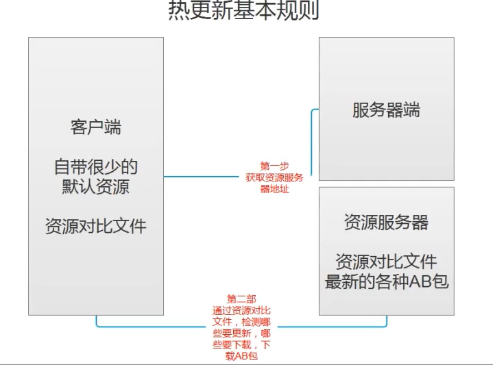
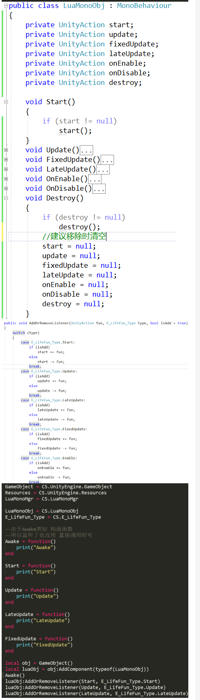

#   【唐老狮】Unity中Lua热更新解决方案

# 任务1：热更新解决方案

## 什么是热更新?

游戏或者软件更新时

无需重新下载客户端进行安装，而是在应用程序启动的情况下，在内部进行的资源或者代码更新。

## 热更新的好处

- 迅速修复Bug——避免重新下载安装包，游戏内部更新修复Bug
- 提升玩家留存率——避免玩家因为超大的安装包而流失
- 迅速换“内核”——挂羊头卖狗肉

## 热更新解决方案 - 学习目标

1. 热更新基础———AssetBundle
2. 热更新基础—- Lua语法
3. 热更新方案———xLua
4. 热更新方案———toLua
5. 热更新实践——基于xLua的背包系统

# AssetBundle

# 任务3：AB包理论基础

## AssetBundle--学习目标

1. 了解AB包是什么
2. 了解AB包有什么作用
3. 生成AB包资源文件
4. 使用AB包资源文件
5. AB包资源加载管理器

## 了解AB包是什么

- 特定于平台（安卓、IOS、PC）的资产压缩包，有点类似压缩文件
- 资产包括:模型、贴图、预设体、音效、材质球等等
  - 可以将C#代码打包，所以需要lua来做热更新

## 了解AB包有什么作用

### 相对Resources下的资源，AB包更好管理资源

Resources：打包时定死，只读，无法修改

AB包：存储位置可自定，压缩方式自定义，后期可以动态更新（网络，本地更新）



### 减小包体大小

1. 压缩资源
2. 减少初始包大小

### 热更新

1. 资源热更新
2. 脚本热更新


# 任务：AB包练习题1

## 请写出热更新的概念是什么？Unity中热更新的流程是什么？

参考答案：

概念：指不需要重新下载游戏客户端，在游戏内部进行即时更新

为什么要用热更新：

1. 防止用户流失；每次更新如果下载庞大的客户端安装包，容易导致用户流失
2. 微端；可以让初始安装包极小，进了游戏再更新游戏内容
3. 可以做到“狸猫换太子”；先下个羊，进了游戏再变成狼

流程（每次进游戏都会走）：

1. 版本号比较，如果版本号不同才继续下面的流程（可选，也可以直接下载）
2. 下载对比文件，下载资源服务器上的的对比文件
3. 对比，用下载的文件和本地文件对比，记录改变的和新增的
4. 下载资源，下载刚才记录的文件——一般放在Application.persistentDataPath
5. 解压（可选）——如果文件是压缩过的，要先解压
6. 覆盖本地对比文件；保证下载成功后 将下载的对比文件 覆盖本地的

## AB包资源加载和Resources资源加载有什么区别？

参考答案：

1. API不同
2. Resources加载的资源，一定得放在Resources文件夹下
   AB包理论上来说放在任何地方都可以，但一般都放在Application.streamingAssetsPath或Application.persistentDataPath
3. AB包中是资源集合，Resources下都是单个资源

## AB包对于我们来说有什么作用？

参考答案：

- 减少包体大小：因为打AB可以选择压缩，压缩后可以有效减少包体大小
- Unity中热更新的基础：我们会把资源、Lua脚本打包成AB包，用于热更新

# 任务5：AB包资源打包

> [AssetBundle - Unity 手册](https://docs.unity.cn/cn/2020.3/Manual/AssetBundlesIntro.html)

## 在Unity当中导入Asset Bundle Browser

打包方式有两种

1. Unity编辑器开发，自定义打包工具
2. 官方提供好的打包工具:Asset Bundle Browser

这里使用第二种，在PackageMgr当中导入即可。

> [Unity Asset Bundle Browser 在PackageManager中不存在的问题解决方法_unity编辑器不存在_玩家1的博客-CSDN博客](https://blog.csdn.net/Player1MacHN/article/details/123644931)

## 绑定资源到AB包

> [AssetBundle 工作流程 - Unity 手册](https://docs.unity.cn/cn/2020.3/Manual/AssetBundles-Workflow.html)

选择资源，在最下方下拉列表选择new，输入资源组名，enter即可。

打开Windows -> AssetBundle Browser即可查看绑定的资源

## Asset Bundle Browser面板

### Configue

显示资源

### Build 构建设置

构建设置


# 任务6：AB包资源加载

## 使用AssetBundle类加载资源

### 同步加载

`AssetBundle ab = AssetBundle.LoadFromFile(path);`

`ab.LoadAsset<GameObject>("Cube")`

```C#
//第一步，加载AB包
AssetBundle ab = AssetBundle.LoadFromFile(Application.streamingAssetsPath + "/" + "model");
//第二步，加载AB包中的资源
GameObject cube = ab.LoadAsset<GameObject>("Cube");
Instantiate(cube);
```

注意：不能重复加载同一个AB包，否则会报错

```c#
AssetBundle ab = AssetBundle.LoadFromFile(Application.streamingAssetsPath + "/" + "model");
AssetBundle ab2 = AssetBundle.LoadFromFile(Application.streamingAssetsPath + "/" + "model");
//报错
```

### 异步加载 用协程来实现

```C#
StartCoroutine(LoadAsset(path, assetName));

/// <summary>
/// 加载资源
/// </summary>
/// <returns></returns>
private IEnumerator LoadAsset(string path, string assetName)
{
    //第一步：加载AB包 这里是异步加载 也就是等待加载完才会返回 注意这里的接受类型和上面的并不一样
    AssetBundleCreateRequest abcr = AssetBundle.LoadFromFileAsync(Application.streamingAssetsPath + "/" + path);
    yield return abcr;
    //第二步：加载资源 这里是异步加载 也就是等待加载完才会返回
    AssetBundleRequest abr = abcr.assetBundle.LoadAssetAsync<GameObject>(assetName);
    yield return abr;
    //使用资源
    Instantiate(abr.asset);
}
```

## 卸载AB包

### 卸载所有AB包

`AssetBundle.UnloadAllAssetBundles(false);`

```C#
AssetBundle.UnloadAllAssetBundles(false);
```

其中，传入的bool

- true：卸载已经使用和未使用的资源（也就是说场景当中使用了AB包中资源的对象将丢失资源）
- false：卸载加载的AB包 但是场景中已经实例出来的对象不会收到影响

### 卸载单个

`ab.Unload(false);`

直接卸载自己

```C#
//第一步，加载AB包
AssetBundle ab = AssetBundle.LoadFromFile(path);
//第二步，加载AB包中的资源
GameObject cube = ab.LoadAsset<GameObject>("Cube");
Instantiate(cube);

//卸载本身
ab.Unload(false);
```

# 任务7：AB包依赖

关于AB包的依赖 — 一个资源身上用到了别的AB包中的资源。

比如 打包在X中的立方体上面挂了一个材质球 但是这个材质球打包在Y中的情况

这个时候如果只加载自己的AB包，通过它创建对象会出现资源丢失的情况。

这种时候需要把依赖包一起加载了才能正常。 即X和Y两个包都加载

我们可以通过加载主包，然后获取主包当中的`Manifest`文件，再通过Manifest文件获取某个包的所有依赖


- 红色箭头指的就是主包 所以加载的路径就按照这个来

```C#
//利用主包，获取依赖信息
//加载主包
AssetBundle abMain = AssetBundle.LoadFromFile(Application.streamingAssetsPath + "/" + "PC");
//加载主包中的固定文件
AssetBundleManifest abManifest = abMain.LoadAsset<AssetBundleManifest>("AssetBundleManifest");
//从固定文件中得到依赖信息
string[] strs = abManifest.GetAllDependencies("model");
//获取依赖名后，一个个加载ab包
for (int i = 0; i < strs.Length; ++i)
{
    AssetBundle.LoadFromFile(Application.streamingAssetsPath + "/" + strs[i]);
}
```

注意：AB包依赖，只能记录包与包之前的依赖，而不能记录包内资源自己的依赖。

比如：A包当中的1资源依赖了B、C包，2资源依赖了D、E包，那么A包的依赖就是B、C、D、E，而不能记录1资源依赖了谁，2资源依赖了谁。


# 实践 : ABMgr

```c#
using System.Collections;
using System.Collections.Generic;
using UnityEngine;
using UnityEngine.Events;

//知识点
//字典
//协程
//AB包相关API
//委托
//lambda表达式
//单例模式基类——>观看Unity小框架视频 进行学习
public class ABMgr : SingletonAutoMono<ABMgr>	//自己写的单例模式基类 可以不这样写 自己写成单例模式就是了
{
    //主包
    private AssetBundle mainAB = null;
    //主包依赖获取配置文件
    private AssetBundleManifest manifest = null;

    //选择存储 AB包的容器
    //AB包不能够重复加载 否则会报错
    //字典知识 用来存储 AB包对象
    private Dictionary<string, AssetBundle> abDic = new Dictionary<string, AssetBundle>();

    /// <summary>
    /// 获取AB包加载路径
    /// </summary>
    private string PathUrl
    {
        get
        {
            return Application.streamingAssetsPath + "/";
        }
    }

    /// <summary>
    /// 主包名 根据平台不同 报名不同
    /// </summary>
    private string MainName
    {
        get
        {
#if UNITY_IOS
            return "IOS";
#elif UNITY_ANDROID
            return "Android";
#else
            return "PC";
#endif
        }
    }

    /// <summary>
    /// 加载主包 和 配置文件
    /// 因为加载所有包是 都得判断 通过它才能得到依赖信息
    /// 所以写一个方法
    /// </summary>
    private void LoadMainAB()
    {
        if( mainAB == null )
        {
            mainAB = AssetBundle.LoadFromFile( PathUrl + MainName);
            manifest = mainAB.LoadAsset<AssetBundleManifest>("AssetBundleManifest");
        }
    }

    /// <summary>
    /// 加载指定包的依赖包
    /// </summary>
    /// <param name="abName"></param>
    private void LoadDependencies(string abName)
    {
        //加载主包
        LoadMainAB();
        //获取依赖包
        string[] strs = manifest.GetAllDependencies(abName);
        for (int i = 0; i < strs.Length; i++)
        {
            if (!abDic.ContainsKey(strs[i]))
            {
                AssetBundle ab = AssetBundle.LoadFromFile(PathUrl + strs[i]);
                abDic.Add(strs[i], ab);
            }
        }
    }

    /// <summary>
    /// 泛型资源同步加载
    /// </summary>
    /// <typeparam name="T"></typeparam>
    /// <param name="abName"></param>
    /// <param name="resName"></param>
    /// <returns></returns>
    public T LoadRes<T>(string abName, string resName) where T:Object
    {
        //加载依赖包
        LoadDependencies(abName);
        //加载目标包
        if ( !abDic.ContainsKey(abName) )
        {
            AssetBundle ab = AssetBundle.LoadFromFile(PathUrl + abName);
            abDic.Add(abName, ab);
        }

        //得到加载出来的资源
        T obj = abDic[abName].LoadAsset<T>(resName);
        //如果是GameObject 因为GameObject 100%都是需要实例化的
        //所以我们直接实例化
        if (obj is GameObject)
            return Instantiate(obj);
        else
            return obj;
    }

    /// <summary>
    /// Type同步加载指定资源
    /// </summary>
    /// <param name="abName"></param>
    /// <param name="resName"></param>
    /// <param name="type"></param>
    /// <returns></returns>
    public Object LoadRes(string abName, string resName, System.Type type) 
    {
        //加载依赖包
        LoadDependencies(abName);
        //加载目标包
        if (!abDic.ContainsKey(abName))
        {
            AssetBundle ab = AssetBundle.LoadFromFile(PathUrl + abName);
            abDic.Add(abName, ab);
        }

        //得到加载出来的资源
        Object obj = abDic[abName].LoadAsset(resName, type);
        //如果是GameObject 因为GameObject 100%都是需要实例化的
        //所以我们直接实例化
        if (obj is GameObject)
            return Instantiate(obj);
        else
            return obj;
    }

    /// <summary>
    /// 名字 同步加载指定资源
    /// </summary>
    /// <param name="abName"></param>
    /// <param name="resName"></param>
    /// <returns></returns>
    public Object LoadRes(string abName, string resName)
    {
        //加载依赖包
        LoadDependencies(abName);
        //加载目标包
        if (!abDic.ContainsKey(abName))
        {
            AssetBundle ab = AssetBundle.LoadFromFile(PathUrl + abName);
            abDic.Add(abName, ab);
        }

        //得到加载出来的资源
        Object obj = abDic[abName].LoadAsset(resName);
        //如果是GameObject 因为GameObject 100%都是需要实例化的
        //所以我们直接实例化
        if (obj is GameObject)
            return Instantiate(obj);
        else
            return obj;
    }

    /// <summary>
    /// 泛型异步加载资源
    /// </summary>
    /// <typeparam name="T"></typeparam>
    /// <param name="abName"></param>
    /// <param name="resName"></param>
    /// <param name="callBack"></param>
    public void LoadResAsync<T>(string abName, string resName, UnityAction<T> callBack) where T:Object
    {
        StartCoroutine(ReallyLoadResAsync<T>(abName, resName, callBack));
    }
    //正儿八经的 协程函数
    private IEnumerator ReallyLoadResAsync<T>(string abName, string resName, UnityAction<T> callBack) where T : Object
    {
        //加载依赖包
        LoadDependencies(abName);
        //加载目标包
        if (!abDic.ContainsKey(abName))
        {
            AssetBundle ab = AssetBundle.LoadFromFile(PathUrl + abName);
            abDic.Add(abName, ab);
        }
        //异步加载包中资源
        AssetBundleRequest abq = abDic[abName].LoadAssetAsync<T>(resName);
        yield return abq;

        if (abq.asset is GameObject)
            callBack(Instantiate(abq.asset) as T);
        else
            callBack(abq.asset as T);
    }

    /// <summary>
    /// Type异步加载资源
    /// </summary>
    /// <param name="abName"></param>
    /// <param name="resName"></param>
    /// <param name="type"></param>
    /// <param name="callBack"></param>
    public void LoadResAsync(string abName, string resName, System.Type type, UnityAction<Object> callBack)
    {
        StartCoroutine(ReallyLoadResAsync(abName, resName, type, callBack));
    }

    private IEnumerator ReallyLoadResAsync(string abName, string resName, System.Type type, UnityAction<Object> callBack)
    {
        //加载依赖包
        LoadDependencies(abName);
        //加载目标包
        if (!abDic.ContainsKey(abName))
        {
            AssetBundle ab = AssetBundle.LoadFromFile(PathUrl + abName);
            abDic.Add(abName, ab);
        }
        //异步加载包中资源
        AssetBundleRequest abq = abDic[abName].LoadAssetAsync(resName, type);
        yield return abq;

        if (abq.asset is GameObject)
            callBack(Instantiate(abq.asset));
        else
            callBack(abq.asset);
    }

    /// <summary>
    /// 名字 异步加载 指定资源
    /// </summary>
    /// <param name="abName"></param>
    /// <param name="resName"></param>
    /// <param name="callBack"></param>
    public void LoadResAsync(string abName, string resName, UnityAction<Object> callBack)
    {
        StartCoroutine(ReallyLoadResAsync(abName, resName, callBack));
    }

    private IEnumerator ReallyLoadResAsync(string abName, string resName, UnityAction<Object> callBack)
    {
        //加载依赖包
        LoadDependencies(abName);
        //加载目标包
        if (!abDic.ContainsKey(abName))
        {
            AssetBundle ab = AssetBundle.LoadFromFile(PathUrl + abName);
            abDic.Add(abName, ab);
        }
        //异步加载包中资源
        AssetBundleRequest abq = abDic[abName].LoadAssetAsync(resName);
        yield return abq;

        if (abq.asset is GameObject)
            callBack(Instantiate(abq.asset));
        else
            callBack(abq.asset);
    }

    //卸载AB包的方法
    public void UnLoadAB(string name)
    {
        if( abDic.ContainsKey(name) )
        {
            abDic[name].Unload(false);
            abDic.Remove(name);
        }
    }

    //清空AB包的方法
    public void ClearAB()
    {
        AssetBundle.UnloadAllAssetBundles(false);
        abDic.Clear();
        //卸载主包
        mainAB = null;
    }
}

```


# ------------------------------------

# 第3章: Lua语法

# 任务11：环境搭建以及第一个Lua程序

## 注释

单行注释

```lua
--单行注释--
```

三种多行注释

```lua
--[[
	多行注释第一种
    你好！我是盘子
]]

--[[
    多行注释第二种
    你好！我是盘子
]]--

--[[
    多行注释第三种
    你好！我是盘子
--]]
```

## 输出函数

```lua
print("输出函数")
```

# 任务12：变量

## Lua变量

- lua中所有的变量申明都不需要申明变量类型他会自动的判断类型-类似C#里面的var
- lua中的一个变量可以随便赋值—自动识别类型
- 通过 type函数返回值时string我们可以得到变量的类型

## 四种简单变量类型

- 四种简单变量类型
  - `nil`：空
  - `number`：数值类型
  - `string`：字符串
  - `boolean`：布尔类型

## 复杂四种变量类型

- `function`：函数
- `table`：表
- `userdata`：数据结构
- `thread`：协同程序

## type函数

type函数得到变量的类型，返回值是一个string。

## 变量注意点

- Lua中变量可以直接使用，不需要声明
- Lua中可以直接使用没有初始化的变量，默认为nilLua中不用指明变量类型，可以自动识别
- lua中使用没有声明过的变量，不会报错,  默认值是nil

## 任务：Lua练习题2

### 至少写出Lua中6种数据类型

> 四种简单类型：nil，number、string、boolean
>
> 四种复杂类型：function，userdata，table，thread

# 任务13：字符串操作

## 字符串定义

```lua
str = "双引号字符串"

str2 = '单引号字符串'

--多行字符串--
str3 = [[Hello
I am Panzi
]]

str4 = "123\n123\n123"
```

## 获取字符串的长度

注意：

- 一个汉字3字节
- 英文字符 占1个长度

```lua
s = "abcdefG字符串"
--一个汉字占3字节--
print(#s)

输出:16
```

## 字符串多行打印

lua中也是支持转义字符的

```C#
s = [[I am
Panzi
Hello World
]]
print(s)

print("123\n234")
```

## 字符串拼接

使用 `..`直接拼接字符串

```lua
print("Hello" .. "I am " .. "Panzi")
```

使用string.format格式化输出

- `%d`：与数字拼接
- `%a`：与任何字符拼接
- `%s`：与字符配对

```lua
print(string.format("我是盘子ssa，今年%d岁了", 1))
```

## 别的类型转字符串

使用`tostring`

```C#
a = true
print(tostring(a))
```

## 字符串提供的公共方法

```lua
str = "abcdefghijklmn"
```

- 小写转大写的方法

  ```lua
  print(string.upper(str))
  -- ABCDEFGHIJKLMN
  ```

- 大写转小写

  ```lua
  print(string.lower(str))
  -- abcdefghijklmn
  ```

- 翻转字符串

  ```lua
  print(string.reverse(str))
  -- nmlkjihgfedcba
  ```

- 字符串索引查找

  ```lua
  print(string.find(str, "abc"))
  -- 1	3
  ```

- 字符串重复

  ```lua
  print(string.rep("123", 3))
  -- 123123123
  ```

- 截取字符串

  ```lua
  print(string.sub(str, 3, 4))
  -- cd
  ```

- 字符串修改

  ```lua
  print(string.gsub(str, "ab", "**"))
  -- **cdefghijklmn	1
  ```

- 字符转ASCII码

  ```lua
  print(string.byte("a", 1))
  -- 97
  ```

- ASCII码转字符

  ```lua
  print(string.char(string.byte("a", 1)))
  -- a
  ```

## 任务：Lua练习题3

如何在lua中打印多行信息

```lua
-- 1.定义多行字符串
str = [[Hello
I am
Panzi
]]
print(str)

-- 2.使用转义字符
print("Hello\nI am\nPanzi")
```

# 任务14：运算符

## 算数运算符

- 没有自增自减 `++ --`
- 没有复合运算符 `+= -= /= *= %=`
- 字符串可以进行，算数运算符操作，会自动转成number
  - `print("123" + 1)`， 输出124
- `+，-，*，/，%` 基本上和C#一致，只不过，可以取余小数了
- `^` 是取幂运算
- `>,<.>=,<=`一直，不等于是 `~=`
- 逻辑与 `and`，逻辑或 `or`，取非 `not`
  - 注意： 
  - `a and b`：当a为true时返回b的值，否则返回a的值
  - `a or b`：当a为true时返回a的值，否则返回b的值
- 真：`true`，假 `false`
- 不支持位运算符
- 不支持三目运算符

## 模拟实现三目运算符

根据语言特性

- `a and b`：当a为true时返回b的值，否则返回a的值
- `a or b`：当a为true时返回a的值，否则返回b的值

```lua
--模拟实现三目运算符 1>2?1:2 2
--a and b or c:当且仅当b为true时成立
print(1>2 and 1 or 2)
--1<2?1:2 1
print(1<2 and nil or 2)
```

# 任务15：条件分支语句

注意：

- lua当中，`nil`和 `false`为假，其他为真（也就是说0为真）

单分支

```lua
--单分支
--if 条件 then.....end
if a > 5 then
	print("123")
end
```

双分支

```lua
--双分支
-- if 条件 then.....else.....end
if a < 5 then
	print("123")
else
    print("123")
end
```

多分支

```lua
-- if 条件 then.....elseif 条件 then....elseif 条件 then....else.....end
a = 9
if a < 5 then
    print("123")
elseif a > 6 then
    print("234")   
end
```

# 任务16：循环语句

注意：循环语句没有continue，只有break，

## while语句

```lua
num = 0
--while 条件 do ..... end
while num < 5 do
	print(num)
	num = num + 1
end
```

## repeat until语句（do while）

注意：是满足条件退出

```lua
num = 0
--repeat ..... until 条件 （注意：条件是结束条件）
repeat
	print(num)
	num = num + 1
until num > 5 --满足条件跳出 结束条件
```

## for语句

注意：i会到达5，不是i < 5

- 第一个参数，下标
- 第二个参数，下标能到达的最后一个值
- 第三个参数，步长

```lua
for i =2,5 do --默认递增 i会默认+1
	print(i)
end

for i =1,5,2 do --如果要自定义增量 直接逗号后面写
	print(i)
end

for i =5,1,-1 do --如果要自定义增量 直接逗号后面写
	print(i)
end
```

## 模拟实现continue

```lua
for i=1,10 do
    --这里就是continue
	repeat 
        if i == 5 then
            break
        --上面这个break就相当于continue 逻辑写在这里面--
        end
    until true
end     
```

# 任务17：函数（变长，嵌套闭包，多返回值）

## 函数定义

注意：函数也是一种类型

```lua
--function 函数名()
--end

--a = function()
--end
```

## 无参数无返回值

```lua
function F1()
	print("F1函数")
end
F1()
```

可以使用变量接受函数，有点类似 C#中的 委托和事件

此时，通过变量调用函数

```lua
F2 = function()
	print("F2函数")
end
F2()
```

## 有参数

```lua
function F3(a)
	print(a)
end
F3(1)
F3("123")
F3(true)
```

如果你传入的参数和函数参数个数不匹配，不会报错只会补空nil或者丢弃。

```lua
F3()
F3(1,2,3)
print("**********有返回值************")
function F4(a)
	return a, "123", true
end
--output
-- nil
-- 1
```

## 有返回值

- 多返回值时，在前面申明多个变量来接取即可
- 如果变量不够，不影响，值接取对应位置的返回值
- 如果变量多了不对应，直接赋nil

```lua
function F4(a)
	return a, "123", true
end

temp, temp2, temp3, temp4 = F4("1")
print(temp)
print(temp2)
print(temp3)
print(temp4)

-- output
1
123
true
nil
```

## 函数的类型

函数的类型就是function

```lua
F5 = function( )
	print("123")
end
print(type(F5))

-- output
function
```

## 函数的重载

- 函数重载：函数名相同，参数类型不同，或者参数个数不同

- lua中，函数不支持重载 

- 默认调用最后一个声明的函数

```lua
function F6()
	print("唐老狮帅帅的")
end

function F6(str)
	print(str)
end

-- output
nil
```

## 变长参数

使用 `...`表示

传入的参数就是 `...`，使用一个表接受即可

固定参+可变参，固定参一定在可变参之前

```lua
function F7( ... )
	--变长参数使用 用一个表存起来 再用
	arg = {...}
	for i=1,#arg do
		print(arg[i])
	end
end
F7(1,"123",true,4,5,6)
```

## 函数嵌套

```lua
function F8()
	return function()
		print(123);
	end
end
f9 = F8()
f9()
-- output
123
```

### 闭包

```lua
function F9(x)
	--改变传入参数的生命周期
	return function(y)
		return x + y
	end
end

f10 = F9(10)
print(f10(5))

-- output
15
```

# 注意：所有的复杂类型都是table（表）！

# 任务18：table表实现数组

直接在表中声明元素，数组下标从1开始。

一维数组

```lua
a = {1,2,nil,3,"1231",true,nil}
print(#a)

--output--
2 --因为读到nil之后就默认断开了 所以长度是2--
```

二维数组（就是表中表）

```lua
a = {{1,2,3,4}, {2,3,4,5}}

--遍历
for i = 1,#a do
    temp = a[i]
    s = ""
    for j = 1, #temp do
        s = s .. temp[j] .. " "
    end
    print(s) 
end

print(a[1][1]) --输出 : 1--
```

自定义索引

```lua
a = {[0] = 0, [-1] = -1, [1] = 1,[2] = 2,[5] = 4,[6] = 6}

print(a[1])
print(a[6])
print(a[-1])
print(a[0])
print(#a)

-- output
1
6
-1
0
2 --为什么是2呢 因为他默认2后面没有3就是断开了 而且他只会按顺序1 2 3 4...读 那些0 -1的索引不计长度--


a = {[0] = 1, 1, 2, [-1] = -1, 5}
print(a[3])

--output--
5

--一个非常神奇的特性--
a = {[1] = 1,[2] = 2,[4] = 4,[6] = 6}

print(#a)
for i = 1, #a do
    print(a[i])
end

--output--
6
1
2
nil
4
nil
6
--中间隔得不超过一个 会自己填一个nil 并且计入长度 非常变态--
```

# 任务19：迭代器遍历（ipairs和pairs区别）

## 迭代器遍历

迭代器遍历，主要是用来遍历表的

得到长度，其实并不准确，一般不要用#来遍历表

## ipairs迭代器遍历

ipairs遍历，还是从1开始往后遍历的，小于等于0的值得不到

只能找到连续索引的键，如果中间断序了，它也无法遍历出后面的内容

只能获取到从1开始的下标

```lua
a = {[0] = 1, 2, [-1]=3, 4, 5, [5] = 6}

s = ""
for i, v in ipairs(a)  do
	s = s .. v
end
print(s)
-- 245
```

## ipairs迭代器遍历键

注意：这就相当于foreach

```lua
s = ""
for i in ipairs(t) do
	s = s .. i
end
print(s)

-- output
123
```

## pairs迭代器遍历

它能够把所有的键都找到，通过键可以得到值

```lua
a = {[0] = 1, 2, [-1] = 3, 4, 5, [5] = 6}
for k, v in pairs(a) do
	print(k .. "_" .. v)
end

--output
1_2
2_4
3_5
0_1
-1_3
5_6
```

## pairs迭代器遍历键

```lua
a = {[0] = 1, 2, [-1] = 3, 4, 5, [5] = 6}
for k in pairs(a) do
	print(k .. "_" .. a[k])
end
--output
1_2
2_4
3_5
0_1
-1_3
5_6
```

# 任务20：table表实现字典

## 字典的申明

字典是由键值对构成，而table可以自定义索引，那么，使用自定义索引即可定义字典

```lua
a = {["name"] = "Panzi", ["age"] = 14, ["city"] = "hunan", ["1"] = "number"}

-- 访问当个变量，用中括号填键来访问
print(a["name"])
print(a["age"])
print(a["city"])
-- output
Panzi
14
hunan
```

虽然可以通过`.`成员变量的形式得到值，但是不能是数字

```lua
--还可以类似.成员变量的形式得到值
print(a.name)
print(a.age)
--虽然可以通过.成员变量的形式得到值，但是不能是数字
-- print(a.1)
print(a["1"])

-- output
Panzi
14
number
```

## 字典操作

```lua
--修改
a["name"] = "TLS";
print(a["name"])
print(a.name)
--新增
a["sex"] = false
print(a["sex"])
print(a.sex)
--删除
a["sex"] = nil
print(a["sex"])
print(a.sex)
```

## 字典的遍历

如果要模拟字典，遍历一定用`pairs`

同时遍历键值

```lua
--可以传多个参数 一样可以打印出来
for k,v in pairs(a) do
	print(k,v)
end

-- output
1	number
city	hunan
name	Panzi
age	14
```

遍历值

```lua
for k in pairs(a) do
	print(a[k])
end

-- output
number
hunan
Panzi
14
```

# 任务21：table表实现类（点和冒号的区别，self）

## Lua中是默认没有面向对象的，需要我们自己来实现

## 成员变量，成员函数

其实，就是通过表可以存储任意类型和可以通过直接 `.`出自定义索引的特性。

所以，此时，一个类无需实例化对象了，这个表就是对象

```lua
Student = { 
	--年龄
	age = 18, 
	--性别
	sex = true,
	--成长函数
	Up = function()
		--这样写 这个age 和表中的age没有任何关系 它是一个全局变量
		--print(age)

		--想要在表内部函数中 调用表本身的属性或者方法
		--一定要指定是谁的 所以要使用 表名.属性 或 表名.方法
		print(Student.age)
		print("我成长了")
	end,
	--学习函数
	Learn = function(t)
		--第二种 能够在函数内部调用自己属性或者方法的 方法
		--把自己作为一个参数传进来 在内部 访问
		print(t.sex)
		print("好好学习，天天向上")
	end
}
```

在表内部，使用成员，直接使用表名 `.`出来即可，如果直接写一个变量，将是一个全局变量。

```lua
Student.age --成员
```

因为函数也是一种类型，所以如果想定义函数，直接存储函数变量即可

如果想在函数内访问本身，除了使用表名 `.`出来，还可以写一个参数，传入自己，再调用

```lua
Learn = function(t)
    --第二种 能够在函数内部调用自己属性或者方法的 方法
    --把自己作为一个参数传进来 在内部 访问
    print(t.sex)
    print("好好学习，天天向上")
end
```

## 成员的使用

- 成员变量：直接点出来
- 成员函数，点出来，传入自己，或者使用==冒号==自动传入自己

```lua
--Lua中 .和冒号的区别
Student.Learn(Student)
--冒号调用方法 会默认把调用者 作为第一个参数传入方法中
Student:Learn()
print(Student.age)

--声明表过后，在表外直接使用表有的变量和方法
Student.name = "唐老狮"
Student.Speak = function()
	print("说话")
end
Student.Speak()

-- output
true
好好学习，天天向上
true
好好学习，天天向上
18
说话
```

## 在表外声明成员函数

lua中 有一个关键字 `self` 表示默认传入的第一个参数（类似python）

```lua
function Student:Speak2()
	--lua中 有一个关键字 self 表示 默认传入的第一个参数
	print(self.name .. "说话")
end
```

## 总结

C#要是使用类，实例化对象new，静态直接点

Lua中类的表现，更像是一个类中有很多静态变量和函数，一个表就是一个对象

```lua
print(Student.age)
print(Student.name)
Student.Up()
Student.Speak()
Student:Speak2()
Student.Speak2(Student)
```

# 任务22：table表的公共操作（插入，移除，排序，拼接）

## 插入

使用 `table.insert(arg1, argc2)`函数，将一个元素插入到表后

- 参数一：插入到哪个表
- 参数二：插入什么

另一种形式 `table.insert(arg1, arg2, argc3)`

- 参数一：插入到哪个表
- 参数二：插入位置
- 参数二：插入什么

```lua
t1 = { {age = 1, name = "123"}, {age = 2, name = "345"} }

t2 = {name = "Panzi", sex = true}
-- 插入
print(#t1)
table.insert(t1, t2);	--table是lua提供的一个公共表 这个的意思是将t2表插入到t1表后面 然后t2表会变为空--
print(#t1)
print(t1[1])
print(t1[2])
print(t1[3])
print(t1[3].sex)

-- output
2
3
table: 00D6A2D0
table: 00D6A2F8
table: 00D6A4D8
true
```

## 移除

删除指定元素

`table.remove`方法，传表进去，会移除最后一个索引的内容

```lua
table.remove(t1)
print(#t1)
print(t1[1].name)
print(t1[2].name)
print(t1[3])

-- output
2
123
345
nil
```

传两个参数

- 参数一：是要移除内容的表
- 参数二：是要移除内容的索引

```lua
table.remove(t1, 1)
print(t1[1].name)
print(#t1)

-- output
345
1
```

## 排序

传入要排序的表，默认升序排列，根据内容排序

```lua
t2 = {name = "Panzi", sex = true, city = "Able"}
table.sort(t2)
for _,v in pairs(t2) do
	print(v)
end

--output 
Able
Panzi
true
```

### 自定义排序规则

传入两个参数，第一个是用于排序的表
第二个是排序规则函数

```lua
t2 = {1,2,3,4,5}
table.sort(t2, function(a,b)
	if a > b then
		return true
	end
end)
for _,v in pairs(t2) do
	print(v)
end

--output
5
4
3
2
1
```

## 拼接

连接函数，用于拼接表中元素，返回值是一个字符串

使用 `table.concat(tb, ",")`，将第二个参数连接到 `tb`表中的每一个元素，返回连接后的字符串

```lua
tb = {"123", "456", "789", "10101"}
str = table.concat(tb, ";")
print(str)

--output
123;456;789;10101
```

# 任务23：全局变量和本地变量，多脚本执行（require，package，_G）

## 全局变量和本地变量

### 全局变量

只要是没有local修饰的变量，就是全局变量

```lua
for i = 1,2 do
	c = "Panzi"
end
print(c)

-- output
Panzi
```

### 本地变量

也就是局部变量，使用 `local`修饰的变量

```lua
for i = 1, 10 do
	local num = 10
end
print(num)

-- output
nil
```

## 多脚本执行

关键字 `require("脚本名")`， `require('脚本名')`

类似于引用命名空间

```lua
require('Test')	--引用别的文件--
print(testA)	--Test中的全局变量可以打印出来--
print(testLocalA)	--Test中的本地变量打不出来--

--output--
Test测试 --会把里面的代码执行一次 对应print("Test测试")--
456 --对应 print(testLocalA)--
123
nil
```

Test.lua

注意：本地变量无法在外部脚本获取

```lua
print("Test测试")
testA = "123"
local testLocalA = "456"
print(testLocalA)
```

## 脚本卸载

如果是require加载执行的脚本，加载一次过后不会再被执行

```lua
require('Test')
require('Test')

-- output
Test测试	--只执行一次--
456
```

### 获取脚本是否加载

返回值是boolean，意思是，该脚本是否被执行

```lua
package.loaded["脚本名"]
```

```lua
-- Test.lua
print("Test测试")
testA = "123"
local testLocalA = "456"
print(testLocalA)

-- Lesson10.lua
require("Test")
print(package.loaded["Test"])

-- output
Test测试
456
true
```

### 卸载已经执行过的脚本

```lua
package.loaded["Test"] = nil
print(package.loaded["Test"])
```

## 返回局部变量

require 执行一个脚本时 ，可以再脚本最后返回一个外部希望获取的内容

```lua
print("Test测试")
testA = "123"
local testLocalA = "456"
print(testLocalA)

return testLocalA
```

```lua
local testLA = require("Test")
print(testLA)

-- output
456
```

注意：此时 `package.loaded["Test"]`也是返回的此值

## 大G表

`_G表`是一个总表(table) 他将我们声明的所有全局的变量都存储在其中，使用 `require`添加的脚本当中的table，也会在大G表当中。

```lua
for k,v in pairs(_G) do
	print(k,v)
end
```

本地变量，加了local的变量时不会存到大_G表中

# 任务24：特殊用法（多变量赋值，三目运算符）

## 多变量赋值

```lua
local a,b,c = 1,2,"123"
```

多变量赋值，如果后面的值不够，会自动补空

```lua
a,b,c = 1,2 
print(a)
print(b)
print(c) --nil
```

多变量赋值，如果后面的值多了 会自动省略

```lua
a,b,c = 1,2,3,4,5,6
print(a)
print(b)
print(c)
```

## 函数多返回值

多返回值时，你用几个变量接，就有几个值

如果少了，就少接几个，如果多了，就自动补空。

```lua
function Test()
	return 10,20,30,40
end
a,b,c = Test()

a,b,c,d,e = Test()
print(a)
print(b)
print(c)
print(d)
print(e)--nil
```

## and，or

`and or` 他们不仅可以连接 `boolean` ，任何东西都可以用来连接

在lua中只有 `nil` 和 `false` 才认为是假

- "短路"——对于and来说， 有假则假 ，对于or来说 有真则真
- 所以 他们只需要判断，第一个是否满足就会停止计算了

```lua
print( 1 and 2 )
print( 0 and 1)
print( nil and 1)
print( false and 2)
print( true and 3)

print( true or 1 )
print( false or 1)
print( nil or 2)

-- output
2	--判断出1是真 所以2返回出去--
1
nil	--判断第一个是假 返回第一个--
false
3
true
1
2
```

### 模拟实现三目运算符

根据语言特性

- `a and b`：当a为true时返回b的值，否则返回a的值
- `a or b`：当a为true时返回a的值，否则返回b的值

所以有 `a and b or c`，即等于三目运算符 `a ? b : c`

```lua
--模拟实现三目运算符 1>2?1:2 2 
--a and b or c:当且仅当b为true时成立
print(1>2 and 1 or 2)
```


# 任务25 :协同程序(创建 运行 挂起 状态)

## 协程的创建

- 使用 `coroutine.create()`：
	- 定义一个函数
	- 使用 `coroutine.create()` 创建协程对象，返回一个协程线程对象
- 使用 `coroutine.wrap()`：
	- 创建协程对象并返回一个包装后的函数
	- 调用该函数时会启动协程

```lua
--协程的创建
fun = function()
    print(123)
end

co = coroutine.create(fun) --创建协程对象
print(co) --协程线程对象
print(type(co)) --类型为thread

co2 = coroutine.wrap(fun) --创建并包装协程对象为函数
print(co2) --包装后的函数
print(type(co2)) --类型为function
```

## 协程的运行

- 对于通过 `coroutine.create()` 创建的协程，使用 `coroutine.resume()` 启动
- 对于通过 `coroutine.wrap()` 创建的协程，直接调用包装后的函数启动

```lua
--协程的运行
coroutine.resume(co) --启动协程

co2() --直接调用包装后的函数启动协程
```

## 协程的挂起

- 使用 `coroutine.yield()` 挂起协程
- 可以在 `coroutine.yield()` 中传递值，在重新启动协程时获取该值

```lua
--协程的挂起
fun2 = function()
    local i = 1
    while true do
        print(i)
        i = i + 1
        print(coroutine.status(co3)) --打印协程状态
        print(coroutine.running()) --打印当前正在运行的协程线程号
        coroutine.yield(i) --挂起协程 这个决定了只会输出一次 即使是while 因为lua是从上到下执行一次 挂起之后不会再进循环 和c#不同 c#挂起之后会搁一帧再继续执行协程 而且c#如果不用yield那就会卡死在这个协程 别的程序都无法执行 当然lua也会
    end
end

co3 = coroutine.create(fun2)

isOk, tempI = coroutine.resume(co3) --启动协程
print(isOk, tempI)
isOk, tempI = coroutine.resume(co3) --重新启动协程，获取yield的值
print(isOk, tempI)
isOk, tempI = coroutine.resume(co3)
print(isOk, tempI)

--output--
true 1
true 2
true 3

co4 = coroutine.wrap(fun2)
--包装后的协程调用也可以获取返回值，但没有默认的第一个返回值表示协程启动成功
print("返回值" .. co4())
print("返回值" .. co4())
print("返回值" .. co4())

--output--
true 1
true 2
true 3
```

## 协程的状态

- 使用 `coroutine.status()` 获取协程状态，可能的返回值为：
	- `dead`：协程已结束
	- `suspended`：协程已暂停
	- `running`：协程正在运行
- 使用 `coroutine.running()` 获取当前正在运行的协程的线程号，如果在主程序中调用，则返回 `nil`

```lua
--协程的状态
print(coroutine.status(co3)) --获取并打印协程co3的状态 suspended 因为被挂起了
print(coroutine.status(co)) --获取并打印协程co的状态 dead co被执行完了
print(coroutine.running()) --获取当前正在运行的协程的线程号 写在协程内部才能看到自己这个协程在运行 好鸡肋
```


# 任务26：元表（__index，tostring，newindex）

## 元表概念

任何表变量都可以作为另一个表变量的元表

任何表变量都可以有自己的元表（爸爸）

当我们子表中进行一些特定操作时

会执行元表中的内容

==有点类似父类==

## 设置元表

使用 `setmetatable(tab1,tab2)`

设置元表函数

- 第一个参数 子表

- 第二个参数 元表（爸爸）

```lua
meta = {}
myTable = {}
-- 设置元表函数
-- 第一个参数 子表
-- 第二个参数 元表（爸爸）
setmetatable(myTable, meta)
```

## 特定操作-__tostring

当子表要被当做字符串使用时，会默认调用这个元表中的tostring方法

```lua
metaTab2 = { 
    __tostring = function(t) 
        return t.name
    end
}
tab2 = { name = "Panzi" }
setmetatable(tab2, metaTab2)
print(tab2)

-- output
Panzi
```

## 特定操作-__call

当子表被当做一个函数来使用时，会默认调用元表这个__call中的内容

当希望传参数时，一定要记住，默认第一个参数，是调用者自己

```lua
metaTab2 = {
    __call = function(t, arg)
        print("I am Panzi")
        print(arg)
    end
}
tab2 = { }
setmetatable(tab2, metaTab2)
tab2("out arg")

-- output
I am Panzi
out arg
```

## 特定操作-运算符重载

当子表使用运算符时，会调用特定名字的方法

```lua
metaTab3 = {
	--相当于运算符重载 当子表使用+运算符时 会调用该方法
	--运算符+
	__add = function(t1, t2)
		return t1.age + t2.age
	end,
	--运算符-
	__sub = function(t1, t2)
		return t1.age - t2.age
	end,
	--运算符*
	__mul = function(t1, t2)
		return 1
	end,
	--运算符/
	__div = function(t1, t2)
		return 2
	end,
	--运算符%
	__mod = function(t1, t2)
		return 3
	end,
	--运算符^
	__pow = function(t1, t2)
		return 4
	end,
	--运算符==
	__eq = function(t1, t2)
		return true
	end,
	--运算符<
	__lt = function(t1, t2)
		return true
	end,
	--运算符<=
	__le = function(t1, t2)
		return false
	end,
	--运算符..
	__concat = function(t1, t2)
		return "567"
	end
}
```

设置两个表的元表都为metaTab3

```lua
tab3_1 = {
    age = 10;
}
setmetatable(tab3_1, metaTab3)
tab3_2 = {age = 20}
setmetatable(tab3_2, metaTab3)
```

使用运算符

```lua
print(tab3_1 + tab3_2)
print(tab3_1 - tab3_2)
print(tab3_1 * tab3_2)
print(tab3_1 / tab3_2)
print(tab3_1 % tab3_2)
print(tab3_1 ^ tab3_2)
print(tab3_1 .. tab3_2)

-- output
30
-10
1
2
3
4
567
```

如果要用条件运算符，来比较两个对象
这两个对象的元表一定要一致 才能准确调用方法

```lua
print(tab3_1 == tab3_2)
print(tab3_1 > tab3_2)
print(tab3_1 <= tab3_2)

-- output
true
true
false
```

## 特定操作-__index和__newIndex

### __index

`__index`当子表中找不到某一个属性时 ，会到元表中 __index指定的表去找属性。

注意：如果父表当中`__index`没有，那么会从祖宗表当中查找 `__index`

```lua
metaTab4 = { 
    age = 1 
   --metaTab4.__index = metaTab4 写在内部没用--
}
metaTab4.__index = metaTab4	--没有这句的话输出会是nil--
tab4 = { }
setmetatable(tab4, metaTab4)
-- tab4.age = 10;
print(tab4.age)

-- output
1
```

### __newindex

`__newindex`：当赋值时，如果赋值一个不存在的索引，那么会把这个值赋值到newindex所指的表中，不会修改自己。

`__newindex`和 `__index`一样，会从元表的元表当中递归赋值

```lua
meta7 = {}
meta7.__newindex = {}
tab7 = {}
setmetatable(tab7, meta7)
-- 注意：这里赋值，会赋值给__newIndex指向的表赋值
tab7.age = 1 --如果元表设置了newindex 那么这个赋值操作相当于在newindex中创建了一个新的变量 否则就是在tab7里面创建了一个新变量 可以tab7.age打印出
print(tab7.age)	--nil
print(meta7.__newindex.age) --1

meta7.__newindex = meta7
-- 注意：这里为nil是因为newindex已经改变了，变成了meta7，所以age是nil 而之前的age是加到meta7.__newindex = {} 这个{}里面的
print(meta7.age)
```

## 其他操作

### rawget：原始获取

使用此函数获取，会去找自己身上有没有这个变量，而不会使用 `__index`

```lua
print(rawget(meta7, "temp")) --nil --
```

### rawset：原始赋值

使用此函数赋值，会去找自己身上有没有这个变量，而不会使用 `__newindex`

```lua
--rawset 该方法 会忽略newindex的设置 只会改自己的变量 --
tab8 = {}
rawset(tab8, "city", "hunan")
print(tab8.city) -- hunan
```

### getmetatable：获取元表

```lua
print(meta7)
print(getmetatable(tab7))

-- output --
table: 00BF3138
table: 00BF3138
```

# 任务27：Lua面向对象之封装

面向对象类其实都是基于`table`来实现

## 实现new函数

主要实现方式：

- 定义元表的函数 `new()`
- 在 `new`函数当中定义本地变量 `obj`，为一个新空表
- 在 `new`函数当中将 `self._index = self`，这样，使得使用空表对象成员时，会从元表当中查找
- 设置`obj`的元表为 `self`
- 返回`obj`

这样， `new`函数就实现了，外部只需要通过 `冒号`调用此函数，即可创建新对象

```lua
Object = {}
Object.id = 1
Object.time = ""
-- new 需要自己定义为函数形式，相当于构造函数 + new
function Object:new()
	-- 声明一个本地新表
	local obj = {}
	-- 将__index设为自己，当找不到变量时，就会从Object当中找
	self.__index = self
	-- 设置新对象obj的元表为self
	setmetatable(obj, self)
	--返回新对象
	return obj
end

-- 注意：记得使用:调用函数，这样不需要传入自己
newObj = Object:new()
newObj.time = "2023年8月19日"
print(newObj.time)

-- output -- 
2023年8月19日
```

## 实现其他函数

只需要实现元表的函数即可

注意：调用函数，使用 `:`调用，才能将自己传入（类似this指针）

```lua
function Object:Print()
	print("Hi, I am Panzi")
end
newObj:Print()

-- output --
Hi, I am Panzi
```

## 实现成员变量

给元表声明变量或者直接声明变量，然后新的对象 `.`出变量即可修改

注意：调用函数，使用 `:`调用，才能将自己传入（类似this指针）

此时，谁调用`self`，谁就是self

```lua
function Object:PrintDay()
	print("Today is " .. self.day)
end
--Time.day = 0 --这里可定义可不定义
newObj.day = 10;
newObj:PrintDay()

-- output --
Today is 10
```

# 任务28：Lua面向对象之继承

主要通过元表和大G表实现

## 大G表 _G

`_G`知识点：是总表，所有声明的全局变量，都以键值对的形式存在其中。

我们可以直接通过 `_G`表添加变量。

```lua
_G["a"] = 1;
print(a)
_G.b = 1;
print(b)

-- output --
1
1
```

## 实现继承的函数

主要实现思路：

- 通过大G表声明一个传入的类名的表（类）
- 取出此表
- 将 `self.__index` 设置为 `self`，此时self为Object
- 定义 `base` 为 `self`
- 将取出的表的元表设置为 `self`

这样，当使用子类 `new` 时，没有new函数，但是子类元表是Object，所以从Object当中的 `__index`查找new函数，使用Object的new函数（即调用父类函数）

```lua
function Object:subClass(className)
	-- _G知识点 是总表 所有声明的全局标量 都以键值对的形式存在其中
	_G[className] = {}
	--写相关继承的规则
	--用到元表
	local obj = _G[className]
	self.__index = self
	--子类 定义个base属性 base属性代表父类
	obj.base = self
	setmetatable(obj, self)
end
```

注意：这里定义base，是为了让子类持有父类表，否则在后面实现多态时，无法调用父类方法

使用

```lua
function Object:Test()
	print(self.id)
end

Object:subClass("Person")

local p1 = Person:new()
print(p1.id)
p1.id = 100
print(p1.id)
p1:Test()

Object:subClass("Monster")
local m1 = Monster:new()
print(m1.id)
m1.id = 200
print(m1.id)
m1:Test()

-- output
1
100
100
1
200
200
```

# 任务29：Lua面向对象之多态

## 定义base属性

在Object的继承函数当中定义base属性，是为了在调用子类函数时，可以调用父类函数

```lua
function Object:subClass(className)
	-- _G知识点 是总表 所有声明的全局标量 都以键值对的形式存在其中
	_G[className] = {}
	--写相关继承的规则
	--用到元表
	local obj = _G[className]
	self.__index = self
	--子类 定义个base属性 base属性代表父类
	obj.base = self
	setmetatable(obj, self)
end
```

## 实现多态

实现多态，就是为子类重新声明一个函数

注意：这里如果要在子类函数当中调用父类函数，需要使用 `.`调用，因为使用冒号调用，会传入父类的 `self`，会使用类型声明时的源属性，所以使用 `.` 调用，然后传入自己。

```lua
Object:subClass("GameObject")
GameObject.posX = 0;
GameObject.posY = 0;
function GameObject:Move()
	self.posX = self.posX + 1
	self.posY = self.posY + 1
	print(self.posX)
	print(self.posY)
end

GameObject:subClass("Player")
function Player:Move()
	--base 指的是 GameObject 表（类）
	--这种方式调用 相当于是把基类表 作为第一个参数传入了方法中
	--避免把基类表 传入到方法中 这样相当于就是公用一张表的属性了
	--我们如果要执行父类逻辑 我们不要直接使用冒号调用
	--要通过.调用 然后自己传入第一个参数 
	self.base.Move(self) --一定要这样写 如果写成self.base:Move() 其中Move里面的self代表的是base 而base是GameObject而不是Player
end

local player1 = Player:new()
player1:Move()
player1:Move()
local player2 = Player:new()
player2:Move()

-- output
1
1
2
2
1
1
```

# 任务30：面向对象总结

```lua
Object = {}
--- new 方法
function Object:new()
	local obj = {}
	self.__index = self
	setmetatable(obj, self)
	return obj
end

--- 声明子类的方法
---@param className 子类名
function Object:subClass(className)
	_G[className] = {}
	local obj = _G[className]
	obj.base = self
	self.__index = self
	setmetatable(obj, self)
end

Object:subClass("GameObject")
GameObject.posX = 0
GameObject.posY = 0

function GameObject:Move()
	print("GameObject Move")
	self.posX = self.posX + 1
	self.posY = self.posY + 1
end

local obj = GameObject:new()
print(obj.posX)
obj:Move()
print(obj.posX)

GameObject:subClass("Player")
function Player:Move()
	self.base.Move(self)
	print("Player Move")
end

local player1 = Player:new()
player1:Move()
print("player1.posX" .. player1.posX)
local player2 = Player:new()
player2:Move()
print("player2.posX" .. player2.posX)

-- output
0
GameObject Move
1
GameObject Move
Player Move
player1.posX1
GameObject Move
Player Move
player2.posX1
```


# 补充 : 深拷贝


# 任务31：自带库

## 时间

```lua
--系统时间
print(os.time())
--自己传入参数 得到时间
print(os.time({year = 2014, month = 8, day = 14}))

--os.date("*t")
local nowTime = os.date("*t")
for k,v in pairs(nowTime) do
	print(k,v)
end
print(nowTime.hour) --打印现实是的几点
```

## 数学相关

```lua
--math
--绝对值
print(math.abs(-11))
--弧度转角度
print(math.deg(math.pi))
--三角函数 传弧度
print(math.cos(math.pi))

--向下向上取整
print(math.floor(2.6))
print(math.ceil(5.2))

--最大最小值
print(math.max(1,2))
print(math.min(4,5))

--小数分离 分成整数部分和小数部分
print(math.modf(1.2))
--幂运算
print(math.pow(2, 5))

--随机数
--先设置随机数种子
math.randomseed(os.time())
print(math.random(100))
print(math.random(100))
--开方
print(math.sqrt(4))
```

## 路径

可以给package加载其他路径

```lua
--lua脚本加载路径
print(package.path)
package.path = package.path .. ";C:\\"
print(package.path)

for k,v in pairs(_G) do
	print(k,v)
end
```

# 任务32：垃圾回收

> [Lua GC机制分析与理解-上 (zhihu.com)](https://www.zhihu.com/tardis/zm/art/133939450?source_id=1005)

```lua
test = {id = 1, name = "123123"}
--垃圾回收关键字
--collectgarbage
--获取当前lua占用内存数 K字节 用返回值*1024 就可以得到具体的内存占用字节数
print(collectgarbage("count"))
--lua中的机制和C#中垃圾回收机制很类似 解除羁绊 就是变垃圾
test = nil
--进行垃圾回收 理解有点像C#的 GC
collectgarbage("collect")

print(collectgarbage("count"))

--lua中 有自动定时进行GC的方法
--Unity中热更新开发 尽量不要去用自动垃圾回收
```


# 补充 : 如何避免全局变量泛滥


# -------------------------------

# xLua热更新解决方案

# 任务33：xLua概述

## xLua学习目标

1. 导入xLua框架
2. C#调用Lua
3. Lua调用C#
4. xLua热补丁

Unity中的Lua热更新的方案的本质

为Unity提供Lua编程能力

让C#和Lua可以相互调用访问


# C#调用Lua

# 任务34：xLua导入和AB包相关准备

- 导入xLua
- 导入AssetBundle
- 导入ABMgr
- 导入Singleton

# 任务35：Lua解析器

## LuaEnv

Lua解析器能够让我们在Unity中执行Lua

一般情况下，保持它的唯一性

```C#
using XLua; //要引用命名空间
LuaEnv env = new LuaEnv();
```

使用 `DoString`直接执行Lua语言

```C#
env.DoString("print('你好世界')");
```

执行一个Lua脚本 Lua知识点 ：多脚本执行 require

注意：默认寻找脚本的路径是在 Resources下，并且因为在这里，可能是通过 Resources.Load去加载Lua脚本  txt bytes等等。所以Lua脚本后缀要加一个`.txt`

```C#
env.DoString("require('Main')");
```

## env.Tick();

帮助我们清除Lua中我们没有手动释放的对象 （垃圾回收）

帧更新中定时执行或者切场景时执行

## env.Dispose();

销毁Lua解析器 

# 任务36：文件加载重定向

由于直接使用DoString，是从Resources下加载Lua文件，所以我们需要在其他文件目录加载。

## AddLoader

LuaEnv提供了一个添加委托的方法，允许我们自定义加载路径

委托类型： `delegate byte[] CustomLoader(ref strin filepath)`

```lua
env.AddLoader(MyCustomLoader);
```

参数为一个委托


注意：customLoaders为一个List，所以可以传入多个自定义加载器，他会遍历调用加载器，一个个调用委托

## 自定义加载器

```C#
private byte[] MyCustomLoader(ref string filePath)
{
    //通过函数中的逻辑 去加载 Lua文件 
    //传入的参数 是 require执行的lua脚本文件名
    //拼接一个Lua文件所在路径
    string path = Application.dataPath + "/Lua/" + filePath + ".lua";
    Debug.Log(path);

    //有路径 就去加载文件 
    //File知识点 C#提供的文件读写的类
    //判断文件是否存在
    if (File.Exists(path))
    {
        return File.ReadAllBytes(path);
    }
    else
    {
        Debug.Log("MyCustomLoader重定向失败，文件名为" + filePath);
    }
    return null;
}

env.AddLoader(MyCustomLoader);
```

但是，此时只是从一个目录当中加载lua文件，不是从AB包加载文件，下节课将实现从AB包当中加载lua文件。

# 任务37：Lua解析器管理器

一般来说，只有在最后打包时，才会将文件后缀改为txt，平时只需要正常加载就好了。

```C#
using System.Collections;
using System.Collections.Generic;
using System.IO;
using UnityEngine;
using UnityEngine.UI;
using XLua;

public class LuaMgr : BaseManager<LuaMgr>
{
     public LuaEnv luaEnv;

    /// <summary>
    /// 得到Lua中的_G
    /// </summary>
    public LuaTable Global
    {
        get
        {
            return luaEnv.Global;
        }
    }

    /// <summary>
    /// 初始化管理器
    /// </summary>
    public void Init()
    {
        if (luaEnv != null) return;
        luaEnv = new LuaEnv();
        luaEnv.AddLoader(MyCustomLoader);
        luaEnv.AddLoader(MyCustomABLoader);
    }


    /// <summary>
    /// 运行lua文件
    /// </summary>
    /// <param name="str"></param>
    public void DoString(string str)
    {
        if (luaEnv == null) 
        {
            Debug.Log("解析器未初始化");
            return;
        }
        luaEnv.DoString(str);
    }
   

    /// <summary>
    /// 清楚内存对象
    /// </summary>
    public void Tick()
    {
        if (luaEnv == null) 
        {
            Debug.Log("解析器未初始化");
            return;
        }
        luaEnv.Tick();
    }
   

    /// <summary>
    /// 释放lua解析器
    /// </summary>
    public void Dispose()
    {
        if (luaEnv == null) 
        {
            Debug.Log("解析器未初始化");
            return;
        }
        luaEnv.Dispose();
        luaEnv = null;
    }
   

    /// <summary>
    /// 执行lua文件
    /// </summary>
    /// <param name="fileName"></param>
    public void DoLuaFile(string fileName)
    {
        string str = string.Format("require('{0}')", fileName);
        DoString(str);
    }
   

    /// <summary>
    /// 自定义加载器
    /// </summary>
    /// <param name="filePath"></param>
    /// <returns></returns>
    public byte[] MyCustomLoader(ref string filePath)
    {
        //通过函数中的逻辑 去加载 Lua文件 
        //传入的参数 是 require执行的lua脚本文件名
        //拼接一个Lua文件所在路径
        string path = Application.dataPath + "/Lua/" + filePath + ".lua";
        //Debug.Log(path);

        //有路径 就去加载文件 
        //File知识点 C#提供的文件读写的类
        //判断文件是否存在
        if (File.Exists(path))
        {
            return File.ReadAllBytes(path);
        }
        else
        {
            Debug.Log("MyCustomLoader重定向失败,文件名为" + filePath + ".lua");
        }
        return null;
    }
   

    /// <summary>
    /// 自定义AB包加载lua文件
    /// </summary>
    /// <param name="filepath"></param>
    /// <returns></returns>
    public byte[] MyCustomABLoader(ref string filePath)
    {
        // //从AB包中加载lua文件
        // //加载AB包
        
        // string path = Application.streamingAssetsPath + "/lua";
        // AssetBundle ab = AssetBundle.LoadFromFile(path);

        // //加载Lua文件 返回
        // TextAsset tx = ab.LoadAsset<TextAsset>(filePath + ".lua");
        
        // return tx.bytes;

        TextAsset lua = ABMgr.GetInstance().LoadRes<TextAsset>("/lua", filePath + ".lua");

        if (lua != null) return lua.bytes;
        else 
        {
            Debug.Log("MyCustomABLoader重定向失败,文件名为" + filePath + ".lua");
            return null;
        }
    }   
}
```

## 需要注意的操作


- 发现打包失败的时候在XLua中选择清除生成代码再打包一次即可
- 又或者 你的lua文件没有改成txt后缀!! 重新改好后缀再打包


# 任务38：全局变量的获取

注意：我们在lua文件当中写 `require`，也会重定向到我们定义的文件目录当中，这是xLua帮我们做的事

## 获取全局变量

主要是通过大G表 `_G`获取

在上节课当中已经定义了获取大G表的方法，xLua当中，大G表是LuaTable类的一个实例

```C#
//LuaTable.cs

public TValue Get<TValue>(string key)
{
    TValue ret;
    Get(key, out ret);
    return ret;
}
```

### 注意

无法通过大G表获取本地变量的值

### 实例

Main.lua

```lua
print("Main")
require("Test")
```

Test.lua

```lua
testNum = 1
testBool = true
testFloat = 0.1
testString = "123"
```

UnityC#

```C#
LuaMgr.Instance.Init();
LuaMgr.Instance.DoLuaFile("Main");
print(LuaMgr.Instance.Global.Get<int>("testNum"));
print(LuaMgr.Instance.Global.Get<string>("testString"));

//output
LUA: Main
1
123
```

## 设置全局变量的值

```C#
LuaMgr.Instance.Global.Set<string, string>("testString", "Panzi");
print(LuaMgr.Instance.Global.Get<string>("testString"));

//output
Panzi
```

# 任务39：全局函数的获取

也是通过大G表，然后使用 `Get`函数获取

```lua
testFun = function()
	print("无参无返回")
end

testFun2 = function(a)
	print("有参有返回")
	return a + 1
end

testFun3 = function(a)
	print("多返回值")
	return 1, 2, false, "123", a
end

testFun4 = function(a, ...)
	print("变长参数")
	print(a)
	arg = {...}
	for k, v in pairs(arg) do
		print(k, v)
	end
end


```


## 自定义委托

注意：使用自定义委托，接收有参有返回值的lua函数，需要使用特性 `CSharpCallLua`，然后在Unity当中的xLua重新生成代码

```C#
//无参无返回值的委托
public delegate void CustomCall();

//有参有返回 的委托
//该特性是在XLua命名空间中的 必须加这个特性 不然识别不了
//加了过后 要在编辑器里 生成 Lua代码 就是在Unity引擎界面 点击上方工具栏的XLua 生成Code 不然会报错
[CSharpCallLua]
public delegate int CustomCall2(int a);

//因为C#不支持多返回值 要用out和ref 第一个a是传入的参数 后面跟着的是得到的返回值 out和ref的区别是 ref要初始化变量
[CSharpCallLua]
public delegate int CustomCall3(int a, out int b, out bool c, out string d, out int e);
[CSharpCallLua]
public delegate int CustomCall4(int a, ref int b, ref bool c, ref string d, ref int e);

[CSharpCallLua]
public delegate void CustomCall5(string a, params int[] args);//变长参数的类型 是根据实际情况来定的
```

## 无返回值

```C#
//无参无返回的获取
//委托
CustomCall call = LuaMgr.GetInstance().Global.Get<CustomCall>("testFun");
call();  
//Unity自带委托
UnityAction ua = LuaMgr.GetInstance().Global.Get<UnityAction>("testFun");
ua();
//C#提供的委托
Action ac = LuaMgr.GetInstance().Global.Get<Action>("testFun");
ac();
//Xlua提供的一种 获取函数的方式 少用
LuaFunction lf = LuaMgr.GetInstance().Global.Get<LuaFunction>("testFun");
lf.Call();
```

## 有返回值

```C#
//有参有返回
CustomCall2 call2 = LuaMgr.GetInstance().Global.Get<CustomCall2>("testFun2");
Debug.Log("有参有返回：" + call2(10));
//C#自带的泛型委托 方便我们使用
Func<int, int> sFun = LuaMgr.GetInstance().Global.Get<Func<int, int>>("testFun2");
Debug.Log("有参有返回：" + sFun(20));
//Xlua提供的
LuaFunction lf2 = LuaMgr.GetInstance().Global.Get<LuaFunction>("testFun2");
Debug.Log("有参有返回：" + lf2.Call(30)[0]);	//返回值是Object数组 所以后面有个[0]
```

## 多返回值

多返回值，可以通过ref和out参数或者变长参数来接收，将参数作为返回值。

- 使用ref和out，将需要接收的返回值定义在函数参数当中
- 使用变长参数，根据实际情况，定义变长参数的类型

```C#
//多返回值
//使用 out 和 ref 来接收
CustomCall3 call3 = LuaMgr.GetInstance().Global.Get<CustomCall3>("testFun3");
int b;
bool c;
string d;
int e;
Debug.Log("第一个返回值：" + call3(100, out b, out c, out d, out e));
Debug.Log(b + "_" + c + "_" + d + "_" + e);

CustomCall4 call4 = LuaMgr.GetInstance().Global.Get<CustomCall4>("testFun3");
int b1 = 0;
bool c1 = true;
string d1 = "";
int e1 = 0;
Debug.Log("第一个返回值：" + call4(200, ref b1, ref c1, ref d1, ref e1));
Debug.Log(b1 + "_" + c1 + "_" + d1 + "_" + e1);
//Xlua
LuaFunction lf3 = LuaMgr.GetInstance().Global.Get<LuaFunction>("testFun3");
object[] objs = lf3.Call(1000);
for( int i = 0; i < objs.Length; ++i )
{
    Debug.Log("第" + i + "个返回值是：" + objs[i]);
}

//变长参数
CustomCall5 call5 = LuaMgr.GetInstance().Global.Get<CustomCall5>("testFun4");
call5("123", 1, 2, 3, 4, 5, 566, 7, 7, 8, 9, 99);

LuaFunction lf4 = LuaMgr.GetInstance().Global.Get<LuaFunction>("testFun4");
lf4.Call("456", 6, 7, 8, 99, 1);
```

## LuaFunction

使用`LuaFunction`，可以存储任何类型的函数，但是会产生一些垃圾，导致性能问题，官方不推荐使用。


## 注意


- 每次加了这个特性后都要去重新生成就算之前生成过

# 任务40：List和Dictionary映射table

注意：所有通过 `Get`方法获取的对象，全是值拷贝（浅拷贝），在Unity当中修改其中值，不会修改lua当中值。

## List

### 获取指定类型

```C#
//lua
testList = {1,2,3,4,5,6}

//C#
List<int> list = LuaMgr.GetInstance().Global.Get<List<int>>("testList");
```

### 获取不同类型

使用object

```C#
//lua
testList2 = {"123", "123", true, 1, 1.2}

//C#
List<object> list3 = LuaMgr.GetInstance().Global.Get<List<object>>("testList2");
```

## Dictionary

### 获取指定类型

```C#
//lua
testDic = {
	["1"] = 1,
	["2"] = 2,
	["3"] = 3,
	["4"] = 4
}

//C#
Dictionary<string, int> dic = LuaMgr.GetInstance().Global.Get<Dictionary<string, int>>("testDic");
```

### 获取不同类型

使用object

```C#
//lua
testDic2 = {
	["1"] = 1,
	[true] = 1,
	[false] = true,
	["123"] = false
}

//C#
Dictionary<object, object> dic3 = LuaMgr.GetInstance().Global.Get<Dictionary<object, object>>("testDic2");
```

# 任务41：类映射table

注意：映射类任然是值拷贝

lua文件

```lua
testClas = {
	testInt = 2,
	testBool = true,
	testFloat = 1.2,
	testString = "123",
	testFun = function()
		print("123123123")
	end
    testInClass = {
        testInInt = 5
    }
}
```

## 类映射table

- 在C#声明一个类，成员变量的名字和类型一定要和lua方一致
- 要映射的只能是public，private和protected无法赋值
- 如果变量比lua中的少，就会忽略它
- 如果变量比lua中的多，不会赋值，也会忽略
- 类成员，和上述要求一致就会赋值

```C#
public class CallLuaInClass
{
    public int testInInt;
}

public class CallLuaClass
{
    public int testInt;
    public bool testBool;
    //public float testFloat;
    public float testString;
    public UnityAction testFun;

    public CallLuaInClass testInClass;	//也能拷到这里面来

    public int i;

    public void Test()
    {
        Debug.Log(testInt);
    }
}
```

映射，任然是使用Get获取

```C#
CallLuaClass obj = LuaMgr.GetInstance().Global.Get<CallLuaClass>("testClas");
```

# 任务42：接口映射table

- 接口接收Lua表，必须添加特性`CSharpCallLua`，清除代码后，重新生成代码。
- 接口无法定义字段，所以使用属性接收。
- 接口和类一样，成员多了忽略，少了填默认值。
- ==接口拷贝是引用拷贝==(逆天)

Test.lua

```lua
testInterface = {
    testInt = 2,
    testBool = true,
    testFloat = 1.2,
    testString = "123",
    testFun = function()
        print("testFun")
    end
}
```

C#

```C#
//接口接收Lua表，必须添加特性CSharpCallLua
[CSharpCallLua]
public interface ICallInterface
{
    // 接口无法定义字段，所以使用属性接收
    int testInt { get; set; }
    bool testBool { get; set; }
    float testFloat { get; set; }
    string testString { get; set; }

    UnityAction testFunc { get; set; }
}

public class Lesson8 : MonoBehaviour
{
    // Start is called before the first frame update
    void Start()
    {
        LuaMgr.Instance.Init();
        LuaMgr.Instance.DoLuaFile("Main");
        ICallInterface obj = LuaMgr.Instance.Global.Get<ICallInterface>("testInterface");
        Debug.Log(obj.testInt);
        Debug.Log(obj.testBool);
        Debug.Log(obj.testFloat);
        Debug.Log(obj.testString);
        obj.testFunc();

        obj.testBool = false;
        ICallInterface obj2 = LuaMgr.Instance.Global.Get<ICallInterface>("testInterface");
        Debug.Log(obj2.testBool);
    }
}
```

output

```C#
2
True
1.2
123
LUA:testFun
False
```

## 注意

- 如果之前已经用过一个接口 要把之前生成的代码想清除再生成才行 不然会报错


# 任务43：LuaTable映射table

通过类 `LuaTable`，获取lua文件当中的类，获取到的是引用，所以修改后再次获取也会更改。

- 获取值：`LuaTable.Get(string)`，泛型
- 设置值：`LuaTable.Set(string)`，泛型
- 获取函数使用 `LuaFunction`接收

> 注意：xLua不推荐使用LuaTable和LuaFunction，因为会造成更多的性能消耗，并且需要手动Dispose，否则会造成内存泄露。
>
> [Unity性能优化基础篇——Lua和Unity调用的优化 - 知乎 (zhihu.com)](https://zhuanlan.zhihu.com/p/365411292)

Test.Lua

```lua
testClas = {
    testInt = 2,
    testBool = true,
    testFloat = 1.2,
    testString = "123",
    testFunc = function()
        print("testFun")
    end
}
```

C#

```C#
public class Lesson9 : MonoBehaviour
{
    // Start is called before the first frame update
    void Start()
    {
        //初始化LuaEnv
        LuaMgr.Instance.Init();
        LuaMgr.Instance.DoLuaFile("Main");

        LuaTable table = LuaMgr.Instance.Global.Get<LuaTable>("testClass");
        Debug.Log(table.Get<int>("testInt"));
        Debug.Log(table.Get<bool>("testBool"));
        Debug.Log(table.Get<float>("testFloat"));
        Debug.Log(table.Get<string>("testString"));

        //修改
        LuaFunction func = table.Get<LuaFunction>("testFun");
        func.Call();
        table.Set("testInt", 55);
        //注意：由于通过引用修改，所以再次获取也会改变
        LuaTable table2 = LuaMgr.Instance.Global.Get<LuaTable>("testClass");
        Debug.Log(table2.Get<int>("testInt"));

        //注意：不需要LuaTable和LuaFunction时，需要手动Dispose
        func.Dispose();
        table.Dispose();
        table2.Dispose();
    }
}
```

output

```C#
2
True
1.2
123
LUA:testFun
55
```

# Lua调用C#

# 任务44：Lua使用C#类

## 启动Lua

Lua不能直接访问C#，需要C#先启动一个lua脚本，进而调用C#，所以需要写一个启动类，再在Lua当中处理其他逻辑。

```C#
/// <summary>
/// lua无法直接访问C#，所以需要先从C#调用Lua脚本后
/// 才把核心逻辑，交给Lua来编写
/// </summary>
public class Main : MonoBehaviour
{
    // Start is called before the first frame update
    void Start()
    {
        LuaMgr.Instance.Init();
        LuaMgr.Instance.DoLuaFile("Main");
    }
}
```

## 访问类

固定套路：`CS.命名空间.类名`

如果没有命名空间就不写

## 实例化对象

lua中没有new关键字，所以我们直接使用，`类名()`，就是构造函数

```lua
local obj1 = CS.UnityEngine.GameObject()
local obj2 = CS.UnityEngine.GameObject("Panzi")
```

## 技巧知识点

为了方便使用，并且节约性能，定义全局变量，存储C#中的类，相当于取了一个别名

```lua
GameObject = CS.UnityEngine.GameObject --和C++里的define一样 
local obj3 = GameObject("别名Obj")

Debug = CS.UnityEngine.Debug
Vector3 = CS.UnityEngine.Vector3
```

## 访问静态方法和变量

直接 `类名.xx`

```
local obj4 = GameObject.Find("Panzi")
```

## 访问普通成员

访问字段或者属性，直接 `对象.xx`

访问成员方法，一定要通过==冒号==访问 `对象:xx(args)`

```lua
Debug.Log(obj4.transform.position)
-- 如果要使用对象中的成员方法，必须要通过冒号调用！！
obj4.transform:Translate(Vector3.right)
```

## 访问自定义类

### 不继承MonoBehavior

```c#
public class Test
{
    public void Speak(string str)
    {
        Debug.Log("Test1:" + str);
    }
}

namespace HeHe
{
    public classTest2
    {
        public void Speak(string str)
        {
            Debug.Log("Test2:" + str);
        }
    }
}
```


```lua
local t = CS.Test()
t:Speak("shit")
local t2 = CS.HeHe.Test2()
t2:Speak("shit")
```


### 继承MonoBehavior的

- 通过下面的添加脚本来执行


## 添加脚本

由于lua不支持无参泛型函数，所以使用另外一个AddComponent的重载

```C#
public Component AddComponent(Type componentType)
```

xLua提供了一个重要方法，`typeof`，可以得到类的type

```lua
-- 注意：访问成员方法一定要通过冒号访问，不然会报错
obj5:AddComponent(typeof(CS.LuaCallCSharp))
```

# 任务45：Lua使用C#枚举

```C#
//C#
public enum E_MyEnum
{
    Idle,
    Move,
    Atk
}
```

使用枚举和使用C#类是一样的

```lua
--CS.命名空间.枚举名.枚举成员
--也支持取别名
PrimitiveType = CS.UnityEngine.PrimitiveType
GameObject = CS.UnityEngine.GameObject

local obj = GameObject.CreatePrimitive(PrimitiveType.Cube)

-- 自定义枚举，使用方法一样，注意命名空间即可
E_MyEnum = CS.E_MyEnum

local c = E_MyEnum.Idle
print(c)

-- output
LUA: Idle: 0

```

## 枚举转换相关

可以使用 `枚举类型名.__CastFrom(argc)`，转换出一个枚举对象

```lua
--数值转枚举
local a = E_MyEnum.__CastFrom(1)
print(a)

--字符串转枚举
local b = E_MyEnum.__CastFrom("Atk")
print(b)

-- output
LUA: Move: 1
LUA: Atk: 2
```


# 任务46: Lua使用C# 数组 List Dictionary


### Lua调用C#知识点整理笔记

```lua
local obj = CS.Lesson3()
```

#### 一、Lua调用C#数组

- **获取数组长度**
    - 在Lua中，直接使用C#数组对象的`Length`属性获取数组长度，不能使用Lua的`#`运算符。
    - 示例：`print(obj.array.Length)`

- **访问数组元素**
    - 根据索引访问数组元素，索引从0开始，与C#一致。
    - 示例：`print(obj.array[0])`

- **遍历数组**
    - 使用`for`循环遍历数组，注意索引范围是`0`到`Length-1`。
    - 示例：
    ```lua
    for i = 0, obj.array.Length - 1 do
        print(obj.array[i])
    end
    ```

- **在Lua中创建C#数组**
    - 使用`CS.System.Array.CreateInstance`方法创建指定类型的C#数组。
    - 示例：
    ```lua
    local array2 = CS.System.Array.CreateInstance(typeof(CS.System.Int32), 10)
    print(array2.Length)
    print(array2[0])
    print(array2[1])
    print(array2)
    ```

#### 二、Lua调用C#列表（List）

- **调用列表方法**
    - 调用C#列表的成员方法时，在Lua中使用冒号`:`。
    - 示例：
    ```lua
    obj.list:Add(1)
    obj.list:Add(2)
    obj.list:Add(3)
    ```

- **获取列表长度**
    - 使用`Count`属性获取列表长度。
    - 示例：`print(obj.list.Count)`

- **遍历列表**
    - 使用`for`循环遍历列表，索引从0开始。
    - 示例：
    ```lua
    for i = 0, obj.list.Count - 1 do
        print(obj.list[i])
    end
    ```

- **在Lua中创建C#列表**
    - **老版本**：通过`CS.System.Collections.Generic["List`1[System.String]"]()`创建。
    - 示例：
    ```lua
    local list2 = CS.System.Collections.Generic["List`1[System.String]"]()
    print(list2)
    list2:Add("123")
    print(list2[0])
    ```
    - **新版本（>v2.1.12）**：先获取列表类型，再实例化。
    - 示例：
    ```lua
    local List_String = CS.System.Collections.Generic.List(CS.System.String)
    local list3 = List_String()
    list3:Add("5555555")
    print(list3[0])
    ```

#### 三、Lua调用C#字典（Dictionary）

- **操作字典**
    - 添加键值对、访问字典元素等操作与C#一致。
    - 示例：
    ```lua
    obj.dic:Add(1, "123")
    print(obj.dic[1])
    ```

- **遍历字典**
    - 使用`pairs`函数遍历字典。
    - 示例：
    ```lua
    for k, v in pairs(obj.dic) do
        print(k, v)
    end
    ```

- **在Lua中创建C#字典**
    - 先获取字典类型，再实例化。
    - 示例：
    ```lua
    local Dic_String_Vector3 = CS.System.Collections.Generic.Dictionary(CS.System.String, CS.UnityEngine.Vector3)
    local dic2 = Dic_String_Vector3()
    dic2:Add("123", CS.UnityEngine.Vector3.right)
    for i, v in pairs(dic2) do
        print(i, v)
    end
    ```

- **通过键获取字典值**
    - 在Lua中，不能直接使用`dic2["键"]`获取值，需使用`get_Item`方法。
    - 示例：
    ```lua
    print(dic2:get_Item("123"))
    dic2:set_Item("123", nil)
    print(dic2:get_Item("123"))
    ```


# 任务47: Lua使用C#拓展方法

### Lua调用C#拓展方法知识点整理笔记

```c#
[LuaCallCsharp]	//注意一定要加特性
public static class Tools
{
    public static void Move(this Lesson4 obj)
    {
        ...
    }
}

public class Lesson4()
{
    public static Eat()
    {
        ...
    }
    
    public void Speak(string str)
    {
        ...
    }
}
```

#### 一、调用C#静态方法

- **调用方式**
    - 在Lua中，调用C#的静态方法可以直接通过`CS.命名空间.类名.静态方法名()`的形式。
    - 示例：`Lesson4.Eat()`
    - 这里的`Eat`是C#类`Lesson4`中的一个静态方法，通过这种方式可以直接调用。

#### 二、调用C#成员方法

- **实例化对象**
    - 要调用C#类的成员方法，需要先在Lua中实例化该类的对象。
    - 示例：`local obj = Lesson4()`
    - 这里创建了一个`Lesson4`类的实例`obj`。

- **调用成员方法**
    - 调用实例的成员方法时，在Lua中需要使用冒号`:`。
    - 示例：`obj:Speak("唐老狮哈哈哈哈哈")`
    - 这里的`Speak`是`Lesson4`类的一个成员方法，通过实例`obj`并使用冒号来调用。

#### 三、调用C#拓展方法

- **调用方式**
    - 调用C#的拓展方法与调用成员方法的方式一致，使用冒号`:`。
    - 示例：`obj:Move()`
    - 这里的`Move`是为`Lesson4`类定义的一个拓展方法。

- **注意事项**
    - 在C#中定义拓展方法的静态类前面必须加上`LuaCallCSharp`特性，这样才能在Lua中成功调用该拓展方法。
    - 这是因为`LuaCallCSharp`特性用于标记该类中的方法可以被Lua调用，是Lua和C#交互的一种约定。


# 任务48: Lua使用C# ref和out函数

```c#
public class Lesson5
{
    public int ReFun(int a, ref int b, ref int c, int d)
    {
        ...
    }
    
    public int OutFun(int a, out int b, out int c, int d)
    {
        ...
    }
    public int RefOutFun(int a, out int b, ref int c)
    {
        ...
    }
}
```

### Lua调用C# `ref`和`out`方法知识点整理笔记

#### 一、Lua调用C# `ref`方法

- **返回值规则**
    - `ref`参数在Lua中会以多返回值的形式返回。
    - 若函数本身有返回值，则第一个返回值是函数的返回值，随后的返回值对应`ref`参数，按从左到右的顺序。
- **传参规则**
  
    - 调用时，`ref`参数需要传入一个默认值占位。
- **示例**
    ```lua
    local a, b, c = obj:RefFun(1, 0, 0, 1)
    print(a)  -- 函数返回值
    print(b)  -- 第一个ref参数返回值
    print(c)  -- 第二个ref参数返回值
    ```

#### 二、Lua调用C# `out`方法

- **返回值规则**
    - `out`参数在Lua中同样以多返回值的形式返回。
    - 若函数有返回值，第一个返回值是函数返回值，后续返回值对应`out`参数，按从左到右的顺序。
- **传参规则**
  
    - 调用时，无需为`out`参数传占位值。
- **示例**
    ```lua
    local a, b, c = obj:OutFun(20, 30)	--这个30占的是d的位置 默认out没传进去
    print(a)  -- 函数返回值
    print(b)  -- 第一个out参数返回值
    print(c)  -- 第二个out参数返回值
    ```

#### 三、混合使用`ref`和`out`方法

- **综合规则**
    - `ref`参数需传占位值，`out`参数无需传占位值。
    - 返回值顺序：首先是函数返回值（如果有），然后是`ref`和`out`参数的返回值，按从左到右的顺序。
- **示例**
    ```lua
    local a, b, c = obj:RefOutFun(20, 1)
    print(a)  -- 函数返回值
    print(b)  -- ref参数返回值
    print(c)  -- out参数返回值
    ```


# 任务48: Lua使用C# 重载函数

### Lua调用C#重载函数知识点整理笔记

#### 一、Lua调用C#重载函数基本规则

- **支持调用重载函数**
    - Lua虽然自身不支持重载函数，但可以调用C#中的重载函数。
    - 示例：
    ```lua
    print(obj:Calc())          -- 调用无参数的重载版本
    print(obj:Calc(15, 1))     -- 调用两个整数参数的重载版本
    ```

- **数值类型问题**
    - Lua中的数值类型只有`Number`，对C#中不同精度的重载函数支持不好，容易导致调用歧义。
    - 示例：
    ```lua
    print(obj:Calc(10))        -- 可能调用整数参数版本或浮点数参数版本，存在歧义
    print(obj:Calc(10.2))      -- 同样存在歧义
    ```

#### 二、解决重载函数歧义问题

- **使用反射机制**
    - XLua提供了通过反射解决重载函数调用歧义的方法。
    - 首先，使用`typeof`获取C#类类型，然后通过`GetMethod`获取指定参数类型的重载方法。
    - 示例：
    ```lua
    local m1 = typeof(CS.Lesson6):GetMethod("Calc", {typeof(CS.System.Int32)})
    local m2 = typeof(CS.Lesson6):GetMethod("Calc", {typeof(CS.System.Single)})
    ```

- **转换为Lua函数**
    - 使用`xlua.tofunction`将反射获取的方法转换为Lua函数，之后可以像普通Lua函数一样调用。
    - 示例：
    ```lua
    local f1 = xlua.tofunction(m1)
    local f2 = xlua.tofunction(m2)
    print(f1(obj, 10))    -- 明确调用整数参数版本
    print(f2(obj, 10.2))  -- 明确调用浮点数参数版本
    ```

#### 三、注意事项

- **尽量避免使用反射**
    - 反射机制较为复杂且效率较低，建议尽量避免使用。
    - 在设计C#接口供Lua调用时，尽量减少重载函数的歧义，或通过其他方式明确参数类型。


# 任务49: Lua使用C# 委托和事件

```c#
public class Lesson7
{
    public UnityAction del;
    public event UntiyAction eventAction;
    public void DoEvent()
    {
        if (eventAction != null) eventAction();
    }
}
```


### 一、Lua调用C#委托

- **委托的作用**
  
- 委托用于存储函数引用，在C#中可以将委托想象为一个可以指向函数的变量。在Lua中调用C#委托，主要用于将Lua函数传递给C#委托。
  
- **添加函数到委托**

    - **第一次添加**
        - 由于Lua中没有复合赋值运算符（如`+=`），且初始时委托可能为`nil`，所以第一次添加函数时需要直接赋值。
        - 示例：`obj.del = fun`

    - **后续添加**
        - 后续可以通过`+`操作符继续添加函数。
        - 示例：`obj.del = obj.del + another_fun`

    - **匿名函数添加**
        - 也可以在添加时直接定义匿名函数。
        - 示例：`obj.del = obj.del + function() print("匿名函数") end`

- **执行委托**
    - 调用委托时，会依次执行添加到委托中的所有函数。
    - 示例：`obj.del()`

- **移除函数**
    - 使用`-`操作符移除之前添加的函数。
    - 示例：`obj.del = obj.del - fun`

- **清空委托**
    - 将委托设置为`nil`可以清空所有已添加的函数。
    - 示例：
    ```lua
    obj.del = nil
    -- 清空后若要重新添加函数，需要先赋值
    obj.del = fun
    ```

### 二、Lua调用C#事件

- **添加事件处理函数**
    - 在Lua中，通过调用事件的`"+ "`方法来添加事件处理函数。
    - 示例：`obj:eventAction("+", fun2)`
    - 也可以添加匿名函数作为事件处理函数，但不建议这样做，因为匿名函数难以移除。

- **触发事件**
    - 调用C#中的事件触发方法来执行所有添加的事件处理函数。
    - 示例：`obj:DoEvent()`

- **移除事件处理函数**
    - 通过调用事件的`"- "`方法来移除之前添加的事件处理函数。
    - 示例：`obj:eventAction("-", fun2)`

- **清空事件**
    - 调用特定的方法（如`ClaerEvent`）来清空所有事件处理函数。
    - 示例：`obj:ClaerEvent()`


# 补充 使用Lua实现相应Unity中的常用生命周期函数





# 任务50: Lua使用C# 二维数组

```c#
public class Lesson8
{
    public int[,] array = new int[2,3]{{1, 2, 3}, {4, 5, 6}};
}
```


## 一、获取二维数组的长度

- **行长度**
    - 使用`:GetLength(0)`获取二维数组的行数。
    - 示例：`obj.array:GetLength(0)`
- **列长度**
    - 使用`:GetLength(1)`获取二维数组的列数。
    - 示例：`obj.array:GetLength(1)`

## 二、访问二维数组的元素

- **元素访问方式**
    - 在Lua中，不能直接使用`[0][0]`或`[0,0]`的方式访问二维数组的元素。
    - 应使用`GetValue(i, j)`方法来访问第`i`行第`j`列的元素。
    - 示例：
    ```lua
    print(obj.array:GetValue(0, 0))
    print(obj.array:GetValue(1, 0))
    ```

## 三、遍历二维数组

- **遍历方式**
    - 使用嵌套的`for`循环遍历二维数组。
    - 外层循环控制行索引，内层循环控制列索引。
    - 示例：
    ```lua
    for i = 0, obj.array:GetLength(0) - 1 do
        for j = 0, obj.array:GetLength(1) - 1 do
            print(obj.array:GetValue(i, j))
        end
    end
    ```


# 任务51: Lua使用C# 的null和nil的比较

### Lua调用C#时`nil`和`null`比较知识点整理笔记

在Lua与C#交互时，`nil`和`null`不能直接使用`==`进行比较。需要使用特定的方法来判断C#对象是否为空。

#### 代码示例
```lua
print("*********Lua调用C# nil和null比较的相关知识点***********")

GameObject = CS.UnityEngine.GameObject
Rigidbody = CS.UnityEngine.Rigidbody

local obj = GameObject("测试加脚本")
local rig = obj:GetComponent(typeof(Rigidbody))
print(rig)

--if rig == nil 错的--
--nil和null 没法进行==比较

-- 正确的空值判断方法
function IsNull(obj)
    if obj == nil or obj:Equals(nil) then
        return true
    end
    return false
end

--第一种方法
if rig:Equals(nil) then	--但是如果这个对象是Lua里面的不是调用C#就可能会报错

--第二种
if IsNUll(rig) then
    print("123")
    rig = obj:AddComponent(typeof(Rigidbody))
end
    
--第三种 C#中写个一个Object的扩展方法
if rig:IsNull then
    
print(rig)
```


```c#
[LuaCallCSharp]
public static class Tools
{
    public static bool IsNull(this Object obj)
    {
        return obj == null;
    }
}
```


# 任务52: Lua和系统类及委托相互使用

```c#
//c#
public static class Lesson10	//必须是静态类 名字随意
{
    //固定写法	注意加了之后要重新生成代码
    [CsharpCallLua]
    public static List<Type> csharpCalllLuaList = new List<Type>(){		//名字可以随便取 必须是静态列表
        typeof(UnityAction<float>)
    };
    
    [LuaCallCsharp]	//这个不是下面的那种情况 但是如果遇到了Lua调用Csharp有系统类加不了特性的时候可以这样写
    public static List<Type> luaCallCsharpList = new List<Type>(){		//名字可以随便取 必须是静态列表 
        typeof(GameObject),
        typeof(Rigidbody)
    };
}
```


```lua
--lua
GameObject - CS.UnityEngine.GameObject
UI = CS.UnityEngine.UI

local slider = GameObject.Find("Slider")
print(slider)
local sliderScript = slider:GetComponent(typeof(UI.Slider))
print(sliderScript)
sliderScript.onValueChanged:AddListener(function(f)
	print (f)		--正常来说会报错 说要在C#里面添加特性 因为这个本质是往Slider里面添加Lua的函数 所以是CsharCallLua 但是这个AddListeren里面的委托是系统封装的 你改不了里面的代码 根本加不上特性所以会报错            然后在c#中加了上面的那段就可以正常使用了--
end)
```


# 任务53: Lua使用C# 协程

## 一、基础概念

- **C#协程**：C#中的协程是通过`MonoBehaviour`类的`StartCoroutine`方法启动的，通常用于实现延迟操作或非阻塞的长时间任务。
- **Lua调用C#协程**：在Lua中可以通过特定的工具和方法来启动和控制C#协程。

## 二、准备工作

- **加载工具表**：需要通过`require`加载`xlua.util`工具表，以便使用其中的`cs_generator`函数。
  
- 示例：`util = require("xlua.util")`
  
- **创建游戏对象和Mono组件**：
  - 创建一个新的空游戏对象。
  - 向该对象添加一个继承自`MonoBehaviour`的脚本组件，用于启动协程。
  - 示例：
    ```lua
    GameObject = CS.UnityEngine.GameObject
    WaitForSeconds = CS.UnityEngine.WaitForSeconds
    local obj = GameObject("Coroutine")
    local mono = obj:AddComponent(typeof(CS.LuaCallCSharp)) --这是自己在引擎加的一个脚本 里面啥都没写
    ```

## 三、定义协程函数

- **Lua协程函数**：在Lua中定义协程函数时，使用`coroutine.yield`来实现延迟。
  - 示例：
    ```lua
    fun = function()
        local a = 1
        while true do
            coroutine.yield(WaitForSeconds(1))	--lua中不能直接使用C#中的 yield return
            print(a)
            a = a + 1
            if a > 10 then
                mono:StopCoroutine(b)
            end
        end
    end
    ```

## 四、启动协程

- **转换Lua函数为C#协程**：不能直接将Lua函数传入`StartCoroutine`，需要使用`util.cs_generator`将Lua函数转换为C#协程。
  - 示例：
    ```lua
    util = require("xlia.util")
    b = mono:StartCoroutine(util.cs_generator(fun))
    ```

## 五、停止协程

- **停止协程**：在协程内部或外部调用`StopCoroutine`方法来停止协程。
  - 示例：
    ```lua
    if a > 10 then
        mono:StopCoroutine(b)
    end
    ```

## 六、完整示例代码

```lua
print("*********Lua调用C# 协程相关知识点***********")

-- 加载工具表
util = require("xlua.util")

-- C#相关类型
GameObject = CS.UnityEngine.GameObject
WaitForSeconds = CS.UnityEngine.WaitForSeconds

-- 创建空物体并添加Mono组件
local obj = GameObject("Coroutine")
local mono = obj:AddComponent(typeof(CS.LuaCallCSharp))

-- 定义Lua协程函数
fun = function()
    local a = 1
    while true do
        coroutine.yield(WaitForSeconds(1))
        print(a)
        a = a + 1
        if a > 10 then
            mono:StopCoroutine(b)
        end
    end
end

-- 启动协程
b = mono:StartCoroutine(util.cs_generator(fun))
```

## 七、注意事项

- **避免直接传递Lua函数**：在启动协程时，必须将Lua函数通过`util.cs_generator`转换为C#可识别的协程格式。
- **确保对象生命周期**：确保启动协程的游戏对象在整个协程执行期间都是有效的，否则可能会导致协程被提前终止。


# 任务53: Lua使用C# 泛型函数

```c#
public class Lesson12
{
    public interface ITest {}
    public class TestFather {}
    public class TestChild {}
    
    public void TestFun1<T>(T a, T b) where T : TestFather	//有约束有参数
    {
       	...
    }
    
    public void TestFun2<T>(T a)	//有参数没约束
    {
       	...
    }
    
    public void TestFun3<T>() where T : TestFather	//有约束没参数
    {
       	...
    }
    
    public void TestFun4<T>(T a) where T : ITest	//非class约束的泛型函数
    {
       	...
    }
    
}
```


## 一、支持的泛型函数调用

- **有约束且有参数的泛型函数**
    - Lua支持调用C#中带有约束且有参数的泛型函数。
    - 示例：
    ```lua
    local obj = CS.Lesson12()
    
    local child = CS.Lesson12.TestChild()
    local father = CS.Lesson12.TestFather()
    
    obj:TestFun1(child, father)
    obj:TestFun1(father, child)
    ```

## 二、不支持的泛型函数调用

- **无约束的泛型函数**
    - Lua不支持调用C#中没有约束的泛型函数。
    - 示例：`obj:TestFun2(child)`（不支持）

- **有约束但无参数的泛型函数**
    - Lua不支持调用C#中有约束但无参数的泛型函数。
    - 示例：`obj:TestFun3()`（不支持）

- **非class约束的泛型函数**
    - Lua不支持调用C#中带有非class约束的泛型函数。
    - 示例：`obj:TestFun4(child)`（不支持）

## 三、打包方式的影响

- **Mono打包**
    - 在Mono打包方式下，支持使用泛型函数。

- **il2cpp打包**
    - 泛型参数为引用类型时可以使用。
    - 泛型参数为值类型时，只有在C#端已经调用过同类型的泛型参数后，Lua端才能使用。

## 四、通过反射调用不支持的泛型函数

- **获取泛型方法**
    - 使用`xlua.get_generic_method(类, 函数名)`获取泛型方法。
    - 示例：
    ```lua
    local testFun2 = xlua.get_generic_method(CS.Lesson12, "TestFun2")
    ```

- **设置泛型类型**
    - 指定泛型类型后，获取具体的泛型方法。
    - 示例：
    ```lua
    local testFun2_R = testFun2(CS.System.Int32)
    ```

- **调用泛型方法**
  
    - 调用时，对于成员方法需要先传递对象实例。
    - 示例：
    ```lua
    testFun2_R(obj, 1)
    ```


# -------------------------------

# XLua实践 — 背包功能

## 资源导入

略

## 拼面板

### 主面板

- **首先设置好Canvas, 因为他决定了分辨率自适应的内容**
- **先创建一个父对象Panel Panel的背景不需要就删掉需要就留下  然后开始拼控件 注意设置锚点**

### 背包面板

- **锚点右对齐**
- **Toggle 背景图和勾勾的修改  加一个父对象(Toggle Group)**
	- **Scroll View 改成竖直拖动 还有将两个滚动条置空并删除** 

## 格子面板

- **背景 图标 数量**


- **注意物品的组成 还有Content里面添加的组件 可以自动布局**


## Lua基本逻辑准备

- **常用类别名脚本**
- **四个模块**
	- 自己写的Lua脚本
	- Unity自带的常用类
	- UGUI常用类
	- 自己写的C#脚本相关 (如ABMgr)


## 准备数据

- **写配置表 打AB包**


- **如果不能打图集要取Project Setting里面打开这个 注意指着的那两个选项要关闭**


## 代码读取

- **AB包加载json文件 将json文件反序列化为lua表 转存到自定义表中 以键值对形式存储**


- 以上是txt.text打印出来的内容所以 里面存的就是具体内容
- **PlayerData存背包里的具体内容 正常来说是根据数据库或者和游戏操作来存数据到文件里 但这里只是简单做一个背包功能所以把数据写死**


## 核心面板逻辑处理

## 面板Lua脚本

- **实例化面板对象**
- **找到对象控件**
- **添加对应事件**
- **逻辑处理**


## MainPanel


## BagPanel

- **套路一样**
- **Toggle加事件监听 需要在系统委托前加CSharpCallLua -> 静态类 静态TypeList来处理 记住要生成Xlua代码**


- 遇到系统委托无法加特性的时候的处理方法
- 还有别忘了每次加特性之后都要重新生成Xlua代码 如果还是不行就清空然后再生成


## ItemGrid


## 面向对象优化ItemGrid

- **这样的话格子里面就可以封装自己的方法了 **


## 面向对象优化面板


