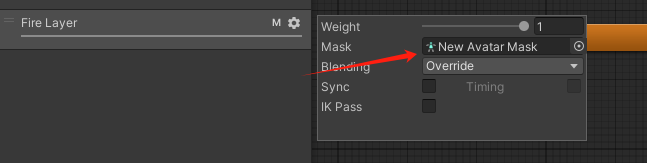

# 面板

## 如果保证不同场景共用一个Canvas

- 先创建一个Canvas 将EventSystem拖到里面成为他的儿子 然后一起作为一个预设体 到时候UIManager就加载这个预设体 并且过场景的时候不删除 不然的话 每个场景都会有自己单独的一个Canvas 你到时候切换场景的时候上一个场景里Canvas有的内容就会丢失了 新场景的Canvas什么都没有

# 人物模型动作配置

## 移动

- 创造一个混合树 根据x轴和y轴方向上的速度来配动作

- 对于蹲下的动作 可以直接复用之前跑步的动作 再把里面的动作全部替换成蹲下就可以了 因为混合树不能直接复制 所以混合树要重新配 但是连线和状态都是直接复制了一份的

## 开火动作

- 创建遮罩 使得开火只对上半身有影响 其他没什么需要注意的了

## 动画状态机复用

- 注意创建的状态机选项 然后填入要复用的状态机 把里面动作进行替换就可以了

# 数据配置表准备

- 配制好Excel表 然后再beJson转换 注意不要有换行 不然结尾会有逗号和空格 会出错 记得删掉

- 将Json文件放入StreamingAsset文件夹下 因为唐老师给的JsonMgr是自己写的 就是默认读取StreamingAsset里面的内容 所以Json文件放哪里要看你代码读取哪里具体而定

# 寻路系统设置

- 选择所有场景障碍物的父对象 将他的寻路打开

- 植物不参与地形烘焙 所以可以单独选出来取消 取消过后记得重新烘焙

- 打开窗口 点击烘焙

# 不使用刚体而用角色控制器实现碰撞

- 这样也能够和场景产生碰撞

# 不是所有场景都需要的单例模式清除

- 这个是挂在游戏场景上一个物体的脚本 设置成了单例模式 但是游戏结束的时候就不需要了 这个就是在切换场景的时候把这个单例模式清除了

# 从Resources中加载状态机

# 延迟函数的使用

- 前面函数名称 后面是延迟的时间

# 场景未加载完时立马使用场景中物体引起的报错解决方法

- 如图 场景刚开始加载 马上初始化 如果用了场景里面的东西 比如你在场景里面设置了什么位置啊什么的 就会报错

- 通过异步加载的方式 等加载完成后才开始执行