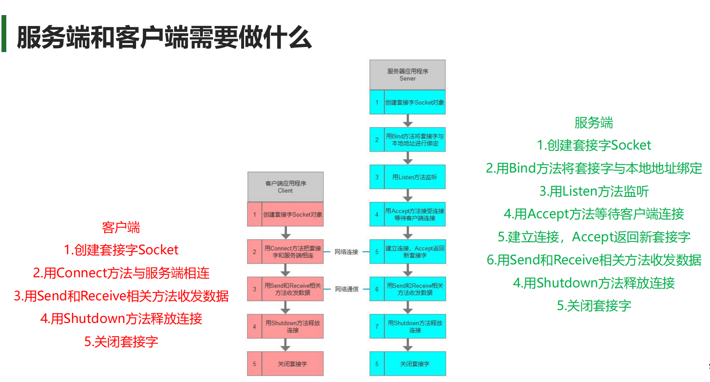
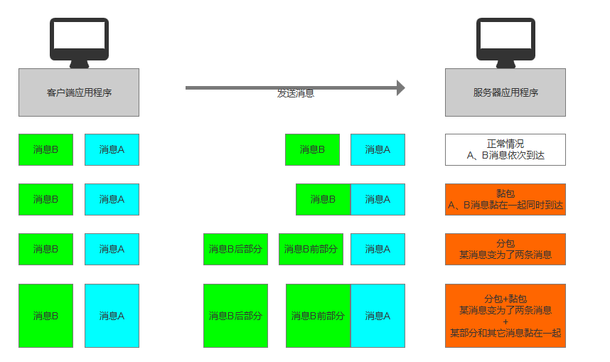

# 网络通信 – Socket – TCP

## IP地址和端口类

### IP类和端口类的作用

- 进行网络通信时，需要找到对应的设备，IP地址和端口号是定位网络中设备的关键元素。
- C# 提供了对应的 IP 和端口相关的类来声明这些信息，对于网络通信是必不可少的。

### IPAddress 类

- **命名空间**：`System.Net`
- **类名**：`IPAddress`

**初始化 IP 信息的方式**：

1. **用 byte 数组进行初始化**：
   ```csharp
   byte[] ipAddress = new byte[] { 118, 102, 111, 11 };
   IPAddress ip1 = new IPAddress(ipAddress);
   ```

2. **用 long 长整型进行初始化**（不推荐）：
   ```csharp
   IPAddress ip2 = new IPAddress(0x76666F0B);
   ```

3. **推荐使用的方式：使用字符串转换**：
   ```csharp
   IPAddress ip3 = IPAddress.Parse("118.102.111.11");
   ```

**特殊 IP 地址**：
- `127.0.0.1` 代表本机地址。

**一些静态成员**：
- 获取可用的 IPv6 地址：
  ```csharp
  IPAddress.IPv6Any
  ```

### IPEndPoint 类

- **命名空间**：`System.Net`
- **类名**：`IPEndPoint`
- `IPEndPoint` 类将网络端点表示为 IP 地址和端口号的组合。

**初始化方式**：
```csharp
IPEndPoint ipPoint = new IPEndPoint(0x76666F0B, 8080);

IPEndPoint ipPoint2 = new IPEndPoint(IPAddress.Parse("118.102.111.11"), 8080);
```

### 总结

- **程序表示 IP 信息**：
  ```csharp
  IPAddress ip = IPAddress.Parse("IPv4地址");
  ```
- **程序表示通信目标**：
  ```csharp
  IPEndPoint point = new IPEndPoint(ip, 8080);
  ```


## 域名解析

### 什么是域名解析？

- **域名解析**：将易记的域名转换为IP地址的过程。
- **IP地址**：网络上标识站点的数字地址，但记忆困难。
- **域名**：代替IP地址标识站点地址，方便记忆。
- 例如，访问网页 `www.baidu.com` 时，通过域名解析获取对应的IP地址。
- 域名解析由**DNS服务器**完成，是互联网服务的一部分。

###  IPHostEntry 类

- **命名空间**：`System.Net`
- **类名**：`IPHostEntry`
- **作用**：域名解析后的返回值，通过该对象获取IP地址、主机名等信息。
- **成员变量**：
  - `AddressList`：获取关联IP。
  - `Aliases`：获取主机别名列表。
  - `HostName`：获取DNS名称。

### Dns 类

- **命名空间**：`System.Net`
- **类名**：`Dns`
- **作用**：静态类，提供静态方法，用于根据域名获取IP地址。
- **常用方法**：
  1. 获取本地系统的主机名：
     ```csharp
     print(Dns.GetHostName());
     ```
  2. 获取指定域名的IP信息：
     - 同步获取（可能阻塞主线程）：
       ```csharp
       IPHostEntry entry = Dns.GetHostEntry("www.baidu.com");
       for (int i = 0; i < entry.AddressList.Length; i++)
       { 
           print("IP地址：" + entry.AddressList[i]);
       } 
       for (int i = 0; i < entry.Aliases.Length; i++)
       {
           print("主机别名" + entry.Aliases[i]);
       }
       print("DNS服务器名称" + entry.HostName);
       ```
     - 异步获取：
       ```csharp
       private async void GetHostEntry()
       {
           Task<IPHostEntry> task = Dns.GetHostEntryAsync("www.baidu.com");
           await task;
           for (int i = 0; i < task.Result.AddressList.Length; i++)
           {
               print("IP地址：" + task.Result.AddressList[i]);
           }
           for (int i = 0; i < task.Result.Aliases.Length; i++)
           {
               print("主机别名" + task.Result.Aliases[i]);
           }
           print("DNS服务器名称" + task.Result.HostName);
       }
       ```


## 通信前的必备知识 – 序列化和反序列化2进制数据

### 序列化


#### 非字符串类型转字节数组

- **关键类**：`BitConverter`
- **所在命名空间**：`System`
- **主要作用**：除字符串外的其它常用类型和字节数组相互转换。

```csharp
byte[] bytes = BitConverter.GetBytes(1);
```

#### 字符串类型转字节数组

- **关键类**：`Encoding`
- **所在命名空间**：`System.Text`
- **主要作用**：将字符串类型和字节数组相互转换，决定转换时使用的字符编码类型。网络通信时推荐使用UTF-8类型。

```csharp
byte[] byte2 = Encoding.UTF8.GetBytes("的卡萨福利卡决胜巅峰卡视角的副驾驶的");
```

#### 如何将一个类对象转换为二进制

- 在网络通信中，不能直接使用 `BinaryFormatter` 进行二进制序列化，因为不同语言之间的兼容性不好。需要自己处理将类对象数据序列化为字节数组。

##### 转换步骤

1. **明确字节数组的容量**（注意：在确定字符串字节长度时要考虑解析时如何处理）。
2. **声明一个装载信息的字节数组容器**。
3. **将对象中的所有信息转为字节数组并放入该容器中**（可以利用数组中的 `CopyTo` 方法转存字节数组）。

```c#
public class PlayerInfo
{
    public int lev;
    public string name;
    public short atk;
    public bool sex;

    public byte[] GetBytes()
    {
        int indexNum = sizeof(int) + //lev int类型  4
                      sizeof(int) + //代表 name字符串转换成字节数组后 数组的长度 4
                      Encoding.UTF8.GetBytes(name).Length + //字符串具体字节数组的长度
                      sizeof(short) + //atk short类型 2
                      sizeof(bool); //sex bool类型 1

        byte[] playerBytes = new byte[indexNum];
        int index = 0;//从 playerBytes数组中的第几个位置去存储数据

        //等级
        BitConverter.GetBytes(lev).CopyTo(playerBytes, index);
        index += sizeof(int);

        //姓名
        byte[] strBytes = Encoding.UTF8.GetBytes(name);
        int num = strBytes.Length;
        //存储的是姓名转换成字节数组后 字节数组的长度
        BitConverter.GetBytes(num).CopyTo(playerBytes, index);
        index += sizeof(int);
        //存储字符串的字节数组
        strBytes.CopyTo(playerBytes, index);
        index += num;

        //攻击力
        BitConverter.GetBytes(atk).CopyTo(playerBytes, index);
        index += sizeof(short);
        //性别
        BitConverter.GetBytes(sex).CopyTo(playerBytes, index);
        index += sizeof(bool);

        return playerBytes;
    }
}
```


### 反序列化

#### 字节数组转非字符串类型

- **关键类**：`BitConverter`
- **所在命名空间**：`System`
- **主要作用**：除字符串外的其他常用类型和字节数组相互转换。

```csharp
byte[] bytes = BitConverter.GetBytes(99);
int i = BitConverter.ToInt32(bytes, 0);
print(i);
```

#### 字节数组转字符串类型

- **关键类**：`Encoding`
- **所在命名空间**：`System.Text`
- **主要作用**：将字符串类型和字节数组相互转换，决定转换时使用的字符编码类型。网络通信时推荐使用UTF-8编码。

```csharp
byte[] bytes2 = Encoding.UTF8.GetBytes("123空间大撒了房间阿斯利康放大镜");
string str = Encoding.UTF8.GetString(bytes2, 0, bytes2.Length);
print(str);
```

#### 如何将二进制数据转为类对象

##### 获取对应的字节数组

```csharp
PlayerInfo info = new PlayerInfo();
info.lev = 10;
info.name = "唐老狮";
info.atk = 88;
info.sex = false;

byte[] playerBytes = info.GetBytes();
```

##### 将字节数组按照序列化时的顺序进行反序列化

```csharp
PlayerInfo info2 = new PlayerInfo();
int index = 0;
info2.lev = BitConverter.ToInt32(playerBytes, index);
index += 4;
print(info2.lev);

int length = BitConverter.ToInt32(playerBytes, index);
index += 4;
info2.name = Encoding.UTF8.GetString(playerBytes, index, length);
index += length;
print(info2.name);

info2.atk = BitConverter.ToInt16(playerBytes, index);
index += 2;
print(info2.atk);

info2.sex = BitConverter.ToBoolean(playerBytes, index);
index += 1;
print(info2.sex);
```


### 练习 序列化与反序列化公共类

```c#
using System;
using System.Collections;
using System.Collections.Generic;
using System.Text;
using UnityEngine;

public abstract class BaseData
{
    /// <summary>
    /// 用于子类重写的 获取字节数组容器大小的方法
    /// </summary>
    /// <returns></returns>
    public abstract int GetBytesNum();

    /// <summary>
    /// 把成员变量 序列化为 对应的字节数组
    /// </summary>
    /// <returns></returns>
    public abstract byte[] Writing();

    /// <summary>
    /// 把2进制字节数组 反序列化到 成员变量当中
    /// </summary>
    /// <param name="bytes">反序列化使用的字节数组</param>
    /// <param name="beginIndex">从该字节数组的第几个位置开始解析 默认是0</param>
    public abstract int Reading(byte[] bytes, int beginIndex = 0);

    /// <summary>
    /// 存储int类型变量到指定的字节数组当中
    /// </summary>
    /// <param name="bytes">指定字节数组</param>
    /// <param name="value">具体的int值</param>
    /// <param name="index">每次存储后用于记录当前索引位置的变量</param>
    protected void WriteInt(byte[] bytes, int value, ref int index)
    {
        BitConverter.GetBytes(value).CopyTo(bytes, index);
        index += sizeof(int);
    }
    protected void WriteShort(byte[] bytes, short value, ref int index)
    {
        BitConverter.GetBytes(value).CopyTo(bytes, index);
        index += sizeof(short);
    }
    protected void WriteLong(byte[] bytes, long value, ref int index)
    {
        BitConverter.GetBytes(value).CopyTo(bytes, index);
        index += sizeof(long);
    }
    protected void WriteFloat(byte[] bytes, float value, ref int index)
    {
        BitConverter.GetBytes(value).CopyTo(bytes, index);
        index += sizeof(float);
    }
    protected void WriteByte(byte[] bytes, byte value, ref int index)
    {
        bytes[index] = value;
        index += sizeof(byte);
    }
    protected void WriteBool(byte[] bytes, bool value, ref int index)
    {
        BitConverter.GetBytes(value).CopyTo(bytes, index);
        index += sizeof(bool);
    }
    protected void WriteString(byte[] bytes, string value, ref int index)
    {
        //先存储string字节数组的长度
        byte[] strBytes = Encoding.UTF8.GetBytes(value);
        //BitConverter.GetBytes(strBytes.Length).CopyTo(bytes, index);
        //index += sizeof(int);
        WriteInt(bytes, strBytes.Length, ref index);
        //再存 string字节数组
        strBytes.CopyTo(bytes, index);
        index += strBytes.Length;
    }
    protected void WriteData(byte[] bytes, BaseData data, ref int index)
    {
        data.Writing().CopyTo(bytes, index);
        index += data.GetBytesNum();
    }

    /// <summary>
    /// 根据字节数组 读取整形
    /// </summary>
    /// <param name="bytes">字节数组</param>
    /// <param name="index">开始读取的索引数</param>
    /// <returns></returns>
    protected int ReadInt(byte[] bytes, ref int index)
    {
        int value = BitConverter.ToInt32(bytes, index);
        index += sizeof(int);
        return value;
    }
    protected short ReadShort(byte[] bytes, ref int index)
    {
        short value = BitConverter.ToInt16(bytes, index);
        index += sizeof(short);
        return value;
    }
    protected long ReadLong(byte[] bytes, ref int index)
    {
        long value = BitConverter.ToInt64(bytes, index);
        index += sizeof(long);
        return value;
    }
    protected float ReadFloat(byte[] bytes, ref int index)
    {
        float value = BitConverter.ToSingle(bytes, index);
        index += sizeof(float);
        return value;
    }
    protected byte ReadByte(byte[] bytes, ref int index)
    {
        byte value = bytes[index];
        index += sizeof(byte);
        return value;
    }
    protected bool ReadBool(byte[] bytes, ref int index)
    {
        bool value = BitConverter.ToBoolean(bytes, index);
        index += sizeof(bool);
        return value;
    }
    protected string ReadString(byte[] bytes, ref int index)
    {
        //首先读取长度
        int length = ReadInt(bytes, ref index);
        //再读取string
        string value = Encoding.UTF8.GetString(bytes, index, length);
        index += length;
        return value;
    }
    protected T ReadData<T>(byte[] bytes, ref int index) where T:BaseData,new()
    {
        T value = new T();
        index += value.Reading(bytes, index);
        return value;
    }
}

```


```c#
//Test
using System.Collections;
using System.Collections.Generic;
using System.Text;
using UnityEngine;

public class TestInfo : BaseData
{
    public short lev;
    public Player p;
    public int hp;
    public string name;
    public bool sex;
    public override int GetBytesNum()
    {
        return sizeof(short) +//2 
            p.GetBytesNum() + //4
            sizeof(int) +//4
            4 + Encoding.UTF8.GetBytes(name).Length + //4+n
            sizeof(bool);//1
    }

    public override byte[] Writing()
    {
        int index = 0;
        byte[] bytes = new byte[GetBytesNum()];
        WriteShort(bytes, lev, ref index);
        WriteData(bytes, p, ref index);
        WriteInt(bytes, hp, ref index);
        WriteString(bytes, name, ref index);
        WriteBool(bytes, sex, ref index);
        //序列化list的长度是多少
        //在循环这个list保存对应的类型
        return bytes;
    }

    public override int Reading(byte[] bytes, int beginIndex = 0)
    {
        int index = beginIndex;
        lev = ReadShort(bytes, ref index);//0
        p = ReadData<Player>(bytes, ref index);//2
        hp = ReadInt(bytes, ref index);//6
        name = ReadString(bytes, ref index);//10
        sex = ReadBool(bytes, ref index);//17
        //反序列化出list的长度
        //循环反序列化对应的内容
        return index - beginIndex;
    }
}

public class Player : BaseData
{
    public int atk;
    public override int GetBytesNum()
    {
        return 4;
    }

    public override byte[] Writing()
    {
        int index = 0;
        byte[] bytes = new byte[GetBytesNum()];
        WriteInt(bytes, atk, ref index);
        return bytes;
    }

    public override int Reading(byte[] bytes, int beginIndex = 0)
    {
        int index = beginIndex;
        atk = ReadInt(bytes, ref index);
        return index - beginIndex;
    }
}


public class Test : MonoBehaviour
{
    // Start is called before the first frame update
    void Start()
    {
        TestInfo info = new TestInfo();
        info.lev = 87;
        info.p = new Player();
        info.p.atk = 77;
        info.hp = 100;
        info.name = "唐老狮";
        info.sex = false;

        byte[] bytes = info.Writing();

        TestInfo info2 = new TestInfo();
        info2.Reading(bytes);
        print(info2.lev);
        print(info2.p.atk);
        print(info2.hp);
        print(info2.name);
        print(info2.sex);
    }

    // Update is called once per frame
    void Update()
    {
        
    }
}
```


## TCP通信 – 同步


### Socket的重要API

#### Socket套接字的作用

- **Socket套接字** 是用于网络通信的类，它提供了TCP/IP网络通信的基本操作。
- 一个 **Socket对象** 包含以下关键信息：
  1. 本机的IP地址和端口
  2. 对方主机的IP地址和端口
  3. 双方通信的协议信息
- 一个 **Socket对象** 表示一个本地或远程套接字信息，可以被视为一个数据通道，用于客户端和服务端之间的数据发送和接收。

### Socket的类型

- **Socket套接字** 有3种不同的类型：
  1. **流套接字**：实现TCP通信，提供可靠、有序、数据无差错且无重复的数据传输服务。
  2. **数据报套接字**：实现UDP通信，提供无连接的服务，数据包长度不能大于32KB，不提供正确性检查，不保证顺序，可能出现重发、丢失等情况。
  3. **原始套接字**：主要用于IP数据包通信，用于直接访问协议的较低层，常用于侦听和分析数据包。
- 通过Socket的构造函数可以声明不同类型的套接字：
  - `Socket s = new Socket(AddressFamily, SocketType, ProtocolType);`
  - 参数一：`AddressFamily` 网络寻址枚举类型，决定寻址方案。
  - 参数二：`SocketType` 套接字枚举类型，决定使用的套接字类型。
  - 参数三：`ProtocolType` 协议类型枚举类型，决定套接字使用的通信协议。

```c#
//TCP流套接字
Socket socketTcp = new Socket(AddressFamily.InterNetwork, SocketType.Stream, ProtocolType.Tcp);
//UDP数据报套接字
Socket socketTcp = new Socket(AddressFamily.InterNetwork, SocketType.Dgram, ProtocolType.Udp);
```


### Socket的常用属性

- **套接字的连接状态**：`socket.Connected`
- **获取套接字的类型**：`socket.SocketType`
- **获取套接字的协议类型**：`socket.ProtocolType`
- **获取套接字的寻址方案**：`socket.AddressFamily`
- **从网络中获取准备读取的数据量**：`socket.Available`
- **获取本机EndPoint对象**：`socket.LocalEndPoint`
- **获取远程EndPoint对象**：`socket.RemoteEndPoint`

### Socket的常用方法

- **服务端**：
  1. 绑定IP和端口：`IPEndPoint ipPoint = new IPEndPoint(...); socket.Bind(ipPoint);`
  2. 设置客户端连接的最大数量：`socket.Listen(10);`
  3. 等待客户端连入：`socket.Accept();`
- **客户端**：
  1. 连接远程服务端：`socket.Connect(IPAddress.Parse("118.12.123.11"), 8080);`
- **客户端服务端都会用**：
  1. 同步发送和接收数据
  2. 异步发送和接收数据
  3. 释放连接并关闭Socket，先与Close调用`socket.Shutdown(SocketShutdown.Both);`
  4. 关闭连接，释放所有Socket关联资源`socket.Close();`





### 服务端

#### 服务端需要做的事情

1. 创建套接字（Socket）
2. 用 `Bind` 方法将套接字与本地地址绑定
3. 用 `Listen` 方法监听
4. 用 `Accept` 方法等待客户端连接
5. 建立连接，`Accept` 返回新套接字
6. 用 `Send` 和 `Receive` 相关方法收发数据
7. 用 `Shutdown` 方法释放连接
8. 关闭套接字

#### 实现服务端基本逻辑

1. 创建套接字（TCP）
   ```csharp
   Socket socketTcp = new Socket(AddressFamily.InterNetwork, SocketType.Stream, ProtocolType.Tcp);
   ```
2. 用 `Bind` 方法将套接字与本地地址绑定
   ```csharp
   try
   {
       IPEndPoint ipPoint = new IPEndPoint(IPAddress.Parse("127.0.0.1"), 8080);
       socketTcp.Bind(ipPoint);
   }
   catch (Exception e)
   {
       Console.WriteLine("绑定报错" + e.Message);
       return;
   }
   ```
3. 用 `Listen` 方法监听
   ```csharp
   socketTcp.Listen(1024);	//代表可以接入1024个客户端
   Console.WriteLine("服务端绑定监听结束，等待客户端连入");
   ```
4. 用 `Accept` 方法等待客户端连接
5. 建立连接，`Accept` 返回新套接字
   ```csharp
   Socket socketClient = socketTcp.Accept();	//4, 5步都在这行代码
   Console.WriteLine("有客户端连入了");
   ```
6. 用 `Send` 和 `Receive` 相关方法收发数据
   - 发送
     ```csharp
     socketClient.Send(Encoding.UTF8.GetBytes("欢迎连入服务端"));
     ```
   - 接受
     ```csharp
     byte[] result = new byte[1024];
     int receiveNum = socketClient.Receive(result);	//接受到的字节数量
     Console.WriteLine("接受到了{0}发来的消息：{1}",
         socketClient.RemoteEndPoint.ToString(),
         Encoding.UTF8.GetString(result, 0, receiveNum));
     ```
7. 用 `Shutdown` 方法释放连接
   ```csharp
   socketClient.Shutdown(SocketShutdown.Both);
   ```
8. 关闭套接字
   ```csharp
   socketClient.Close();
   ```

#### 总结

1. 服务端开启的流程每次都是相同的。
2. 服务端的 `Accept`、`Send`、`Receive` 是会阻塞主线程的，要等到执行完毕才会继续执行后面的内容。


### 客户端

#### 客户端需要做的事情

1. 创建套接字（Socket）
2. 用 `Connect` 方法与服务端相连
3. 用 `Send` 和 `Receive` 相关方法收发数据
4. 用 `Shutdown` 方法释放连接
5. 关闭套接字

#### 实现客户端基本逻辑

1. 创建套接字（TCP）
   ```csharp
   Socket socket = new Socket(AddressFamily.InterNetwork, SocketType.Stream, ProtocolType.Tcp);
   ```

2. 用 `Connect` 方法与服务端相连
   - 确定服务端的IP和端口
   ```csharp
   //因为服务端运行在本机上 所以ip地址是自己
   IPEndPoint ipPoint = new IPEndPoint(IPAddress.Parse("127.0.0.1"), 8080);
   try
   {
       socket.Connect(ipPoint);
   }
   catch (SocketException e)
   {
       if (e.ErrorCode == 10061)
            print("服务器拒绝连接");
       else
            print("连接服务器失败" + e.ErrorCode);
       return;
   }
   ```
   
3. 用 `Send` 和 `Receive` 相关方法收发数据

	- 接收数据

		```c#
		byte[] receiveBytes = new byte[1024];
		int receiveNum = socket.Receive(receiveBytes);
		print("收到服务端发来的消息：" + Encoding.UTF8.GetString(receiveBytes, 0, receiveNum));
		```

	- 发送数据

		```c#
		socket.Send(Encoding.UTF8.GetBytes("你好，我是唐老狮的客户端"));
		```

		


4. 用 `Shutdown` 方法释放连接
   ```csharp
   socket.Shutdown(SocketShutdown.Both);
   ```

5. 关闭套接字
   ```csharp
   socket.Close();
   ```

#### 总结

- 客户端的连接流程包括创建套接字、连接服务端、收发数据、释放连接和关闭套接字。
- 客户端的 `Connect`、`Send`、`Receive` 操作可能会抛出异常，需要进行异常处理。
- 客户端与服务端的通信需要确保正确的IP地址和端口号，并且要处理可能的连接失败情况。


### 服务端综合练习 

**(唐老师这里写的不好理解 非得把发送接收方法封装到客户端类里 很抽象 应该在服务器类里然后传客户端作为参数更好理解)**


#### **1.允许多个客户端连入服务器   2.可以分别和多个客户端进行通信**

```c#
using System;
using System.Collections.Generic;
using System.Net;
using System.Net.Sockets;
using System.Text;
using System.Threading;

namespace TeachTcpServerExercises
{
    class Program
    {
        static Socket socket;
        //用于存储 客户端连入的 Socket 之后可以获取他们来进行通信
        static List<Socket> clientSockets = new List<Socket>();

        static bool isClose = false;
        static void Main(string[] args)
        {
            //1.建立Socket 绑定 监听 
            socket = new Socket(AddressFamily.InterNetwork, SocketType.Stream, ProtocolType.Tcp);
            IPEndPoint ipPoint = new IPEndPoint(IPAddress.Parse("127.0.0.1"), 8080);
            socket.Bind(ipPoint);
            socket.Listen(1024);

            //2.等待客户端连接（这节课需要特别处理的地方）
            Thread acceptThread = new Thread(AcceptClientConnect);
            acceptThread.Start();

            //3.收发消息（这节课需要特别处理的地方）
            Thread receiveThread = new Thread(ReceiveMsg);
            receiveThread.Start();

            //4.关闭相关
            while (true)
            {
                string input = Console.ReadLine();
                //定义一个规则 关闭服务器 断开所有连接
                if(input == "Quit")
                {
                    isClose = true;
                    for (int i = 0; i < clientSockets.Count; i++)
                    {
                        clientSockets[i].Shutdown(SocketShutdown.Both);
                        clientSockets[i].Close();
                    }
                    clientSockets.Clear();
                    break;
                }
                //定义一个规则 广播消息 就是让所有客户端收到服务端发送的消息
                else if(input.Substring(0, 2) == "B:")
                {
                    for (int i = 0; i < clientSockets.Count; i++)
                    {
                        clientSockets[i].Send(Encoding.UTF8.GetBytes(input.Substring(2)));
                    }
                }
            }
        }

        static void AcceptClientConnect()
        {
            while (!isClose)
            {
                Socket clientSocket = socket.Accept();
                clientSockets.Add(clientSocket);
                clientSocket.Send(Encoding.UTF8.GetBytes("欢迎你连入服务端"));
            }
        }

        static void ReceiveMsg()
        {
            Socket clientSocket;
            byte[] result = new byte[1024 * 1024];
            int receiveNum;
            int i;
            while (!isClose)
            {
                for (i = 0; i < clientSockets.Count; i++)
                {
                    clientSocket = clientSockets[i];
                    //判断 该socket是否有可以接收的消息 返回值就是字节数
                    if(clientSocket.Available > 0)
                    {
                        //客户端即使没有发消息过来 这句代码也会执行
                        receiveNum = clientSocket.Receive(result);
                        //如果直接在这收到消息 就处理 可能造成问题
                        //不能够即时的处理别人的消息
                        //为了不影响别人消息的处理 我们把消息处理 交给新的线程，为了节约线程相关的开销 我们使用线程池
                        ThreadPool.QueueUserWorkItem(HandleMsg, (clientSocket, Encoding.UTF8.GetString(result, 0, receiveNum)));
                    }
                    
                }
            }
        }

        static void HandleMsg(object obj)
        {
            (Socket s, string str) info = ((Socket s, string str))obj;
            Console.WriteLine("收到客户端{0}发来的信息：{1}", info.s.RemoteEndPoint, info.str);
        }
    }
}
```


#### 将服务端和客户端封装成类


##### ClientSocket

```c#
using System;
using System.Collections.Generic;
using System.Net.Sockets;
using System.Text;
using System.Threading;

namespace TeachTcpServerExercises2
{
    class ClientSocket
    {
        private static int CLIENT_BEGIN_ID = 1;
        public int clientID;
        public Socket socket;

        public ClientSocket(Socket socket)
        {
            this.clientID = CLIENT_BEGIN_ID;
            this.socket = socket;
            ++CLIENT_BEGIN_ID;
        }

        /// <summary>
        /// 是否是连接状态
        /// </summary>
        public bool Connected => this.socket.Connected;

        //我们应该封装一些方法
        //关闭
        public void Close()
        {
            if(socket != null)
            {
                socket.Shutdown(SocketShutdown.Both);
                socket.Close();
                socket = null;
            }
        }
        
        //服务器调用这个方法发送消息到这个类记录的客户端socket 也就是发送消息到客户端
        public void Send(string info)
        {
            if(socket != null)
            {
                try
                {
                    socket.Send(Encoding.UTF8.GetBytes(info));
                }
                catch(Exception e)
                {
                    Console.WriteLine("发消息出错" + e.Message);
                    Close();
                }
            }
                
        }
        
        //服务端调用接收方法接收客户端的消息 这里socket虽然是客户端的socket 但是这个Available代表的是客户端是否有发送过消息	
        public void Receive()
        {
            if (socket == null)
                return;
            try
            {
                if(socket.Available > 0)
                {
                    byte[] result = new byte[1024 * 5];
                    int receiveNum = socket.Receive(result);
                    ThreadPool.QueueUserWorkItem(MsgHandle, Encoding.UTF8.GetString(result, 0, receiveNum));
                }
            }
            catch (Exception e)
            {
                Console.WriteLine("收消息出错" + e.Message);
                Close();
            }
        }

        private void MsgHandle(object obj)
        {
            string str = obj as string;
            Console.WriteLine("收到客户端{0}发来的消息：{1}", this.socket.RemoteEndPoint, str);
        }

    }
}

```


##### ServerSocket

```c#
using System;
using System.Collections.Generic;
using System.Net;
using System.Net.Sockets;
using System.Text;
using System.Threading;

namespace TeachTcpServerExercises2
{
    class ServerSocket
    {
        //服务端Socket
        public Socket socket;
        //客户端连接的所有Socket
        public Dictionary<int, ClientSocket> clientDic = new Dictionary<int, ClientSocket>();

        private bool isClose;

        //开启服务器端
        public void Start(string ip, int port, int num)
        {
            isClose = false;
            socket = new Socket(AddressFamily.InterNetwork, SocketType.Stream, ProtocolType.Tcp);
            IPEndPoint ipPoint = new IPEndPoint(IPAddress.Parse(ip), port);
            socket.Bind(ipPoint);
            socket.Listen(num);
            ThreadPool.QueueUserWorkItem(Accept);
            ThreadPool.QueueUserWorkItem(Receive);
        }

        //关闭服务器端
        public void Close()
        {
            isClose = true;
            foreach (ClientSocket client in clientDic.Values)
            {
                client.Close();
            }
            clientDic.Clear();

            socket.Shutdown(SocketShutdown.Both);
            socket.Close();
            socket = null;
        }

        //接受客户端连入
        private void Accept(object obj)
        {
            while (!isClose)
            {
                try
                {
                    //连入一个客户端 !!!!这里是理解最重要的地方 因为这个clientSocket并不是客户端socket本身 而是服务端专门创建了一个socket用来记录客户端而已
                    //所以这里的socket.Receive()实际上是服务端接收客户端的消息 而不是客户端接收服务端的消息
                    //下面会发现客户端接收服务端的消息也是socket.Receive() 这个很好的解释了为什么两者代码一样但是意义不同
                    Socket clientSocket = socket.Accept();
                    ClientSocket client = new ClientSocket(clientSocket);
                    client.Send("欢迎连入服务器");
                    clientDic.Add(client.clientID, client);
                }
                catch (Exception e)
                {
                    Console.WriteLine("客户端连入报错" + e.Message);
                }
            }
        }
        
        //接受客户端发来的消息 这句话是对的 只不过这里的代码没有体现客户端向服务端发送消息而已
        private void Receive(object obj)
        {
            while (!isClose)
            {
                if(clientDic.Count > 0)
                {
                    foreach (ClientSocket client in clientDic.Values)
                    {
                        client.Receive();
                    }
                }
            }
        }

        public void Broadcast(string info)
        {
            foreach (ClientSocket client in clientDic.Values)
            {
                client.Send(info);
            }
        }
    }
}

```


##### Program

```c#
using System;

namespace TeachTcpServerExercises2
{
    class Program
    {
        static void Main(string[] args)
        {
            ServerSocket socket = new ServerSocket();
            socket.Start("127.0.0.1", 8080, 1024);
            Console.WriteLine("服务器开启成功");
            while (true)
            {
                string input = Console.ReadLine();
                if(input == "Quit")
                {
                    socket.Close();
                }
                else if( input.Substring(0,2) == "B:" )
                {
                    socket.Broadcast(input.Substring(2));
                }
            }
        }
    }
}
```


### 客户端综合练习

#### 1.客户端的网络连接不影响主线程 2.可以随时和服务端进行通信


##### NetMgr

```c#
using System.Collections;
using System.Collections.Generic;
using System.Net;
using System.Net.Sockets;
using System.Text;
using System.Threading;
using UnityEngine;

public class NetMgr : MonoBehaviour
{
    private static NetMgr instance;

    public static NetMgr Instance => instance;

    //客户端Socket 但是是连接到服务端的 和服务端的理解又不同了, 服务端的socket只接受不连接 所以发送信息是用别人的socket.send代表发给别人, 而这里的
    //socket.send是用自己的socket发送消息到自己连接的对象上 经常容易产生误解
    private Socket socket;
    //用于发送消息的队列 公共容器 主线程往里面放 发送线程从里面取
    private Queue<string> sendMsgQueue = new Queue<string>();
    //用于接收消息的对象 公共容器 子线程往里面放 主线程从里面取
    private Queue<string> receiveQueue = new Queue<string>();

    //用于收消息的水桶（容器）
    private byte[] receiveBytes = new byte[1024 * 1024];
    //返回收到的字节数
    private int receiveNum;

    //是否连接
    private bool isConnected = false;

    void Awake()
    {
        instance = this;
        DontDestroyOnLoad(this.gameObject);
    }

    // Update is called once per frame
    void Update()
    {
        if(receiveQueue.Count > 0)
        {
            print(receiveQueue.Dequeue());
        }
    }

    //连接服务端
    public void Connect(string ip, int port)
    {
        //如果是连接状态 直接返回
        if (isConnected)
            return;

        if (socket == null)
            socket = new Socket(AddressFamily.InterNetwork, SocketType.Stream, ProtocolType.Tcp);
        
        //连接服务端
        IPEndPoint ipPoint = new IPEndPoint(IPAddress.Parse(ip), port);
        try
        {
            socket.Connect(ipPoint);
            isConnected = true;
            //开启发送线程
            ThreadPool.QueueUserWorkItem(SendMsg);
            //开启接收线程
            ThreadPool.QueueUserWorkItem(ReceiveMsg);
        }
        catch (SocketException e)
        {
            if (e.ErrorCode == 10061)
                print("服务器拒绝连接");
            else
                print("连接失败" + e.ErrorCode + e.Message);
        }
    }

    //发送消息
    public void Send(string info)
    {
        //网卡的时候有可能阻塞整个程序 所以把他扔到队列里面去另开一个线程来发消息 不会阻塞当前程序
        sendMsgQueue.Enqueue(info);
    }

    private void SendMsg(object obj)
    {
        while (isConnected)
        {
            if (sendMsgQueue.Count > 0)
            {
                socket.Send(Encoding.UTF8.GetBytes(sendMsgQueue.Dequeue()));
            }
        }
    }

    //不停的接受消息
    private void ReceiveMsg(object obj)
    {
        while (isConnected)
        {
            if(socket.Available > 0)
            {
                receiveNum = socket.Receive(receiveBytes);
                //收到消息 解析消息为字符串 并放入公共容器
                receiveQueue.Enqueue(Encoding.UTF8.GetString(receiveBytes, 0, receiveNum));
            }    
        }
    }

    public void Close()
    {
        if(socket != null)
        {
            socket.Shutdown(SocketShutdown.Both);
            socket.Close();

            isConnected = false;
        }
    }

    private void OnDestroy()
    {
        Close();
    }
}

```


##### main

```c#
using System.Collections;
using System.Collections.Generic;
using UnityEngine;

public class Main : MonoBehaviour
{
    // Start is called before the first frame update
    void Start()
    {
        if(NetMgr.Instance == null)
        {
            GameObject obj = new GameObject("Net");
            obj.AddComponent<NetMgr>();
        }

        NetMgr.Instance.Connect("127.0.0.1", 8080);
    }
}
```


##### 使用

```c#
//直接调用网络管理器向服务端发送消息
using System.Collections;
using System.Collections.Generic;
using UnityEngine;
using UnityEngine.UI;

public class Lesson7 : MonoBehaviour
{
    public Button btn;
    public InputField input;
    // Start is called before the first frame update
    void Start()
    {
        btn.onClick.AddListener(() =>
        {
            if(input.text != "")
                NetMgr.Instance.Send(input.text);
        });
    }
}

```


## 区分消息类型

### 发送自定义类数据

1. **继承** `BaseData` 类。
2. **实现** 其中的序列化、反序列化、获取字节数等相关方法。
3. **发送** 自定义类数据时序列化。
4. **接受** 自定义类数据时反序列化。

#### 抛出问题：

- 当将序列化的二进制数据发送给对象时，对方如何区分？
- 举例：`PlayerInfo`（玩家信息）、`ChatInfo`（聊天信息）、`LoginInfo`（登录信息）等。
- 这些数据对象序列化后是长度不同的字节数组。
- 将它们发送给对象后，对方如何区分出它们分别是什么消息？
- 如何选择对应的数据类反序列化它们？

### 如何区分消息

#### 解决方案：

- 为发送的信息添加标识，比如添加消息ID。
- 在所有发送的消息的头部加上消息ID（int、short、byte、long都可以，根据实际情况选择）。

#### 举例说明：
- 消息构成：
  - 如果选用int类型作为消息ID的类型：
    - 前4个字节为消息ID。
    - 后面的字节为数据类的内容。

- 这样每次收到消息时，先把前4个字节取出来解析为消息ID。
- 再根据ID进行消息反序列化即可。

### 实践

#### 实践步骤：

1. 创建消息基类，基类继承 `BaseData`，基类添加获取消息ID的方法或者属性。
2. 让想要被发送的消息继承该类，实现序列化反序列化方法。
3. 修改客户端和服务端收发消息的逻辑。

### 总结

- 区分消息的关键点是在数据字节数组头部加上消息ID。
- 只要前后端定义好统一的规则，我们可以通过ID来决定如何反序列化消息，并且可以决定我们应该如何处理该消息。


### 代码


#### BaseData

```c#
using System;
using System.Collections;
using System.Collections.Generic;
using System.Text;
using UnityEngine;

public abstract class BaseData
{
    /// <summary>
    /// 用于子类重写的 获取字节数组容器大小的方法
    /// </summary>
    /// <returns></returns>
    public abstract int GetBytesNum();

    /// <summary>
    /// 把成员变量 序列化为 对应的字节数组
    /// </summary>
    /// <returns></returns>
    public abstract byte[] Writing();

    /// <summary>
    /// 把2进制字节数组 反序列化到 成员变量当中
    /// </summary>
    /// <param name="bytes">反序列化使用的字节数组</param>
    /// <param name="beginIndex">从该字节数组的第几个位置开始解析 默认是0</param>
    public abstract int Reading(byte[] bytes, int beginIndex = 0);

    /// <summary>
    /// 存储int类型变量到指定的字节数组当中
    /// </summary>
    /// <param name="bytes">指定字节数组</param>
    /// <param name="value">具体的int值</param>
    /// <param name="index">每次存储后用于记录当前索引位置的变量</param>
    protected void WriteInt(byte[] bytes, int value, ref int index)
    {
        BitConverter.GetBytes(value).CopyTo(bytes, index);
        index += sizeof(int);
    }
    protected void WriteShort(byte[] bytes, short value, ref int index)
    {
        BitConverter.GetBytes(value).CopyTo(bytes, index);
        index += sizeof(short);
    }
    protected void WriteLong(byte[] bytes, long value, ref int index)
    {
        BitConverter.GetBytes(value).CopyTo(bytes, index);
        index += sizeof(long);
    }
    protected void WriteFloat(byte[] bytes, float value, ref int index)
    {
        BitConverter.GetBytes(value).CopyTo(bytes, index);
        index += sizeof(float);
    }
    protected void WriteByte(byte[] bytes, byte value, ref int index)
    {
        bytes[index] = value;
        index += sizeof(byte);
    }
    protected void WriteBool(byte[] bytes, bool value, ref int index)
    {
        BitConverter.GetBytes(value).CopyTo(bytes, index);
        index += sizeof(bool);
    }
    protected void WriteString(byte[] bytes, string value, ref int index)
    {
        //先存储string字节数组的长度
        byte[] strBytes = Encoding.UTF8.GetBytes(value);
        //BitConverter.GetBytes(strBytes.Length).CopyTo(bytes, index);
        //index += sizeof(int);
        WriteInt(bytes, strBytes.Length, ref index);
        //再存 string字节数组
        strBytes.CopyTo(bytes, index);
        index += strBytes.Length;
    }
    protected void WriteData(byte[] bytes, BaseData data, ref int index)
    {
        data.Writing().CopyTo(bytes, index);
        index += data.GetBytesNum();
    }

    /// <summary>
    /// 根据字节数组 读取整形
    /// </summary>
    /// <param name="bytes">字节数组</param>
    /// <param name="index">开始读取的索引数</param>
    /// <returns></returns>
    protected int ReadInt(byte[] bytes, ref int index)
    {
        int value = BitConverter.ToInt32(bytes, index);
        index += sizeof(int);
        return value;
    }
    protected short ReadShort(byte[] bytes, ref int index)
    {
        short value = BitConverter.ToInt16(bytes, index);
        index += sizeof(short);
        return value;
    }
    protected long ReadLong(byte[] bytes, ref int index)
    {
        long value = BitConverter.ToInt64(bytes, index);
        index += sizeof(long);
        return value;
    }
    protected float ReadFloat(byte[] bytes, ref int index)
    {
        float value = BitConverter.ToSingle(bytes, index);
        index += sizeof(float);
        return value;
    }
    protected byte ReadByte(byte[] bytes, ref int index)
    {
        byte value = bytes[index];
        index += sizeof(byte);
        return value;
    }
    protected bool ReadBool(byte[] bytes, ref int index)
    {
        bool value = BitConverter.ToBoolean(bytes, index);
        index += sizeof(bool);
        return value;
    }
    protected string ReadString(byte[] bytes, ref int index)
    {
        //首先读取长度
        int length = ReadInt(bytes, ref index);
        //再读取string
        string value = Encoding.UTF8.GetString(bytes, index, length);
        index += length;
        return value;
    }
    protected T ReadData<T>(byte[] bytes, ref int index) where T:BaseData,new()
    {
        T value = new T();
        index += value.Reading(bytes, index);
        return value;
    }
}
```


#### PlayerData

```c#
using System.Collections;
using System.Collections.Generic;
using System.Text;
using UnityEngine;

/// <summary>
/// 玩家数据类
/// </summary>
public class PlayerData : BaseData
{
    public string name;
    public int atk;
    public int lev;

    public override int GetBytesNum()
    {
        return 4 + 4 + 4 + Encoding.UTF8.GetBytes(name).Length;
    }

    public override int Reading(byte[] bytes, int beginIndex = 0)
    {
        int index = beginIndex;
        name = ReadString(bytes, ref index);
        atk = ReadInt(bytes, ref index);
        lev = ReadInt(bytes, ref index);
        return index - beginIndex;
    }

    public override byte[] Writing()
    {
        int index = 0;
        byte[] bytes = new byte[GetBytesNum()];
        WriteString(bytes, name, ref index);
        WriteInt(bytes, atk, ref index);
        WriteInt(bytes, lev, ref index);
        return bytes;
    }
}

```


#### BaseMsg

````c#
using System.Collections;
using System.Collections.Generic;
using UnityEngine;

public class BaseMsg : BaseData
{
    public override int GetBytesNum()
    {
        throw new System.NotImplementedException();
    }

    public override int Reading(byte[] bytes, int beginIndex = 0)
    {
        throw new System.NotImplementedException();
    }

    public override byte[] Writing()
    {
        throw new System.NotImplementedException();
    }

    public virtual int GetID()
    {
        return 0;
    }
}

````


#### PlayerMsg

```c#
using System.Collections;
using System.Collections.Generic;
using UnityEngine;

public class PlayerMsg : BaseMsg
{
    public int playerID;
    public PlayerData playerData;
    public override byte[] Writing()
    {
        int index = 0;
        byte[] bytes = new byte[GetBytesNum()];
        //先写消息ID
        WriteInt(bytes, GetID(), ref index);
        //写这个消息的成员变量
        WriteInt(bytes, playerID, ref index);
        WriteData(bytes, playerData, ref index);
        return bytes;
    }

    public override int Reading(byte[] bytes, int beginIndex = 0)
    {
        //反序列化不需要去解析ID 因为在这一步之前 就应该把ID反序列化出来
        //用来判断到底使用哪一个自定义类来反序化
        int index = beginIndex;
        playerID = ReadInt(bytes, ref index);
        playerData = ReadData<PlayerData>(bytes, ref index);
        return index - beginIndex;
    }

    public override int GetBytesNum()
    {
        return 4 + //消息ID的长度
             4 + //playerID的字节数组长度
             playerData.GetBytesNum();//playerData的字节数组长度
    }

    /// <summary>
    /// 自定义的消息ID 主要用于区分是哪一个消息类
    /// </summary>
    /// <returns></returns>
    public override int GetID()
    {
        return 1001;
    }
}

```


#### 使用

```c#
int msgID = BitConverter.ToInt32(receiveBytes, 0);
switch (msgID)
{
	case 1001:
	PlayerMsg msg = new PlayerMsg();
	msg.Reading(receiveBytes, 4);	//因为前4个字节已经反序列化成ID了 所以索引从4开始
	print(msg.playerID);
	print(msg.playerData.name);
	print(msg.playerData.atk);
	print(msg.playerData.lev);
	break;
}
```


### 练习题 使得之前写的NetMgr能够发送自定义消息

#### 客户端和服务端都需要的类

##### BaseData

```c#
sing System;
using System.Collections;
using System.Collections.Generic;
using System.Text;

public abstract class BaseData
{
    /// <summary>
    /// 用于子类重写的 获取字节数组容器大小的方法
    /// </summary>
    /// <returns></returns>
    public abstract int GetBytesNum();

    /// <summary>
    /// 把成员变量 序列化为 对应的字节数组
    /// </summary>
    /// <returns></returns>
    public abstract byte[] Writing();

    /// <summary>
    /// 把2进制字节数组 反序列化到 成员变量当中
    /// </summary>
    /// <param name="bytes">反序列化使用的字节数组</param>
    /// <param name="beginIndex">从该字节数组的第几个位置开始解析 默认是0</param>
    public abstract int Reading(byte[] bytes, int beginIndex = 0);

    /// <summary>
    /// 存储int类型变量到指定的字节数组当中
    /// </summary>
    /// <param name="bytes">指定字节数组</param>
    /// <param name="value">具体的int值</param>
    /// <param name="index">每次存储后用于记录当前索引位置的变量</param>
    protected void WriteInt(byte[] bytes, int value, ref int index)
    {
        BitConverter.GetBytes(value).CopyTo(bytes, index);
        index += sizeof(int);
    }
    protected void WriteShort(byte[] bytes, short value, ref int index)
    {
        BitConverter.GetBytes(value).CopyTo(bytes, index);
        index += sizeof(short);
    }
    protected void WriteLong(byte[] bytes, long value, ref int index)
    {
        BitConverter.GetBytes(value).CopyTo(bytes, index);
        index += sizeof(long);
    }
    protected void WriteFloat(byte[] bytes, float value, ref int index)
    {
        BitConverter.GetBytes(value).CopyTo(bytes, index);
        index += sizeof(float);
    }
    protected void WriteByte(byte[] bytes, byte value, ref int index)
    {
        bytes[index] = value;
        index += sizeof(byte);
    }
    protected void WriteBool(byte[] bytes, bool value, ref int index)
    {
        BitConverter.GetBytes(value).CopyTo(bytes, index);
        index += sizeof(bool);
    }
    protected void WriteString(byte[] bytes, string value, ref int index)
    {
        //先存储string字节数组的长度
        byte[] strBytes = Encoding.UTF8.GetBytes(value);
        //BitConverter.GetBytes(strBytes.Length).CopyTo(bytes, index);
        //index += sizeof(int);
        WriteInt(bytes, strBytes.Length, ref index);
        //再存 string字节数组
        strBytes.CopyTo(bytes, index);
        index += strBytes.Length;
    }
    protected void WriteData(byte[] bytes, BaseData data, ref int index)
    {
        data.Writing().CopyTo(bytes, index);
        index += data.GetBytesNum();
    }

    /// <summary>
    /// 根据字节数组 读取整形
    /// </summary>
    /// <param name="bytes">字节数组</param>
    /// <param name="index">开始读取的索引数</param>
    /// <returns></returns>
    protected int ReadInt(byte[] bytes, ref int index)
    {
        int value = BitConverter.ToInt32(bytes, index);
        index += sizeof(int);
        return value;
    }
    protected short ReadShort(byte[] bytes, ref int index)
    {
        short value = BitConverter.ToInt16(bytes, index);
        index += sizeof(short);
        return value;
    }
    protected long ReadLong(byte[] bytes, ref int index)
    {
        long value = BitConverter.ToInt64(bytes, index);
        index += sizeof(long);
        return value;
    }
    protected float ReadFloat(byte[] bytes, ref int index)
    {
        float value = BitConverter.ToSingle(bytes, index);
        index += sizeof(float);
        return value;
    }
    protected byte ReadByte(byte[] bytes, ref int index)
    {
        byte value = bytes[index];
        index += sizeof(byte);
        return value;
    }
    protected bool ReadBool(byte[] bytes, ref int index)
    {
        bool value = BitConverter.ToBoolean(bytes, index);
        index += sizeof(bool);
        return value;
    }
    protected string ReadString(byte[] bytes, ref int index)
    {
        //首先读取长度
        int length = ReadInt(bytes, ref index);
        //再读取string
        string value = Encoding.UTF8.GetString(bytes, index, length);
        index += length;
        return value;
    }
    protected T ReadData<T>(byte[] bytes, ref int index) where T : BaseData, new()
    {
        T value = new T();
        index += value.Reading(bytes, index);
        return value;
    }
}
```


##### BaseMsg

```c#
using System.Collections;
using System.Collections.Generic;

public class BaseMsg : BaseData
{
    public override int GetBytesNum()
    {
        throw new System.NotImplementedException();
    }

    public override int Reading(byte[] bytes, int beginIndex = 0)
    {
        throw new System.NotImplementedException();
    }

    public override byte[] Writing()
    {
        throw new System.NotImplementedException();
    }

    public virtual int GetID()
    {
        return 0;
    }
}
```


##### PlayerData

```c#
using System.Collections;
using System.Collections.Generic;
using System.Text;

/// <summary>
/// 玩家数据类
/// </summary>
public class PlayerData : BaseData
{
    public string name;
    public int atk;
    public int lev;

    public override int GetBytesNum()
    {
        return 4 + 4 + 4 + Encoding.UTF8.GetBytes(name).Length;
    }

    public override int Reading(byte[] bytes, int beginIndex = 0)
    {
        int index = beginIndex;
        name = ReadString(bytes, ref index);
        atk = ReadInt(bytes, ref index);
        lev = ReadInt(bytes, ref index);
        return index - beginIndex;
    }

    public override byte[] Writing()
    {
        int index = 0;
        byte[] bytes = new byte[GetBytesNum()];
        WriteString(bytes, name, ref index);
        WriteInt(bytes, atk, ref index);
        WriteInt(bytes, lev, ref index);
        return bytes;
    }
}

```


##### PlayerMsg

```c#
using System.Collections;
using System.Collections.Generic;

public class PlayerMsg : BaseMsg
{
    public int playerID;
    public PlayerData playerData;
    public override byte[] Writing()
    {
        int index = 0;
        byte[] bytes = new byte[GetBytesNum()];
        //先写消息ID
        WriteInt(bytes, GetID(), ref index);
        //写这个消息的成员变量
        WriteInt(bytes, playerID, ref index);
        WriteData(bytes, playerData, ref index);
        return bytes;
    }

    public override int Reading(byte[] bytes, int beginIndex = 0)
    {
        //反序列化不需要去解析ID 因为在这一步之前 就应该把ID反序列化出来
        //用来判断到底使用哪一个自定义类来反序化
        int index = beginIndex;
        playerID = ReadInt(bytes, ref index);
        playerData = ReadData<PlayerData>(bytes, ref index);
        return index - beginIndex;
    }

    public override int GetBytesNum()
    {
        return 4 + //消息ID的长度
             4 + //playerID的字节数组长度
             playerData.GetBytesNum();//playerData的字节数组长度
    }

    /// <summary>
    /// 自定义的消息ID 主要用于区分是哪一个消息类
    /// </summary>
    /// <returns></returns>
    public override int GetID()
    {
        return 1001;
    }
}
```


#### 服务端

##### ClientSocket

`````c#
using System;
using System.Collections.Generic;
using System.Net.Sockets;
using System.Text;
using System.Threading;

namespace TeachTcpServerExercises2
{
    class ClientSocket
    {
        private static int CLIENT_BEGIN_ID = 1;
        public int clientID;
        public Socket socket;

        public ClientSocket(Socket socket)
        {
            this.clientID = CLIENT_BEGIN_ID;
            this.socket = socket;
            ++CLIENT_BEGIN_ID;
        }

        /// <summary>
        /// 是否是连接状态
        /// </summary>
        public bool Connected => this.socket.Connected;

        //我们应该封装一些方法
        //关闭
        public void Close()
        {
            if (socket != null)
            {
                socket.Shutdown(SocketShutdown.Both);
                socket.Close();
                socket = null;
            }
        }
        //发送
        public void Send(BaseMsg info)
        {
            if (socket != null)
            {
                try
                {
                    socket.Send(info.Writing());
                }
                catch (Exception e)
                {
                    Console.WriteLine("发消息出错" + e.Message);
                    Close();
                }
            }

        }
        //接收
        public void Receive()
        {
            if (socket == null)
                return;
            try
            {
                if (socket.Available > 0)
                {
                    byte[] result = new byte[1024 * 5];
                    int receiveNum = socket.Receive(result);
                    //收到数据后 先读取4个字节 转为ID 才知道用哪一个类型去处理反序列化
                    int msgID = BitConverter.ToInt32(result, 0);
                    BaseMsg msg = null;
                    switch (msgID)
                    {
                        case 1001:
                            msg = new PlayerMsg();
                            msg.Reading(result, 4);
                            break;
                    }
                    if (msg == null)
                        return;
                    ThreadPool.QueueUserWorkItem(MsgHandle, msg);
                }
            }
            catch (Exception e)
            {
                Console.WriteLine("收消息出错" + e.Message);
                Close();
            }
        }

        private void MsgHandle(object obj)
        {
            BaseMsg msg = obj as BaseMsg;
            if (msg is PlayerMsg)
            {
                PlayerMsg playerMsg = msg as PlayerMsg;
                Console.WriteLine(playerMsg.playerID);
                Console.WriteLine(playerMsg.playerData.name);
                Console.WriteLine(playerMsg.playerData.lev);
                Console.WriteLine(playerMsg.playerData.atk);
            }
        }

    }
}
`````


##### ServerSocket

```c#
using System;
using System.Collections.Generic;
using System.Net;
using System.Net.Sockets;
using System.Text;
using System.Threading;

namespace TeachTcpServerExercises2
{
    class ServerSocket
    {
        //服务端Socket
        public Socket socket;
        //客户端连接的所有Socket
        public Dictionary<int, ClientSocket> clientDic = new Dictionary<int, ClientSocket>();

        private bool isClose;

        //开启服务器端
        public void Start(string ip, int port, int num)
        {
            isClose = false;
            socket = new Socket(AddressFamily.InterNetwork, SocketType.Stream, ProtocolType.Tcp);
            IPEndPoint ipPoint = new IPEndPoint(IPAddress.Parse(ip), port);
            socket.Bind(ipPoint);
            socket.Listen(num);
            ThreadPool.QueueUserWorkItem(Accept);
            ThreadPool.QueueUserWorkItem(Receive);
        }

        //关闭服务器端
        public void Close()
        {
            isClose = true;
            foreach (ClientSocket client in clientDic.Values)
            {
                client.Close();
            }
            clientDic.Clear();

            socket.Shutdown(SocketShutdown.Both);
            socket.Close();
            socket = null;
        }

        //接受客户端连入
        private void Accept(object obj)
        {
            while (!isClose)
            {
                try
                {
                    //连入一个客户端
                    Socket clientSocket = socket.Accept();
                    ClientSocket client = new ClientSocket(clientSocket);
                    clientDic.Add(client.clientID, client);
                }
                catch (Exception e)
                {
                    Console.WriteLine("客户端连入报错" + e.Message);
                }
            }
        }
        //接收客户端消息
        private void Receive(object obj)
        {
            while (!isClose)
            {
                if (clientDic.Count > 0)
                {
                    foreach (ClientSocket client in clientDic.Values)
                    {
                        client.Receive();
                    }
                }
            }
        }

        public void Broadcast(BaseMsg info)
        {
            foreach (ClientSocket client in clientDic.Values)
            {
                client.Send(info);
            }
        }
    }
}
```


##### 用来开启服务器的程序

`````c#
using System;

namespace TeachTcpServerExercises2
{
    class Program
    {
        static void Main(string[] args)
        {
            ServerSocket socket = new ServerSocket();
            socket.Start("127.0.0.1", 8080, 1024);
            Console.WriteLine("服务器开启成功");
            while (true)
            {
                string input = Console.ReadLine();
                if (input == "Quit")
                {
                    socket.Close();
                }
                else if (input.Substring(0, 2) == "B:")
                {
                    if (input.Substring(2) == "1001")
                    {
                        PlayerMsg msg = new PlayerMsg();
                        msg.playerID = 9876;
                        msg.playerData = new PlayerData();
                        msg.playerData.name = "服务器端发来的消息";
                        msg.playerData.lev = 99;
                        msg.playerData.atk = 80;
                        socket.Broadcast(msg);
                    }
                }
            }
        }
    }
}
`````


#### 客户端

##### NetMgr

```c#
using System;
using System.Collections;
using System.Collections.Generic;
using System.Net;
using System.Net.Sockets;
using System.Text;
using System.Threading;
using UnityEngine;

public class NetMgr : MonoBehaviour
{
    private static NetMgr instance;

    public static NetMgr Instance => instance;

    //客户端Socket
    private Socket socket;
    //用于发送消息的队列 公共容器 主线程往里面放 发送线程从里面取
    private Queue<BaseMsg> sendMsgQueue = new Queue<BaseMsg>();
    //用于接收消息的对象 公共容器 子线程往里面放 主线程从里面取
    private Queue<BaseMsg> receiveQueue = new Queue<BaseMsg>();

    //用于收消息的水桶（容器）
    private byte[] receiveBytes = new byte[1024 * 1024];
    //返回收到的字节数
    private int receiveNum;

    //是否连接
    private bool isConnected = false;

    void Awake()
    {
        instance = this;
        DontDestroyOnLoad(this.gameObject);
    }

    // Update is called once per frame
    void Update()
    {
        if(receiveQueue.Count > 0)
        {
            BaseMsg msg = receiveQueue.Dequeue();
            if(msg is PlayerMsg)
            {
                PlayerMsg playerMsg = (msg as PlayerMsg);
                print(playerMsg.playerID);
                print(playerMsg.playerData.name);
                print(playerMsg.playerData.lev);
                print(playerMsg.playerData.atk);
            }
        }
    }

    //连接服务端
    public void Connect(string ip, int port)
    {
        //如果是连接状态 直接返回
        if (isConnected)
            return;

        if (socket == null)
            socket = new Socket(AddressFamily.InterNetwork, SocketType.Stream, ProtocolType.Tcp);
        //连接服务端
        IPEndPoint ipPoint = new IPEndPoint(IPAddress.Parse(ip), port);
        try
        {
            socket.Connect(ipPoint);
            isConnected = true;
            //开启发送线程
            ThreadPool.QueueUserWorkItem(SendMsg);
            //开启接收线程
            ThreadPool.QueueUserWorkItem(ReceiveMsg);
        }
        catch (SocketException e)
        {
            if (e.ErrorCode == 10061)
                print("服务器拒绝连接");
            else
                print("连接失败" + e.ErrorCode + e.Message);
        }
    }

    //发送消息
    public void Send(BaseMsg msg)
    {
        sendMsgQueue.Enqueue(msg);
    }

    private void SendMsg(object obj)
    {
        while (isConnected)
        {
            if (sendMsgQueue.Count > 0)
            {
                socket.Send(sendMsgQueue.Dequeue().Writing());
            }
        }
    }

    //不停的接受消息
    private void ReceiveMsg(object obj)
    {
        while (isConnected)
        {
            if(socket.Available > 0)
            {
                receiveNum = socket.Receive(receiveBytes);
                //首先把收到字节数组的前4个字节  读取出来得到ID
                int msgID = BitConverter.ToInt32(receiveBytes, 0);
                BaseMsg baseMsg = null;
                switch (msgID)
                {
                    case 1001:
                        PlayerMsg msg = new PlayerMsg();
                        msg.Reading(receiveBytes, 4);
                        baseMsg = msg;
                        break;
                }
                //如果消息为空 那证明是不知道类型的消息 没有解析
                if (baseMsg == null)
                    continue;
                //收到消息 解析消息为字符串 并放入公共容器
                receiveQueue.Enqueue(baseMsg);
            }    
        }
    }

    public void Close()
    {
        if(socket != null)
        {
            socket.Shutdown(SocketShutdown.Both);
            socket.Close();

            isConnected = false;
        }
    }

    private void OnDestroy()
    {
        Close();
    }
}

```


##### 用来开启客户端的程序

```c#
//直接调用网络管理器向服务端发送消息
using System.Collections;
using System.Collections.Generic;
using UnityEngine;
using UnityEngine.UI;

public class Lesson7 : MonoBehaviour
{
    public Button btn;
    public InputField input;
    // Start is called before the first frame update
    void Start()
    {
        btn.onClick.AddListener(() =>
        {
            PlayerMsg playerMsg = new PlayerMsg();
            playerMsg.playerID = 1001;
            playerMsg.playerData = new PlayerData();
            playerMsg.playerData.name = "傻逼";
            playerMsg.playerData.lev = 12;
            playerMsg.playerData.atk = 103;
            NetMgr.Instance.Send(playerMsg);
        });
    }
}
```


## 分包和黏包

### 定义
- **分包**：一个消息被分成多个消息进行发送。
- **黏包**：一个消息和另一个消息黏在一起。

### 注意事项
- 分包和黏包可能同时发生。



## 解决分包、黏包的问题

### 现状处理
- 收到的消息以字节数组形式体现。
- 默认传过来的消息为正常情况。
- 前4个字节是消息ID，后面的字节数组用来反序列化。
- 分包、黏包会导致反序列化报错。

### 思考
- 如何判断收到的字节数组状态？
  1. 正常
  2. 分包
  3. 黏包

### 突破点
- 如何判断消息没有分包或黏包？
- 答案：消息长度。
- 为消息添加头部，记录消息长度。
- 接收到消息时，通过消息长度判断是否分包、黏包。
- 对消息进行拆分处理、合并处理。
- 每次只处理完整的消息。

### 实践解决

1. 为所有消息添加头部信息，用于存储其消息长度。
2. 根据分包、黏包的表现情况，修改接收消息处的逻辑。


#### 修改后的PlayerMsg(主要是加了个消息长度)

```c#
using System.Collections;
using System.Collections.Generic;
using UnityEngine;

public class PlayerMsg : BaseMsg
{
    public int playerID;
    public PlayerData playerData;
    public override byte[] Writing()
    {
        int index = 0;
        int bytesNum = GetBytesNum();
        byte[] bytes = new byte[bytesNum];
        //先写消息ID
        WriteInt(bytes, GetID(), ref index);
        //写入消息体的长度 -8 是因为 消息ID 是4个字节 消息体长度也是4个字节 所以要减去8个字节
        WriteInt(bytes, bytesNum - 8, ref index);
        //写这个消息的成员变量
        WriteInt(bytes, playerID, ref index);
        WriteData(bytes, playerData, ref index);
        return bytes;
    }

    public override int Reading(byte[] bytes, int beginIndex = 0)
    {
        //反序列化不需要去解析ID 因为在这一步之前 就应该把ID反序列化出来
        //用来判断到底使用哪一个自定义类来反序化
        int index = beginIndex;
        playerID = ReadInt(bytes, ref index);
        playerData = ReadData<PlayerData>(bytes, ref index);
        return index - beginIndex;
    }

    public override int GetBytesNum()
    {
        return 4 + //消息ID的长度
             4 + //消息体的长度
             4 + //playerID的字节数组长度
             playerData.GetBytesNum();//playerData的字节数组长度
    }

    /// <summary>
    /// 自定义的消息ID 主要用于区分是哪一个消息类
    /// </summary>
    /// <returns></returns>
    public override int GetID()
    {
        return 1001;
    }
}

```


#### 修改后的NetMgr(修改了接受消息的方法)

```c#
using System;
using System.Collections;
using System.Collections.Generic;
using System.Net;
using System.Net.Sockets;
using System.Text;
using System.Threading;
using UnityEngine;

public class NetMgr : MonoBehaviour
{
    private static NetMgr instance;

    public static NetMgr Instance => instance;

    //客户端Socket
    private Socket socket;
    //用于发送消息的队列 公共容器 主线程往里面放 发送线程从里面取
    private Queue<BaseMsg> sendMsgQueue = new Queue<BaseMsg>();
    //用于接收消息的对象 公共容器 子线程往里面放 主线程从里面取
    private Queue<BaseMsg> receiveQueue = new Queue<BaseMsg>();

    //用于处理分包时的缓存
    private byte[] cacheBytes = new byte[1024 * 1024];
    private int cacheNum;

    //是否连接
    private bool isConnected = false;

    void Awake()
    {
        instance = this;
        DontDestroyOnLoad(this.gameObject);
    }

    // Update is called once per frame
    void Update()
    {
        if(receiveQueue.Count > 0)
        {
            BaseMsg msg = receiveQueue.Dequeue();
            if(msg is PlayerMsg)
            {
                PlayerMsg playerMsg = (msg as PlayerMsg);
                print(playerMsg.playerID);
                print(playerMsg.playerData.name);
                print(playerMsg.playerData.lev);
                print(playerMsg.playerData.atk);
            }
        }
    }

    //连接服务端
    public void Connect(string ip, int port)
    {
        //如果是连接状态 直接返回
        if (isConnected)
            return;

        if (socket == null)
            socket = new Socket(AddressFamily.InterNetwork, SocketType.Stream, ProtocolType.Tcp);
        //连接服务端
        IPEndPoint ipPoint = new IPEndPoint(IPAddress.Parse(ip), port);
        try
        {
            socket.Connect(ipPoint);
            isConnected = true;
            //开启发送线程
            ThreadPool.QueueUserWorkItem(SendMsg);
            //开启接收线程
            ThreadPool.QueueUserWorkItem(ReceiveMsg);
        }
        catch (SocketException e)
        {
            if (e.ErrorCode == 10061)
                print("服务器拒绝连接");
            else
                print("连接失败" + e.ErrorCode + e.Message);
        }
    }

    //模拟分包黏包
    public void SendTest(byte[] bytes)
    {
        socket.Send(bytes);
    }

    //发送消息
    public void Send(BaseMsg msg)
    {
        sendMsgQueue.Enqueue(msg);
    }

    private void SendMsg(object obj)
    {
        while (isConnected)
        {
            if (sendMsgQueue.Count > 0)
            {
                socket.Send(sendMsgQueue.Dequeue().Writing());
            }
        }
    }

    //不停的接受消息
    private void ReceiveMsg(object obj)
    {
        while (isConnected)
        {
            if (socket.Available > 0)
            {
                byte[] receiveBytes = new byte[1024 * 1024];
                int receiveNum = socket.Receive(receiveBytes);
                HandleReceiveMsg(receiveBytes, receiveNum);
            }    
        }
    }

    private void HandleReceiveMsg(byte[] receiveBytes, int receiveNum)
    {
        int msgID = 0;
        int msgLength = 0;
        int nowIndex = 0;

        //收到消息看看有没有缓存 有的话就拼接到后面
        receiveBytes.CopyTo(cacheBytes, cacheNum);
        cacheNum += receiveNum;

        //循环解决黏包问题
        while (true)
        {
            //每次将长度设置为-1 是避免上一次解析的数据 影响这一次的判断
            msgLength = -1;
            //至少有8才能解析出ID和长度
            if (receiveNum - nowIndex >= 8)
            {
                //解析ID
                msgID = BitConverter.ToInt32(cacheBytes, nowIndex);
                nowIndex += 4;
                //解析长度
                msgLength = BitConverter.ToInt32(cacheBytes, nowIndex);
                nowIndex += 4;
            }

            //看看是否有足够的字节数 来解析消息体
            if (receiveNum - nowIndex >= msgLength && msgLength != -1)
            {
                //解析消息体
                BaseMsg baseMsg = null;

                switch (msgID)
                {
                    case 1001:
                        PlayerMsg msg = new PlayerMsg();
                        msg.Reading(cacheBytes, nowIndex);
                        baseMsg = msg;
                        break;
                }

                if (baseMsg != null)
                    receiveQueue.Enqueue(baseMsg);
                nowIndex += msgLength;
                if (nowIndex == cacheNum)
                {
                    cacheNum = 0;
                    break;
                }
            }
            //解决分包情况
            else
            {
                //如果进行了id和长度解析 但是没有成功解析消息体 那么就需要减去nowIndex移动的位置
                if (msgLength != -1) nowIndex -= 8;

                //把剩余没有解析的字节数组内容 移到前面来 
                Array.Copy(cacheBytes, nowIndex, cacheBytes, 0, cacheNum - nowIndex);
                cacheNum = cacheNum - nowIndex;
                break;
            }
        }
    }

    public void Close()
    {
        if (socket != null)
        {
            socket.Shutdown(SocketShutdown.Both);
            socket.Close();

            isConnected = false;
        }
    }

    private void OnDestroy()
    {
        Close();
    }
}
```


#### 修改后的ClientSocket(修改了接受消息的方法)

```c#
using System;
using System.Collections.Generic;
using System.Net.Sockets;
using System.Text;
using System.Threading;

namespace TeachTcpServerExercises2
{
    class ClientSocket
    {
        private static int CLIENT_BEGIN_ID = 1;
        public int clientID;
        public Socket socket;

        //用于处理分包时的缓存
        private byte[] cacheBytes = new byte[1024 * 1024];
        private int cacheNum;
        public ClientSocket(Socket socket)
        {
            this.clientID = CLIENT_BEGIN_ID;
            this.socket = socket;
            ++CLIENT_BEGIN_ID;
        }

        /// <summary>
        /// 是否是连接状态
        /// </summary>
        public bool Connected => this.socket.Connected;

        //我们应该封装一些方法
        //关闭
        public void Close()
        {
            if (socket != null)
            {
                socket.Shutdown(SocketShutdown.Both);
                socket.Close();
                socket = null;
            }
        }
        //发送
        public void Send(BaseMsg info)
        {
            if (socket != null)
            {
                try
                {
                    socket.Send(info.Writing());
                }
                catch (Exception e)
                {
                    Console.WriteLine("发消息出错" + e.Message);
                    Close();
                }
            }

        }
        //接收
        public void Receive()
        {
            if (socket == null)
                return;
            try
            {
                if (socket.Available > 0)
                {
                    byte[] result = new byte[1024 * 5];
                    int receiveNum = socket.Receive(result);
                    HandleReceiveMsg(result, receiveNum);
                }
            }
            catch (Exception e)
            {
                Console.WriteLine("收消息出错" + e.Message);
                Close();
            }
        }

        private void MsgHandle(object obj)
        {
            BaseMsg msg = obj as BaseMsg;
            if (msg is PlayerMsg)
            {
                PlayerMsg playerMsg = msg as PlayerMsg;
                Console.WriteLine(playerMsg.playerID);
                Console.WriteLine(playerMsg.playerData.name);
                Console.WriteLine(playerMsg.playerData.lev);
                Console.WriteLine(playerMsg.playerData.atk);
            }
        }

        private void HandleReceiveMsg(byte[] receiveBytes, int receiveNum)
        {
            int msgID = 0;
            int msgLength = 0;
            int nowIndex = 0;

            //收到消息看看有没有缓存 有的话就拼接到后面
            receiveBytes.CopyTo(cacheBytes, cacheNum);
            cacheNum += receiveNum;

            //循环解决黏包问题
            while (true)
            {
                //每次将长度设置为-1 是避免上一次解析的数据 影响这一次的判断
                msgLength = -1;
                //至少有8才能解析出ID和长度
                if (receiveNum - nowIndex >= 8)
                {
                    //解析ID
                    msgID = BitConverter.ToInt32(cacheBytes, nowIndex);
                    nowIndex += 4;
                    //解析长度
                    msgLength = BitConverter.ToInt32(cacheBytes, nowIndex);
                    nowIndex += 4;
                }

                //看看是否有足够的字节数 来解析消息体
                if (receiveNum - nowIndex >= msgLength && msgLength != -1)
                {
                    //解析消息体
                    BaseMsg baseMsg = null;

                    switch (msgID)
                    {
                        case 1001:
                            PlayerMsg msg = new PlayerMsg();
                            msg.Reading(cacheBytes, nowIndex);
                            baseMsg = msg;
                            break;
                    }

                    if (baseMsg != null) ThreadPool.QueueUserWorkItem(MsgHandle, baseMsg);
                    nowIndex += msgLength;
                    if (nowIndex == cacheNum)
                    {
                        cacheNum = 0;
                        break;
                    }
                }
                //解决分包情况
                else
                {
                    //如果进行了id和长度解析 但是没有成功解析消息体 那么就需要减去nowIndex移动的位置
                    if (msgLength != -1) nowIndex -= 8;

                    //把剩余没有解析的字节数组内容 移到前面来 
                    Array.Copy(cacheBytes, nowIndex, cacheBytes, 0, cacheNum - nowIndex);
                    cacheNum = cacheNum - nowIndex;
                    break;
                }
            }
        }
    }
}
```


## 心跳消息


### 为什么需要心跳消息?

- 如果客户端因未知原因突然退出 服务端是根本不知道客户端是否还在使用的 只是觉得客户端没发送消息但还一直连接着 实际上客户端已经关闭了
-  所以客户端需要以固定间隔定期向服务端发送消息 也就是心跳 这样服务器才知道客户端是否还活着 要不要断开连接


### 代码

- **新增心跳消息类HeartMsg 与 客户端主动退出消息类QuitMsg**
- **修改NetMgr逻辑 在手动退出时会发送QuitMsg给服务端主动退出**
- **修改ServerSocket与ClientSocket逻辑处理与客户端的断开连接**


#### QuitMsg

```c#
using System.Collections;
using System.Collections.Generic;

public class QuitMsg : BaseMsg
{
    public override int GetBytesNum()
    {
        return 8;
    }

    public override int Reading(byte[] bytes, int beginIndex = 0)
    {
        return 0;
    }

    public override byte[] Writing()
    {
        int index = 0;
        byte[] bytes = new byte[GetBytesNum()];
        WriteInt(bytes, GetID(), ref index);
        WriteInt(bytes, 0, ref index);
        return bytes;
    }

    public override int GetID()
    {
        return 1003;
    }
}

```


#### HeartMsg

```c#
using System.Collections;
using System.Collections.Generic;

public class HeartMsg : BaseMsg
{
    public override int GetBytesNum()
    {
        return 8;
    }

    public override int Reading(byte[] bytes, int beginIndex = 0)
    {
        return 0;
    }

    public override byte[] Writing()
    {
        int index = 0;
        byte[] bytes = new byte[GetBytesNum()];
        WriteInt(bytes, GetID(), ref index);
        WriteInt(bytes, 0, ref index);
        return bytes;
    }

    public override int GetID()
    {
        return 999;
    }
}

```


#### ClientSocket

```c#
using System;
using System.Collections.Generic;
using System.Net.Sockets;
using System.Text;
using System.Threading;

namespace TeachTcpServerExercises2
{
    class ClientSocket
    {
        private static int CLIENT_BEGIN_ID = 1;
        public int clientID;
        public Socket socket;

        //用于处理分包时 缓存的 字节数组 和 字节数组长度
        private byte[] cacheBytes = new byte[1024 * 1024];
        private int cacheNum = 0;

        //上一次收到消息的时间
        private long frontTime = -1;
        //超时时间
        private static int TIME_OUT_TIME = 10;

        public ClientSocket(Socket socket)
        {
            this.clientID = CLIENT_BEGIN_ID;
            this.socket = socket;
            ++CLIENT_BEGIN_ID;
            //我们现在为了方便大家理解 所以开了一个线程专门计时 但是这种方式比较消耗性能 不建议这样使用
            //ThreadPool.QueueUserWorkItem(CheckTimeOut);
        }

        /// <summary>
        /// 间隔一段时间 检测一次超时 如果超时 就会主动断开该客户端的连接
        /// </summary>
        /// <param name="obj"></param>
        private void CheckTimeOut(/*object obj*/)
        {
            //while (Connected)
            //{
            if (frontTime != -1 &&
            DateTime.Now.Ticks / TimeSpan.TicksPerSecond - frontTime >= TIME_OUT_TIME)
            {
                Program.socket.AddDelSocket(this);
                //break;
            }
            //Thread.Sleep(5000);
            //}
        }

        /// <summary>
        /// 是否是连接状态
        /// </summary>
        public bool Connected => socket.Connected;


        //我们应该封装一些方法
        //关闭
        public void Close()
        {
            if (socket != null)
            {
                socket.Shutdown(SocketShutdown.Both);
                socket.Close();
                socket = null;
            }
        }
        //发送
        public void Send(BaseMsg info)
        {
            if (Connected)
            {
                try
                {
                    socket.Send(info.Writing());
                }
                catch (Exception e)
                {
                    Console.WriteLine("发消息出错" + e.Message);
                    Program.socket.AddDelSocket(this);
                }
            }
            else
                Program.socket.AddDelSocket(this);
        }
        //接收
        public void Receive()
        {
            if (!Connected)
            {
                Program.socket.AddDelSocket(this);
                return;
            }
            try
            {
                if (socket.Available > 0)
                {
                    byte[] result = new byte[1024 * 5];
                    int receiveNum = socket.Receive(result);
                    HandleReceiveMsg(result, receiveNum);
                    ////收到数据后 先读取4个字节 转为ID 才知道用哪一个类型去处理反序列化
                    //int msgID = BitConverter.ToInt32(result, 0);
                    //BaseMsg msg = null;
                    //switch (msgID)
                    //{
                    //    case 1001:
                    //        msg = new PlayerMsg();
                    //        msg.Reading(result, 4);
                    //        break;
                    //}
                    //if (msg == null)
                    //    return;
                    //ThreadPool.QueueUserWorkItem(MsgHandle, msg);
                }

                //检测 是否超时 
                CheckTimeOut();
            }
            catch (Exception e)
            {
                Console.WriteLine("收消息出错" + e.Message);
                //解析消息出错 也认为 要把socket断开了
                Program.socket.AddDelSocket(this);
            }
        }

        //处理接受消息 分包、黏包问题的方法
        private void HandleReceiveMsg(byte[] receiveBytes, int receiveNum)
        {
            int msgID = 0;
            int msgLength = 0;
            int nowIndex = 0;

            //收到消息时 应该看看 之前有没有缓存的 如果有的话 我们直接拼接到后面
            receiveBytes.CopyTo(cacheBytes, cacheNum);
            cacheNum += receiveNum;

            while (true)
            {
                //每次将长度设置为-1 是避免上一次解析的数据 影响这一次的判断
                msgLength = -1;
                //处理解析一条消息
                if (cacheNum - nowIndex >= 8)
                {
                    //解析ID
                    msgID = BitConverter.ToInt32(cacheBytes, nowIndex);
                    nowIndex += 4;
                    //解析长度
                    msgLength = BitConverter.ToInt32(cacheBytes, nowIndex);
                    nowIndex += 4;
                }

                if (cacheNum - nowIndex >= msgLength && msgLength != -1)
                {
                    //解析消息体
                    BaseMsg baseMsg = null;
                    switch (msgID)
                    {
                        case 1001:
                            baseMsg = new PlayerMsg();
                            baseMsg.Reading(cacheBytes, nowIndex);
                            break;
                        case 1003:
                            baseMsg = new QuitMsg();
                            //由于该消息没有消息体 所以都不用反序列化
                            break;
                        case 999:
                            baseMsg = new HeartMsg();
                            //由于该消息没有消息体 所以都不用反序列化
                            break;
                    }
                    if (baseMsg != null)
                        ThreadPool.QueueUserWorkItem(MsgHandle, baseMsg);
                    nowIndex += msgLength;
                    if (nowIndex == cacheNum)
                    {
                        cacheNum = 0;
                        break;
                    }
                }
                else
                {
                    //如果不满足 证明有分包 
                    //那么我们需要把当前收到的内容 记录下来
                    //有待下次接受到消息后 再做处理
                    //receiveBytes.CopyTo(cacheBytes, 0);
                    //cacheNum = receiveNum;
                    //如果进行了 id和长度的解析 但是 没有成功解析消息体 那么我们需要减去nowIndex移动的位置
                    if (msgLength != -1)
                        nowIndex -= 8;
                    //就是把剩余没有解析的字节数组内容 移到前面来 用于缓存下次继续解析
                    Array.Copy(cacheBytes, nowIndex, cacheBytes, 0, cacheNum - nowIndex);
                    cacheNum = cacheNum - nowIndex;
                    break;
                }
            }

        }

        private void MsgHandle(object obj)
        {
            BaseMsg msg = obj as BaseMsg;
            if (msg is PlayerMsg)
            {
                PlayerMsg playerMsg = msg as PlayerMsg;
                Console.WriteLine(playerMsg.playerID);
                Console.WriteLine(playerMsg.playerData.name);
                Console.WriteLine(playerMsg.playerData.lev);
                Console.WriteLine(playerMsg.playerData.atk);
            }
            else if (msg is QuitMsg)
            {
                //收到断开连接消息 把自己添加到待移除的列表当中
                Program.socket.AddDelSocket(this);
            }
            else if (msg is HeartMsg)
            {
                //收到心跳消息 记录收到消息的时间
                frontTime = DateTime.Now.Ticks / TimeSpan.TicksPerSecond;
                Console.WriteLine("收到心跳消息");
            }
        }

    }
}

```


##### ServerSocket

```c#
using System;
using System.Collections.Generic;
using System.Net;
using System.Net.Sockets;
using System.Text;
using System.Threading;

namespace TeachTcpServerExercises2
{
    class ServerSocket
    {
        //服务端Socket
        public Socket socket;
        //客户端连接的所有Socket
        public Dictionary<int, ClientSocket> clientDic = new Dictionary<int, ClientSocket>();

        //有待移除的客户端socket 避免在foreach时直接从字典中移除出现问题
        public List<ClientSocket> delList = new List<ClientSocket>();

        private bool isClose;

        //开启服务器端
        public void Start(string ip, int port, int num)
        {
            isClose = false;
            socket = new Socket(AddressFamily.InterNetwork, SocketType.Stream, ProtocolType.Tcp);
            IPEndPoint ipPoint = new IPEndPoint(IPAddress.Parse(ip), port);
            socket.Bind(ipPoint);
            socket.Listen(num);
            ThreadPool.QueueUserWorkItem(Accept);
            ThreadPool.QueueUserWorkItem(Receive);
        }

        //关闭服务器端
        public void Close()
        {
            isClose = true;
            foreach (ClientSocket client in clientDic.Values)
            {
                client.Close();
            }
            clientDic.Clear();

            socket.Shutdown(SocketShutdown.Both);
            socket.Close();
            socket = null;
        }

        //接受客户端连入
        private void Accept(object obj)
        {
            while (!isClose)
            {
                try
                {
                    //连入一个客户端
                    Socket clientSocket = socket.Accept();
                    ClientSocket client = new ClientSocket(clientSocket);
                    lock (clientDic) clientDic.Add(client.clientID, client);
                }
                catch (Exception e)
                {
                    Console.WriteLine("客户端连入报错" + e.Message);
                }
            }
        }
        //接收客户端消息
        private void Receive(object obj)
        {
            while (!isClose)
            {
                if (clientDic.Count > 0)
                {
                    lock (clientDic)
                    {
                        foreach (ClientSocket client in clientDic.Values)
                        {
                            client.Receive();
                        }

                        //判断有没有断开连接的 把他移除
                        CloseDelListSocket();
                    }
                }
            }
        }

        public void Broadcast(BaseMsg info)
        {
            lock (clientDic)
            {
                foreach (ClientSocket client in clientDic.Values)
                {
                    client.Send(info);
                }
            }
        }

        //添加待移除的客户端
        public void AddDelSocket(ClientSocket socket)
        {
            if (!delList.Contains(socket)) delList.Add(socket);
        }

        public void CloseDelListSocket()
        {
            for (int i = 0; i < delList.Count; i++)
            {
                CloseClientSockrt(delList[i]);
            }

            delList.Clear();
        }

        //关闭客户端连接 从字典中移除
        public void CloseClientSockrt(ClientSocket socket)
        {
            //避免多线程都在访问这个字典而出错 所以加一个线程锁
            lock (clientDic)
            {
                socket.Close();
                if (clientDic.ContainsKey(socket.clientID))
                {
                    clientDic.Remove(socket.clientID);
                    Console.WriteLine("客户端{0}主动断开连接", socket.clientID);
                }
            }
        }
    }
}
```


#### NetMgr

```c#
using System;
using System.Collections;
using System.Collections.Generic;
using System.Net;
using System.Net.Sockets;
using System.Text;
using System.Threading;
using UnityEngine;

public class NetMgr : MonoBehaviour
{
    private static NetMgr instance;

    public static NetMgr Instance => instance;

    //客户端Socket
    private Socket socket;
    //用于发送消息的队列 公共容器 主线程往里面放 发送线程从里面取
    private Queue<BaseMsg> sendMsgQueue = new Queue<BaseMsg>();
    //用于接收消息的对象 公共容器 子线程往里面放 主线程从里面取
    private Queue<BaseMsg> receiveQueue = new Queue<BaseMsg>();

    ////用于收消息的水桶（容器）
    //private byte[] receiveBytes = new byte[1024 * 1024];
    ////返回收到的字节数
    //private int receiveNum;

    //用于处理分包时 缓存的 字节数组 和 字节数组长度
    private byte[] cacheBytes = new byte[1024 * 1024];
    private int cacheNum = 0;

    //是否连接
    private bool isConnected = false;

    //发送心跳消息的间隔时间
    private int SEND_HEART_MSG_TIME = 2;
    private HeartMsg hearMsg = new HeartMsg();

    void Awake()
    {
        instance = this;
        DontDestroyOnLoad(this.gameObject);
        //客户端循环定时给服务端发送心跳消息
        InvokeRepeating("SendHeartMsg", 0, SEND_HEART_MSG_TIME);
    }

    private void SendHeartMsg()
    {
        if (isConnected)
            Send(hearMsg);
    }

    // Update is called once per frame
    void Update()
    {
        if(receiveQueue.Count > 0)
        {
            BaseMsg msg = receiveQueue.Dequeue();
            if(msg is PlayerMsg)
            {
                PlayerMsg playerMsg = (msg as PlayerMsg);
                print(playerMsg.playerID);
                print(playerMsg.playerData.name);
                print(playerMsg.playerData.lev);
                print(playerMsg.playerData.atk);
            }
        }
    }

    //连接服务端
    public void Connect(string ip, int port)
    {
        //如果是连接状态 直接返回
        if (isConnected)
            return;

        if (socket == null)
            socket = new Socket(AddressFamily.InterNetwork, SocketType.Stream, ProtocolType.Tcp);
        //连接服务端
        IPEndPoint ipPoint = new IPEndPoint(IPAddress.Parse(ip), port);
        try
        {
            socket.Connect(ipPoint);
            isConnected = true;
            //开启发送线程
            ThreadPool.QueueUserWorkItem(SendMsg);
            //开启接收线程
            ThreadPool.QueueUserWorkItem(ReceiveMsg);
        }
        catch (SocketException e)
        {
            if (e.ErrorCode == 10061)
                print("服务器拒绝连接");
            else
                print("连接失败" + e.ErrorCode + e.Message);
        }
    }

    //发送消息
    public void Send(BaseMsg msg)
    {
        sendMsgQueue.Enqueue(msg);
    }

    /// <summary>
    /// 用于测试 直接发字节数组的方法
    /// </summary>
    /// <param name="bytes"></param>
    public void SendTest(byte[] bytes)
    {
        
        socket.Send(bytes);
    }

    private void SendMsg(object obj)
    {
        while (isConnected)
        {
            if (sendMsgQueue.Count > 0)
            {
                socket.Send(sendMsgQueue.Dequeue().Writing());
            }
        }
    }

    //不停的接受消息
    private void ReceiveMsg(object obj)
    {
        while (isConnected)
        {
            if(socket.Available > 0)
            {
                byte[] receiveBytes = new byte[1024 * 1024];
                int receiveNum = socket.Receive(receiveBytes);
                HandleReceiveMsg(receiveBytes, receiveNum);
                ////首先把收到字节数组的前4个字节  读取出来得到ID
                //int msgID = BitConverter.ToInt32(receiveBytes, 0);
                //BaseMsg baseMsg = null;
                //switch (msgID)
                //{
                //    case 1001:
                //        PlayerMsg msg = new PlayerMsg();
                //        msg.Reading(receiveBytes, 4);
                //        baseMsg = msg;
                //        break;
                //}
                ////如果消息为空 那证明是不知道类型的消息 没有解析
                //if (baseMsg == null)
                //    continue;
                ////收到消息 解析消息为字符串 并放入公共容器
                //receiveQueue.Enqueue(baseMsg);
            }    
        }
    }

    //处理接受消息 分包、黏包问题的方法
    private void HandleReceiveMsg(byte[] receiveBytes, int receiveNum)
    {
        int msgID = 0;
        int msgLength = 0;
        int nowIndex = 0;

        //收到消息时 应该看看 之前有没有缓存的 如果有的话 我们直接拼接到后面
        receiveBytes.CopyTo(cacheBytes, cacheNum);
        cacheNum += receiveNum;

        while (true)
        {
            //每次将长度设置为-1 是避免上一次解析的数据 影响这一次的判断
            msgLength = -1;
            //处理解析一条消息
            if(cacheNum - nowIndex >= 8)
            {
                //解析ID
                msgID = BitConverter.ToInt32(cacheBytes, nowIndex);
                nowIndex += 4;
                //解析长度
                msgLength = BitConverter.ToInt32(cacheBytes, nowIndex);
                nowIndex += 4;
            }

            if(cacheNum - nowIndex >= msgLength && msgLength != -1)
            {
                //解析消息体
                BaseMsg baseMsg = null;
                switch (msgID)
                {
                    case 1001:
                        PlayerMsg msg = new PlayerMsg();
                        msg.Reading(cacheBytes, nowIndex);
                        baseMsg = msg;
                        break;
                }
                if (baseMsg != null)
                    receiveQueue.Enqueue(baseMsg);
                nowIndex += msgLength;
                if (nowIndex == cacheNum)
                {
                    cacheNum = 0;
                    break;
                }
            }
            else
            {
                //如果不满足 证明有分包 
                //那么我们需要把当前收到的内容 记录下来
                //有待下次接受到消息后 再做处理
                //receiveBytes.CopyTo(cacheBytes, 0);
                //cacheNum = receiveNum;
                //如果进行了 id和长度的解析 但是 没有成功解析消息体 那么我们需要减去nowIndex移动的位置
                if (msgLength != -1)
                    nowIndex -= 8;
                //就是把剩余没有解析的字节数组内容 移到前面来 用于缓存下次继续解析
                Array.Copy(cacheBytes, nowIndex, cacheBytes, 0, cacheNum - nowIndex);
                cacheNum = cacheNum - nowIndex;
                break;
            }
        }
        
    }

    public void Close()
    {
        if(socket != null)
        {
            print("客户端主动断开连接");

            //主动发送一条断开连接的消息给服务端
            QuitMsg msg = new QuitMsg();
            socket.Send(msg.Writing());
            socket.Shutdown(SocketShutdown.Both);
            socket.Disconnect(false);
            socket.Close();
            socket = null;

            isConnected = false;
        }
    }

    private void OnDestroy()
    {
        Close();
    }
}
```


## TCP通信 – 异步


### 异步通信常用方法

#### 异步方法和同步方法的区别

##### 同步方法

- 执行完毕后，再继续执行后面的代码。

##### 异步方法

- 逻辑可能还没执行完毕，就继续执行后面的内容。
- 异步方法的本质是多线程执行部分逻辑，不需要等待方法执行完毕就可以继续执行下面的逻辑。
- 注意：Unity中的异步方法多线程使用迭代器分步执行，关于协同程序可以回顾Unity基础中的协同程序原理。

#### 举例说明异步方法原理

##### 异步倒计时方法

1. **回调**
   ```csharp
   CountDownAsync(5, () => {
       print("倒计时结束");
   });
   print("异步执行后的逻辑");
   
   public void CountDownAsync(int second, UnityAction callBack)
   {
       Thread t = new Thread(() =>
       {
           while (true)
           {
               print(second);
               Thread.Sleep(1000);
               --second;
               if (second == 0)
                   break;
           }
           callBack?.Invoke();
       });
       t.Start();
   
       print("开始倒计时");
   }
   ```
   
2. `async` 和 `await` 会等待线程执行完毕，继续执行后面的逻辑。

	```c#
	CountDownAsync(5);
	print("异步执行后的逻辑2");
	public async void CountDownAsync(int second)
	{
	    print("倒计时开始");
	
	    await Task.Run(() =>
	    {
	        while (true)
	        {
	            print(second);
	            Thread.Sleep(1000);
	            --second;
	            if (second == 0)
	                break;
	        }
	    });
	    
		//上面的执行完才会输出下面
	    print("倒计时结束");
	}
	```

	

#### TCP通信中的异步方法（Begin方法）

##### 回调函数参数

- `IAsyncResult`：调用异步方法时传入的参数，需要转换。
- `AsyncWaitHandle`：用于同步等待异步操作完成。

##### 服务器相关

- `BeginAccept`
- `End`

```c#
//BeginAccept是系统提供的一个方法 相当于开启一个监听 如果有个客户端申请连接且服务器接受了 那么接受完毕后就会自动调用AcceptCallBack函数
socketTcp.BeginAccept(AcceptCallBack, socketTcp);
private void AcceptCallBack(IAsyncResult result)
{
    try
    {
        //获取传入的参数
        Socket s = result.AsyncState as Socket;	//这里得到的就是第二个参数socketTcp
        //通过调用EndAccept就可以得到连入的客户端Socket
        Socket clientSocket = s.EndAccept(result);
	
        //继续监听
        s.BeginAccept(AcceptCallBack, s);
    }
    catch (SocketException e)
    {
        print(e.SocketErrorCode);
    }
}
```


##### 客户端相关

- `BeginConnect`
- `EndConnect`

```c#
//客户端发送连接到指定的地址与端口 在成功连接后 就会自动执行lamdba函数里的内容
IPEndPoint ipPoint = new IPEndPoint(IPAddress.Parse("127.0.0.1"), 8080);
socketTcp.BeginConnect(ipPoint, (result) =>
{
    Socket s = result.AsyncState as Socket;
    try
    {
        s.EndConnect(result);
        print("连接成功");
    }
    catch (SocketException e)
    {
        print("连接出错" + e.SocketErrorCode + e.Message);
    }

}, socketTcp);`//第三个参数就是里面的result
```


##### 客户端通用

- `BeginReceive`
- `EndReceive`

```c#
//果然这些方法都是封装好了的 前面的白学
//参数1:存到哪个数组 2:从哪个索引开始 3:长度 4:标识(现在先忽略) 5:接收完消息后执行的函数
socketTcp.BeginReceive(resultBytes, 0, resultBytes.Length, SocketFlags.None, ReceiveCallBack, socketTcp);

private void ReceiveCallBack(IAsyncResult result)	//这个result就是第六个参数socketTcp 为什么都已经是全局变量了还传个参数进去? 不是多此一举吗 因为这是
    												//异步执行 后面可能全局变量的socketTcp被改变了 但是你这个想要还没开始处理 那预期结果就不一样了 但是你
    												//传参过后就不会因为全局变量的改变而受到影响
{
    try
    {
        Socket s = result.AsyncState as Socket;
        //这个返回值是你受到了多少个字节
        int num = s.EndReceive(result);
        //进行消息处理
        Encoding.UTF8.GetString(resultBytes, 0, num);

        //我还要继续接受
        s.BeginReceive(resultBytes, 0, resultBytes.Length, SocketFlags.None, ReceiveCallBack, s);
    }
    catch (SocketException e)
    {
        print("接受消息处问题" + e.SocketErrorCode + e.Message);
    }
}
```


##### 服务器端

- `BeginSend`
- `EndSend`

```c#
byte[] bytes = Encoding.UTF8.GetBytes("1231231231223123123");
socketTcp.BeginSend(bytes, 0, bytes.Length, SocketFlags.None, (result) =>
{
    try
    {
        socketTcp.EndSend(result);
        print("发送成功");
    }
    catch (SocketException e)
    {
        print("发送错误" + e.SocketErrorCode + e.Message);
    }
}, socketTcp);
```


#### TCP通信中的异步方法2（Async结尾方法）

##### 关键变量类型

- `SocketAsyncEventArgs`：作为异步方法的传入值，需要通过它进行一些关键参数的赋值。

```c#
SocketAsyncEventArgs e = new SocketAsyncEventArgs();
```

##### 服务器端

- `AcceptAsync`

```c#
e.Completed += (socket, args) =>
{
    //首先判断是否成功
    if (args.SocketError == SocketError.Success)
    {
        //获取连入的客户端socket
        Socket clientSocket = args.AcceptSocket;
		
        //这个socket就是第一个参数也就是调用这个函数的本身 即socketTcp
        (socket as Socket).AcceptAsync(args);	//继续接下一个人
        //socketTcp.AcceptAsync(e); 也可以但是还是用参数好一点 因为这是异步 最好不要用全局变量
    }
    else
    {
        print("连入客户端失败" + args.SocketError);
    }
};
socketTcp.AcceptAsync(e);
```

##### 客户端

- `ConnectAsync`

```c#
SocketAsyncEventArgs e2 = new SocketAsyncEventArgs();
e2.Completed += (socket, args) =>
{
    if (args.SocketError == SocketError.Success)
    {
        //连接成功
    }
    else
    {
        //连接失败
        print(args.SocketError);
    }
};
socketTcp.ConnectAsync(e2);
```


##### 服务端和客户端发送与接受消息

- `SendAsync`
- `ReceiveAsync`

```c#
//服务端和客户端
//发送消息
//SendAsync
SocketAsyncEventArgs e3 = new SocketAsyncEventArgs();
byte[] bytes2 = Encoding.UTF8.GetBytes("123123的就是拉法基萨克两地分居");
e3.SetBuffer(bytes2, 0, bytes2.Length);
e3.Completed += (socket, args) =>
{
    if (args.SocketError == SocketError.Success)
    {
        print("发送成功");
    }
    else
    {

    }
};
socketTcp.SendAsync(e3);

//接受消息
//ReceiveAsync
SocketAsyncEventArgs e4 = new SocketAsyncEventArgs();
//设置接受数据的容器，偏移位置，容量
e4.SetBuffer(new byte[1024 * 1024], 0, 1024 * 1024);
e4.Completed += (socket, args) =>
{
    if (args.SocketError == SocketError.Success)
    {
        //收取存储在容器当中的字节
        //Buffer是容器
        //BytesTransferred是收取了多少个字节
        Encoding.UTF8.GetString(args.Buffer, 0, args.BytesTransferred);
		
        //从第几个位置重新接受 能够收多少
        args.SetBuffer(0, args.Buffer.Length);
        //接收完消息 再接收下一条
        //这里的socket就是外面的socketTcp
        (socket as Socket).ReceiveAsync(args);
    }
    else
    {
		//处理失败
    }
};
socketTcp.ReceiveAsync(e4);
```


#### 总结

- C#中网络通信异步方法主要提供了两种方案：
  1. `.Begin` 开头的 API：内部开多线程，通过回调形式返回结果，需要和 `End` 相关方法配合使用。
  2. `Async` 结尾的 API：内部开多线程，通过回调形式返回结果，依赖 `SocketAsyncEventArgs` 对象配合使用，可以让我们更加方便地进行操作。


### 代码我实在是懒得贴了 到时候直接去课程里面下载吧 就是把前面的连接服务端和接收客户端改成异步 其他代码几乎都一样的


# 网络通信 – Socket – UDP


## UDP同步编程


### 服务端

```c#
using System;
using System.Net;
using System.Net.Sockets;
using System.Text;

namespace TeachUdpServer
{
    class Program
    {
        static void Main(string[] args)
        {
            #region 实现UDP服务端通信 收发字符串
            //1.创建套接字
            Socket socket = new Socket(AddressFamily.InterNetwork, SocketType.Dgram, ProtocolType.Udp);
            //2.绑定本机地址
            IPEndPoint ipPoint = new IPEndPoint(IPAddress.Parse("127.0.0.1"), 8081);
            socket.Bind(ipPoint);
            Console.WriteLine("服务器开启");
            //3.接受消息
            byte[] bytes = new byte[512];
            //这个变量主要是用来记录 谁发的信息给你 传入函数后 在内部 它会帮助我们进行赋值
            EndPoint remoteIpPoint2 = new IPEndPoint(IPAddress.Any, 0);
            int length = socket.ReceiveFrom(bytes, ref remoteIpPoint2);
            Console.WriteLine("IP:" + (remoteIpPoint2 as IPEndPoint).Address.ToString() +
                "port:" + (remoteIpPoint2 as IPEndPoint).Port +
                "发来了" +
                Encoding.UTF8.GetString(bytes, 0, length));

            //4.发送到指定目标
            //由于我们先收 所以 我们已经知道谁发了消息给我 我直接发给它就行了
            socket.SendTo(Encoding.UTF8.GetBytes("欢迎发送消息给服务器"), remoteIpPoint2);

            //5.释放关闭
            socket.Shutdown(SocketShutdown.Both);
            socket.Close();
            #endregion

            Console.ReadKey();
        }
    }
}
```


### 客户端

```c#
using System.Collections;
using System.Collections.Generic;
using System.Net;
using System.Net.Sockets;
using System.Text;
using UnityEngine;

public class Lesson14 : MonoBehaviour
{
    // Start is called before the first frame update
    void Start()
    {
        #region 实现UDP客户端通信 收发字符串
        //1.创建套接字
        Socket socket = new Socket(AddressFamily.InterNetwork, SocketType.Dgram, ProtocolType.Udp);
        
        //2.绑定本机地址
        IPEndPoint ipPoint = new IPEndPoint(IPAddress.Parse("127.0.0.1"), 8080);
        socket.Bind(ipPoint);

        //3.发送到指定目标
        IPEndPoint remoteIpPoint = new IPEndPoint(IPAddress.Parse("127.0.0.1"), 8081);
        //指定要发送的字节数 和 远程计算机的 IP和端口
        socket.SendTo(Encoding.UTF8.GetBytes("唐老狮来了"), remoteIpPoint);

        //4.接受消息
        byte[] bytes = new byte[512];
        //这个变量主要是用来记录 谁发的信息给你 传入函数后 在内部 它会帮助我们进行赋值
        EndPoint remoteIpPoint2 = new IPEndPoint(IPAddress.Any, 0);
        int length = socket.ReceiveFrom(bytes, ref remoteIpPoint2);
        print("IP:" + (remoteIpPoint2 as IPEndPoint).Address.ToString() +
            "port:" + (remoteIpPoint2 as IPEndPoint).Port +
            "发来了" +
            Encoding.UTF8.GetString(bytes, 0, length));

        //5.释放关闭
        socket.Shutdown(SocketShutdown.Both);
        socket.Close();
        #endregion
    }

    // Update is called once per frame
    void Update()
    {
        
    }
}
```


### 综合练习太长了没看 寄吧的看了也忘


## UDP通信中的异步方法

### UDP通信中Begin相关异步方法

- UDP使用 `SendTo` 和 `ReceiveFrom` 方法进行异步通信。
- 创建 `Socket` 对象，指定地址族、套接字类型和协议类型。
- 使用 `Encoding.UTF8.GetBytes` 将字符串转换为字节数组。
- 创建 `EndPoint` 对象，指定目标IP地址和端口号。
- 调用 `BeginSendTo` 和 `BeginReceiveFrom` 方法进行异步发送和接收。
- 通过回调方法 `SendOver` 和 `ReceiveFromOver` 处理发送和接收完成的逻辑。

#### 对应代码：
```csharp
Socket socket = new Socket(AddressFamily.InterNetwork, SocketType.Dgram, ProtocolType.Udp);
byte[] bytes = Encoding.UTF8.GetBytes("123123lkdsajlfjas");
EndPoint ipPoint = new IPEndPoint(IPAddress.Parse("127.0.0.1"), 8080);
//这个SendOver是回调函数 见下面
socket.BeginSendTo(bytes, 0, bytes.Length, SocketFlags.None, ipPoint, SendOver, socket);

socket.BeginReceiveFrom(cacheBytes, 0, cacheBytes.Length, SocketFlags.None, ref ipPoint, ReceiveFromOver, socket);
```

### UDP通信中Async相关异步方法

- 使用 `SendToAsync` 和 `ReceiveFromAsync` 方法进行异步通信。
- 创建 `SocketAsyncEventArgs` 对象，设置要发送的数据和接收消息的容器。
- 设置完成事件，调用 `SendToAsync` 和 `ReceiveFromAsync` 方法进行异步发送和接收。

#### 对应代码：
```csharp
//设置发送的目标 
IPEndPoint serverIpPoint = ...;

SocketAsyncEventArgs args = new SocketAsyncEventArgs();
args.SetBuffer(bytes, 0, bytes.Length);
args.RemoteEndPoint = serverIpPoint;
args.Completed += SendToAsync;
socket.SendToAsync(args);

SocketAsyncEventArgs args2 = new SocketAsyncEventArgs();
args2.SetBuffer(cacheBytes, 0, cacheBytes.Length);
args.RemoteEndPoint = new IPEndPoint(IPAddress.Any, 0);
args2.Completed += ReceiveFromAsync;
socket.ReceiveFromAsync(args2);
```

### 总结
- 学习了TCP相关的知识点后，UDP的相关内容变得简单了。
- 异步通信的唯一区别是API不同，使用规则都是一致的。

### 回调方法处理发送和接收

#### 发送回调方法
```csharp
private void SendOver(IAsyncResult result)
{
    try
    {
       Socket s = result.AsyncState as Socket;
       s.EndSendTo(result);
       print("发送成功");
   }
   catch (SocketException s)
   {
      print("发送失败" + s.SocketErrorCode + s.Message);
   }
}
```

#### 接收回调方法
```csharp
private void ReceiveFromOver(IAsyncResult result)
{
    try
    {
       (Socket s, EndPoint ipPoint) info = (Socket, EndPoint)result.AsyncState;
       int num = info.s.EndReceiveFrom(result, ref info.ipPoint);
       // 处理消息
       info.s.BeginReceiveFrom(cacheBytes, 0, cacheBytes.Length, SocketFlags.None, ref info.ipPoint, ReceiveFromOver, info);
    }
    catch (SocketException s)
    {
       print("接受消息出问题" + s.SocketErrorCode + s.Message);
    }
}
```

#### 异步发送和接收方法
```csharp
private void SendToAsync(object s, SocketAsyncEventArgs args)
{
    if (args.SocketError == SocketError.Success)
    {
       print("发送成功");
    }
    else
    {
       print("发送失败");
    }
}

private void ReceiveFromAsync(object s, SocketAsyncEventArgs args)
{
    if (args.SocketError == SocketError.Success)
    {
       print("接收成功");
      // 具体收了多少个字节
      //args.BytesTransferred
      // 可以通过以下两种方式获取到收到的字节数组内容
      //args.Buffer
      //cacheBytes
      //解析消息

      Socket socket = s as Socket;
      // 只需要设置 从第几个位置开始接 能接多少
      args.SetBuffer(0, cacheBytes.Length);
      socket.ReceiveFromAsync(args);
    }
    else
    {
       print("接收失败");
    }
}
```


### 综合练习还没看 代码也懒得贴


# 网络通信 – 文件传输FTP


## 搭建FTP服务器的几种方式

### 使用现成FTP服务器软件搭建FTP服务器

- **下载FTP服务器软件**：如Serv-U等。
- 在想要作为FTP服务器的电脑上运行之：
  1. 创建域，直接点击“下一步”即可。
  2. 使用单向加密。
  3. 创建用于上传的FTP账号和密码。

### 自行编写FTP服务器应用程序

- 基于FTP的工作原理，使用Socket中TCP通信进行编程。
- 这种方式通常由后端程序员在工作后完成。

### 将电脑搭建为FTP文件共享服务器

- 这种方式通常由后端程序员在工作后完成。

### 前端程序主要了解的知识点

- 一般在工作中不会由前端程序员来完成FTP服务器的搭建工作。

### 总结

- 在商业项目开发中，如果需要使用FTP进行文件传输，FTP服务器的解决方案通常由后端程序员来完成。
- 不管使用哪种方式来搭建FTP服务器，只要能正常上传内容并保证安全性即可。


## FTP前端相关操作

### FTP关键类

#### NetworkCredential 类

- **命名空间**：`System.Net`
- **描述**：用于存储 FTP 通信凭证的类。
- **用途**：在 FTP 文件传输时，设置用户名和密码。
- **示例代码**：
  ```csharp
  NetworkCredential n = new NetworkCredential("MrTang", "MrTang123");
  ```

#### FtpWebRequest 类

- **命名空间**：`System.Net`

- **描述**：FTP 文件传输协议客户端操作类。

- **用途**：主要用于上传、下载、删除服务器上的文件 向Ftp服务器发送请求 但是仅仅是请求 不包括返回的结果 数据 和 真正的执行 更像是指定一下你下一步准备要做什么 而实际上还没有做 真正的执行在`FtpWebRespondse`类。

- **重要方法**：
  
  - `Create`：创建新的 `WebRequest`，用于进行 FTP 相关操作。`FtpWebRequest req = FtpWebRequest.Create(new Uri("ftp://127.0.0.1/Test.txt")) as FtpWebRequest;`
  - `Abort`：终止正在进行的文件传输。`req.Abort();`
  - `GetRequestStream`：获取用于上传的流。 `Stream s = req.GetRequestStream();`
  - `GetResponse`：返回 FTP 服务器响应。`FtpWebResponse res = req.GetResponse() as FtpWebResponse`
  
- **重要成员**：
  - `Credentials`：通信凭证，设置为 `NetworkCredential` 对象。
  - `KeepAlive`：布尔值，表示完成请求时是否关闭到 FTP 服务器的控制连接（默认为 true，不关闭）。
  - `Method`：操作命令设置，使用 `WebRequestMethods.Ftp` 类中的操作命令属性。
    - `DeleteFile`：删除文件
    - `DownloadFile`：下载文件
    - `ListDirectory`：获取文件简短列表
    - `ListDirectoryDetails`：获取文件详细列表
    - `MakeDirectory`：创建目录
    - `RemoveDirectory`：删除目录
    - `UploadFile`：上传文件
  - `UseBinary`：是否使用二进制传输。
  - `RenameTo`：重命名文件。`req.RenameTo = "myTest.txt";`
  
- **示例代码**：
  
  ```csharp
  NetworkCredential n = new NetworkCredential("MrTang", "MrTang123");
  
  FtpWebRequest req = FtpWebRequest.Create(new Uri("ftp://127.0.0.1/Test.txt")) as FtpWebRequest;	//要处理的ip地址下的指定文件
  req.Credentials = n;	//传递之前定义好的通信凭证 其实就是相当于把账户密码输入到n 你去连接的时候服务端就会自动验证
  req.Method = WebRequestMethods.Ftp.DownloadFile;	//指定操作方法 是要对这个文件干什么
  req.UseBinary = true;
  ```

#### FtpWebResponse 类

- **命名空间**：`System.Net`
- **描述**：用于封装 FTP 服务器对请求的响应。
- **用途**：提供操作状态以及从服务器下载数据 真正的执行刚刚`FtpWebRequest`类设定好的属性。
- **重要方法**：
  
  - `Close`：释放所有资源。
  - `GetResponseStream`：返回从 FTP 服务器下载数据的流。
- **重要成员**：
  - `ContentLength`：接受到数据的长度。
  - `ContentType`：接受数据的类型。
  - `StatusCode`：FTP 服务器下发的最新状态码。
  - `StatusDescription`：FTP 服务器下发的状态代码的文本。
  - `BannerMessage`：登录前建立连接时 FTP 服务器发送的消息。
  - `ExitMessage`：FTP 会话结束时服务器发送的消息。
  - `LastModified`：FTP 服务器上的文件的上次修改日期和时间。
- **示例代码**：
  
  ```csharp
  FtpWebResponse res = req.GetResponse() as FtpWebResponse;
  Stream stream = res.GetResponseStream();
  Console.WriteLine(res.ContentLength);
  Console.WriteLine(res.ContentType);
  Console.WriteLine(res.StatusCode);
  Console.WriteLine(res.StatusDescription);
  Console.WriteLine(res.BannerMessage);
  ```

#### 总结

通过 C# 提供的 `NetworkCredential`、`FtpWebRequest` 和 `FtpWebResponse` 这三个类，我们可以完成客户端向 FTP 服务器操作文件的需求，例如上传、下载、删除文件。这些类提供了丰富的方法和属性，使得 FTP 文件传输变得简单而高效。


### FTP上传文件

#### 使用 FTP 上传文件的关键点

1. **通信凭证**：进行 FTP 连接操作时需要的账号密码。
2. **操作命令**：使用 `WebRequestMethods.Ftp` 设置想要进行的 FTP 操作。
3. **文件流相关**：上传和下载时都会使用的文件流，如 `FileStream` 和 `Stream`。
4. **确保 FTP 服务器已开启**：并且能够正常访问。

#### FTP 上传步骤

1. **创建 FTP 连接**：
   ```csharp
   FtpWebRequest req = FtpWebRequest.Create(new Uri("ftp://192.168.50.49/pic.png")) as FtpWebRequest;	//这里用的是另一台电脑的搭建服务器的ip地址进行测试
   ```
   
   如果你用另一台电脑创建进行测试 需要得到另一台电脑在内网的ip地址
   
   1. Win + R 输入cmd打开控制台
   2. 输入ipconfig /all找到IPv4地址这一栏即可
   3. 尝试在非服务器电脑在文件搜索栏中输入ftp://ip地址 看看是否能够访问
   4. 防火墙可能会阻挡你的访问 访问不了可以关防火墙试试
   
2. **设置通信凭证**（如果不支持匿名，则必须设置）：

   ```csharp
   req.Proxy = null; // 将代理相关信息置空，避免服务器同时有 HTTP 相关服务造成冲突
   NetworkCredential n = new NetworkCredential("MrTang", "MrTang123");
   req.Credentials = n;
   ```

3. **设置操作命令**：
   ```csharp
   req.Method = WebRequestMethods.Ftp.UploadFile; // 设置命令操作为上传文件
   ```

4. **指定传输类型**：
   ```csharp
   req.UseBinary = true;
   ```

5. **获取用于上传的流对象**：
   ```csharp
   Stream upLoadStream = req.GetRequestStream();
   ```

6. **开始上传**：
   ```csharp
   using (FileStream file = File.OpenRead(Application.streamingAssetsPath + "/test.png"))
   {
       byte[] bytes = new byte[1024];
       int contentLength = file.Read(bytes, 0, bytes.Length);
   
       while (contentLength != 0)	//1KB可能读不完那就反复读反复传
       {
           upLoadStream.Write(bytes, 0, contentLength);
           contentLength = file.Read(bytes, 0, bytes.Length);
       }
   
       file.Close();
       upLoadStream.Close();
       print("上传结束");
   }
   ```

7. **异常处理**：

   ```csharp
   catch (Exception e)
   {
       print("上传出错 失败" + e.Message);
   }
   ```

#### 总结

C# 已经将 FTP 相关操作封装得很好，我们只需要熟悉 API，直接使用它们进行 FTP 上传即可。主要操作是将本地文件流读出的字节数据写入到要上传的 FTP 流中。

FTP 上传相关的 API 也有异步方法，使用上和以前的 TCP 相关类似，这里不再赘述。


#### 练习

```c#
using System;
using System.Collections;
using System.Collections.Generic;
using System.IO;
using System.Net;
using System.Threading.Tasks;
using UnityEngine;
using UnityEngine.Events;

public class FtpMgr
{
    private static FtpMgr instance = new FtpMgr();

    public static FtpMgr Instance => instance;

    //远端FTP服务器的地址
    private string FTP_PATH = "ftp://192.168.50.49/";
    //用户名和密码
    private string USER_NAME = "MrTang";
    private string PASSWORD = "MrTang123";

    /// <summary>
    /// 上传文件到Ftp服务器（异步）
    /// </summary>
    /// <param name="fileName">FTP上的文件名</param>
    /// <param name="localPath">本地文件路径</param>
    /// <param name="action">上传完毕后想要做什么的委托函数</param>
    public async void UpLoadFile(string fileName, string localPath, UnityAction action = null)
    {
        await Task.Run(() =>
        {
            try
            {
                //通过一个线程执行这里面的逻辑 那么就不会影响主线程了
                //1.创建一个Ftp连接
                FtpWebRequest req = FtpWebRequest.Create(new Uri(FTP_PATH + fileName)) as FtpWebRequest;
                //2.进行一些设置
                //凭证
                req.Credentials = new NetworkCredential(USER_NAME, PASSWORD);
                //是否操作结束后 关闭 控制连接
                req.KeepAlive = false;
                //传输类型
                req.UseBinary = true;
                //操作类型
                req.Method = WebRequestMethods.Ftp.UploadFile;
                //代理设置为空
                req.Proxy = null;
                //3.上传
                Stream upLoadStream = req.GetRequestStream();
                //开始上传
                using (FileStream fileStream = File.OpenRead(localPath))
                {
                    byte[] bytes = new byte[1024];
                    //返回值 为具体读取了多少个字节
                    int contentLength = fileStream.Read(bytes, 0, bytes.Length);
                    //有数据就上传
                    while (contentLength != 0)
                    {
                        //读了多少就写(上传)多少
                        upLoadStream.Write(bytes, 0, contentLength);
                        //继续从本地文件中读取数据
                        contentLength = fileStream.Read(bytes, 0, bytes.Length);
                    }
                    //上传结束
                    fileStream.Close();
                    upLoadStream.Close();
                }
                Debug.Log("上传成功");
            }
            catch (Exception e)
            {
                Debug.Log("上传文件出错" + e.Message);
            }
        });
        //上传结束后 你想在外部做的事情
        action?.Invoke();
    }
}

```


```c#
using System.Collections;
using System.Collections.Generic;
using UnityEngine;

public class Lesson20E_Test : MonoBehaviour
{
    // Start is called before the first frame update
    void Start()
    {
        FtpMgr.Instance.UpLoadFile("MrTangPic.png", Application.streamingAssetsPath + "/test.png", () =>
        {
            print("上传结束 调用委托函数");
        });

        FtpMgr.Instance.UpLoadFile("MrTangPic2.png", Application.streamingAssetsPath + "/test.png", () =>
        {
            print("上传结束 调用委托函数");
        });

        FtpMgr.Instance.UpLoadFile("MrTangPic3.png", Application.streamingAssetsPath + "/test.png", () =>
        {
            print("上传结束 调用委托函数");
        });

        print("测试测试");
    }

    // Update is called once per frame
    void Update()
    {
        
    }
}
```


------

### FTP下载文件

#### FTP下载文件的关键点

1. **通信凭证**：进行FTP连接操作时需要的账号密码。
2. **操作命令**：使用`WebRequestMethods.Ftp`设置想要进行的FTP操作。
3. **文件流相关**：上传和下载时都会使用的文件流，下载文件流使用`FtpWebResponse`类获取。
4. **保证FTP服务器已经开启**：并且能够正常访问。

#### FTP下载步骤

1. **创建一个FTP连接**：
   ```csharp
   FtpWebRequest req = FtpWebRequest.Create(new Uri("ftp://192.168.50.49/实战就业路线.jpg")) as FtpWebRequest;
   ```
2. **设置通信凭证**（如果不支持匿名，则必须设置）：
   ```csharp
   req.Credentials = new NetworkCredential("MrTang", "MrTang123");
   ```
3. **请求完毕后是否关闭控制连接**，如果要进行多次操作可以设置为`false`：
   ```csharp
   req.KeepAlive = false;
   ```
4. **设置操作命令**：
   ```csharp
   req.Method = WebRequestMethods.Ftp.DownloadFile;
   ```
5. **指定传输类型**：
   ```csharp
   req.UseBinary = true;
   ```
6. **代理设置为空**：
   ```csharp
   req.Proxy = null;
   ```
7. **得到用于下载的流对象**：
   ```csharp
   FtpWebResponse res = req.GetResponse() as FtpWebResponse;
   Stream downLoadStream = res.GetResponseStream();
   ```
8. **开始下载**：
   ```csharp
   print(Application.persistentDataPath);
   using (FileStream fileStream = File.Create(Application.persistentDataPath + "/MrTang112233.jpg"))
   {
       byte[] bytes = new byte[1024];
       int contentLength = downLoadStream.Read(bytes, 0, bytes.Length);

       while (contentLength != 0)
       {
           fileStream.Write(bytes, 0, contentLength);
           contentLength = downLoadStream.Read(bytes, 0, bytes.Length);
       }

       downLoadStream.Close();
       fileStream.Close();
   }
   print("下载结束");
   ```
9. **异常处理**：
   ```csharp
   catch (Exception e)
   {
       print("下载出错" + e.Message);
   }
   ```

#### 总结

C#已经把FTP相关操作封装得很好了，我们只需要熟悉API，直接使用它们进行FTP下载即可。我们主要做的操作是把下载文件的FTP流读出字节数据写入到本地文件流中。


#### 练习

```c#
using System;
using System.Collections;
using System.Collections.Generic;
using System.IO;
using System.Net;
using System.Threading.Tasks;
using UnityEngine;
using UnityEngine.Events;

public class FtpMgr
{
    private static FtpMgr instance = new FtpMgr();

    public static FtpMgr Instance => instance;

    //远端FTP服务器的地址
    private string FTP_PATH = "ftp://192.168.50.49/";
    //用户名和密码
    private string USER_NAME = "MrTang";
    private string PASSWORD = "MrTang123";

    /// <summary>
    /// 上传文件到Ftp服务器（异步）
    /// </summary>
    /// <param name="fileName">FTP上的文件名</param>
    /// <param name="localPath">本地文件路径</param>
    /// <param name="action">上传完毕后想要做什么的委托函数</param>
    public async void UpLoadFile(string fileName, string localPath, UnityAction action = null)
    {
        await Task.Run(() =>
        {
            try
            {
                //通过一个线程执行这里面的逻辑 那么就不会影响主线程了
                //1.创建一个Ftp连接
                FtpWebRequest req = FtpWebRequest.Create(new Uri(FTP_PATH + fileName)) as FtpWebRequest;
                //2.进行一些设置
                //凭证
                req.Credentials = new NetworkCredential(USER_NAME, PASSWORD);
                //是否操作结束后 关闭 控制连接
                req.KeepAlive = false;
                //传输类型
                req.UseBinary = true;
                //操作类型
                req.Method = WebRequestMethods.Ftp.UploadFile;
                //代理设置为空
                req.Proxy = null;
                //3.上传
                Stream upLoadStream = req.GetRequestStream();
                //开始上传
                using (FileStream fileStream = File.OpenRead(localPath))
                {
                    byte[] bytes = new byte[1024];
                    //返回值 为具体读取了多少个字节
                    int contentLength = fileStream.Read(bytes, 0, bytes.Length);
                    //有数据就上传
                    while (contentLength != 0)
                    {
                        //读了多少就写(上传)多少
                        upLoadStream.Write(bytes, 0, contentLength);
                        //继续从本地文件中读取数据
                        contentLength = fileStream.Read(bytes, 0, bytes.Length);
                    }
                    //上传结束
                    fileStream.Close();
                    upLoadStream.Close();
                }
                Debug.Log("上传成功");
            }
            catch (Exception e)
            {
                Debug.Log("上传文件出错" + e.Message);
            }
        });
        //上传结束后 你想在外部做的事情
        action?.Invoke();
    }


    /// <summary>
    /// 下载文件从Ftp服务器当中（异步）
    /// </summary>
    /// <param name="fileName">FTP上想要下载的文件名</param>
    /// <param name="localPath">存储的本地文件路径</param>
    /// <param name="action">下载完毕后想要做什么的委托函数</param>
    public async void DownLoadFile(string fileName, string localPath, UnityAction action = null)
    {
        await Task.Run(()=> {
            try
            {
                //1.创建一个Ftp连接
                FtpWebRequest req = FtpWebRequest.Create(new Uri(FTP_PATH + fileName)) as FtpWebRequest;
                //2.进行一些设置
                //凭证
                req.Credentials = new NetworkCredential(USER_NAME, PASSWORD);
                //是否操作结束后 关闭 控制连接
                req.KeepAlive = false;
                //传输类型
                req.UseBinary = true;
                //操作类型
                req.Method = WebRequestMethods.Ftp.DownloadFile;
                //代理设置为空
                req.Proxy = null;
                //3.下载
                FtpWebResponse res = req.GetResponse() as FtpWebResponse;
                Stream downLoadStream = res.GetResponseStream();
                //写入到本地文件中
                using (FileStream fileStream = File.Create(localPath))
                {
                    byte[] bytes = new byte[1024];
                    //读取数据
                    int contentLength = downLoadStream.Read(bytes, 0, bytes.Length);
                    //一点一点的写入
                    while (contentLength != 0)
                    {
                        //读多少 写多少
                        fileStream.Write(bytes, 0, contentLength);
                        //继续读
                        contentLength = downLoadStream.Read(bytes, 0, bytes.Length);
                    }
                    fileStream.Close();
                    downLoadStream.Close();
                }

                Debug.Log("下载成功");
            }
            catch (Exception e)
            {
                Debug.Log("下载失败" + e.Message);
            }
        });

        //如果下载结束有想做的事情 在这里调用外部传入的委托函数
        action?.Invoke();
    }
}

```


```c#
using System.Collections;
using System.Collections.Generic;
using UnityEngine;

public class Lesson20E_Test : MonoBehaviour
{
    // Start is called before the first frame update
    void Start()
    {
        FtpMgr.Instance.UpLoadFile("MrTangPic.png", Application.streamingAssetsPath + "/test.png", () =>
        {
            print("上传结束 调用委托函数");
        });

        print(Application.persistentDataPath);
        FtpMgr.Instance.DownLoadFile("实战就业路线.jpg", Application.persistentDataPath + "/实战就业路线.jpg", () =>
        {
            print("下载结束 调用委托函数");
        });

        print("测试测试");
    }

    // Update is called once per frame
    void Update()
    {
        
    }
}

```


## FTP各种文件操作的封装

```c#
using System;
using System.Collections;
using System.Collections.Generic;
using System.IO;
using System.Net;
using System.Threading.Tasks;
using UnityEngine;
using UnityEngine.Events;

public class FtpMgr
{
    private static FtpMgr instance = new FtpMgr();
    public static FtpMgr Instance => instance;

    //远端FTP服务器的地址
    private string FTP_PATH = "ftp://192.168.50.49/";
    //用户名和密码
    private string USER_NAME = "MrTang";
    private string PASSWORD = "MrTang123";

    /// <summary>
    /// 上传文件到Ftp服务器（异步）
    /// </summary>
    /// <param name="fileName">FTP上的文件名</param>
    /// <param name="localPath">本地文件路径</param>
    /// <param name="action">上传完毕后想要做什么的委托函数</param>
    public async void UpLoadFile(string fileName, string localPath, UnityAction action = null)
    {
        await Task.Run(() =>
        {
            try
            {
                //通过一个线程执行这里面的逻辑 那么就不会影响主线程了
                //1.创建一个Ftp连接
                FtpWebRequest req = FtpWebRequest.Create(new Uri(FTP_PATH + fileName)) as FtpWebRequest;
                //2.进行一些设置
                //凭证
                req.Credentials = new NetworkCredential(USER_NAME, PASSWORD);
                //是否操作结束后 关闭 控制连接
                req.KeepAlive = false;
                //传输类型
                req.UseBinary = true;
                //操作类型
                req.Method = WebRequestMethods.Ftp.UploadFile;
                //代理设置为空
                req.Proxy = null;
                //3.上传
                Stream upLoadStream = req.GetRequestStream();
                //开始上传
                using (FileStream fileStream = File.OpenRead(localPath))
                {
                    byte[] bytes = new byte[1024];
                    //返回值 为具体读取了多少个字节
                    int contentLength = fileStream.Read(bytes, 0, bytes.Length);
                    //有数据就上传
                    while (contentLength != 0)
                    {
                        //读了多少就写(上传)多少
                        upLoadStream.Write(bytes, 0, contentLength);
                        //继续从本地文件中读取数据
                        contentLength = fileStream.Read(bytes, 0, bytes.Length);
                    }
                    //上传结束
                    fileStream.Close();
                    upLoadStream.Close();
                }
                Debug.Log("上传成功");
            }
            catch (Exception e)
            {
                Debug.Log("上传文件出错" + e.Message);
            }
        });
        //上传结束后 你想在外部做的事情
        action?.Invoke();
    }

    /// <summary>
    /// 下载文件从Ftp服务器当中（异步）
    /// </summary>
    /// <param name="fileName">FTP上想要下载的文件名</param>
    /// <param name="localPath">存储的本地文件路径</param>
    /// <param name="action">下载完毕后想要做什么的委托函数</param>
    public async void DownLoadFile(string fileName, string localPath, UnityAction action = null)
    {
        await Task.Run(()=> {
            try
            {
                //1.创建一个Ftp连接
                FtpWebRequest req = FtpWebRequest.Create(new Uri(FTP_PATH + fileName)) as FtpWebRequest;
                //2.进行一些设置
                //凭证
                req.Credentials = new NetworkCredential(USER_NAME, PASSWORD);
                //是否操作结束后 关闭 控制连接
                req.KeepAlive = false;
                //传输类型
                req.UseBinary = true;
                //操作类型
                req.Method = WebRequestMethods.Ftp.DownloadFile;
                //代理设置为空
                req.Proxy = null;
                //3.下载
                FtpWebResponse res = req.GetResponse() as FtpWebResponse;
                Stream downLoadStream = res.GetResponseStream();
                //写入到本地文件中
                using (FileStream fileStream = File.Create(localPath))
                {
                    byte[] bytes = new byte[1024];
                    //读取数据
                    int contentLength = downLoadStream.Read(bytes, 0, bytes.Length);
                    //一点一点的写入
                    while (contentLength != 0)
                    {
                        //读多少 写多少
                        fileStream.Write(bytes, 0, contentLength);
                        //继续读
                        contentLength = downLoadStream.Read(bytes, 0, bytes.Length);
                    }
                    fileStream.Close();
                    downLoadStream.Close();
                }
                res.Close();

                Debug.Log("下载成功");
            }
            catch (Exception e)
            {
                Debug.Log("下载失败" + e.Message);
            }
        });

        //如果下载结束有想做的事情 在这里调用外部传入的委托函数
        action?.Invoke();
    }


    /// <summary>
    /// 移除指定的文件
    /// </summary>
    /// <param name="fileName">文件名</param>
    /// <param name="action">移除过后想做什么的委托函数</param>
    public async void DeleteFile(string fileName, UnityAction<bool> action = null)
    {
        await Task.Run(()=> {
            try
            {
                //通过一个线程执行这里面的逻辑 那么就不会影响主线程了
                //1.创建一个Ftp连接
                FtpWebRequest req = FtpWebRequest.Create(new Uri(FTP_PATH + fileName)) as FtpWebRequest;
                //2.进行一些设置
                //凭证
                req.Credentials = new NetworkCredential(USER_NAME, PASSWORD);
                //是否操作结束后 关闭 控制连接
                req.KeepAlive = false;
                //传输类型
                req.UseBinary = true;
                //操作类型
                req.Method = WebRequestMethods.Ftp.DeleteFile;
                //代理设置为空
                req.Proxy = null;
                //3.真正的删除
                FtpWebResponse res = req.GetResponse() as FtpWebResponse;
                res.Close();

                action?.Invoke(true);
            }
            catch (Exception e)
            {
                Debug.Log("移除失败" + e.Message);
                action?.Invoke(false);
            }        
        });
    }


    /// <summary>
    /// 获取FTP服务器上某个文件的大小 （单位 是 字节）
    /// </summary>
    /// <param name="fileName">文件名</param>
    /// <param name="action">获取成功后传递给外部 具体的大小</param>
    public async void GetFileSize(string fileName, UnityAction<long> action = null)
    {
        await Task.Run(() => {
            try
            {
                //通过一个线程执行这里面的逻辑 那么就不会影响主线程了
                //1.创建一个Ftp连接
                FtpWebRequest req = FtpWebRequest.Create(new Uri(FTP_PATH + fileName)) as FtpWebRequest;
                //2.进行一些设置
                //凭证
                req.Credentials = new NetworkCredential(USER_NAME, PASSWORD);
                //是否操作结束后 关闭 控制连接
                req.KeepAlive = false;
                //传输类型
                req.UseBinary = true;
                //操作类型
                req.Method = WebRequestMethods.Ftp.GetFileSize;
                //代理设置为空
                req.Proxy = null;
                //3.真正的获取
                FtpWebResponse res = req.GetResponse() as FtpWebResponse;
                //把大小传递给外部
                action?.Invoke(res.ContentLength);

                res.Close();
            }
            catch (Exception e)
            {
                Debug.Log("获取大小失败" + e.Message);
                action?.Invoke(0);
            }
        });
    }


    /// <summary>
    /// 创建一个文件夹 在FTP服务器上
    /// </summary>
    /// <param name="directoryName">文件夹名字</param>
    /// <param name="action">创建完成后的回调</param>
    public async void CreateDirectory(string directoryName, UnityAction<bool> action = null)
    {
        await Task.Run(() => {
            try
            {
                //通过一个线程执行这里面的逻辑 那么就不会影响主线程了
                //1.创建一个Ftp连接
                FtpWebRequest req = FtpWebRequest.Create(new Uri(FTP_PATH + directoryName)) as FtpWebRequest;
                //2.进行一些设置
                //凭证
                req.Credentials = new NetworkCredential(USER_NAME, PASSWORD);
                //是否操作结束后 关闭 控制连接
                req.KeepAlive = false;
                //传输类型
                req.UseBinary = true;
                //操作类型
                req.Method = WebRequestMethods.Ftp.MakeDirectory;
                //代理设置为空
                req.Proxy = null;
                //3.真正的创建
                FtpWebResponse res = req.GetResponse() as FtpWebResponse;
                res.Close();

                action?.Invoke(true);
            }
            catch (Exception e)
            {
                Debug.Log("创建文件夹失败" + e.Message);
                action?.Invoke(false);
            }
        });
    }

    /// <summary>
    /// 过去所有文件名
    /// </summary>
    /// <param name="directoryName">文件夹路径</param>
    /// <param name="action">返回给外部使用的 文件名列表</param>
    public async void GetFileList(string directoryName, UnityAction<List<string>> action = null)
    {
        await Task.Run(() => {
            try
            {
                //通过一个线程执行这里面的逻辑 那么就不会影响主线程了
                //1.创建一个Ftp连接
                FtpWebRequest req = FtpWebRequest.Create(new Uri(FTP_PATH + directoryName)) as FtpWebRequest;
                //2.进行一些设置
                //凭证
                req.Credentials = new NetworkCredential(USER_NAME, PASSWORD);
                //是否操作结束后 关闭 控制连接
                req.KeepAlive = false;
                //传输类型
                req.UseBinary = true;
                //操作类型
                req.Method = WebRequestMethods.Ftp.ListDirectory;
                //代理设置为空
                req.Proxy = null;
                //3.真正的创建
                FtpWebResponse res = req.GetResponse() as FtpWebResponse;
                //把下载的信息流 转换成StreamReader对象 方便我们一行一行的读取信息
                StreamReader streamReader = new StreamReader(res.GetResponseStream());

                //用于存储文件名的列表
                List<string> nameStrs = new List<string>();
                //一行行的读取
                string line = streamReader.ReadLine();
                while (line != null)
                {
                    nameStrs.Add(line);
                    line = streamReader.ReadLine();
                }
                res.Close();

                action?.Invoke(nameStrs);
            }
            catch (Exception e)
            {
                Debug.Log("获取文件列表失败" + e.Message);
                action?.Invoke(null);
            }
        });
    }
}

```

```c#
using System.Collections;
using System.Collections.Generic;
using UnityEngine;

public class Lesson22 : MonoBehaviour
{
    // Start is called before the first frame update
    void Start()
    {
        #region 知识点一 其它操作指什么？
        //除了上传和下载，我们可能会对FTP服务器上的内容进行其它操作
        //比如：
        //1.删除文件
        //2.获取文件大小
        //3.创建文件夹
        //4.获取文件列表
        //等等
        #endregion

        #region 知识点二 进行其它操作
        //1.删除文件
        //FtpMgr.Instance.DeleteFile("测试测试.txt", (result) =>
        //{
        //    print(result ? "删除成功" : "删除失败");
        //});
        //2.获取文件大小
        FtpMgr.Instance.GetFileSize("实战就业路线.jpg", (size) =>
        {
            print("文件大小为：" + size);
        });
        //3.创建文件夹
        FtpMgr.Instance.CreateDirectory("唐老狮", (result) =>
        {
            print(result ? "创建成功" : "创建失败");
        });
        //4.获取文件列表
        FtpMgr.Instance.GetFileList("", (list) =>
        {
            if(list == null)
            {
                print("获取文件列表失败");
                return;
            }
            for (int i = 0; i < list.Count; i++)
            {
                print(list[i]);
            }
        });
        #endregion

        #region 总结
        //FTP对于我们的作用
        //1.游戏当中的一些上传和下载功能
        //2.原生AB包上传下载
        //3.上传下载一些语音内容

        //只要是上传下载相关的功能 都可以使用Ftp来完成
        #endregion
    }
}

```


# 网络通信 — 超文本传输HTTP


## 与FTP的区别

- **FTP 是一个“纯粹的搬运工”**：它只负责把文件从A点搬到B点，至于文件内容是什么，搬到B点后怎么用，它不关心，也不参与。
- **HTTP 是一个“专业的搬运和展示服务”**：它不仅负责把各种“商品”（资源）搬到你的浏览器，而且浏览器作为其核心客户端，会根据“商品”的类型，主动进行“包装打开”、“解码”、“展示”甚至“交互”等后续处理，以便你能够直接使用或观看这些资源。

这个区别主要体现在客户端（尤其是浏览器）对接收到数据的**默认行为**上。FTP 客户端通常是文件管理器，而 HTTP 客户端（浏览器）是内容渲染器。


------


## HTTP 工作原理


HTTP (超文本传输协议) 的工作原理基于一个简单而强大的**请求-响应模型**，构建在**客户端-服务器架构**之上。想象一下你和餐厅服务员之间的互动，就能很好地理解它：

------


### 1. 客户端发起请求 (你点餐)


当你通过浏览器访问一个网站（例如，在地址栏输入网址或点击一个链接）时，你的浏览器就充当了**客户端**。它会执行以下操作：

- **建立连接：** 浏览器首先与目标网站的服务器建立一个 **TCP/IP 连接**。对于 HTTPS，这还会包括一个 SSL/TLS 握手，用于加密通信。
- **构建 HTTP 请求：** 浏览器创建一个包含你需求信息的 **HTTP 请求报文**。这个报文至少包含：
	- **请求行：** 说明你想做什么（比如 `GET` 获取网页内容，`POST` 提交表单数据）、目标资源的地址（URL/URI，就像菜单上的菜品名称），以及使用的 HTTP 版本。
	- **请求头 (Headers)：** 提供关于请求或客户端的额外信息，比如你的浏览器类型 (`User-Agent`)、你可以接受的数据类型 (`Accept`)、你是否要缓存内容，以及可能的认证信息 (`Cookie`, `Authorization`)。
	- **请求体 (Body - 可选)：** 如果是 `POST` 或 `PUT` 等操作，这里会包含你要发送给服务器的数据，比如表单提交的用户名和密码，或上传的文件内容。

------


### 2. 服务器处理请求 (餐厅后厨准备菜品)


服务器收到来自客户端的 HTTP 请求后，会充当**服务器**的角色。它会：

- **解析请求：** 服务器读取并解析请求报文，理解客户端想要什么。
- **执行操作：** 根据请求的方法和 URL，服务器会执行相应的操作。这可能包括：
	- 从文件系统读取一个 HTML 文件、图片或视频。
	- 从数据库查询数据。
	- 运行服务器端代码（如 PHP, Node.js, Python）来动态生成内容。
	- 处理提交的表单数据，更新数据库或执行其他业务逻辑。
- **构建 HTTP 响应：** 服务器处理完毕后，会创建一个包含结果信息的 **HTTP 响应报文**。

------


### 3. 服务器发送响应 (服务员上菜)


服务器将构建好的 HTTP 响应报文发送回客户端。这个报文至少包含：

- **状态行：** 说明请求处理的结果（比如 `200 OK` 表示成功，`404 Not Found` 表示找不到资源，`500 Internal Server Error` 表示服务器出错）。
- **响应头 (Headers)：** 提供关于响应或服务器的额外信息，比如响应内容的类型 (`Content-Type`，告诉浏览器这是 HTML、图片还是 JSON)、内容长度 (`Content-Length`)、缓存指令 (`Cache-Control`)、服务器信息等。
- **响应体 (Body)：** 包含客户端请求的实际数据。这可能是一个 HTML 页面、一张图片、一段 JSON 数据，或者在错误情况下包含错误消息。

------


### 4. 客户端处理响应 (你吃菜并支付)


浏览器接收到服务器的 HTTP 响应后，会：

- **解析响应：** 浏览器读取并解析响应报文，首先查看**状态码**，判断请求是否成功。
- **渲染或处理内容：**
	- 如果状态码是 `200 OK` 且内容是 HTML，浏览器会解析 HTML、CSS、JavaScript，并在屏幕上渲染出网页。
	- 如果内容是图片或视频，浏览器会解码并显示/播放它们。
	- 如果是其他类型的数据（如 JSON），浏览器可能会将其提供给 JavaScript 代码进行进一步处理。
- **关闭连接：** 请求-响应周期完成后，连接可能会被关闭，或者为了后续请求而保持**持久连接**（HTTP/1.1 及以后版本）。

------


### 总结流程图：


```
+------------+       HTTP Request       +----------+
|  Client    | -----------------------> |  Server  |
| (Browser)  |                          | (Website)|
+------------+       HTTP Response      +----------+
             <-----------------------
```

这个请求-响应的循环构成了你在互联网上所有交互的基础。


## 搭建HTTP服务器

**去看视频吧 写字根本说不明白**


## HTTP C# 相关类

### 1. HttpWebRequest —— 发送请求

| 作用     | 代码示例                                                     |
| -------- | ------------------------------------------------------------ |
| 创建     | `var req = (HttpWebRequest)WebRequest.Create("http://...");` |
| 终止     | `req.Abort();`                                               |
| 上传流   | `Stream up = req.GetRequestStream();`                        |
| 同步响应 | `var res = (HttpWebResponse)req.GetResponse();`              |
| 异步上传 | `req.BeginGetRequestStream(...)`                             |
| 异步响应 | `req.BeginGetResponse(...)`                                  |

#### 常用属性

- `Credentials = new NetworkCredential("user", "pass");`  
- `PreAuthenticate = true;`  
- `Headers`  
- `ContentLength` / `ContentType`  
- `Method`：`Get|Post|Head|Put|Connect|MkCol`

---

### 2. HttpWebResponse —— 接收响应

| 功能   | 用法                                                         |
| ------ | ------------------------------------------------------------ |
| 释放   | `res.Close();`                                               |
| 下载流 | `Stream down = res.GetResponseStream();`                     |
| 信息   | `ContentLength` / `ContentType` / `StatusCode` / `StatusDescription` / `LastModified` |

---

### 3. 配套工具类

- **NetworkCredential** 身份凭证  
- **Uri** 地址解析  
- **Stream / FileStream** 数据读写（与 FTP 做法相同）

---

### 一句话总结

HTTP 通信流程与 FTP 类似：  
构建 `HttpWebRequest` → 配置头/方法/凭据 → `GetRequestStream` 上传 / `GetResponse` 下载 → 用 `HttpWebResponse` 读取结果 → 完成后**务必 `Close`**。


好的，我理解了！您希望保留笔记的结构和解释性文字，同时将核心代码片段清晰地嵌入到相应的部分，并移除多余的`#region`和“知识点”字样。

以下是整理后的笔记格式：

------


## HTTP下载数据

### 一、检测资源可用性 (HEAD 请求)


**目的：** 主要用于获取文件的基本信息（如文件大小、内容类型），而不下载整个文件。常用于检查文件是否存在或是否可用，高效且节省带宽。

**核心类：** `System.Net.HttpWebRequest` 和 `System.Net.HttpWebResponse`。

**示例代码：**

```c#
using System;
using System.Net;
using UnityEngine; // 假设在 Unity 环境中，用于 print

// ... 在某个 MonoBehaviour 类中调用此方法 ...

void CheckResourceAvailability()
{
    try
    {
        // 利用Head请求类型，获取信息
        // 1. 创建HttpWebRequest 对象: HttpWebRequest.Create(Uri)。
        HttpWebRequest req = HttpWebRequest.Create(new Uri("http://192.168.50.49:8000/Http_Server/实战就业路线.jpg")) as HttpWebRequest;
        
        // 2. 设置请求方法: req.Method = WebRequestMethods.Http.Head;
        req.Method = WebRequestMethods.Http.Head;
        
        // 3. 设置超时: req.Timeout = 2000; (单位: 毫秒)。
        req.Timeout = 2000;
        
        // 4. 发送请求并获取响应: HttpWebResponse res = req.GetResponse() as HttpWebResponse;
        using (HttpWebResponse res = req.GetResponse() as HttpWebResponse) // 使用using确保响应对象被正确释放
        {
            // 5. 检查状态码: res.StatusCode == HttpStatusCode.OK 表示文件存在且可用。
            if (res.StatusCode == HttpStatusCode.OK)
            {
                print("文件存在且可用");
                // 6. 获取信息: 可获取 res.ContentLength (文件大小) 和 res.ContentType (文件类型)
                print("文件大小 (ContentLength): " + res.ContentLength + " 字节");
                print("内容类型 (ContentType): " + res.ContentType);
            }
            else
            {
                print("文件不能用，状态码: " + res.StatusCode);
            }
            // 7. 关闭响应: 务必调用 res.Close(); 释放资源。(在using块中会自动处理)
        }
    }
    catch (WebException w) // 捕获网络相关的异常
    {
        print("获取出错: " + w.Message + ", 状态: " + w.Status);
    }
}
```


### 二、下载资源 (GET 请求)


**目的：** 用于从服务器获取具体资源（如文件）。

**核心类：** `System.Net.HttpWebRequest` 和 `System.Net.HttpWebResponse`，以及 `System.IO.FileStream` 用于本地文件操作。

**示例代码：**

```c#
using System;
using System.IO;
using System.Net;
using UnityEngine; // 假设在 Unity 环境中，用于 Application.persistentDataPath 和 print

// ... 在某个 MonoBehaviour 类中调用此方法 ...

void DownloadResource()
{
    // 利用Get请求类型，下载资源
    try
    {
        // 1.创建HTTP通讯用连接对象HttpWebRequest对象
        HttpWebRequest req = HttpWebRequest.Create(new Uri("http://192.168.50.49:8000/Http_Server/实战就业路线.jpg")) as HttpWebRequest;
        // 2.设置请求类型 或 其它相关参数
        req.Method = WebRequestMethods.Http.Get; // 设置请求方法为GET
        req.Timeout = 3000; // 设置超时时间
        
        // 3.发送请求，获取响应结果HttpWebResponse对象
        using (HttpWebResponse res = req.GetResponse() as HttpWebResponse) // 使用using确保响应对象被正确释放
        {
            // 4.获取响应数据流，写入本地路径
            if (res.StatusCode == HttpStatusCode.OK) // 检查HTTP状态码是否为200 (OK)
            {
                print("下载路径: " + Application.persistentDataPath); // 获取Unity的持久化数据路径
                
                // 创建文件流用于写入本地文件
                using (FileStream fileStream = File.Create(Application.persistentDataPath + "/httpDownLoad.jpg"))
                {
                    Stream downLoadStream = res.GetResponseStream(); // 获取服务器返回的数据流
                    byte[] bytes = new byte[2048]; // 创建缓冲区
                    int bytesRead; // 记录每次读取的字节数

                    // 循环读取数据流，并一点一点地写入本地文件
                    while ((bytesRead = downLoadStream.Read(bytes, 0, bytes.Length)) > 0)
                    {
                        fileStream.Write(bytes, 0, bytesRead);
                    }
                    // downLoadStream和fileStream会在各自的using块结束时自动关闭
                }
                print("下载成功");
            }
            else
            {
                print("下载失败，状态码: " + res.StatusCode);
            }
        }
    }
    catch (WebException w) // 捕获网络异常
    {
        print("下载出错: " + w.Status + ", 消息: " + w.Message);
    }
}
```


### 三、GET 请求类型携带额外信息


**概念：** 在 HTTP GET 请求中，可以通过在 URL 后面添加参数来向服务器传递额外信息。这种方式常用于 Web 网站和游戏短连接服务器通信。

**URL 结构分析：**

以 `http://www.aspxfans.com:8080/news/child/index.asp?boardID=5&ID=24618&page=1` 为例：

1. **协议部分：** `http://` (普通的超文本传输协议) 或 `https://` (加密的超文本传输协议)。
2. **域名部分：** `www.aspxfans.com` (也可以填写服务器的公网 IP 地址)。
3. **端口部分：** `:8080` (可以不写，如果不写 HTTP 默认为 80，HTTPS 默认为 443)。
4. **虚拟目录部分：** `news/child/` (域名后的 `/` 开始，到最后一个 `/` 之前的部分)。
5. **文件名部分：** `index.asp` (`?` 之前的最后一个 `/` 后的部分)。
6. **参数部分：** `?boardID=5&ID=24618&page=1`
	- 以 `?` 开始，表示参数的起始。
	- 多个参数之间用 `&` 分隔。
	- 每个参数都是 `参数名=参数值` 的形式。
	- 例如：`boardID = 5`, `ID = 24618`, `page = 1`。

在与服务端进行通信时，只要按照这种规则格式构造 URL，就可以传递参数给服务端。服务器端的应用程序（后端程序）会解析这些 URL 参数进行逻辑处理。


### 练习

```c#
using System;
using System.Collections;
using System.Collections.Generic;
using System.IO;
using System.Net;
using System.Threading.Tasks;
using UnityEngine;
using UnityEngine.Events;

public class HttpMgr
{
    private static HttpMgr instance = new HttpMgr();

    public static HttpMgr Instance => instance;


    private string HTTP_PATH = "http://192.168.50.49:8000/Http_Server/";

    /// <summary>
    /// 下载指定文件到本地指定路径中
    /// </summary>
    /// <param name="fileName">远程文件名</param>
    /// <param name="loacFilePath">本地路径</param>
    /// <param name="action">下载结束后的回调函数</param>
    public async void DownLoadFile(string fileName, string loacFilePath, UnityAction<HttpStatusCode> action)
    {
        HttpStatusCode result = HttpStatusCode.OK;
        await Task.Run(() =>
        {
            try
            {
                //判断文件是否存在 Head 
                //1.创建HTTP连接对象
                HttpWebRequest req = HttpWebRequest.Create(HTTP_PATH + fileName) as HttpWebRequest;
                //2.设置请求类型 和 其它相关参数
                req.Method = WebRequestMethods.Http.Head;
                req.Timeout = 2000;
                //3.发送请求
                HttpWebResponse res = req.GetResponse() as HttpWebResponse;

                //存在才下载
                if(res.StatusCode == HttpStatusCode.OK)
                {
                    res.Close();
                    //下载
                    //1.创建HTTP连接对象
                    req = HttpWebRequest.Create(HTTP_PATH + fileName) as HttpWebRequest;
                    //2.设置请求类型 和 其它相关参数
                    req.Method = WebRequestMethods.Http.Get;
                    req.Timeout = 2000;
                    //3.发送请求
                    res = req.GetResponse() as HttpWebResponse;
                    //4.存储数据到本地
                    if(res.StatusCode == HttpStatusCode.OK)
                    {
                        //存储数据
                        using (FileStream fileStream = File.Create(loacFilePath))
                        {
                            Stream stream = res.GetResponseStream();
                            byte[] bytes = new byte[4096];
                            int contentLength = stream.Read(bytes, 0, bytes.Length);

                            while (contentLength != 0)
                            {
                                fileStream.Write(bytes, 0, contentLength);
                                contentLength = stream.Read(bytes, 0, bytes.Length);
                            }

                            fileStream.Close();
                            stream.Close();
                        }
                        result = HttpStatusCode.OK;
                    }
                    else
                    {
                        result = res.StatusCode;
                    }
                }
                else
                {
                    result = res.StatusCode;
                }

                res.Close();
            }
            catch (WebException w)
            {
                result = HttpStatusCode.InternalServerError;
                Debug.Log("下载出错" + w.Message + w.Status);
            }
        });

        action?.Invoke(result);
    }
}

```


------

好的，我将继续按照您要求的笔记格式来整理这段内容，移除`#region`和“知识点”字样，并保持内容的清晰度和代码嵌入。

------


## C# POST学前准备

### 一、GET 和 POST 的区别


上节课我们学习的下载数据主要使用的是 GET 请求类型，而上传数据时通常会使用 POST 请求类型。那么，这两种请求类型的主要区别是什么呢？

**1. 主要用途：**

- **GET：** 通常用于从指定的资源**请求数据**，主要目的是获取信息。
- **POST：** 通常用于向指定的资源**提交数据**以便被处理，主要目的是上传或发送数据。

**2. 相同点：**

- GET 和 POST 都可以**传递额外参数数据**给服务端。

**3. 不同点：**

- **参数传递的安全性/可见性：**
	- **GET：** 传递的参数都包含在 URL 中（例如 `?参数名=参数值&参数名=参数值`），是**暴露式**的，因此相对不够安全，容易被截获或记录在浏览器历史中。
	- **POST：** 传递的参数放在请求体（request body）中，不会出现在 URL 中，是**隐藏式**的，相对更安全。
- **数据大小限制：**
	- **GET：** 在传递数据时有**大小限制**，因为它主要是在 URL 中拼接参数，而 URL 的长度是有限制的（通常最大长度为 2048 个字符）。
	- **POST：** 在传递数据时**没有理论上的限制**（实际上受服务器和客户端内存限制）。
- **缓存：**
	- **GET：** 在浏览器中 GET 请求通常**能被缓存**。
	- **POST：** 通常**不能缓存**。
- **传输次数：**
	- **GET：** 通常是一次传输：建立连接 -> 请求行、请求头、请求数据一次传输 -> 获取响应 -> 断开连接。
	- **POST：** 传输可能分两次：建立连接 -> 请求行、请求头第一次传输 -> 请求数据第二次传输 -> 获取响应 -> 断开连接。（这取决于具体实现和网络条件，但理论上请求体可以分开传输）

建议：

尽管 GET 和 POST 都能获取和传递数据，后端也都能处理，但鉴于它们的特点：

- 在实际使用中，建议 **GET 用于获取数据**，**POST 用于上传或提交数据**。
- 如果想要传递一些不想暴露在外部的敏感参数信息，建议使用 POST，它更加安全。


### 二、POST 如何携带额外参数


POST 请求携带额外参数的关键在于设置 `Content-Type` 请求头，并将数据放置在请求体中。

**示例代码：**

```c#
using System;
using System.IO;
using System.Net;
using System.Text; // 引入 System.Text 命名空间，用于编码
using UnityEngine; // 假设在 Unity 环境中，用于 print

// ... 在某个 MonoBehaviour 类中调用此方法 ...

void SendPostRequestWithParameters()
{
    try
    {
        // 1. 创建 HttpWebRequest 对象
        HttpWebRequest req = HttpWebRequest.Create("http://192.168.50.109:8000/Http_Server/") as HttpWebRequest;
        
        // 2. 设置请求方法为 POST
        req.Method = WebRequestMethods.Http.Post;
        req.Timeout = 2000; // 设置超时时间

        // 3. 关键点：设置上传内容的类型为 application/x-www-form-urlencoded (键值对类型)
        req.ContentType = "application/x-www-form-urlencoded";

        // 4. 要上传的数据（以键值对字符串形式）
        string postData = "Name=MrTang&ID=2";
        byte[] bytes = Encoding.UTF8.GetBytes(postData); // 将字符串编码为字节数组

        // 5. 在上传之前一定要设置内容的长度
        req.ContentLength = bytes.Length;

        // 6. 获取请求流，并写入数据
        using (Stream requestStream = req.GetRequestStream()) // 使用using确保流被正确释放
        {
            requestStream.Write(bytes, 0, bytes.Length); // 将字节数据写入请求流
        } // requestStream.Close() 会在using块结束时自动调用

        // 7. 发送数据并获取响应结果
        using (HttpWebResponse res = req.GetResponse() as HttpWebResponse) // 使用using确保响应被正确释放
        {
            print("POST 请求响应状态码: " + res.StatusCode);
            // 如果需要读取响应体，可以获取res.GetResponseStream()并读取
        }
    }
    catch (WebException w)
    {
        print("POST 请求出错: " + w.Status + ", 消息: " + w.Message);
    }
}
```


### 三、ContentType 的常用类型


`Content-Type` HTTP 头用于指示实体的媒体类型。其构成通常为：`内容类型;charset=编码格式;boundary=边界字符串` (例如 `text/html;charset=utf-8;boundary=自定义字符串`)。

以下是一些常用的 `Content-Type` 类型：

- **文本类型 (text)：**
	- `text/plain`：普通文本（重要，无特定子类型时常用）
	- `text/html`：HTML 文档
	- `text/css`：CSS 样式表
	- `text/javascript`：JavaScript 代码
- **图片类型 (image)：**
	- `image/gif`
	- `image/png`
	- `image/jpeg`
	- `image/bmp`
	- `image/webp`
	- `image/x-icon` (ICO 格式)
	- `image/vnd.microsoft.icon` (ICO 格式)
- **音频类型 (audio)：**
	- `audio/midi`
	- `audio/mpeg` (MP3)
	- `audio/webm`
	- `audio/ogg`
	- `audio/wav`
- **视频类型 (video)：**
	- `video/webm`
	- `video/ogg`
- **二进制类型 (application)：**
	- `application/octet-stream`：通用二进制数据（重要，表示未知或任意二进制流）
	- `application/x-www-form-urlencoded`：用于 POST 请求提交键值对参数（重要）
	- `application/json`：JSON 格式数据（Web API 中常用）
	- `application/xml`：XML 格式数据
	- `application/pdf`：PDF 文档
	- `application/zip`：ZIP 压缩包
- **复合内容 (multipart)：**
	- `multipart/form-data`：用于提交带文件的表单数据（重要，当表单包含文件上传时使用）
	- `multipart/byteranges`：特殊的复合文件类型，用于范围请求

**更多关于 Content-Type：**

- [MDN Web Docs - Content-Type](https://developer.mozilla.org/zh-CN/docs/Web/HTTP/Headers/Content-Type)
- [MDN Web Docs - MIME types](https://developer.mozilla.org/zh-CN/docs/Web/HTTP/Basics_of_HTTP/MIME_types)


### 四、Content-Type 中重要的类型


对于实际开发，以下四种 `Content-Type` 类型尤其重要：

1. **通用二进制类型：** `application/octet-stream`
	- 当传输的数据是通用二进制流，没有更具体的 MIME 类型时使用。
2. **通用文本类型：** `text/plain`
	- 当传输的数据是纯文本，没有更具体的文本格式（如 HTML、CSS）时使用。
3. **键值对参数：** `application/x-www-form-urlencoded`
	- 用于 POST 请求中以 URL 编码的键值对形式提交参数，类似于 GET 请求的 URL 参数。
4. **复合类型 (带文件上传)：** `multipart/form-data`
	- 当需要在一个 HTTP 请求中同时提交多种类型的数据时使用，最常见的是**文件上传**同时附带其他表单字段。


### 总结

这节课的重点是：

1. **GET 和 POST 请求的区别**：理解它们在用途、安全性、数据大小、缓存和传输机制上的差异。
2. **`Content-Type` 的重要类型**：特别是 `application/x-www-form-urlencoded` 和 `multipart/form-data`，它们在数据提交，尤其是文件上传中至关重要。

注意事项：

在 HTTP 通信中，无论是客户端发送的 GET 还是 POST 请求，都需要前后端程序约定好规则来处理，例如参数的含义、数据如何解析和处理等。虽然我们目前没有后端开发的 HTTP 服务器来实际处理这些数据，但理解这些通信原理是基础，它适用于与 HTTP 资源服务器进行上传下载数据，以及更复杂的前后端交互。


## HTTP 上传文件


### 一、上传文件到 HTTP 资源服务器需要遵守的规则


上传文件到 HTTP 资源服务器时，需要遵循特定的内容格式规范，这通常涉及到 `multipart/form-data` 类型。

**上传文件时内容的必备规则：**

1. Content-Type 设置：

	必须设置为 "multipart/form-data; boundary=边界字符串"。

	- `multipart/form-data`：表示请求体包含多个部分，通常用于文件上传和混合数据提交。
	- `boundary=边界字符串`：定义了用于分隔各个部分的唯一字符串，这个字符串不能出现在请求体内部的数据中。

2. 上传数据格式：

	上传的数据必须严格按照以下格式写入请求流中：

	```c#
	--边界字符串
	Content-Disposition: form-data; name="字段名字"; filename="传到服务器上使用的文件名"
	Content-Type: application/octet-stream (或文件实际的MIME类型，此处因为是二进制文件，所以使用octet-stream)
	
	（这里直接写入传入的文件二进制数据内容）
	--边界字符串--
	```

	- **`--边界字符串`：** 每个部分开始的标记。
	- **`Content-Disposition: form-data;`：** HTTP 头，指示该部分是一个表单数据。
	- **`name="字段名字"`：** 这个是服务器端用来识别这个文件部分的字段名（例如，在后端代码中通过这个名字来获取上传的文件）。
	- **`filename="传到服务器上使用的文件名"`：** 建议提供一个文件名，服务器可能会使用这个文件名来保存文件。
	- **`Content-Type: application/octet-stream`：** 指示当前部分的具体数据类型。对于二进制文件，常用 `application/octet-stream`。如果是图片，可以是 `image/jpeg` 等。
	- **空一行：** 在所有 HTTP 头之后必须有一个空行，分隔头信息和实际数据内容。
	- **文件内容：** 紧接着空行是文件的原始二进制数据。
	- **`--边界字符串--`：** 整个 `multipart` 请求体的结束标记，它比开始标记多两个连字符。

3. **服务器允许上传：** 确保目标 HTTP 服务器配置允许文件上传操作。

4. **设置 `ContentLength`：** 在写入请求流之前，必须准确设置 `HttpWebRequest.ContentLength` 属性，告知服务器将发送的数据总长度。这个长度包括所有边界字符串、头部信息以及文件数据的总和。


### 二、上传文件示例


以下是使用 C# `HttpWebRequest` 实现文件上传的示例代码，它遵循 `multipart/form-data` 的规则。


```c#
using System;
using System.IO;
using System.Net;
using System.Text; // 引入 System.Text 命名空间，用于编码
using UnityEngine; // 假设在 Unity 环境中，用于 Application.streamingAssetsPath 和 print

// ... 在某个 MonoBehaviour 类中调用此方法 ...

void UploadFileToHttpServer()
{
    try
    {
        // 1. 创建HttpWebRequest对象
        HttpWebRequest req = HttpWebRequest.Create("http://192.168.50.109:8000/Http_Server/") as HttpWebRequest;
        
        // 2. 相关设置（请求类型，内容类型，超时，身份验证等）
        req.Method = WebRequestMethods.Http.Post; // 设置为POST请求
        string boundary = "MrTang"; // 定义一个边界字符串
        req.ContentType = "multipart/form-data;boundary=" + boundary; // 设置Content-Type，包含边界
        req.Timeout = 500000; // 设置超时时间（例如500秒）
        
        // 如果服务器需要身份验证
        req.Credentials = new NetworkCredential("MrTang3", "123123"); 
        req.PreAuthenticate = true; // 先验证身份，再上传数据

        // 3. 按格式拼接字符串并且转为字节数组用于上传 这下面的格式是固定的
        // 3-1. 文件数据前的头部信息
        // 格式: --边界字符串 + 换行
        //       Content-Disposition: form-data; name="字段名"; filename="服务器上保存的文件名" + 换行
        //       Content-Type: 文件MIME类型 + 换行
        //       空一行 + 换行 (分隔头部和数据内容)
        string head = $"--{boundary}\r\n" +
                      $"Content-Disposition: form-data; name=\"file\"; filename=\"http上传的文件.jpg\"\r\n" +
                      "Content-Type: application/octet-stream\r\n\r\n";
        byte[] headBytes = Encoding.UTF8.GetBytes(head); // 头部信息的字节数组
	
        // 3-2. 结束的边界信息
        // 格式: 换行 + --边界字符串-- + 换行
        byte[] endBytes = Encoding.UTF8.GetBytes($"\r\n--{boundary}--\r\n");

        // 4. 写入上传流
        // 打开本地文件流，准备读取文件内容
        using (FileStream localFileStream = File.OpenRead(Application.streamingAssetsPath + "/test.png"))
        {
            // 4-1. 设置上传总长度
            // 总长度 = 前部分头部字符串长度 + 文件本身数据长度 + 后部分结束边界字符串长度
            req.ContentLength = headBytes.Length + localFileStream.Length + endBytes.Length;
            
            // 获取用于上传数据的请求流
            using (Stream uploadStream = req.GetRequestStream())
            {
                // 4-2. 先写入前部分头部信息
                uploadStream.Write(headBytes, 0, headBytes.Length);
                
                // 4-3. 再写入文件数据 (分块读取写入以处理大文件)
                byte[] buffer = new byte[4096]; // 使用更大的缓冲区提高效率
                int bytesRead;
                while ((bytesRead = localFileStream.Read(buffer, 0, buffer.Length)) > 0)
                {
                    uploadStream.Write(buffer, 0, bytesRead);
                }
                
                // 4-4. 最后写入结束的边界信息
                uploadStream.Write(endBytes, 0, endBytes.Length);
            } // uploadStream 会在using块结束时自动关闭
        } // localFileStream 会在using块结束时自动关闭

        // 5. 发送数据，获取响应
        using (HttpWebResponse res = req.GetResponse() as HttpWebResponse)
        {
            if (res.StatusCode == HttpStatusCode.OK)
                print("上传通信成功");
            else
                print("上传失败，状态码: " + res.StatusCode);
        }
    }
    catch (WebException w)
    {
        print("上传出错: " + w.Message + ", 状态: " + w.Status);
    }
    catch (Exception e) // 捕获其他可能的异常
    {
        print("发生未知错误: " + e.Message);
    }
}
```


### 三、总结


HTTP 上传文件，特别是以 `multipart/form-data` 形式上传文件，相对而言比较复杂。它需要严格遵循指定的协议规则来拼接请求体内容，以达到文件上传的目的。

**其中相对重要的规则是：**

```c#
--边界字符串
Content-Disposition: form-data; name="file"; filename="传到服务器上使用的文件名"
Content-Type: application/octet-stream （或文件实际MIME类型）

（这里直接写入传入的文件的二进制数据内容）
--边界字符串--
```

**关于更多 HTTP 协议和 `Content-Type`、`Content-Disposition` 的规则，建议查阅官方文档：**

- **`Content-Type`：** [MDN Web Docs - Content-Type](https://developer.mozilla.org/zh-CN/docs/Web/HTTP/Headers/Content-Type)
- **MIME 类型：** [MDN Web Docs - MIME types](https://developer.mozilla.org/zh-CN/docs/Web/HTTP/Basics_of_HTTP/MIME_types)
- **`Content-Disposition`：** [MDN Web Docs - Content-Disposition](https://developer.mozilla.org/zh-CN/docs/Web/HTTP/Headers/Content-Disposition)

注意：

HTTP 通信中，客户端发送给服务端的请求都需要服务端和客户端约定一些规则进行处理。例如传递的参数的含义、数据如何处理等等，都是需要前后端程序制定对应规则来进行处理的。我们目前只针对 HTTP 资源服务器上传下载数据进行学习，但其通讯原理是一致的，都是通过 HTTP 通讯交换数据。


### 练习

```c#
using System;
using System.Collections;
using System.Collections.Generic;
using System.IO;
using System.Net;
using System.Text;
using System.Threading.Tasks;
using UnityEngine;
using UnityEngine.Events;

public class HttpMgr
{
    private static HttpMgr instance = new HttpMgr();

    public static HttpMgr Instance => instance;


    private string HTTP_PATH = "http://192.168.50.109:8000/Http_Server/";

    private string USER_NAME = "MrTang3";
    private string PASS_WORD = "123123";

    /// <summary>
    /// 下载指定文件到本地指定路径中
    /// </summary>
    /// <param name="fileName">远程文件名</param>
    /// <param name="localFilePath">本地路径</param>
    /// <param name="action">下载结束后的回调函数</param>
    public async void DownLoadFile(string fileName, string loacFilePath, UnityAction<HttpStatusCode> action)
    {
        HttpStatusCode result = HttpStatusCode.OK;
        await Task.Run(() =>
        {
            try
            {
                //判断文件是否存在 Head 
                //1.创建HTTP连接对象
                HttpWebRequest req = HttpWebRequest.Create(HTTP_PATH + fileName) as HttpWebRequest;
                //2.设置请求类型 和 其它相关参数
                req.Method = WebRequestMethods.Http.Head;
                req.Timeout = 2000;
                //3.发送请求
                HttpWebResponse res = req.GetResponse() as HttpWebResponse;

                //存在才下载
                if(res.StatusCode == HttpStatusCode.OK)
                {
                    res.Close();
                    //下载
                    //1.创建HTTP连接对象
                    req = HttpWebRequest.Create(HTTP_PATH + fileName) as HttpWebRequest;
                    //2.设置请求类型 和 其它相关参数
                    req.Method = WebRequestMethods.Http.Get;
                    req.Timeout = 2000;
                    //3.发送请求
                    res = req.GetResponse() as HttpWebResponse;
                    //4.存储数据到本地
                    if(res.StatusCode == HttpStatusCode.OK)
                    {
                        //存储数据
                        using (FileStream fileStream = File.Create(loacFilePath))
                        {
                            Stream stream = res.GetResponseStream();
                            byte[] bytes = new byte[4096];
                            int contentLength = stream.Read(bytes, 0, bytes.Length);

                            while (contentLength != 0)
                            {
                                fileStream.Write(bytes, 0, contentLength);
                                contentLength = stream.Read(bytes, 0, bytes.Length);
                            }

                            fileStream.Close();
                            stream.Close();
                        }
                        result = HttpStatusCode.OK;
                    }
                    else
                    {
                        result = res.StatusCode;
                    }
                }
                else
                {
                    result = res.StatusCode;
                }

                res.Close();
            }
            catch (WebException w)
            {
                result = HttpStatusCode.InternalServerError;
                Debug.Log("下载出错" + w.Message + w.Status);
            }
        });

        action?.Invoke(result);
    }


    /// <summary>
    /// 上传文件
    /// </summary>
    /// <param name="fileName">传到远端服务器上的文件名</param>
    /// <param name="localFilePath">本地的文件路径</param>
    /// <param name="action">上传结束后的回调函数</param>
    public async void UpLoadFile(string fileName, string localFilePath, UnityAction<HttpStatusCode> action)
    {
        HttpStatusCode result = HttpStatusCode.BadRequest;
        await Task.Run(() =>
        {
            try
            {
                HttpWebRequest req = HttpWebRequest.Create(HTTP_PATH) as HttpWebRequest;
                req.Method = WebRequestMethods.Http.Post;
                req.ContentType = "multipart/form-data;boundary=MrTang";
                req.Timeout = 500000;
                req.Credentials = new NetworkCredential(USER_NAME, PASS_WORD);
                req.PreAuthenticate = true;

                //拼接字符串 头部
                string head = "--MrTang\r\n" +
                "Content-Disposition:form-data;name=\"file\";filename=\"{0}\"\r\n" +
                "Content-Type:application/octet-stream\r\n\r\n";
                //替换文件名
                head = string.Format(head, fileName);
                byte[] headBytes = Encoding.UTF8.GetBytes(head);

                //尾部的边界字符串
                byte[] endBytes = Encoding.UTF8.GetBytes("\r\n--MrTang--\r\n");

                using (FileStream localStream = File.OpenRead(localFilePath))
                {
                    //设置长度
                    req.ContentLength = headBytes.Length + localStream.Length + endBytes.Length;
                    //写入流
                    Stream upLoadStream = req.GetRequestStream();
                    //写入头部
                    upLoadStream.Write(headBytes, 0, headBytes.Length);
                    //写入上传文件
                    byte[] bytes = new byte[4096];
                    int contentLength = localStream.Read(bytes, 0, bytes.Length);
                    while (contentLength != 0)
                    {
                        upLoadStream.Write(bytes, 0, contentLength);
                        contentLength = localStream.Read(bytes, 0, bytes.Length);
                    }
                    //写入尾部
                    upLoadStream.Write(endBytes, 0, endBytes.Length);

                    upLoadStream.Close();
                    localFilePath.Clone();
                }

                HttpWebResponse res = req.GetResponse() as HttpWebResponse;
                //让外部去处理结果 
                result = res.StatusCode;
                res.Close();
            }
            catch (WebException w)
            {
                Debug.Log("上传出错" + w.Status + w.Message);
            }
        });
        action?.Invoke(result);
    }
}

```


```c#
using System.Collections;
using System.Collections.Generic;
using System.Net;
using UnityEngine;

public class Lesson25E_Test : MonoBehaviour
{
    // Start is called before the first frame update
    void Start()
    {
        //print(Application.persistentDataPath);
        //HttpMgr.Instance.DownLoadFile("实战就业路线.jpg", Application.persistentDataPath + "/实战就业路线http.jpg", (code) =>
        //{
        //    if (code == HttpStatusCode.OK)
        //        print("下载成功");
        //    else
        //        print("下载失败" + code);
        //});

        HttpMgr.Instance.UpLoadFile("封装后上传.png", Application.streamingAssetsPath + "/test.png", (code) =>
        {
            if (code == HttpStatusCode.OK)
                print("上传指令成功");
            else
                print("上传指令失败" + code);
        });
    }
}
```


## ———以上C#以下Unity———


## WWW类

狗都不学 老掉牙的东西 UnityWebRquest完全取代WWW类 ai都不推荐学


## UnityWebRequest


### 获取数据

#### 一、UnityWebRequest 简介


`UnityWebRequest` 是 Unity 引擎提供的一个模块化系统类，专为构建 HTTP 请求和处理 HTTP 响应而设计。它的主要目标是促进 Unity 游戏与 Web 服务端之间的交互。

`UnityWebRequest` 集成了之前 `WWW` 类的所有相关功能，并进行了显著的改进。因此，在新版本的 Unity 项目中，强烈建议使用 `UnityWebRequest` 类来代替已过时的 `WWW` 类。

**主要特点：**

- **模块化数据处理：** `UnityWebRequest` 将下载数据的处理逻辑单独提取出来，允许开发者根据需求选择对应的数据处理对象（`DownloadHandler` 派生类）来获取不同类型的数据。
- **配合协程使用：** 和 `WWW` 类一样，`UnityWebRequest` 需要配合协程（`IEnumerator` 和 `yield return`）使用，以实现异步的网络请求，避免阻塞主线程。
- **支持多种协议：** 支持 `http`、`ftp`、`file` 等多种协议，用于下载或加载资源。
- **支持文件上传：** 能够上传文件到 HTTP 资源服务器。


#### 二、UnityWebRequest 类的常用操作


`UnityWebRequest` 类支持多种常见的网络操作：

1. 使用 GET 请求获取文本或二进制数据。
2. 使用 GET 请求获取纹理数据（图片）。
3. 使用 GET 请求获取 AssetBundle 数据。
4. 使用 POST 请求发送数据。
5. 使用 PUT 请求上传数据。


#### 三、GET 获取操作示例


以下是通过 GET 请求获取不同类型数据的示例：

```c#
using System.Collections;
using System.IO; // For file:// protocol path
using UnityEngine;
using UnityEngine.Networking; // 引入 UnityWebRequest 相关类
using UnityEngine.UI; // For RawImage

public class UnityWebRequestExample : MonoBehaviour
{
    public RawImage image; // 在 Inspector 面板中赋值

    void Start()
    {
        // 1. 获取文本或二进制数据
        StartCoroutine(LoadText());
        
        // 2. 获取纹理数据
        StartCoroutine(LoadTexture());
        
        // 3. 获取AssetBundle数据
        StartCoroutine(LoadAB());
    }

    /// <summary>
    /// 使用 UnityWebRequest.Get 获取文本或二进制数据
    /// </summary>
    IEnumerator LoadText()
    {
        // 创建一个GET请求，指定目标URL
        UnityWebRequest req = UnityWebRequest.Get("http://192.168.50.109:8000/Http_Server/test.txt");
        
        // 发送请求，协程会在这里暂停，直到服务器响应或超时
        yield return req.SendWebRequest();

        // 检查请求结果
        if (req.result == UnityWebRequest.Result.Success) // 请求成功
        {
            // 通过 downloadHandler.text 获取文本内容
            print("获取到的文本: " + req.downloadHandler.text);
            
            // 通过 downloadHandler.data 获取二进制字节数组
            byte[] bytes = req.downloadHandler.data;
            print("获取到的字节数组长度: " + bytes.Length);
        }
        else // 请求失败
        {
            print($"获取文本失败: {req.result}, 错误信息: {req.error}, 状态码: {req.responseCode}");
        }
        // 请求完成后，UnityWebRequest 对象会自动处理其资源释放
    }

    /// <summary>
    /// 使用 UnityWebRequestTexture.GetTexture 获取纹理数据
    /// </summary>
    IEnumerator LoadTexture()
    {
        // UnityWebRequestTexture.GetTexture 是获取纹理的便捷方法，会自动设置DownloadHandlerTexture
        // 示例URLs (根据需要选择其中一个)
        UnityWebRequest req = UnityWebRequestTexture.GetTexture("http://192.168.50.109:8000/Http_Server/实战就业路线.jpg");
        // UnityWebRequest req = UnityWebRequestTexture.GetTexture("ftp://127.0.0.1/实战就业路线.jpg");

        // 使用 file:// 协议从本地加载图片（StreamingAssetsPath）
        //UnityWebRequest req = UnityWebRequestTexture.GetTexture("file://" + Application.streamingAssetsPath + "/test.png");

        yield return req.SendWebRequest();

        if (req.result == UnityWebRequest.Result.Success)
        {
            // 方式一：通过 downloadHandler 转换为 DownloadHandlerTexture 并获取 texture
            // image.texture = (req.downloadHandler as DownloadHandlerTexture).texture;
            
            // 方式二：使用 DownloadHandlerTexture.GetContent 静态方法获取 Texture2D (推荐)
            image.texture = DownloadHandlerTexture.GetContent(req);
        }
        else
        {
            print($"获取纹理失败: {req.error}, 结果: {req.result}, 状态码: {req.responseCode}");
        }
    }

    /// <summary>
    /// 使用 UnityWebRequestAssetBundle.GetAssetBundle 获取 AssetBundle 数据
    /// </summary>
    IEnumerator LoadAB()
    {
        // UnityWebRequestAssetBundle.GetAssetBundle 是获取AssetBundle的便捷方法
        UnityWebRequest req = UnityWebRequestAssetBundle.GetAssetBundle("http://192.168.50.109:8000/Http_Server/lua");

        // 发送请求，可以使用 SendWebRequest() 返回的 AsyncOperation 来等待完成
        req.SendWebRequest(); // SendWebRequest() 返回一个 AsyncOperation，可以直接 yield

        // 也可以手动检查进度，并在完成时跳出循环
        while (!req.isDone)
        {
            print($"下载进度: {req.downloadProgress * 100:F2}%"); // F2表示保留两位小数
            print($"已下载字节数: {req.downloadedBytes} 字节");
            yield return null; // 每帧等待
        }
        // 确保请求已经完成，再进行最终的进度打印
        print($"最终下载进度: {req.downloadProgress * 100:F2}%");
        print($"最终已下载字节数: {req.downloadedBytes} 字节");

        if (req.result == UnityWebRequest.Result.Success)
        {
            // 方式一：通过 downloadHandler 转换为 DownloadHandlerAssetBundle 并获取 assetBundle
            // AssetBundle ab = (req.downloadHandler as DownloadHandlerAssetBundle).assetBundle;
            
            // 方式二：使用 DownloadHandlerAssetBundle.GetContent 静态方法获取 AssetBundle (推荐)
            AssetBundle ab = DownloadHandlerAssetBundle.GetContent(req);
            print("AssetBundle 名称: " + ab.name);
            // 这里可以继续加载AssetBundle中的资源，例如：
            // GameObject obj = ab.LoadAsset<GameObject>("MyGameObject");
            // Instantiate(obj);
        }
        else
        {
            print($"获取AB包失败: {req.error}, 结果: {req.result}, 状态码: {req.responseCode}");
        }
    }
}
```


#### 四、总结

`UnityWebRequest` 在使用上与 `WWW` 类非常相似，主要区别在于 `UnityWebRequest` 提供了更模块化的数据处理方式。

**使用 `UnityWebRequest` 的关键点：**

1. **获取文本或二进制数据：**
	- 使用 `UnityWebRequest.Get(url)` 创建请求。
	- 通过 `req.downloadHandler.text` 获取文本内容。
	- 通过 `req.downloadHandler.data` 获取二进制字节数组。
2. **获取纹理图片数据：**
	- 使用 `UnityWebRequestTexture.GetTexture(url)` 创建请求。
	- 通过 `DownloadHandlerTexture.GetContent(req)` 获取 `Texture2D` 对象。
3. **获取 AssetBundle 数据：**
	- 使用 `UnityWebRequestAssetBundle.GetAssetBundle(url)` 创建请求。
	- 通过 `DownloadHandlerAssetBundle.GetContent(req)` 获取 `AssetBundle` 对象。

------


### 上传数据


#### 一、上传相关数据类


在 UnityWebRequest 中，当你需要通过 POST 请求发送表单数据或文件时，会使用到一些特定的数据类来构建请求体。这些类都实现了 `IMultipartFormSection` 接口，可以方便地组织成列表进行传递。

父接口：IMultipartFormSection

所有用于构建 multipart/form-data 请求体的数据部分都实现此接口。你可以使用 List<IMultipartFormSection> 来统一管理不同类型的数据。

**子类数据：**

1. MultipartFormDataSection：

	主要用于发送普通表单数据（键值对或纯文本/二进制数据），通常对应 HTML 表单中的文本输入字段。

	- `new MultipartFormDataSection(byte[] data)`：直接传入二进制字节数组作为数据。

		```c#
		List<IMultipartFormSection> dataList = new List<IMultipartFormSection>();
		dataList.Add(new MultipartFormDataSection(Encoding.UTF8.GetBytes("这是二进制数据")));
		```

	- `new MultipartFormDataSection(string data)`：直接传入字符串作为数据。

		```c#
		dataList.Add(new MultipartFormDataSection("这是一个字符串数据"));
		```

	- `new MultipartFormDataSection(string name, string data, Encoding encoding, string contentType)`：最常用的构造函数之一，用于指定字段名、字符串数据、编码和内容类型。

		```c#
		dataList.Add(new MultipartFormDataSection("Name", "MrTang", Encoding.UTF8, "application/json")); // 示例
		```

	- `new MultipartFormDataSection(string name, byte[] data, string contentType)`：用于指定字段名、字节数组数据和内容类型。

		```c#
		dataList.Add(new MultipartFormDataSection("Msg", new byte[1024], "application/octet-stream"));
		```

2. MultipartFormFileSection：

	专门用于发送文件数据，通常对应 HTML 表单中的文件上传字段 (<input type="file">)。

	- `new MultipartFormFileSection(byte[] data)`：直接传入文件内容的字节数组，文件名和内容类型可能需要后端推断或默认。

		```c#
		dataList.Add(new MultipartFormFileSection(File.ReadAllBytes(Application.streamingAssetsPath + "/test.png")));
		```

	- `new MultipartFormFileSection(string fileName, byte[] data)`：传入文件名和文件内容的字节数组（常用）。

		```c#
		dataList.Add(new MultipartFormFileSection("上传的文件.png", File.ReadAllBytes(Application.streamingAssetsPath + "/test.png")));
		```

	- `new MultipartFormFileSection(string data, string fileName)`：传入字符串数据和文件名。

		```c#
		dataList.Add(new MultipartFormFileSection("这是一个文本文件内容", "test.txt"));
		```

	- `new MultipartFormFileSection(string data, Encoding encoding, string fileName)`：传入字符串数据、编码和文件名。

		```c#
		dataList.Add(new MultipartFormFileSection("这是一个UTF8编码的文本", Encoding.UTF8, "utf8_test.txt"));
		```

	- `new MultipartFormFileSection(string name, byte[] data, string fileName, string contentType)`：最完整的构造函数，指定字段名、字节数组、文件名和文件类型。

		```c#
		dataList.Add(new MultipartFormFileSection("imageFile", new byte[1024], "myImage.jpg", "image/jpeg"));
		```

	- `new MultipartFormFileSection(string name, string data, Encoding encoding, string fileName)`：指定字段名、字符串数据、编码和文件名。

		```c#
		dataList.Add(new MultipartFormFileSection("textFile", "some text content", Encoding.UTF8, "myText.txt"));
		```


#### 二、Post 发送数据和文件


使用 `UnityWebRequest.Post()` 方法可以方便地发送包含表单数据和文件的 POST 请求。

**示例代码：**

```c#
using System.Collections;
using System.Collections.Generic; // For List
using System.IO;
using System.Text;
using UnityEngine;
using UnityEngine.Networking; // 引入 UnityWebRequest 相关类

public class UploadExample : MonoBehaviour
{
    void Start()
    {
        StartCoroutine(Upload());
        // StartCoroutine(UpLoadPut()); // Put请求的调用
    }

    IEnumerator Upload()
    {
        // 准备上传的数据列表
        List<IMultipartFormSection> formData = new List<IMultipartFormSection>();
        
        // 添加普通的键值对字段数据
        formData.Add(new MultipartFormDataSection("Name", "MrTang"));
        // 如果有自定义数据对象需要序列化成字符串或字节数组再上传，例如：
        // PlayerMsg msg = new PlayerMsg(); // 假设 PlayerMsg 是一个自定义类
        // formData.Add(new MultipartFormDataSection("Msg", msg.Writing())); // 假设 Writing() 返回字符串或字节数组

        // 添加文件上传（二进制文件）
        // "TestTest123.png" 是服务器上可能使用的文件名，也可以是本地文件名
        formData.Add(new MultipartFormFileSection("image_upload_name", File.ReadAllBytes(Application.streamingAssetsPath + "/test.png"), "test_uploaded.png", "image/png"));
        // "image_upload_name" 是服务器端用于接收文件流的表单字段名
        // "test_uploaded.png" 是建议服务器保存的文件名

        // 添加文件上传（文本文件）
        formData.Add(new MultipartFormFileSection("text_upload_name", Encoding.UTF8.GetBytes("This is some text content from client."), "client_text.txt", "text/plain"));

        // 创建 POST 请求，传入 URL 和数据列表
        UnityWebRequest req = UnityWebRequest.Post("http://192.168.50.109:8000/Http_Server/", formData);

        // 发送请求，并监控上传进度
        req.SendWebRequest();

        while (!req.isDone)
        {
            // uploadProgress 表示上传进度 (0.0f - 1.0f)
            print($"上传进度: {req.uploadProgress * 100:F2}%");
            // uploadedBytes 表示已上传的字节数
            print($"已上传字节数: {req.uploadedBytes}");
            yield return null; // 等待下一帧
        }

        // 请求完成后，再次打印最终进度
        print($"最终上传进度: {req.uploadProgress * 100:F2}%");
        print($"最终已上传字节数: {req.uploadedBytes}");

        // 检查请求结果
        if (req.result == UnityWebRequest.Result.Success)
        {
            print("文件上传成功！");
            // 如果服务器有返回数据，可以通过 req.downloadHandler.text 或 req.downloadHandler.data 获取
        }
        else
        {
            print($"文件上传失败: 错误信息: {req.error}, 状态码: {req.responseCode}, 结果: {req.result}");
        }
    }
}
```


#### 三、Put 上传相关


`PUT` 请求类型主要用于**上传文件或更新资源**，它具有幂等性（重复执行相同请求结果不变）。

注意：

PUT 请求类型不是所有的 Web 服务器都支持或默认处理。它必须要求服务器端明确地处理该请求类型才能有相应的效果。由于其通用性不如 POST，在不确定服务器是否支持 PUT 的情况下，通常会选择使用 POST 来进行文件上传。

**示例代码：**

```c#
using System.Collections;
using System.IO;
using UnityEngine;
using UnityEngine.Networking;

public class PutUploadExample : MonoBehaviour
{
    // ... (其他方法和变量) ...

    IEnumerator UpLoadPut()
    {
        // 直接将文件内容作为请求体上传
        // 注意：PUT 请求通常用于更新或创建指定 URL 的资源
        UnityWebRequest req = UnityWebRequest.Put("http://192.168.50.109:8000/Http_Server/uploaded_file_by_put.png",
                                                  File.ReadAllBytes(Application.streamingAssetsPath + "/test.png"));

        yield return req.SendWebRequest();

        if (req.result == UnityWebRequest.Result.Success)
        {
            print("Put 上传成功");
        }
        else
        {
            print($"Put 上传失败: {req.error}, 结果: {req.result}, 状态码: {req.responseCode}");
        }
    }
}
```


#### 四、总结


- 我们可以利用 **`POST` 请求类型上传数据（键值对）或上传文件**。
- **`PUT` 请求类型主要用于上传文件**，但它要求资源服务器明确支持 `PUT` 请求类型，且通常用于更新或创建特定 URI 的资源。
- 为了保证**通用性**和兼容性，在不确定服务器支持的情况下，可以统一使用 **`POST` 请求类型进行数据和资源的上传**。
- `UnityWebRequest` 的使用与之前的 `WWW` 类类似，核心在于**前后端共同制定通信规则**（例如数据格式、字段名、文件保存路径等），然后客户端按照规则发送请求，服务端按照规则处理并返回响应。


#### 练习

```c#
using System;
using System.Collections;
using System.Collections.Generic;
using System.IO;
using UnityEngine;
using UnityEngine.Events;
using UnityEngine.Networking;

public class NetWWWMgr : MonoBehaviour
{
    private static NetWWWMgr instance;

    public static NetWWWMgr Instance => instance;

    private string HTTP_SERVER_PATH = "http://192.168.50.109:8000/Http_Server/";

    void Awake()
    {
        instance = this;
        DontDestroyOnLoad(this.gameObject);
    }

    /// <summary>
    /// 提供给外部加载资源用的方法
    /// </summary>
    /// <typeparam name="T">资源的类型</typeparam>
    /// <param name="path">资源的路径 http ftp file都支持</param>
    /// <param name="action">加载结束后的回调函数 因为WWW是通过结合协同程序异步加载的 所以不能马上获取结果 需要回调获取</param>
    public void LoadRes<T>(string path, UnityAction<T> action) where T : class
    {
        StartCoroutine(LoadResAsync<T>(path, action));
    }

    private IEnumerator LoadResAsync<T>(string path, UnityAction<T> action) where T : class
    {
        //声明www对象 用于下载或加载
        WWW www = new WWW(path);
        //等待下载或者加载结束（异步）
        yield return www;
        //如果没有错误 证明加载成功
        if (www.error == null)
        {
            //根据T泛型的类型  决定使用哪种类型的资源 传递给外部
            if(typeof(T) == typeof(AssetBundle))
            {
                action?.Invoke(www.assetBundle as T);
            }
            else if (typeof(T) == typeof(Texture))
            {
                action?.Invoke(www.texture as T);
            }
            else if (typeof(T) == typeof(AudioClip))
            {
                action?.Invoke(www.GetAudioClip() as T);
            }
            else if (typeof(T) == typeof(string))
            {
                action?.Invoke(www.text as T);
            }
            else if (typeof(T) == typeof(byte[]))
            {
                action?.Invoke(www.bytes as T);
            }
            //自定义一些类型 可能需要将bytes 转换成对应的类型来使用
        }
        //如果错误 就提示别人
        else
        {
            Debug.LogError("www加载资源出错" + www.error);
        }
    }


    public void SendMsg<T>(BaseMsg msg, UnityAction<T> action) where T:BaseMsg
    {
        StartCoroutine(SendMsgAsync<T>(msg, action));
    }

    private IEnumerator SendMsgAsync<T>(BaseMsg msg, UnityAction<T> action) where T : BaseMsg
    {
        //消息发送
        WWWForm data = new WWWForm();
        //准备要发送的消息数据
        data.AddBinaryData("Msg", msg.Writing());

        WWW www = new WWW(HTTP_SERVER_PATH, data);
        //我们也可以直接传递 2进制字节数组 只要和后端定好规则 怎么传都是可以的
        //WWW www = new WWW("HTTP_SERVER_PATH", msg.Writing());

        //异步等待 发送结束 才会继续执行后面的代码
        yield return www;

        //发送完毕过后 收到响应 
        //认为 后端发回来的内容 也是一个继承自BaseMsg类的一个字节数组对象
        if (www.error == null)
        {
            //先解析 ID和消息长度
            int index = 0;
            int msgID = BitConverter.ToInt32(www.bytes, index);
            index += 4;
            int msgLength = BitConverter.ToInt32(www.bytes, index);
            index += 4;
            //反序列化 BaseMsg
            BaseMsg baseMsg = null;
            switch (msgID)
            {
                case 1001:
                    baseMsg = new PlayerMsg();
                    baseMsg.Reading(www.bytes, index);
                    break;
            }
            if (baseMsg != null)
                action?.Invoke(baseMsg as T);
        }
        else
            Debug.LogError("发消息出问题" + www.error);
    }


    /// <summary>
    /// 上传文件的方法
    /// </summary>
    /// <param name="fileName">上传上去的文件名</param>
    /// <param name="localPath">本地想要上传文件的路径</param>
    /// <param name="action">上传完成后的回调函数</param>
    public void UploadFile(string fileName, string localPath, UnityAction<UnityWebRequest.Result> action)
    {
        StartCoroutine(UploadFileAsync(fileName, localPath, action));
    }

    private IEnumerator UploadFileAsync(string fileName, string localPath, UnityAction<UnityWebRequest.Result> action)
    {
        //添加要上传文件的数据
        List<IMultipartFormSection> dataList = new List<IMultipartFormSection>();
        dataList.Add(new MultipartFormFileSection(fileName, File.ReadAllBytes(localPath)));

        UnityWebRequest req = UnityWebRequest.Post(HTTP_SERVER_PATH, dataList);

        yield return req.SendWebRequest();

        action?.Invoke(req.result);
        //如果不成功
        if (req.result != UnityWebRequest.Result.Success)
        {
            Debug.LogWarning("上传出现问题" + req.error + req.responseCode);
        }
    }
}
```

```c#
using System.Collections;
using System.Collections.Generic;
using System.IO;
using UnityEngine;
using UnityEngine.Networking;
using UnityEngine.UI;

public class Lesson28E_Test : MonoBehaviour
{
    public RawImage image;
    // Start is called before the first frame update
    void Start()
    {
        //只要保证一运行时 进行该判断 进行动态创建
        if(NetWWWMgr.Instance == null)
        {
            GameObject obj = new GameObject("WWW");
            obj.AddComponent<NetWWWMgr>();
        }

        //在任何地方使用NetWWWMgr都没有问题

        //NetWWWMgr.Instance.LoadRes<Texture>("http://192.168.50.109:8000/Http_Server/实战就业路线.jpg", (obj) =>
        //{
        //    //使用加载结束的资源
        //    image.texture = obj;
        //});

        //NetWWWMgr.Instance.LoadRes<byte[]>("http://192.168.50.109:8000/Http_Server/实战就业路线.jpg", (obj) =>
        //{
        //    //使用加载结束的资源
        //    //把得到的字节数组存储到本地
        //    print(Application.persistentDataPath);
        //    File.WriteAllBytes(Application.persistentDataPath + "/www图片.jpg", obj);
        //});

        //NetWWWMgr.Instance.LoadRes<string>("http://192.168.50.109:8000/Http_Server/test.txt", (str) =>
        //{
        //    print(str);
        //});

        NetWWWMgr.Instance.UploadFile("练习题上传.jpg", Application.streamingAssetsPath + "/test.png", (code) =>
        {
            if (code == UnityWebRequest.Result.Success)
            {
                print("上传成功");
            }
            else
                print("上传失败" + code);
        });
    }

}

```


### 上传下载高级操作 (没看 现阶段开了也绝逼忘)


​	